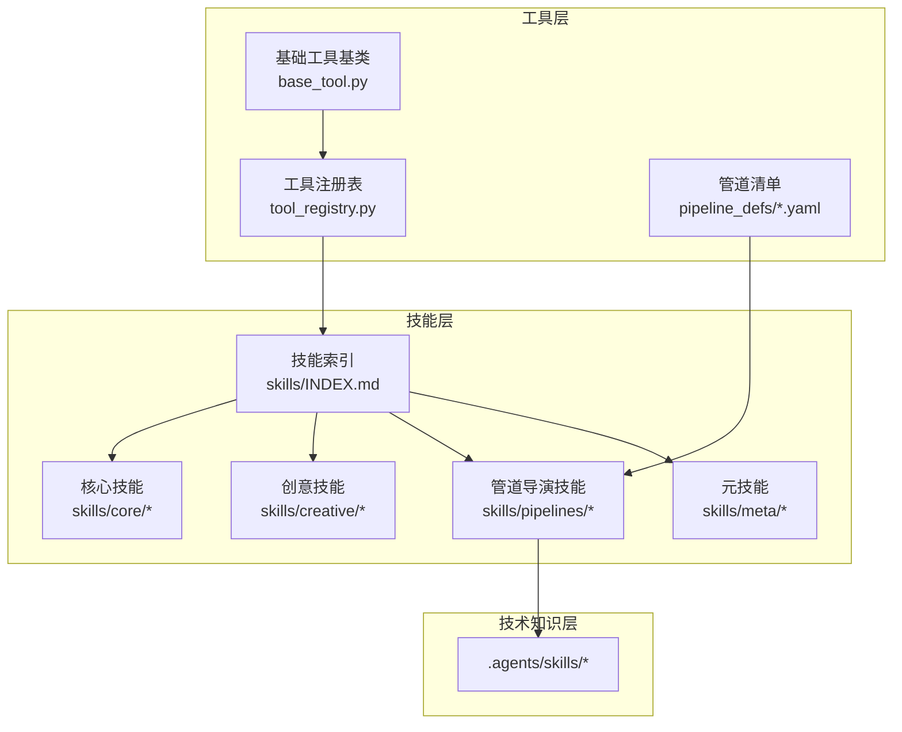
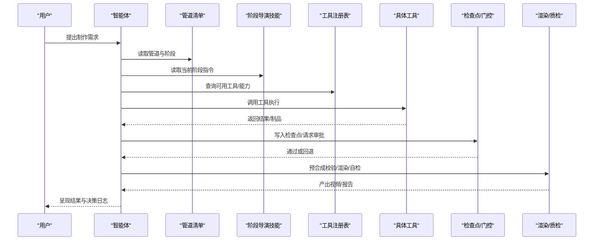
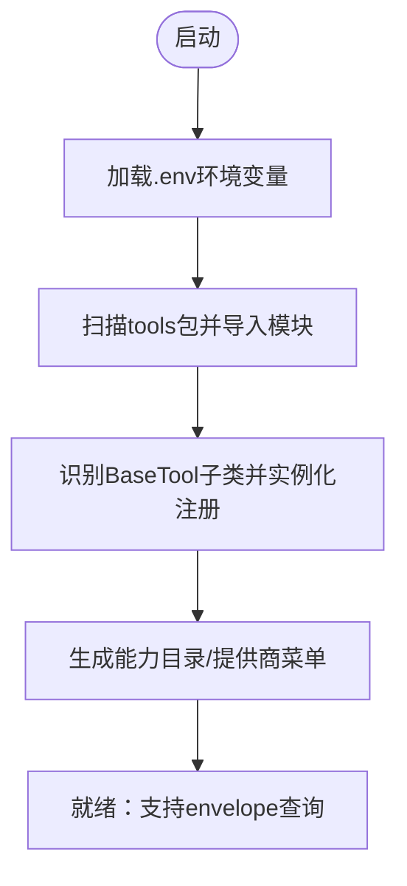
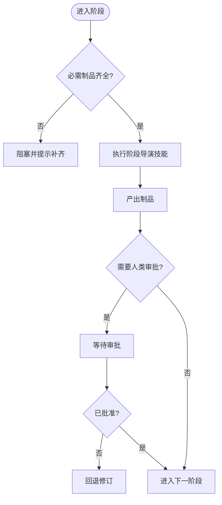
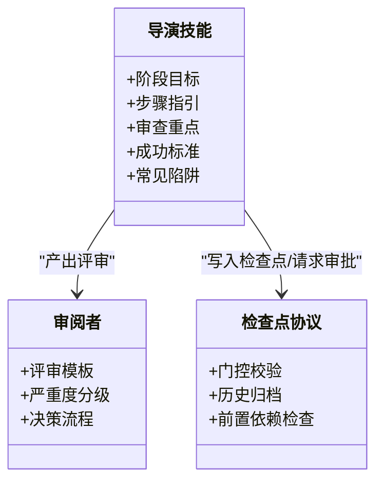
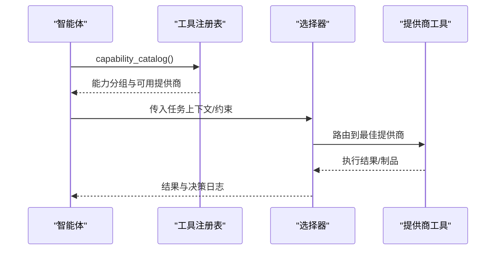

# AI技能系统

<cite>
**本文引用的文件**
- [skills/INDEX.md](file://skills/INDEX.md)
- [tools/tool_registry.py](file://tools/tool_registry.py)
- [tools/base_tool.py](file://tools/base_tool.py)
- [pipeline_defs/animated-explainer.yaml](file://pipeline_defs/animated-explainer.yaml)
- [skills/meta/skill-creator.md](file://skills/meta/skill-creator.md)
- [skills/meta/checkpoint-protocol.md](file://skills/meta/checkpoint-protocol.md)
- [skills/meta/reviewer.md](file://skills/meta/reviewer.md)
- [tests/contracts/test_runtime_presentation_contract.py](file://tests/contracts/test_runtime_presentation_contract.py)
- [tests/contracts/test_phase1_contracts.py](file://tests/contracts/test_phase1_contracts.py)
- [tests/contracts/test_pipeline_catalog.py](file://tests/contracts/test_pipeline_catalog.py)
- [tests/lib/test_checkpoint_prerequisites.py](file://tests/lib/test_checkpoint_prerequisites.py)
- [tests/lib/test_checkpoint_noncanonical_stage.py](file://tests/lib/test_checkpoint_noncanonical_stage.py)
- [README.md](file://README.md)
</cite>

## 目录
1. [简介](#简介)
2. [项目结构](#项目结构)
3. [核心组件](#核心组件)
4. [架构总览](#架构总览)
5. [详细组件分析](#详细组件分析)
6. [依赖关系分析](#依赖关系分析)
7. [性能与质量特性](#性能与质量特性)
8. [故障排查指南](#故障排查指南)
9. [结论](#结论)
10. [附录：开发、测试与发布流程](#附录开发测试与发布流程)

## 简介
本技术文档面向OpenMontage的AI技能系统，系统性说明700+技能文件的组织方式与分类体系（核心技能、创意技能、管道技能、元技能等），解释技能定义规范与元数据格式、技能发现与加载机制，深入解析导演技能的工作原理（阶段执行、质量保证、决策记录），并提供新技能创建、测试验证与发布的实践指南。同时说明技能与工具的关联机制和调用方式，以及版本管理与兼容性考虑，帮助开发者构建高质量、可维护的AI技能。

## 项目结构
OpenMontage采用“三层知识架构”组织技能与工具：
- 第一层（工具层）：tools/ + pipeline_defs/，描述“存在什么能力”，包含注册的工具与编排清单。
- 第二层（技能层）：skills/，描述“如何使用这些能力”，包括核心技能、创意技能、管道阶段导演技能、元技能等。
- 第三层（技术知识层）：.agents/skills/，提供外部技术的通用使用知识，按需加载。

图表来源
- [tools/tool_registry.py:118-134](file://tools/tool_registry.py#L118-L134)
- [tools/base_tool.py:227-372](file://tools/base_tool.py#L227-L372)
- [pipeline_defs/animated-explainer.yaml:1-48](file://pipeline_defs/animated-explainer.yaml#L1-L48)
- [skills/INDEX.md:7-31](file://skills/INDEX.md#L7-L31)

章节来源
- [skills/INDEX.md:7-31](file://skills/INDEX.md#L7-L31)
- [README.md:450-486](file://README.md#L450-L486)

## 核心组件
- 工具注册表（ToolRegistry）：自动发现并注册所有工具，按能力、提供商、状态、稳定性等维度查询，生成支持包络和能力目录，为智能体提供运行时可用能力视图。
- 基础工具（BaseTool）：统一工具契约，声明能力、依赖、资源需求、成本估算、重试策略、恢复支持、降级路径、Agent技能引用等；每个execute被自动注入事件埋点，便于Backlot看板追踪。
- 管道清单（Pipeline Manifests）：YAML定义管道名称、版本、阶段顺序、所需技能、审批门控、成功标准、子阶段等，是编排与校验的权威来源。
- 技能索引（skills/INDEX.md）：三层知识架构说明、能力家族与选择器模式、核心/创意/管道/元技能目录与触发条件、已安装Agent技能列表。
- 元技能：如技能创建者（skill-creator）、检查点协议（checkpoint-protocol）、审阅者（reviewer）等，贯穿全生命周期。

章节来源
- [tools/tool_registry.py:55-134](file://tools/tool_registry.py#L55-L134)
- [tools/base_tool.py:227-372](file://tools/base_tool.py#L227-L372)
- [pipeline_defs/animated-explainer.yaml:1-48](file://pipeline_defs/animated-explainer.yaml#L1-L48)
- [skills/INDEX.md:33-82](file://skills/INDEX.md#L33-L82)
- [skills/meta/skill-creator.md:17-41](file://skills/meta/skill-creator.md#L17-L41)

## 架构总览
OpenMontage以“智能体驱动”的方式工作：智能体读取管道清单与阶段导演技能，调用工具完成生产任务，并在每阶段进行自审、检查点保存、人类审批门控、预合成校验与渲染后自检，最终输出视频。

图表来源
- [pipeline_defs/animated-explainer.yaml:61-270](file://pipeline_defs/animated-explainer.yaml#L61-L270)
- [tools/tool_registry.py:198-220](file://tools/tool_registry.py#L198-L220)
- [tools/base_tool.py:148-224](file://tools/base_tool.py#L148-L224)
- [skills/meta/checkpoint-protocol.md:102-108](file://skills/meta/checkpoint-protocol.md#L102-L108)

## 详细组件分析

### 技能发现与加载机制
- 工具自动发现：注册表扫描tools包树，导入模块并注册所有继承自BaseTool的具体类，跳过base_tool与tool_registry自身。
- 环境加载：在导入时加载.env中的键值对，确保API密钥可用。
- 能力目录：按capability/provider分组，生成provider_menu与support_envelope，供智能体在预检时展示可用能力与缺失项。
- Agent技能引用：工具声明agent_skills[]，指向第三层技能，智能体在规划使用时按需加载对应技术知识。

图表来源
- [tools/tool_registry.py:86-134](file://tools/tool_registry.py#L86-L134)
- [tools/base_tool.py:25-60](file://tools/base_tool.py#L25-L60)
- [tools/tool_registry.py:212-230](file://tools/tool_registry.py#L212-L230)

章节来源
- [tools/tool_registry.py:118-134](file://tools/tool_registry.py#L118-L134)
- [tools/base_tool.py:25-60](file://tools/base_tool.py#L25-L60)
- [tools/tool_registry.py:212-230](file://tools/tool_registry.py#L212-L230)

### 管道清单与阶段执行
- 阶段顺序与产物：manifest中stages定义阶段名、所需输入制品、产出制品、可用工具、是否检查点、人类审批默认值、审查重点与成功标准。
- 审批门控：human_approval_default为真时，必须经人类批准才能继续；检查点写入会强制校验。
- 成功标准：每个阶段定义schema校验与业务指标，保证制品质量。
- 子阶段：如sample子阶段用于预览片段，具备独立审批与工具集。

图表来源
- [pipeline_defs/animated-explainer.yaml:61-270](file://pipeline_defs/animated-explainer.yaml#L61-L270)
- [tests/lib/test_checkpoint_prerequisites.py:29-46](file://tests/lib/test_checkpoint_prerequisites.py#L29-L46)

章节来源
- [pipeline_defs/animated-explainer.yaml:61-270](file://pipeline_defs/animated-explainer.yaml#L61-L270)
- [tests/lib/test_checkpoint_prerequisites.py:29-46](file://tests/lib/test_checkpoint_prerequisites.py#L29-L46)

### 导演技能工作原理（阶段执行、质量保证、决策记录）
- 阶段执行：每个阶段由对应的导演技能指导智能体如何操作工具、组合制品、应用风格规则。
- 质量保证：每阶段有review_focus与success_criteria；审阅者技能提供结构化评审模板与决策流程。
- 决策记录：每次关键选择（提供商、风格、预算、回退）均记录到decision_log，形成审计轨迹。
- 门控与回退：检查点协议确保门控不可绕过；超限保护防止无限循环。

图表来源
- [skills/meta/reviewer.md:79-116](file://skills/meta/reviewer.md#L79-L116)
- [skills/meta/checkpoint-protocol.md:102-108](file://skills/meta/checkpoint-protocol.md#L102-L108)
- [pipeline_defs/animated-explainer.yaml:61-270](file://pipeline_defs/animated-explainer.yaml#L61-L270)

章节来源
- [skills/meta/reviewer.md:79-116](file://skills/meta/reviewer.md#L79-L116)
- [skills/meta/checkpoint-protocol.md:102-108](file://skills/meta/checkpoint-protocol.md#L102-L108)
- [pipeline_defs/animated-explainer.yaml:61-270](file://pipeline_defs/animated-explainer.yaml#L61-L270)

### 技能与工具的关联机制与调用方式
- 工具声明能力与提供商：BaseTool字段包含capability、provider、capabilities、best_for、not_good_for、provider_matrix等。
- 选择器模式：对于多提供商能力族（如TTS、视频生成），使用selector工具路由到最佳提供商，基于需求、可用性、成本等评分。
- 智能体调用：智能体先读工具注册表的能力目录，再根据管道技能与阶段要求选择工具，必要时读取第三层技能了解API细节。
- 事件埋点：每个execute被包装，记录start/finish/error，便于看板可视化与成本统计。

图表来源
- [tools/tool_registry.py:212-230](file://tools/tool_registry.py#L212-L230)
- [tools/base_tool.py:227-372](file://tools/base_tool.py#L227-L372)
- [tools/base_tool.py:148-224](file://tools/base_tool.py#L148-L224)

章节来源
- [tools/tool_registry.py:212-230](file://tools/tool_registry.py#L212-L230)
- [tools/base_tool.py:227-372](file://tools/base_tool.py#L227-L372)
- [tools/base_tool.py:148-224](file://tools/base_tool.py#L148-L224)

### 技能分类与用途
- 核心技能：FFmpeg、Remotion、HyperFrames、WhisperX、字幕同步、色彩分级等，提供基础音视频处理能力。
- 创意技能：视频剪辑、增强策略、数据可视化、拼接、提示词工程、故事叙述、声音设计、字体排版、Manim使用、图像生成、3D世界生成、B-Roll规划、素材来源、场景检测、图表生成、音乐生成、背景移除、放大、人脸修复、口型同步、说话人生成、视频理解等。
- 管道技能：针对特定视频格式的完整生产指导（短片、长片、屏幕录制、动画、角色动画、电影感、混合、本地化配音、播客复用、演示等）。
- 元技能：Onboarding、Reviewer、Checkpoint Protocol、Skill Creator、Animation Runtime Selector、Taste Direction、Bespoke Composition等。

章节来源
- [skills/INDEX.md:83-129](file://skills/INDEX.md#L83-L129)
- [skills/INDEX.md:130-283](file://skills/INDEX.md#L130-L283)
- [skills/INDEX.md:283-330](file://skills/INDEX.md#L283-L330)

### 版本管理与兼容性
- 管道清单版本：每个manifest包含version字段，例如animated-explainer为2.0，确保向后兼容与演进。
- 阶段顺序与审批：manifest定义的stage顺序与human_approval_default是权威来源，测试保障其生效。
- 非标准阶段：某些管道扩展自定义阶段（如character-animation的character_design/rig_plan），检查点逻辑需防御性处理。
- 运行时选择契约：规划阶段技能必须讨论render_runtime与hyperframes，避免静默切换导致治理违规。

章节来源
- [pipeline_defs/animated-explainer.yaml:1-10](file://pipeline_defs/animated-explainer.yaml#L1-L10)
- [tests/contracts/test_pipeline_catalog.py:39-75](file://tests/contracts/test_pipeline_catalog.py#L39-L75)
- [tests/lib/test_checkpoint_noncanonical_stage.py:1-43](file://tests/lib/test_checkpoint_noncanonical_stage.py#L1-L43)
- [tests/contracts/test_runtime_presentation_contract.py:33-124](file://tests/contracts/test_runtime_presentation_contract.py#L33-L124)

## 依赖关系分析
- 工具与技能的耦合：工具通过agent_skills[]声明依赖的第三层技能；管道清单通过required_skills绑定第二阶段技能。
- 注册表为中心：所有能力发现、提供商菜单、支持包络均由注册表提供，避免硬编码。
- 测试契约：大量测试确保清单可加载、阶段顺序正确、审批门控有效、技能文件存在且足够详尽。

图表来源
- [tools/tool_registry.py:212-230](file://tools/tool_registry.py#L212-L230)
- [pipeline_defs/animated-explainer.yaml:29-48](file://pipeline_defs/animated-explainer.yaml#L29-L48)
- [tests/contracts/test_phase1_contracts.py:318-348](file://tests/contracts/test_phase1_contracts.py#L318-L348)

章节来源
- [tools/tool_registry.py:212-230](file://tools/tool_registry.py#L212-L230)
- [pipeline_defs/animated-explainer.yaml:29-48](file://pipeline_defs/animated-explainer.yaml#L29-L48)
- [tests/contracts/test_phase1_contracts.py:318-348](file://tests/contracts/test_phase1_contracts.py#L318-L348)

## 性能与质量特性
- 质量门控：人类审批门控强制执行；预合成校验阻止违反交付承诺的渲染；渲染后自检（ffprobe、帧采样、音频分析、字幕检查）确保输出可用。
- 幻灯片风险评分：六维分析防止“动画PPT”式输出。
- 源媒体检查：对用户提供的素材进行探测，避免幻觉。
- 提供商评分：七维评分（任务匹配、输出质量、控制、可靠性、成本、延迟、连续性）选择最佳提供商并记录决策日志。
- 预算治理：执行前估算、预留、结算；可配置观察/警告/封顶模式；单动作阈值审批与总预算上限。

章节来源
- [README.md:656-686](file://README.md#L656-L686)

## 故障排查指南
- 清单无法加载：若manifest不符合schema，系统会降级到默认阶段顺序，可能导致错误执行；应修复清单使其通过load_pipeline校验。
- 阶段前置缺失：后续阶段不能跳过前置阶段；若缺少必需制品，将抛出PREREQUISITE VIOLATION。
- 非标准阶段检查点：自定义阶段若无标准制品映射，检查点逻辑需防御性处理，避免KeyError。
- 运行时选择违规：规划或合成阶段未遵循render_runtime契约可能导致静默切换，测试会捕获此类问题。

章节来源
- [tests/contracts/test_pipeline_catalog.py:39-75](file://tests/contracts/test_pipeline_catalog.py#L39-L75)
- [tests/lib/test_checkpoint_prerequisites.py:29-46](file://tests/lib/test_checkpoint_prerequisites.py#L29-L46)
- [tests/lib/test_checkpoint_noncanonical_stage.py:46-62](file://tests/lib/test_checkpoint_noncanonical_stage.py#L46-L62)
- [tests/contracts/test_runtime_presentation_contract.py:33-124](file://tests/contracts/test_runtime_presentation_contract.py#L33-L124)

## 结论
OpenMontage的技能系统以“工具注册表+管道清单+技能层”为核心，结合严格的检查点与门控、多维质量评估与预算治理，实现了从创意到生产的端到端自动化与可控性。700+技能文件覆盖核心能力、创意技巧、管道导演与元技能，配合选择器与评分机制，使智能体能够在复杂环境中做出透明、可审计的决策。通过完善的测试契约与文档，开发者可以安全地扩展技能与工具，持续改进系统能力与质量。

## 附录：开发、测试与发布流程

### 新技能创建
- 确定类型与位置：阶段导演技能放在skills/pipelines/<pipeline>/；元技能放在skills/meta/；工具技能放在.agents/skills/；样式技能放在styles/。
- 编写技能：遵循“何时使用—先决条件—步骤—自评—提交—常见陷阱”的结构，包含示例、资源引用、评分量表与陷阱提醒。
- 注册与引用：更新skills/INDEX.md；若为管道阶段技能，确保manifest的stage.skill字段引用该技能；若为工具技能，放置到.agents/skills/<tool-name>/。
- 快速验证：确认文件结构良好、引用资源存在、步骤可操作、自评量表存在、无孤立引用。

章节来源
- [skills/meta/skill-creator.md:17-41](file://skills/meta/skill-creator.md#L17-L41)
- [skills/meta/skill-creator.md:42-113](file://skills/meta/skill-creator.md#L42-L113)

### 测试与验证
- 清单加载测试：确保所有shipped manifest可通过load_pipeline加载，阶段顺序与审批门控一致。
- 技能存在性测试：确保导演技能与元技能文件存在且长度满足最低要求。
- 运行时契约测试：确保规划阶段技能提及render_runtime与hyperframes，并包含对话契约关键词。
- 检查点前置测试：确保后续阶段不能跳过前置阶段，非标准阶段不会引发异常。

章节来源
- [tests/contracts/test_pipeline_catalog.py:39-75](file://tests/contracts/test_pipeline_catalog.py#L39-L75)
- [tests/contracts/test_phase1_contracts.py:318-348](file://tests/contracts/test_phase1_contracts.py#L318-L348)
- [tests/contracts/test_runtime_presentation_contract.py:33-124](file://tests/contracts/test_runtime_presentation_contract.py#L33-L124)
- [tests/lib/test_checkpoint_prerequisites.py:29-46](file://tests/lib/test_checkpoint_prerequisites.py#L29-L46)
- [tests/lib/test_checkpoint_noncanonical_stage.py:46-62](file://tests/lib/test_checkpoint_noncanonical_stage.py#L46-L62)

### 发布与兼容性
- 版本管理：为管道清单设置明确版本号，保持向后兼容；新增阶段或变更顺序需通过测试契约。
- 兼容性检查：确保新增工具在注册表中被发现，能力目录更新；若引入新提供商，需在技能中引用相应第三层技能。
- 质量门禁：发布前运行合同测试与QA集成测试，确保门控、检查点、事件埋点正常。

章节来源
- [pipeline_defs/animated-explainer.yaml:1-10](file://pipeline_defs/animated-explainer.yaml#L1-L10)
- [tools/tool_registry.py:118-134](file://tools/tool_registry.py#L118-L134)
- [tools/base_tool.py:227-372](file://tools/base_tool.py#L227-L372)