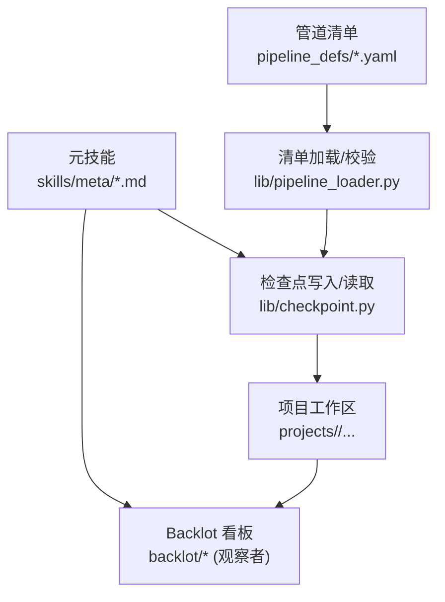
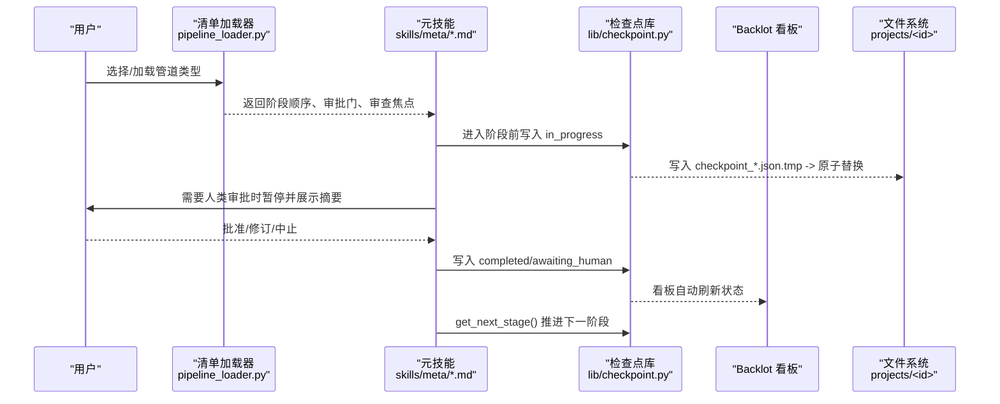
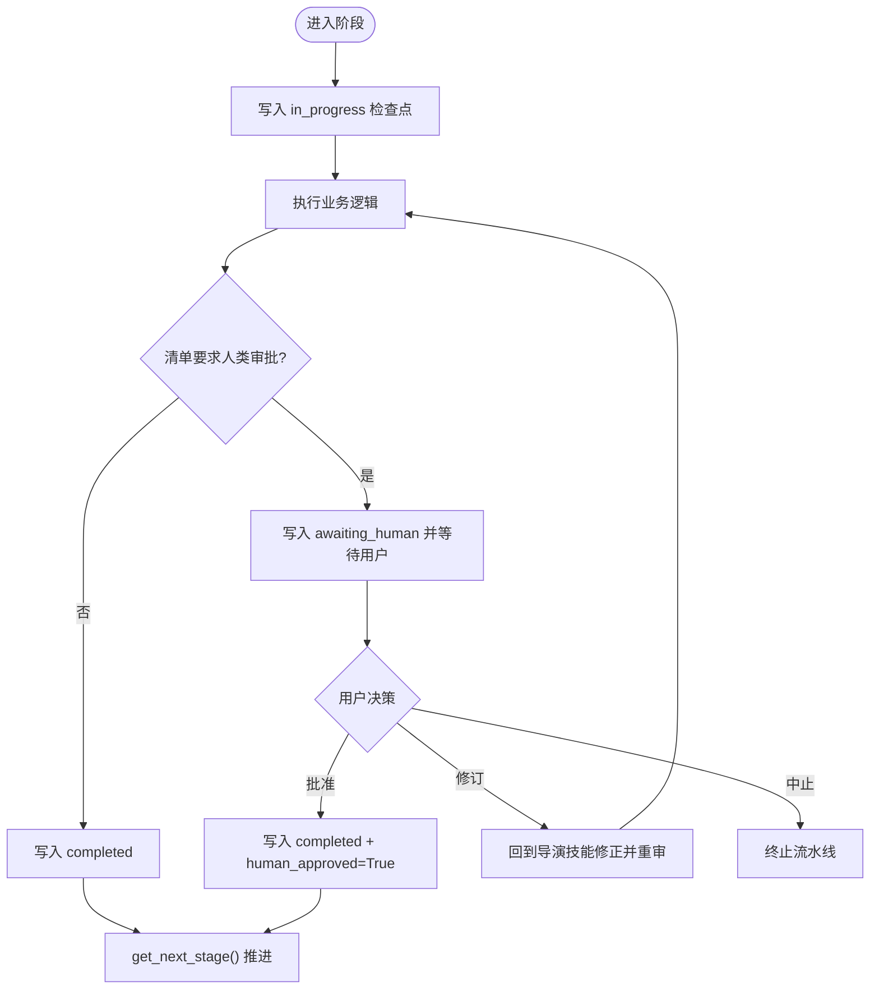
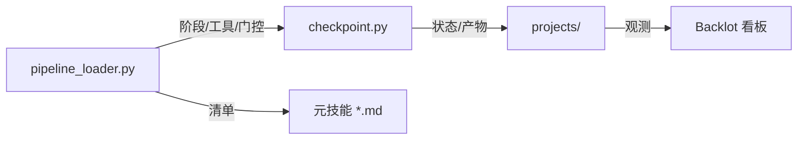

# 元技能

<cite>
**本文引用的文件**
- [checkpoint-protocol.md](file://skills/meta/checkpoint-protocol.md)
- [skill-creator.md](file://skills/meta/skill-creator.md)
- [capability-extension.md](file://skills/meta/capability-extension.md)
- [onboarding.md](file://skills/meta/onboarding.md)
- [reviewer.md](file://skills/meta/reviewer.md)
- [taste-direction.md](file://skills/meta/taste-direction.md)
- [checkpoint.py](file://lib/checkpoint.py)
- [pipeline_loader.py](file://lib/pipeline_loader.py)
- [cinematic.yaml](file://pipeline_defs/cinematic.yaml)
- [checkpoint.schema.json](file://schemas/checkpoints/checkpoint.schema.json)
</cite>

## 目录
1. [简介](#简介)
2. [项目结构](#项目结构)
3. [核心组件](#核心组件)
4. [架构总览](#架构总览)
5. [详细组件分析](#详细组件分析)
6. [依赖关系分析](#依赖关系分析)
7. [性能与可靠性考量](#性能与可靠性考量)
8. [故障排查指南](#故障排查指南)
9. [结论](#结论)
10. [附录：版本管理与兼容性策略](#附录：版本管理与兼容性策略)

## 简介
本技术文档聚焦 OpenMontage 的“元技能”体系，系统阐述如何以指令驱动的方式管理、编排和治理整个技能生态。围绕检查点协议、技能创建器、能力扩展、新手引导、质量审查、品味指导等关键元技能，说明它们如何协同工作，贯穿视频生产流水线从开发、测试到部署与维护的全生命周期。同时给出质量控制机制、审查流程、最佳实践与调试技巧，并总结版本管理与兼容性处理策略。

## 项目结构
OpenMontage 将“元技能”以 Markdown 形式定义在 skills/meta 下，配合 lib 中的持久化与加载逻辑，以及 pipeline_defs 中声明式管道清单，形成“配置即契约”的可审计、可恢复、可扩展的生产系统。

图表来源
- [checkpoint-protocol.md:1-247](file://skills/meta/checkpoint-protocol.md#L1-L247)
- [checkpoint.py:1-634](file://lib/checkpoint.py#L1-L634)
- [pipeline_loader.py:1-241](file://lib/pipeline_loader.py#L1-L241)
- [cinematic.yaml:1-288](file://pipeline_defs/cinematic.yaml#L1-L288)

章节来源
- [checkpoint-protocol.md:1-247](file://skills/meta/checkpoint-protocol.md#L1-L247)
- [checkpoint.py:1-634](file://lib/checkpoint.py#L1-L634)
- [pipeline_loader.py:1-241](file://lib/pipeline_loader.py#L1-L241)
- [cinematic.yaml:1-288](file://pipeline_defs/cinematic.yaml#L1-L288)

## 核心组件
- 检查点协议（Checkpoint Protocol）：定义何时、如何写检查点，如何处理人类审批门控、部分进度与恢复。
- 技能创建器（Skill Creator）：指导如何在运行期识别空白、设计并注册新技能，确保可复用与可维护。
- 能力扩展（Capability Extension）：为缺失能力提供受控扩展路径（脚本、Playbook、技能、工具封装），并强制决策日志记录。
- 新手引导（Onboarding）：首次会话的能力发现、环境分级、快速上手提示与工作流说明。
- 质量审查（Reviewer）：基于 CHAI 原则的严格自审流程，覆盖模式验证、成功标准、品味方向、交付承诺、源理解、幻灯片风险等。
- 品味指导（Taste Direction）：定义跨阶段一致的视觉/节奏/信息密度“品味合约”，贯穿提案、场景规划、资产生成、剪辑、合成与评审。

章节来源
- [checkpoint-protocol.md:1-247](file://skills/meta/checkpoint-protocol.md#L1-L247)
- [skill-creator.md:1-113](file://skills/meta/skill-creator.md#L1-L113)
- [capability-extension.md:1-116](file://skills/meta/capability-extension.md#L1-L116)
- [onboarding.md:1-194](file://skills/meta/onboarding.md#L1-L194)
- [reviewer.md:1-355](file://skills/meta/reviewer.md#L1-L355)
- [taste-direction.md:1-127](file://skills/meta/taste-direction.md#L1-L127)

## 架构总览
OpenMontage 的元技能通过“清单驱动 + 指令驱动 + 检查点契约”实现端到端治理：
- 清单（manifest）声明阶段顺序、所需技能、工具、是否要求人类审批、审查焦点与成功标准。
- 指令（meta skills）指导 Agent 在每个阶段做什么、如何自检、如何呈现给人类。
- 检查点（checkpoint）作为状态快照，支持失败恢复、人类门控、历史归档与审计追踪。
- Backlot 看板仅观察磁盘状态，不阻塞执行，用于可视化与人工审批。

图表来源
- [pipeline_loader.py:125-182](file://lib/pipeline_loader.py#L125-L182)
- [checkpoint-protocol.md:74-200](file://skills/meta/checkpoint-protocol.md#L74-L200)
- [checkpoint.py:422-564](file://lib/checkpoint.py#L422-L564)

## 详细组件分析

### 检查点协议与实现
- 协议要点
  - 依据清单决定是否需要检查点与人类审批。
  - 每个阶段完成后写入检查点；长任务阶段需频繁写入 in_progress 以支持断点续跑。
  - 人类审批门不可绕过；未获批准不得写入 completed。
  - 恢复流程：启动时读取 next_stage，若存在 in_progress 则按 partial_progress 继续。
- 实现要点
  - 写检查点前进行前置阶段完整性与审批状态校验。
  - 对已存在的完成态检查点进行归档至 history/，保留版本与门控轨迹。
  - 合并项目级 decision_log，并在相关产物中回写引用。
  - 使用临时文件+原子替换保证幂等与一致性。

图表来源
- [checkpoint-protocol.md:74-200](file://skills/meta/checkpoint-protocol.md#L74-L200)
- [checkpoint.py:284-346](file://lib/checkpoint.py#L284-L346)
- [checkpoint.py:422-564](file://lib/checkpoint.py#L422-L564)

章节来源
- [checkpoint-protocol.md:1-247](file://skills/meta/checkpoint-protocol.md#L1-L247)
- [checkpoint.py:1-634](file://lib/checkpoint.py#L1-L634)
- [checkpoint.schema.json:1-47](file://schemas/checkpoints/checkpoint.schema.json#L1-L47)

### 技能创建器
- 适用场景：当现有技能无法覆盖且该模式可复用时，动态创建新技能。
- 流程：识别空白 → 研究最佳实践 → 选择技能类型（阶段导演/元技能/工具技能/风格 Playbook）→ 编写结构化技能 → 注册索引 → 验证。
- 关键原则：教思考而非只教动作；包含示例与反例；引用具体资源；内置自评量表；记录常见陷阱；保持适度复杂度。

章节来源
- [skill-creator.md:1-113](file://skills/meta/skill-creator.md#L1-L113)

### 能力扩展
- 分类：一次性脚本、可复用视觉需求、缺失提供者、缺失知识。
- 规则：仅在无现成工具可用时允许写脚本；必须幂等、产出工件、记录决策日志、告知用户、禁止未经批准的对外 API 调用。
- 自定义 Playbook：基于最近模板生成，校验 schema 后保存至 styles/custom。
- 新技能（技术学习）：项目内记录 Layer 3 技能，建议后续提升为通用技能。
- 工具封装：继承 BaseTool，完整实现契约，注册后再用，首次付费调用需用户批准。

章节来源
- [capability-extension.md:1-116](file://skills/meta/capability-extension.md#L1-L116)

### 新手引导
- 目标：将 Agent 从被动执行者转为创意伙伴，快速展示能力边界与可用管线。
- 步骤：能力发现（支持信封/提供者菜单）→ 环境分级（零键/入门/标准/全量/GPU）→ 友好介绍 → 提供 3 个即用提示 → 简述工作流 → 回答常见问题。
- 运行时：明确报告 Remotion 与 HyperFrames 两种组合运行时可用性，不在引导阶段做运行时选择。

章节来源
- [onboarding.md:1-194](file://skills/meta/onboarding.md#L1-L194)

### 质量审查
- 原则：准确、完整、建设性（CHAI）。
- 流程：加载审查上下文 → Schema 校验 → 对照清单审查焦点 → 对照 Playbook 校验 → 评估成功标准 → 决策（通过/修订/带警告通过，最多两轮）→ 记录审查结果。
- 专项审查：品味方向对齐、参考视频一致性、幻灯片风险、交付承诺、源媒体理解、最终自检、组合创作模式（Atelier vs 模板）等。

章节来源
- [reviewer.md:1-355](file://skills/meta/reviewer.md#L1-L355)

### 品味指导
- 输出：taste_profile（设计阅读、三档刻度、配色纪律、版式变化、参考策略、反模式、质量门）。
- 过程：先定设计阅读 → 设定三档刻度 → 选择风格路径（已有 Playbook/自定义 Playbook/Atelier 艺术指导）→ 制定参考策略 → 贯穿下游各阶段。
- 反默认清单：避免泛化 AI 风格、过度装饰、文本主导等。

章节来源
- [taste-direction.md:1-127](file://skills/meta/taste-direction.md#L1-L127)

## 依赖关系分析
- 清单加载器负责解析与缓存管道清单，提供阶段顺序、工具集合、人类审批默认值、审查焦点等。
- 检查点库依赖清单进行门控与前置阶段校验，并对产物进行 schema 校验与归档。
- 元技能通过清单约束行为边界，并通过检查点持久化状态，供看板与恢复使用。

图表来源
- [pipeline_loader.py:125-182](file://lib/pipeline_loader.py#L125-L182)
- [checkpoint.py:422-564](file://lib/checkpoint.py#L422-L564)

章节来源
- [pipeline_loader.py:1-241](file://lib/pipeline_loader.py#L1-L241)
- [checkpoint.py:1-634](file://lib/checkpoint.py#L1-L634)

## 性能与可靠性考量
- 清单加载缓存：使用 LRU 缓存减少重复解析与校验开销。
- 检查点原子写入：先写临时文件再替换，避免中断导致的不一致。
- 历史归档：对非 in_progress 的检查点进行归档，便于回放与审计。
- 门控失败关闭：未知或错误的 pipeline_type 会拒绝放行，防止静默降级。
- 看板非阻塞：看板仅为观察者，不影响流水线执行。

[本节为通用指导，无需特定文件来源]

## 故障排查指南
- 门控违规：当清单要求人类审批却直接写入 completed 时会抛出门控违规错误。应改为 awaiting_human，待用户批准后重写为 completed。
- 前置阶段不完整：若前置阶段未完成或未获批，当前阶段无法推进。需补齐前置检查点。
- Schema 校验失败：产物不符合 JSON Schema 将被拒绝。请根据错误信息修复字段。
- 恢复问题：若处于 in_progress，应从 partial_progress 继续，避免重复生成已完成项。
- 清单加载失败：若清单不存在或格式错误，将回退到默认阶段列表并告警。需修复清单文件或名称。

章节来源
- [checkpoint.py:251-346](file://lib/checkpoint.py#L251-L346)
- [checkpoint.py:422-564](file://lib/checkpoint.py#L422-L564)
- [checkpoint.schema.json:1-47](file://schemas/checkpoints/checkpoint.schema.json#L1-L47)

## 结论
OpenMontage 的元技能体系以清单为契约、以指令为驱动、以检查点为状态中枢，实现了可恢复、可审计、可扩展的视频生产流水线。通过严格的审查与品味指导，系统在保障质量的同时兼顾灵活性与效率。结合新手引导与能力扩展，既能降低新用户门槛，又能满足高级用户的定制需求。

[本节为总结性内容，无需特定文件来源]

## 附录：版本管理与兼容性策略
- 清单版本：清单文件携带 version 字段，用于标识清单版本。新增阶段或变更阶段顺序时，应更新清单并确保向后兼容。
- 阶段顺序稳定性：清单加载器返回稳定顺序；当清单不可用时，回退到固定顺序以避免随机性。
- 产物 Schema 演进：检查点与产物均受 Schema 保护。新增字段需保持向后兼容，避免破坏旧产物读取。
- 门控策略：人类审批门由清单绑定，不能通过调用方参数放宽。如需调整，应在清单中显式修改。
- 历史归档：每次覆盖非 in_progress 检查点都会归档历史，便于版本对比与问题回溯。
- 运行时选择：提案阶段需记录 render_runtime 的选择与原因；合成阶段禁止静默切换，否则视为严重违规。

章节来源
- [cinematic.yaml:1-288](file://pipeline_defs/cinematic.yaml#L1-L288)
- [pipeline_loader.py:125-182](file://lib/pipeline_loader.py#L1-L182)
- [checkpoint.py:349-386](file://lib/checkpoint.py#L349-L386)
- [checkpoint.schema.json:1-47](file://schemas/checkpoints/checkpoint.schema.json#L1-L47)