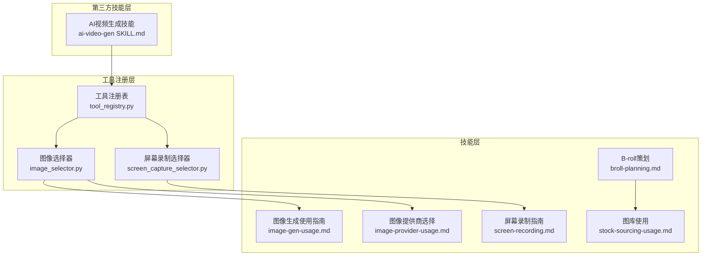
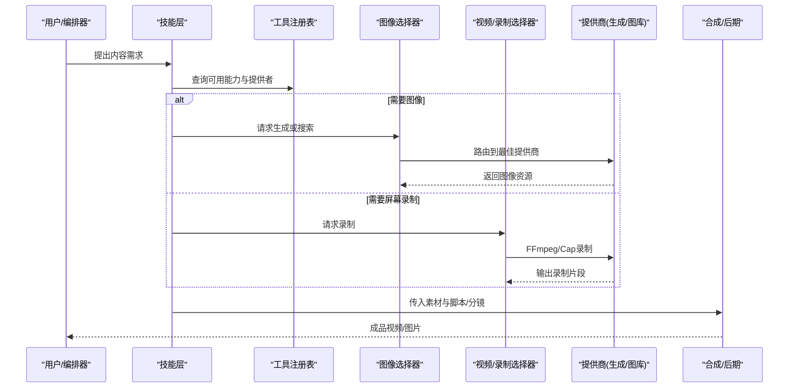
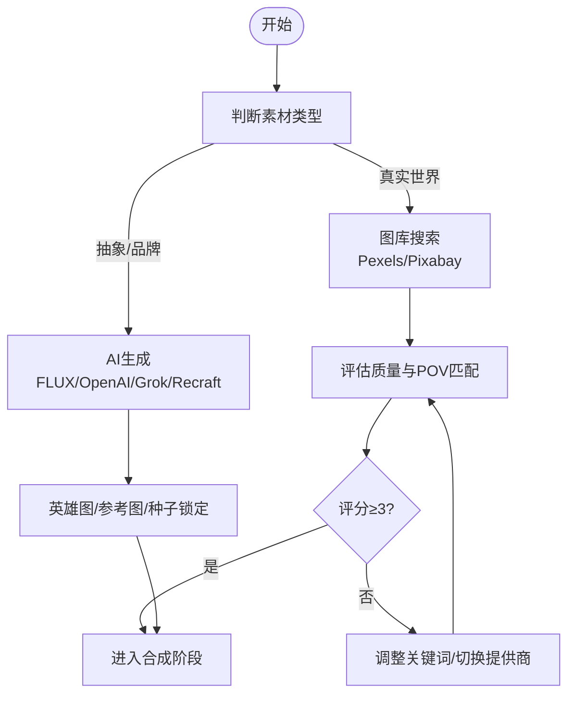
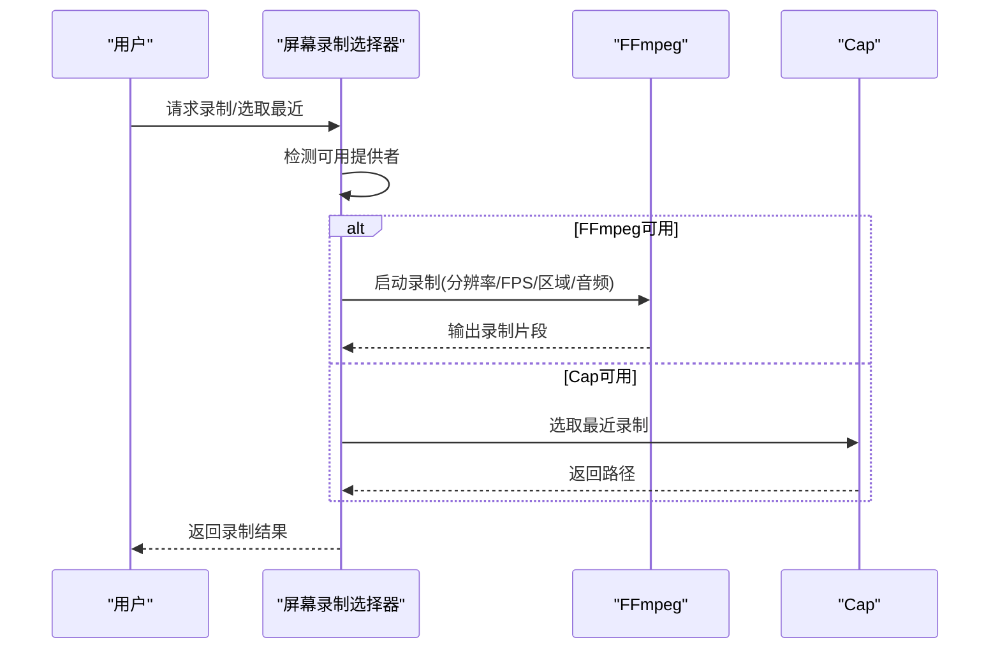
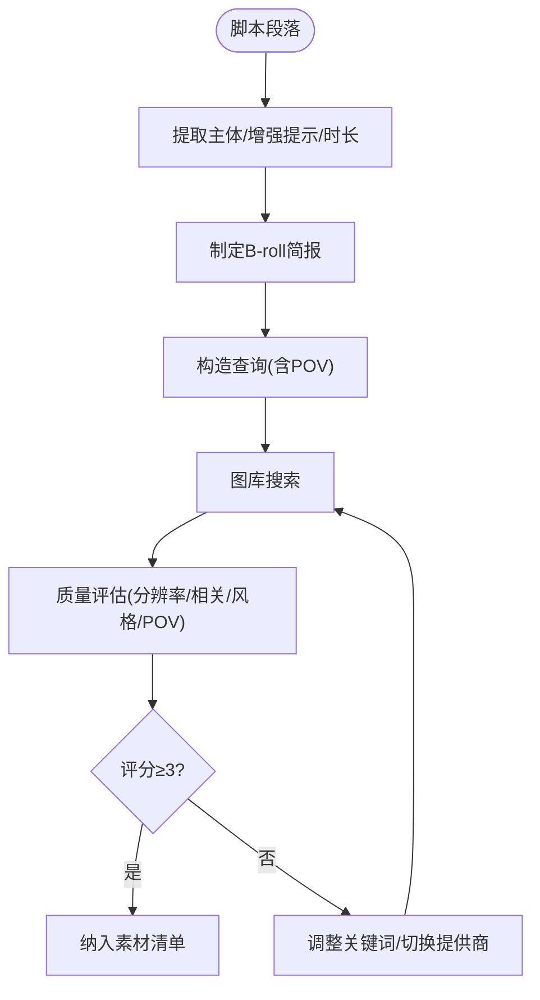
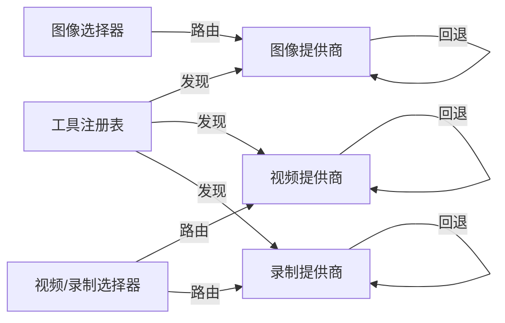

# 内容生成技能

<cite>
**本文引用的文件**
- [skills/INDEX.md](file://skills/INDEX.md)
- [skills/creative/image-gen-usage.md](file://skills/creative/image-gen-usage.md)
- [skills/creative/image-provider-usage.md](file://skills/creative/image-provider-usage.md)
- [skills/creative/screen-recording.md](file://skills/creative/screen-recording.md)
- [skills/creative/broll-planning.md](file://skills/creative/broll-planning.md)
- [skills/creative/stock-sourcing-usage.md](file://skills/creative/stock-sourcing-usage.md)
- [tools/tool_registry.py](file://tools/tool_registry.py)
- [tools/graphics/image_selector.py](file://tools/graphics/image_selector.py)
- [tools/capture/screen_capture_selector.py](file://tools/capture/screen_capture_selector.py)
- [tools/capture/screen_recorder.py](file://tools/capture/screen_recorder.py)
- [.agents/skills/ai-video-gen/SKILL.md](file://.agents/skills/ai-video-gen/SKILL.md)
- [tools/video/kling_video.py](file://tools/video/kling_video.py)
- [tools/video/seedance_video.py](file://tools/video/seedance_video.py)
- [tools/video/kling_official_video.py](file://tools/video/kling_official_video.py)
</cite>

## 目录
1. [简介](#简介)
2. [项目结构](#项目结构)
3. [核心组件](#核心组件)
4. [架构总览](#架构总览)
5. [详细组件分析](#详细组件分析)
6. [依赖关系分析](#依赖关系分析)
7. [性能与成本考量](#性能与成本考量)
8. [故障排查指南](#故障排查指南)
9. [结论](#结论)
10. [附录](#附录)

## 简介
本技术文档面向OpenMontage的内容生成技能，覆盖图像生成、素材来源（图库与AI生成）、屏幕录制、B-roll策划与收集、自动化流程与批量处理，以及素材管理与版权合规最佳实践。文档以“三层知识架构”为骨架：工具注册层（能力发现）、技能层（OpenMontage工作流）、第三方API知识层（按需加载），确保在复杂多提供商生态中稳定、可演进地组织内容生产。

## 项目结构
OpenMontage将“能力—技能—实现”分层管理：
- 工具注册层：集中发现并暴露所有工具的能力、状态、依赖、回退策略等元信息。
- 技能层：按领域组织创作方法、流程规范与质量门禁（如图像生成、屏幕录制、B-roll策划）。
- 第三方技能层：针对具体API或技术的通用知识，按需加载。

图表来源
- [tools/tool_registry.py:118-134](file://tools/tool_registry.py#L118-L134)
- [tools/graphics/image_selector.py:185-195](file://tools/graphics/image_selector.py#L185-L195)
- [tools/capture/screen_capture_selector.py:285-319](file://tools/capture/screen_capture_selector.py#L285-L319)
- [skills/INDEX.md:8-31](file://skills/INDEX.md#L8-L31)

章节来源
- [skills/INDEX.md:8-31](file://skills/INDEX.md#L8-L31)
- [tools/tool_registry.py:118-134](file://tools/tool_registry.py#L118-L134)

## 核心组件
- 工具注册表：自动发现工具、提供按能力/状态/稳定性查询、支持回退工具链。
- 图像选择器：统一入口，根据任务类型、可用性与偏好路由到生成或图库提供商。
- 屏幕录制选择器：统一入口，根据环境可用性选择FFmpeg或Cap进行录制，并支持选取最近录制。
- AI视频生成技能：聚合多个网关（fal.ai、HeyGen、Kling官方、Gemini Omni）的提示词与参数规范，指导高质量视频生成。

章节来源
- [tools/tool_registry.py:141-196](file://tools/tool_registry.py#L141-L196)
- [tools/graphics/image_selector.py:15-38](file://tools/graphics/image_selector.py#L15-L38)
- [tools/capture/screen_capture_selector.py:285-319](file://tools/capture/screen_capture_selector.py#L285-L319)
- [.agents/skills/ai-video-gen/SKILL.md:1-28](file://.agents/skills/ai-video-gen/SKILL.md#L1-L28)

## 架构总览
内容生成的端到端流程由“需求→资产规划→素材获取→合成→发布”构成，各阶段通过技能层指引，底层由工具注册层调度具体实现。

图表来源
- [tools/tool_registry.py:118-134](file://tools/tool_registry.py#L118-L134)
- [tools/graphics/image_selector.py:185-195](file://tools/graphics/image_selector.py#L185-L195)
- [tools/capture/screen_capture_selector.py:285-319](file://tools/capture/screen_capture_selector.py#L285-L319)

## 详细组件分析

### 图像生成与提供商选择
- 分辨率与一致性：FLUX要求尺寸为16的倍数，最大4MP；推荐使用“英雄图+参考图”策略保持系列画面一致。
- 提示构建：三段式（场景风格方向 + 剧本视觉锚点 + 具体场景描述），避免直接复制模板前缀导致同质化。
- 批量策略：先高质量出英雄图，再用klein快速迭代，最后pro定稿；注意并发限制与预算。
- 提供商选择：根据场景类型优先选择图库（真实世界）或生成（抽象概念/品牌定制），必要时混合但需色彩分级统一。

图表来源
- [skills/creative/image-gen-usage.md:16-61](file://skills/creative/image-gen-usage.md#L16-L61)
- [skills/creative/image-gen-usage.md:63-127](file://skills/creative/image-gen-usage.md#L63-L127)
- [skills/creative/image-gen-usage.md:138-149](file://skills/creative/image-gen-usage.md#L138-L149)
- [skills/creative/image-provider-usage.md:32-47](file://skills/creative/image-provider-usage.md#L32-L47)
- [skills/creative/image-provider-usage.md:109-125](file://skills/creative/image-provider-usage.md#L109-L125)

章节来源
- [skills/creative/image-gen-usage.md:16-149](file://skills/creative/image-gen-usage.md#L16-L149)
- [skills/creative/image-provider-usage.md:6-47](file://skills/creative/image-provider-usage.md#L6-L47)
- [tools/graphics/image_selector.py:15-38](file://tools/graphics/image_selector.py#L15-L38)

### 屏幕录制技巧与自动化
- 录制设置：推荐4K录制、1080p交付；UI/滚动用60fps，静态代码30fps；IDE字体≥18px，暗色主题更佳。
- 光标与缩放：放大光标并加高亮；代码聚焦1.5-2x，过渡0.8s ease-in-out；停留至少3秒再移动。
- 后处理：速度曲线加速导航与重复动作；删除>1.5s死区；音频降噪、高通滤波、压缩至-16 LUFS。
- 自动化：通过屏幕录制选择器自动检测FFmpeg/Cap可用性，执行录制或选取最近录制；支持区域捕获、帧率、音频开关。

图表来源
- [tools/capture/screen_capture_selector.py:285-319](file://tools/capture/screen_capture_selector.py#L285-L319)
- [tools/capture/screen_recorder.py:117-197](file://tools/capture/screen_recorder.py#L117-L197)
- [skills/creative/screen-recording.md:18-124](file://skills/creative/screen-recording.md#L18-L124)

章节来源
- [skills/creative/screen-recording.md:18-124](file://skills/creative/screen-recording.md#L18-L124)
- [tools/capture/screen_capture_selector.py:285-319](file://tools/capture/screen_capture_selector.py#L285-L319)
- [tools/capture/screen_recorder.py:117-197](file://tools/capture/screen_recorder.py#L117-L197)

### B-roll策划与收集
- 决策矩阵：真实世界镜头优先图库；抽象/品牌/特定设备优先生成；运动/自然动态优先图库。
- 从脚本提取需求：逐段识别主体、增强提示、具体引用、时长；输出B-roll简报（场景、来源、关键词、时长、方向、情绪、回退方案）。
- 查询构造：2-4个关键词，前置主体，加入POV（航拍、OTS、微距、手持、固定机位等）；失败时尝试同义词或另一图库。
- 质量评估：分辨率、相关性、风格兼容、无水印、构图、POV匹配；视频还需时长、运动平滑、帧率；评分阈值≥3才采用。
- 失败升级：换关键词→换图库→AI生成→必要时询问用户。

图表来源
- [skills/creative/broll-planning.md:12-27](file://skills/creative/broll-planning.md#L12-L27)
- [skills/creative/broll-planning.md:28-51](file://skills/creative/broll-planning.md#L28-L51)
- [skills/creative/broll-planning.md:53-84](file://skills/creative/broll-planning.md#L53-L84)
- [skills/creative/broll-planning.md:86-124](file://skills/creative/broll-planning.md#L86-L124)

章节来源
- [skills/creative/broll-planning.md:12-124](file://skills/creative/broll-planning.md#L12-L124)

### 图库使用与版权合规
- 提供商对比：Pexels适合高质量摄影与视频、颜色过滤；Pixabay适合分类过滤、插画矢量、动画片段。
- 参数要点：尺寸、方向、颜色、类别、编辑器精选、安全搜索、时长过滤；注意URL过期与分辨率限制。
- 版权与归属：Pexels/Pixabay免费商用无需署名，但建议记录摄影师、来源链接与许可证；本地3D资产目录强制CC0声明校验。
- 集成方式：与生成素材同等对待，写入资产清单（ID、类型、路径、来源工具、场景ID、成本、元数据）。

章节来源
- [skills/creative/stock-sourcing-usage.md:6-96](file://skills/creative/stock-sourcing-usage.md#L6-L96)
- [skills/creative/stock-sourcing-usage.md:97-128](file://skills/creative/stock-sourcing-usage.md#L97-L128)
- [tools/video/stock_sources/loc.py:121-157](file://tools/video/stock_sources/loc.py#L121-L157)
- [tools/graphics/threejs_world.py:240-267](file://tools/graphics/threejs_world.py#L240-L267)

### AI视频生成与多网关
- 网关与提供商：fal.ai（Seedance 2.0、Kling、MiniMax、VEO）、HeyGen（VEO 3.1、Kling Pro、Sora v2、Runway Gen-4）、Kling官方（Classic/Turbo/Omni）、Gemini Omni Flash（对话式编辑）。
- 首选默认：配置了高级网关时优先Seedance 2.0（原生同步音频、多镜头、导演级控制、口型同步）。
- 工具示例：Kling视频（电影感B-roll、高保真运动）、Seedance视频（高质量剪辑、音频生成）、Kling官方（直连API、模型控制）。

章节来源
- [.agents/skills/ai-video-gen/SKILL.md:1-28](file://.agents/skills/ai-video-gen/SKILL.md#L1-L28)
- [tools/video/kling_video.py:27-58](file://tools/video/kling_video.py#L27-L58)
- [tools/video/seedance_video.py:367-402](file://tools/video/seedance_video.py#L367-L402)
- [tools/video/kling_official_video.py:56-78](file://tools/video/kling_official_video.py#L56-L78)

## 依赖关系分析
- 工具注册表驱动能力发现：任何新增提供商只需实现BaseTool子类并声明capability/provider，注册表自动纳入选择器。
- 选择器解耦业务与实现：上层技能只关心“需要什么”，下层选择器决定“用什么”。
- 回退机制：当首选提供商不可用时，自动切换到备选（如FFmpeg不可用则尝试Cap；图像生成失败则回退到其他提供商或图库）。

图表来源
- [tools/tool_registry.py:118-134](file://tools/tool_registry.py#L118-L134)
- [tools/graphics/image_selector.py:185-195](file://tools/graphics/image_selector.py#L185-L195)
- [tools/capture/screen_capture_selector.py:285-319](file://tools/capture/screen_capture_selector.py#L285-L319)

章节来源
- [tools/tool_registry.py:118-196](file://tools/tool_registry.py#L118-L196)

## 性能与成本考量
- 图像生成：FLUX并发上限约24；英雄图高质量、迭代用klein、定稿用pro；预算估算示例（8张约$0.43）。
- 屏幕录制：4K录制更利于后期缩放；合理FPS减少体积；速度曲线与死区裁剪提升观感与效率。
- 视频生成：优先Seedance 2.0以获得更高品质与更少后期；不同网关成本差异大，需结合预算选择。
- 图库：优先免费且高质量源；注意速率限制与下载时效；使用时长过滤减少带宽浪费。

[本节为通用指导，不直接分析具体文件]

## 故障排查指南
- 图像生成失败：检查提供商可用性、提示是否包含文本（应避免）、分辨率是否为16倍数、并发是否超限；启用回退到其他提供商或图库。
- 屏幕录制失败：确认FFmpeg/Cap安装与运行状态；检查区域坐标与显示器索引；若均不可用，提示安装必要依赖。
- 视频生成失败：核对环境变量（FAL_KEY/HEYGEN_API_KEY/KLING_API_KEY/GEMINI_API_KEY）；根据错误信息切换网关或模型版本。
- 版权合规问题：确保图库来源与许可证正确记录；本地3D资产目录必须声明CC0；避免未授权商用。

章节来源
- [tools/capture/screen_capture_selector.py:285-319](file://tools/capture/screen_capture_selector.py#L285-L319)
- [tools/capture/screen_recorder.py:186-197](file://tools/capture/screen_recorder.py#L186-L197)
- [.agents/skills/ai-video-gen/SKILL.md:1-28](file://.agents/skills/ai-video-gen/SKILL.md#L1-L28)
- [tools/graphics/threejs_world.py:240-267](file://tools/graphics/threejs_world.py#L240-L267)

## 结论
OpenMontage通过“工具注册—技能指引—提供商路由”的分层架构，实现了内容生成的高内聚、低耦合与可扩展性。借助统一的图像与录制选择器、完善的B-roll策划方法与图库使用规范，配合AI视频多网关与严格的版权合规校验，能够在保证质量的同时兼顾成本与效率。建议在项目中持续遵循英雄图策略、POV导向的图库查询、速度曲线与死区裁剪的最佳实践，并在每个阶段进行质量门禁与回退处理，以确保最终成品的稳定性与一致性。

[本节为总结，不直接分析具体文件]

## 附录
- 关键能力族与工具发现：通过工具注册表查询能力目录，避免硬编码工具列表。
- 风格剧本与一致性：将剧本的视觉语言提炼为短锚点，适配每场戏；对图库与生成素材统一色彩分级。
- 资产清单与溯源：记录来源工具、提供商、许可证与来源链接，便于审计与复用。

[本节为补充说明，不直接分析具体文件]