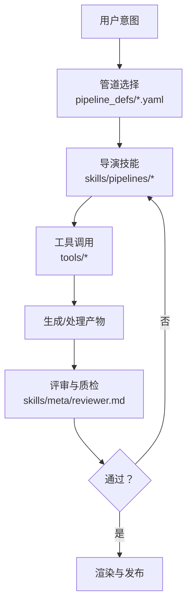
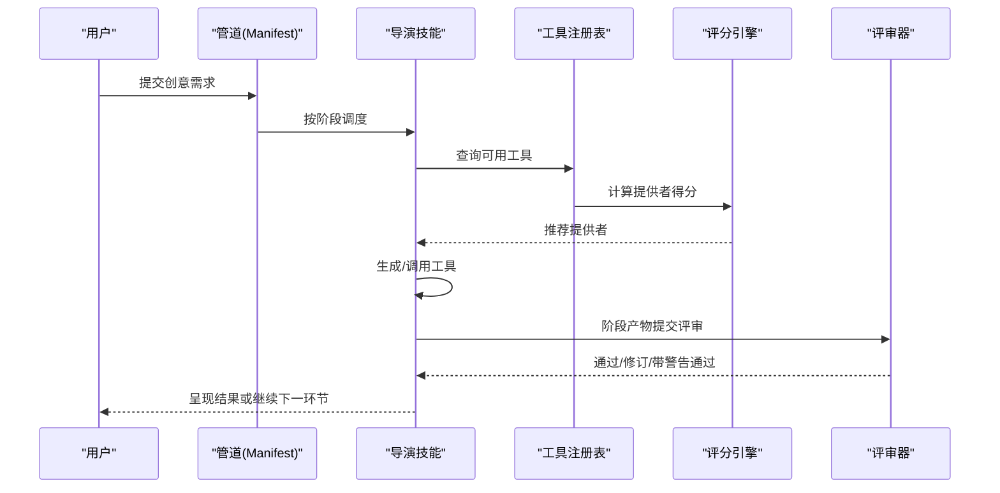
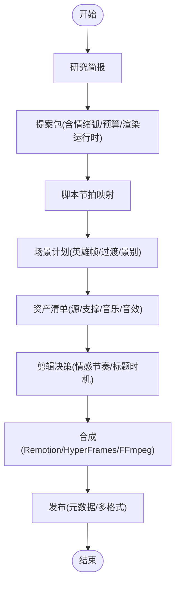
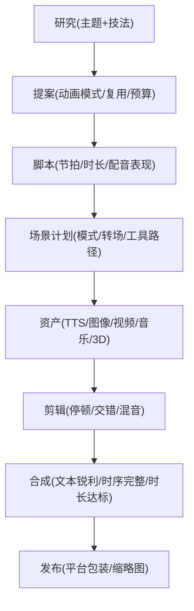
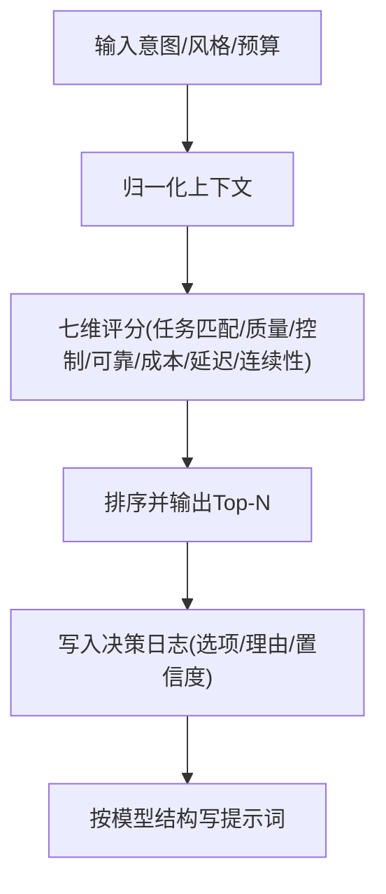
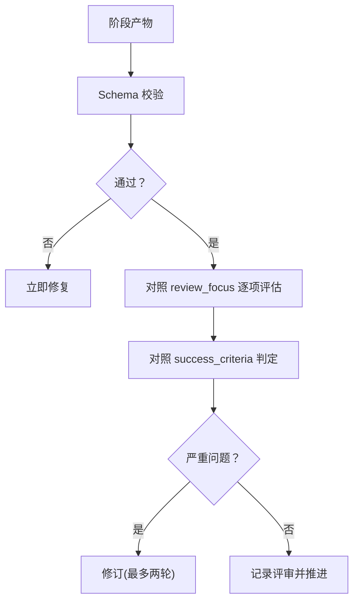
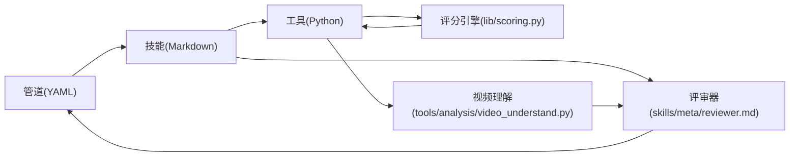

# 创意技能

<cite>
**本文引用的文件**
- [README.md](file://README.md)
- [skills/INDEX.md](file://skills/INDEX.md)
- [skills/creative/storytelling.md](file://skills/creative/storytelling.md)
- [skills/creative/video-editing.md](file://skills/creative/video-editing.md)
- [skills/creative/sound-design.md](file://skills/creative/sound-design.md)
- [skills/creative/animation-pipeline.md](file://skills/creative/animation-pipeline.md)
- [skills/creative/video-gen-prompting.md](file://skills/creative/video-gen-prompting.md)
- [skills/creative/prompting/seedance-prompting.md](file://skills/creative/prompting/seedance-prompting.md)
- [skills/creative/prompting/grok-prompting.md](file://skills/creative/prompting/grok-prompting.md)
- [skills/creative/prompting/sora-prompting.md](file://skills/creative/prompting/sora-prompting.md)
- [skills/creative/prompting/veo-prompting.md](file://skills/creative/prompting/veo-prompting.md)
- [skills/creative/prompting/ltx-prompting.md](file://skills/creative/prompting/ltx-prompting.md)
- [pipeline_defs/cinematic.yaml](file://pipeline_defs/cinematic.yaml)
- [pipeline_defs/animation.yaml](file://pipeline_defs/animation.yaml)
- [skills/meta/reviewer.md](file://skills/meta/reviewer.md)
- [lib/scoring.py](file://lib/scoring.py)
- [tools/analysis/video_understand.py](file://tools/analysis/video_understand.py)
</cite>

## 目录
1. [引言](#引言)
2. [项目结构](#项目结构)
3. [核心组件](#核心组件)
4. [架构总览](#架构总览)
5. [详细组件分析](#详细组件分析)
6. [依赖关系分析](#依赖关系分析)
7. [性能与成本考量](#性能与成本考量)
8. [故障排查指南](#故障排查指南)
9. [结论](#结论)
10. [附录：模板与最佳实践](#附录模板与最佳实践)

## 引言
本技术文档聚焦 OpenMontage 的“创意技能”体系，覆盖电影化制作、故事叙述、视频编辑、声音设计、动画流水线等关键工作流。同时系统梳理提示词工程技巧，涵盖 Grok、Hunyuan、LTX、Seedance、Sora、Veo 等多模型的优化策略，并说明如何结合多种 AI 工具实现高质量内容创作。文档还给出创意决策流程、质量保证机制、效果评估与优化建议，帮助创作者在可控成本下稳定产出专业级作品。

## 项目结构
OpenMontage 以“管道驱动 + 技能知识层”的方式组织创意能力：
- 管道定义（YAML）：规定阶段、产物、工具、质量门与审批点
- 技能（Markdown）：指导代理在每个阶段如何执行、如何自检与评审
- 工具（Python）：注册到统一注册表，提供可组合的生产能力
- 风格与样式：通过样式剧本约束视觉语言与音频规范
- 评测与治理：评分引擎、交付承诺校验、自审与审计日志

**图表来源**
- [pipeline_defs/cinematic.yaml:60-288](file://pipeline_defs/cinematic.yaml#L60-L288)
- [pipeline_defs/animation.yaml:62-300](file://pipeline_defs/animation.yaml#L62-L300)
- [skills/meta/reviewer.md:21-129](file://skills/meta/reviewer.md#L21-L129)

**章节来源**
- [README.md:450-486](file://README.md#L450-L486)
- [skills/INDEX.md:5-32](file://skills/INDEX.md#L5-L32)

## 核心组件
- 创意技能索引：统一列出 Layer 2 技能与触发条件，明确各技能的职责与依赖
- 故事叙述：基于研究背书的叙事结构与节奏控制，强调“非主观描述”原则
- 视频编辑：口播/素材剪辑原则、J/L 切、节奏与平台适配
- 声音设计：响度目标、混音链、AI TTS 处理、平台规格对齐
- 动画流水线：Remotion vs HyperFrames 选择、帧率/缓动/转场/导出规范
- 提示词工程：通用五要素公式与各模型专属结构、长度与迭代策略
- 评分与选择：七维加权评分引擎，自动路由至最优提供者
- 评审与质检：每阶段强制评审、交付承诺校验、幻灯片风险评分、最终自审

**章节来源**
- [skills/INDEX.md:83-143](file://skills/INDEX.md#L83-L143)
- [skills/creative/storytelling.md:7-118](file://skills/creative/storytelling.md#L7-L118)
- [skills/creative/video-editing.md:17-62](file://skills/creative/video-editing.md#L17-L62)
- [skills/creative/sound-design.md:6-142](file://skills/creative/sound-design.md#L6-L142)
- [skills/creative/animation-pipeline.md:7-147](file://skills/creative/animation-pipeline.md#L7-L147)
- [skills/creative/video-gen-prompting.md:28-72](file://skills/creative/video-gen-prompting.md#L28-L72)
- [lib/scoring.py:21-108](file://lib/scoring.py#L21-L108)
- [skills/meta/reviewer.md:21-129](file://skills/meta/reviewer.md#L21-L129)

## 架构总览
OpenMontage 采用“三层知识架构”：
- 第一层：工具与管道（可执行能力与编排）
- 第二层：技能（OpenMontage 约定与质量门槛）
- 第三层：外部技术知识包（按需加载）

**图表来源**
- [skills/INDEX.md:5-32](file://skills/INDEX.md#L5-L32)
- [lib/scoring.py:373-542](file://lib/scoring.py#L373-L542)
- [skills/meta/reviewer.md:21-129](file://skills/meta/reviewer.md#L21-L129)

## 详细组件分析

### 电影化制作（Cinematic Pipeline）
- 阶段：研究 → 提案 → 脚本 → 场景计划 → 资产 → 剪辑 → 合成 → 发布
- 关键质量门：情感节奏、色彩一致性、音频动态、交付承诺、渲染运行时锁定
- 典型工具：视频选择器、图像选择器、音乐/音效、颜色分级、字幕生成、三维世界/资产

**图表来源**
- [pipeline_defs/cinematic.yaml:60-288](file://pipeline_defs/cinematic.yaml#L60-L288)

**章节来源**
- [pipeline_defs/cinematic.yaml:60-288](file://pipeline_defs/cinematic.yaml#L60-L288)

### 动画流水线（Animation Pipeline）
- 阶段：研究 → 提案 → 脚本 → 场景计划 → 资产 → 剪辑 → 合成 → 发布
- 关键质量门：动画模式选择、复用策略、文本可读性、时长误差、渲染运行时一致性
- 典型工具：数学动画、图表生成、代码片段、Three.js 世界/资产目录、音乐生成

**图表来源**
- [pipeline_defs/animation.yaml:62-300](file://pipeline_defs/animation.yaml#L62-L300)

**章节来源**
- [pipeline_defs/animation.yaml:62-300](file://pipeline_defs/animation.yaml#L62-L300)

### 故事叙述与节奏
- 解释型视频弧线：钩子 → 张力 → 概念1/2/3 → 证明 → 含义 → 收尾
- 反主观规则：用“可见原因”替代情绪形容词，确保像素级可执行
- 镜头意图：每个节拍附一行镜头意图，便于场景导演扩展为五要素提示词
- 节奏规则：语速、新元素频率、概念密度、模式中断、刻意留白

**章节来源**
- [skills/creative/storytelling.md:7-118](file://skills/creative/storytelling.md#L7-L118)
- [skills/creative/storytelling.md:143-167](file://skills/creative/storytelling.md#L143-L167)

### 视频编辑原则
- 剪什么：填充词、错误开头、死寂、离题、重复
- 不剪什么：呼吸停顿、强调停顿、反应桥接
- 切法：J-cut、L-cut、硬切；短/中/长片节奏差异
- 编辑决策结构：cuts、overlays、subtitles、music、transitions

**章节来源**
- [skills/creative/video-editing.md:17-62](file://skills/creative/video-editing.md#L17-L62)

### 声音设计与混音
- 响度目标：对话 -12dB 峰值、音乐床 -30~-20dB、SFX -18~-12dB、真峰值不超过 -1.5dBTP
- 平台目标：YouTube/TikTok/IG -14 LUFS；Podcast -16 LUFS
- AI TTS 处理链：高通滤波、EQ、压缩、去齿音、限制器
- 混音要点：对白优先、音乐避让、SFX 前置 10-20ms、手机扬声器测试

**章节来源**
- [skills/creative/sound-design.md:6-142](file://skills/creative/sound-design.md#L6-L142)

### 动画与运动图形
- 运行时选择：Remotion（React/数据驱动）vs HyperFrames（HTML/GSAP/动效主导）
- 帧率/缓动/转场：默认 30fps、避免线性、保持转场一致性与语义
- 构图与色彩：三分法、层级、留白、最多 5 色
- 导出：H.264 CRF 18-20；中间态 ProRes 422/4444

**章节来源**
- [skills/creative/animation-pipeline.md:7-147](file://skills/creative/animation-pipeline.md#L7-L147)

### 提示词工程（通用与模型专用）
- 通用五要素：主体、主体动作、场景、空间、相机；叠加物单独描述
- 模型长度与结构：
  - Seedance 2.0：8 组件结构，支持原生同步音频、多镜头、引用视频、唇形同步
  - Sora 2：散文式描述 + 摄影块 + 动作节拍；高级字段（镜头、滤镜、分级、声画）
  - VEO 3.1：14 组件结构，支持负向提示、编辑术语、焦点/变焦区分
  - LTX-2：6 元素结构，严格静态镜头规则，音频提示
  - Grok：图像编辑/多图合成；视频参考占位符 <IMAGE_1>
  - HunyuanVideo：公式化结构（主体/动作/场景/镜头/相机/灯光/风格/氛围）
- 迭代策略：先简后繁、逐层添加、固定种子、跨镜头身份锚定

**图表来源**
- [lib/scoring.py:297-359](file://lib/scoring.py#L297-L359)
- [lib/scoring.py:373-542](file://lib/scoring.py#L373-L542)
- [skills/creative/video-gen-prompting.md:28-72](file://skills/creative/video-gen-prompting.md#L28-L72)

**章节来源**
- [skills/creative/video-gen-prompting.md:13-72](file://skills/creative/video-gen-prompting.md#L13-L72)
- [skills/creative/prompting/seedance-prompting.md:21-105](file://skills/creative/prompting/seedance-prompting.md#L21-L105)
- [skills/creative/prompting/sora-prompting.md:8-69](file://skills/creative/prompting/sora-prompting.md#L8-L69)
- [skills/creative/prompting/veo-prompting.md:8-57](file://skills/creative/prompting/veo-prompting.md#L8-L57)
- [skills/creative/prompting/ltx-prompting.md:6-67](file://skills/creative/prompting/ltx-prompting.md#L6-L67)
- [skills/creative/prompting/grok-prompting.md:12-82](file://skills/creative/prompting/grok-prompting.md#L12-L82)

### 质量保障与评审机制
- 每阶段评审：Schema 校验、成功标准核对、风格剧本对齐、品味方向检查
- 幻灯片风险评分：重复、装饰性画面、弱运动、弱镜头意图、过度依赖文字、不支持的电影化声明
- 交付承诺校验：运动比例、运行时一致性、禁止静默降级
- 最终自审：技术探测、画面抽检、音频抽检、承诺保留、字幕检查

**图表来源**
- [skills/meta/reviewer.md:21-129](file://skills/meta/reviewer.md#L21-L129)
- [skills/meta/reviewer.md:177-251](file://skills/meta/reviewer.md#L177-L251)

**章节来源**
- [skills/meta/reviewer.md:21-129](file://skills/meta/reviewer.md#L21-L129)
- [skills/meta/reviewer.md:177-251](file://skills/meta/reviewer.md#L177-L251)

### 视频理解与质量门
- 质量指标：模糊度（拉普拉斯方差）、亮度、对比度
- 采样策略：首帧/中帧/末帧；批量快速分类用 CLIP，详细 QA 用 BLIP2/LLaVA
- 应用：预剪辑素材审查、成片质量门、亮点选取、资产验证

**章节来源**
- [tools/analysis/video_understand.py:331-363](file://tools/analysis/video_understand.py#L331-L363)
- [skills/creative/video-understand-usage.md:35-125](file://skills/creative/video-understand-usage.md#L35-L125)

## 依赖关系分析
- 管道与技能：每个 YAML 管道声明所需技能与阶段产物，确保编排一致性
- 工具与评分：工具注册表暴露能力与状态，评分引擎依据上下文加权选择
- 评审与治理：评审器贯穿所有阶段，保证 Schema、成功标准、风格与品味方向一致
- 视频理解：作为质量门与辅助分析工具，嵌入评审与资产验证流程

**图表来源**
- [pipeline_defs/cinematic.yaml:38-51](file://pipeline_defs/cinematic.yaml#L38-L51)
- [pipeline_defs/animation.yaml:30-44](file://pipeline_defs/animation.yaml#L30-L44)
- [lib/scoring.py:373-542](file://lib/scoring.py#L373-L542)
- [skills/meta/reviewer.md:21-129](file://skills/meta/reviewer.md#L21-L129)
- [tools/analysis/video_understand.py:331-363](file://tools/analysis/video_understand.py#L331-L363)

**章节来源**
- [skills/INDEX.md:33-82](file://skills/INDEX.md#L33-L82)
- [lib/scoring.py:373-542](file://lib/scoring.py#L373-L542)

## 性能与成本考量
- 提供者选择：七维加权评分（任务匹配30%、质量20%、控制15%、可靠15%、成本10%、延迟5%、连续性5%），输出可解释排名
- 预算治理：预估、预留、对账、阈值审批、总预算上限
- 渲染效率：Remotion/HyperFrames 选择与锁定时机；避免静默切换
- 提示词长度：不同模型有最佳区间，过长会退化（如 LTX ≤80 词，Runway ≤60 词）
- 本地与云端：优先免费/本地方案（Piper TTS、Archive.org、Remotion/HyperFrames、FFmpeg），必要时接入付费 API

**章节来源**
- [lib/scoring.py:21-108](file://lib/scoring.py#L21-L108)
- [README.md:652-686](file://README.md#L652-L686)
- [skills/creative/video-gen-prompting.md:56-67](file://skills/creative/video-gen-prompting.md#L56-L67)

## 故障排查指南
- 常见失败点：
  - 交付承诺违反（运动不足、运行时静默替换）
  - 幻灯片风险高（重复布局、无信息角色、过度文字）
  - 音频失真（过响、削波、对白不清）
  - 提示词冲突（光照矛盾、过多动作、不可读文字）
- 定位方法：
  - 查看决策日志与评分明细
  - 使用视频理解工具抽样检测画面质量
  - 回放 Backlot 时间线，定位问题阶段
- 修复建议：
  - 回到上一阶段修正（脚本/场景计划/资产）
  - 调整提示词结构（五要素/模型专属结构）
  - 降低复杂度、固定种子、分步迭代

**章节来源**
- [skills/meta/reviewer.md:177-251](file://skills/meta/reviewer.md#L177-L251)
- [tools/analysis/video_understand.py:331-363](file://tools/analysis/video_understand.py#L331-L363)
- [skills/creative/video-gen-prompting.md:277-307](file://skills/creative/video-gen-prompting.md#L277-L307)

## 结论
OpenMontage 将创意工作流标准化为“管道 + 技能 + 工具 + 评审”的可审计闭环。通过统一的提示词词汇与模型专属结构、七维评分与预算治理、严格的交付承诺与自审机制，能够在多模型、多工具环境下稳定产出电影级内容。建议在生产中坚持“先研究、再提案、后执行”，并以评审器与视频理解工具作为质量底线。

## 附录：模板与最佳实践
- 电影化模板
  - 三幕/节拍映射、英雄帧规划、转场克制、音乐与音效分层
- 动画模板
  - 30fps、easeInOutCubic、交错入场、关键帧停留、H.264 导出
- 声音模板
  - 对话优先、音乐避让、SFX 前置、-14 LUFS、真峰值限制
- 提示词模板
  - 通用五要素；Seedance 8 组件；Sora 散文+摄影块；VEO 14 组件；LTX 6 元素；Grok 引用占位；Hunyuan 公式
- 最佳实践案例
  - 从参考视频出发，提取节奏/钩子/结构，差异化重构
  - 低成本路径：免费素材库 + Piper TTS + Remotion/HyperFrames + FFmpeg
  - 高质量路径：Seedance 2.0 多镜头 + 原生音频 + 导演级镜头 + 后期混音

**章节来源**
- [pipeline_defs/cinematic.yaml:60-288](file://pipeline_defs/cinematic.yaml#L60-L288)
- [pipeline_defs/animation.yaml:62-300](file://pipeline_defs/animation.yaml#L62-L300)
- [skills/creative/animation-pipeline.md:26-147](file://skills/creative/animation-pipeline.md#L26-L147)
- [skills/creative/sound-design.md:6-142](file://skills/creative/sound-design.md#L6-L142)
- [skills/creative/video-gen-prompting.md:28-72](file://skills/creative/video-gen-prompting.md#L28-L72)
- [skills/creative/prompting/seedance-prompting.md:21-105](file://skills/creative/prompting/seedance-prompting.md#L21-L105)
- [skills/creative/prompting/sora-prompting.md:8-69](file://skills/creative/prompting/sora-prompting.md#L8-L69)
- [skills/creative/prompting/veo-prompting.md:8-57](file://skills/creative/prompting/veo-prompting.md#L8-L57)
- [skills/creative/prompting/ltx-prompting.md:6-67](file://skills/creative/prompting/ltx-prompting.md#L6-L67)
- [skills/creative/prompting/grok-prompting.md:12-82](file://skills/creative/prompting/grok-prompting.md#L12-L82)