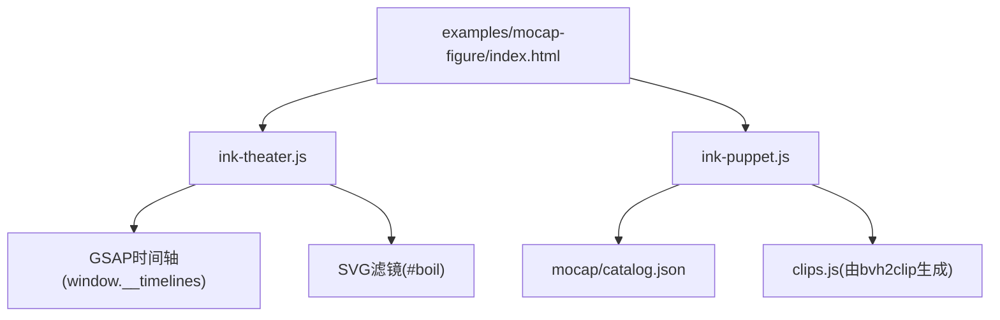
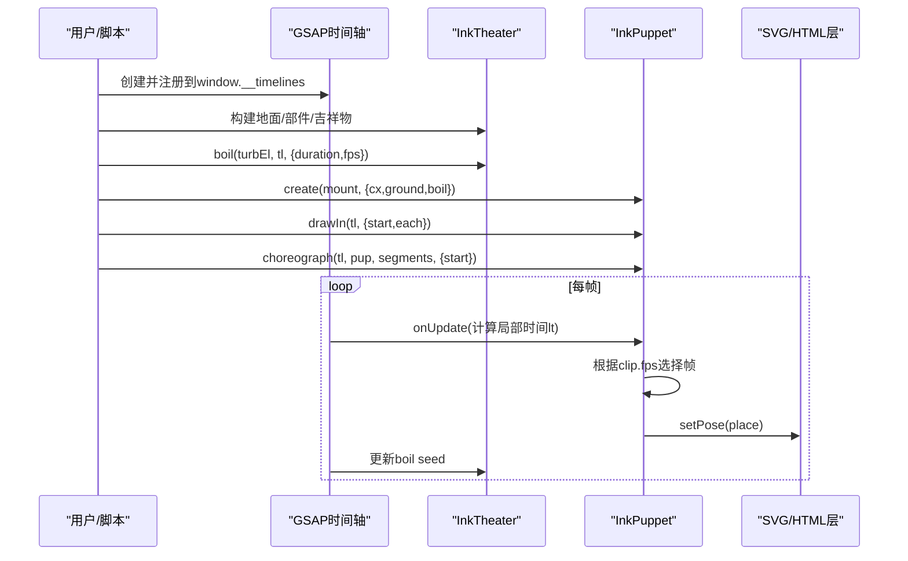
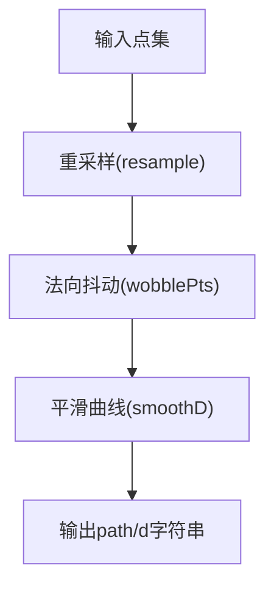
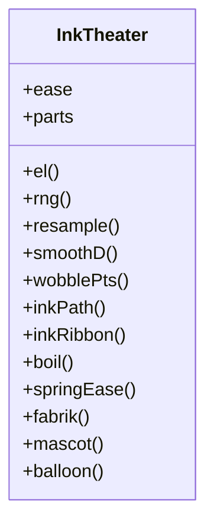
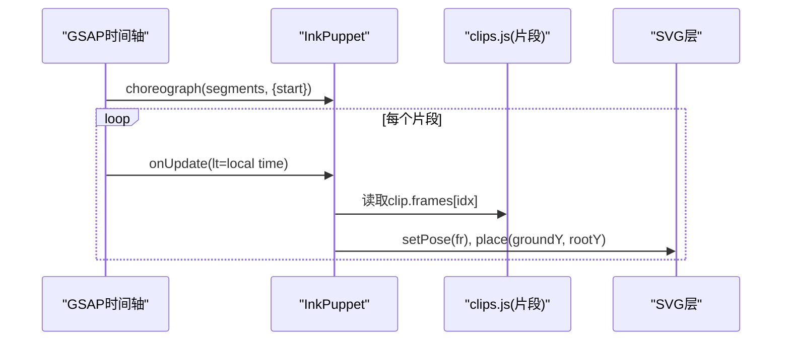
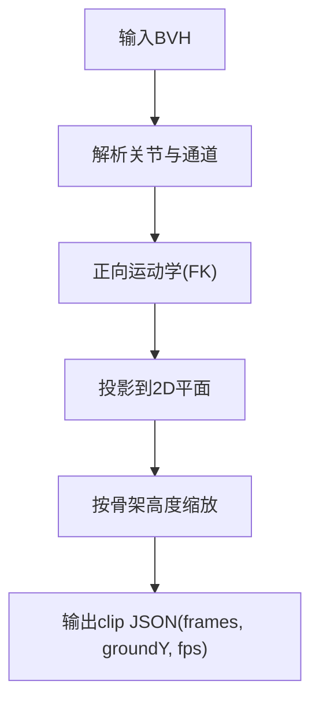
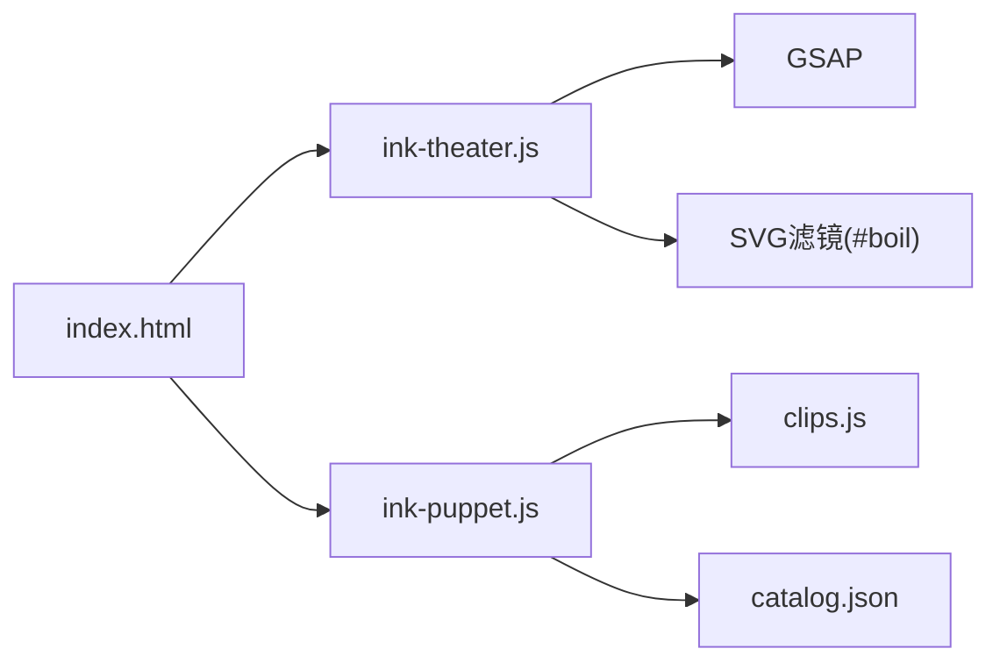

# Ink Theater交互式动画

<cite>
**本文引用的文件**
- [ink-theater/README.md](file://ink-theater/README.md)
- [ink-theater/ink-theater.js](file://ink-theater/ink-theater.js)
- [ink-theater/ink-puppet.js](file://ink-theater/ink-puppet.js)
- [ink-theater/mocap/catalog.json](file://ink-theater/mocap/catalog.json)
- [ink-theater/mocap/bvh2clip.mjs](file://ink-theater/mocap/bvh2clip.mjs)
- [ink-theater/examples/README.md](file://ink-theater/examples/README.md)
- [ink-theater/examples/mocap-figure/index.html](file://ink-theater/examples/mocap-figure/index.html)
- [skills/creative/ink-theater.md](file://skills/creative/ink-theater.md)
</cite>

## 目录
1. [简介](#简介)
2. [项目结构](#项目结构)
3. [核心组件](#核心组件)
4. [架构总览](#架构总览)
5. [详细组件分析](#详细组件分析)
6. [依赖关系分析](#依赖关系分析)
7. [性能与优化](#性能与优化)
8. [故障排查](#故障排查)
9. [结论](#结论)
10. [附录：WebGL/Three.js集成与浏览器部署](#附录webglthreejs集成与浏览器部署)

## 简介
Ink Theater是OpenMontage中用于“手绘风格”的确定性、可寻址（seek-safe）动画引擎。它以极简的黑白墨线世界为核心，通过参数化图元、逆向运动学（IK）、弹簧缓动、动作捕捉（mocap）回放等能力，实现角色与机械装置的协调表演。它专为HyperFrames工作流设计：一个暂停的GSAP时间轴驱动所有帧，确保每一帧都可从时间唯一确定，便于离线渲染为MP4。

该引擎提供两类主要能力：
- 无角色的“机械装置”场景：用参数化部件拼装机器，配合角色（mascot）操作，表达抽象概念。
- 有角色的“木偶”场景：将真实动作捕捉数据转换为2D片段，驱动火柴人角色进行走、跑、跳、舞等表演。

## 项目结构
- ink-theater/
  - ink-theater.js：核心引擎，提供墨线绘制、boil抖动、弹簧缓动、FABRIK IK、部件语法、吉祥物、对话气泡等API。
  - ink-puppet.js：运行时木偶系统，构建火柴人并播放mocap片段，暴露choreograph编排API。
  - mocap/
    - catalog.json：内置动作库清单（walk/run/jump/kick/sit/wave/dance_*等）。
    - bvh2clip.mjs：离线工具，将BVH动作数据转为2D片段JSON，供运行时加载。
  - examples/mocap-figure/index.html：完整示例，演示自绘火柴人+真实mocap表演。
- skills/creative/ink-theater.md：创意技能说明，包含方法论、颜色规范、引擎速查表与最佳实践。

图表来源
- [ink-theater/examples/mocap-figure/index.html:46-93](file://ink-theater/examples/mocap-figure/index.html#L46-L93)
- [ink-theater/ink-theater.js:115-125](file://ink-theater/ink-theater.js#L115-L125)
- [ink-theater/ink-puppet.js:74-101](file://ink-theater/ink-puppet.js#L74-L101)
- [ink-theater/mocap/catalog.json:1-87](file://ink-theater/mocap/catalog.json#L1-L87)

章节来源
- [ink-theater/README.md:1-87](file://ink-theater/README.md#L1-L87)
- [ink-theater/examples/README.md:1-23](file://ink-theater/examples/README.md#L1-L23)

## 核心组件
- 墨线与笔触
  - inkPath/inkRibbon：生成带抖动的中心线或可变宽度笔刷轮廓，支持步长、抖动幅度、种子等参数，保证可重复性。
- 行抖动（boil）
  - boil：通过GSAP步进改变feTurbulence的seed，模拟手绘线条的“微颤”，完全可寻址。
- 弹簧缓动
  - springEase/ease.*：解析阻尼振荡器响应，提供settle/overshoot/bouncy/soft等缓动，纯函数映射进度p到值，可寻址。
- 逆向运动学（IK）
  - fabrik：2D FABRIK算法，给定关节长度和起点/目标点，迭代求解关节位置；mascot使用此能力控制手臂。
- 部件语法（contraption grammar）
  - parts.{crank,gauge,hopper,slot,lever,box}：参数化机械部件，返回可组合的SVG组与句柄，便于装配复杂机器。
- 吉祥物（mascot）
  - mascot：生成黑白墨线吉祥物，提供reachL/reachR方法以目标点驱动双臂IK。
- 对话气泡
  - balloon：在指定时间点弹出气泡，HTML文本层叠加，字体生效，随时间轴显示/隐藏。

章节来源
- [ink-theater/ink-theater.js:88-113](file://ink-theater/ink-theater.js#L88-L113)
- [ink-theater/ink-theater.js:115-125](file://ink-theater/ink-theater.js#L115-L125)
- [ink-theater/ink-theater.js:127-161](file://ink-theater/ink-theater.js#L127-L161)
- [ink-theater/ink-theater.js:163-190](file://ink-theater/ink-theater.js#L163-L190)
- [ink-theater/ink-theater.js:192-231](file://ink-theater/ink-theater.js#L192-L231)
- [ink-theater/ink-theater.js:233-261](file://ink-theater/ink-theater.js#L233-L261)
- [ink-theater/ink-theater.js:263-290](file://ink-theater/ink-theater.js#L263-L290)

## 架构总览
Ink Theater采用“时间轴驱动”的确定性渲染模型：
- 所有视觉更新都绑定到GSAP时间轴的进度，避免任何运行时时钟或随机数。
- 关键路径：index.html创建时间轴→调用InkPuppet.InkTheater API构建场景→boil驱动抖动→choreograph按片段回放mocap→输出到SVG/HTML层。

图表来源
- [ink-theater/examples/mocap-figure/index.html:46-93](file://ink-theater/examples/mocap-figure/index.html#L46-L93)
- [ink-theater/ink-puppet.js:74-101](file://ink-theater/ink-puppet.js#L74-L101)
- [ink-theater/ink-theater.js:115-125](file://ink-theater/ink-theater.js#L115-L125)

## 详细组件分析

### 墨线与笔触（inkPath/inkRibbon）
- 功能：对输入点集进行重采样、法向扰动、平滑曲线生成，得到手绘风格的中心线或闭合笔刷轮廓。
- 复杂度：O(n)，n为点数；重采样与法向量计算线性。
- 关键点：使用种子PRNG保证抖动可重复；step控制采样密度；wobble控制抖动幅度。

图表来源
- [ink-theater/ink-theater.js:40-77](file://ink-theater/ink-theater.js#L40-L77)
- [ink-theater/ink-theater.js:79-113](file://ink-theater/ink-theater.js#L79-L113)

章节来源
- [ink-theater/ink-theater.js:88-113](file://ink-theater/ink-theater.js#L88-L113)

### 行抖动（boil）
- 功能：通过GSAP步进动画改变feTurbulence的seed，产生低帧率（~9fps）的手绘抖动效果。
- 可寻址性：基于时间轴的steps缓动，不依赖SMIL或运行时时钟。

章节来源
- [ink-theater/ink-theater.js:115-125](file://ink-theater/ink-theater.js#L115-L125)

### 弹簧缓动（springEase/ease.*）
- 功能：解析阻尼振荡器的解析解，将进度p映射到位移，提供多种物理感缓动。
- 复杂度：O(1)每帧；仅数学计算。
- 适用：弹入、回弹、软着陆等。

章节来源
- [ink-theater/ink-theater.js:127-161](file://ink-theater/ink-theater.js#L127-L161)

### 逆向运动学（fabrik）与吉祥物（mascot）
- fabrik：给定各段长度、起点和目标点，迭代逼近关节位置；若目标不可达则拉直。
- mascot：构造吉祥物图形，并提供reachL/reachR方法，内部调用fabrik驱动手臂。

图表来源
- [ink-theater/ink-theater.js:163-190](file://ink-theater/ink-theater.js#L163-L190)
- [ink-theater/ink-theater.js:233-261](file://ink-theater/ink-theater.js#L233-L261)
- [ink-theater/ink-theater.js:292-297](file://ink-theater/ink-theater.js#L292-L297)

章节来源
- [ink-theater/ink-theater.js:163-190](file://ink-theater/ink-theater.js#L163-L190)
- [ink-theater/ink-theater.js:233-261](file://ink-theater/ink-theater.js#L233-L261)

### 部件语法（parts）
- 功能：提供crank/gauge/hopper/slot/lever/box等参数化部件，返回SVG组与可操作句柄（如wheel、needle、arm等），便于组装复杂机器。
- 设计：每个部件返回对象包含g（根组）及若干子元素引用，作者可通过时间轴驱动这些句柄。

章节来源
- [ink-theater/ink-theater.js:192-231](file://ink-theater/ink-theater.js#L192-L231)

### 对话气泡（balloon）
- 功能：在指定时间点弹出气泡，HTML文本层叠加，字体生效；随时间轴缩放/淡入淡出。
- 注意：文本使用HTML div而非SVG text，以确保Web字体正确应用。

章节来源
- [ink-theater/ink-theater.js:263-290](file://ink-theater/ink-theater.js#L263-L290)

### 木偶系统（InkPuppet）
- create：构建火柴人，设置头部半径、描边宽度、地面坐标，支持boil滤镜。
- drawIn：逐肢绘制揭示动画，使用strokeDashoffset实现铅笔勾勒效果。
- choreograph：按片段序列回放mocap数据，每帧根据clip.fps选择帧，调用setPose/place更新姿态与位置。

图表来源
- [ink-theater/ink-puppet.js:33-72](file://ink-theater/ink-puppet.js#L33-L72)
- [ink-theater/ink-puppet.js:74-101](file://ink-theater/ink-puppet.js#L74-L101)

章节来源
- [ink-theater/ink-puppet.js:1-105](file://ink-theater/ink-puppet.js#L1-L105)

### 动作库与转换（catalog.json与bvh2clip.mjs）
- catalog.json：列出可用动作名称、类别、帧数与来源（CMU ID）。
- bvh2clip.mjs：离线工具，解析BVH，自动映射骨架关节名（fair1/CMU/Mixamo），投影到2D平面，缩放至固定高度，输出frames数组与groundY等信息。

图表来源
- [ink-theater/mocap/bvh2clip.mjs:22-108](file://ink-theater/mocap/bvh2clip.mjs#L22-L108)
- [ink-theater/mocap/bvh2clip.mjs:110-172](file://ink-theater/mocap/bvh2clip.mjs#L110-L172)

章节来源
- [ink-theater/mocap/catalog.json:1-87](file://ink-theater/mocap/catalog.json#L1-L87)
- [ink-theater/mocap/bvh2clip.mjs:1-172](file://ink-theater/mocap/bvh2clip.mjs#L1-L172)

## 依赖关系分析
- 外部依赖
  - GSAP：时间轴与缓动驱动。
  - SVG滤镜：feTurbulence/feDisplacementMap实现boil。
  - Web字体：Patrick Hand（嵌入TTF），用于HTML覆盖层文本。
- 内部依赖
  - index.html依赖ink-theater.js与ink-puppet.js。
  - ink-puppet.js依赖clips.js（由bvh2clip生成）与catalog.json（作为动作清单）。
  - 所有模块均依赖window.__timelines注册的GSAP时间轴。

图表来源
- [ink-theater/examples/mocap-figure/index.html:46-93](file://ink-theater/examples/mocap-figure/index.html#L46-L93)
- [ink-theater/ink-puppet.js:74-101](file://ink-theater/ink-puppet.js#L74-L101)
- [ink-theater/ink-theater.js:115-125](file://ink-theater/ink-theater.js#L115-L125)

章节来源
- [ink-theater/examples/mocap-figure/index.html:1-97](file://ink-theater/examples/mocap-figure/index.html#L1-L97)
- [ink-theater/ink-puppet.js:1-105](file://ink-theater/ink-puppet.js#L1-L105)
- [ink-theater/ink-theater.js:1-299](file://ink-theater/ink-theater.js#L1-L299)

## 性能与优化
- 确定性优先：所有动画均为时间的纯函数，避免累积状态与运行时随机，利于缓存与重放。
- 低开销绘制：SVG路径与变换为主，避免复杂滤镜频繁重算；boil使用步进seed降低抖动频率。
- 片段循环：mocap片段按fps循环播放，减少关键帧数量；合理选择clip长度与fps平衡流畅度与体积。
- 字体与文本：使用HTML覆盖层承载文本，避免SVG文本字体问题；嵌入完整TTF确保一致性。
- 建议
  - 控制step与wobble以降低路径复杂度。
  - 使用合适的boil fps（如9-10）获得手绘感同时减少抖动计算。
  - 避免repeat:-1，使用有限次数循环。
  - 将时间轴注册到window.__timelines以便HyperFrames统一调度。

[本节为通用指导，无需特定文件来源]

## 故障排查
- 字体回退为衬线体
  - 原因：Google Fonts css2 API返回的woff2子集可能缺失基本拉丁字符，导致英文回退到衬线体。
  - 解决：嵌入完整TTF（如assets/patrickhand.ttf），并通过@font-face声明；文本使用HTML div而非SVG text。
- 未知动作名称
  - 现象：choreograph遇到未识别的clip名称会警告并跳过。
  - 解决：检查catalog.json与clips.js是否包含对应片段；必要时使用add-motion.mjs添加新动作。
- 时间轴未注册
  - 现象：HyperFrames无法找到时间轴。
  - 解决：确保将时间轴注册到window.__timelines["id"]。
- 抖动无效
  - 现象：boil未生效。
  - 解决：确认已定义#boil滤镜并将filter应用到墨线组；调用InkTheater.boil传入正确的turbulence元素与时间轴。

章节来源
- [ink-theater/README.md:31-43](file://ink-theater/README.md#L31-L43)
- [ink-theater/ink-puppet.js:74-101](file://ink-theater/ink-puppet.js#L74-L101)
- [ink-theater/examples/mocap-figure/index.html:28-34](file://ink-theater/examples/mocap-figure/index.html#L28-L34)

## 结论
Ink Theater通过参数化图元、IK、弹簧缓动与mocap回放，提供了高效、可重复、可寻址的手绘风格动画方案。其设计紧密契合HyperFrames工作流，适合快速构建“机械装置解释”与“木偶表演”两类场景。借助catalog.json与bvh2clip.mjs，可扩展丰富的动作库；通过严格遵循确定性规则与字体嵌入规范，可确保跨环境一致渲染。

[本节为总结，无需特定文件来源]

## 附录：WebGL/Three.js集成与浏览器部署
- 当前Ink Theater基于SVG与HTML DOM，不直接依赖WebGL或Three.js。
- 如需3D背景或模型：
  - 可在同一页面引入Three.js，将SVG舞台置于前景，3D场景置于背景；通过z-index分层管理。
  - 保持时间轴同步：将Three.js渲染循环与GSAP时间轴对齐，或在onUpdate回调中触发3D场景更新。
- 浏览器部署要点
  - 引入GSAP与Ink Theater脚本。
  - 定义#boil滤镜并应用到墨线组。
  - 嵌入完整手写字体TTF，并在HTML覆盖层使用。
  - 将时间轴注册到window.__timelines["id"]，供HyperFrames调度。
  - 使用npx hyperframes lint与snapshot验证后再渲染。

[本节为概念性指导，无需特定文件来源]