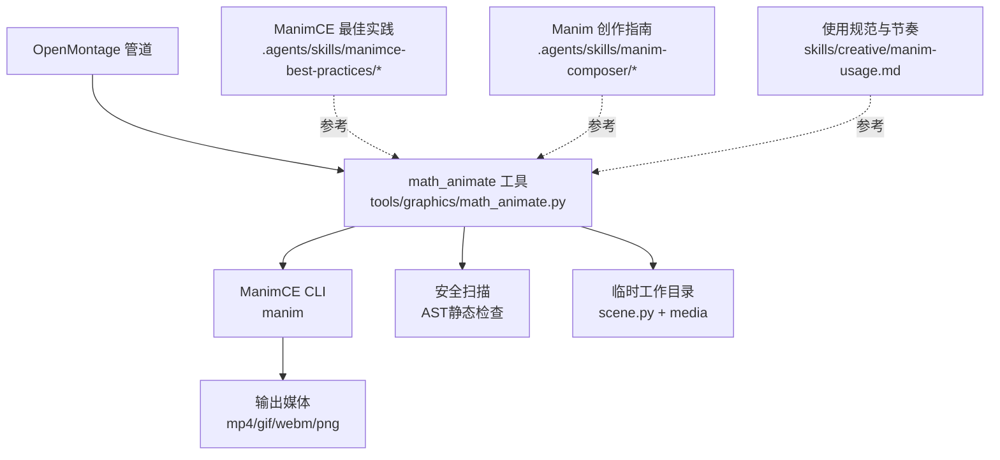
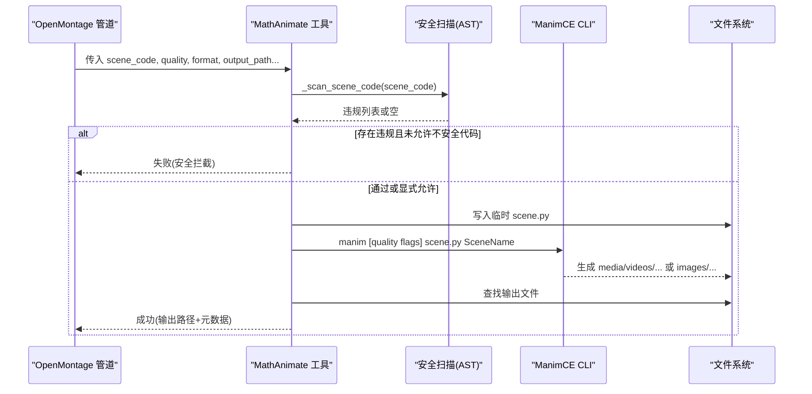
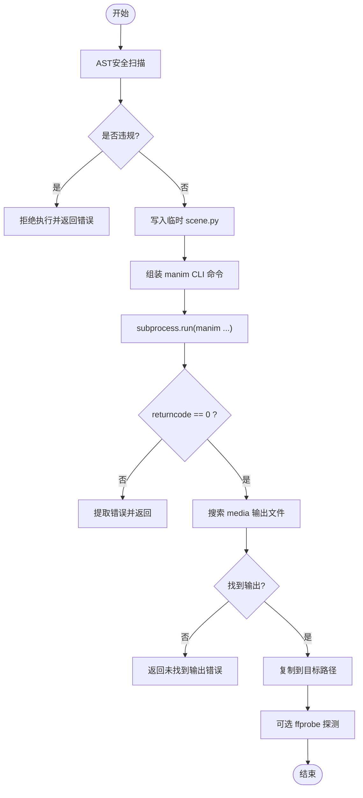
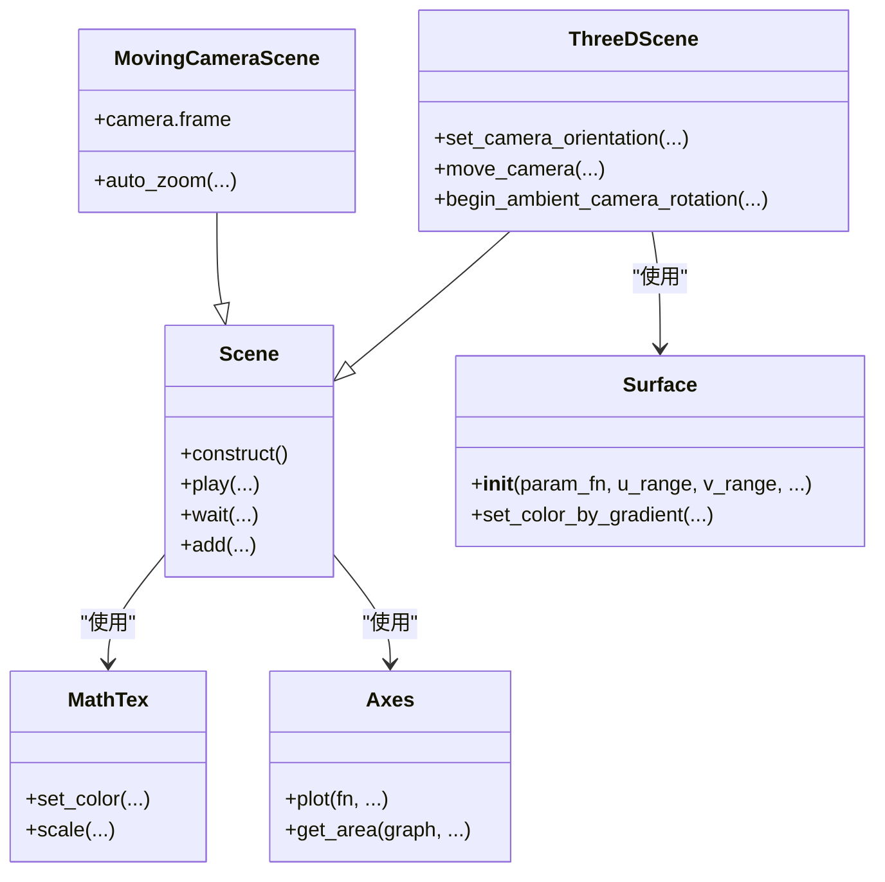
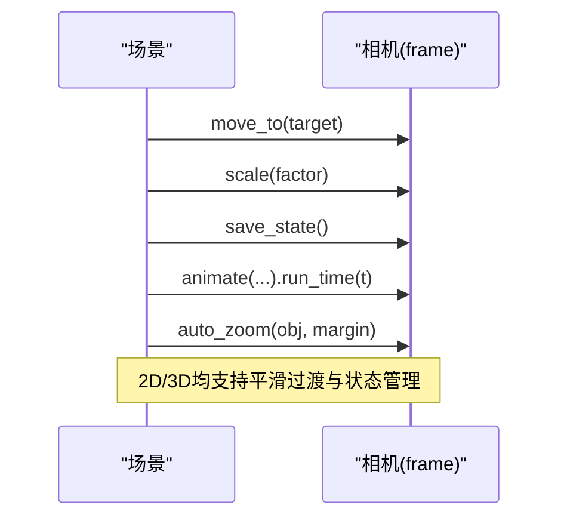
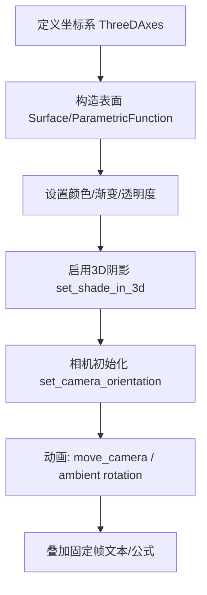
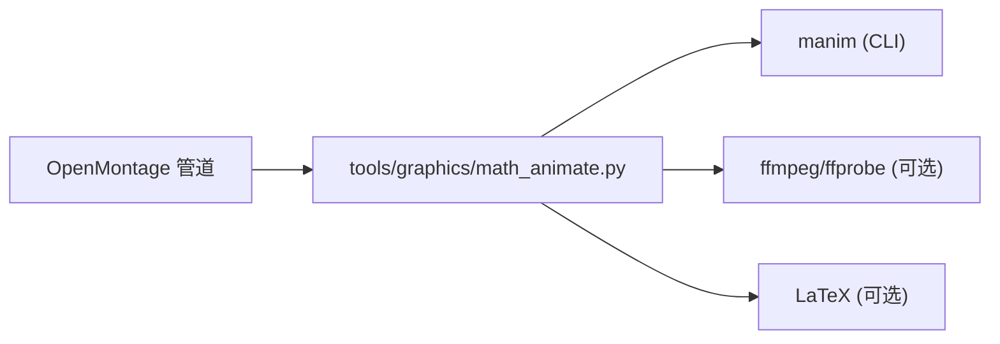

# Manim数学动画指南

<cite>
**本文引用的文件**
- [tools/graphics/math_animate.py](file://tools/graphics/math_animate.py)
- [skills/creative/manim-usage.md](file://skills/creative/manim-usage.md)
- [.agents/skills/manimce-best-practices/SKILL.md](file://.agents/skills/manimce-best-practices/SKILL.md)
- [.agents/skills/manimce-best-practices/examples/math_visualization.py](file://.agents/skills/manimce-best-practices/examples/math_visualization.py)
- [.agents/skills/manimce-best-practices/examples/3d_visualization.py](file://.agents/skills/manimce-best-practices/examples/3d_visualization.py)
- [.agents/skills/manimce-best-practices/rules/3d.md](file://.agents/skills/manimce-best-practices/rules/3d.md)
- [.agents/skills/manimce-best-practices/rules/camera.md](file://.agents/skills/manimce-best-practices/rules/camera.md)
- [.agents/skills/manim-composer/SKILL.md](file://.agents/skills/manim-composer/SKILL.md)
- [tests/tools/test_math_animate_safety.py](file://tests/tools/test_math_animate_safety.py)
</cite>

## 目录
1. [简介](#简介)
2. [项目结构](#项目结构)
3. [核心组件](#核心组件)
4. [架构总览](#架构总览)
5. [详细组件分析](#详细组件分析)
6. [依赖关系分析](#依赖关系分析)
7. [性能考量](#性能考量)
8. [故障排查指南](#故障排查指南)
9. [结论](#结论)
10. [附录](#附录)

## 简介
本指南面向在OpenMontage中使用Manim进行数学与科学可视化创作的工程师与内容创作者。文档聚焦以下目标：
- 系统讲解Manim场景构建、对象创建、动画序列编排等核心能力
- 覆盖数学公式动画、几何图形变换、函数图像演示等典型应用场景
- 深入说明3D动画、相机控制、材质设置等高级特性
- 明确math_animate工具如何与OpenMontage管道集成，将Manim动画嵌入视频制作流程

## 项目结构
OpenMontage中与Manim相关的实现与知识主要分布在如下位置：
- 工具层：通过命令行调用ManimCE渲染场景代码，封装为可被管道调用的工具
- 技能与最佳实践：提供ManimCE使用规范、示例、模板与创作技巧
- 测试与安全：对场景代码执行前进行静态安全扫描，防止危险操作

图表来源
- [tools/graphics/math_animate.py:267-416](file://tools/graphics/math_animate.py#L267-L416)
- [.agents/skills/manimce-best-practices/SKILL.md:56-72](file://.agents/skills/manimce-best-practices/SKILL.md#L56-L72)
- [.agents/skills/manim-composer/SKILL.md:45-104](file://.agents/skills/manim-composer/SKILL.md#L45-L104)
- [skills/creative/manim-usage.md:19-36](file://skills/creative/manim-usage.md#L19-L36)

章节来源
- [tools/graphics/math_animate.py:1-105](file://tools/graphics/math_animate.py#L1-L105)
- [.agents/skills/manimce-best-practices/SKILL.md:1-55](file://.agents/skills/manimce-best-practices/SKILL.md#L1-L55)
- [.agents/skills/manim-composer/SKILL.md:1-44](file://.agents/skills/manim-composer/SKILL.md#L1-L44)
- [skills/creative/manim-usage.md:1-18](file://skills/creative/manim-usage.md#L1-L18)

## 核心组件
- math_animate 工具
  - 职责：接收用户提供的Manim场景Python代码，执行静态安全扫描，组装Manim CLI命令并运行，定位输出文件，返回结果与元数据
  - 关键能力：质量预设、格式选择、透明背景、自定义背景色、额外CLI参数、自动检测Scene类名、超时保护、错误信息提取
- ManimCE 最佳实践与示例
  - 提供2D/3D场景模板、动画节奏、颜色语义、坐标系统与绘图、文本与LaTeX渲染、相机控制等规范与示例
- Manim 创作计划（Composer）
  - 从创意到分镜的规划方法，帮助产出scenes.md，指导后续Manim实现
- 安全与测试
  - 基于AST的静态扫描，阻止危险导入、危险标识符与反射绕过；测试覆盖常见攻击路径与白名单行为

章节来源
- [tools/graphics/math_animate.py:84-186](file://tools/graphics/math_animate.py#L84-L186)
- [.agents/skills/manimce-best-practices/SKILL.md:56-72](file://.agents/skills/manimce-best-practices/SKILL.md#L56-L72)
- [.agents/skills/manim-composer/SKILL.md:45-104](file://.agents/skills/manim-composer/SKILL.md#L45-L104)
- [tests/tools/test_math_animate_safety.py:29-143](file://tests/tools/test_math_animate_safety.py#L29-L143)

## 架构总览
OpenMontage通过math_animate工具桥接ManimCE，形成“输入场景代码 → 安全扫描 → 渲染 → 产物定位 → 回传”的闭环。

图表来源
- [tools/graphics/math_animate.py:225-265](file://tools/graphics/math_animate.py#L225-L265)
- [tools/graphics/math_animate.py:267-416](file://tools/graphics/math_animate.py#L267-L416)

## 详细组件分析

### 组件A：math_animate 工具
- 功能要点
  - 自动注入导入语句，确保Manim可用
  - 静态安全扫描：阻断危险导入、危险名称、反射dunder访问
  - 质量预设映射到CLI标志，支持mp4/gif/webm/png与透明背景
  - 自动检测Scene类名，支持extra_args透传
  - 超时与错误处理：捕获子进程异常并提取有用错误片段
  - 输出探测：可选ffprobe获取时长、分辨率、编码等信息
- 数据流
  - 输入：scene_code、quality、format、output_path、transparent、background_color、extra_args、allow_unsafe_code
  - 中间：临时目录、scene.py、media目录
  - 输出：ToolResult包含success、data（含输出路径、分辨率、fps、时长等）、artifacts
- 复杂度与性能
  - 渲染耗时受quality影响显著；默认估计值用于资源调度
  - 3D渲染更慢，建议按需降低resolution或帧率
- 错误处理
  - 缺少manim二进制、渲染超时、返回码非零、找不到输出文件等均有明确提示

图表来源
- [tools/graphics/math_animate.py:225-265](file://tools/graphics/math_animate.py#L225-L265)
- [tools/graphics/math_animate.py:267-416](file://tools/graphics/math_animate.py#L267-L416)
- [tools/graphics/math_animate.py:418-495](file://tools/graphics/math_animate.py#L418-L495)

章节来源
- [tools/graphics/math_animate.py:84-186](file://tools/graphics/math_animate.py#L84-L186)
- [tools/graphics/math_animate.py:225-495](file://tools/graphics/math_animate.py#L225-L495)
- [tests/tools/test_math_animate_safety.py:29-191](file://tests/tools/test_math_animate_safety.py#L29-L191)

### 组件B：ManimCE 最佳实践与示例
- 场景与对象
  - 标准2D场景模板、MovingCameraScene、ThreeDScene
  - 常用Mobject：Circle、Square、Text、MathTex、Axes、NumberPlane、Surface等
- 动画与时间
  - Create/Write/FadeIn/Transform/ReplacementTransform/LaggedStart/Succession
  - run_time、rate_func、lag_ratio、wait配合叙事节奏
- 数学与文本
  - MathTex/Tex渲染LaTeX，set_color_by_tex/tex_to_color_map高亮
  - 逐步推导、替换、求和、极限、导数链式法则等示例
- 坐标与绘图
  - Axes.plot绘制函数、get_area面积、极坐标图、Riemann和
- 3D与相机
  - ThreeDAxes、Surface、ParametricFunction、Arrow3D/Line3D
  - set_camera_orientation、move_camera、begin_ambient_camera_rotation
  - 阴影与着色：set_shade_in_3d、colorscale

图表来源
- [.agents/skills/manimce-best-practices/examples/math_visualization.py:13-316](file://.agents/skills/manimce-best-practices/examples/math_visualization.py#L13-L316)
- [.agents/skills/manimce-best-practices/examples/3d_visualization.py:14-374](file://.agents/skills/manimce-best-practices/examples/3d_visualization.py#L14-L374)
- [.agents/skills/manimce-best-practices/rules/3d.md:12-255](file://.agents/skills/manimce-best-practices/rules/3d.md#L12-L255)

章节来源
- [.agents/skills/manimce-best-practices/SKILL.md:56-72](file://.agents/skills/manimce-best-practices/SKILL.md#L56-L72)
- [.agents/skills/manimce-best-practices/examples/math_visualization.py:1-316](file://.agents/skills/manimce-best-practices/examples/math_visualization.py#L1-L316)
- [.agents/skills/manimce-best-practices/examples/3d_visualization.py:1-374](file://.agents/skills/manimce-best-practices/examples/3d_visualization.py#L1-L374)
- [.agents/skills/manimce-best-practices/rules/3d.md:1-255](file://.agents/skills/manimce-best-practices/rules/3d.md#L1-L255)

### 组件C：相机控制（2D/3D）
- 2D相机（MovingCameraScene）
  - 缩放：frame.animate.scale(...)
  - 平移：frame.animate.move_to(...)
  - 组合：同时缩放和平移
  - 保存/恢复：save_state()/Restore(...)
  - 自动适配：auto_zoom(mobject, margin=...)
- 3D相机（ThreeDScene）
  - 初始朝向：set_camera_orientation(phi, theta, gamma)
  - 动画移动：move_camera(phi, theta, run_time=...)
  - 环境旋转：begin_ambient_camera_rotation(rate=...) / stop_ambient_camera_rotation()
  - 固定帧内元素：add_fixed_in_frame_mobjects(...)

图表来源
- [.agents/skills/manimce-best-practices/rules/camera.md:12-209](file://.agents/skills/manimce-best-practices/rules/camera.md#L12-L209)

章节来源
- [.agents/skills/manimce-best-practices/rules/camera.md:1-209](file://.agents/skills/manimce-best-practices/rules/camera.md#L1-L209)

### 组件D：3D可视化与材质
- 基础对象：Sphere、Cube、Cylinder、Cone、Torus、ParametricFunction、Arrow3D/Line3D
- 表面与着色：Surface、set_color_by_gradient、colorscales、set_shade_in_3d
- 坐标与标注：ThreeDAxes、get_x/y/z_axis_label、c2p坐标转换
- 动态表面：ValueTracker + always_redraw 驱动时变曲面
- 文本与公式：固定帧内显示标题与公式，便于3D场景中叠加说明

图表来源
- [.agents/skills/manimce-best-practices/examples/3d_visualization.py:73-336](file://.agents/skills/manimce-best-practices/examples/3d_visualization.py#L73-L336)
- [.agents/skills/manimce-best-practices/rules/3d.md:155-255](file://.agents/skills/manimce-best-practices/rules/3d.md#L155-L255)

章节来源
- [.agents/skills/manimce-best-practices/examples/3d_visualization.py:1-374](file://.agents/skills/manimce-best-practices/examples/3d_visualization.py#L1-L374)
- [.agents/skills/manimce-best-practices/rules/3d.md:1-255](file://.agents/skills/manimce-best-practices/rules/3d.md#L1-L255)

### 组件E：与OpenMontage管道的集成
- 集成方式
  - 通过math_animate工具暴露render_scene/render_from_code/render_from_template能力
  - 管道侧传入scene_code与渲染参数，工具返回输出路径与元数据，供后续合成、转码、字幕烧录等步骤使用
- 渲染配置建议
  - 最终输出建议使用-qh（1080p60），草稿用-qm；YouTube横屏可按需转码至30fps
  - 深色背景（BLACK或#1a1a2e）更符合视频风格
- 创作节奏
  - 一个概念一个场景，逐步构建；复杂推导拆分为多段
  - 方程书写1.5-2.0s，形状创建0.8-1.2s，关键揭示后等待1.0-2.0s
  - 使用LaggedStart与lag_ratio组织网格/列表的交错出现

章节来源
- [skills/creative/manim-usage.md:19-103](file://skills/creative/manim-usage.md#L19-L103)
- [.agents/skills/manimce-best-practices/SKILL.md:74-102](file://.agents/skills/manimce-best-practices/SKILL.md#L74-L102)

### 组件F：安全与合规
- 安全策略
  - AST静态扫描：阻断危险导入（os、sys、subprocess、socket、requests等）、危险名称（eval/exec/open/__import__/getattr等）、反射dunder访问（除__init__/__name__外）
  - 默认拒绝不安全代码；仅当显式allow_unsafe_code=true时放行
- 测试覆盖
  - 安全场景通过、危险导入/调用/反射被拦截、语法错误交由Manim报告、super().__init__等合法dunder不被误杀

章节来源
- [tools/graphics/math_animate.py:32-63](file://tools/graphics/math_animate.py#L32-L63)
- [tools/graphics/math_animate.py:225-265](file://tools/graphics/math_animate.py#L225-L265)
- [tests/tools/test_math_animate_safety.py:29-191](file://tests/tools/test_math_animate_safety.py#L29-L191)

## 依赖关系分析
- 外部依赖
  - ManimCE（manim CLI）
  - FFmpeg（可选，用于ffprobe探测）
  - LaTeX（可选，用于高质量数学公式渲染）
- 内部依赖
  - BaseTool抽象（工具接口、资源与重试策略）
  - 管道通过工具注册表调用math_animate

图表来源
- [tools/graphics/math_animate.py:95-104](file://tools/graphics/math_animate.py#L95-L104)
- [tools/graphics/math_animate.py:453-487](file://tools/graphics/math_animate.py#L453-L487)

章节来源
- [tools/graphics/math_animate.py:95-104](file://tools/graphics/math_animate.py#L95-L104)
- [tools/graphics/math_animate.py:453-487](file://tools/graphics/math_animate.py#L453-L487)

## 性能考量
- 渲染质量与速度
  - low(-ql)/medium(-qm)/high(-qh)/4k(-qk)直接影响分辨率与帧率，进而影响渲染时长
  - 3D渲染通常比2D慢5-10倍；适当降低resolution或帧率可显著提速
- 内存与磁盘
  - 高分辨率与复杂曲面会占用更多内存与磁盘空间；及时清理临时目录
- 并行与批处理
  - 多个独立场景可并行渲染；注意CPU/IO瓶颈
- 预览与迭代
  - 开发阶段使用-preview或低质量快速验证；确认后再提升质量

[本节为通用指导，不直接分析具体文件]

## 故障排查指南
- 常见问题
  - 未安装manim：工具返回不可用提示与安装指引
  - 渲染超时：默认300秒限制，可降低质量或使用preview模式
  - 输出未找到：检查media目录结构与文件名匹配逻辑
  - 错误信息过多：工具已尝试提取关键错误行
- 调试建议
  - 开启extra_args查看Manim完整日志
  - 使用临时目录保留scene.py与media以便复现问题
  - 若需禁用缓存，添加--disable_caching
- 安全相关
  - 若被安全扫描拦截，检查是否存在危险导入/调用/dunder访问；必要时显式允许（仅限可信代码）

章节来源
- [tools/graphics/math_animate.py:188-223](file://tools/graphics/math_animate.py#L188-L223)
- [tools/graphics/math_animate.py:348-377](file://tools/graphics/math_animate.py#L348-L377)
- [tools/graphics/math_animate.py:432-451](file://tools/graphics/math_animate.py#L432-L451)
- [tests/tools/test_math_animate_safety.py:145-191](file://tests/tools/test_math_animate_safety.py#L145-L191)

## 结论
OpenMontage通过math_animate工具将ManimCE无缝接入视频生产管线，既保证了创作灵活性，又提供了必要的安全边界与工程化能力。结合ManimCE最佳实践与创作指南，可在保证质量的前提下高效产出高质量的数学与科学可视化动画。对于3D与相机控制等高级特性，建议在理解性能代价的基础上谨慎使用，以获得最佳的视觉与效率平衡。

[本节为总结性内容，不直接分析具体文件]

## 附录
- 快速上手清单
  - 安装ManimCE与FFmpeg（可选LaTeX）
  - 编写Scene类与construct方法，遵循“一概念一场景”原则
  - 使用math_animate工具传入scene_code与质量参数进行渲染
  - 根据管道需求选择合适的输出格式与分辨率
- 推荐资源
  - ManimCE最佳实践与示例：2D/3D、动画、文本、相机控制
  - 创作计划模板：从创意到分镜的scenes.md
  - OpenMontage使用规范：渲染设置、节奏与色彩语义

[本节为补充信息，不直接分析具体文件]