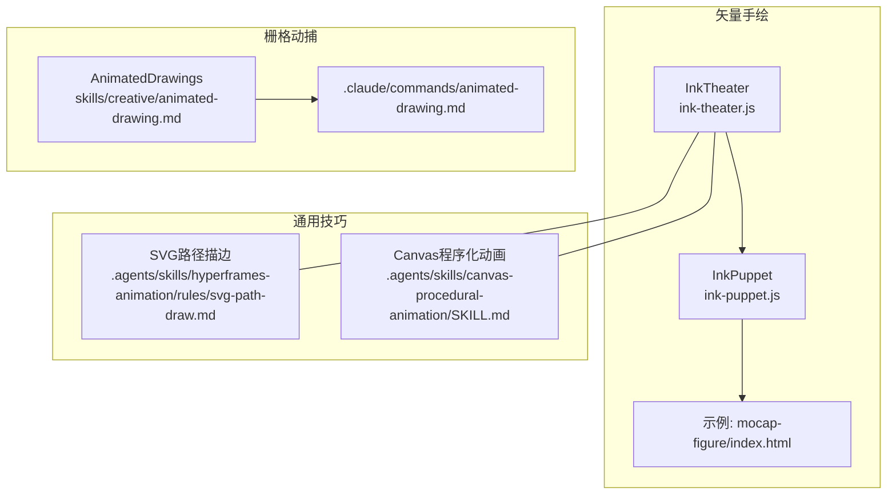
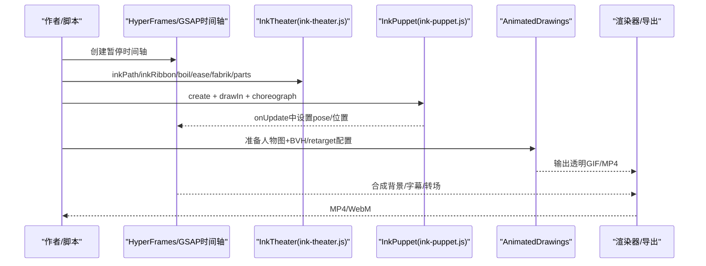
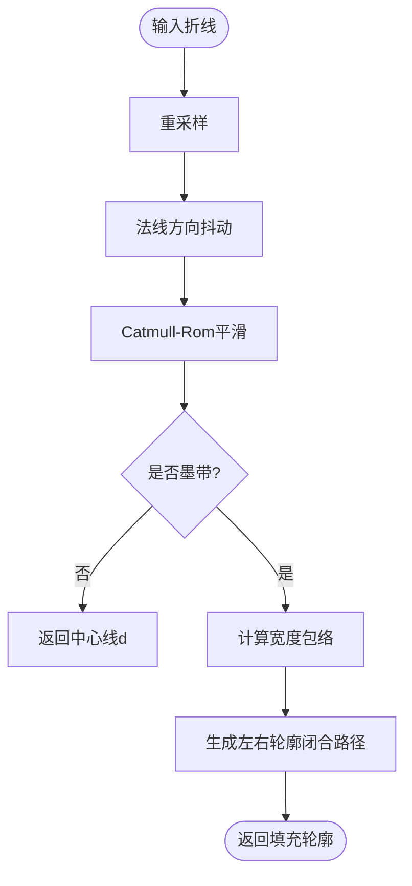
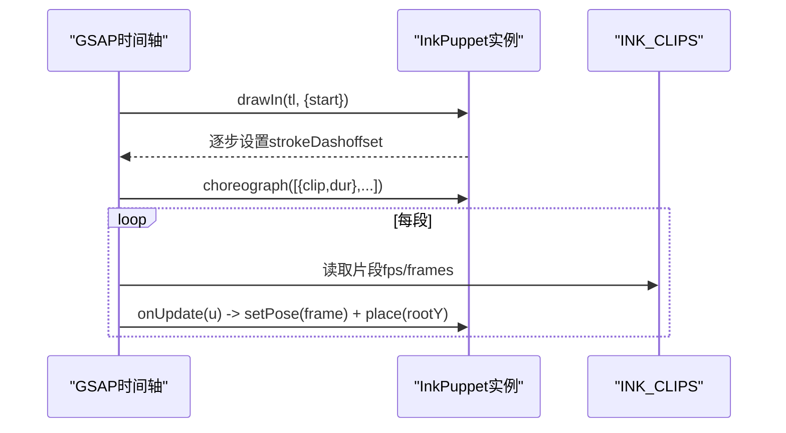
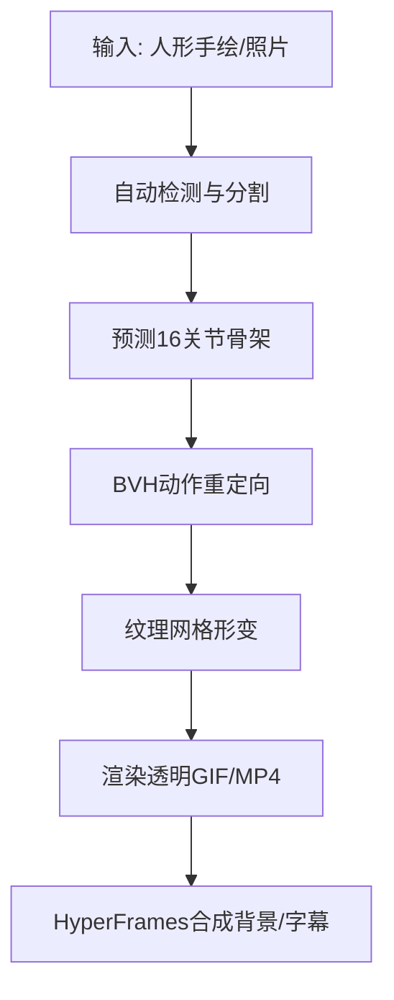
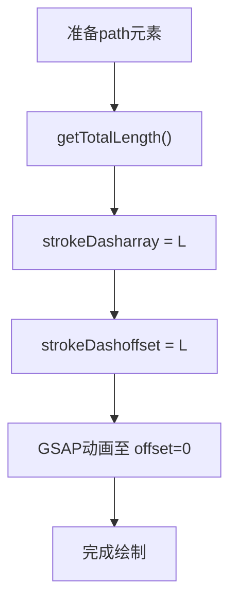
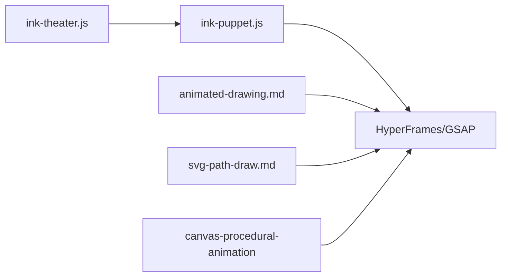

# 动态绘图技能

<cite>
**本文引用的文件**
- [ink-theater/README.md](file://ink-theater/README.md)
- [ink-theater/ink-theater.js](file://ink-theater/ink-theater.js)
- [ink-theater/ink-puppet.js](file://ink-theater/ink-puppet.js)
- [ink-theater/examples/mocap-figure/index.html](file://ink-theater/examples/mocap-figure/index.html)
- [skills/creative/animated-drawing.md](file://skills/creative/animated-drawing.md)
- [.claude/commands/animated-drawing.md](file://.claude/commands/animated-drawing.md)
- [.claude/commands/ink-art.md](file://.claude/commands/ink-art.md)
- [.agents/skills/hyperframes-animation/rules/svg-path-draw.md](file://.agents/skills/hyperframes-animation/rules/svg-path-draw.md)
- [.agents/skills/canvas-procedural-animation/SKILL.md](file://.agents/skills/canvas-procedural-animation/SKILL.md)
</cite>

## 目录
1. [简介](#简介)
2. [项目结构](#项目结构)
3. [核心组件](#核心组件)
4. [架构总览](#架构总览)
5. [详细组件分析](#详细组件分析)
6. [依赖关系分析](#依赖关系分析)
7. [性能考量](#性能考量)
8. [故障排查指南](#故障排查指南)
9. [结论](#结论)
10. [附录](#附录)

## 简介
本技术文档聚焦 OpenMontage 中的“动态绘图”能力，覆盖手绘风格动画的完整实现路径：从矢量线条绘制动画、形状变形、笔触质感模拟，到基于真实动捕的角色行走/舞蹈/挥手等动作编排；同时提供 Canvas/WebGL 粒子与特效、SVG 路径描边、关键帧设计与路径动画的实践方法。文档以 Ink Theater（矢量手绘引擎）与 Animated Drawings（栅格角色动捕）两条主线展开，并给出在 HyperFrames/GSAP 时间轴上的可寻址、可复现渲染方案。

## 项目结构
OpenMontage 将“动态绘图”拆分为两类互补能力：
- 矢量手绘引擎 Ink Theater：用于从零生成“自绘+动捕”的手绘角色与场景，强调确定性、可寻址、可编辑。
- 栅格角色动捕 Animated Drawings：对已有的人形手绘图进行自动骨骼绑定与动作重定向，输出透明 GIF/MP4，便于合成进视频。

图表来源
- [ink-theater/ink-theater.js:1-200](file://ink-theater/ink-theater.js#L1-L200)
- [ink-theater/ink-puppet.js:1-105](file://ink-theater/ink-puppet.js#L1-L105)
- [ink-theater/examples/mocap-figure/index.html:46-72](file://ink-theater/examples/mocap-figure/index.html#L46-L72)
- [skills/creative/animated-drawing.md:1-8](file://skills/creative/animated-drawing.md#L1-L8)
- [.claude/commands/animated-drawing.md:1-13](file://.claude/commands/animated-drawing.md#L1-L13)
- [.agents/skills/hyperframes-animation/rules/svg-path-draw.md:1-245](file://.agents/skills/hyperframes-animation/rules/svg-path-draw.md#L1-L245)
- [.agents/skills/canvas-procedural-animation/SKILL.md:1-48](file://.agents/skills/canvas-procedural-animation/SKILL.md#L1-L48)

章节来源
- [ink-theater/README.md:1-87](file://ink-theater/README.md#L1-L87)
- [ink-theater/ink-theater.js:1-200](file://ink-theater/ink-theater.js#L1-L200)
- [ink-theater/ink-puppet.js:1-105](file://ink-theater/ink-puppet.js#L1-L105)
- [ink-theater/examples/mocap-figure/index.html:46-72](file://ink-theater/examples/mocap-figure/index.html#L46-L72)
- [skills/creative/animated-drawing.md:1-8](file://skills/creative/animated-drawing.md#L1-L8)
- [.claude/commands/animated-drawing.md:1-13](file://.claude/commands/animated-drawing.md#L1-L13)
- [.agents/skills/hyperframes-animation/rules/svg-path-draw.md:1-245](file://.agents/skills/hyperframes-animation/rules/svg-path-draw.md#L1-L245)
- [.agents/skills/canvas-procedural-animation/SKILL.md:1-48](file://.agents/skills/canvas-procedural-animation/SKILL.md#L1-L48)

## 核心组件
- InkTheater（ink-theater.js）
  - 手绘笔触：inkPath/inkRibbon，通过采样、法线偏移、Catmull-Rom平滑与宽度包络，生成自然变化的墨线。
  - 手绘抖动：boil，使用 feTurbulence 的步进 seed 驱动低帧率“抖动”，配合 GSAP steps ease，保证可寻址。
  - 弹簧缓动：springEase 及其预设 ease.settle/overshoot/bouncy/soft，纯函数映射进度，无累积状态。
  - IK：fabrik 二维逆解算，支撑手臂/腿部可达性。
  - 部件语法：parts.crank/gauge/hopper/lever/box 等参数化机械构件，组合表达抽象概念。
  - 吉祥物：mascot 可被 rig 并受 IK 控制。

- InkPuppet（ink-puppet.js）
  - 构建火柴人骨架与 SVG 路径，支持 drawIn 逐段“铅笔勾勒”揭示。
  - choreograph 按片段播放预烘焙的 2D 动捕片段（来自 catalog.json），每帧由局部时间决定姿态，完全可寻址。

- Animated Drawings（skills/creative/animated-drawing.md）
  - 对用户提供的人形手绘图进行自动骨骼预测与 BVH 动作重定向，输出透明 GIF/MP4，适合与 HyperFrames 合成背景与字幕。

- SVG 路径描边（svg-path-draw.md）
  - 利用 stroke-dasharray/stroke-dashoffset 实现“笔尖描线”效果，配合 GSAP 时间轴做多段连续绘制。

- Canvas/WebGL 程序化动画（canvas-procedural-animation/SKILL.md）
  - 用 p5.js/Canvas 实现粒子、天气、环境运动等辅助效果，作为手绘主场景的增强层。

章节来源
- [ink-theater/ink-theater.js:1-200](file://ink-theater/ink-theater.js#L1-L200)
- [ink-theater/ink-puppet.js:1-105](file://ink-theater/ink-puppet.js#L1-L105)
- [skills/creative/animated-drawing.md:1-8](file://skills/creative/animated-drawing.md#L1-L8)
- [.agents/skills/hyperframes-animation/rules/svg-path-draw.md:1-245](file://.agents/skills/hyperframes-animation/rules/svg-path-draw.md#L1-L245)
- [.agents/skills/canvas-procedural-animation/SKILL.md:1-48](file://.agents/skills/canvas-procedural-animation/SKILL.md#L1-L48)

## 架构总览
下图展示“矢量手绘”与“栅格动捕”两条路径如何协同工作，并通过 HyperFrames/GSAP 统一编排。

图表来源
- [ink-theater/ink-theater.js:1-200](file://ink-theater/ink-theater.js#L1-L200)
- [ink-theater/ink-puppet.js:1-105](file://ink-theater/ink-puppet.js#L1-L105)
- [ink-theater/examples/mocap-figure/index.html:46-72](file://ink-theater/examples/mocap-figure/index.html#L46-L72)
- [skills/creative/animated-drawing.md:1-8](file://skills/creative/animated-drawing.md#L1-L8)

## 详细组件分析

### InkTheater 手绘笔触与物理
- 笔触生成
  - 路径重采样与法线计算，叠加有界抖动，Catmull-Rom 平滑为贝塞尔曲线，得到自然中心线。
  - 墨带（inkRibbon）沿中心线两侧按正弦包络与随机扰动生成宽度变化轮廓，形成“落笔-收笔”的真实感。
- 手绘抖动（boil）
  - 通过 GSAP steps ease 步进改变 feTurbulence 的 seed，产生低帧率的“手绘颤动”，且完全可寻址。
- 弹簧缓动
  - 解析阻尼谐振子响应，提供 settle/overshoot/bouncy/soft 等预设，避免数值积分误差。
- 逆解算（fabrik）
  - 给定关节长度与目标点，迭代求解各关节坐标，处理不可达情况。

图表来源
- [ink-theater/ink-theater.js:39-113](file://ink-theater/ink-theater.js#L39-L113)

章节来源
- [ink-theater/ink-theater.js:1-200](file://ink-theater/ink-theater.js#L1-L200)

### InkPuppet 角色动捕与自绘揭示
- 自绘揭示（drawIn）
  - 将头部、躯干、四肢等 path 初始化为隐藏（strokeDasharray=全长，offset=全长），按顺序渐显，营造“铅笔勾勒”。
- 动捕播放（choreograph）
  - 读取 INK_CLIPS（由 catalog.json 预编译），根据片段时长与 fps 索引帧，调用 setPose/place 更新姿态与地面位置。
  - 每个片段内以匀速推进 u，onUpdate 中取整帧索引，确保可寻址与循环播放。

图表来源
- [ink-theater/ink-puppet.js:33-101](file://ink-theater/ink-puppet.js#L33-L101)
- [ink-theater/examples/mocap-figure/index.html:46-72](file://ink-theater/examples/mocap-figure/index.html#L46-L72)

章节来源
- [ink-theater/ink-puppet.js:1-105](file://ink-theater/ink-puppet.js#L1-L105)
- [ink-theater/examples/mocap-figure/index.html:46-72](file://ink-theater/examples/mocap-figure/index.html#L46-L72)

### Animated Drawings 栅格角色动捕
- 适用场景：用户已有“人形”手绘/照片，需要让该图像动起来（走/跳/挥手等）。
- 流程要点：
  - 自动检测与分割 → 预测16关节骨架 → BVH 动作重定向 → 纹理网格形变 → 渲染透明 GIF/MP4。
  - 注意：仅移动已有图像像素，不做“自绘揭示”；如需矢量自绘，请使用 /ink-art。
- 与 HyperFrames 合成：
  - 透明输出时设置 CLEAR_COLOR 为透明；建议转换为 VP9 WebM 保留 alpha；字幕用 HTML 叠加层。

图表来源
- [skills/creative/animated-drawing.md:1-8](file://skills/creative/animated-drawing.md#L1-L8)
- [.claude/commands/animated-drawing.md:1-13](file://.claude/commands/animated-drawing.md#L1-L13)

章节来源
- [skills/creative/animated-drawing.md:1-8](file://skills/creative/animated-drawing.md#L1-L8)
- [.claude/commands/animated-drawing.md:1-13](file://.claude/commands/animated-drawing.md#L1-L13)

### SVG 路径描边与形状变形
- 路径描边
  - 将 stroke-dasharray 设为路径总长，stroke-dashoffset 从总长渐变到 0，实现“笔尖描线”。
  - 多段路径可通过交错起始时间营造连续绘制感；末端圆头（round cap）更柔和。
- 形状变形
  - 借助 GSAP MorphSVGPlugin 或手动插值 d 属性，实现图标/图形之间的平滑过渡。
- 实践要点
  - 测量路径长度应在 DOM 就绪后进行；复杂路径可略放大 dasharray 以避免裁剪。
  - 避免使用回弹缓动（back.out/elastic.out）于描边，以免违背“笔尖”直觉。

图表来源
- [.agents/skills/hyperframes-animation/rules/svg-path-draw.md:1-245](file://.agents/skills/hyperframes-animation/rules/svg-path-draw.md#L1-L245)

章节来源
- [.agents/skills/hyperframes-animation/rules/svg-path-draw.md:1-245](file://.agents/skills/hyperframes-animation/rules/svg-path-draw.md#L1-L245)

### Canvas/WebGL 粒子与特效
- 用途：雨/雪/叶/羽等环境粒子、速度拖尾、辉光等，作为手绘主场景的增强层。
- 模式：p5.js setup/draw 循环或 WebGL 着色器；在 HyperFrames 中通过 timeline onUpdate 捕获并渲染，保证可寻址。
- 兼容性：检测 drawElementImage 可用性并提供降级方案。

章节来源
- [.agents/skills/canvas-procedural-animation/SKILL.md:1-48](file://.agents/skills/canvas-procedural-animation/SKILL.md#L1-L48)

## 依赖关系分析
- InkTheater 与 InkPuppet
  - InkPuppet 依赖 InkTheater 提供的 boil、ease、IK 等基础能力；两者共同构成“矢量手绘+动捕”管线。
- 与 HyperFrames/GSAP
  - 所有动画均注册到单一暂停时间轴，onUpdate 驱动渲染，确保可寻址与确定性。
- 与 Animated Drawings
  - 独立于 InkTheater，输出栅格素材，供 HyperFrames 合成。

图表来源
- [ink-theater/ink-theater.js:1-200](file://ink-theater/ink-theater.js#L1-L200)
- [ink-theater/ink-puppet.js:1-105](file://ink-theater/ink-puppet.js#L1-L105)
- [skills/creative/animated-drawing.md:1-8](file://skills/creative/animated-drawing.md#L1-L8)
- [.agents/skills/hyperframes-animation/rules/svg-path-draw.md:1-245](file://.agents/skills/hyperframes-animation/rules/svg-path-draw.md#L1-L245)
- [.agents/skills/canvas-procedural-animation/SKILL.md:1-48](file://.agents/skills/canvas-procedural-animation/SKILL.md#L1-L48)

章节来源
- [ink-theater/README.md:1-87](file://ink-theater/README.md#L1-L87)

## 性能考量
- 矢量手绘
  - 墨带与抖动会增加路径复杂度，建议合理设置 step/wobble/seed，避免过度细分。
  - boil 的 fps 不宜过高，9fps 级别即可获得手绘感且降低开销。
- 动捕播放
  - 片段内以整数帧索引访问，避免浮点误差；loop=false 时注意边界截断。
- 栅格动捕
  - 长片段需限制 end_frame_idx；地面接触类动作渲染较慢，应预估时长。
- 合成阶段
  - 透明 GIF 在 HyperFrames 中可能冻结，建议转为 VP9 WebM 保留 alpha。
  - 字幕/文字使用 HTML 叠加层，避免 SVG text 字体问题。

[本节为通用指导，不直接分析具体文件]

## 故障排查指南
- 字体问题（手写体显示为衬线体）
  - 原因：Google Fonts css2 API 返回的子集缺少基本拉丁字符，导致英文回退到衬线体。
  - 解决：嵌入完整字体文件（如 assets/patrickhand.ttf），并通过 @font-face 引用；字幕使用 HTML 叠加层。
- 路径描边异常
  - 现象：描边提前出现填充或末端被裁剪。
  - 解决：确保 fill:none；在 DOM 就绪后测量路径长度；复杂路径可将 dasharray 略放大。
- 动捕片段未知名称
  - 现象：控制台警告未知 clip 并跳过。
  - 解决：确认 catalog.json 中存在对应片段名；必要时通过 add-motion.mjs 扩展动作库。
- 透明输出冻结
  - 现象：GIF 在 HyperFrames 中冻结。
  - 解决：转换为 VP9 WebM（yuva420p）保留 alpha；或使用 MP4 通道。

章节来源
- [ink-theater/README.md:31-43](file://ink-theater/README.md#L31-L43)
- [.agents/skills/hyperframes-animation/rules/svg-path-draw.md:247-263](file://.agents/skills/hyperframes-animation/rules/svg-path-draw.md#L247-L263)
- [ink-theater/ink-puppet.js:76-101](file://ink-theater/ink-puppet.js#L76-L101)
- [skills/creative/animated-drawing.md:60-66](file://skills/creative/animated-drawing.md#L60-L66)

## 结论
OpenMontage 的动态绘图能力以 Ink Theater 为核心，提供“自绘揭示+真实动捕”的矢量手绘解决方案，并以 Animated Drawings 补充栅格角色的快速动捕需求。结合 SVG 路径描边与 Canvas/WebGL 粒子特效，可在 HyperFrames/GSAP 时间轴上实现高性能、可寻址、可复现的动画管线。遵循本文的最佳实践与故障排查建议，可高效产出高质量手绘风格动画。

[本节为总结性内容，不直接分析具体文件]

## 附录
- 常用 API 速查
  - InkTheater: inkPath/inkRibbon/boil/springEase/ease/fabrik/parts
  - InkPuppet: create/drawIn/choreograph
  - SVG: stroke-dasharray/stroke-dashoffset/MorphSVGPlugin
  - Canvas: p5.js setup/draw 或 WebGL 渲染回调
- 参考路径
  - 矢量手绘引擎与示例：[ink-theater/README.md](file://ink-theater/README.md)、[ink-theater/ink-theater.js](file://ink-theater/ink-theater.js)、[ink-theater/ink-puppet.js](file://ink-theater/ink-puppet.js)、[ink-theater/examples/mocap-figure/index.html](file://ink-theater/examples/mocap-figure/index.html)
  - 栅格动捕：[skills/creative/animated-drawing.md](file://skills/creative/animated-drawing.md)、[.claude/commands/animated-drawing.md](file://.claude/commands/animated-drawing.md)
  - SVG 路径描边：[.agents/skills/hyperframes-animation/rules/svg-path-draw.md](file://.agents/skills/hyperframes-animation/rules/svg-path-draw.md)
  - Canvas 程序化动画：[.agents/skills/canvas-procedural-animation/SKILL.md](file://.agents/skills/canvas-procedural-animation/SKILL.md)

[本节为参考资料汇总，不直接分析具体文件]