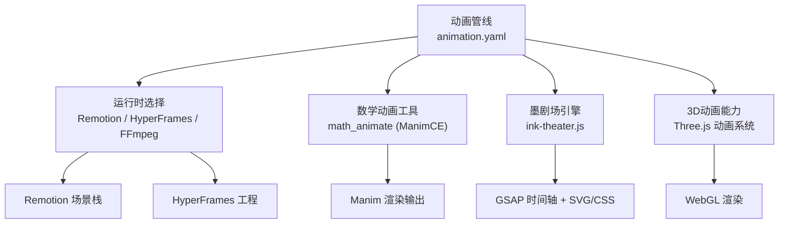
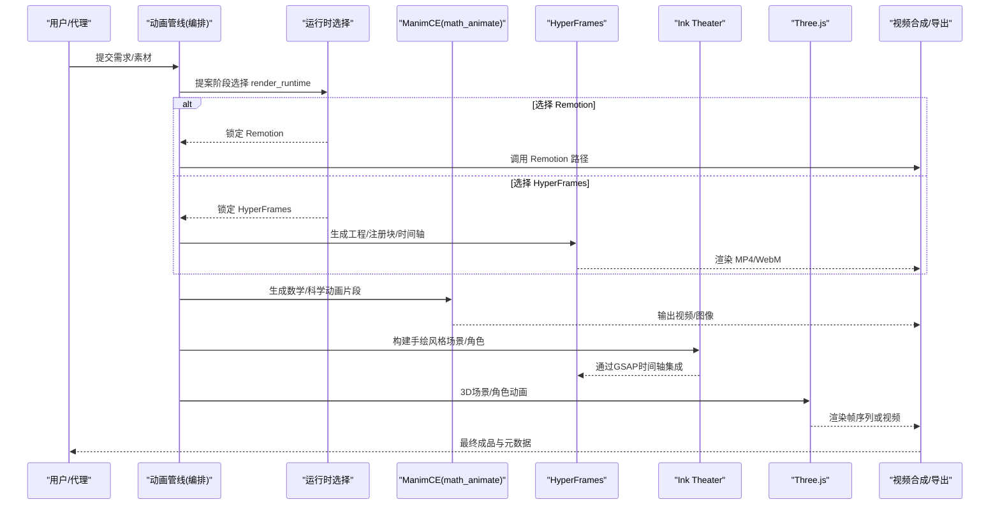
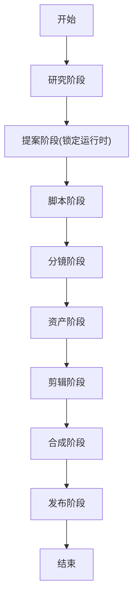
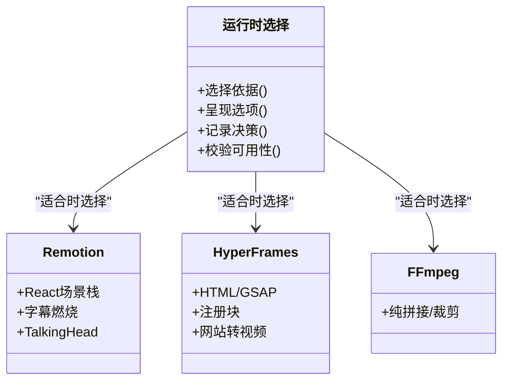
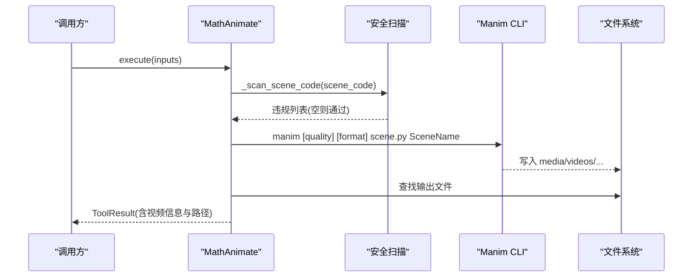
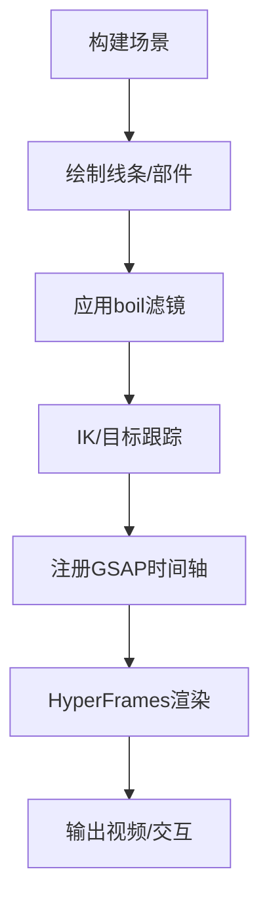
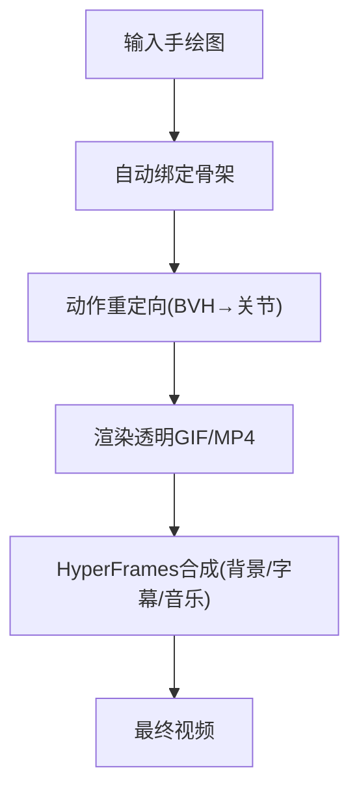
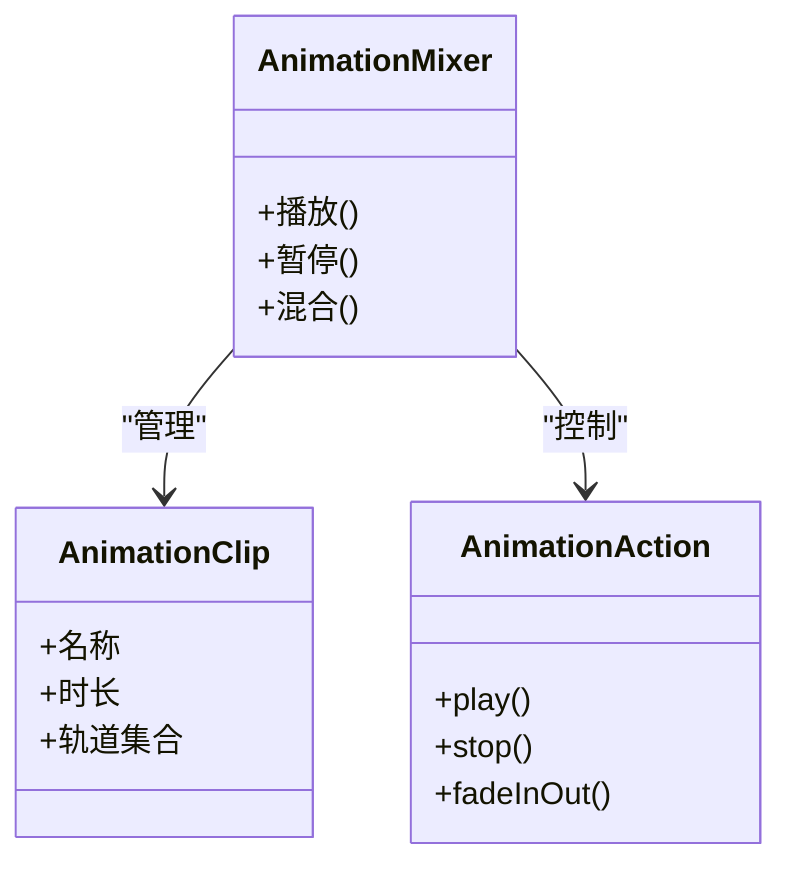
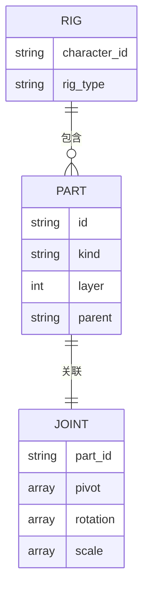
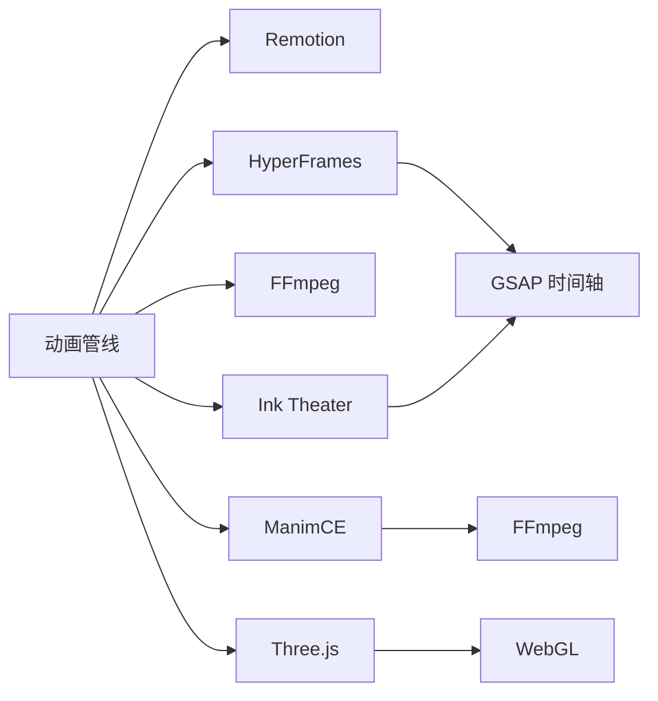

# 动画制作技能

<cite>
**本文引用的文件**
- [animation.yaml](file://pipeline_defs/animation.yaml)
- [animation-pipeline.md](file://skills/creative/animation-pipeline.md)
- [manim-usage.md](file://skills/creative/manim-usage.md)
- [ink-theater.md](file://skills/creative/ink-theater.md)
- [animated-drawing.md](file://skills/creative/animated-drawing.md)
- [hyperframes.md](file://skills/core/hyperframes.md)
- [animation-runtime-selector.md](file://skills/meta/animation-runtime-selector.md)
- [math_animate.py](file://tools/graphics/math_animate.py)
- [README.md（ink-theater）](file://ink-theater/README.md)
- [SKILL.md（threejs-animation）](file://.agents/skills/threejs-animation/SKILL.md)
- [SKILL.md（character-rigging）](file://.agents/skills/character-rigging/SKILL.md)
</cite>

## 目录
1. [简介](#简介)
2. [项目结构](#项目结构)
3. [核心组件](#核心组件)
4. [架构总览](#架构总览)
5. [详细组件分析](#详细组件分析)
6. [依赖关系分析](#依赖关系分析)
7. [性能考量](#性能考量)
8. [故障排查指南](#故障排查指南)
9. [结论](#结论)
10. [附录](#附录)

## 简介
本技术文档面向OpenMontage的“动画制作技能”，覆盖动画流水线、动态绘图、数学可视化动画、墨剧场等能力，并系统说明2D与3D动画的制作流程（角色动画、场景动画、特效动画）。重点解释如何使用Manim进行科学可视化动画、使用Ink Theater进行交互式动画创作，以及关键帧设置、缓动函数、时间轴管理等关键技术要点。

## 项目结构
OpenMontage将“动画”作为一类生产管线，通过统一的编排器驱动研究、提案、脚本、分镜、资产、剪辑、合成与发布阶段；同时提供多种运行时与工具链：Remotion（React）、HyperFrames（HTML/GSAP）、Manim（数学动画）、Ink Theater（手绘风格交互引擎）、Three.js（3D世界与动画）等。

图表来源
- [animation.yaml:1-300](file://pipeline_defs/animation.yaml#L1-L300)
- [hyperframes.md:29-83](file://skills/core/hyperframes.md#L29-L83)
- [manim-usage.md:19-49](file://skills/creative/manim-usage.md#L19-L49)
- [README.md（ink-theater）:1-87](file://ink-theater/README.md#L1-L87)
- [SKILL.md（threejs-animation）:1-53](file://.agents/skills/threejs-animation/SKILL.md#L1-L53)

章节来源
- [animation.yaml:1-300](file://pipeline_defs/animation.yaml#L1-L300)
- [hyperframes.md:29-83](file://skills/core/hyperframes.md#L29-L83)

## 核心组件
- 动画管线编排：统一入口，定义阶段、产物、工具与评审标准，确保从研究到发布的可追溯性。
- 运行时选择：在提案阶段明确选择 Remotion/HyperFrames/FFmpeg，并在后续阶段保持一致。
- 数学动画工具：基于ManimCE的安全渲染封装，支持代码扫描、质量预设、透明背景与格式控制。
- 墨剧场引擎：手绘风格SVG/CSS+GSAP的确定性、可寻址动画引擎，支持角色IK、弹簧缓动、机器部件组合与动作库。
- 3D动画能力：Three.js的关键帧、骨骼、混合与程序化动画，用于3D场景与角色运动。
- 动态绘图：对已有手绘图进行自动绑定与动作重定向，输出透明GIF/MP4并与HyperFrames合成。

章节来源
- [animation.yaml:62-300](file://pipeline_defs/animation.yaml#L62-L300)
- [animation-runtime-selector.md:26-75](file://skills/meta/animation-runtime-selector.md#L26-L75)
- [math_animate.py:84-186](file://tools/graphics/math_animate.py#L84-L186)
- [ink-theater.md:1-61](file://skills/creative/ink-theater.md#L1-L61)
- [SKILL.md（threejs-animation）:29-53](file://.agents/skills/threejs-animation/SKILL.md#L29-L53)
- [animated-drawing.md:1-72](file://skills/creative/animated-drawing.md#L1-L72)

## 架构总览
下图展示动画流水线与各运行时的协作关系，以及数据流与控制流。

图表来源
- [animation.yaml:62-300](file://pipeline_defs/animation.yaml#L62-L300)
- [hyperframes.md:145-164](file://skills/core/hyperframes.md#L145-L164)
- [manim-usage.md:19-49](file://skills/creative/manim-usage.md#L19-L49)
- [README.md（ink-theater）:1-87](file://ink-theater/README.md#L1-L87)
- [SKILL.md（threejs-animation）:29-53](file://.agents/skills/threejs-animation/SKILL.md#L29-L53)

## 详细组件分析

### 动画流水线（Animation Pipeline）
- 阶段划分：研究→提案→脚本→分镜→资产→剪辑→合成→发布，每个阶段产出明确的制品并通过检查点与人工审批。
- 运行时锁定：提案阶段必须记录render_runtime，并在后续阶段保持不变；如需变更需记录决策日志。
- 工具可用性：各阶段声明可用工具（如math_animate、diagram_gen、threejs_world等），保证方案可落地。
- 评审标准：每阶段有成功标准与审查焦点，确保质量与一致性。

图表来源
- [animation.yaml:62-300](file://pipeline_defs/animation.yaml#L62-L300)

章节来源
- [animation.yaml:62-300](file://pipeline_defs/animation.yaml#L62-L300)

### 运行时选择（Remotion vs HyperFrames vs FFmpeg）
- 选择原则：根据创意语法与工具生态决定，提案阶段必须呈现两种可选运行时并记录决策。
- 规则约束：若交付承诺要求真实运动，则不得降级为纯拼接；不可用时应显式升级而非静默替换。
- 映射关系：编辑决策中的cut、时长、类型等字段映射到HyperFrames工程结构与时间轴。

图表来源
- [animation-runtime-selector.md:26-75](file://skills/meta/animation-runtime-selector.md#L26-L75)
- [hyperframes.md:29-83](file://skills/core/hyperframes.md#L29-L83)

章节来源
- [animation-runtime-selector.md:26-75](file://skills/meta/animation-runtime-selector.md#L26-L75)
- [hyperframes.md:29-83](file://skills/core/hyperframes.md#L29-L83)

### Manim 数学可视化动画
- 安全执行：对scene_code进行静态扫描，阻止危险导入与反射访问；默认拒绝不安全代码，除非显式允许。
- 渲染参数：质量预设（低/中/高/4K/预览）、格式（mp4/gif/webm/png）、透明背景、背景色、额外CLI参数。
- 输出处理：自动检测Scene类名、查找媒体输出、ffprobe探测信息、清理临时目录。
- 最佳实践：单概念一场景、逐层构建、控制元素数量、合理等待、暗色背景、语义化配色、默认2D。

图表来源
- [math_animate.py:225-316](file://tools/graphics/math_animate.py#L225-L316)
- [math_animate.py:317-416](file://tools/graphics/math_animate.py#L317-L416)
- [manim-usage.md:19-49](file://skills/creative/manim-usage.md#L19-L49)

章节来源
- [math_animate.py:84-186](file://tools/graphics/math_animate.py#L84-L186)
- [math_animate.py:225-416](file://tools/graphics/math_animate.py#L225-L416)
- [manim-usage.md:19-49](file://skills/creative/manim-usage.md#L19-L49)

### Ink Theater 墨剧场（手绘风格交互动画）
- 能力模块：ink strokes（手绘线条）、boil（手绘抖动）、spring physics（闭合形式弹簧缓动）、rig/IK（2D FABRIK）、contraption grammar（机器部件组合）。
- 确定性：所有帧由时间唯一确定，无随机时钟；seek-safe，兼容HyperFrames渲染契约。
- 字体注意：手写字体需嵌入完整字体文件，避免Google Fonts子集导致回退。
- 角色动画：通过Ink Puppet与mocap动作库（walk/run/jump/wave等）实现真实动作重定向，无需手工调参。

图表来源
- [README.md（ink-theater）:11-43](file://ink-theater/README.md#L11-L43)
- [ink-theater.md:34-56](file://skills/creative/ink-theater.md#L34-L56)

章节来源
- [README.md（ink-theater）:1-87](file://ink-theater/README.md#L1-87)
- [ink-theater.md:1-61](file://skills/creative/ink-theater.md#L1-L61)

### 动态绘图（Animated Drawing）
- 输入要求：清晰的人形手绘图（四肢分离、浅色背景），用于自动骨架预测与纹理网格变形。
- 运行模式：内置角色+预设动作（CPU快速）；或新图自动绑定（需要Docker与模型）。
- 输出与合成：透明GIF/MP4，配合HyperFrames叠加背景、对话框、音乐；注意视频轨道与淡入淡出规则。
- 限制：栅格变形、仅人形、无自绘揭示效果；如需矢量自绘与手绘风格，请使用Ink Art。

图表来源
- [animated-drawing.md:21-66](file://skills/creative/animated-drawing.md#L21-L66)

章节来源
- [animated-drawing.md:1-72](file://skills/creative/animated-drawing.md#L1-L72)

### 3D 动画（Three.js）
- 动画系统：AnimationClip（关键帧容器）、AnimationMixer（播放控制器）、AnimationAction（播放控制）。
- 关键帧：通过NumberKeyframeTrack等定义属性轨迹，支持位置、旋转、缩放等。
- 应用场景：3D地形/世界、相机路径、对象动画、混合与程序化运动。

图表来源
- [SKILL.md（threejs-animation）:29-53](file://.agents/skills/threejs-animation/SKILL.md#L29-L53)

章节来源
- [SKILL.md（threejs-animation）:29-53](file://.agents/skills/threejs-animation/SKILL.md#L29-L53)

### 角色绑定（Character Rigging）
- 数据驱动：以JSON描述角色部件、层级、枢轴、约束与视图，便于复用与扩展。
- 质量清单：移动部件必须有枢轴；父子层级明确；嘴型、眼睛、道具独立以便表情与互动。
- 适用场景：2D角色动画、局部动作（眨眼、转头、惊讶等），配合时间轴与关键帧。

图表来源
- [SKILL.md（character-rigging）:21-46](file://.agents/skills/character-rigging/SKILL.md#L21-L46)

章节来源
- [SKILL.md（character-rigging）:1-54](file://.agents/skills/character-rigging/SKILL.md#L1-L54)

## 依赖关系分析
- 管线依赖：animation.yaml定义了所需技能与工具，贯穿各阶段。
- 运行时依赖：Remotion/HyperFrames/FFmpeg的选择影响后续工具链与产物格式。
- 工具依赖：ManimCE需要Python环境、LaTeX（可选）、FFmpeg；Ink Theater依赖GSAP与HyperFrames工作区；Three.js依赖浏览器WebGL环境。
- 外部资源：字体、动作库、模板与样式桥接。

图表来源
- [animation.yaml:30-44](file://pipeline_defs/animation.yaml#L30-L44)
- [hyperframes.md:206-237](file://skills/core/hyperframes.md#L206-L237)
- [manim-usage.md:19-49](file://skills/creative/manim-usage.md#L19-L49)
- [README.md（ink-theater）:1-87](file://ink-theater/README.md#L1-L87)

章节来源
- [animation.yaml:30-44](file://pipeline_defs/animation.yaml#L30-L44)
- [hyperframes.md:206-237](file://skills/core/hyperframes.md#L206-L237)

## 性能考量
- 帧率与导出：默认30fps；Manim建议60fps渲染后转码至30fps以获得更平滑运动；YouTube/Web使用H.264 CRF 18-20。
- 渲染成本：HyperFrames本地渲染CPU密集，视频多元素时使用--workers 1避免过载；Manim 3D渲染较慢，优先2D。
- 素材质量：背景视频需确保源分辨率足够，避免小画面黑边；必要时使用scale-to-cover+crop+unsharp。
- 关键帧密度：下载素材需重编码以保证关键帧间隔合理，避免渲染卡顿。

章节来源
- [animation-pipeline.md:26-49](file://skills/creative/animation-pipeline.md#L26-L49)
- [manim-usage.md:19-49](file://skills/creative/manim-usage.md#L19-L49)
- [hyperframes.md:301-409](file://skills/core/hyperframes.md#L301-L409)

## 故障排查指南
- Manim渲染失败：检查scene_code是否被安全扫描拦截；确认Manim安装与环境；查看错误输出定位问题。
- HyperFrames验证失败：先运行lint与validate修复时间轴与对比度等问题，再执行render；避免无限repeat与异步构造。
- 字体回退：确保嵌入完整手写字体文件，避免Google Fonts子集缺失基本字符集。
- 背景视频黑边：检查源分辨率与预处理滤镜，使用cover+crop策略；预览时拖动检查布局。
- 3D渲染异常：确认WebGL上下文、着色器与材质配置；降低复杂度或调整采样。

章节来源
- [math_animate.py:281-316](file://tools/graphics/math_animate.py#L281-L316)
- [hyperframes.md:240-261](file://skills/core/hyperframes.md#L240-L261)
- [README.md（ink-theater）:31-43](file://ink-theater/README.md#L31-L43)
- [hyperframes.md:301-409](file://skills/core/hyperframes.md#L301-L409)

## 结论
OpenMontage的动画制作技能提供了从2D到3D、从数学可视化到手绘风格的完整能力矩阵。通过统一的动画管线与运行时选择机制，结合Manim与Ink Theater等专用引擎，能够高效产出高质量动画内容。遵循关键帧设置、缓动函数与时间轴管理的最佳实践，可在保证视觉表现的同时提升渲染效率与稳定性。

## 附录
- 关键帧设置：按场景节奏设定进入/停留/退出时长，保持信息可读性与叙事节奏。
- 缓动函数：默认使用easeInOutCubic；避免线性缓动用于运动；根据情绪选择back/elastic等。
- 时间轴管理：单一暂停时间轴、确定性seek、避免无限循环与异步构造；严格遵循HyperFrames渲染契约。

章节来源
- [animation-pipeline.md:50-147](file://skills/creative/animation-pipeline.md#L50-L147)
- [hyperframes.md:419-437](file://skills/core/hyperframes.md#L419-L437)