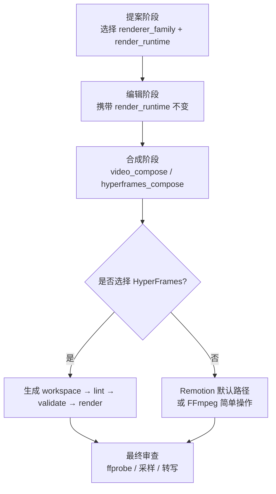
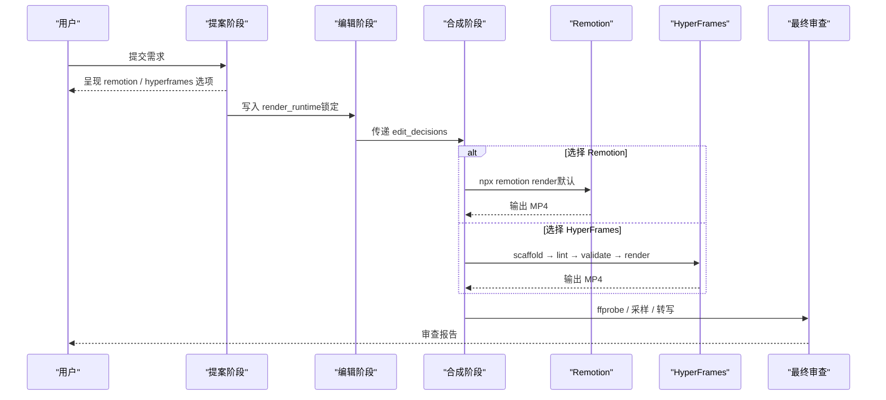
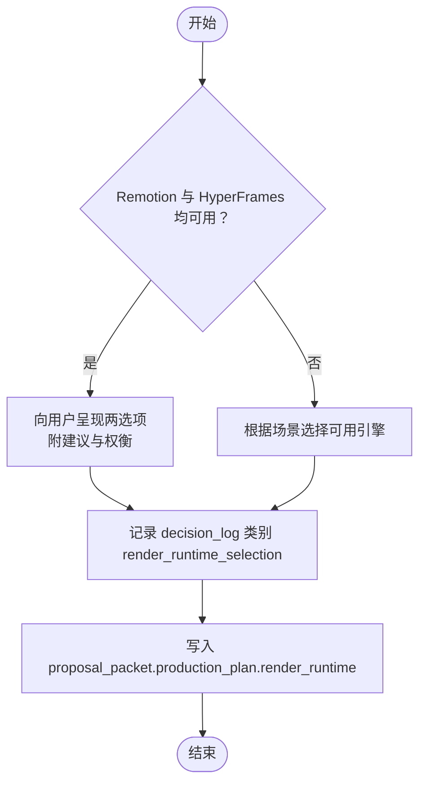
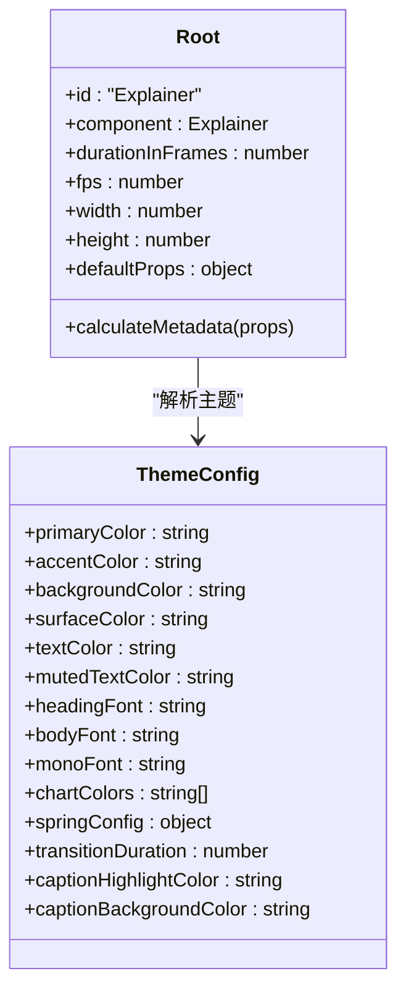
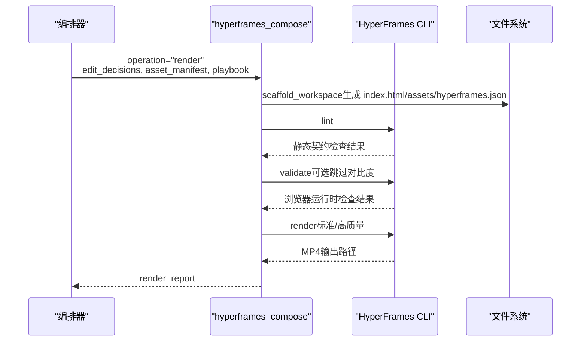
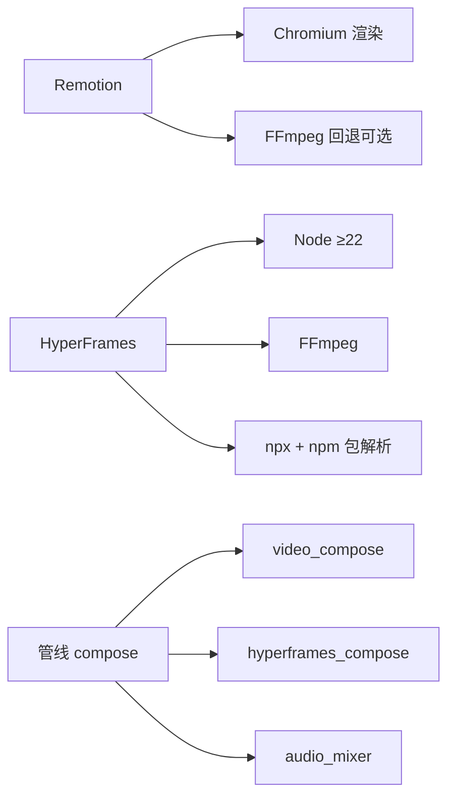

# 动画流水线概览

<cite>
**本文引用的文件**
- [skills/core/remotion.md](file://skills/core/remotion.md)
- [skills/core/hyperframes.md](file://skills/core/hyperframes.md)
- [skills/meta/animation-runtime-selector.md](file://skills/meta/animation-runtime-selector.md)
- [pipeline_defs/animation.yaml](file://pipeline_defs/animation.yaml)
- [pipeline_defs/hybrid.yaml](file://pipeline_defs/hybrid.yaml)
- [tools/video/remotion_caption_burn.py](file://tools/video/remotion_caption_burn.py)
- [tools/video/hyperframes_compose.py](file://tools/video/hyperframes_compose.py)
- [lib/hyperframes_style_bridge.py](file://lib/hyperframes_style_bridge.py)
- [remotion-composer/src/Root.tsx](file://remotion-composer/src/Root.tsx)
- [.agents/skills/hyperframes-animation/adapters/gsap.md](file://.agents/skills/hyperframes-animation/adapters/gsap.md)
- [.agents/skills/hyperframes-animation/adapters/gsap-timeline-and-labels.md](file://.agents/skills/hyperframes-animation/adapters/gsap-timeline-and-labels.md)
- [.agents/skills/hyperframes-animation/adapters/gsap-easing-and-stagger.md](file://.agents/skills/hyperframes-animation/adapters/gsap-easing-and-stagger.md)
</cite>

## 目录
1. [简介](#简介)
2. [项目结构](#项目结构)
3. [核心组件](#核心组件)
4. [架构总览](#架构总览)
5. [详细组件分析](#详细组件分析)
6. [依赖关系分析](#依赖关系分析)
7. [性能考量](#性能考量)
8. [故障排查指南](#故障排查指南)
9. [结论](#结论)
10. [附录](#附录)

## 简介
本文件面向OpenMontage的动画流水线，聚焦Remotion与HyperFrames两种渲染引擎的选择策略、帧率与时间轴管理、缓动函数应用，以及关键帧设置、场景过渡、色彩管理等最佳实践。目标是帮助读者在“数据密集型动画”和“运动图形创作”之间做出正确选择，并在工程层面保证可验证、可复现的高质量输出。

## 项目结构
OpenMontage将“创意语法（renderer_family）”与“技术引擎（render_runtime）”解耦：前者决定叙事风格（如explainer-data、cinematic-trailer），后者决定实现方式（remotion、hyperframes、ffmpeg）。提案阶段锁定两者，贯穿edit_decisions并禁止静默切换。

图表来源
- [skills/meta/animation-runtime-selector.md:26-73](file://skills/meta/animation-runtime-selector.md#L26-L73)
- [skills/core/hyperframes.md:188-203](file://skills/core/hyperframes.md#L188-L203)
- [tools/video/hyperframes_compose.py:766-800](file://tools/video/hyperframes_compose.py#L766-L800)

章节来源
- [skills/meta/animation-runtime-selector.md:26-73](file://skills/meta/animation-runtime-selector.md#L26-L73)
- [skills/core/hyperframes.md:188-203](file://skills/core/hyperframes.md#L188-L203)

## 核心组件
- 运行时选择器：提供决策矩阵与强制规则，确保在双引擎可用时向用户呈现选项并记录决策。
- Remotion 路径：默认用于React场景堆栈、字幕逐字高亮、TalkingHead等；通过CLI触发渲染。
- HyperFrames 路径：HTML/CSS/GSAP原生运动图形、注册表块、网站转视频；通过workspace→lint→validate→render流程。
- 样式桥接：Playbook统一驱动Remotion主题与HyperFrames CSS变量，避免为不同引擎维护两套样式。
- 管线定义：animation与hybrid管线在compose阶段暴露工具集与质量门禁，要求校验与自检。

章节来源
- [skills/meta/animation-runtime-selector.md:26-73](file://skills/meta/animation-runtime-selector.md#L26-L73)
- [skills/core/remotion.md:16-44](file://skills/core/remotion.md#L16-L44)
- [skills/core/hyperframes.md:29-56](file://skills/core/hyperframes.md#L29-L56)
- [lib/hyperframes_style_bridge.py:70-141](file://lib/hyperframes_style_bridge.py#L70-L141)
- [pipeline_defs/animation.yaml:245-278](file://pipeline_defs/animation.yaml#L245-L278)
- [pipeline_defs/hybrid.yaml:170-207](file://pipeline_defs/hybrid.yaml#L170-L207)

## 架构总览
下图展示从提案到合成的端到端流程，包括Remotion与HyperFrames两条路径及共同的质量门禁。

图表来源
- [skills/meta/animation-runtime-selector.md:33-55](file://skills/meta/animation-runtime-selector.md#L33-L55)
- [skills/core/remotion.md:183-199](file://skills/core/remotion.md#L183-L199)
- [tools/video/hyperframes_compose.py:766-800](file://tools/video/hyperframes_compose.py#L766-L800)
- [skills/core/remotion.md:333-361](file://skills/core/remotion.md#L333-L361)

## 详细组件分析

### 运行时选择策略（Remotion vs HyperFrames vs FFmpeg）
- 当存在现成React场景堆栈（text_card、stat_card、图表、字幕叠加、TalkingHead、CinematicRenderer）时优先Remotion。
- 当需要逐字高亮字幕、头像口播、或已有Remotion资产时，锁定Remotion。
- 当需要Kinetic Typography、产品宣传片、注册表块、网站转视频、Beat-synced音乐视频时优先HyperFrames。
- 纯剪辑/拼接无合成时使用FFmpeg。
- 若所选引擎不可用，必须上报阻塞项并等待用户批准，不得静默降级。

图表来源
- [skills/meta/animation-runtime-selector.md:33-55](file://skills/meta/animation-runtime-selector.md#L33-L55)
- [skills/core/hyperframes.md:57-83](file://skills/core/hyperframes.md#L57-L83)

章节来源
- [skills/meta/animation-runtime-selector.md:26-73](file://skills/meta/animation-runtime-selector.md#L26-L73)
- [skills/core/hyperframes.md:29-83](file://skills/core/hyperframes.md#L29-L83)

### Remotion 路径：数据密集型动画与默认渲染
- 默认渲染引擎：Remotion处理视频片段、静态图、动画场景、组件类型、过渡与混合内容，一次React渲染完成。
- 媒体配置映射：通过media profile映射width/height/fps（如youtube_landscape=1920×1080@30fps，cinematic_wide=2560×1080@24fps）。
- 动态时长：使用calculateMetadata按cuts计算durationInFrames。
- 音频分层：旁白、背景音乐、音效作为并行Audio层，支持offset、loop、fadeIn/Out。
- 关键约束：禁用CSS动画类；所有运动基于useCurrentFrame+interpolate；注意Sequence duration与Composition duration差异。

图表来源
- [remotion-composer/src/Root.tsx:24-121](file://remotion-composer/src/Root.tsx#L24-L121)
- [remotion-composer/src/Root.tsx:123-152](file://remotion-composer/src/Root.tsx#L123-L152)

章节来源
- [skills/core/remotion.md:16-44](file://skills/core/remotion.md#L16-L44)
- [skills/core/remotion.md:183-213](file://skills/core/remotion.md#L183-L213)
- [skills/core/remotion.md:216-262](file://skills/core/remotion.md#L216-L262)
- [skills/core/remotion.md:282-331](file://skills/core/remotion.md#L282-L331)
- [remotion-composer/src/Root.tsx:24-152](file://remotion-composer/src/Root.tsx#L24-L152)

### HyperFrames 路径：HTML/GSAP运动图形与注册表
- 工作区隔离：每个项目独立workspace，避免与Remotion共享目录冲突。
- 工件映射：edit_decisions.cuts→index.html时间线；asset_manifest→assets复制/软链；audio/music→多音轨；playbook→CSS变量。
- 质量门禁：lint→validate→render；最终审查同Remotion路径。
- 可用性检查：Node≥22、ffmpeg、npx、npm包可解析、CLI doctor通过。
- 反模式：避免无限repeat、异步构建timeline、布局属性动画。

图表来源
- [tools/video/hyperframes_compose.py:532-621](file://tools/video/hyperframes_compose.py#L532-L621)
- [tools/video/hyperframes_compose.py:623-718](file://tools/video/hyperframes_compose.py#L623-L718)
- [tools/video/hyperframes_compose.py:766-800](file://tools/video/hyperframes_compose.py#L766-L800)

章节来源
- [skills/core/hyperframes.md:102-164](file://skills/core/hyperframes.md#L102-L164)
- [skills/core/hyperframes.md:206-261](file://skills/core/hyperframes.md#L206-L261)
- [tools/video/hyperframes_compose.py:238-440](file://tools/video/hyperframes_compose.py#L238-L440)
- [tools/video/hyperframes_compose.py:532-800](file://tools/video/hyperframes_compose.py#L532-L800)

### 帧率选择原则与时间轴管理
- 帧率选择：
  - 通用平台：30fps（YouTube横屏/竖屏、TikTok、Reels、Instagram方形）。
  - 电影感宽屏：24fps（cinematic_wide）。
- 时间轴管理：
  - Remotion：使用TransitionSeries/Sequence组合场景；注意Sequence duration与Composition duration差异；通过calculateMetadata动态计算总时长。
  - HyperFrames：以data-start/data-duration控制片段；GSAP timeline需paused:true并由框架seek驱动；子composition入口优先fromTo以保证重seek一致性。

章节来源
- [skills/core/remotion.md:203-213](file://skills/core/remotion.md#L203-L213)
- [skills/core/remotion.md:216-262](file://skills/core/remotion.md#L216-L262)
- [.agents/skills/hyperframes-animation/adapters/gsap-timeline-and-labels.md:1-97](file://.agents/skills/hyperframes-animation/adapters/gsap-timeline-and-labels.md#L1-L97)

### 缓动函数应用与运动语言
- Remotion：使用interpolate/spring进行基础运动；避免CSS动画类；clamp边界值防止越界。
- HyperFrames：GSAP内置easing家族（power/back/elastic/expo/sine/circ/steps）；为不同情绪匹配不同缓动；stagger用于批量入场；避免layout属性动画，使用transform与autoAlpha。

章节来源
- [skills/core/remotion.md:324-331](file://skills/core/remotion.md#L324-L331)
- [.agents/skills/hyperframes-animation/adapters/gsap-easing-and-stagger.md:1-119](file://.agents/skills/hyperframes-animation/adapters/gsap-easing-and-stagger.md#L1-L119)
- [.agents/skills/hyperframes-animation/adapters/gsap.md:57-75](file://.agents/skills/hyperframes-animation/adapters/gsap.md#L57-L75)

### 关键帧设置、场景过渡与色彩管理
- 关键帧：
  - HyperFrames：对背景视频需密集关键帧（g/keyint_min限制），避免渲染卡顿；下载素材后重新编码以确保关键帧密度。
  - Remotion：图表动画至少4秒完成；hero标题约4秒；每场景4-6秒节奏。
- 场景过渡：
  - Remotion：TransitionSeries.Transition指定淡入/滑出/擦除等；注意重叠时间避免黑场。
  - HyperFrames：通过labels与position参数组织时间线；子composition入口用fromTo避免状态漂移。
- 色彩管理：
  - Playbook统一驱动Remotion主题与HyperFrames CSS变量；避免硬编码颜色；必要时在edit_decisions中覆盖主色/强调色/背景色。

章节来源
- [skills/core/hyperframes.md:396-403](file://skills/core/hyperframes.md#L396-L403)
- [skills/core/remotion.md:87-119](file://skills/core/remotion.md#L87-L119)
- [lib/hyperframes_style_bridge.py:70-141](file://lib/hyperframes_style_bridge.py#L70-L141)

### 字幕与音频集成
- 逐字高亮字幕：Remotion CaptionOverlay/TalkingHead专属能力；HyperFrames暂不替代。
- 音频分层：Remotion内Audio组件叠加旁白/音乐/SFX；支持offset/loop/fade；HyperFrames通过多<audio>元素与volume tween实现淡入淡出。

章节来源
- [tools/video/remotion_caption_burn.py:1-29](file://tools/video/remotion_caption_burn.py#L1-L29)
- [tools/video/remotion_caption_burn.py:267-356](file://tools/video/remotion_caption_burn.py#L267-L356)
- [skills/core/remotion.md:282-315](file://skills/core/remotion.md#L282-L315)
- [skills/core/hyperframes.md:145-164](file://skills/core/hyperframes.md#L145-L164)

## 依赖关系分析
- 运行时依赖：
  - Remotion：Node.js 18+；Chromium实例；NPM包；可选FFmpeg回退。
  - HyperFrames：Node.js ≥22；FFmpeg；npx；npm包可解析；CLI doctor通过。
- 管线依赖：
  - animation与hybrid管线在compose阶段要求video_compose/hyperframes_compose与audio_mixer；quality gate包含lint/validate与ffprobe验证。

图表来源
- [skills/core/remotion.md:324-331](file://skills/core/remotion.md#L324-L331)
- [tools/video/hyperframes_compose.py:238-440](file://tools/video/hyperframes_compose.py#L238-L440)
- [pipeline_defs/animation.yaml:245-278](file://pipeline_defs/animation.yaml#L245-L278)
- [pipeline_defs/hybrid.yaml:170-207](file://pipeline_defs/hybrid.yaml#L170-L207)

章节来源
- [skills/core/remotion.md:324-331](file://skills/core/remotion.md#L324-L331)
- [tools/video/hyperframes_compose.py:238-440](file://tools/video/hyperframes_compose.py#L238-L440)
- [pipeline_defs/animation.yaml:245-278](file://pipeline_defs/animation.yaml#L245-L278)
- [pipeline_defs/hybrid.yaml:170-207](file://pipeline_defs/hybrid.yaml#L170-L207)

## 性能考量
- Remotion：
  - 渲染CPU密集但API成本为0；串行渲染以避免内存压力；避免CSS动画类；clamp interpolate边界。
- HyperFrames：
  - 视频密集场景使用--workers 1避免headless Chrome过载；背景视频需reencode确保关键帧密度；避免布局属性动画；有限repeat。
- 通用：
  - 预渲染验证（Remotion composition_validator；HyperFrames lint/validate）；最终审查ffprobe/采样/转写。

章节来源
- [skills/core/remotion.md:317-331](file://skills/core/remotion.md#L317-L331)
- [skills/core/hyperframes.md:405-418](file://skills/core/hyperframes.md#L405-L418)
- [skills/core/hyperframes.md:396-403](file://skills/core/hyperframes.md#L396-L403)
- [skills/core/remotion.md:333-361](file://skills/core/remotion.md#L333-L361)

## 故障排查指南
- Remotion常见问题：
  - 缺失音频流：立即停止并重查音频配置；常见原因为未嵌入narration/music。
  - 序列时长误用：useVideoConfig().durationInFrames返回的是Composition时长而非Sequence时长；应传入sceneDurationSeconds计算有效时长。
  - 文本承载场景使用Remotion text_card而非AI图像加文字。
- HyperFrames常见问题：
  - 背景视频小框居中：多为源分辨率不足导致letterbox；需scale-to-cover+crop+unsharp。
  - 渲染超时/卡帧：stock素材关键帧间隔过大；需reencode并设置g/keyint_min。
  - 字体渲染异常：仅编译器支持的字体可内联；选择Outfit/Inter/JetBrains Mono等安全字体。
- 通用：
  - 严格遵循lint/validate门禁；最终审查必须包含ffprobe/采样/转写。

章节来源
- [skills/core/remotion.md:324-377](file://skills/core/remotion.md#L324-L377)
- [skills/core/hyperframes.md:301-418](file://skills/core/hyperframes.md#L301-L418)
- [tools/video/remotion_caption_burn.py:443-489](file://tools/video/remotion_caption_burn.py#L443-L489)

## 结论
OpenMontage通过明确的运行时选择策略与严格的管线质量门禁，确保在不同创意目标下选择最合适的渲染引擎：数据密集型与React生态优先Remotion；HTML/GSAP原生运动图形与注册表生态优先HyperFrames。配合统一的Playbook样式桥接、帧率与时间轴规范、缓动函数体系，以及完备的预渲染与最终审查流程，可在保证效率的同时产出稳定、可复现的高质量动画作品。

## 附录
- 推荐阅读：
  - 运行时选择器与决策矩阵（skills/meta/animation-runtime-selector.md）
  - Remotion技能与最佳实践（skills/core/remotion.md）
  - HyperFrames技能与工作区映射（skills/core/hyperframes.md）
  - GSAP适配器与时间线/缓动参考（.agents/skills/hyperframes-animation/adapters/*.md）
  - 管线定义（pipeline_defs/animation.yaml、pipeline_defs/hybrid.yaml）