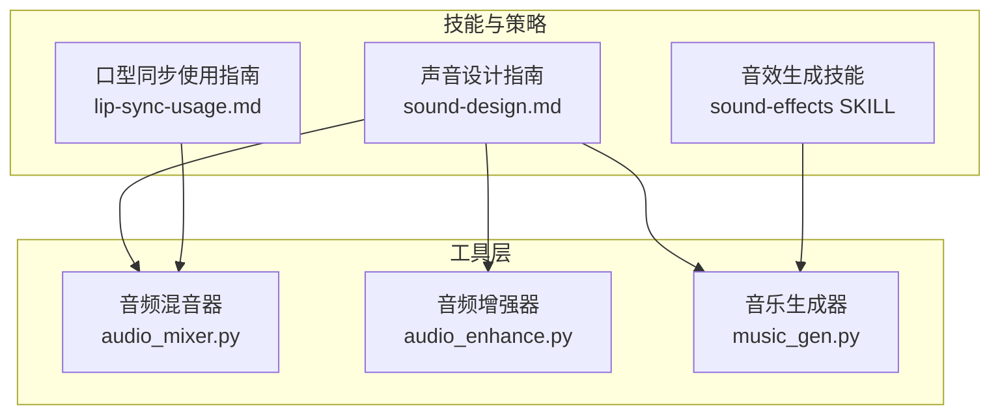
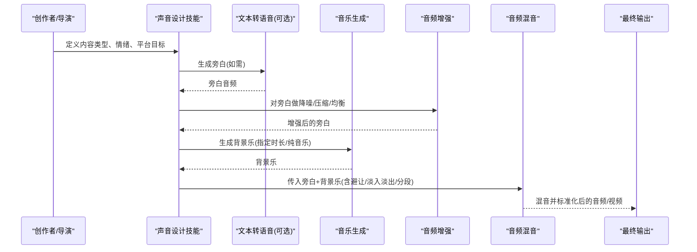
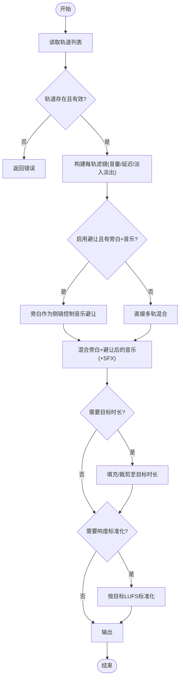
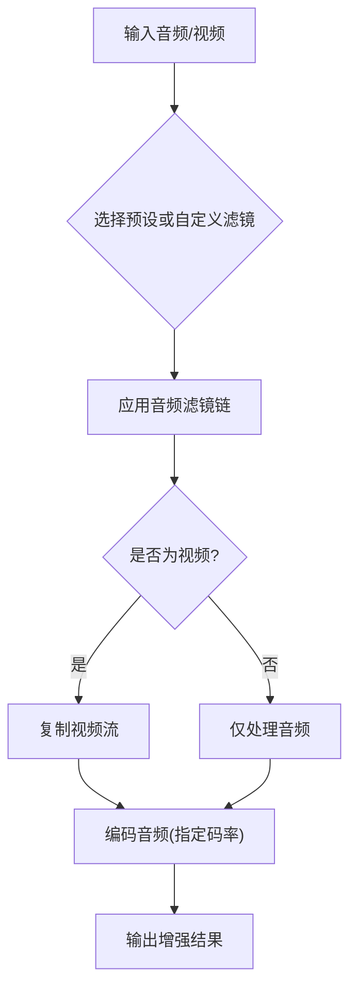
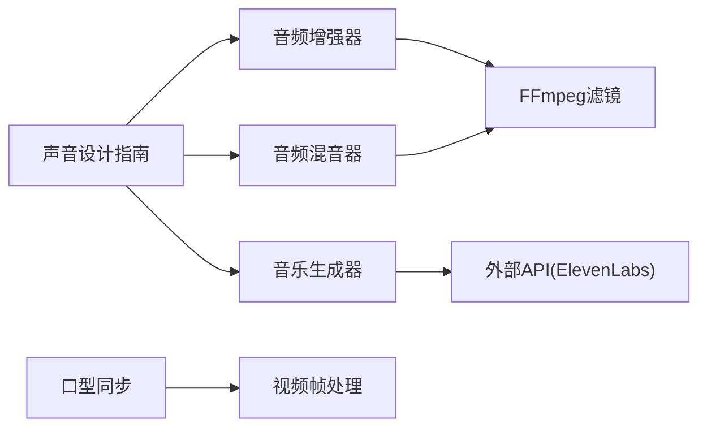

# 声音设计技能

<cite>
**本文引用的文件**
- [tools/audio/audio_mixer.py](file://tools/audio/audio_mixer.py)
- [tools/audio/audio_enhance.py](file://tools/audio/audio_enhance.py)
- [tools/audio/music_gen.py](file://tools/audio/music_gen.py)
- [skills/creative/sound-design.md](file://skills/creative/sound-design.md)
- [skills/creative/lip-sync-usage.md](file://skills/creative/lip-sync-usage.md)
- [.agents/skills/sound-effects/SKILL.md](file://.agents/skills/sound-effects/SKILL.md)
- [tests/tools/test_audio_mixer_segmented_music.py](file://tests/tools/test_audio_mixer_segmented_music.py)
- [tests/tools/test_audio_mixer_ducking.py](file://tests/tools/test_audio_mixer_ducking.py)
- [tests/tools/test_audio_mixer_loudnorm_target.py](file://tests/tools/test_audio_mixer_loudnorm_target.py)
- [tests/tools/test_audio_mixer_target_duration.py](file://tests/tools/test_audio_mixer_target_duration.py)
- [tests/tools/test_audio_mixer_track_fades.py](file://tests/tools/test_audio_mixer_track_fades.py)
</cite>

## 目录
1. [简介](#简介)
2. [项目结构](#项目结构)
3. [核心组件](#核心组件)
4. [架构总览](#架构总览)
5. [详细组件分析](#详细组件分析)
6. [依赖关系分析](#依赖关系分析)
7. [性能与质量考量](#性能与质量考量)
8. [故障排查指南](#故障排查指南)
9. [结论](#结论)
10. [附录](#附录)

## 简介
本技术文档面向OpenMontage的声音设计能力，覆盖音频处理、音乐生成、口型同步、音效设计、语音合成、混音降噪与音质增强等关键环节。文档基于仓库中的工具实现与创意技能说明，提供从策略到落地的完整路径：如何选择AI工具进行音效与背景音乐创作、如何进行后期处理（混音、降噪、响度标准化）、如何实现语音与画面的高质量同步，以及不同场景下的声音设计策略与质量标准。

## 项目结构
OpenMontage将声音相关能力拆分为“工具层”和“技能/策略层”：
- 工具层（tools/audio）：提供可复用的音频处理能力，如混音、降噪、响度标准化、分段配乐、TTS与音乐生成等。
- 技能层（skills/creative 与 .agents/skills）：提供跨工具的编排策略、平台规范、最佳实践与提示词指导。

图表来源
- [skills/creative/sound-design.md:1-142](file://skills/creative/sound-design.md#L1-L142)
- [skills/creative/lip-sync-usage.md:1-134](file://skills/creative/lip-sync-usage.md#L1-L134)
- [.agents/skills/sound-effects/SKILL.md:1-121](file://.agents/skills/sound-effects/SKILL.md#L1-L121)
- [tools/audio/audio_mixer.py:1-776](file://tools/audio/audio_mixer.py#L1-L776)
- [tools/audio/audio_enhance.py:1-187](file://tools/audio/audio_enhance.py#L1-L187)
- [tools/audio/music_gen.py:1-188](file://tools/audio/music_gen.py#L1-L188)

章节来源
- [skills/creative/sound-design.md:1-142](file://skills/creative/sound-design.md#L1-L142)
- [tools/audio/audio_mixer.py:1-776](file://tools/audio/audio_mixer.py#L1-L776)
- [tools/audio/audio_enhance.py:1-187](file://tools/audio/audio_enhance.py#L1-L187)
- [tools/audio/music_gen.py:1-188](file://tools/audio/music_gen.py#L1-L188)
- [.agents/skills/sound-effects/SKILL.md:1-121](file://.agents/skills/sound-effects/SKILL.md#L1-L121)

## 核心组件
- 音频混音器（AudioMixer）
  - 能力：多轨混音、旁白优先的自动避让（ducking）、淡入淡出、提取音频、整段目标时长对齐、分段配乐。
  - 关键参数：tracks（轨道数组）、ducking（避让参数）、normalize（响度标准化）、loudnorm_target（目标LUFS）、segments（分段时间段）。
  - 输出：混合后的音频文件或带配乐的最终视频。
- 音频增强器（AudioEnhance）
  - 能力：降噪、高通/低通滤波、压缩、限幅、响度标准化；支持预设与自定义滤镜链。
  - 适用：TTS后处理、现场录音清理、播客/广播风格处理。
- 音乐生成器（MusicGen）
  - 能力：通过外部API生成无歌词的背景音乐或音效，支持时长控制与强制纯音乐模式。
  - 集成：与混音器配合，按内容类型选择BPM与情绪，确保与旁白不冲突。
- 口型同步（Lip Sync）
  - 能力：在已有视频上根据新音频重新生成口型，支持模型选择、面部区域裁剪、分辨率缩放等。
  - 流程：先产生替换音频，再进行口型同步，最后进入混音阶段。

章节来源
- [tools/audio/audio_mixer.py:26-199](file://tools/audio/audio_mixer.py#L26-L199)
- [tools/audio/audio_enhance.py:25-120](file://tools/audio/audio_enhance.py#L25-L120)
- [tools/audio/music_gen.py:28-94](file://tools/audio/music_gen.py#L28-L94)
- [skills/creative/lip-sync-usage.md:17-75](file://skills/creative/lip-sync-usage.md#L17-L75)

## 架构总览
声音设计流水线由“生成—处理—混音—标准化—输出”构成，技能层提供策略与平台规范，工具层提供具体执行能力。

图表来源
- [skills/creative/sound-design.md:104-142](file://skills/creative/sound-design.md#L104-L142)
- [tools/audio/audio_mixer.py:257-278](file://tools/audio/audio_mixer.py#L257-L278)
- [tools/audio/audio_enhance.py:130-181](file://tools/audio/audio_enhance.py#L130-L181)
- [tools/audio/music_gen.py:113-187](file://tools/audio/music_gen.py#L113-L187)

## 详细组件分析

### 音频混音器（AudioMixer）
- 功能要点
  - 多轨混音：支持音量、延迟、淡入淡出，自动合并为单轨输出。
  - 避让（Ducking）：当旁白出现时降低背景音乐音量，避免掩蔽。
  - 分段配乐：仅在指定时间段内叠加背景音乐，并在边界处平滑过渡。
  - 目标时长对齐：保证混音结果与视频时长一致，便于后续封装。
  - 响度标准化：按平台目标（如YouTube/TikTok的-14 LUFS）进行统一响度。
- 关键输入字段
  - operation：mix / duck / extract / full_mix / segmented_music
  - tracks：轨道数组（path、role、volume、start_seconds、fade_in/out）
  - ducking：enabled、music_volume_during_speech、attack_ms、release_ms
  - normalize：是否启用响度标准化
  - loudnorm_target：目标LUFS（默认-16，可按平台改为-14）
  - segments：分段时间范围（segmented_music）
- 典型调用流程（full_mix）
  - 合并所有旁白轨道 → 拆分用于侧链的关键信号 → 混合音乐轨道 → 应用侧链压缩避让 → 可选加入SFX → 目标时长对齐 → 响度标准化 → 输出。

图表来源
- [tools/audio/audio_mixer.py:479-667](file://tools/audio/audio_mixer.py#L479-L667)
- [tools/audio/audio_mixer.py:205-223](file://tools/audio/audio_mixer.py#L205-L223)

章节来源
- [tools/audio/audio_mixer.py:26-199](file://tools/audio/audio_mixer.py#L26-L199)
- [tools/audio/audio_mixer.py:257-278](file://tools/audio/audio_mixer.py#L257-L278)
- [tools/audio/audio_mixer.py:280-338](file://tools/audio/audio_mixer.py#L280-L338)
- [tools/audio/audio_mixer.py:340-445](file://tools/audio/audio_mixer.py#L340-L445)
- [tools/audio/audio_mixer.py:479-667](file://tools/audio/audio_mixer.py#L479-L667)
- [tools/audio/audio_mixer.py:669-776](file://tools/audio/audio_mixer.py#L669-L776)

### 音频增强器（AudioEnhance）
- 功能要点
  - 预设：clean_speech、noise_reduce、normalize_only、podcast、broadcast、voice_clarity。
  - 自定义滤镜：允许传入任意FFmpeg音频滤镜字符串，灵活组合高通/低通、压缩、限幅、降噪与响度标准化。
  - 适用场景：TTS后处理、环境噪声抑制、播客/广播标准响度。
- 典型处理链
  - 高通滤波去除低频隆隆声 → 压缩控制动态 → 限幅防止削波 → 响度标准化达到目标LUFS。

图表来源
- [tools/audio/audio_enhance.py:25-77](file://tools/audio/audio_enhance.py#L25-L77)
- [tools/audio/audio_enhance.py:130-181](file://tools/audio/audio_enhance.py#L130-L181)

章节来源
- [tools/audio/audio_enhance.py:25-77](file://tools/audio/audio_enhance.py#L25-L77)
- [tools/audio/audio_enhance.py:80-120](file://tools/audio/audio_enhance.py#L80-L120)
- [tools/audio/audio_enhance.py:130-181](file://tools/audio/audio_enhance.py#L130-L181)

### 音乐生成器（MusicGen）
- 功能要点
  - 通过外部API生成背景音乐，支持时长控制与强制纯音乐模式，避免与旁白冲突。
  - 成本估算：按时长估算费用，便于预算控制。
  - 与混音器协作：生成后进入混音阶段，按内容类型选择BPM与情绪，并应用避让与标准化。
- 关键输入
  - prompt：音乐描述（情绪、流派、乐器、速度）
  - duration_seconds：目标时长（必须明确，以匹配视频长度）
  - force_instrumental：是否强制纯音乐（推荐True）

章节来源
- [tools/audio/music_gen.py:28-94](file://tools/audio/music_gen.py#L28-L94)
- [tools/audio/music_gen.py:113-187](file://tools/audio/music_gen.py#L113-L187)

### 口型同步（Lip Sync）
- 功能要点
  - 在已有视频上根据新音频重新生成口型，适用于本地化配音、重录旁白、语音修正等。
  - 模型选择：wav2lip（更快）与wav2lip_gan（更高质量），建议迭代用前者、终版用后者。
  - 输入要求：清晰可见的面部、正面或轻微偏角、最小面部尺寸、音频干净且时长接近视频。
  - 工作流：先生成替换音频 → 再执行口型同步 → 必要时进行面部增强 → 进入混音阶段。
- 注意事项
  - 不要将多个语言版本串行拼接口型输出，应分别以原始视频为源进行同步。
  - 调整面部区域裁剪（padding）与分辨率缩放（resize_factor）以平衡质量与速度。

章节来源
- [skills/creative/lip-sync-usage.md:17-75](file://skills/creative/lip-sync-usage.md#L17-L75)
- [skills/creative/lip-sync-usage.md:76-134](file://skills/creative/lip-sync-usage.md#L76-L134)

### 音效设计（Sound Effects）
- 能力概述
  - 通过文本描述生成音效、环境声、UI提示音等，支持循环、时长控制与提示词影响度调节。
  - 输出格式多样：MP3、PCM、Opus、电话语音等，适配不同播放场景。
- 使用建议
  - 提示词要具体：包含场景、情绪、风格与上下文。
  - 短音效（点击/轻击）控制在100ms以内，中短音效（滑动/上升）200-400ms，长氛围（环境/雨声）按需循环。
  - 与混音器结合：在转场点提前10-20ms放置音效，峰值能量与视觉变化时刻对齐。

章节来源
- [.agents/skills/sound-effects/SKILL.md:1-121](file://.agents/skills/sound-effects/SKILL.md#L1-L121)

## 依赖关系分析
- 工具间依赖
  - 音频增强器依赖FFmpeg滤镜链，混音器依赖FFmpeg复杂滤镜图与sidechaincompress。
  - 音乐生成器依赖外部API（ElevenLabs），需配置环境变量。
  - 口型同步依赖视频与音频时长匹配，建议在混音前完成。
- 平台与规范
  - 响度目标：YouTube/TikTok/IG通常为-14 LUFS，播客为-16 LUFS；真峰值不超过-1.5 dBTP。
  - 采样率与位深：推荐48kHz、24-bit；比特率至少192kbps；底噪低于-60dB。
- 测试验证
  - 分段配乐：确保旁白不被音乐拉低整体响度。
  - 避让效果：旁白期间音乐明显降低，避免掩蔽。
  - 响度目标：按平台目标进行标准化，避免被平台二次压缩。

图表来源
- [tools/audio/audio_enhance.py:130-181](file://tools/audio/audio_enhance.py#L130-L181)
- [tools/audio/audio_mixer.py:257-278](file://tools/audio/audio_mixer.py#L257-L278)
- [tools/audio/music_gen.py:113-187](file://tools/audio/music_gen.py#L113-L187)
- [skills/creative/sound-design.md:78-102](file://skills/creative/sound-design.md#L78-L102)

章节来源
- [tools/audio/audio_enhance.py:130-181](file://tools/audio/audio_enhance.py#L130-L181)
- [tools/audio/audio_mixer.py:257-278](file://tools/audio/audio_mixer.py#L257-L278)
- [tools/audio/music_gen.py:113-187](file://tools/audio/music_gen.py#L113-L187)
- [skills/creative/sound-design.md:78-102](file://skills/creative/sound-design.md#L78-L102)

## 性能与质量考量
- 性能
  - 混音与增强均基于FFmpeg，CPU密集；合理设置并行与缓存可减少重复计算。
  - 音乐生成受网络与API限制，建议批量任务错峰执行。
  - 口型同步在高分辨率下耗时较长，建议使用较低分辨率进行迭代，最终渲染再切换高分辨率。
- 质量
  - 响度标准化：按平台目标（-14或-16 LUFS）与真峰值限制（-1.5 dBTP）进行输出。
  - 避让策略：旁白期间音乐降低18-20dB，必要时切掉2-4kHz频段以让位给语音清晰度。
  - 音效时机：转场音效提前10-20ms，峰值与视觉变化对齐，分层频率避免拥挤。
  - 设备测试：在手机扬声器上试听，确保语音清晰可懂。

章节来源
- [skills/creative/sound-design.md:20-35](file://skills/creative/sound-design.md#L20-L35)
- [skills/creative/sound-design.md:78-102](file://skills/creative/sound-design.md#L78-L102)
- [skills/creative/sound-design.md:104-142](file://skills/creative/sound-design.md#L104-L142)

## 故障排查指南
- 常见问题
  - 未找到输入文件：检查轨道路径与视频路径是否存在。
  - 未知操作：确认operation值在支持列表中。
  - 避让失败：检查是否有旁白与音乐轨道，以及ducking参数是否正确。
  - 响度异常：确认loudnorm_target与normalize设置是否符合平台目标。
  - 分段配乐导致旁白衰减：确保amix的normalize=0以避免旁白被平均衰减。
- 定位方法
  - 查看ToolResult.error与artifacts，定位失败步骤。
  - 逐步关闭滤镜链（如降噪、压缩）以隔离问题。
  - 使用ffprobe检查输入时长与格式，确保兼容。

章节来源
- [tools/audio/audio_mixer.py:257-278](file://tools/audio/audio_mixer.py#L257-L278)
- [tools/audio/audio_mixer.py:280-338](file://tools/audio/audio_mixer.py#L280-L338)
- [tools/audio/audio_mixer.py:340-445](file://tools/audio/audio_mixer.py#L340-L445)
- [tools/audio/audio_mixer.py:669-776](file://tools/audio/audio_mixer.py#L669-L776)
- [tools/audio/audio_enhance.py:130-181](file://tools/audio/audio_enhance.py#L130-L181)

## 结论
OpenMontage的声音设计体系以“策略驱动、工具落地”为核心：技能层提供平台规范与创意策略，工具层提供稳定可靠的音频处理能力。通过合理的TTS后处理、音乐生成、音效设计与混音避让，可实现高质量的视频声音体验。建议在制作流程中严格遵循响度目标与真峰值限制，并在手机设备上验证语音清晰度与整体听感。

## 附录
- 平台响度目标与规格参考
  - YouTube/TikTok/IG：-14 LUFS，真峰值≤-1.5 dBTP
  - 播客：-16 LUFS，真峰值≤-1 dBTP
  - 采样率48kHz、位深24-bit、比特率≥192kbps、底噪<-60dB
- 混音与避让最佳实践
  - 旁白为主，音乐在旁白期间降低18-20dB
  - 音效在转场点提前10-20ms，峰值与视觉变化对齐
  - 使用高通滤波去除低频隆隆声，压缩控制动态，限幅防止削波
- 口型同步工作流
  - 先生成替换音频，再进行口型同步，最后进入混音阶段
  - 迭代使用快速模型，终版使用高质量模型
  - 保持原始视频为各语言版本的同步源，避免串行拼接

章节来源
- [skills/creative/sound-design.md:78-102](file://skills/creative/sound-design.md#L78-L102)
- [skills/creative/sound-design.md:104-142](file://skills/creative/sound-design.md#L104-L142)
- [skills/creative/lip-sync-usage.md:76-134](file://skills/creative/lip-sync-usage.md#L76-L134)