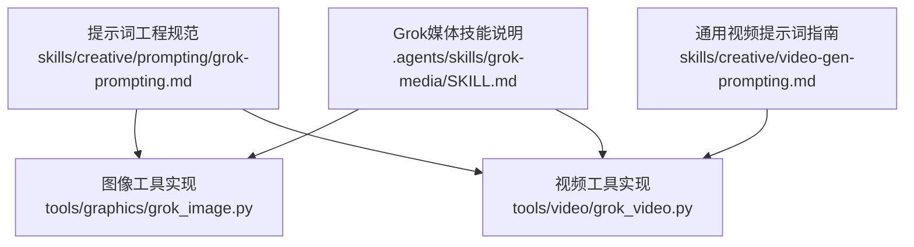
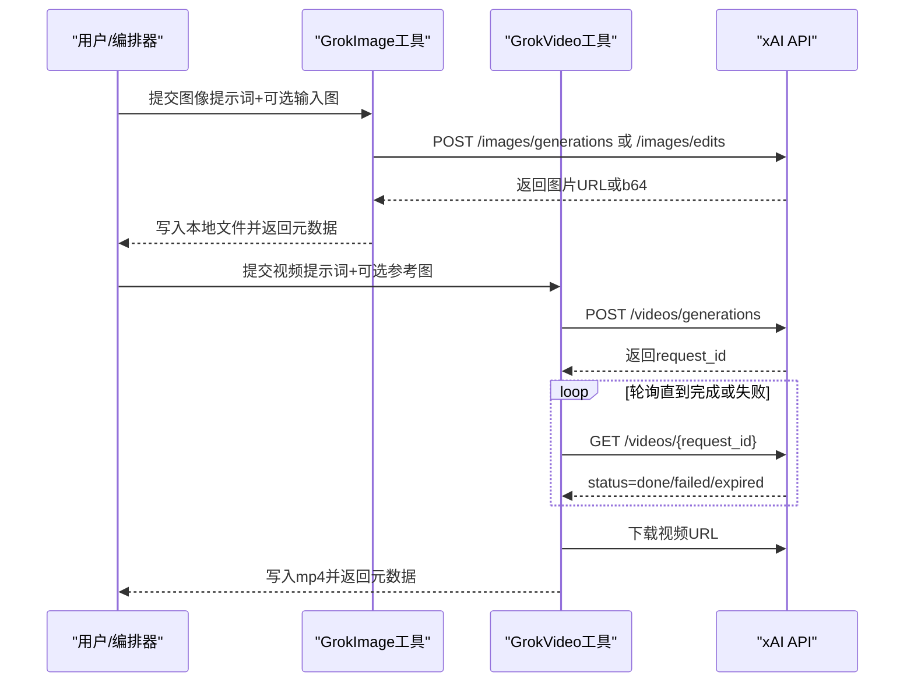
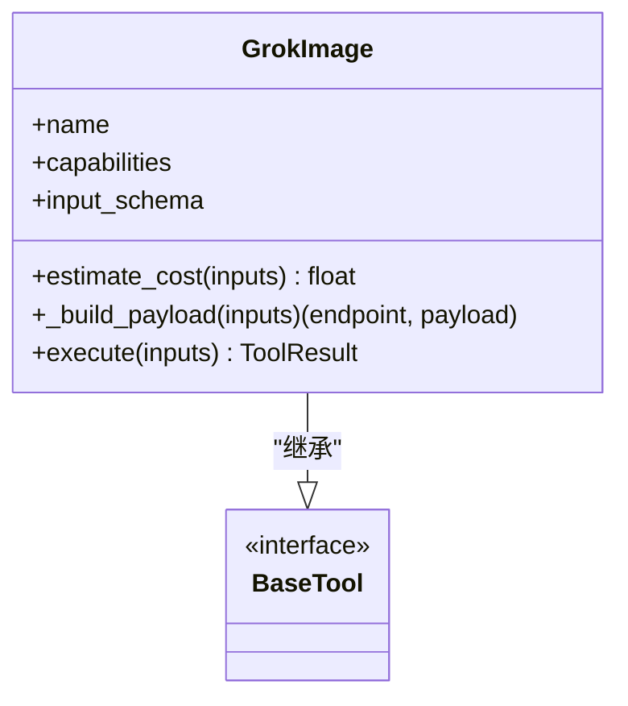
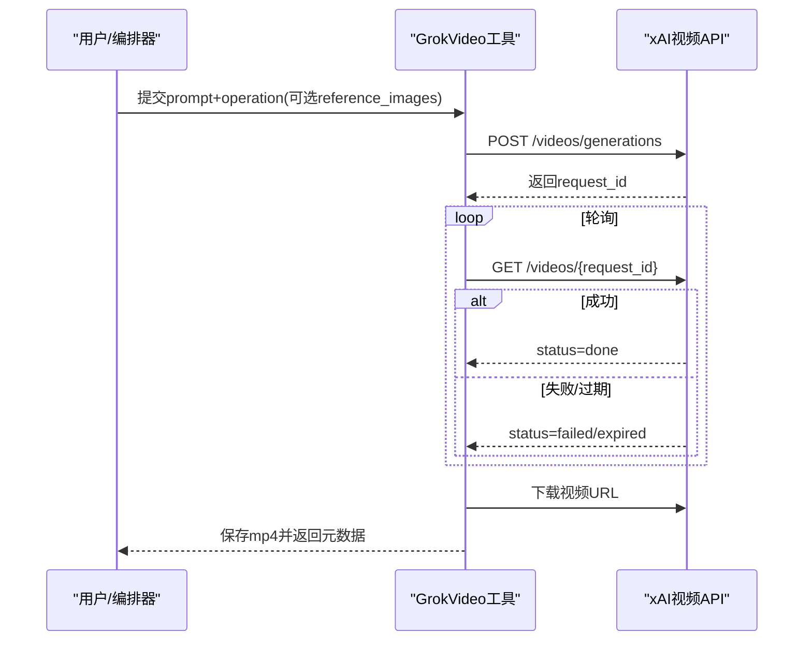
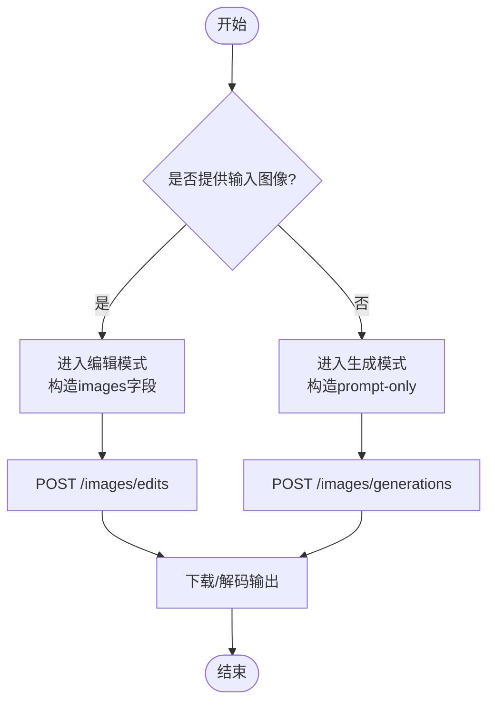
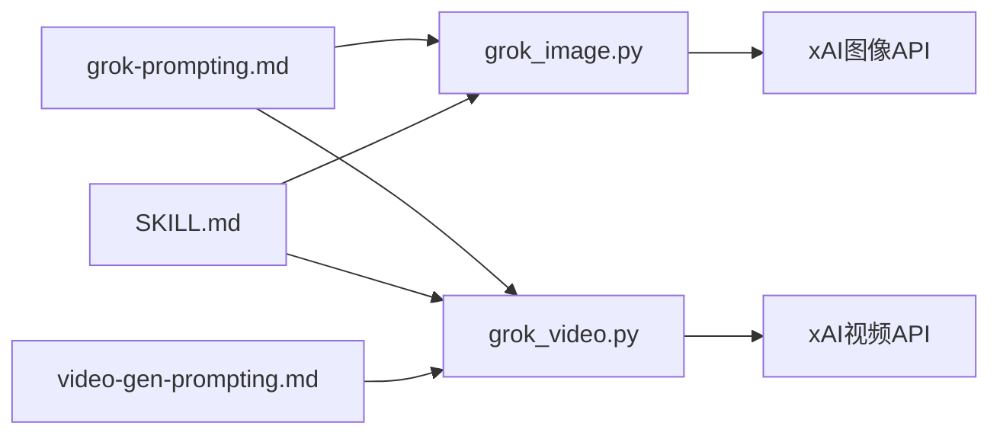

# Grok模型提示词工程

<cite>
**本文引用的文件**
- [grok-prompting.md](file://skills/creative/prompting/grok-prompting.md)
- [SKILL.md](file://.agents/skills/grok-media/SKILL.md)
- [video-gen-prompting.md](file://skills/creative/video-gen-prompting.md)
- [grok_image.py](file://tools/graphics/grok_image.py)
- [grok_video.py](file://tools/video/grok_video.py)
</cite>

## 目录
1. [简介](#简介)
2. [项目结构](#项目结构)
3. [核心组件](#核心组件)
4. [架构总览](#架构总览)
5. [详细组件分析](#详细组件分析)
6. [依赖关系分析](#依赖关系分析)
7. [性能与成本考量](#性能与成本考量)
8. [故障排查指南](#故障排查指南)
9. [结论](#结论)
10. [附录：实战模板与调试清单](#附录：实战模板与调试清单)

## 简介
本技术文档面向在OpenMontage中使用Grok进行图像与视频生成的提示词工程实践。内容聚焦以下目标：
- 给出Grok图像与视频生成的“公式化”提示词结构，覆盖主体、动作/变化、场景、风格锚点、光照等关键要素。
- 详解图像编辑提示词技巧：素描渲染、服装替换、多图合成等常见场景。
- 说明参考图像/视频生成的使用方法，包括占位符引用与身份一致性保持。
- 提供常见错误避免指南与OpenMontage中的集成建议。
- 附带实际代码级调用路径与调试技巧，帮助快速定位问题并优化结果。

## 项目结构
围绕Grok的提示词工程，OpenMontage提供了三层支撑：
- 技能与规范层：定义Grok提示词最佳实践、API约束、失败处理策略。
- 工具实现层：封装xAI图像与视频API的调用、参数构建、轮询下载与错误返回。
- 通用视频提示词指南：跨模型的通用词汇表与结构，用于统一高质量提示词表达。

图表来源
- [grok-prompting.md:1-82](file://skills/creative/prompting/grok-prompting.md#L1-L82)
- [SKILL.md:1-132](file://.agents/skills/grok-media/SKILL.md#L1-L132)
- [video-gen-prompting.md:1-326](file://skills/creative/video-gen-prompting.md#L1-L326)
- [grok_image.py:1-297](file://tools/graphics/grok_image.py#L1-L297)
- [grok_video.py:1-304](file://tools/video/grok_video.py#L1-L304)

章节来源
- [grok-prompting.md:1-82](file://skills/creative/prompting/grok-prompting.md#L1-L82)
- [SKILL.md:1-132](file://.agents/skills/grok-media/SKILL.md#L1-L132)
- [video-gen-prompting.md:1-326](file://skills/creative/video-gen-prompting.md#L1-L326)

## 核心组件
- Grok图像生成/编辑工具（grok_image.py）
  - 支持文本生成图像、单图编辑、多图合成编辑；可设置比例、分辨率、输出数量。
  - 自动判断编辑模式：当存在输入图像时切换至编辑端点。
  - 输出支持URL或base64数据流，落盘为PNG/JPG/WebP等。
- Grok视频生成工具（grok_video.py）
  - 支持文生视频、图生视频、参考图影响视频三种操作。
  - 异步提交+轮询获取结果，超时与失败状态明确处理。
  - 支持多参考图占位符引用，适合人物、服装、产品一致性传递。
- 提示词规范（grok-prompting.md, SKILL.md, video-gen-prompting.md）
  - 明确图像与视频的“最佳提示形状”。
  - 强调编辑提示应直接描述变更，避免过度罗列不变细节。
  - 视频提示强调镜头、运动、环境、光照、基调等结构化表达。

章节来源
- [grok_image.py:46-137](file://tools/graphics/grok_image.py#L46-L137)
- [grok_video.py:49-147](file://tools/video/grok_video.py#L49-L147)
- [grok-prompting.md:12-63](file://skills/creative/prompting/grok-prompting.md#L12-L63)
- [SKILL.md:90-125](file://.agents/skills/grok-media/SKILL.md#L90-L125)
- [video-gen-prompting.md:39-54](file://skills/creative/video-gen-prompting.md#L39-L54)

## 架构总览
下图展示从提示词到最终产物的端到端流程，涵盖图像与视频两条路径。

图表来源
- [grok_image.py:159-202](file://tools/graphics/grok_image.py#L159-L202)
- [grok_image.py:225-296](file://tools/graphics/grok_image.py#L225-L296)
- [grok_video.py:182-218](file://tools/video/grok_video.py#L182-L218)
- [grok_video.py:220-303](file://tools/video/grok_video.py#L220-L303)

## 详细组件分析

### Grok图像提示词工程
- 最佳提示形状（图像）
  - 公式：主体 + 动作/变化 + 场景 + 一个风格锚点 + 光照
  - 要点：风格锚点只选一个强信号；光照用具体光源/方向/色温描述；场景包含时间与环境动态。
- 编辑提示技巧
  - 直接描述期望变换，如“以铅笔素描渲染并保留细节阴影”“将纯色T恤替换为深绿色飞行员夹克”“将两人合并到同一阳光公园场景中”。
  - 不要过度列举保持不变细节，除非对保真度至关重要。
- 多图合成
  - 明确每个源图的贡献：谁来自哪张图、哪些元素应保持独立、最终场景在哪里。
  - 示例思路：将图1人物与图2人物置于同一黄昏地铁站台，肩并肩，电影感钠灯照明，写实摄影。

章节来源
- [grok-prompting.md:12-43](file://skills/creative/prompting/grok-prompting.md#L12-L43)
- [SKILL.md:92-99](file://.agents/skills/grok-media/SKILL.md#L92-L99)

#### 图像工具调用流程（类与方法）

图表来源
- [grok_image.py:46-137](file://tools/graphics/grok_image.py#L46-L137)
- [grok_image.py:159-202](file://tools/graphics/grok_image.py#L159-L202)
- [grok_image.py:225-296](file://tools/graphics/grok_image.py#L225-L296)

章节来源
- [grok_image.py:46-137](file://tools/graphics/grok_image.py#L46-L137)
- [grok_image.py:159-202](file://tools/graphics/grok_image.py#L159-L202)
- [grok_image.py:225-296](file://tools/graphics/grok_image.py#L225-L296)

### Grok视频提示词工程
- 最佳提示形状（视频）
  - 公式：镜头 + 运镜 + 主体 + 主要动作节拍 + 环境 + 光照 + 基调
  - 要点：每段视频聚焦单一镜头、单一主运动、单一情绪节拍；使用明确的镜头语言（推近、手持跟随、固定中景、甩镜转场等）。
- 参考图像视频
  - 使用占位符引用源图：<IMAGE_1>、<IMAGE_2>等，用于身份、服装、产品一致性。
  - 明确映射角色：人物来自图1、夹克来自图2、产品来自图3。
- 图生视频 vs 参考图影响视频
  - 图生视频：源图作为起始帧锁定。
  - 参考图影响视频：源图仅影响内容，不冻结首帧构图。

章节来源
- [grok-prompting.md:45-69](file://skills/creative/prompting/grok-prompting.md#L45-L69)
- [SKILL.md:62-79](file://.agents/skills/grok-media/SKILL.md#L62-L79)
- [video-gen-prompting.md:209-214](file://skills/creative/video-gen-prompting.md#L209-L214)

#### 视频工具调用流程（序列图）

图表来源
- [grok_video.py:182-218](file://tools/video/grok_video.py#L182-L218)
- [grok_video.py:220-303](file://tools/video/grok_video.py#L220-L303)

章节来源
- [grok_video.py:182-218](file://tools/video/grok_video.py#L182-L218)
- [grok_video.py:220-303](file://tools/video/grok_video.py#L220-L303)

### 复杂逻辑与算法要点
- 编辑模式判定与端点选择
  - 若存在输入图像（单图或多图），自动切换到编辑端点；否则走生成端点。
- 多参考图归一化
  - URL与本地路径统一转换为data URI或直接URL列表，便于API消费。
- 轮询与超时控制
  - 视频生成采用请求ID轮询，支持自定义间隔与超时；失败/过期状态显式返回。

图表来源
- [grok_image.py:159-202](file://tools/graphics/grok_image.py#L159-L202)
- [grok_image.py:225-296](file://tools/graphics/grok_image.py#L225-L296)

章节来源
- [grok_image.py:159-202](file://tools/graphics/grok_image.py#L159-L202)
- [grok_image.py:225-296](file://tools/graphics/grok_image.py#L225-L296)

## 依赖关系分析
- 提示词规范依赖
  - grok-prompting.md定义图像/视频提示结构与编辑技巧。
  - SKILL.md补充API端点、认证、模式差异与失败处理。
  - video-gen-prompting.md提供跨模型通用词汇与结构，强化镜头、运动、光照表达。
- 工具实现依赖
  - grok_image.py依赖BaseTool框架，封装参数校验、端点选择、网络IO与落盘。
  - grok_video.py依赖BaseTool框架与共享探测工具probe_output，负责异步轮询与下载。
- 外部依赖
  - xAI API鉴权通过环境变量XAI_API_KEY注入。
  - 网络请求使用requests库，超时与异常需妥善处理。

图表来源
- [grok-prompting.md:1-82](file://skills/creative/prompting/grok-prompting.md#L1-L82)
- [SKILL.md:1-132](file://.agents/skills/grok-media/SKILL.md#L1-L132)
- [video-gen-prompting.md:1-326](file://skills/creative/video-gen-prompting.md#L1-L326)
- [grok_image.py:1-297](file://tools/graphics/grok_image.py#L1-L297)
- [grok_video.py:1-304](file://tools/video/grok_video.py#L1-L304)

章节来源
- [grok_image.py:1-297](file://tools/graphics/grok_image.py#L1-L297)
- [grok_video.py:1-304](file://tools/video/grok_video.py#L1-L304)

## 性能与成本考量
- 图像成本
  - 按生成数量计费；编辑/合成为每张输入图附加少量费用。
- 视频成本
  - 按分辨率与时长计费；参考图条件请求按输入图附加费用。
- 运行时估算
  - 视频工具提供运行时估算函数，结合时长与基础等待时间估计整体耗时。
- 资源占用
  - 图像与视频工具均为API运行模式，无需本地GPU；注意网络带宽与临时URL下载时效。

章节来源
- [SKILL.md:81-89](file://.agents/skills/grok-media/SKILL.md#L81-L89)
- [grok_video.py:169-180](file://tools/video/grok_video.py#L169-L180)

## 故障排查指南
- 常见问题与避免
  - 不要把参考图当作严格分镜；它们是影响力输入而非精确帧锁定。
  - 不要在单个片段中塞入多个场景变化。
  - 避免过多风格标签叠加而缺少场景信息。
  - 编辑提示要具体命名变更，不要用“让它更好”这类模糊指令。
- 工具级错误处理
  - 图像：缺失输出URL、无数据返回、网络异常等会返回失败结果。
  - 视频：轮询期间遇到failed/expired状态立即返回；超时则报告超时错误；下载失败也会返回错误。
- 调试建议
  - 检查XAI_API_KEY是否正确设置。
  - 确认输入图像URL可达或本地路径有效。
  - 对于参考图视频，确保占位符与参考图顺序一致，并在提示中明确映射。
  - 记录请求payload与响应状态，便于复现与定位。

章节来源
- [grok-prompting.md:70-81](file://skills/creative/prompting/grok-prompting.md#L70-L81)
- [SKILL.md:127-132](file://.agents/skills/grok-media/SKILL.md#L127-L132)
- [grok_image.py:225-296](file://tools/graphics/grok_image.py#L225-L296)
- [grok_video.py:220-303](file://tools/video/grok_video.py#L220-L303)

## 结论
Grok在OpenMontage中适用于图像编辑、多图合成以及参考图影响的短视频生成。遵循“主体+动作/变化+场景+风格锚点+光照”的图像公式，以及“镜头+运镜+主体+动作节拍+环境+光照+基调”的视频公式，可以显著提升可控性与一致性。配合工具层的健壮实现与规范的失败处理，能够在生产环境中稳定产出高质量素材。

## 附录：实战模板与调试清单

### 图像提示词模板
- 基础模板
  - 主体：类型+关键视觉特征+多主体时的区分方式
  - 动作/变化：明确期望的修改或行为
  - 场景：时间、地点、环境动态
  - 风格锚点：选择一个强风格信号
  - 光照：光源、方向、色温、对比度
- 编辑场景
  - 素描渲染：描述线条、阴影、质感
  - 服装替换：指定替换对象与目标样式
  - 多图合成：明确各图贡献与最终场景

章节来源
- [grok-prompting.md:12-43](file://skills/creative/prompting/grok-prompting.md#L12-L43)
- [SKILL.md:92-99](file://.agents/skills/grok-media/SKILL.md#L92-L99)

### 视频提示词模板
- 基础模板
  - 镜头：景别与角度
  - 运镜：推拉摇移、手持、固定机位
  - 主体：人物/物体+关键属性
  - 动作节拍：主要运动与交互
  - 环境：背景与氛围
  - 光照：自然光/人工光/逆光/轮廓光
  - 基调：情绪与风格
- 参考图视频
  - 占位符映射：<IMAGE_1>人物、<IMAGE_2>服装、<IMAGE_3>产品
  - 明确角色与位置，避免身份漂移

章节来源
- [grok-prompting.md:45-69](file://skills/creative/prompting/grok-prompting.md#L45-L69)
- [video-gen-prompting.md:39-54](file://skills/creative/video-gen-prompting.md#L39-L54)
- [video-gen-prompting.md:209-214](file://skills/creative/video-gen-prompting.md#L209-L214)

### OpenMontage集成建议
- 图像编辑/合成优先选择grok_image，以获得更直接的编辑语义与多图融合能力。
- 需要携带人物、服装、产品到视频中时，优先选择grok_video的参考图模式。
- 纯电影化运动且无参考约束时，可与Runway、Veo、Kling等进行对比评估。

章节来源
- [grok-prompting.md:77-81](file://skills/creative/prompting/grok-prompting.md#L77-L81)
- [SKILL.md:113-125](file://.agents/skills/grok-media/SKILL.md#L113-L125)

### 调试清单
- 环境变量：确认XAI_API_KEY已设置。
- 输入验证：图像URL可达或本地路径存在；参考图顺序与占位符一致。
- 参数检查：aspect_ratio、resolution、duration、n等是否符合预期。
- 日志与重试：关注rate_limit与timeout，必要时调整poll_interval与timeout_seconds。
- 产物下载：及时下载并校验输出文件完整性。

章节来源
- [grok_image.py:138-141](file://tools/graphics/grok_image.py#L138-L141)
- [grok_video.py:149-152](file://tools/video/grok_video.py#L149-L152)
- [grok_video.py:248-270](file://tools/video/grok_video.py#L248-L270)