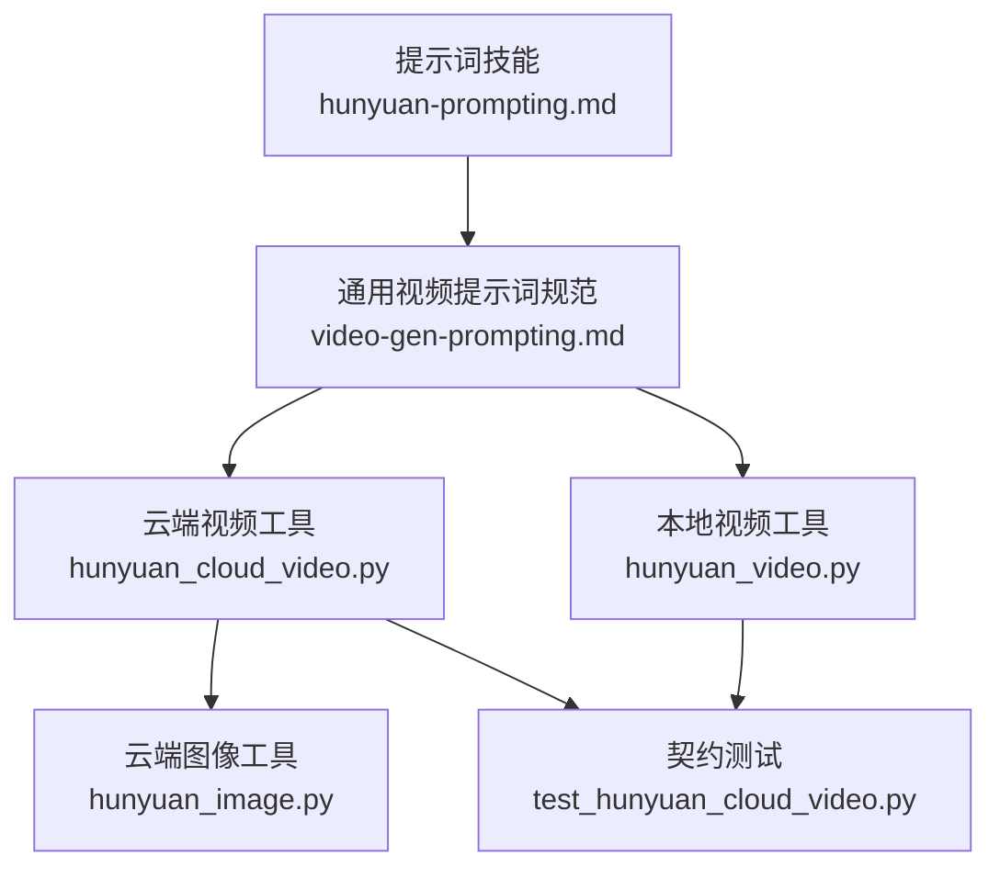
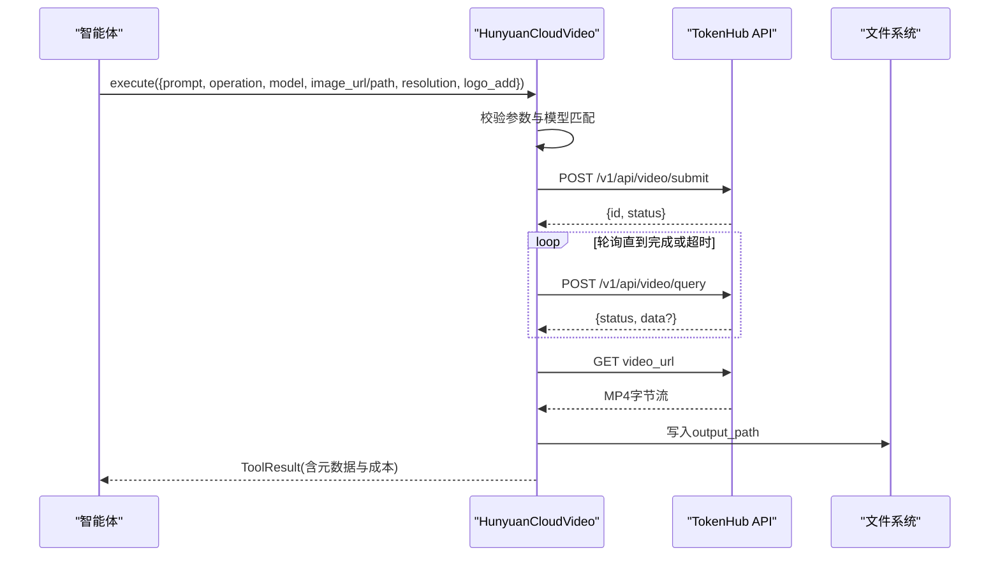
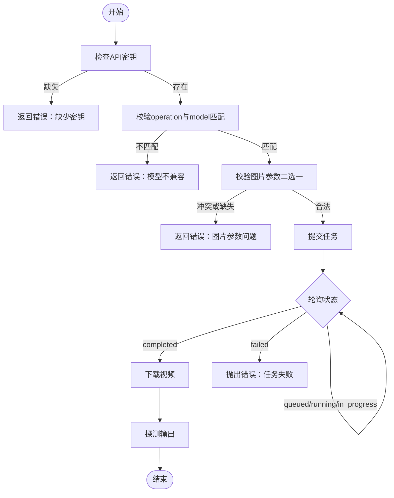
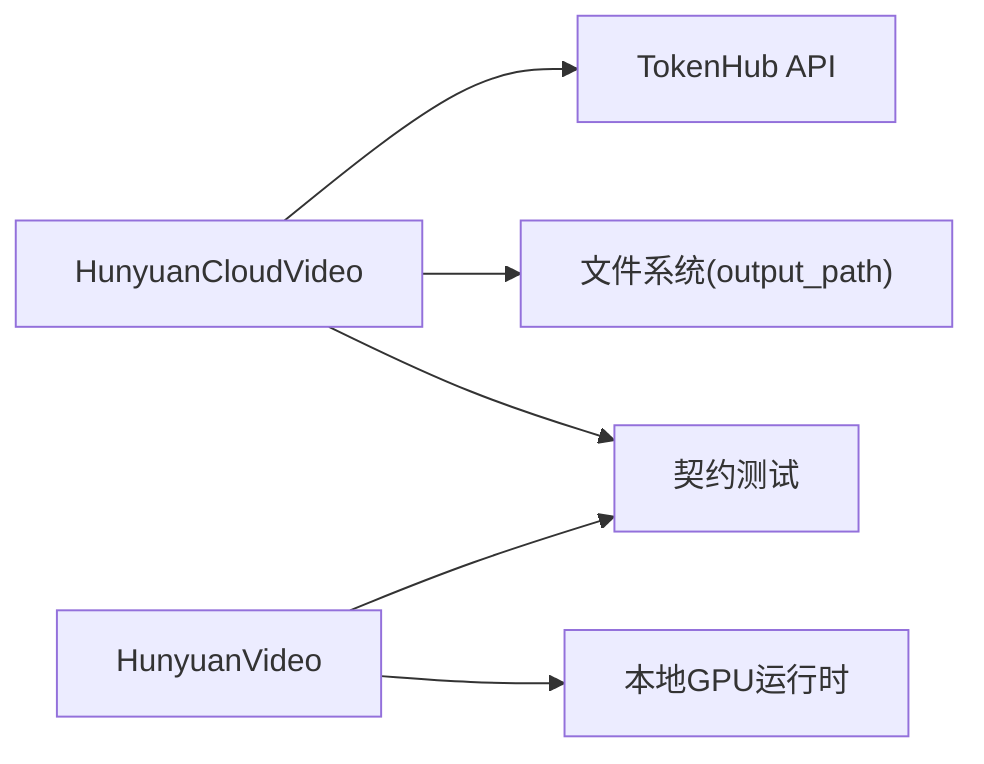

# Hunyuan模型提示词工程

<cite>
**本文引用的文件**
- [skills/creative/prompting/hunyuan-prompting.md](file://skills/creative/prompting/hunyuan-prompting.md)
- [tools/video/hunyuan_cloud_video.py](file://tools/video/hunyuan_cloud_video.py)
- [tools/video/hunyuan_video.py](file://tools/video/hunyuan_video.py)
- [tools/graphics/hunyuan_image.py](file://tools/graphics/hunyuan_image.py)
- [tests/contracts/test_hunyuan_cloud_video.py](file://tests/contracts/test_hunyuan_cloud_video.py)
- [skills/creative/video-gen-prompting.md](file://skills/creative/video-gen-prompting.md)
- [README_zh-CN.md](file://README_zh-CN.md)
- [PROMPT_GALLERY.md](file://PROMPT_GALLERY.md)
</cite>

## 目录
1. [简介](#简介)
2. [项目结构](#项目结构)
3. [核心组件](#核心组件)
4. [架构总览](#架构总览)
5. [详细组件分析](#详细组件分析)
6. [依赖关系分析](#依赖关系分析)
7. [性能与成本考量](#性能与成本考量)
8. [故障排查指南](#故障排查指南)
9. [结论](#结论)
10. [附录：本地化模板与最佳实践](#附录本地化模板与最佳实践)

## 简介
本技术文档聚焦于OpenMontage中对腾讯Hunyuan模型的提示词工程，涵盖云API（TokenHub）与本地GPU两种运行方式。文档基于仓库中的实现与技能文件，系统说明HunyuanVideo 1.5的提示词公式、I2V/T2V差异、镜头与光影词汇、时序运动组织方法；同时给出中文与英文提示词的处理差异、文化背景对生成效果的影响、不同艺术风格的适配方法与参数调优技巧；并提供面向中国市场的本地化模板与最佳实践，以及与开源生态集成的路径和性能优化建议。

## 项目结构
围绕Hunyuan的提示词工程主要涉及三类文件：
- 提示词技能与通用视频提示词规范：定义Hunyuan专属公式、镜头库、风格词表与I2V最佳实践。
- 工具实现：封装云API调用（TokenHub）和本地GPU推理入口，提供输入校验、错误处理、成本估算与执行流程。
- 测试与示例：覆盖Schema约束、参数组合、失败场景与端到端行为验证。

图表来源
- [skills/creative/prompting/hunyuan-prompting.md:1-108](file://skills/creative/prompting/hunyuan-prompting.md#L1-L108)
- [skills/creative/video-gen-prompting.md:1-326](file://skills/creative/video-gen-prompting.md#L1-L326)
- [tools/video/hunyuan_cloud_video.py:1-531](file://tools/video/hunyuan_cloud_video.py#L1-L531)
- [tools/video/hunyuan_video.py:1-96](file://tools/video/hunyuan_video.py#L1-L96)
- [tools/graphics/hunyuan_image.py:1-581](file://tools/graphics/hunyuan_image.py#L1-L581)
- [tests/contracts/test_hunyuan_cloud_video.py:298-799](file://tests/contracts/test_hunyuan_cloud_video.py#L298-L799)

章节来源
- [skills/creative/prompting/hunyuan-prompting.md:1-108](file://skills/creative/prompting/hunyuan-prompting.md#L1-L108)
- [skills/creative/video-gen-prompting.md:1-326](file://skills/creative/video-gen-prompting.md#L1-L326)
- [tools/video/hunyuan_cloud_video.py:1-531](file://tools/video/hunyuan_cloud_video.py#L1-L531)
- [tools/video/hunyuan_video.py:1-96](file://tools/video/hunyuan_video.py#L1-L96)
- [tools/graphics/hunyuan_image.py:1-581](file://tools/graphics/hunyuan_image.py#L1-L581)
- [tests/contracts/test_hunyuan_cloud_video.py:298-799](file://tests/contracts/test_hunyuan_cloud_video.py#L298-L799)

## 核心组件
- 云端视频生成（HunyuanCloudVideo）
  - 通过TokenHub API提交任务并轮询结果，支持文本到视频与图像到视频。
  - 输入包含prompt、operation、model、image_url/image_path、resolution、logo_add等字段；提供成本估算、超时与重试策略。
  - 关键约束：prompt最大长度限制、操作与模型匹配校验、图片二选一、水印开关。
- 本地视频生成（HunyuanVideo）
  - 本地GPU推理入口，声明资源需求、回退工具链与能力矩阵；执行时委托统一本地生成器。
- 云端图像生成（HunyuanImage）
  - 通过TokenHub提交图像生成任务，支持参考图、分辨率、种子、自动改写与水印设置。
- 提示词技能
  - Hunyuan专属提示词公式、镜头库、光影描述、I2V最佳实践与示例。
  - 通用视频提示词规范，跨模型统一的五要素骨架与镜头/光影/景深词汇表。

章节来源
- [tools/video/hunyuan_cloud_video.py:82-159](file://tools/video/hunyuan_cloud_video.py#L82-L159)
- [tools/video/hunyuan_video.py:22-75](file://tools/video/hunyuan_video.py#L22-L75)
- [tools/graphics/hunyuan_image.py:82-182](file://tools/graphics/hunyuan_image.py#L82-L182)
- [skills/creative/prompting/hunyuan-prompting.md:8-20](file://skills/creative/prompting/hunyuan-prompting.md#L8-L20)
- [skills/creative/video-gen-prompting.md:39-54](file://skills/creative/video-gen-prompting.md#L39-L54)

## 架构总览
Hunyuan在OpenMontage中以“工具+技能”的方式接入：
- 上层智能体依据流水线与阶段技能选择合适工具。
- 工具负责参数校验、成本估算、网络或本地执行、错误处理与结果落盘。
- 提示词技能为智能体提供高质量提示词结构与词汇表，确保跨模型一致性与可移植性。

图表来源
- [tools/video/hunyuan_cloud_video.py:247-341](file://tools/video/hunyuan_cloud_video.py#L247-L341)
- [tools/video/hunyuan_cloud_video.py:412-492](file://tools/video/hunyuan_cloud_video.py#L412-L492)

章节来源
- [tools/video/hunyuan_cloud_video.py:247-341](file://tools/video/hunyuan_cloud_video.py#L247-L341)
- [tools/video/hunyuan_cloud_video.py:412-492](file://tools/video/hunyuan_cloud_video.py#L412-L492)

## 详细组件分析

### 云端视频工具（HunyuanCloudVideo）
- 输入Schema与约束
  - prompt：字符串，最大长度限制，支持中英文，需明确主体、动作、场景与风格。
  - operation：text_to_video或image_to_video。
  - model：hy-video-1.5（T2V）或yt-video-2.0（I2V），默认按operation推断。
  - image_url或image_path：I2V必需其一，互斥。
  - resolution：720p或1080p。
  - logo_add：是否添加水印。
  - poll_interval_seconds与timeout_seconds：轮询间隔与超时上限。
- 执行流程
  - 校验API密钥、operation与model一致性、图片参数合法性。
  - 构建payload并提交任务，轮询状态直至completed或failed，下载MP4并探测输出。
- 成本估算
  - 基于TokenHub积分定价换算美元，I2V按分辨率分级，T2V固定积分。
- 错误处理
  - 认证缺失、模型不兼容、图片冲突、非JSON响应、未知状态、超时等均有明确错误信息。

图表来源
- [tools/video/hunyuan_cloud_video.py:247-341](file://tools/video/hunyuan_cloud_video.py#L247-L341)
- [tools/video/hunyuan_cloud_video.py:412-492](file://tools/video/hunyuan_cloud_video.py#L412-L492)

章节来源
- [tools/video/hunyuan_cloud_video.py:82-159](file://tools/video/hunyuan_cloud_video.py#L82-L159)
- [tools/video/hunyuan_cloud_video.py:207-241](file://tools/video/hunyuan_cloud_video.py#L207-L241)
- [tools/video/hunyuan_cloud_video.py:247-341](file://tools/video/hunyuan_cloud_video.py#L247-L341)
- [tools/video/hunyuan_cloud_video.py:412-492](file://tools/video/hunyuan_cloud_video.py#L412-L492)

### 本地视频工具（HunyuanVideo）
- 能力与资源
  - 支持text_to_video与image_to_video，需要本地GPU；声明CPU/RAM/VRAM/Disk需求。
  - 提供回退工具链（如wan_video、ltx_video_local、cogvideo_video、image_selector）。
- 执行逻辑
  - 检查本地可用性，调用统一本地生成器，记录耗时并返回结果。
- 适用场景
  - 团队希望以单一已知Hunyuan基线进行本地生成，或离线环境无法使用云端API。

章节来源
- [tools/video/hunyuan_video.py:22-75](file://tools/video/hunyuan_video.py#L22-L75)
- [tools/video/hunyuan_video.py:86-95](file://tools/video/hunyuan_video.py#L86-L95)

### 云端图像工具（HunyuanImage）
- 能力与参数
  - 支持文本到图像、参考图、自定义分辨率、种子、自动改写、水印配置。
  - 必须显式指定output_path以避免意外写盘。
- 执行流程
  - 提交图像生成任务，轮询获取多张图像的URL，下载并保存至目标路径。
- 成本与时长
  - 单图约0.5积分；预估时长考虑队列与下载，设定安全上限。

章节来源
- [tools/graphics/hunyuan_image.py:82-182](file://tools/graphics/hunyuan_image.py#L82-L182)
- [tools/graphics/hunyuan_image.py:254-330](file://tools/graphics/hunyuan_image.py#L254-L330)
- [tools/graphics/hunyuan_image.py:432-523](file://tools/graphics/hunyuan_image.py#L432-L523)

### 提示词技能与通用规范
- Hunyuan专属提示词公式
  - T2V：Subject + Motion + Scene + [Shot] + [Camera] + [Lighting] + [Style] + [Atmosphere]
  - I2V：仅描述主体与环境动态、相机运动，避免重复画面已呈现的外观。
- 镜头库与景深
  - 提供平移、旋转、变焦、焦点变化等镜头原语；强调动态DoF需在起止点标注焦点平面。
- 光影与风格
  - 多维度光影描述（方向、质量、色温、反射、阴影）；风格关键词覆盖电影级、动画与插画。
- 通用五要素骨架
  - Subject、Subject Motion、Scene、Spatial、Camera；强调顺序与自包含描述。
- 长度与密度
  - 不同模型有各自“甜蜜点”，Hunyuan 1.5在80–200词表现良好，过长不会带来收益。

章节来源
- [skills/creative/prompting/hunyuan-prompting.md:8-20](file://skills/creative/prompting/hunyuan-prompting.md#L8-L20)
- [skills/creative/prompting/hunyuan-prompting.md:22-71](file://skills/creative/prompting/hunyuan-prompting.md#L22-L71)
- [skills/creative/prompting/hunyuan-prompting.md:72-108](file://skills/creative/prompting/hunyuan-prompting.md#L72-L108)
- [skills/creative/video-gen-prompting.md:39-54](file://skills/creative/video-gen-prompting.md#L39-L54)
- [skills/creative/video-gen-prompting.md:74-194](file://skills/creative/video-gen-prompting.md#L74-L194)
- [skills/creative/video-gen-prompting.md:215-326](file://skills/creative/video-gen-prompting.md#L215-L326)

## 依赖关系分析
- 工具间耦合
  - HunyuanCloudVideo依赖环境变量TENCENT_TOKENHUB_API_KEY；HunyuanVideo依赖本地GPU可用性与权重下载。
  - 两者均遵循OpenMontage工具契约（BaseTool），共享资源评估、重试策略与结果结构。
- 外部依赖
  - TokenHub API：Bearer令牌鉴权，异步提交与轮询；图像/视频生成分别对应不同端点。
  - 网络与磁盘：云端模式需要网络；本地模式可能下载模型权重。
- 测试保障
  - 契约测试覆盖prompt长度限制、operation枚举、模型兼容性、I2V图片参数、失败场景与选择器路由。

图表来源
- [tools/video/hunyuan_cloud_video.py:56-61](file://tools/video/hunyuan_cloud_video.py#L56-L61)
- [tools/video/hunyuan_cloud_video.py:161-185](file://tools/video/hunyuan_cloud_video.py#L161-L185)
- [tools/video/hunyuan_video.py:33-49](file://tools/video/hunyuan_video.py#L33-L49)
- [tests/contracts/test_hunyuan_cloud_video.py:298-799](file://tests/contracts/test_hunyuan_cloud_video.py#L298-L799)

章节来源
- [tools/video/hunyuan_cloud_video.py:56-61](file://tools/video/hunyuan_cloud_video.py#L56-L61)
- [tools/video/hunyuan_cloud_video.py:161-185](file://tools/video/hunyuan_cloud_video.py#L161-L185)
- [tools/video/hunyuan_video.py:33-49](file://tools/video/hunyuan_video.py#L33-L49)
- [tests/contracts/test_hunyuan_cloud_video.py:298-799](file://tests/contracts/test_hunyuan_cloud_video.py#L298-L799)

## 性能与成本考量
- 云端视频
  - 成本估算：按积分换算美元，I2V按分辨率分级（720p/1080p更高），T2V固定积分。
  - 运行时估计：典型队列+生成约180秒上限，适合批处理与超时规划。
  - 重试策略：针对限流与超时进行指数退避重试。
- 本地视频
  - 资源需求：CPU 2核、RAM 16GB、VRAM 14GB、磁盘4GB；无网络要求。
  - 成本：本地推理成本为0；但需考虑硬件与权重下载开销。
- 图像生成
  - 成本：单图约0.5积分；预估时长约120秒（含队列与下载）。
  - 参考图：支持URL或本地base64，单图大小限制与格式约束严格。

章节来源
- [tools/video/hunyuan_cloud_video.py:207-241](file://tools/video/hunyuan_cloud_video.py#L207-L241)
- [tools/video/hunyuan_cloud_video.py:161-185](file://tools/video/hunyuan_cloud_video.py#L161-L185)
- [tools/video/hunyuan_video.py:71-75](file://tools/video/hunyuan_video.py#L71-L75)
- [tools/graphics/hunyuan_image.py:230-248](file://tools/graphics/hunyuan_image.py#L230-L248)

## 故障排查指南
- 常见错误与定位
  - 缺少API密钥：检查TENCENT_TOKENHUB_API_KEY环境变量。
  - 模型与操作不匹配：I2V需yt-video-2.0，T2V需hy-video-1.5。
  - 图片参数冲突：image_url与image_path只能提供其一。
  - 非JSON响应：网络或网关异常导致，需检查HTTP状态码与重试。
  - 未知状态或超时：调整poll_interval与timeout_seconds，或检查服务端负载。
- 日志与审计
  - 工具返回ToolResult包含provider、route、model、prompt、operation、resolution、task_id、cost_usd等元数据，便于追踪。
  - 错误消息中敏感信息会被脱敏，避免泄露密钥。

章节来源
- [tools/video/hunyuan_cloud_video.py:247-288](file://tools/video/hunyuan_cloud_video.py#L247-L288)
- [tools/video/hunyuan_cloud_video.py:498-531](file://tools/video/hunyuan_cloud_video.py#L498-L531)
- [tools/graphics/hunyuan_image.py:254-330](file://tools/graphics/hunyuan_image.py#L254-L330)

## 结论
OpenMontage将Hunyuan的提示词工程与工具实现解耦：提示词技能提供跨模型一致的表达范式，工具层负责参数校验、执行与治理。对于中国市场，Hunyuan在中文理解与TokenHub直连方面具备优势；结合本地GPU方案可实现低成本、可控的生产闭环。通过严格的Schema、成本估算、重试与错误处理，以及丰富的镜头与光影词汇，能够稳定产出高质量视频内容。

## 附录：本地化模板与最佳实践
- 中文与英文提示词差异
  - 云端工具明确支持中英文prompt；中文更利于语义理解与文化语境捕捉。
  - 建议在中文场景中优先使用中文提示词，并结合本土文化元素（节日、服饰、场景）提升共鸣。
- 文化背景影响
  - 主题与视觉应匹配情感与文化语境（例如春节、科技新闻、睡眠科学等），避免泛化描述。
  - 在角色与环境设计中加入具体道具与品牌元素，增强真实感与识别度。
- 艺术风格适配
  - 电影级：film noir、period drama、documentary。
  - 动画/插画：Japanese anime、watercolor painting、Chinese ink wash、low-poly 3D、pixel art。
  - 通过光影与镜头原语强化风格（如anamorphic、golden hour、shallow DoF）。
- 参数调优技巧
  - 控制prompt长度：Hunyuan 1.5在80–200词表现良好；避免冗长堆砌。
  - 明确镜头与景深：动态DoF需标注起止焦点平面；区分dolly与zoom、pan与truck。
  - 时序运动组织：按时间顺序描述多个动作，避免合并导致丢失或混合。
  - I2V专注动态：仅描述主体与环境动态、相机运动，不重复外观。
- 中国市场本地化模板
  - 主题：春节、中秋、科技发布、教育科普、产品演示。
  - 风格：吉卜力/动漫、水墨、现代极简、数据可视化。
  - 语言：中文为主，必要时中英双语；字幕与旁白采用中文语义分句。
- 与开源生态集成
  - 通过OpenMontage的工具注册表与评分选择器，无缝切换Hunyuan与其他提供商。
  - 结合Remotion/HyperFrames进行合成与动效，FFmpeg进行后期处理。
  - 利用契约测试与质量关卡保障稳定性与可维护性。

章节来源
- [tools/video/hunyuan_cloud_video.py:82-159](file://tools/video/hunyuan_cloud_video.py#L82-L159)
- [skills/creative/prompting/hunyuan-prompting.md:22-71](file://skills/creative/prompting/hunyuan-prompting.md#L22-L71)
- [skills/creative/video-gen-prompting.md:215-326](file://skills/creative/video-gen-prompting.md#L215-L326)
- [README_zh-CN.md:264-283](file://README_zh-CN.md#L264-L283)
- [PROMPT_GALLERY.md:91-127](file://PROMPT_GALLERY.md#L91-L127)