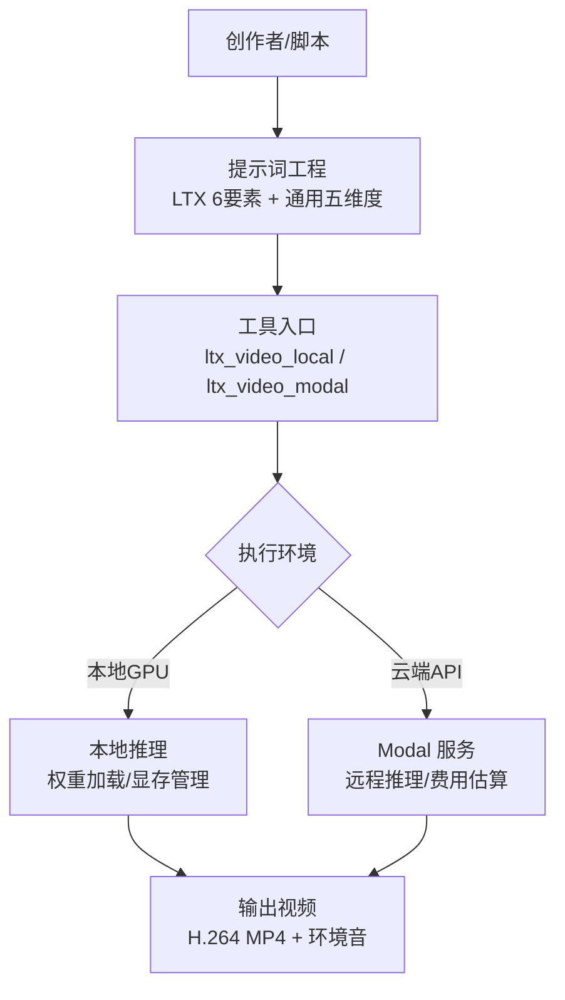
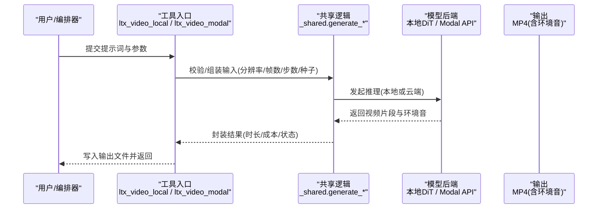
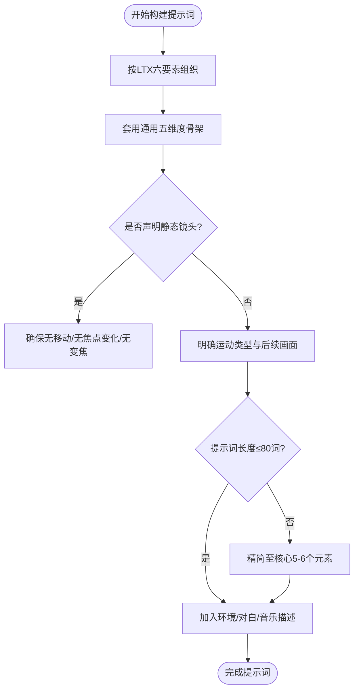
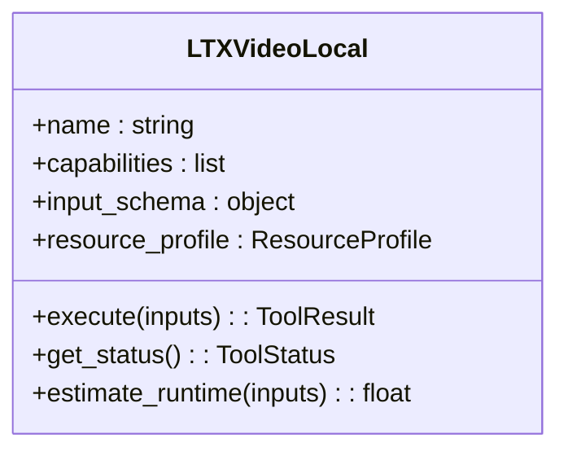
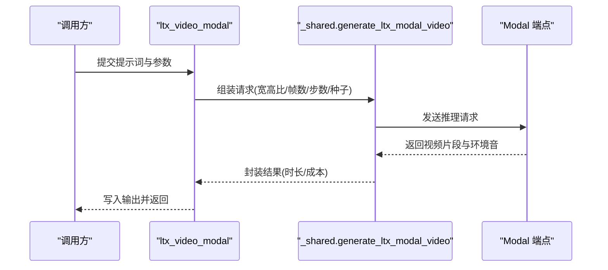
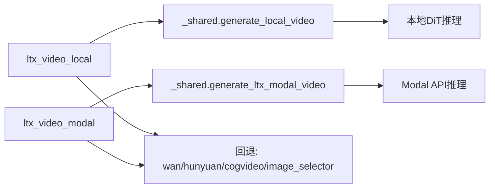

# LTX模型提示词工程

<cite>
**本文引用的文件**   
- [LTX-2 技能文档](file://.agents/skills/ltx2/SKILL.md)
- [LTX-2 提示词指南](file://skills/creative/prompting/ltx-prompting.md)
- [通用视频生成提示词指南](file://skills/creative/video-gen-prompting.md)
- [本地 LTX 视频工具](file://tools/video/ltx_video_local.py)
- [云端 Modal LTX 视频工具](file://tools/video/ltx_video_modal.py)
</cite>

## 目录
1. [引言](#引言)
2. [项目结构](#项目结构)
3. [核心组件](#核心组件)
4. [架构总览](#架构总览)
5. [详细组件分析](#详细组件分析)
6. [依赖关系分析](#依赖关系分析)
7. [性能与成本考量](#性能与成本考量)
8. [故障排查指南](#故障排查指南)
9. [结论](#结论)
10. [附录：电影级视觉与高级参数调优](#附录电影级视觉与高级参数调优)

## 引言
本文件面向使用 OpenMontage 进行“文本到视频”生成的创作者与工程师，聚焦 LTX 模型的提示词工程。内容覆盖复杂场景描述、时间序列控制、镜头语言与运动轨迹、角色行为精确描述、多模态输入融合与一致性保持策略，以及电影级视觉效果实现与高级参数调节。同时提供与其他主流视频生成模型的对比分析与选择建议，帮助在不同业务场景下做出最优决策。

## 项目结构
围绕 LTX 的提示词工程，OpenMontage 提供了三层支撑：
- 技能与指南层：包含 LTX 专用提示词结构与通用视频提示词规范，指导如何组织镜头、光影、动作、声音等元素。
- 工具层：封装本地与云端两种运行方式（本地 GPU 推理与 Modal 云端 API），统一输入输出与错误处理。
- 集成层：通过工具注册表与回退策略，将 LTX 嵌入端到端视频生产管线。

图表来源
- [本地 LTX 视频工具:22-97](file://tools/video/ltx_video_local.py#L22-L97)
- [云端 Modal LTX 视频工具:23-107](file://tools/video/ltx_video_modal.py#L23-L107)
- [LTX-2 技能文档:142-158](file://.agents/skills/ltx2/SKILL.md#L142-L158)

章节来源
- [LTX-2 技能文档:1-177](file://.agents/skills/ltx2/SKILL.md#L1-L177)
- [本地 LTX 视频工具:1-97](file://tools/video/ltx_video_local.py#L1-L97)
- [云端 Modal LTX 视频工具:1-107](file://tools/video/ltx_video_modal.py#L1-L107)

## 核心组件
- LTX 提示词工程规范
  - LTX-2 六要素结构：建立镜头、设定场景、描述动作、定义角色、相机运动、描述音频。强调“静态镜头严格规则”和“运动后描述”。
  - 通用五维度骨架：主体、主体运动、场景、空间、相机；并给出不同模型的最佳提示长度建议（LTX-2 建议不超过约80词）。
- LTX 工具实现
  - 本地模式：支持 text-to-video 与 image-to-video，具备离线能力、本地 GPU 资源画像、重试与幂等键设计。
  - 云端模式：通过环境变量配置 Modal 端点，支持宽高比、时长提示、帧数与步数等参数，具备成本估算与超时重试。
- 工作流与回退
  - 工具注册表中为 LTX 指定回退路径（如 wan_video、hunyuan_video、cogvideo_video、image_selector），提升鲁棒性。

章节来源
- [LTX-2 提示词指南:6-67](file://skills/creative/prompting/ltx-prompting.md#L6-L67)
- [通用视频生成提示词指南:28-67](file://skills/creative/video-gen-prompting.md#L28-L67)
- [本地 LTX 视频工具:22-97](file://tools/video/ltx_video_local.py#L22-L97)
- [云端 Modal LTX 视频工具:23-107](file://tools/video/ltx_video_modal.py#L23-L107)

## 架构总览
LTX 在 OpenMontage 中的调用流程如下：

图表来源
- [本地 LTX 视频工具:86-95](file://tools/video/ltx_video_local.py#L86-L95)
- [云端 Modal LTX 视频工具:95-105](file://tools/video/ltx_video_modal.py#L95-L105)
- [LTX-2 技能文档:142-158](file://.agents/skills/ltx2/SKILL.md#L142-L158)

## 详细组件分析

### 组件A：LTX 提示词工程（六要素与通用五维度）
- LTX-2 六要素
  - 建立镜头：使用类型化镜头术语（广角、中景、特写等）匹配题材。
  - 设定场景：光照、色调、材质、氛围。
  - 描述动作：按时间顺序的自然动作流。
  - 定义角色：具体外貌特征而非抽象标签。
  - 相机运动：明确何时移动，并描述运动后的画面变化；区分平移、旋转、镜头变焦。
  - 描述音频：环境声、音乐、旁白、对话（用引号标注台词）。
- 通用五维度
  - 主体、主体运动、场景、空间、相机；按“播放速度→镜头畸变→高度→角度→焦点/景深→稳定性→运动”的顺序组织。
- 关键约束
  - 静态镜头严格：若声明“static”，则不允许任何移动、焦点变化或变焦。
  - 提示长度：LTX-2 建议在约80词以内，过长会退化。
  - 避免可读文字与Logo：模型无法稳定渲染。

图表来源
- [LTX-2 提示词指南:6-67](file://skills/creative/prompting/ltx-prompting.md#L6-L67)
- [通用视频生成提示词指南:28-67](file://skills/creative/video-gen-prompting.md#L28-L67)

章节来源
- [LTX-2 提示词指南:6-67](file://skills/creative/prompting/ltx-prompting.md#L6-L67)
- [通用视频生成提示词指南:28-67](file://skills/creative/video-gen-prompting.md#L28-L67)

### 组件B：本地 LTX 视频工具（ltx_video_local）
- 能力与定位
  - 支持 text_to_video 与 image_to_video；适合已有本地 LTX 工作流的团队。
  - 资源画像：CPU/内存/显存/磁盘预估，便于调度。
- 输入与参数
  - 必需字段 prompt；可选 operation、model_variant、参考图、宽高、帧数、推理步数、seed、输出路径等。
- 执行与容错
  - 检查可用性状态；失败时返回错误信息；记录耗时。
  - 幂等键基于 prompt、model_variant、operation、seed，便于去重。

图表来源
- [本地 LTX 视频工具:22-97](file://tools/video/ltx_video_local.py#L22-L97)

章节来源
- [本地 LTX 视频工具:22-97](file://tools/video/ltx_video_local.py#L22-L97)

### 组件C：云端 Modal LTX 视频工具（ltx_video_modal）
- 能力与定位
  - 通过环境变量 MODAL_LTX2_ENDPOINT_URL 调用云端推理；无需本地 GPU。
  - 支持宽高比、时长提示、帧数与步数、seed、输出路径等。
- 执行与容错
  - 检查端点可用性；失败时返回错误；支持超时与服务端错误的重试策略。
  - 成本估算与耗时预估，便于预算规划。

图表来源
- [云端 Modal LTX 视频工具:23-107](file://tools/video/ltx_video_modal.py#L23-L107)

章节来源
- [云端 Modal LTX 视频工具:23-107](file://tools/video/ltx_video_modal.py#L23-L107)

### 组件D：多模态输入融合与一致性保持
- 图像到视频的融合
  - 通过 reference_image_url/reference_image_path 传入参考图，配合 motion 提示词（如“轻微漂移”“柔和环境光变化”）获得一致动画。
- 身份锚定
  - 在多镜头或多片段中，重复相同的关键视觉属性以维持角色一致性；避免仅用代词指代。
- 场景与镜头一致性
  - 固定光照、风格、色温与镜头畸变描述；在同一项目中复用相同的风格关键词。

章节来源
- [LTX-2 技能文档:103-141](file://.agents/skills/ltx2/SKILL.md#L103-L141)
- [通用视频生成提示词指南:209-214](file://skills/creative/video-gen-prompting.md#L209-L214)

### 组件E：时间序列控制与复杂场景描述
- 时间顺序
  - 事件按时间先后描述；先发生什么、后发生什么，明确主体间交互与群体动作。
- 镜头运动与后续画面
  - 在描述运动后，补充“运动后看到什么”，有助于模型更准确还原运镜效果。
- 复杂场景分层
  - 前景/中景/背景分别描述；叠加层（字幕、HUD、水印）与场景深度分开描述。

章节来源
- [通用视频生成提示词指南:28-52](file://skills/creative/video-gen-prompting.md#L28-L52)
- [LTX-2 提示词指南:23-27](file://skills/creative/prompting/ltx-prompting.md#L23-L27)

## 依赖关系分析
- 工具耦合与内聚
  - 本地与云端工具均依赖统一的输入 schema 与共享逻辑，降低维护成本。
  - 工具注册表中的 fallback 机制提高整体鲁棒性。
- 外部依赖
  - 本地：需要 GPU 与模型权重；冷启动耗时较长。
  - 云端：需要网络与端点配置；受限于服务端可用性与速率限制。

图表来源
- [本地 LTX 视频工具:33-50](file://tools/video/ltx_video_local.py#L33-L50)
- [云端 Modal LTX 视频工具:38-59](file://tools/video/ltx_video_modal.py#L38-L59)

章节来源
- [本地 LTX 视频工具:33-50](file://tools/video/ltx_video_local.py#L33-L50)
- [云端 Modal LTX 视频工具:38-59](file://tools/video/ltx_video_modal.py#L38-L59)

## 性能与成本考量
- 本地模式
  - 优点：离线可用、无额外云费用；适合已有 GPU 资源的团队。
  - 注意：冷启动与权重下载耗时；显存需求较高。
- 云端模式
  - 优点：无需本地 GPU；易于扩展。
  - 注意：每次推理有成本估算；需考虑网络延迟与端点可用性。
- 帧率与时长
  - 默认 24fps；有效帧数需满足特定数学约束；单片段时长约5-8秒。

章节来源
- [LTX-2 技能文档:142-158](file://.agents/skills/ltx2/SKILL.md#L142-L158)
- [云端 Modal LTX 视频工具:80-93](file://tools/video/ltx_video_modal.py#L80-L93)

## 故障排查指南
- 本地不可用
  - 现象：返回“本地 LTX 视频生成不可用”并附带安装说明。
  - 处理：确认 GPU 驱动、CUDA/环境配置、模型权重是否就绪。
- 云端不可用
  - 现象：返回“Modal LTX 视频生成不可用”并附带环境变量设置说明。
  - 处理：检查 MODAL_LTX2_ENDPOINT_URL 是否正确配置；验证网络连通性。
- 生成质量不稳定
  - 现象：部分输出存在训练数据残留（如水印/文字）。
  - 处理：更换 seed 重新生成；简化提示词；避免复杂物理效果。
- 文本渲染问题
  - 现象：无法可靠生成可读文字。
  - 处理：使用后期叠加（Remotion 等）添加字幕与标题。

章节来源
- [本地 LTX 视频工具:86-95](file://tools/video/ltx_video_local.py#L86-L95)
- [云端 Modal LTX 视频工具:95-105](file://tools/video/ltx_video_modal.py#L95-L105)
- [LTX-2 技能文档:152-158](file://.agents/skills/ltx2/SKILL.md#L152-L158)

## 结论
LTX 在 OpenMontage 中提供了从提示词工程到工具落地的完整链路。通过六要素与通用五维度的结构化提示词方法，结合本地与云端两种执行方式，能够高效产出高质量的视频片段。对于复杂场景与时间序列控制，应遵循严格的镜头语言与运动描述规范，并通过身份锚定与风格一致性策略保障多镜头连贯性。在成本与性能上，可根据团队资源选择本地或云端方案，并结合回退机制提升系统鲁棒性。

## 附录：电影级视觉与高级参数调优
- 镜头语言与运动轨迹
  - 明确区分平移（dolly/truck）、旋转（pan/tilt）、镜头变焦（zoom/rack focus）；避免混用导致模型混淆。
  - 使用“运动后描述”增强运镜准确性，例如“缓慢推进以揭示…”。
- 角色行为精确描述
  - 用可见动作替代抽象情绪；按时间顺序描述主体与客体交互。
- 多模态输入融合技巧
  - 图像到视频：参考图 + 微动提示词（粒子、光移、轻微漂移）；保持风格与光照一致。
- 一致性保持策略
  - 多镜头重复角色关键视觉属性；固定光照、风格、色温与镜头畸变描述。
- 电影级视觉效果实现
  - 使用电影风格词汇（film noir、period drama、documentary 等）；搭配镜头畸变（anamorphic、fisheye/barrel）与景深（shallow/extremely shallow DoF）。
- 高级参数调节指南
  - 帧数：遵循 (n-1) % 8 == 0 的约束；常用 121（约5秒）、161（约6.7秒）、193（约8秒）。
  - 分辨率：768x512（默认平衡）、1024x576（宽屏）、576x1024（竖屏）。
  - 质量与步数：standard（30步）与 fast（15步）；可自定义 steps。
  - 种子：固定 seed 以获得可复现实验结果。
  - 时长提示：云端模式支持 duration_hint，辅助控制片段时长。

章节来源
- [LTX-2 技能文档:30-67](file://.agents/skills/ltx2/SKILL.md#L30-L67)
- [LTX-2 提示词指南:23-67](file://skills/creative/prompting/ltx-prompting.md#L23-L67)
- [通用视频生成提示词指南:92-194](file://skills/creative/video-gen-prompting.md#L92-L194)