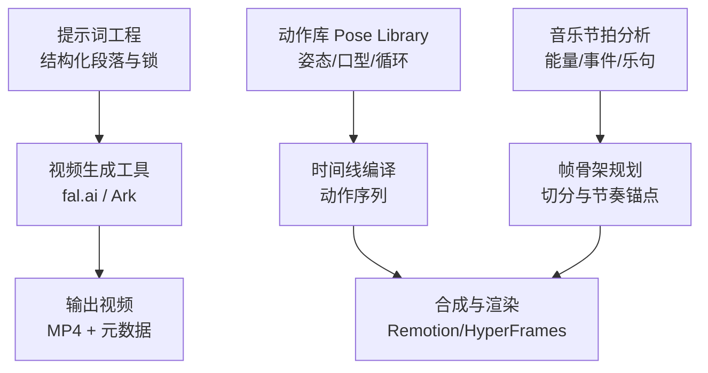
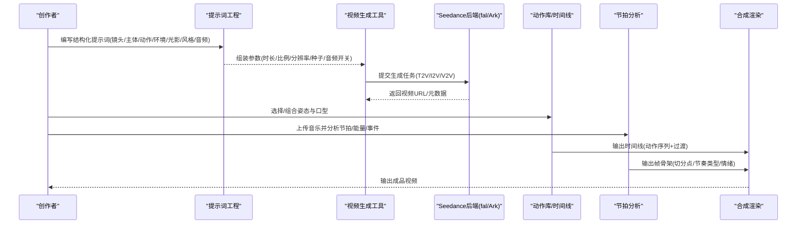
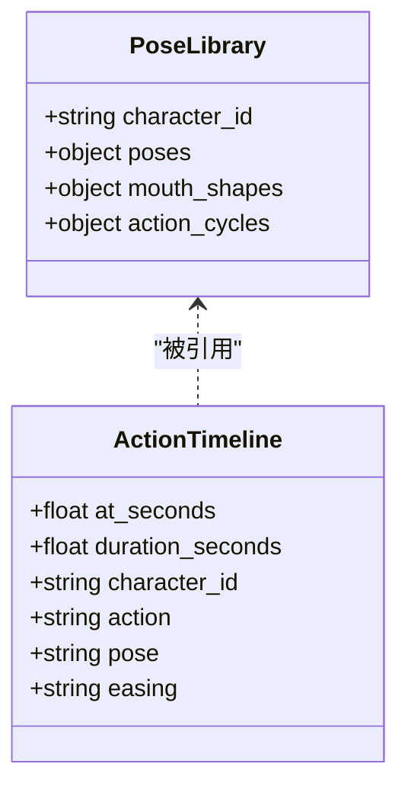
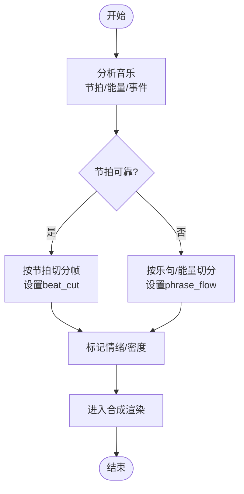
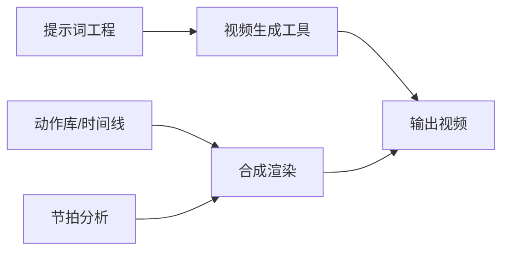

# Seedance模型提示词工程

<cite>
**本文引用的文件**
- [SKILL.md](file://.agents/skills/seedance-2-5/SKILL.md)
- [seedance-prompting.md](file://skills/creative/prompting/seedance-prompting.md)
- [video-gen-prompting.md](file://skills/creative/video-gen-prompting.md)
- [seedance_video.py](file://tools/video/seedance_video.py)
- [seedance_ark.py](file://tools/video/seedance_ark.py)
- [character_animation.py](file://tools/character/character_animation.py)
- [pose_library.schema.json](file://schemas/artifacts/pose_library.schema.json)
- [analyze-beatgrid.py](file://.agents/skills/music-to-video/scripts/analyze-beatgrid.py)
- [frame-skeleton.md](file://.agents/skills/music-to-video/references/frame-skeleton.md)
- [motion-principles.md](file://.agents/skills/hyperframes-creative/references/motion-principles.md)
- [dynamic-content-sequencing.md](file://.agents/skills/hyperframes-animation/rules/dynamic-content-sequencing.md)
- [executive-producer.md](file://skills/pipelines/character-animation/executive-producer.md)
</cite>

## 目录
1. [简介](#简介)
2. [项目结构](#项目结构)
3. [核心组件](#核心组件)
4. [架构总览](#架构总览)
5. [详细组件分析](#详细组件分析)
6. [依赖关系分析](#依赖关系分析)
7. [性能与成本考量](#性能与成本考量)
8. [故障排查指南](#故障排查指南)
9. [结论](#结论)
10. [附录：舞蹈动作库与自定义动作](#附录舞蹈动作库与自定义动作)

## 简介
本指南面向使用Seedance进行舞蹈动画与人物动作生成的创作者，聚焦“如何通过提示词控制角色姿态、动作流畅性与情感表达”，并解释音乐节奏同步与动态效果的技术实现路径。文档基于仓库中的官方技能说明、视频生成工具实现、动作库规范与音乐节拍分析脚本，提供从创意构思到落地的完整流程与最佳实践。

## 项目结构
围绕Seedance的提示词工程，本项目提供了三层支撑：
- 提示词与风格规范：定义镜头、主体、动作、环境、光影、风格与音频的结构化写法，以及多镜头一致性约束。
- 视频生成工具：封装对多家后端（fal.ai、Volcengine Ark等）的调用，支持文本/图像/参考视频到视频的生成，内置时长、分辨率、比例、原生音频、种子等参数。
- 动作与节拍系统：通过动作库（Pose Library）与音乐节拍分析，将舞蹈动作、表情与节奏对齐，形成可编排的时间线。

图表来源
- [SKILL.md:51-116](file://.agents/skills/seedance-2-5/SKILL.md#L51-L116)
- [seedance_video.py:75-185](file://tools/video/seedance_video.py#L75-L185)
- [seedance_ark.py:182-314](file://tools/video/seedance_ark.py#L182-L314)
- [pose_library.schema.json:1-41](file://schemas/artifacts/pose_library.schema.json#L1-L41)
- [analyze-beatgrid.py:93-131](file://.agents/skills/music-to-video/scripts/analyze-beatgrid.py#L93-L131)
- [frame-skeleton.md:15-51](file://.agents/skills/music-to-video/references/frame-skeleton.md#L15-L51)

章节来源
- [SKILL.md:51-116](file://.agents/skills/seedance-2-5/SKILL.md#L51-L116)
- [seedance_video.py:75-185](file://tools/video/seedance_video.py#L75-L185)
- [seedance_ark.py:182-314](file://tools/video/seedance_ark.py#L182-L314)
- [pose_library.schema.json:1-41](file://schemas/artifacts/pose_library.schema.json#L1-L41)
- [analyze-beatgrid.py:93-131](file://.agents/skills/music-to-video/scripts/analyze-beatgrid.py#L93-L131)
- [frame-skeleton.md:15-51](file://.agents/skills/music-to-video/references/frame-skeleton.md#L15-L51)

## 核心组件
- 提示词工程（Seedance 2.0/2.5）
  - 八段式结构：镜头/景别、运镜、主体描述、动作节拍、场景环境、光影调色、风格年代、音频（环境/对白）。
  - 多镜头在同一生成中组织，每段明确时间与机位；身份锚点在每一镜头重复出现以保证一致性。
  - “锁”机制：空间布局、屏幕方向、焦距锁定、数量锁定、静止区、正向约束等，避免跨镜头漂移。
- 视频生成工具
  - fal.ai 端：统一输入模式，支持文本/图像/参考媒体到视频，原生音频、多镜头、唇形同步、比例/分辨率/时长/种子。
  - Volcengine Ark 端：异步任务创建、轮询、下载；支持多种分辨率与比例，费用估算与用量统计。
- 动作库与时间线
  - Pose Library：为每个角色定义命名姿态、表情、口型与过渡；动作循环（走、呼吸等）可复用。
  - 时间线编译：将角色动作按秒级时间轴编排，加入预备、执行、跟随、放松等阶段。
- 音乐节拍与动态效果
  - 节拍网格与能量相位：检测强拍/弱拍/切分音、能量上升/骤降、硬停等关键事件。
  - 帧骨架规划：依据可靠节拍或乐句边界切分画面，设置节奏类型（beat_cut/phrase_flow）与情绪标签。

章节来源
- [seedance-prompting.md:21-43](file://skills/creative/prompting/seedance-prompting.md#L21-L43)
- [SKILL.md:51-116](file://.agents/skills/seedance-2-5/SKILL.md#L51-L116)
- [seedance_video.py:75-185](file://tools/video/seedance_video.py#L75-L185)
- [seedance_ark.py:182-314](file://tools/video/seedance_ark.py#L182-L314)
- [character_animation.py:283-366](file://tools/character/character_animation.py#L283-L366)
- [pose_library.schema.json:1-41](file://schemas/artifacts/pose_library.schema.json#L1-L41)
- [analyze-beatgrid.py:93-131](file://.agents/skills/music-to-video/scripts/analyze-beatgrid.py#L93-L131)
- [frame-skeleton.md:15-51](file://.agents/skills/music-to-video/references/frame-skeleton.md#L15-L51)

## 架构总览
下图展示从提示词到最终输出的端到端流程，包括多镜头生成、动作库驱动、音乐节拍对齐与合成渲染。

图表来源
- [seedance_video.py:237-403](file://tools/video/seedance_video.py#L237-L403)
- [seedance_ark.py:530-685](file://tools/video/seedance_ark.py#L530-L685)
- [character_animation.py:395-422](file://tools/character/character_animation.py#L395-L422)
- [analyze-beatgrid.py:93-131](file://.agents/skills/music-to-video/scripts/analyze-beatgrid.py#L93-L131)
- [frame-skeleton.md:15-51](file://.agents/skills/music-to-video/references/frame-skeleton.md#L15-L51)

## 详细组件分析

### 提示词工程：舞蹈与动作控制
- 镜头与运镜：用明确的摄影术语（推轨、手持微抖、摇移、俯仰）控制视角与动感，利于舞蹈动作的空间呈现。
- 主体与身份锚点：在每一镜头重复3–6个视觉特征（发型、服饰、纹身等），确保跨镜头一致。
- 动作节拍：以“预备→动作→保持→放松”的节奏书写，配合时间戳与镜头切换，使舞蹈动作清晰可读。
- 环境与光影：单一光源与明确的光向，避免冲突照明；舞台/背景需具体到材质与反射。
- 音频与对白：环境声、音效、音乐方向；引用对白用于唇形同步，短句更稳。
- 锁机制：空间布局、屏幕方向、焦距锁定、数量锁定、静止区、正向约束，减少漂移与幻觉。

章节来源
- [seedance-prompting.md:21-43](file://skills/creative/prompting/seedance-prompting.md#L21-L43)
- [seedance-prompting.md:45-66](file://skills/creative/prompting/seedance-prompting.md#L45-L66)
- [SKILL.md:51-116](file://.agents/skills/seedance-2-5/SKILL.md#L51-L116)
- [SKILL.md:119-150](file://.agents/skills/seedance-2-5/SKILL.md#L119-L150)
- [video-gen-prompting.md:183-214](file://skills/creative/video-gen-prompting.md#L183-L214)

### 视频生成工具：多后端与参数
- fal.ai 工具
  - 能力：文本/图像/参考媒体到视频，原生音频、多镜头、唇形同步、比例/分辨率/时长/种子。
  - 参数：duration、aspect_ratio、resolution、generate_audio、reference_*、seed等。
  - 工作流：构造payload→提交队列→轮询状态→下载结果→探测输出。
- Volcengine Ark 工具
  - 能力：异步任务创建、查询、取消；支持多分辨率/比例；费用估算与用量统计。
  - 工作流：构建payload→创建任务→轮询→下载视频→返回元数据。
- 共同要点
  - 严格校验输入（参考媒体数量上限、分辨率/比例合法性）。
  - 错误处理：网络超时、速率限制、任务失败等，返回结构化错误信息。
  - 成本与耗时：不同模型版本与变体有差异，建议先dry_run评估。

章节来源
- [seedance_video.py:75-185](file://tools/video/seedance_video.py#L75-L185)
- [seedance_video.py:237-403](file://tools/video/seedance_video.py#L237-L403)
- [seedance_ark.py:182-314](file://tools/video/seedance_ark.py#L182-L314)
- [seedance_ark.py:530-685](file://tools/video/seedance_ark.py#L530-L685)

### 动作库与时间线：舞蹈动作的可编排性
- Pose Library 数据结构
  - 角色ID、命名姿态（idle、gesture、reach等）、口型形状（closed/small_o/wide/smile）、动作循环（walk/breathe）、过渡缓动。
  - 质量检查：必需情绪/动作是否完备；循环是否包含接触与过步帧；仅声明变化部分。
- 时间线编译
  - 将角色动作按秒级时间轴编排，为主角添加预备与执行，配角添加反应与跟随，保证层次与节奏。
  - 过渡缓动（如power2.inOut/back.out）提升动作自然度。

图表来源
- [pose_library.schema.json:1-41](file://schemas/artifacts/pose_library.schema.json#L1-L41)
- [character_animation.py:395-422](file://tools/character/character_animation.py#L395-L422)

章节来源
- [pose_library.schema.json:1-41](file://schemas/artifacts/pose_library.schema.json#L1-L41)
- [character_animation.py:283-366](file://tools/character/character_animation.py#L283-L366)
- [character_animation.py:395-422](file://tools/character/character_animation.py#L395-L422)

### 音乐节奏同步与动态效果
- 节拍网格与能量相位
  - 检测强拍/弱拍/切分音，划分能量阶段（低/中/高），识别骤升/骤降与硬停。
  - 短语分组：将下强拍按小节数分组，得到乐句跨度。
- 帧骨架规划
  - 根据可靠节拍或乐句边界切分画面，设置节奏类型（beat_cut/phrase_flow）与情绪标签。
  - 仅在节拍可靠时锚定硬切；安静材料以乐句与能量包络为准。
- 动态效果原则
  - 速度传达重量感；构建/呼吸/解决三段式；转场即意义；编舞即层级；不对称进出。

图表来源
- [analyze-beatgrid.py:93-131](file://.agents/skills/music-to-video/scripts/analyze-beatgrid.py#L93-L131)
- [frame-skeleton.md:15-51](file://.agents/skills/music-to-video/references/frame-skeleton.md#L15-L51)
- [motion-principles.md:34-65](file://.agents/skills/hyperframes-creative/references/motion-principles.md#L34-L65)

章节来源
- [analyze-beatgrid.py:93-131](file://.agents/skills/music-to-video/scripts/analyze-beatgrid.py#L93-L131)
- [frame-skeleton.md:15-51](file://.agents/skills/music-to-video/references/frame-skeleton.md#L15-L51)
- [motion-principles.md:34-65](file://.agents/skills/hyperframes-creative/references/motion-principles.md#L34-L65)
- [dynamic-content-sequencing.md:200-232](file://.agents/skills/hyperframes-animation/rules/dynamic-content-sequencing.md#L200-L232)

## 依赖关系分析
- 提示词工程依赖视频生成工具的参数能力（时长、比例、分辨率、音频开关、种子），并通过“锁”机制保障多镜头一致性。
- 动作库与时间线依赖Pose Library的数据结构与过渡缓动，确保动作衔接自然。
- 音乐节拍分析为帧骨架规划提供客观依据，决定切分策略与节奏类型。
- 视频生成工具依赖后端API（fal.ai/Ark），需要正确的密钥与环境变量，且受限于参考媒体数量与时长上限。

图表来源
- [seedance_video.py:75-185](file://tools/video/seedance_video.py#L75-L185)
- [seedance_ark.py:182-314](file://tools/video/seedance_ark.py#L182-L314)
- [pose_library.schema.json:1-41](file://schemas/artifacts/pose_library.schema.json#L1-L41)
- [analyze-beatgrid.py:93-131](file://.agents/skills/music-to-video/scripts/analyze-beatgrid.py#L93-L131)

章节来源
- [seedance_video.py:75-185](file://tools/video/seedance_video.py#L75-L185)
- [seedance_ark.py:182-314](file://tools/video/seedance_ark.py#L182-L314)
- [pose_library.schema.json:1-41](file://schemas/artifacts/pose_library.schema.json#L1-L41)
- [analyze-beatgrid.py:93-131](file://.agents/skills/music-to-video/scripts/analyze-beatgrid.py#L93-L131)

## 性能与成本考量
- 模型版本与变体
  - 2.5为高质量模型，通常无fast端点；2.0支持fast/standard等变体，影响成本与时延。
- 时长与分辨率
  - 时长越长、分辨率越高，成本与耗时增加；建议先用较低分辨率探索，再重跑有效片段。
- 参考媒体
  - 图像/视频/音频数量有限制；过多会分散注意力，建议“一个元素一个参考”。
- 费用估算
  - Ark提供基于token与分辨率的费用估算；fal.ai按模型与时长计费；建议在提交前dry_run。

章节来源
- [seedance_video.py:214-235](file://tools/video/seedance_video.py#L214-L235)
- [seedance_ark.py:369-420](file://tools/video/seedance_ark.py#L369-L420)
- [SKILL.md:222-240](file://.agents/skills/seedance-2-5/SKILL.md#L222-L240)

## 故障排查指南
- 常见错误
  - API密钥缺失或格式错误（如Ark要求不带Bearer前缀）。
  - 参考媒体超限（图像/视频/音频数量超出模型限制）。
  - 分辨率/比例不合法（特定模型仅支持某些分辨率）。
  - 任务失败或超时（网络波动、服务端错误）。
- 处理建议
  - 先dry_run验证参数与费用；逐步缩小范围重试。
  - 记录每次变更与结果，便于定位问题。
  - 对于单处错误，采用局部修复而非全量重生成。

章节来源
- [seedance_video.py:237-403](file://tools/video/seedance_video.py#L237-L403)
- [seedance_ark.py:530-685](file://tools/video/seedance_ark.py#L530-L685)
- [SKILL.md:199-218](file://.agents/skills/seedance-2-5/SKILL.md#L199-L218)

## 结论
通过结构化的提示词工程、稳定的视频生成工具、可编排的动作库与音乐节拍分析，可以在Seedance上高效产出高质量的舞蹈动画与人物动作内容。关键在于：明确镜头与动作节拍、使用“锁”保障一致性、以动作库驱动时间线、依据节拍可靠度选择切分策略，并在迭代中控制成本与风险。

## 附录：舞蹈动作库与自定义动作
- 动作库使用方法
  - 定义角色所需的姿态与口型，建立常用动作循环（走、呼吸等）。
  - 使用时间线编译器将动作按秒级编排，为主角与配角分配预备/执行/反应/跟随。
- 自定义动作创建技巧
  - 从简单动作开始，逐步叠加复杂元素；保持动作语义清晰（预备→动作→保持→放松）。
  - 利用过渡缓动与分层编舞，确保动作自然与层次分明。
  - 结合音乐节拍，将动作关键点落在强拍或能量峰值，增强表现力。
- 制作流程与最佳实践
  - 研究→提案→脚本→角色设计→绑定计划→场景计划→资产→剪辑→合成→发布。
  - 坚持“一次只改一处”的迭代纪律；以整段视频为评判单位，而非单帧。

章节来源
- [character_animation.py:283-366](file://tools/character/character_animation.py#L283-L366)
- [character_animation.py:395-422](file://tools/character/character_animation.py#L395-L422)
- [executive-producer.md:1-30](file://skills/pipelines/character-animation/executive-producer.md#L1-L30)
- [pose_library.schema.json:1-41](file://schemas/artifacts/pose_library.schema.json#L1-L41)