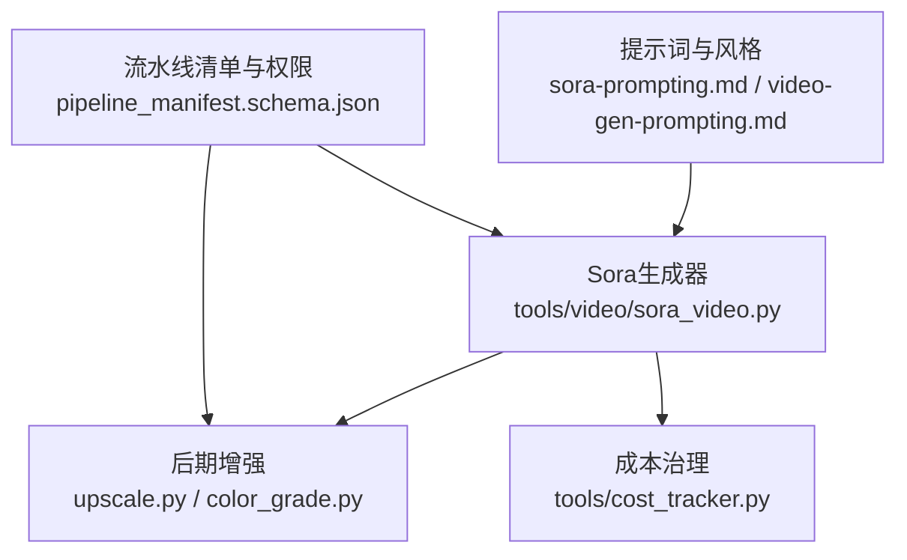
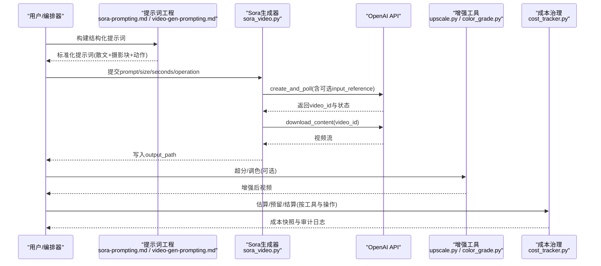
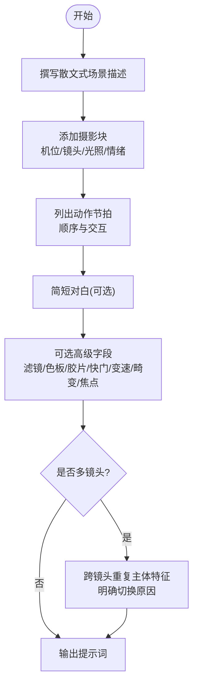
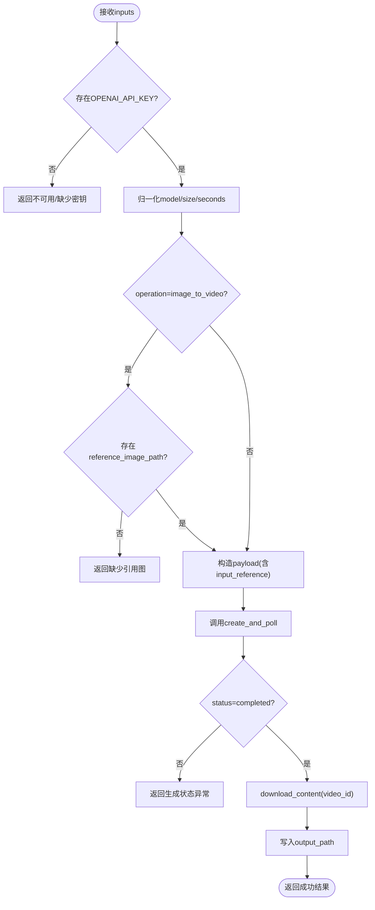
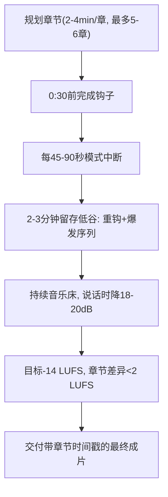
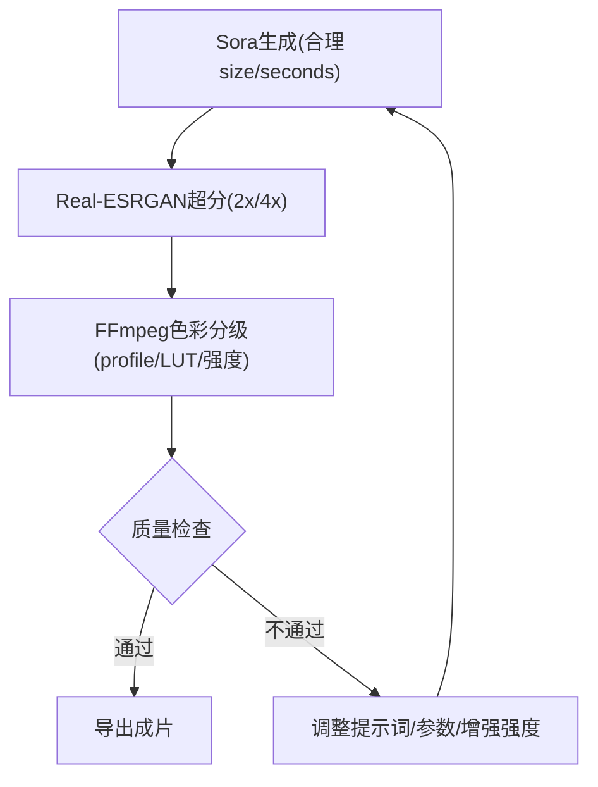
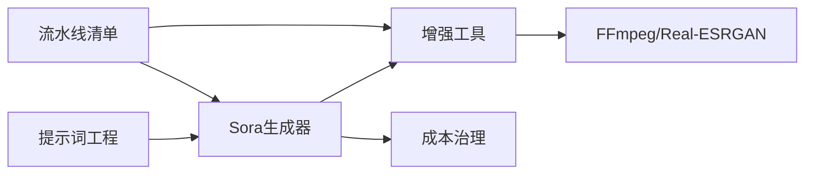

# Sora模型提示词工程

<cite>
**本文引用的文件**
- [tools/video/sora_video.py](file://tools/video/sora_video.py)
- [skills/creative/prompting/sora-prompting.md](file://skills/creative/prompting/sora-prompting.md)
- [skills/creative/video-gen-prompting.md](file://skills/creative/video-gen-prompting.md)
- [skills/creative/cinematic.md](file://skills/creative/cinematic.md)
- [skills/creative/long-form.md](file://skills/creative/long-form.md)
- [tools/enhancement/upscale.py](file://tools/enhancement/upscale.py)
- [tools/enhancement/color_grade.py](file://tools/enhancement/color_grade.py)
- [tools/cost_tracker.py](file://tools/cost_tracker.py)
- [schemas/pipelines/pipeline_manifest.schema.json](file://schemas/pipelines/pipeline_manifest.schema.json)
</cite>

## 目录
1. [简介](#简介)
2. [项目结构](#项目结构)
3. [核心组件](#核心组件)
4. [架构总览](#架构总览)
5. [详细组件分析](#详细组件分析)
6. [依赖关系分析](#依赖关系分析)
7. [性能与质量优化](#性能与质量优化)
8. [故障排查指南](#故障排查指南)
9. [结论](#结论)
10. [附录](#附录)

## 简介
本技术文档面向“Sora模型提示词工程”，聚焦长视频生成、复杂场景理解、多镜头叙事、时间跨度控制、物理规律模拟、高分辨率视频生成优化，以及电影级制作流程与团队协作模式。文档基于仓库中的Sora工具实现、通用视频提示词指南、电影化风格规范、长片流水线策略、增强工具链与成本治理模块进行系统化梳理，帮助读者在OpenMontage中高效、可控地生产高质量Sora视频内容。

## 项目结构
围绕Sora的提示词工程，本项目提供了从提示词模板到API调用、再到后期增强与成本治理的完整链路：
- 提示词与风格：提供Sora专用模板与通用视频提示词词汇表，指导如何组织镜头、光影、运动与声音描述。
- 生成执行：封装OpenAI Sora API调用，支持文本转视频与图像转视频，统一参数归一化与错误处理。
- 后期增强：提供超分辨率、色彩分级等本地增强能力，提升输出画质与一致性。
- 成本治理：对付费操作进行估算、预留、审批与结算，保障生产环境预算可控。
- 流水线编排：通过清单与扩展权限控制不同阶段的技能与工具使用，确保可审计与可扩展。

图表来源
- [skills/creative/prompting/sora-prompting.md:1-97](file://skills/creative/prompting/sora-prompting.md#L1-L97)
- [skills/creative/video-gen-prompting.md:1-326](file://skills/creative/video-gen-prompting.md#L1-L326)
- [tools/video/sora_video.py:1-293](file://tools/video/sora_video.py#L1-L293)
- [tools/enhancement/upscale.py:1-363](file://tools/enhancement/upscale.py#L1-L363)
- [tools/enhancement/color_grade.py:1-213](file://tools/enhancement/color_grade.py#L1-L213)
- [tools/cost_tracker.py:1-524](file://tools/cost_tracker.py#L1-L524)
- [schemas/pipelines/pipeline_manifest.schema.json:167-196](file://schemas/pipelines/pipeline_manifest.schema.json#L167-L196)

章节来源
- [tools/video/sora_video.py:1-293](file://tools/video/sora_video.py#L1-L293)
- [skills/creative/prompting/sora-prompting.md:1-97](file://skills/creative/prompting/sora-prompting.md#L1-L97)
- [skills/creative/video-gen-prompting.md:1-326](file://skills/creative/video-gen-prompting.md#L1-L326)
- [tools/enhancement/upscale.py:1-363](file://tools/enhancement/upscale.py#L1-L363)
- [tools/enhancement/color_grade.py:1-213](file://tools/enhancement/color_grade.py#L1-L213)
- [tools/cost_tracker.py:1-524](file://tools/cost_tracker.py#L1-L524)
- [schemas/pipelines/pipeline_manifest.schema.json:167-196](file://schemas/pipelines/pipeline_manifest.schema.json#L167-L196)

## 核心组件
- Sora视频生成器：封装OpenAI Video API，支持text_to_video与image_to_video，统一model/size/seconds参数校验与下载落盘。
- 提示词工程：提供Sora专用结构化模板（散文+摄影块+动作节拍）与通用五要素骨架（主体、运动、场景、空间、相机），并给出镜头、光影、光学、时间效果与音频描述词汇。
- 后期增强：Real-ESRGAN超分与FFmpeg色彩分级，支持内置profile与外部LUT，保证一致的电影化外观。
- 成本治理：估算-预留-审批-结算闭环，支持按工具与操作记录成本，支持warn/cap/observe模式与单动作阈值审批。
- 流水线编排：通过manifest定义阶段、技能、预算默认值与扩展权限，限制自定义脚本/技能/工具的使用范围。

章节来源
- [tools/video/sora_video.py:1-293](file://tools/video/sora_video.py#L1-L293)
- [skills/creative/prompting/sora-prompting.md:1-97](file://skills/creative/prompting/sora-prompting.md#L1-L97)
- [skills/creative/video-gen-prompting.md:1-326](file://skills/creative/video-gen-prompting.md#L1-L326)
- [tools/enhancement/upscale.py:1-363](file://tools/enhancement/upscale.py#L1-L363)
- [tools/enhancement/color_grade.py:1-213](file://tools/enhancement/color_grade.py#L1-L213)
- [tools/cost_tracker.py:1-524](file://tools/cost_tracker.py#L1-L524)
- [schemas/pipelines/pipeline_manifest.schema.json:167-196](file://schemas/pipelines/pipeline_manifest.schema.json#L167-L196)

## 架构总览
下图展示从提示词到最终输出的端到端流程，包括Sora生成、可选参考图输入、下载落盘、增强与成本记录。

图表来源
- [tools/video/sora_video.py:141-211](file://tools/video/sora_video.py#L141-L211)
- [skills/creative/prompting/sora-prompting.md:8-29](file://skills/creative/prompting/sora-prompting.md#L8-L29)
- [skills/creative/video-gen-prompting.md:39-54](file://skills/creative/video-gen-prompting.md#L39-L54)
- [tools/enhancement/upscale.py:126-173](file://tools/enhancement/upscale.py#L126-L173)
- [tools/enhancement/color_grade.py:134-179](file://tools/enhancement/color_grade.py#L134-L179)
- [tools/cost_tracker.py:101-171](file://tools/cost_tracker.py#L101-L171)

## 详细组件分析

### Sora提示词工程与多镜头叙事
- 结构化模板：建议以“散文段落”开头，随后补充摄影块（机位、镜头、光照、情绪）、动作节拍与对话，避免以技术参数开头。
- 高级字段：镜头规格、滤镜、色板、胶片模拟、对白、服装、收尾（颗粒、光晕、暗角）、快门角度、变速、畸变、焦点切换等，有助于精细控制画面质感与动态。
- 多镜头身份锚定：跨镜头重复主体关键视觉属性，避免代词导致的身份漂移；明确主体切换原因（主体移动或相机移动）。
- 时间与节奏：使用明确的播放速度原语（延时、快进、慢放、定格、变速、倒放）与连续长镜头、快速剪辑等手法控制叙事节奏。
- 颜色与风格：用具体锚色替代模糊形容词；结合电影化比例与镜头语言达成“电影感”。

图表来源
- [skills/creative/prompting/sora-prompting.md:8-55](file://skills/creative/prompting/sora-prompting.md#L8-L55)
- [skills/creative/video-gen-prompting.md:39-54](file://skills/creative/video-gen-prompting.md#L39-L54)
- [skills/creative/video-gen-prompting.md:196-213](file://skills/creative/video-gen-prompting.md#L196-L213)
- [skills/creative/video-gen-prompting.md:241-265](file://skills/creative/video-gen-prompting.md#L241-L265)
- [skills/creative/cinematic.md:21-41](file://skills/creative/cinematic.md#L21-L41)

章节来源
- [skills/creative/prompting/sora-prompting.md:1-97](file://skills/creative/prompting/sora-prompting.md#L1-L97)
- [skills/creative/video-gen-prompting.md:1-326](file://skills/creative/video-gen-prompting.md#L1-L326)
- [skills/creative/cinematic.md:21-41](file://skills/creative/cinematic.md#L21-L41)

### Sora生成器执行流程与参数约束
- 输入参数：prompt为必填；operation支持text_to_video与image_to_video；model限定sora-2/sora-2-pro；size与seconds受模型与平台限制；aspect_ratio可作为便捷别名。
- 图像转视频：当operation为image_to_video或提供reference_image_path时，需传入有效图片路径并转为data URI。
- 执行与下载：调用create_and_poll获取video_id与状态，完成后download_content写入output_path。
- 错误处理：缺失API Key、SDK不支持、未找到引用图、状态非completed等均返回失败结果。

图表来源
- [tools/video/sora_video.py:70-123](file://tools/video/sora_video.py#L70-L123)
- [tools/video/sora_video.py:141-211](file://tools/video/sora_video.py#L141-L211)
- [tools/video/sora_video.py:235-257](file://tools/video/sora_video.py#L235-L257)

章节来源
- [tools/video/sora_video.py:1-293](file://tools/video/sora_video.py#L1-L293)

### 长视频与时间跨度控制
- 章节结构与留存：将长视频拆分为2-4分钟章节，最多5-6章；前30秒完成钩子；每45-90秒设置模式中断；目标平均观看时长40-60%。
- 时间跨度控制：使用明确的播放速度原语与镜头长度组合，配合B-roll与音乐能量变化维持注意力；在2-3分钟留存低谷处安排重钩与爆发序列。
- 音频一致性：持续音乐床，说话时降18-20dB；整片LUFS目标-14；章节间差异小于2 LUFS。

图表来源
- [skills/creative/long-form.md:1-240](file://skills/creative/long-form.md#L1-L240)

章节来源
- [skills/creative/long-form.md:1-240](file://skills/creative/long-form.md#L1-L240)

### 物理规律模拟与复杂场景
- 简化物理：避免爆炸等混沌运动；行走/舞蹈等常规运动更易稳定。
- 明确主体与交互：按时间顺序描述主体动作与主客体交互；多主体切换需说明原因。
- 镜头与景深：使用rack focus、pull focus、focus tracking等原语引导注意力；明确起始与结束焦平面。
- 光影与材质：指定key/fill/rim/practical光源与色温；使用film stock/grade术语塑造质感。

章节来源
- [skills/creative/video-gen-prompting.md:277-299](file://skills/creative/video-gen-prompting.md#L277-L299)
- [skills/creative/video-gen-prompting.md:183-194](file://skills/creative/video-gen-prompting.md#L183-L194)
- [skills/creative/video-gen-prompting.md:145-164](file://skills/creative/video-gen-prompting.md#L145-L164)

### 高分辨率视频生成的优化方法
- 提示词层面：优先散文式描述，再补充摄影块；使用具体锚色与镜头/滤镜/胶片术语；控制提示词长度（Sora 2约100-250词）。
- 生成参数：根据平台限制选择合适size与seconds；必要时使用aspect_ratio别名。
- 后期增强：
  - 超分辨率：Real-ESRGAN支持2x/4x，可选择动漫/通用模型；视频帧提取-逐帧超分-重新合成，保留原音轨。
  - 色彩分级：内置profile（暖/冷/暗/亮/复古/高对比/中性）与外部LUT；支持强度混合，保持肤色自然。
- 质量检查：对比原片与增强结果，关注细节、伪影与面部自然度；视频注意帧间一致性。

图表来源
- [skills/creative/prompting/sora-prompting.md:6-68](file://skills/creative/prompting/sora-prompting.md#L6-L68)
- [tools/enhancement/upscale.py:126-173](file://tools/enhancement/upscale.py#L126-L173)
- [tools/enhancement/color_grade.py:134-179](file://tools/enhancement/color_grade.py#L134-L179)

章节来源
- [tools/enhancement/upscale.py:1-363](file://tools/enhancement/upscale.py#L1-L363)
- [tools/enhancement/color_grade.py:1-213](file://tools/enhancement/color_grade.py#L1-L213)
- [skills/creative/prompting/sora-prompting.md:1-97](file://skills/creative/prompting/sora-prompting.md#L1-L97)

### 电影级制作流程与团队协作
- 角色分工：导演/编剧负责故事与镜头设计；提示词工程师将创意转化为结构化提示词；生成工程师负责参数调优与重试；后期工程师负责超分与调色；成本控制者负责预算审批与结算。
- 协作模式：以流水线清单驱动各阶段技能与工具权限；每个阶段产出可审计的成本条目；通过“模式中断”“重钩”“章节时间戳”统一交付标准。
- 质量控制：遵循“用视觉原因替换情绪形容词”的规则；统一镜头/光影/色板术语；跨镜头重复主体特征。

章节来源
- [skills/creative/cinematic.md:21-41](file://skills/creative/cinematic.md#L21-L41)
- [schemas/pipelines/pipeline_manifest.schema.json:167-196](file://schemas/pipelines/pipeline_manifest.schema.json#L167-L196)
- [tools/cost_tracker.py:101-171](file://tools/cost_tracker.py#L101-L171)

### 成本效益分析与生产部署建议
- 成本估算：Sora生成器按seconds线性估算成本；成本跟踪器支持按工具/操作估算、预留、审批与结算，支持warn/cap/observe模式与单动作阈值。
- 预算治理：新付费工具首次使用需审批；超过可用预算时在cap模式下阻断，warn模式下标记警告；实际花费在任务完成后结算。
- 生产部署：
  - 环境变量：配置OPENAI_API_KEY并确保SDK版本满足Video API要求。
  - 资源需求：Sora生成为云端API，本地仅需网络；增强工具需要GPU/CPU与FFmpeg。
  - 权限控制：通过manifest的extensions限制custom_scripts/playbooks/skills/tools的使用范围。
  - 回退策略：当Sora不可用时，可路由至其他视频生成工具（如veo/gemini_omni/seedance/kling/minimax）。

章节来源
- [tools/video/sora_video.py:117-139](file://tools/video/sora_video.py#L117-L139)
- [tools/cost_tracker.py:1-524](file://tools/cost_tracker.py#L1-L524)
- [schemas/pipelines/pipeline_manifest.schema.json:167-196](file://schemas/pipelines/pipeline_manifest.schema.json#L167-L196)

## 依赖关系分析
- 提示词工程依赖通用视频提示词词汇与电影化风格规范，确保跨模型一致的镜头与光影表达。
- Sora生成器依赖OpenAI SDK的videos接口，需满足最低版本；内部参数归一化保证size/seconds合法。
- 增强工具依赖FFmpeg与Real-ESRGAN/GFPGAN；视频超分通过帧提取-逐帧处理-重新合成的管线。
- 成本治理依赖配置模型与持久化日志，贯穿估算-预留-审批-结算全生命周期。
- 流水线清单通过orchestration与extensions字段控制阶段行为与扩展权限。

图表来源
- [tools/video/sora_video.py:1-293](file://tools/video/sora_video.py#L1-L293)
- [tools/enhancement/upscale.py:1-363](file://tools/enhancement/upscale.py#L1-L363)
- [tools/enhancement/color_grade.py:1-213](file://tools/enhancement/color_grade.py#L1-L213)
- [tools/cost_tracker.py:1-524](file://tools/cost_tracker.py#L1-L524)
- [schemas/pipelines/pipeline_manifest.schema.json:167-196](file://schemas/pipelines/pipeline_manifest.schema.json#L167-L196)

章节来源
- [tools/video/sora_video.py:1-293](file://tools/video/sora_video.py#L1-L293)
- [tools/enhancement/upscale.py:1-363](file://tools/enhancement/upscale.py#L1-L363)
- [tools/enhancement/color_grade.py:1-213](file://tools/enhancement/color_grade.py#L1-L213)
- [tools/cost_tracker.py:1-524](file://tools/cost_tracker.py#L1-L524)
- [schemas/pipelines/pipeline_manifest.schema.json:167-196](file://schemas/pipelines/pipeline_manifest.schema.json#L167-L196)

## 性能与质量优化
- 提示词长度与模型适配：Sora 2在100-250词区间达到收益平台期；过长不会显著提升输出。
- 镜头与运动分离：避免混淆平移、旋转、变焦与焦点变化；使用明确的原语描述。
- 超分与降噪：视频超分采用帧级处理，注意显存与CPU/MPS下的tile策略；适当降噪强度减少压缩噪声。
- 色彩分级强度：使用intensity混合避免过度饱和或失真；优先选择适合内容的profile。
- 成本与耗时：按seconds估算成本与运行时间；在长视频中通过章节与模式中断平衡质量与效率。

章节来源
- [skills/creative/prompting/sora-prompting.md:6-68](file://skills/creative/prompting/sora-prompting.md#L6-L68)
- [skills/creative/video-gen-prompting.md:92-107](file://skills/creative/video-gen-prompting.md#L92-L107)
- [tools/enhancement/upscale.py:265-337](file://tools/enhancement/upscale.py#L265-L337)
- [tools/enhancement/color_grade.py:181-207](file://tools/enhancement/color_grade.py#L181-L207)
- [tools/video/sora_video.py:132-139](file://tools/video/sora_video.py#L132-L139)

## 故障排查指南
- 无法生成：检查OPENAI_API_KEY是否设置；确认SDK版本满足Video API要求；若不可用，考虑回退到其他视频生成工具。
- 图像转视频失败：确保operation为image_to_video且reference_image_path存在并可读取。
- 生成状态异常：若状态非completed，检查网络与配额；重试或更换参数。
- 增强失败：确认FFmpeg已安装；视频超分时检查临时目录与磁盘空间；人脸增强仅在必要时启用。
- 成本超支：在cap模式下会抛出预算超限异常；在warn模式下记录警告；必要时调整预算或审批阈值。

章节来源
- [tools/video/sora_video.py:125-151](file://tools/video/sora_video.py#L125-L151)
- [tools/video/sora_video.py:170-193](file://tools/video/sora_video.py#L170-L193)
- [tools/enhancement/upscale.py:126-157](file://tools/enhancement/upscale.py#L126-L157)
- [tools/enhancement/color_grade.py:134-164](file://tools/enhancement/color_grade.py#L134-L164)
- [tools/cost_tracker.py:117-157](file://tools/cost_tracker.py#L117-L157)

## 结论
通过结构化提示词、严格的镜头与光影词汇、合理的时长与节奏控制，以及本地增强与成本治理，OpenMontage为Sora模型的高质、可控、可审计的视频生产提供了完整方案。建议在团队内建立统一的提示词模板与风格指南，结合流水线清单与成本策略，实现电影级制作的规模化落地。

## 附录
- 推荐实践：
  - 使用Sora专用模板与通用五要素骨架编写提示词。
  - 在多镜头中重复主体特征，明确切换原因。
  - 控制提示词长度，避免过度堆砌。
  - 使用超分与色彩分级提升画质与一致性。
  - 通过成本治理确保预算可控与审计可追溯。