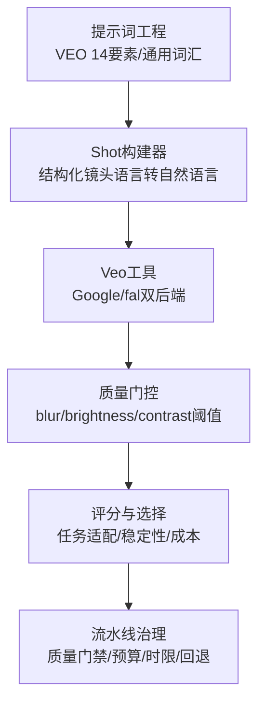
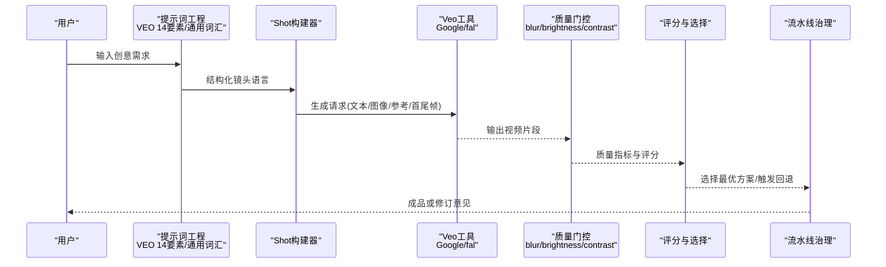
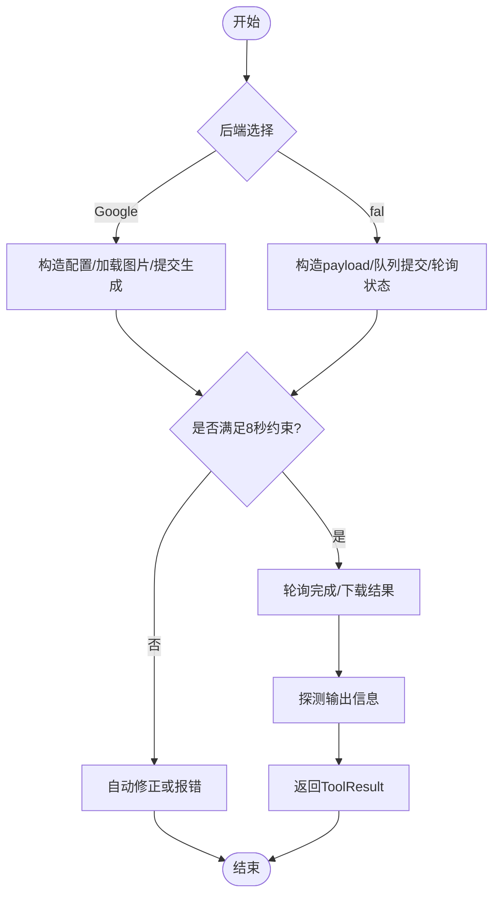
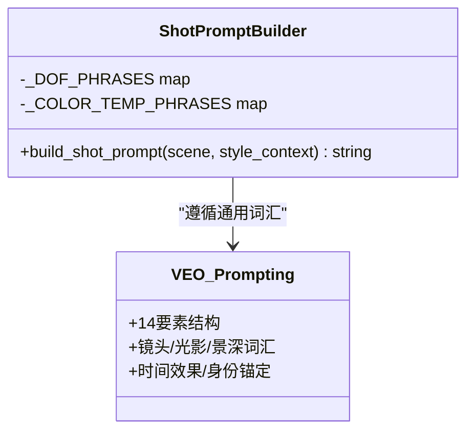
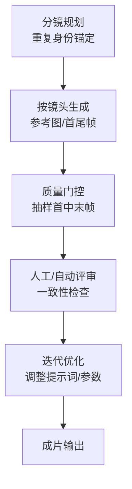
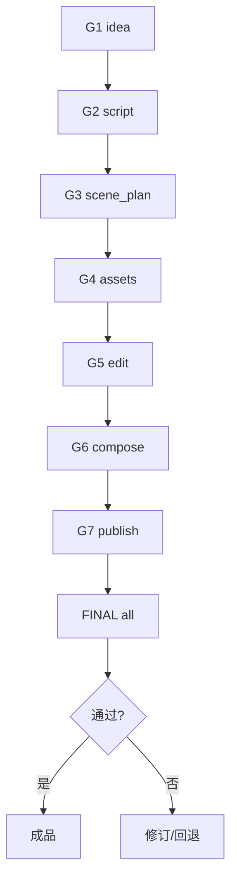

# Veo模型提示词工程

<cite>
**本文引用的文件**
- [tools/video/veo_video.py](file://tools/video/veo_video.py)
- [skills/creative/prompting/veo-prompting.md](file://skills/creative/prompting/veo-prompting.md)
- [skills/creative/video-gen-prompting.md](file://skills/creative/video-gen-prompting.md)
- [lib/scoring.py](file://lib/scoring.py)
- [lib/delivery_promise.py](file://lib/delivery_promise.py)
- [lib/shot_prompt_builder.py](file://lib/shot_prompt_builder.py)
- [skills/creative/video-understand-usage.md](file://skills/creative/video-understand-usage.md)
- [PROMPT_GALLERY.md](file://PROMPT_GALLERY.md)
- [skills/pipelines/cinematic/asset-director.md](file://skills/pipelines/cinematic/asset-director.md)
- [skills/pipelines/hybrid/executive-producer.md](file://skills/pipelines/hybrid/executive-producer.md)
</cite>

## 目录
1. [简介](#简介)
2. [项目结构](#项目结构)
3. [核心组件](#核心组件)
4. [架构总览](#架构总览)
5. [详细组件分析](#详细组件分析)
6. [依赖关系分析](#依赖关系分析)
7. [性能与成本考量](#性能与成本考量)
8. [故障排查指南](#故障排查指南)
9. [结论](#结论)
10. [附录](#附录)

## 简介
本指南面向使用Veo进行真实感视频生成与物理模拟的创作者与工程师，聚焦以下目标：
- 掌握Veo在光影、材质与环境氛围上的提示词控制方法
- 通过结构化提示词提升长视频连贯性与角色一致性
- 建立商业级视频制作标准与质量控制流程
- 基于仓库内多模型能力对比，给出选型建议与最佳实践

## 项目结构
围绕Veo的视频生成与提示词工程，仓库提供了“工具实现 + 提示词规范 + 质量评估 + 流水线治理”四层支撑：
- 工具层：Veo后端接入（Google GenAI与fal.ai双通道）
- 提示词层：VEO专用14要素结构与通用视频提示词词汇表
- 质量层：自动质量门控、评分与交付承诺约束
- 流水线层：分阶段质量门禁、预算与时限约束、回退策略

图表来源
- [skills/creative/prompting/veo-prompting.md:8-25](file://skills/creative/prompting/veo-prompting.md#L8-L25)
- [skills/creative/video-gen-prompting.md:43-67](file://skills/creative/video-gen-prompting.md#L43-L67)
- [lib/shot_prompt_builder.py:82-107](file://lib/shot_prompt_builder.py#L82-L107)
- [tools/video/veo_video.py:78-165](file://tools/video/veo_video.py#L78-L165)
- [skills/creative/video-understand-usage.md:35-42](file://skills/creative/video-understand-usage.md#L35-L42)
- [lib/scoring.py:447-518](file://lib/scoring.py#L447-L518)
- [skills/pipelines/hybrid/executive-producer.md:101-123](file://skills/pipelines/hybrid/executive-producer.md#L101-L123)

章节来源
- [tools/video/veo_video.py:1-76](file://tools/video/veo_video.py#L1-L76)
- [skills/creative/prompting/veo-prompting.md:1-90](file://skills/creative/prompting/veo-prompting.md#L1-L90)
- [skills/creative/video-gen-prompting.md:1-326](file://skills/creative/video-gen-prompting.md#L1-L326)
- [lib/shot_prompt_builder.py:68-107](file://lib/shot_prompt_builder.py#L68-L107)
- [skills/creative/video-understand-usage.md:35-125](file://skills/creative/video-understand-usage.md#L35-L125)
- [lib/scoring.py:447-518](file://lib/scoring.py#L447-L518)
- [skills/pipelines/hybrid/executive-producer.md:101-123](file://skills/pipelines/hybrid/executive-producer.md#L101-L123)

## 核心组件
- Veo视频生成工具：支持文本到视频、图像到视频、参考图到视频、首尾帧插值；内置原生音频与对话生成；提供Google与fal.ai双后端。
- 提示词工程：VEO专用14要素结构，配合通用视频提示词词汇表（镜头、光影、景深、时间效果等）。
- 质量门控：基于模糊度、亮度、对比度的自动化质量检查；结合任务上下文与稳定性评分进行产出质量评估。
- 流水线治理：多阶段质量门禁、预算与时限限制、失败回退与供应商锁定。

章节来源
- [tools/video/veo_video.py:33-76](file://tools/video/veo_video.py#L33-L76)
- [skills/creative/prompting/veo-prompting.md:8-32](file://skills/creative/prompting/veo-prompting.md#L8-L32)
- [skills/creative/video-gen-prompting.md:145-194](file://skills/creative/video-gen-prompting.md#L145-L194)
- [skills/creative/video-understand-usage.md:35-42](file://skills/creative/video-understand-usage.md#L35-L42)
- [lib/scoring.py:447-518](file://lib/scoring.py#L447-L518)
- [skills/pipelines/hybrid/executive-producer.md:101-123](file://skills/pipelines/hybrid/executive-producer.md#L101-L123)

## 架构总览
下图展示了从提示词到最终输出的端到端流程，包括VEO工具调用、质量门控与评分选择、以及流水线治理。

图表来源
- [skills/creative/prompting/veo-prompting.md:8-25](file://skills/creative/prompting/veo-prompting.md#L8-L25)
- [skills/creative/video-gen-prompting.md:43-67](file://skills/creative/video-gen-prompting.md#L43-L67)
- [lib/shot_prompt_builder.py:82-107](file://lib/shot_prompt_builder.py#L82-L107)
- [tools/video/veo_video.py:263-280](file://tools/video/veo_video.py#L263-L280)
- [skills/creative/video-understand-usage.md:73-79](file://skills/creative/video-understand-usage.md#L73-L79)
- [lib/scoring.py:447-518](file://lib/scoring.py#L447-L518)
- [skills/pipelines/hybrid/executive-producer.md:101-123](file://skills/pipelines/hybrid/executive-producer.md#L101-L123)

## 详细组件分析

### Veo视频生成工具（Google与fal.ai双后端）
- 能力矩阵：文本到视频、图像到视频、参考图到视频、首尾帧到视频；原生音频与对话生成；支持分辨率、时长、宽高比、负向提示、种子等参数。
- 后端选择：优先检测Google凭据，否则回退至fal.ai；支持auto模式自动选择。
- 时长约束：Google Veo 3.1在特定分辨率或操作下强制8秒；fal.ai对参考类操作也要求8秒。
- 错误处理：超时、API错误、下载失败均有明确返回；支持重试策略与幂等键。

图表来源
- [tools/video/veo_video.py:171-185](file://tools/video/veo_video.py#L171-L185)
- [tools/video/veo_video.py:263-280](file://tools/video/veo_video.py#L263-L280)
- [tools/video/veo_video.py:325-351](file://tools/video/veo_video.py#L325-L351)
- [tools/video/veo_video.py:459-523](file://tools/video/veo_video.py#L459-L523)
- [tools/video/veo_video.py:545-722](file://tools/video/veo_video.py#L545-L722)

章节来源
- [tools/video/veo_video.py:1-76](file://tools/video/veo_video.py#L1-L76)
- [tools/video/veo_video.py:78-165](file://tools/video/veo_video.py#L78-L165)
- [tools/video/veo_video.py:263-280](file://tools/video/veo_video.py#L263-L280)
- [tools/video/veo_video.py:325-351](file://tools/video/veo_video.py#L325-L351)
- [tools/video/veo_video.py:459-523](file://tools/video/veo_video.py#L459-L523)
- [tools/video/veo_video.py:545-722](file://tools/video/veo_video.py#L545-L722)

### 提示词工程：VEO专用14要素与通用词汇
- VEO 14要素：主体、动作、场景/上下文、机位、运镜、镜头/光学、光照、基调/情绪、艺术风格、氛围、时间元素、音频、电影术语、负向提示。
- 通用词汇：镜头类型、运动原语、景深/焦点、时间效果、身份锚定（跨镜头重复关键视觉属性）、避免清单（如复杂物理、多人口播等）。
- Shot构建器：将结构化镜头语言（焦距、景深、色温等）转换为自然语言提示词，便于不同模型理解。

图表来源
- [skills/creative/prompting/veo-prompting.md:8-32](file://skills/creative/prompting/veo-prompting.md#L8-L32)
- [skills/creative/video-gen-prompting.md:43-67](file://skills/creative/video-gen-prompting.md#L43-L67)
- [skills/creative/video-gen-prompting.md:145-194](file://skills/creative/video-gen-prompting.md#L145-L194)
- [lib/shot_prompt_builder.py:68-107](file://lib/shot_prompt_builder.py#L68-L107)

章节来源
- [skills/creative/prompting/veo-prompting.md:1-90](file://skills/creative/prompting/veo-prompting.md#L1-L90)
- [skills/creative/video-gen-prompting.md:1-326](file://skills/creative/video-gen-prompting.md#L1-L326)
- [lib/shot_prompt_builder.py:68-107](file://lib/shot_prompt_builder.py#L68-L107)

### 光影、材质与环境氛围控制
- 光照词汇：自然光、黄金时刻、高/低基调、伦勃朗光、电影黑色、体积光、逆光、侧光、实用光源、轮廓光等；方向修饰（主光、补光、反射、边缘光、溢光、负补光）；色温（暖/冷/混合）。
- 镜头与光学：广角/长焦、变形宽银幕、镜头眩光；畸变（鱼眼/桶形）；景深与焦点（深景深、浅景深、极浅景深、摇焦点、拉焦点、跟焦）。
- 环境氛围：色调、大气效果、纹理；通过负向提示排除不需要的元素（字幕、水印、眩光等）。

章节来源
- [skills/creative/video-gen-prompting.md:145-194](file://skills/creative/video-gen-prompting.md#L145-L194)
- [skills/creative/prompting/veo-prompting.md:44-72](file://skills/creative/prompting/veo-prompting.md#L44-L72)

### 长视频连贯性与角色一致性管理
- 身份锚定：在多镜头中重复3–6个关键视觉属性，避免代词与“同一角色”表述导致漂移。
- 时间效果：合理使用延时、快进、慢动作、定格、速度渐变、倒放；连续长镜头增强沉浸感。
- 参考图与首尾帧：利用reference_to_video与first_last_frame_to_video保持视觉一致；fal与Google均支持相关操作。
- 质量门控：抽样首、中、末帧进行质量检查，确保整体一致性。

图表来源
- [skills/creative/video-gen-prompting.md:209-214](file://skills/creative/video-gen-prompting.md#L209-L214)
- [tools/video/veo_video.py:392-451](file://tools/video/veo_video.py#L392-L451)
- [tools/video/veo_video.py:602-638](file://tools/video/veo_video.py#L602-L638)
- [skills/creative/video-understand-usage.md:57-79](file://skills/creative/video-understand-usage.md#L57-L79)

章节来源
- [skills/creative/video-gen-prompting.md:209-214](file://skills/creative/video-gen-prompting.md#L209-L214)
- [tools/video/veo_video.py:392-451](file://tools/video/veo_video.py#L392-L451)
- [tools/video/veo_video.py:602-638](file://tools/video/veo_video.py#L602-L638)
- [skills/creative/video-understand-usage.md:57-79](file://skills/creative/video-understand-usage.md#L57-L79)

### 商业级视频制作标准与质量控制流程
- 质量门控：blur_score、brightness、contrast阈值；抽样策略（首、中、末帧）；失败则重渲染。
- 评分与选择：结合任务适配、稳定性、成本与特性匹配（如原生音频、多镜头、导演级镜头控制、口型同步）进行综合评分。
- 流水线治理：分阶段质量门禁（G1-G7+FINAL），限制修订次数、发送回退次数、预算与时限；常见陷阱提醒（覆盖源素材、叠加过多、质量不一致、可读性差）。

图表来源
- [skills/creative/video-understand-usage.md:35-42](file://skills/creative/video-understand-usage.md#L35-L42)
- [lib/scoring.py:447-518](file://lib/scoring.py#L447-L518)
- [skills/pipelines/hybrid/executive-producer.md:101-123](file://skills/pipelines/hybrid/executive-producer.md#L101-L123)

章节来源
- [skills/creative/video-understand-usage.md:35-125](file://skills/creative/video-understand-usage.md#L35-L125)
- [lib/scoring.py:447-518](file://lib/scoring.py#L447-L518)
- [skills/pipelines/hybrid/executive-producer.md:101-123](file://skills/pipelines/hybrid/executive-producer.md#L101-L123)
- [skills/pipelines/cinematic/asset-director.md:134-159](file://skills/pipelines/cinematic/asset-director.md#L134-L159)

### 与其他主流模型的对比评估与选型指导
- 模型能力对比：Seedance 2.0为推荐高端默认（单遍同步音频、多镜头、导演级镜头控制、口型同步、参考图到视频）；Sora 2/VEO 3.1具备丰富结构化模板；LTX-2适合短提示；Runway Gen-4强调运动而非外观；Kling系列支持强调语法与官方API。
- 选型依据：任务意图（电影感/预告片/教育/数据可视化）、预算与时效、是否需要原生音频与口型同步、是否需参考图/首尾帧保持一致性。
- 评分加成：当视频任务具有电影感意图且提供商具备多项高级特性时，获得任务适配与输出质量加分。

章节来源
- [skills/creative/video-gen-prompting.md:13-27](file://skills/creative/video-gen-prompting.md#L13-L27)
- [lib/scoring.py:495-518](file://lib/scoring.py#L495-L518)
- [PROMPT_GALLERY.md:161-188](file://PROMPT_GALLERY.md#L161-L188)

## 依赖关系分析
- 提示词工程依赖通用词汇与VEO专用结构，驱动Shot构建器生成可执行提示词。
- Veo工具依赖Google或fal.ai后端，受时长与分辨率约束影响。
- 质量门控依赖视频理解工具对帧的量化指标；评分模块结合任务上下文与稳定性进行决策。
- 流水线治理在各阶段设置门禁，确保资产质量与预算/时限可控。

图表来源
- [skills/creative/prompting/veo-prompting.md:8-25](file://skills/creative/prompting/veo-prompting.md#L8-L25)
- [lib/shot_prompt_builder.py:82-107](file://lib/shot_prompt_builder.py#L82-L107)
- [tools/video/veo_video.py:263-280](file://tools/video/veo_video.py#L263-L280)
- [skills/creative/video-understand-usage.md:73-79](file://skills/creative/video-understand-usage.md#L73-L79)
- [lib/scoring.py:447-518](file://lib/scoring.py#L447-L518)
- [skills/pipelines/hybrid/executive-producer.md:101-123](file://skills/pipelines/hybrid/executive-producer.md#L101-L123)

## 性能与成本考量
- 成本估算：Google Veo约$0.40/秒；fal.ai根据分辨率与是否生成音频定价；fast版本更经济。
- 运行时间：Google后端约90秒；fal.ai fast约45秒，普通约120秒。
- 时长约束：Google Veo 3.1在1080p/4K或参考类操作下强制8秒；fal.ai参考类也要求8秒。
- 资源与重试：CPU/RAM/网络需求明确；支持重试策略与幂等键，减少重复成本。

章节来源
- [tools/video/veo_video.py:187-239](file://tools/video/veo_video.py#L187-L239)
- [tools/video/veo_video.py:325-351](file://tools/video/veo_video.py#L325-L351)
- [tools/video/veo_video.py:545-722](file://tools/video/veo_video.py#L545-L722)

## 故障排查指南
- 无凭据：未配置Google或fal.ai密钥将返回不可用；按安装说明配置环境变量。
- 时长不合法：非8秒在特定操作下会报错或自动修正；确认分辨率与操作类型。
- 超时：轮询超过安全时限将返回超时错误；检查网络与后端负载。
- API错误：直接API错误或结果获取失败需查看返回详情并调整参数。
- 质量不达标：blur_score、brightness、contrast低于阈值需重渲染或调整提示词。

章节来源
- [tools/video/veo_video.py:171-185](file://tools/video/veo_video.py#L171-L185)
- [tools/video/veo_video.py:263-280](file://tools/video/veo_video.py#L263-L280)
- [tools/video/veo_video.py:459-523](file://tools/video/veo_video.py#L459-L523)
- [tools/video/veo_video.py:645-698](file://tools/video/veo_video.py#L645-L698)
- [skills/creative/video-understand-usage.md:73-79](file://skills/creative/video-understand-usage.md#L73-L79)

## 结论
- VEO 3.1在真实感视频生成与物理模拟方面具备强大能力，尤其在对话与音频一体化生成上表现突出。
- 通过14要素结构化提示词与通用词汇表，可有效控制光影、材质与环境氛围。
- 借助参考图与首尾帧插值、身份锚定与质量门控，可实现长视频连贯性与角色一致性。
- 结合评分与流水线治理，建立商业级质量标准与成本控制机制，确保高质量交付。
- 基于多模型对比，按任务意图、预算与时效选择合适的模型与后端，最大化产出效率与质量。

## 附录
- 示例与灵感：参考仓库中的提示词画廊，获取经过验证的提示词与成本估计。
- 长期内容创作：遵循章节结构、钩子设计、节奏中断与音乐持续铺底等原则，提升观众留存。

章节来源
- [PROMPT_GALLERY.md:1-238](file://PROMPT_GALLERY.md#L1-L238)
- [skills/creative/long-form.md:202-215](file://skills/creative/long-form.md#L202-L215)