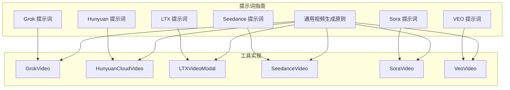
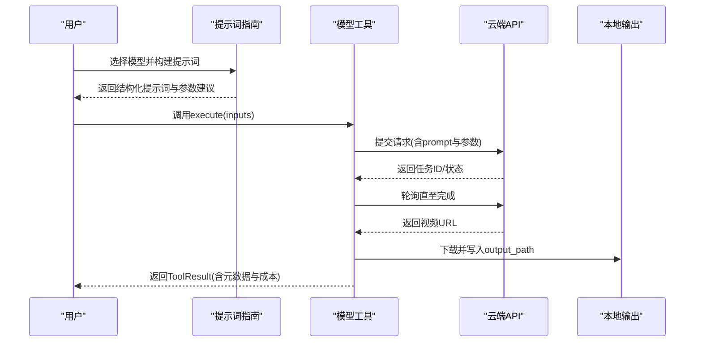
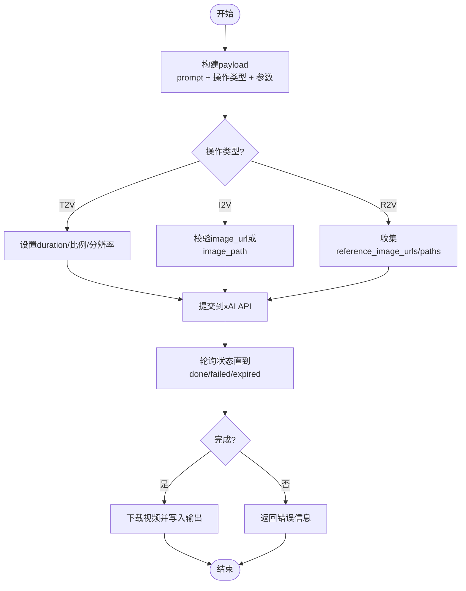
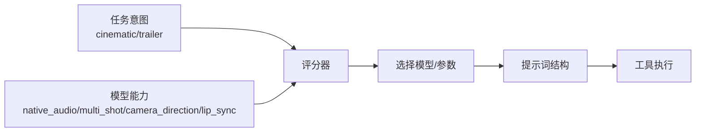

# 提示词工程技能

<cite>
**本文引用的文件**
- [grok-prompting.md](file://skills/creative/prompting/grok-prompting.md)
- [hunyuan-prompting.md](file://skills/creative/prompting/hunyuan-prompting.md)
- [ltx-prompting.md](file://skills/creative/prompting/ltx-prompting.md)
- [seedance-prompting.md](file://skills/creative/prompting/seedance-prompting.md)
- [sora-prompting.md](file://skills/creative/prompting/sora-prompting.md)
- [veo-prompting.md](file://skills/creative/prompting/veo-prompting.md)
- [video-gen-prompting.md](file://skills/creative/video-gen-prompting.md)
- [grok_video.py](file://tools/video/grok_video.py)
- [hunyuan_cloud_video.py](file://tools/video/hunyuan_cloud_video.py)
- [ltx_video_modal.py](file://tools/video/ltx_video_modal.py)
- [seedance_video.py](file://tools/video/seedance_video.py)
- [sora_video.py](file://tools/video/sora_video.py)
- [veo_video.py](file://tools/video/veo_video.py)
- [scoring.py](file://lib/scoring.py)
</cite>

## 目录
1. [简介](#简介)
2. [项目结构](#项目结构)
3. [核心组件](#核心组件)
4. [架构总览](#架构总览)
5. [详细组件分析](#详细组件分析)
6. [依赖关系分析](#依赖关系分析)
7. [性能与成本考量](#性能与成本考量)
8. [故障排查指南](#故障排查指南)
9. [结论](#结论)
10. [附录：提示词模板库与调试技巧](#附录提示词模板库与调试技巧)

## 简介
本技术文档面向OpenMontage的“提示词工程技能”，聚焦于为不同AI视频模型（Grok、Hunyuan、LTX、Seedance、Sora、Veo）提供系统化的提示词优化策略与最佳实践。文档基于仓库中的模型专用提示词指南与工具实现，总结各模型的提示词结构、能力边界、参数约束与适配方法，并提供跨模型的对比、模板与调试技巧，帮助通过精心设计的提示词获得高质量AI生成内容。

## 项目结构
围绕提示词工程，OpenMontage将“模型提示词指南”与“模型调用工具”分层组织：
- 提示词指南位于 skills/creative/prompting，按模型拆分，给出结构化提示词公式、风格词汇、镜头语言、音频与负面提示等。
- 通用视频生成原则位于 skills/creative/video-gen-prompting.md，覆盖通用禁忌、迭代策略与一致性建议。
- 工具层位于 tools/video，封装各模型的API调用、参数校验、错误处理与输出探测，保证提示词在运行时被正确投递到目标模型。

图表来源
- [grok-prompting.md:1-82](file://skills/creative/prompting/grok-prompting.md#L1-L82)
- [hunyuan-prompting.md:1-108](file://skills/creative/prompting/hunyuan-prompting.md#L1-L108)
- [ltx-prompting.md:1-83](file://skills/creative/prompting/ltx-prompting.md#L1-L83)
- [seedance-prompting.md:1-158](file://skills/creative/prompting/seedance-prompting.md#L1-L158)
- [sora-prompting.md:1-97](file://skills/creative/prompting/sora-prompting.md#L1-L97)
- [veo-prompting.md:1-90](file://skills/creative/prompting/veo-prompting.md#L1-L90)
- [video-gen-prompting.md:288-307](file://skills/creative/video-gen-prompting.md#L288-L307)
- [grok_video.py:49-147](file://tools/video/grok_video.py#L49-L147)
- [hunyuan_cloud_video.py:43-185](file://tools/video/hunyuan_cloud_video.py#L43-L185)
- [ltx_video_modal.py:23-84](file://tools/video/ltx_video_modal.py#L23-L84)
- [seedance_video.py:28-204](file://tools/video/seedance_video.py#L28-L204)
- [sora_video.py:35-123](file://tools/video/sora_video.py#L35-L123)
- [veo_video.py:33-169](file://tools/video/veo_video.py#L33-L169)

章节来源
- [grok-prompting.md:1-82](file://skills/creative/prompting/grok-prompting.md#L1-L82)
- [video-gen-prompting.md:288-307](file://skills/creative/video-gen-prompting.md#L288-L307)

## 核心组件
- Grok（图像/视频）：适合编辑现有图片、多图合成、参考图影响但不锁定首帧的视频；支持引用占位符进行身份/服装/产品一致性控制。
- Hunyuan（文本/图像转视频）：强调“光是氛围的灵魂”，重视光照维度、镜头运动库、焦点变化起止点描述；I2V应只描述动作与环境变化。
- LTX-2：六要素结构（镜头、场景、动作、角色、镜头运动、音频），严格静态规则，原生同步音频，风格分类清晰，帧数需满足特定模数。
- Seedance 2.0/2.5：多镜头、导演级镜头控制、原生同步音频、引用条件生成、角色一致性；推荐用于电影感预告片、高保真片段。
- Sora 2：散文式描述+摄影块+动作节拍；支持镜头规格、滤镜、胶片模拟、快门、回放速度等高级字段；短对话可用。
- VEO 3.1/3：最全面的14项结构，支持对话生成、音频集成、负向提示、剪辑术语；区分三类镜头运动族与多种焦点模式。

章节来源
- [grok-prompting.md:12-81](file://skills/creative/prompting/grok-prompting.md#L12-L81)
- [hunyuan-prompting.md:8-86](file://skills/creative/prompting/hunyuan-prompting.md#L8-L86)
- [ltx-prompting.md:6-66](file://skills/creative/prompting/ltx-prompting.md#L6-L66)
- [seedance-prompting.md:21-105](file://skills/creative/prompting/seedance-prompting.md#L21-L105)
- [sora-prompting.md:8-55](file://skills/creative/prompting/sora-prompting.md#L8-L55)
- [veo-prompting.md:8-57](file://skills/creative/prompting/veo-prompting.md#L8-L57)

## 架构总览
OpenMontage将“提示词指南”与“工具实现”解耦：指南定义结构与词汇，工具负责参数映射、鉴权、提交、轮询与下载。评分器根据模型能力与任务意图加权选择。

图表来源
- [grok_video.py:220-303](file://tools/video/grok_video.py#L220-L303)
- [hunyuan_cloud_video.py:247-341](file://tools/video/hunyuan_cloud_video.py#L247-L341)
- [seedance_video.py:237-402](file://tools/video/seedance_video.py#L237-L402)
- [sora_video.py:141-211](file://tools/video/sora_video.py#L141-L211)
- [veo_video.py:263-543](file://tools/video/veo_video.py#L263-L543)

## 详细组件分析

### Grok 提示词与工具
- 提示词要点
  - 图像：主体+动作/变更+场景+风格锚点+光照；编辑时直接描述变换；多图合成明确来源与最终场景。
  - 视频：镜头+运镜+主体+主动作节拍+环境+光照+基调；参考图使用占位符保持身份/服装/产品一致。
  - I2V vs R2V：I2V以源图为开帧；R2V让源图影响内容但不冻结构图。
- 工具要点
  - 支持T2V/I2V/R2V；支持原生音频与唇形同步；成本估算包含时长与输入图数量；失败态包含超时与状态异常。
  - 参数包括duration、aspect_ratio、resolution、reference images等。

图表来源
- [grok_video.py:182-218](file://tools/video/grok_video.py#L182-L218)
- [grok_video.py:220-303](file://tools/video/grok_video.py#L220-L303)

章节来源
- [grok-prompting.md:12-81](file://skills/creative/prompting/grok-prompting.md#L12-L81)
- [grok_video.py:49-147](file://tools/video/grok_video.py#L49-L147)
- [grok_video.py:182-303](file://tools/video/grok_video.py#L182-L303)

### Hunyuan 提示词与工具
- 提示词要点
  - T2V：主体+动作+场景+镜头类型+运镜+光照+风格+氛围；I2V仅描述动作与环境变化。
  - 光照维度丰富（方向、质量、色温、反射、阴影）；镜头运动库详尽；动态景深需说明起止焦点。
- 工具要点
  - 通过TokenHub API提交任务并轮询；支持T2V/I2V；中文理解良好；水印开关可配置；成本按积分换算美元。

章节来源
- [hunyuan-prompting.md:8-86](file://skills/creative/prompting/hunyuan-prompting.md#L8-L86)
- [hunyuan_cloud_video.py:43-185](file://tools/video/hunyuan_cloud_video.py#L43-L185)
- [hunyuan_cloud_video.py:247-341](file://tools/video/hunyuan_cloud_video.py#L247-L341)

### LTX 提示词与工具
- 提示词要点
  - 六要素：镜头、场景、动作、角色、运镜、音频；严格静态规则；音频描述具体类别与音量；风格分动画/风格化/电影类；帧数需满足(n-1)%8==0。
- 工具要点
  - Modal托管端点；支持T2V/I2V；支持参考图；离线不可用；成本固定估算；失败时返回统一错误。

章节来源
- [ltx-prompting.md:6-66](file://skills/creative/prompting/ltx-prompting.md#L6-L66)
- [ltx_video_modal.py:23-84](file://tools/video/ltx_video_modal.py#L23-L84)

### Seedance 提示词与工具
- 提示词要点
  - 8组件结构：镜头/运镜/主体/动作节拍/环境/光照/风格/音频；多镜头用Shot 1/2…；角色一致性需在每段重复视觉属性；口播台词≤6字；参数cheat sheet指导时长、比例、分辨率、种子等。
- 工具要点
  - 支持T2V/I2V/R2V；原生音频、导演级镜头、多镜头、唇形同步；版本2.0/2.5差异（参考图上限、路径命名）；成本按版本与时长计算；fast/standard变体。

章节来源
- [seedance-prompting.md:21-105](file://skills/creative/prompting/seedance-prompting.md#L21-L105)
- [seedance_video.py:28-204](file://tools/video/seedance_video.py#L28-L204)
- [seedance_video.py:237-402](file://tools/video/seedance_video.py#L237-L402)

### Sora 提示词与工具
- 提示词要点
  - 散文段落+摄影块（镜头/焦段/光照/情绪）+动作节拍+对白；高级可选字段（滤镜、胶片模拟、快门、回放速度、畸变、对焦模式）；短对话可用；创意自由度随长度变化。
- 工具要点
  - 通过OpenAI SDK创建并轮询；尺寸与秒数受限；支持I2V；成本按秒估算；失败态包含SDK不支持与状态异常。

章节来源
- [sora-prompting.md:8-55](file://skills/creative/prompting/sora-prompting.md#L8-L55)
- [sora_video.py:35-123](file://tools/video/sora_video.py#L35-L123)
- [sora_video.py:141-211](file://tools/video/sora_video.py#L141-L211)

### VEO 提示词与工具
- 提示词要点
  - 14项结构：主体/动作/场景/角度/运镜/光学/光照/基调/风格/氛围/时间/音频/剪辑/负向提示；对话生成、音频集成、负向提示、剪辑术语；区分三类运镜族与多种焦点模式。
- 工具要点
  - 双后端（Google GenAI与fal.ai）；支持T2V/I2V/R2V/首尾帧插值；自动修复时长；成本按后端与分辨率/音频计算；失败态包含超时与状态异常。

章节来源
- [veo-prompting.md:8-57](file://skills/creative/prompting/veo-prompting.md#L8-L57)
- [veo_video.py:33-169](file://tools/video/veo_video.py#L33-L169)
- [veo_video.py:263-543](file://tools/video/veo_video.py#L263-L543)

## 依赖关系分析
- 提示词指南与工具强耦合：指南决定提示词结构，工具负责参数映射与执行。
- 评分器对“电影感”意图加分：当检测到cinematic/trailer等关键词且模型具备原生音频、多镜头、镜头控制、唇形同步等特性时，提升任务匹配与输出质量评分。

图表来源
- [scoring.py:495-518](file://lib/scoring.py#L495-L518)

章节来源
- [scoring.py:495-518](file://lib/scoring.py#L495-L518)

## 性能与成本考量
- 成本估算
  - Grok：按秒计费，额外输入图费用；720p高于480p。
  - Hunyuan：按积分换算美元，I2V分辨率分级定价。
  - LTX：固定单次估算。
  - Seedance：按版本与时长计算，fast/standard不同费率。
  - Sora：按秒线性估算。
  - VEO：按后端与分辨率/音频开启与否计算。
- 运行时间
  - 各工具提供estimate_runtime，考虑队列、生成与下载；长时任务需合理timeout与重试策略。
- 资源需求
  - 网络必需；CPU/RAM/VRAM占用较低；磁盘用于临时输出。

章节来源
- [grok_video.py:169-180](file://tools/video/grok_video.py#L169-L180)
- [hunyuan_cloud_video.py:207-241](file://tools/video/hunyuan_cloud_video.py#L207-L241)
- [ltx_video_modal.py:89-93](file://tools/video/ltx_video_modal.py#L89-L93)
- [seedance_video.py:214-235](file://tools/video/seedance_video.py#L214-L235)
- [sora_video.py:132-139](file://tools/video/sora_video.py#L132-L139)
- [veo_video.py:187-239](file://tools/video/veo_video.py#L187-L239)

## 故障排查指南
- 常见错误
  - 缺少API密钥：Grok需XAI_API_KEY；Hunyuan需TENCENT_TOKENHUB_API_KEY；Sora需OPENAI_API_KEY；Veo需Google或FAL密钥。
  - 参数不合法：如Sora的size/seconds限制、LTX帧数模数、VEO时长强制8s（特定分辨率/操作）。
  - 状态异常：超时、失败、过期；需检查poll_interval与timeout。
- 定位步骤
  - 检查环境变量与依赖安装。
  - 查看input_schema与operation是否匹配。
  - 捕获ToolResult.error消息，必要时降低复杂度或更换模型。
  - 使用seed固定结果进行变体迭代。

章节来源
- [grok_video.py:220-226](file://tools/video/grok_video.py#L220-L226)
- [hunyuan_cloud_video.py:247-270](file://tools/video/hunyuan_cloud_video.py#L247-L270)
- [sora_video.py:141-151](file://tools/video/sora_video.py#L141-L151)
- [veo_video.py:263-276](file://tools/video/veo_video.py#L263-L276)

## 结论
OpenMontage通过“模型专属提示词指南+标准化工具实现”的方式，为Grok、Hunyuan、LTX、Seedance、Sora、Veo提供了系统化、可操作的提示词工程方案。遵循各模型的结构化公式与词汇库，结合参数约束与成本/性能评估，可在不同业务场景下稳定产出高质量视频内容。建议在项目初期明确意图（如电影感/广告/短视频），选择合适模型与变体，并通过seed与多镜头结构提升一致性与可控性。

## 附录：提示词模板库与调试技巧
- 模板速查
  - Grok：图像编辑/多图合成/参考图视频；占位符<IMAGE_1>等。
  - Hunyuan：T2V主体+动作+场景+镜头+运镜+光照+风格+氛围；I2V仅动作与环境变化。
  - LTX：六要素；严格静态；音频类别与音量；帧数模数。
  - Seedance：8组件；多镜头Shot 1/2；角色一致性重复；口播短句；参数cheat sheet。
  - Sora：散文+摄影块+动作节拍；高级可选字段；短对话。
  - VEO：14项结构；对话/音频/负向提示；剪辑术语；三类运镜族与焦点模式。
- 调试技巧
  - 从简单开始：主体+动作+场景，逐步叠加镜头、光照、风格。
  - 若某镜头失败：冻结相机、简化动作、重试。
  - 一致性：重复风格/光照/调色描述；保存seed进行变体。
  - 参考图：明确每张图的职责（身份/服装/产品/场景）。
  - 音频：在LTX/Seedance/VEO中描述环境音、音乐、对白；避免复杂多角色对话。
  - 负向提示：VEO支持明确排除字幕/水印/眩光等。

章节来源
- [video-gen-prompting.md:288-307](file://skills/creative/video-gen-prompting.md#L288-L307)
- [grok-prompting.md:12-81](file://skills/creative/prompting/grok-prompting.md#L12-L81)
- [hunyuan-prompting.md:8-86](file://skills/creative/prompting/hunyuan-prompting.md#L8-L86)
- [ltx-prompting.md:6-66](file://skills/creative/prompting/ltx-prompting.md#L6-L66)
- [seedance-prompting.md:21-105](file://skills/creative/prompting/seedance-prompting.md#L21-L105)
- [sora-prompting.md:8-55](file://skills/creative/prompting/sora-prompting.md#L8-L55)
- [veo-prompting.md:8-57](file://skills/creative/prompting/veo-prompting.md#L8-L57)