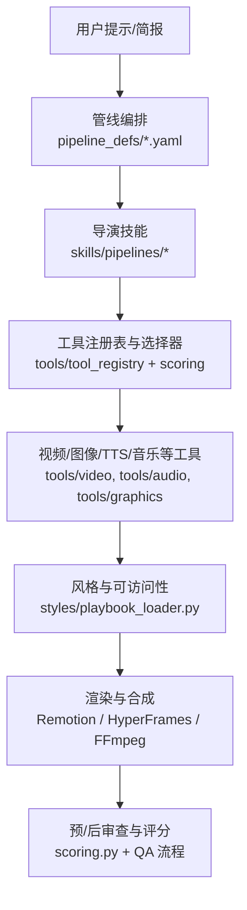
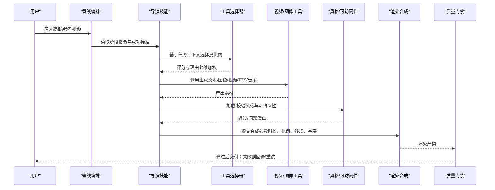
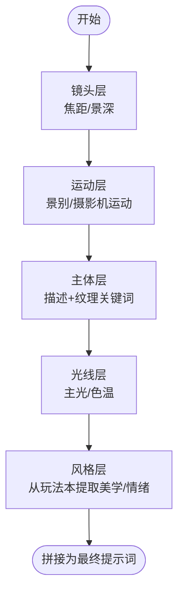
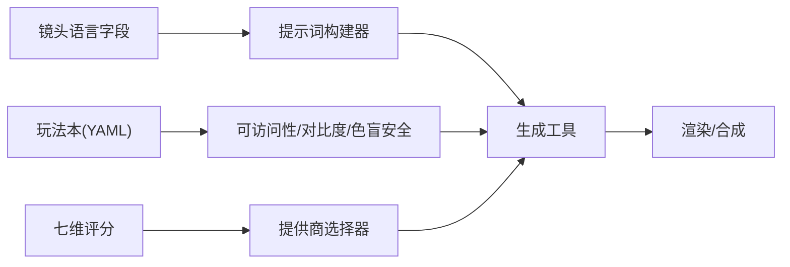

# 通用视频生成提示词

<cite>
**本文引用的文件**
- [README.md](file://README.md)
- [PROMPT_GALLERY.md](file://PROMPT_GALLERY.md)
- [skills/creative/video-gen-prompting.md](file://skills/creative/video-gen-prompting.md)
- [lib/shot_prompt_builder.py](file://lib/shot_prompt_builder.py)
- [skills/creative/cinematic.md](file://skills/creative/cinematic.md)
- [skills/pipelines/cinematic/proposal-director.md](file://skills/pipelines/cinematic/proposal-director.md)
- [.agents/skills/seedance-2-0/SKILL.md](file://.agents/skills/seedance-2-0/SKILL.md)
- [.agents/skills/create-video/references/prompt-examples.md](file://.agents/skills/create-video/references/prompt-examples.md)
- [.agents/skills/create-video/references/prompt-optimizer.md](file://.agents/skills/create-video/references/prompt-optimizer.md)
- [styles/playbook_loader.py](file://styles/playbook_loader.py)
- [lib/scoring.py](file://lib/scoring.py)
- [tests/qa/QA_PLAN.md](file://tests/qa/QA_PLAN.md)
</cite>

## 目录
1. [引言](#引言)
2. [项目结构](#项目结构)
3. [核心组件](#核心组件)
4. [架构总览](#架构总览)
5. [详细组件分析](#详细组件分析)
6. [依赖关系分析](#依赖关系分析)
7. [性能与成本考量](#性能与成本考量)
8. [故障排查指南](#故障排查指南)
9. [结论](#结论)
10. [附录：模板库与自动化工作流](#附录模板库与自动化工作流)

## 引言
本指南面向“跨模型”的视频生成提示词工程，目标是建立一套可复用的方法论：从镜头语言、构图法则、色彩理论到运动控制；覆盖广告、教育、娱乐等类型策略；提供模板库与自动化生成方法；并给出测试、迭代优化与质量评估标准。OpenMontage 将“提示词—场景计划—生成—合成—质检”固化为可审计的生产流程，使不同模型（如 Seedance、Sora、VEO、Runway、Kling、LTX、Wan/CogVideoX、Hunyuan 等）在统一框架下获得一致的高质量输出。

## 项目结构
OpenMontage 以“能力层（tools）+ 编排层（pipeline_defs）+ 知识层（skills）”的三层架构组织，配合样式系统（styles）、渲染引擎（Remotion/HyperFrames/FFmpeg）和质量门禁（scoring、playbook 校验）。

**图表来源**
- [README.md:450-475](file://README.md#L450-L475)
- [lib/scoring.py:35-75](file://lib/scoring.py#L35-L75)
- [styles/playbook_loader.py:37-64](file://styles/playbook_loader.py#L37-L64)

**章节来源**
- [README.md:450-475](file://README.md#L450-L475)

## 核心组件
- 通用提示词骨架：五要素（主体、主体动作、场景、空间/景别、摄影机），按模型调整长度与密度。
- 结构化镜头语言：景别、镜头运动、高度、角度、焦点/景深、光线、风格/调色、时间效果、音频描述。
- 提示词构建器：将结构化 shot_language 映射为自然语言提示词，分层组装（镜头→运动→主体→光线→风格）。
- 风格与可访问性：配色、对比度、色盲安全、字体层级与最小字号，确保可读性与一致性。
- 提供商选择与评分：任务匹配、输出质量、可控性、可靠性、成本、延迟、连续性七维加权打分。
- 质量门禁：预合成校验、幻灯片风险评分、后渲染自检（ffprobe、帧采样、音频分析、字幕检查）。

**章节来源**
- [skills/creative/video-gen-prompting.md:28-71](file://skills/creative/video-gen-prompting.md#L28-L71)
- [lib/shot_prompt_builder.py:1-167](file://lib/shot_prompt_builder.py#L1-L167)
- [styles/playbook_loader.py:210-396](file://styles/playbook_loader.py#L210-L396)
- [lib/scoring.py:35-75](file://lib/scoring.py#L35-L75)
- [README.md:652-686](file://README.md#L652-L686)

## 架构总览
下图展示从“提示词”到“成品视频”的关键路径，以及各阶段的质量与决策点。

**图表来源**
- [README.md:408-444](file://README.md#L408-L444)
- [lib/scoring.py:35-75](file://lib/scoring.py#L35-L75)
- [styles/playbook_loader.py:37-64](file://styles/playbook_loader.py#L37-L64)

## 详细组件分析

### 通用提示词骨架与模型适配
- 五要素顺序与时序/显著性原则：先主体再动作，再场景，再空间景别，最后摄影机。
- 模型长度建议：Seedance 2.0 适合长而结构化的提示；Sora/VEO 约 100–250 词；LTX ≤80；Runway Gen-4 ≤60。
- 叠加层（标题、HUD、字幕）不属于场景深度轴，需单独列出内容与位置。
- 多镜头身份锚定：重复关键视觉属性，避免代词导致的身份漂移。

**章节来源**
- [skills/creative/video-gen-prompting.md:28-71](file://skills/creative/video-gen-prompting.md#L28-L71)
- [skills/creative/video-gen-prompting.md:209-214](file://skills/creative/video-gen-prompting.md#L209-L214)

### 镜头语言与运动控制
- 景别：全景、中景、近景、特写、过肩、POV、鸟瞰、虫视、荷兰角等。
- 运动分组：平移（dolly/truck/pedestal）、旋转（pan/tilt/roll）、镜头光学（zoom/rack focus）、混合（dolly zoom/orbit/crane/whip pan/handheld）、静止态（static/locked-off/micro-shake）。
- 高度与角度：空高、屋顶、平视、胯部、地面、水面、水下；鸟瞰/高/平/低/仰角/荷兰角（固定或滚动）。
- 焦点/景深：深焦、浅焦、极浅焦、摇焦点、跟焦、焦点跟踪；变化时标注起止平面。
- 时间效果：延时、快进、慢放、定格、变速、倒放；冻结、快速剪辑、长镜头、淡入淡出、匹配剪辑。
- 光源与光位：自然光、黄金时刻、高调/低调、伦勃朗、黑色电影、体积光、逆光、侧光、实用光、轮廓光；方向修饰（主光/补光/反光板/边缘光/溢光/负补光）；色温（暖/冷/混合）。
- 镜头畸变：鱼眼 vs 桶形失真，二者不可互换。
- 主体过渡：揭示、消失、切换、复杂交替；明确由主体移动还是摄影机移动实现。

**章节来源**
- [skills/creative/video-gen-prompting.md:74-194](file://skills/creative/video-gen-prompting.md#L74-L194)
- [skills/creative/video-gen-prompting.md:241-275](file://skills/creative/video-gen-prompting.md#L241-L275)

### 结构化提示词构建器（代码级）
- 分层组装：镜头（焦距/景深）→运动（景别/摄影机运动）→主体（描述+纹理关键词）→光线（主光/色温）→风格（从玩法本提取美学/情绪）。
- 批量构建：跳过非视觉场景（如纯转场），输出 scene_id、prompt、是否高光时刻。

**图表来源**
- [lib/shot_prompt_builder.py:19-143](file://lib/shot_prompt_builder.py#L19-L143)

**章节来源**
- [lib/shot_prompt_builder.py:1-167](file://lib/shot_prompt_builder.py#L1-L167)

### 电影化风格与节奏
- 画幅与遮幅：2.39:1/2.35:1/1.85:1/16:9；仅在内容需要时使用遮幅。
- 平均镜头时长：动作/紧张 2–4s；标准电影化 4–8s；纪录片 6–12s；沉思 10–20s；蒙太奇 1–3s。
- 呼吸式节奏：避免连续三次相同时长；遵循 Murch 优先级（情感>故事>节奏>视线追踪>2D平面>3D空间）。

**章节来源**
- [skills/creative/cinematic.md:8-53](file://skills/creative/cinematic.md#L8-L53)
- [skills/creative/cinematic.md:55-87](file://skills/creative/cinematic.md#L55-L87)

### 提案与交付承诺（电影化管线）
- 情感弧线：紧张→揭示、惊奇→尺度、亲密→回报、紧迫→解决、悬念→CTA、宁静→爆发。
- 交付承诺：motion_led/source_led/hybrid；tone_mode；quality_floor；approved_fallback。
- 视觉处理：色板、布光、摄影语言、质感、排版约束。

**章节来源**
- [skills/pipelines/cinematic/proposal-director.md:140-176](file://skills/pipelines/cinematic/proposal-director.md#L140-L176)

### 模型特定最佳实践（示例：Seedance 2.0）
- 8 组件结构：景别/运镜/主体/动作节拍/环境/光线/风格/音频。
- 多镜头：每镜头重复主体身份锚；使用 Shot N 显式分镜；用“揭示/消失/切换/交替”过渡。
- 口型同步：引号内台词短句；单说话者保持近景与稳定机位。
- 参数建议：时长、画幅、分辨率、generate_audio、model_variant、seed 锁定与迭代。

**章节来源**
- [.agents/skills/seedance-2-0/SKILL.md:129-151](file://.agents/skills/seedance-2-0/SKILL.md#L129-L151)
- [skills/creative/video-gen-prompting.md:21-27](file://skills/creative/video-gen-prompting.md#L21-L27)

### 提示词模板库（来自官方示例与优化器）
- 完整生产示例：从简报到分镜脚本，包含格式、语气、角色设定、风格、关键屏显文字、逐场景 VO 与图层设计、音乐与旁白风格。
- 即用模板：科技新闻简报、产品对比、战略汇报、社交广告（竖屏）、高端报告等。
- 优化要点：避免布局坐标语言；B-roll 至少 4 层且元素必须运动；时长 10–15s；每场景含 VO；风格规则优先于艺术家名。

**章节来源**
- [.agents/skills/create-video/references/prompt-examples.md:8-129](file://.agents/skills/create-video/references/prompt-examples.md#L8-L129)
- [.agents/skills/create-video/references/prompt-examples.md:131-207](file://.agents/skills/create-video/references/prompt-examples.md#L131-L207)
- [.agents/skills/create-video/references/prompt-optimizer.md:19-45](file://.agents/skills/create-video/references/prompt-optimizer.md#L19-L45)
- [.agents/skills/create-video/references/prompt-optimizer.md:163-176](file://.agents/skills/create-video/references/prompt-optimizer.md#L163-L176)
- [.agents/skills/create-video/references/prompt-optimizer.md:221-255](file://.agents/skills/create-video/references/prompt-optimizer.md#L221-L255)

### 不同类型视频的提示词策略
- 广告（品牌/产品）：强调视觉钩子、强对比色板、动态排版、短时长高能量；必要时加入品牌资产与关键屏显文案。
- 教育（解释类）：采用“误解先行—逐步揭示—证据演示—含义延伸”的结构；每 30–45 秒一个概念；图表/卡片/步骤动画；旁白与画面严格同步。
- 娱乐（电影化/短片）：注重情感弧线、节奏呼吸、电影化画幅与光线；多镜头叙事与身份锚定；声音层次（对白/环境/Foley/配乐）。

**章节来源**
- [PROMPT_GALLERY.md:27-57](file://PROMPT_GALLERY.md#L27-L57)
- [PROMPT_GALLERY.md:91-127](file://PROMPT_GALLERY.md#L91-L127)
- [PROMPT_GALLERY.md:161-188](file://PROMPT_GALLERY.md#L161-L188)
- [skills/creative/storytelling.md:7-59](file://skills/creative/storytelling.md#L7-L59)
- [skills/creative/storytelling.md:120-141](file://skills/creative/storytelling.md#L120-L141)

### 自动化生成与工具使用方法
- 零密钥路径：Remotion 动画、Piper TTS、免费图库/档案素材，适合数据可视化、历史科普、开发者教育。
- 单密钥路径：开启图像/视频生成（如 FLUX/Kling/Veo），结合 Remotion 动画与自动配乐。
- 全量路径：视频生成 + 高级 TTS + 原创配乐 + 电影化合成，达到广播级品质。
- 工作流：研究→提案→脚本→场景计划→资产→剪辑→合成；每个阶段有导演技能与质量门禁。

**章节来源**
- [README.md:282-305](file://README.md#L282-L305)
- [README.md:308-353](file://README.md#L308-L353)
- [README.md:356-383](file://README.md#L356-L383)

### 质量评估与测试流程
- 提供商选择评分：任务匹配(30%)、输出质量(20%)、可控性(15%)、可靠性(15%)、成本效率(10%)、延迟(5%)、连续性(5%)。
- 质量门禁：人类审批节点、预合成校验（交付承诺/幻灯片风险/渲染器治理）、后渲染自检（ffprobe、抽帧、音频电平、字幕）。
- QA 脚本：逐项工具验证、端到端流水线回归，覆盖 TTS、图像、音乐、混音、合成、智能体能力。

**章节来源**
- [lib/scoring.py:35-75](file://lib/scoring.py#L35-L75)
- [README.md:652-686](file://README.md#L652-L686)
- [tests/qa/QA_PLAN.md:1-61](file://tests/qa/QA_PLAN.md#L1-L61)

## 依赖关系分析
- 提示词构建器依赖“结构化镜头语言”字段，将其映射为自然语言提示词。
- 风格系统依赖 YAML 玩法本与 JSON Schema 校验，提供对比度、色盲安全、字体层级与可访问性检查。
- 提供商选择器依赖七维评分函数，决定具体模型/网关。
- 渲染引擎（Remotion/HyperFrames/FFmpeg）受风格与平台输出配置驱动。

**图表来源**
- [lib/shot_prompt_builder.py:19-143](file://lib/shot_prompt_builder.py#L19-L143)
- [styles/playbook_loader.py:37-64](file://styles/playbook_loader.py#L37-L64)
- [lib/scoring.py:35-75](file://lib/scoring.py#L35-L75)

**章节来源**
- [lib/shot_prompt_builder.py:1-167](file://lib/shot_prompt_builder.py#L1-L167)
- [styles/playbook_loader.py:37-64](file://styles/playbook_loader.py#L37-L64)
- [lib/scoring.py:35-75](file://lib/scoring.py#L35-L75)

## 性能与成本考量
- 模型长度与收益：Seedance/Wan 适合较长结构化提示；LTX/Runway 更短更聚焦。
- 时长与预算：短插入 4–5s，英雄镜头 5–8s，多镜头场景 10–12s；fast 模式用于预览与低成本试错。
- 资源占用：本地 GPU 可用时启用本地模型（WAN/LTX/CogVideoX/Hunyuan）降低云成本；无密钥路径使用免费工具链。
- 渲染效率：避免过短 B-roll（≤5s 易黑帧），合理分配图层与运动，减少无效计算。

**章节来源**
- [skills/creative/video-gen-prompting.md:56-67](file://skills/creative/video-gen-prompting.md#L56-L67)
- [.agents/skills/seedance-2-0/SKILL.md:95-105](file://.agents/skills/seedance-2-0/SKILL.md#L95-L105)
- [README.md:267-278](file://README.md#L267-L278)

## 故障排查指南
- 常见提示词问题：过于模糊、元素过多冲突、试图渲染文本/UI、光照矛盾、复杂物理导致伪影。
- 镜头误用：混淆 dolly/zoom、pan/truck；静态镜头包含任何移动/变焦即不成立。
- 渲染失败：B-roll 过短导致黑帧；字幕在移动端被裁切；转场闪烁（编解码不一致）。
- 质量门禁触发：交付承诺不符、幻灯片风险过高、缺少字幕或静音片段。

**章节来源**
- [skills/creative/video-gen-prompting.md:277-299](file://skills/creative/video-gen-prompting.md#L277-L299)
- [.agents/skills/ltx2/SKILL.md:90-128](file://.agents/skills/ltx2/SKILL.md#L90-L128)
- [tests/qa/QA_PLAN.md:28-39](file://tests/qa/QA_PLAN.md#L28-L39)
- [README.md:652-686](file://README.md#L652-L686)

## 结论
通过统一的五要素骨架、严谨的镜头语言词汇、可计算的玩法本与可访问性校验、以及七维评分驱动的提供商选择，OpenMontage 将“提示词工程”从经验主义升级为可审计、可复现、可扩展的生产体系。无论广告、教育还是娱乐，均可基于同一套方法论快速产出高质量视频，并通过模板库与自动化工作流持续迭代优化。

## 附录：模板库与自动化工作流
- 模板库：
  - 完整生产示例与即用模板（科技简报、产品对比、战略汇报、社交广告、高端报告）。
  - 电影化多镜头模板（Shot 1/2/3…），含身份锚定、过渡原语、口型同步与音频描述。
- 自动化方法：
  - 从简报到分镜脚本：格式/语气/角色/风格/关键屏显文字/逐场景 VO/图层设计/音乐与旁白风格。
  - 工作流：研究→提案→脚本→场景计划→资产→剪辑→合成；每个阶段有导演技能与质量门禁。
  - 测试与迭代：QA 脚本逐项验证；供应商评分与回退策略；预/后审查闭环。

**章节来源**
- [.agents/skills/create-video/references/prompt-examples.md:8-129](file://.agents/skills/create-video/references/prompt-examples.md#L8-L129)
- [.agents/skills/create-video/references/prompt-optimizer.md:19-45](file://.agents/skills/create-video/references/prompt-optimizer.md#L19-L45)
- [README.md:356-383](file://README.md#L356-L383)
- [tests/qa/QA_PLAN.md:1-61](file://tests/qa/QA_PLAN.md#L1-L61)