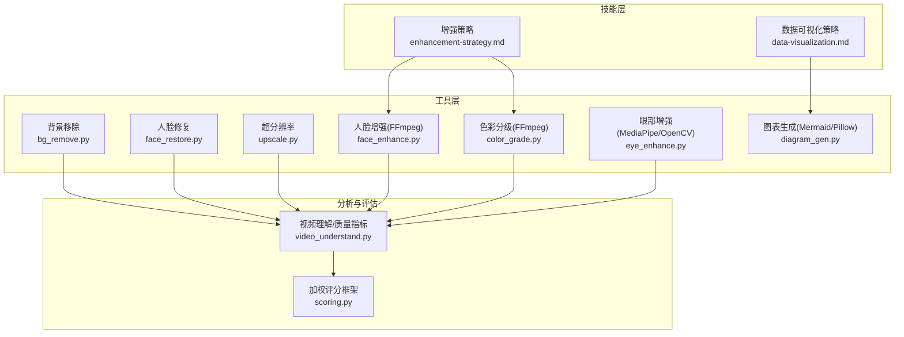
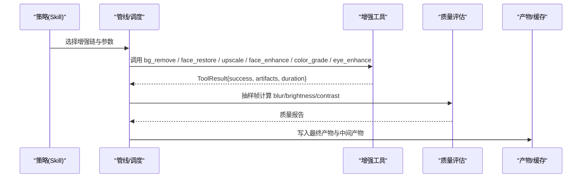
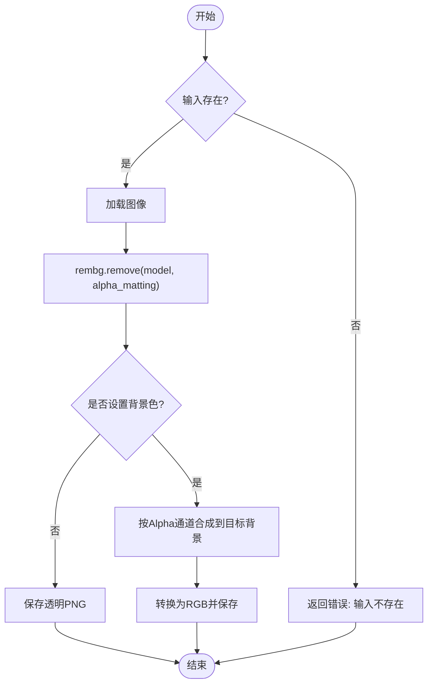
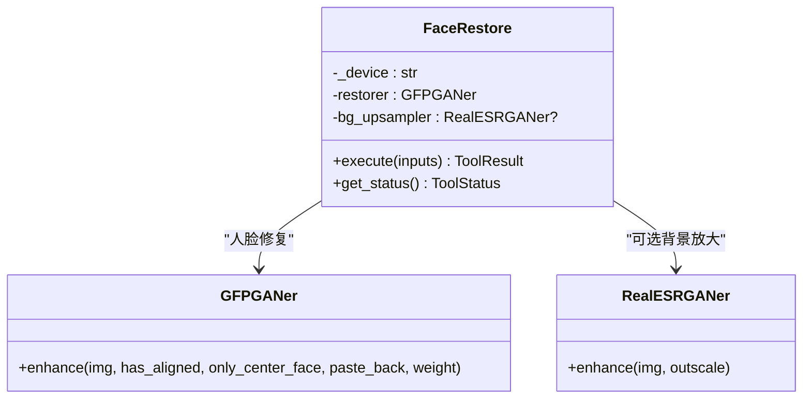
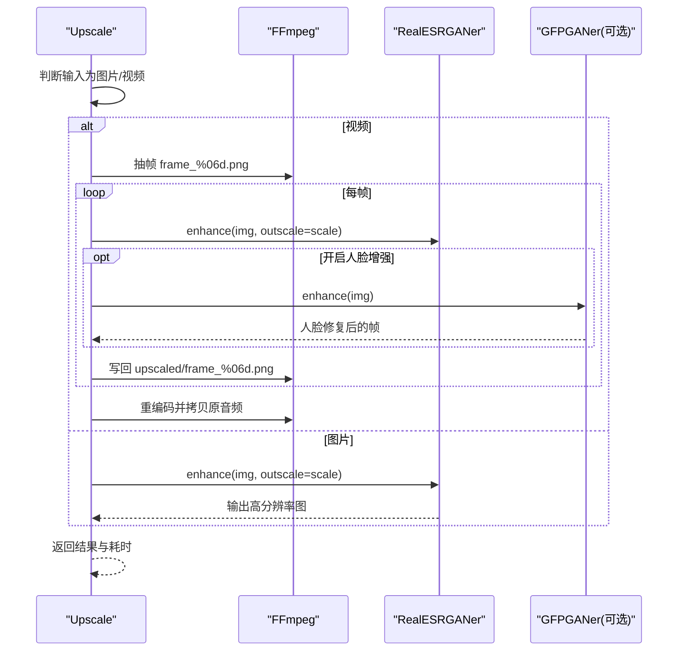
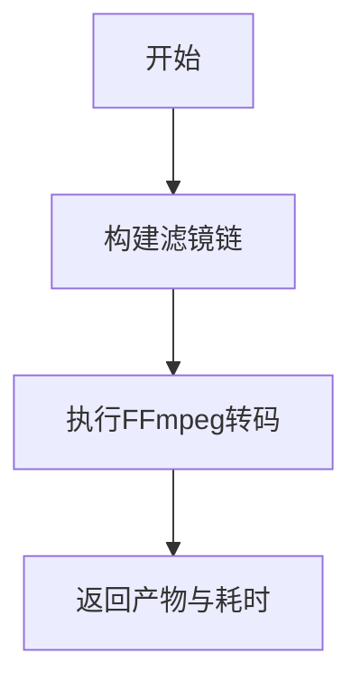
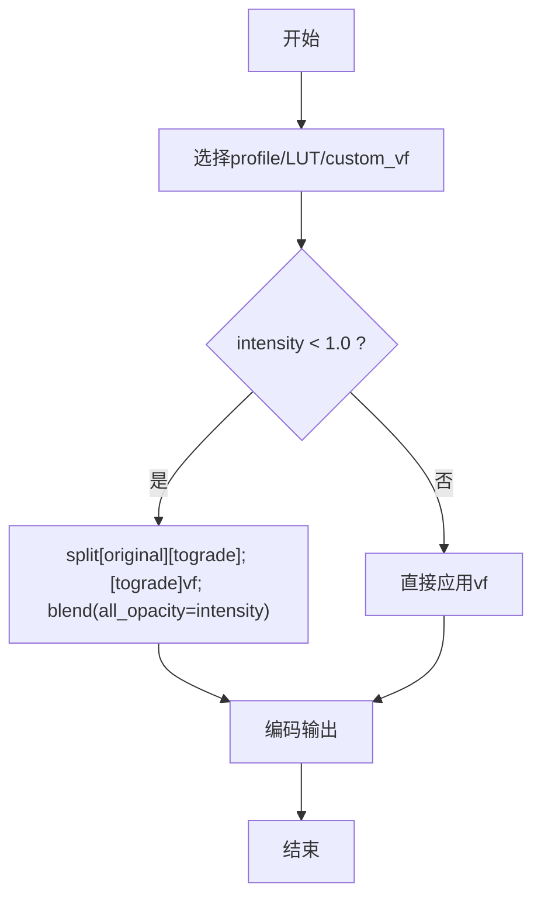
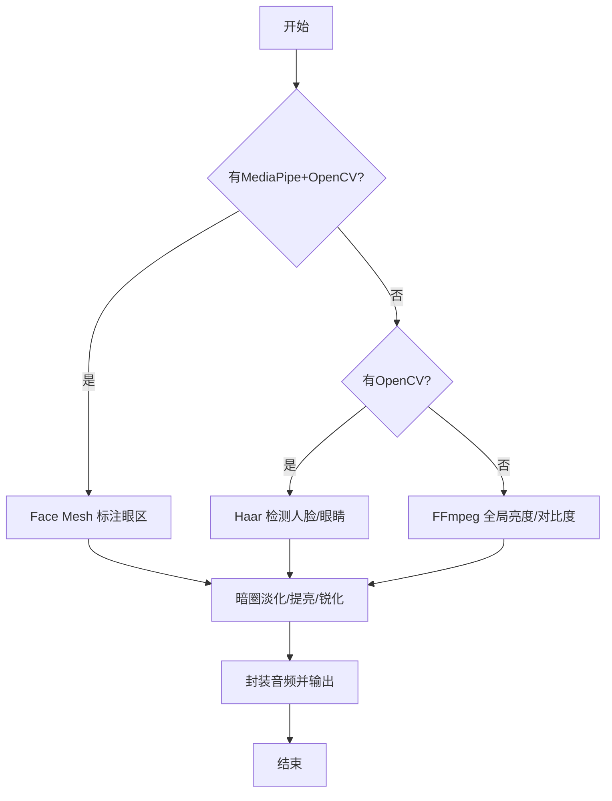
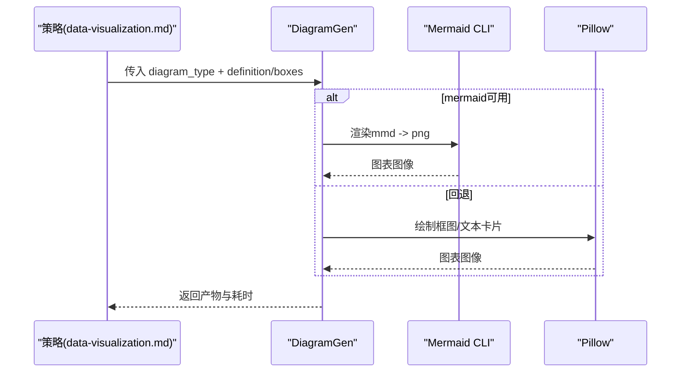
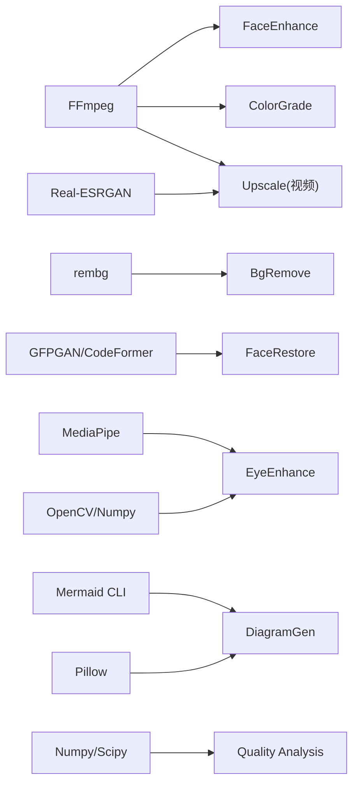

# 视觉增强技能

<cite>
**本文引用的文件**
- [enhancement-strategy.md](file://skills/creative/enhancement-strategy.md)
- [data-visualization.md](file://skills/creative/data-visualization.md)
- [bg_remove.py](file://tools/enhancement/bg_remove.py)
- [face_restore.py](file://tools/enhancement/face_restore.py)
- [upscale.py](file://tools/enhancement/upscale.py)
- [face_enhance.py](file://tools/enhancement/face_enhance.py)
- [color_grade.py](file://tools/enhancement/color_grade.py)
- [eye_enhance.py](file://tools/enhancement/eye_enhance.py)
- [diagram_gen.py](file://tools/graphics/diagram_gen.py)
- [video_understand.py](file://tools/analysis/video_understand.py)
- [scoring.py](file://lib/scoring.py)
</cite>

## 目录
1. [简介](#简介)
2. [项目结构](#项目结构)
3. [核心组件](#核心组件)
4. [架构总览](#架构总览)
5. [详细组件分析](#详细组件分析)
6. [依赖关系分析](#依赖关系分析)
7. [性能考量](#性能考量)
8. [故障排查指南](#故障排查指南)
9. [结论](#结论)
10. [附录](#附录)

## 简介
本技术文档面向OpenMontage的“视觉增强技能”，系统性地介绍图像增强、背景移除、人脸修复、超分辨率、数据可视化等能力，并给出使用AI工具提升图像质量、智能抠图、面部美化、图像放大的实践方法。同时阐述数据可视化的设计原则与实现路径，提供视觉效果评估标准与优化建议，覆盖短视频口播、长视频解说、演示类内容等多场景策略。

## 项目结构
OpenMontage将视觉增强能力以“工具（Tool）+ 技能（Skill）”的方式组织：
- 工具层：位于 tools/enhancement 与 tools/graphics，封装具体算法与外部库调用（如 rembg、GFPGAN/CodeFormer、Real-ESRGAN、FFmpeg、MediaPipe）。
- 技能层：位于 skills/creative，提供策略性指导（如增强链、配色、图表类型选择、动画时序、可读性与无障碍规范）。
- 分析与评估：tools/analysis 提供基础质量指标；lib/scoring 提供加权评分框架，便于横向对比不同工具或管线。

**图示来源**
- [enhancement-strategy.md:1-112](file://skills/creative/enhancement-strategy.md#L1-L112)
- [data-visualization.md:1-345](file://skills/creative/data-visualization.md#L1-L345)
- [bg_remove.py:1-162](file://tools/enhancement/bg_remove.py#L1-L162)
- [face_restore.py:1-246](file://tools/enhancement/face_restore.py#L1-L246)
- [upscale.py:1-363](file://tools/enhancement/upscale.py#L1-L363)
- [face_enhance.py:1-194](file://tools/enhancement/face_enhance.py#L1-L194)
- [color_grade.py:1-213](file://tools/enhancement/color_grade.py#L1-L213)
- [eye_enhance.py:1-579](file://tools/enhancement/eye_enhance.py#L1-L579)
- [diagram_gen.py:1-352](file://tools/graphics/diagram_gen.py#L1-L352)
- [video_understand.py:331-392](file://tools/analysis/video_understand.py#L331-L392)
- [scoring.py:35-75](file://lib/scoring.py#L35-L75)

**章节来源**
- [enhancement-strategy.md:1-112](file://skills/creative/enhancement-strategy.md#L1-L112)
- [data-visualization.md:1-345](file://skills/creative/data-visualization.md#L1-L345)

## 核心组件
- 背景移除（BgRemove）：基于 rembg 的 U2Net 系列模型，支持透明输出或自定义背景色合成，具备 alpha matting 选项。
- 人脸修复（FaceRestore）：基于 CodeFormer/GFPGAN，对模糊、压缩伪影和低分辨率的人脸进行恢复，可选背景放大。
- 超分辨率（Upscale）：基于 Real-ESRGAN，支持图片与视频逐帧放大，可选人脸增强与降噪强度控制。
- 人脸增强（FaceEnhance）：基于 FFmpeg 滤镜链，提供皮肤平滑、锐化、暖/冷色调、去噪等预设组合。
- 色彩分级（ColorGrade）：内置电影级 LUT/曲线/均衡器组合，支持外部 .cube LUT 与强度混合。
- 眼部增强（EyeEnhance）：优先使用 MediaPipe Face Mesh + OpenCV 精准定位眼周区域，执行黑眼圈淡化、眼部提亮与锐化；无 MediaPipe 时回退到 OpenCV Haar 或 FFmpeg 全局调整。
- 图表生成（DiagramGen）：通过 Mermaid CLI 渲染流程图/序列图等，或回退到 Pillow 绘制框图与文本卡片。

**章节来源**
- [bg_remove.py:1-162](file://tools/enhancement/bg_remove.py#L1-L162)
- [face_restore.py:1-246](file://tools/enhancement/face_restore.py#L1-L246)
- [upscale.py:1-363](file://tools/enhancement/upscale.py#L1-L363)
- [face_enhance.py:1-194](file://tools/enhancement/face_enhance.py#L1-L194)
- [color_grade.py:1-213](file://tools/enhancement/color_grade.py#L1-L213)
- [eye_enhance.py:1-579](file://tools/enhancement/eye_enhance.py#L1-L579)
- [diagram_gen.py:1-352](file://tools/graphics/diagram_gen.py#L1-L352)

## 架构总览
视觉增强在OpenMontage中遵循“策略驱动、工具可插拔、结果可评估”的架构：
- 策略层（Skills）：定义何时用何工具、参数范围、叠加密度、动画节奏与可读性约束。
- 工具层（Tools）：统一输入输出契约（BaseTool），返回 ToolResult，包含成功标志、产物路径、耗时、元数据。
- 评估层（Analysis/Scoring）：抽取关键帧计算模糊度、亮度、对比度等客观指标，结合加权评分框架进行横向对比与决策。

**图示来源**
- [enhancement-strategy.md:20-31](file://skills/creative/enhancement-strategy.md#L20-L31)
- [video_understand.py:331-392](file://tools/analysis/video_understand.py#L331-L392)
- [scoring.py:35-75](file://lib/scoring.py#L35-L75)

## 详细组件分析

### 背景移除（BgRemove）
- 功能要点：
  - 支持 u2net/u2net_human_seg/isnet-general-use 模型切换。
  - 支持 alpha matting 精细边缘处理。
  - 可选择输出透明 PNG 或合成到指定背景色。
- 输入输出：
  - 输入：input_path（必填）、output_path（可选）、model、bg_color、alpha_matting。
  - 输出：ToolResult 包含产物路径、模型名、是否启用 alpha matting、耗时。
- 资源与稳定性：
  - 依赖 python:rembg、python:PIL；CPU/可选GPU模式；确定性执行。
- 典型用法：
  - 人物抠图后叠加品牌背景或纯色背景，用于信息图或广告素材。

**图示来源**
- [bg_remove.py:99-161](file://tools/enhancement/bg_remove.py#L99-L161)

**章节来源**
- [bg_remove.py:1-162](file://tools/enhancement/bg_remove.py#L1-L162)

### 人脸修复（FaceRestore）
- 功能要点：
  - 支持 CodeFormer 与 GFPGAN 两种模型；可调 fidelity（仅 CodeFormer）。
  - 可选背景放大（Real-ESRGAN）以提升整体清晰度。
  - 自动设备选择（CUDA/MPS/CPU）。
- 输入输出：
  - 输入：input_path、output_path、model、fidelity、upscale、bg_upsampler。
  - 输出：检测到的脸数、放大倍数、是否启用背景放大、耗时。
- 注意事项：
  - 需要 gfpgan/torch；macOS MPS 无需额外 CUDA 构建。
  - 若版本签名不兼容，代码会动态跳过 device 参数传递。

**图示来源**
- [face_restore.py:108-245](file://tools/enhancement/face_restore.py#L108-L245)

**章节来源**
- [face_restore.py:1-246](file://tools/enhancement/face_restore.py#L1-L246)

### 超分辨率（Upscale）
- 功能要点：
  - 图片与视频均支持；视频通过 FFmpeg 抽帧→逐帧放大→重新编码。
  - 模型包括 RealESRGAN_x4plus、anime 专用、轻量版 ESRNet。
  - 可选 face_enhance（内部集成 GFPGAN）与 denoise_strength。
- 输入输出：
  - 输入：input_path、output_path、scale、model、face_enhance、denoise_strength。
  - 输出：输出尺寸/帧率/总帧数、类型（image/video）、耗时。
- 性能提示：
  - 全图 x4 推理在 CPU/MPS 上可能内存压力较大，代码已采用 tile 分块降低风险。

**图示来源**
- [upscale.py:126-173](file://tools/enhancement/upscale.py#L126-L173)
- [upscale.py:206-259](file://tools/enhancement/upscale.py#L206-L259)
- [upscale.py:265-337](file://tools/enhancement/upscale.py#L265-L337)

**章节来源**
- [upscale.py:1-363](file://tools/enhancement/upscale.py#L1-L363)

### 人脸增强（FaceEnhance）
- 功能要点：
  - 基于 FFmpeg 滤镜链，提供 skin smoothing、sharpen、warm/cool、denoise 等预设。
  - 支持多预设串联与自定义 vf。
- 适用场景：
  - 口播视频快速提升观感，无需 GPU。

**图示来源**
- [face_enhance.py:126-170](file://tools/enhancement/face_enhance.py#L126-L170)

**章节来源**
- [face_enhance.py:1-194](file://tools/enhancement/face_enhance.py#L1-L194)

### 色彩分级（ColorGrade）
- 功能要点：
  - 内置 cinematic_warm/cool、moody_dark、bright_clean、vintage_film、high_contrast、neutral 等 profile。
  - 支持外部 .cube LUT 与强度混合（blend）。
- 适用场景：
  - 统一影片风格、营造情绪氛围。

**图示来源**
- [color_grade.py:134-207](file://tools/enhancement/color_grade.py#L134-L207)

**章节来源**
- [color_grade.py:1-213](file://tools/enhancement/color_grade.py#L1-L213)

### 眼部增强（EyeEnhance）
- 功能要点：
  - 首选 MediaPipe Face Mesh 精确标注眼周，执行黑眼圈淡化、眼部提亮与锐化。
  - 无 MediaPipe 时回退到 OpenCV Haar 或 FFmpeg 全局调整。
- 适用场景：
  - 长时间口播、直播回放、低光环境下的面部细节优化。

**图示来源**
- [eye_enhance.py:149-174](file://tools/enhancement/eye_enhance.py#L149-L174)
- [eye_enhance.py:176-268](file://tools/enhancement/eye_enhance.py#L176-L268)
- [eye_enhance.py:425-536](file://tools/enhancement/eye_enhance.py#L425-L536)
- [eye_enhance.py:538-574](file://tools/enhancement/eye_enhance.py#L538-L574)

**章节来源**
- [eye_enhance.py:1-579](file://tools/enhancement/eye_enhance.py#L1-L579)

### 数据可视化（DiagramGen + 策略）
- 功能要点：
  - 通过 Mermaid CLI 渲染流程图/序列图/状态图等；无 mmdc 时回退到 Pillow 绘制框图或文本卡片。
  - 技能层提供图表类型决策树、动画时序、标签放置、颜色与无障碍规范。
- 适用场景：
  - 解释复杂流程、展示统计趋势、强调关键指标。

**图示来源**
- [diagram_gen.py:121-181](file://tools/graphics/diagram_gen.py#L121-L181)
- [diagram_gen.py:183-308](file://tools/graphics/diagram_gen.py#L183-L308)
- [diagram_gen.py:310-351](file://tools/graphics/diagram_gen.py#L310-L351)
- [data-visualization.md:19-57](file://skills/creative/data-visualization.md#L19-L57)

**章节来源**
- [diagram_gen.py:1-352](file://tools/graphics/diagram_gen.py#L1-L352)
- [data-visualization.md:1-345](file://skills/creative/data-visualization.md#L1-L345)

## 依赖关系分析
- 外部库与命令：
  - rembg、Pillow：背景移除与图像合成。
  - gfpgan、torch、basicsr、realesrgan：人脸修复与超分辨率。
  - ffmpeg、ffprobe：视频编解码、抽帧、音轨复用。
  - mediapipe、opencv-python、numpy：眼部增强与像素级处理。
  - mermaid-cli（mmdc）：图表渲染；Pillow：回退绘图。
- 工具间耦合：
  - Upscale 可与 FaceRestore 配合（先修复再放大）。
  - FaceEnhance/ColorGrade 作为后期调色链路，常置于修复/放大之后。
  - EyeEnhance 可在修复/放大前后按需插入，避免过度处理导致失真。
- 评估依赖：
  - video_understand 基于 numpy/scipy 计算模糊度、亮度、对比度。
  - scoring 提供加权评分，便于比较不同工具/参数的效果。

**图示来源**
- [bg_remove.py:38-43](file://tools/enhancement/bg_remove.py#L38-L43)
- [face_restore.py:38-44](file://tools/enhancement/face_restore.py#L38-L44)
- [upscale.py:58-64](file://tools/enhancement/upscale.py#L58-L64)
- [face_enhance.py:80-82](file://tools/enhancement/face_enhance.py#L80-L82)
- [color_grade.py:88-90](file://tools/enhancement/color_grade.py#L88-L90)
- [eye_enhance.py:57-63](file://tools/enhancement/eye_enhance.py#L57-L63)
- [diagram_gen.py:38-45](file://tools/graphics/diagram_gen.py#L38-L45)
- [video_understand.py:331-392](file://tools/analysis/video_understand.py#L331-L392)

**章节来源**
- [bg_remove.py:38-43](file://tools/enhancement/bg_remove.py#L38-L43)
- [face_restore.py:38-44](file://tools/enhancement/face_restore.py#L38-L44)
- [upscale.py:58-64](file://tools/enhancement/upscale.py#L58-L64)
- [face_enhance.py:80-82](file://tools/enhancement/face_enhance.py#L80-L82)
- [color_grade.py:88-90](file://tools/enhancement/color_grade.py#L88-L90)
- [eye_enhance.py:57-63](file://tools/enhancement/eye_enhance.py#L57-L63)
- [diagram_gen.py:38-45](file://tools/graphics/diagram_gen.py#L38-L45)
- [video_understand.py:331-392](file://tools/analysis/video_understand.py#L331-L392)

## 性能考量
- 资源占用：
  - 人脸修复/超分辨率需较高显存（推荐 2GB+ VRAM），CPU/MPS 下可能较慢且内存压力大。
  - 视频超分辨率需临时目录存放帧，注意磁盘空间与 I/O。
- 加速建议：
  - 优先使用 CUDA；macOS 使用 MPS 可获得较好加速。
  - 大分辨率视频可先降采样处理后再放大，减少显存峰值。
  - 合理设置 tile 大小与 half precision（CUDA 下）。
- 批处理：
  - 批量背景移除/超分建议并行化任务队列，利用多核与 GPU。
- 质量与速度权衡：
  - 高 fidelity 与强降噪会带来更慢的处理速度与更高的失真风险，应结合业务阈值调参。

[本节为通用性能建议，不直接分析具体文件]

## 故障排查指南
- 常见错误与对策：
  - 依赖缺失：如 rembg/gfpgan/realesrgan/mediapipe/ffmpeg 未安装，根据各工具的 install_instructions 安装。
  - 输入不存在：检查 input_path 是否正确，确保路径存在且可读。
  - 模型加载失败：网络下载权重失败或版本不兼容，检查网络与模型 URL，必要时离线部署权重。
  - 设备不支持：CUDA/MPS 不可用时回退到 CPU，但性能显著下降。
  - 视频处理失败：确认 ffprobe/ffmpeg 可用，检查容器编码参数与音轨映射。
- 质量自检：
  - 使用 video_understand 的质量分析模块抽样帧，检查 blur_score、brightness、contrast 是否达标。
  - 结合 scoring 加权评分，对比不同工具/参数的综合表现。

**章节来源**
- [bg_remove.py:92-98](file://tools/enhancement/bg_remove.py#L92-L98)
- [face_restore.py:101-106](file://tools/enhancement/face_restore.py#L101-L106)
- [upscale.py:115-120](file://tools/enhancement/upscale.py#L115-L120)
- [face_enhance.py:126-156](file://tools/enhancement/face_enhance.py#L126-L156)
- [color_grade.py:134-163](file://tools/enhancement/color_grade.py#L134-L163)
- [eye_enhance.py:127-147](file://tools/enhancement/eye_enhance.py#L127-L147)
- [video_understand.py:331-392](file://tools/analysis/video_understand.py#L331-L392)
- [scoring.py:35-75](file://lib/scoring.py#L35-L75)

## 结论
OpenMontage 的视觉增强技能以“策略+工具+评估”三位一体方式，覆盖了从背景移除、人脸修复、超分辨率到眼部增强与数据可视化的完整链路。通过标准化输入输出与可插拔工具，既保证了工程可扩展性，又借助策略文档确保了视觉一致性与可读性。建议在真实项目中：
- 依据内容长度与平台选择合适的增强密度与动画节奏。
- 优先使用高质量模型与合适的设备，结合质量评估持续迭代。
- 将图表与可视化纳入叙事节奏，确保信息传达清晰有效。

[本节为总结性内容，不直接分析具体文件]

## 附录
- 常用增强链参考：
  - 口播视频：字幕烧录 → 人脸增强 → 色彩分级 → 音频增强 → 最终编码。
  - 低清素材：人脸修复 → 超分辨率 → 眼部增强 → 色彩分级。
  - 信息图：数据可视化（Mermaid/Pillow）→ 叠加至画面侧边或全屏。
- 评估指标：
  - 模糊度（Laplacian 方差）、亮度（均值）、对比度（标准差）。
  - 加权评分维度：任务契合度、输出质量、可控性、可靠性、成本效率、延迟、连续性。

[本节为补充说明，不直接分析具体文件]