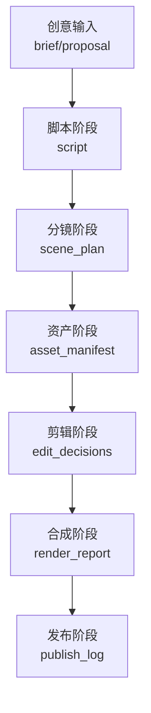
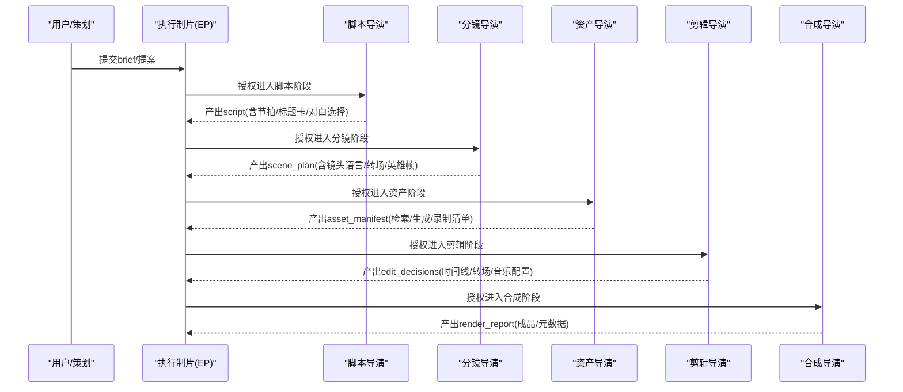
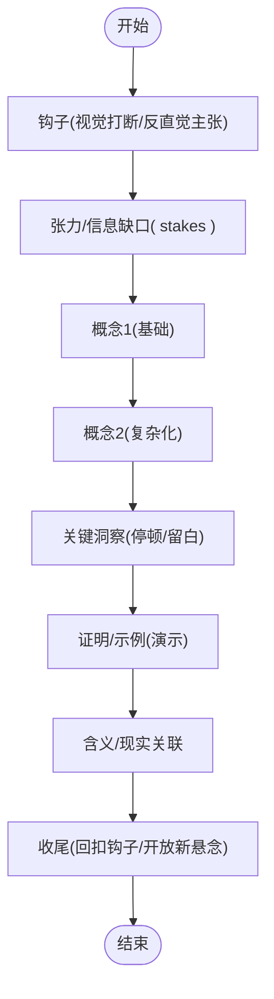
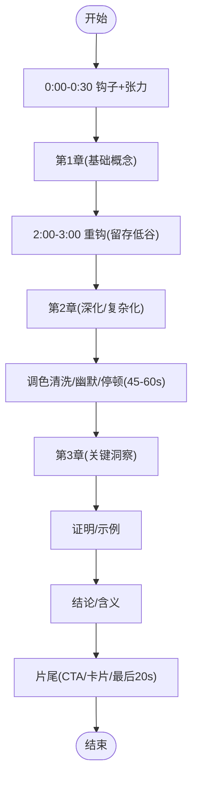
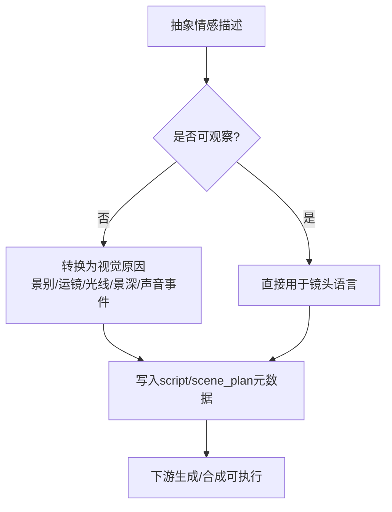
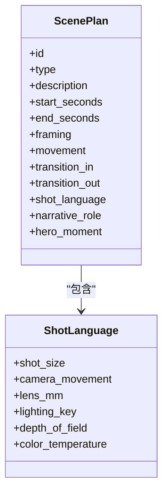
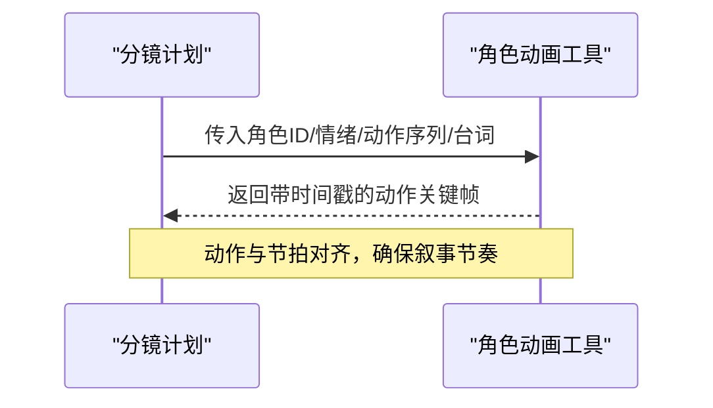
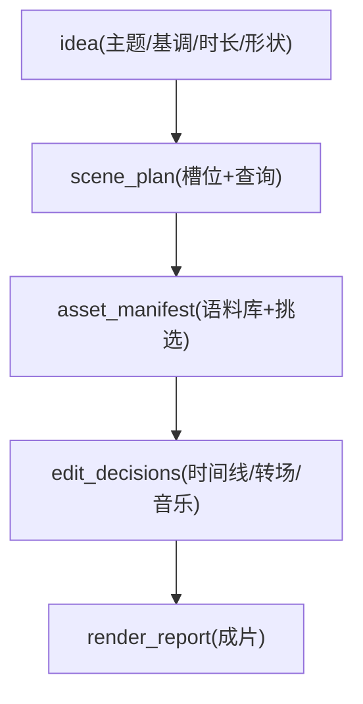
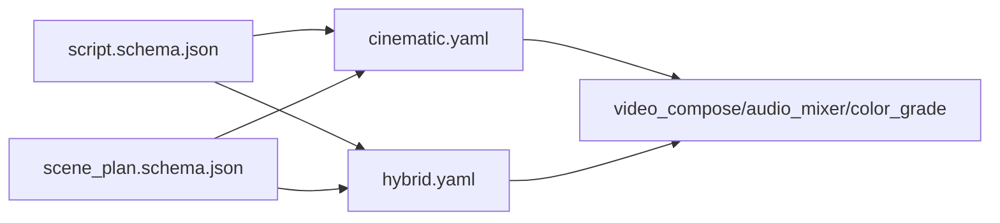

# 故事叙述技能

<cite>
**本文引用的文件**
- [skills/creative/storytelling.md](file://skills/creative/storytelling.md)
- [skills/creative/long-form.md](file://skills/creative/long-form.md)
- [skills/creative/video-gen-prompting.md](file://skills/creative/video-gen-prompting.md)
- [skills/pipelines/documentary-montage/executive-producer.md](file://skills/pipelines/documentary-montage/executive-producer.md)
- [pipeline_defs/documentary-montage.yaml](file://pipeline_defs/documentary-montage.yaml)
- [pipeline_defs/cinematic.yaml](file://pipeline_defs/cinematic.yaml)
- [pipeline_defs/hybrid.yaml](file://pipeline_defs/hybrid.yaml)
- [schemas/artifacts/script.schema.json](file://schemas/artifacts/script.schema.json)
- [schemas/artifacts/scene_plan.schema.json](file://schemas/artifacts/scene_plan.schema.json)
- [skills/pipelines/cinematic/script-director.md](file://skills/pipelines/cinematic/script-director.md)
- [skills/pipelines/cinematic/scene-director.md](file://skills/pipelines/cinematic/scene-director.md)
- [skills/pipelines/hybrid/script-director.md](file://skills/pipelines/hybrid/script-director.md)
- [skills/pipelines/hybrid/scene-director.md](file://skills/pipelines/hybrid/scene-director.md)
- [tools/character/character_animation.py](file://tools/character/character_animation.py)
</cite>

## 目录
1. [引言](#引言)
2. [项目结构](#项目结构)
3. [核心组件](#核心组件)
4. [架构总览](#架构总览)
5. [详细组件分析](#详细组件分析)
6. [依赖关系分析](#依赖关系分析)
7. [性能与节奏考量](#性能与节奏考量)
8. [故障排查指南](#故障排查指南)
9. [结论](#结论)
10. [附录：脚本模板与提示词优化](#附录脚本模板与提示词优化)

## 引言
本技术文档围绕OpenMontage的故事叙述技能，系统化阐述AI驱动的视频故事创作方法论。内容涵盖叙事结构设计、角色塑造技巧、情感弧线构建；重点解释“反主观规则”如何将抽象情感转化为可执行的视觉指令；并覆盖场景规划、镜头语言设计、转场策略、长格式内容的章节划分与高潮设计、结尾处理等。同时提供纪录片式蒙太奇与品牌故事片等不同叙事模式的实践路径，以及可直接复用的脚本模板与提示词优化技巧，帮助创作者产出具有感染力的视频内容。

## 项目结构
OpenMontage将“故事叙述”能力以“管道（Pipeline）+ 导演技能（Director Skills）+ 工件（Artifacts）+ 工具（Tools）”的方式组织：
- 管道定义：通过YAML声明阶段、质量门、所需技能与工具，如 cinematic、hybrid、documentary-montage。
- 导演技能：按阶段拆分职责，例如 idea/script/scene/asset/edit/compose/publish。
- 工件Schema：严格约束 script、scene_plan 等关键产物的结构与字段，确保跨阶段一致性。
- 工具链：检索、生成、合成、混音、调色、字幕等工具在compose/edit阶段被编排调用。

**图表来源**
- [pipeline_defs/cinematic.yaml:60-288](file://pipeline_defs/cinematic.yaml#L60-L288)
- [pipeline_defs/hybrid.yaml:46-228](file://pipeline_defs/hybrid.yaml#L46-L228)
- [pipeline_defs/documentary-montage.yaml:45-179](file://pipeline_defs/documentary-montage.yaml#L45-L179)

**章节来源**
- [pipeline_defs/cinematic.yaml:1-288](file://pipeline_defs/cinematic.yaml#L1-L288)
- [pipeline_defs/hybrid.yaml:1-228](file://pipeline_defs/hybrid.yaml#L1-L228)
- [pipeline_defs/documentary-montage.yaml:1-179](file://pipeline_defs/documentary-montage.yaml#L1-L179)

## 核心组件
- 叙事结构模板与节奏控制
  - 解释型视频“钩子—张力—概念—证明—含义—收尾”的节拍模板，适用于短中时长内容。
  - 长视频采用章节化结构（每章2-4分钟），配合“重钩”“模式中断”“音乐床”“LUFS一致性”等策略维持留存。
- “反主观规则”
  - 禁止使用无法约束像素的情感形容词；必须描述可见的视觉原因（光线、景别、运动、构图、声音事件）。
  - 该规则贯穿脚本与分镜元数据，确保下游生成与合成可执行。
- 镜头语言与转场策略
  - 统一的五要素提示骨架：主体、主体动作、场景、空间、摄影机；明确景别、运镜、焦段、光效、景深、色温。
  - 限制转场词汇表，避免情绪被花哨转场稀释。
- 角色塑造与表演节拍
  - 通过角色动作序列、情绪标签、目标对象与台词，驱动角色动画或口播同步。
- 不同叙事模式
  - 纪录片式蒙太奇：检索优先、真实素材拼接、对位蒙太奇、音乐与色彩统一。
  - 品牌故事片/电影感：情绪驱动、情感弧线、高质量视觉与声音设计。
  - 混合模式：源素材为主，支持层澄清信息、强调要点、适配多画幅。

**章节来源**
- [skills/creative/storytelling.md:7-190](file://skills/creative/storytelling.md#L7-L190)
- [skills/creative/long-form.md:1-240](file://skills/creative/long-form.md#L1-L240)
- [skills/creative/video-gen-prompting.md:28-326](file://skills/creative/video-gen-prompting.md#L28-L326)
- [skills/pipelines/documentary-montage/executive-producer.md:1-90](file://skills/pipelines/documentary-montage/executive-producer.md#L1-L90)
- [tools/character/character_animation.py:421-453](file://tools/character/character_animation.py#L421-L453)

## 架构总览
OpenMontage的故事叙述由“导演技能”串联各阶段，每个阶段产出受Schema约束的工件，并在compose/edit阶段通过工具链完成最终渲染与混音。

**图表来源**
- [pipeline_defs/cinematic.yaml:60-288](file://pipeline_defs/cinematic.yaml#L60-L288)
- [pipeline_defs/hybrid.yaml:46-228](file://pipeline_defs/hybrid.yaml#L46-L228)
- [pipeline_defs/documentary-montage.yaml:45-179](file://pipeline_defs/documentary-montage.yaml#L45-L179)

## 详细组件分析

### 叙事结构与节拍设计（解释型/品牌故事片）
- 解释型视频采用“钩子—张力—概念—证明—含义—收尾”的节拍模板，保证信息密度与学习曲线合理。
- 品牌故事片/电影感作品强调情感弧线（紧张→揭示、惊奇→规模、亲密→回报、紧迫→解决等），并通过标题卡与对白节制使用强化节奏。
- 节拍间用“但是/因此”连接，避免“然后”导致的松散结构。

**图表来源**
- [skills/creative/storytelling.md:7-49](file://skills/creative/storytelling.md#L7-L49)
- [skills/pipelines/cinematic/script-director.md:15-63](file://skills/pipelines/cinematic/script-director.md#L15-L63)

**章节来源**
- [skills/creative/storytelling.md:7-190](file://skills/creative/storytelling.md#L7-L190)
- [skills/pipelines/cinematic/script-director.md:1-63](file://skills/pipelines/cinematic/script-director.md#L1-L63)

### 长格式内容节奏控制（章节/高潮/结尾）
- 章节长度建议2-4分钟，最多5-6章；每章内遵循“开场—展开—转折—收束”。
- 保留“重钩”于2-3分钟处，应对留存低谷；每45-90秒安排一次模式中断（B-roll、文字叠加、视觉切换）。
- 音乐床连续铺底，人声出现时降18-20dB；全片LUFS目标-14，章节间差异<2 LUFS。
- 最后20秒预留片尾屏与信息卡片，不放置关键内容。

**图表来源**
- [skills/creative/long-form.md:91-240](file://skills/creative/long-form.md#L91-L240)

**章节来源**
- [skills/creative/long-form.md:1-240](file://skills/creative/long-form.md#L1-L240)

### “反主观规则”到镜头语言的落地
- 禁止使用“史诗/感人/氛围感”等主观词；改用可见的视觉原因：景别、运镜、光线、景深、材质、声音事件。
- 使用统一五要素提示骨架：主体、主体动作、场景、空间、摄影机；为每个镜头标注意图与叙事角色。
- 在脚本与分镜元数据中显式记录“主体过渡”（揭示/消失/切换/复杂交替）及机制（切、摇、跟、焦点转换等）。

**图表来源**
- [skills/creative/storytelling.md:60-84](file://skills/creative/storytelling.md#L60-L84)
- [skills/creative/video-gen-prompting.md:28-107](file://skills/creative/video-gen-prompting.md#L28-L107)

**章节来源**
- [skills/creative/storytelling.md:60-155](file://skills/creative/storytelling.md#L60-L155)
- [skills/creative/video-gen-prompting.md:28-326](file://skills/creative/video-gen-prompting.md#L28-L326)

### 场景规划与转场策略
- 限制转场词汇表（硬切、淡黑、慢溶解、克制推入/ punch-in），避免情绪被过度转场稀释。
- 明确“英雄帧”（开场、揭示、终帧、标题卡高光时刻）；源素材主导的场景保持画面主体地位。
- 在分镜中记录镜头语言（景别、运镜、焦段、主光、景深、色温）、转场进出、叠加说明与叙事角色。

**图表来源**
- [schemas/artifacts/scene_plan.schema.json:1-118](file://schemas/artifacts/scene_plan.schema.json#L1-L118)
- [skills/pipelines/cinematic/scene-director.md:17-50](file://skills/pipelines/cinematic/scene-director.md#L17-L50)
- [skills/pipelines/hybrid/scene-director.md:17-65](file://skills/pipelines/hybrid/scene-director.md#L17-L65)

**章节来源**
- [skills/pipelines/cinematic/scene-director.md:1-50](file://skills/pipelines/cinematic/scene-director.md#L1-L50)
- [skills/pipelines/hybrid/scene-director.md:1-65](file://skills/pipelines/hybrid/scene-director.md#L1-L65)
- [schemas/artifacts/scene_plan.schema.json:1-118](file://schemas/artifacts/scene_plan.schema.json#L1-L118)

### 角色塑造与表演节拍
- 通过角色动作序列、情绪标签、目标对象与台词，驱动角色动画或口播同步。
- 在分镜中为角色分配动作时序、姿态与缓动，确保表演与叙事节拍一致。

**图表来源**
- [tools/character/character_animation.py:421-453](file://tools/character/character_animation.py#L421-L453)

**章节来源**
- [tools/character/character_animation.py:421-453](file://tools/character/character_animation.py#L421-L453)

### 纪录片式蒙太奇（检索优先、对位蒙太奇）
- 哲学：检索优先、真实素材拼接；意义来自并置（库里肖夫效应、爱森斯坦理性蒙太奇）。
- 阶段：idea → scene_plan → asset_manifest → edit_decisions → render_report。
- 关键规则：扩大检索空间、让并置说话、信任素材、节奏即信息；默认无旁白、无生成片段（除非明确要求）。

**图表来源**
- [pipeline_defs/documentary-montage.yaml:45-179](file://pipeline_defs/documentary-montage.yaml#L45-L179)
- [skills/pipelines/documentary-montage/executive-producer.md:26-90](file://skills/pipelines/documentary-montage/executive-producer.md#L26-L90)

**章节来源**
- [pipeline_defs/documentary-montage.yaml:1-179](file://pipeline_defs/documentary-montage.yaml#L1-L179)
- [skills/pipelines/documentary-montage/executive-producer.md:1-90](file://skills/pipelines/documentary-montage/executive-producer.md#L1-L90)

### 品牌故事片/电影感（情绪驱动、情感弧线）
- 情感弧线：紧张→揭示、惊奇→规模、亲密→回报、紧迫→解决、神秘→行动、静默→爆发。
- 交付承诺：明确motion_led/source_led/hybrid，锁定渲染器家族，音乐计划与质量底线。
- 视觉处理：具体色板、光线方案、摄影语言、纹理、字体克制。

**章节来源**
- [pipeline_defs/cinematic.yaml:1-288](file://pipeline_defs/cinematic.yaml#L1-L288)
- [skills/pipelines/cinematic/proposal-director.md:140-176](file://skills/pipelines/cinematic/proposal-director.md#L140-L176)

### 混合模式（源素材为主，支持层澄清）
- 区分源主导与支持主导的节拍；仅在必要时使用支持层澄清、总结、强调或平台适配。
- 分镜需明确安全区、变体规则、叠加密度上限，避免“覆盖汤”。

**章节来源**
- [pipeline_defs/hybrid.yaml:1-228](file://pipeline_defs/hybrid.yaml#L1-L228)
- [skills/pipelines/hybrid/script-director.md:15-53](file://skills/pipelines/hybrid/script-director.md#L15-L53)
- [skills/pipelines/hybrid/scene-director.md:17-65](file://skills/pipelines/hybrid/scene-director.md#L17-L65)

## 依赖关系分析
- 工件依赖
  - script.schema.json 约束脚本的结构（段落、时间戳、语音表现、增强提示、发音指南、来源引用）。
  - scene_plan.schema.json 约束分镜结构（类型、时间、镜头语言、叙事角色、英雄时刻、角色动作、纹理关键词、必需资产）。
- 管道依赖
  - cinematic/hybrid/documentary-montage 分别定义阶段、所需技能、工具与成功标准，形成端到端流水线。
- 工具依赖
  - compose/edit阶段依赖 video_compose、audio_mixer、color_grade、video_stitch、video_trimmer 等工具进行合成与混音。

**图表来源**
- [schemas/artifacts/script.schema.json:1-105](file://schemas/artifacts/script.schema.json#L1-L105)
- [schemas/artifacts/scene_plan.schema.json:1-118](file://schemas/artifacts/scene_plan.schema.json#L1-L118)
- [pipeline_defs/cinematic.yaml:60-288](file://pipeline_defs/cinematic.yaml#L60-L288)
- [pipeline_defs/hybrid.yaml:46-228](file://pipeline_defs/hybrid.yaml#L46-L228)

**章节来源**
- [schemas/artifacts/script.schema.json:1-105](file://schemas/artifacts/script.schema.json#L1-L105)
- [schemas/artifacts/scene_plan.schema.json:1-118](file://schemas/artifacts/scene_plan.schema.json#L1-L118)
- [pipeline_defs/cinematic.yaml:60-288](file://pipeline_defs/cinematic.yaml#L60-L288)
- [pipeline_defs/hybrid.yaml:46-228](file://pipeline_defs/hybrid.yaml#L46-L228)

## 性能与节奏考量
- 长视频留存管理
  - 首30秒完成钩子与张力；2-3分钟设置重钩；每45-90秒模式中断；最后20秒片尾屏。
  - 目标平均观看时长40-60%；若某段低于30%，需插入模式中断。
- 音频一致性
  - 音乐床持续铺底，人声出现时降18-20dB；全片-14 LUFS，章节间差异<2 LUFS；限制器-1.5 dBTP。
- 视觉节奏
  - 钩子期每3-5秒变化；早期正文每10-15秒；中段稳定至15-25秒；后期交替平静与爆发序列。
  - B-roll占比35-50%；单条B-roll 5-8秒；超过5秒无变化注意力下降。

**章节来源**
- [skills/creative/long-form.md:21-240](file://skills/creative/long-form.md#L21-L240)

## 故障排查指南
- 常见分镜问题
  - 转场过多导致情绪稀释：限制转场词汇表，仅保留必要类型。
  - 源素材被覆盖：确保源主导场景保持画面主体，支持层仅用于澄清与强调。
  - 缺乏英雄帧：明确开场、揭示、终帧与标题卡高光时刻。
- 常见问题定位
  - 若检索结果弱（分数低），扩大语料库并重新搜索；避免按分数顺序排列而非按节拍排列。
  - 若旁白缺失导致“单薄”，先修复剪辑与并置，不要悄悄加旁白掩盖。
- 质量门禁
  - 检查schema有效性、时间线时长匹配、音乐与片尾标签是否按要求呈现。

**章节来源**
- [skills/pipelines/cinematic/scene-director.md:17-50](file://skills/pipelines/cinematic/scene-director.md#L17-L50)
- [skills/pipelines/hybrid/scene-director.md:17-65](file://skills/pipelines/hybrid/scene-director.md#L17-L65)
- [pipeline_defs/documentary-montage.yaml:118-179](file://pipeline_defs/documentary-montage.yaml#L118-L179)

## 结论
OpenMontage通过严格的工件Schema、清晰的导演技能分工与可验证的管道定义，将“故事叙述”从抽象创意转化为可执行的视觉计划。借助“反主观规则”、统一的镜头语言与转场策略，以及针对不同叙事模式（纪录片蒙太奇、品牌故事片、混合模式）的最佳实践，创作者能够高效产出具有感染力与一致性的视频内容。结合长格式节奏控制与音频一致性规范，可在多平台与多画幅下保持稳定品质。

## 附录：脚本模板与提示词优化

### 脚本模板（基于Schema）
- 顶层字段：version、title、total_duration_seconds、voice_performance（performance_intent、pacing_profile、energy_curve、pause_policy、sample_section_id、provider_notes）、sections（id、label、text、start_seconds、end_seconds、speaker_directions、delivery_cues、enhancement_cues、pronunciation_guides、source_ref）、metadata。
- 使用建议：
  - 设定 narration_wpm（约155）以计算准确时长。
  - 为关键洞察设置“silence”节拍；每3-5秒安排视觉变化。
  - 使用“但是/因此”连接段落；考虑“误解优先”方法。

**章节来源**
- [schemas/artifacts/script.schema.json:1-105](file://schemas/artifacts/script.schema.json#L1-L105)
- [skills/creative/storytelling.md:178-190](file://skills/creative/storytelling.md#L178-L190)

### 提示词优化技巧（通用五要素）
- 五要素骨架：Subject、Subject Motion、Scene、Spatial、Camera；更短提示=更多创造力，更长提示=更强控制。
- 模型长度建议：Seedance 2.0（英雄镜头200-400词，插入80-150词）、Wan 2.2（200-400词）、Sora 2/VEO 3.1（100-250词）、LTX-2（≤80词）、Runway Gen-4（≤60词）。
- 避免主观形容词；替换为可见的视觉原因；静态镜头严格无移动/变焦/焦点变化。
- 身份锚定：多镜头重复主体特征；叠加层与场景深度分离；明确主体过渡机制。

**章节来源**
- [skills/creative/video-gen-prompting.md:28-326](file://skills/creative/video-gen-prompting.md#L28-L326)