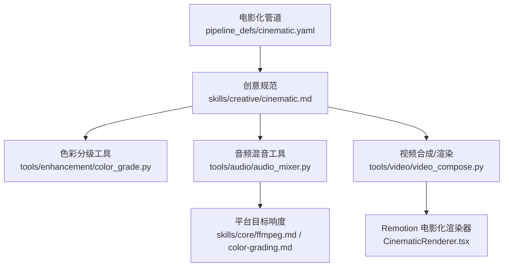
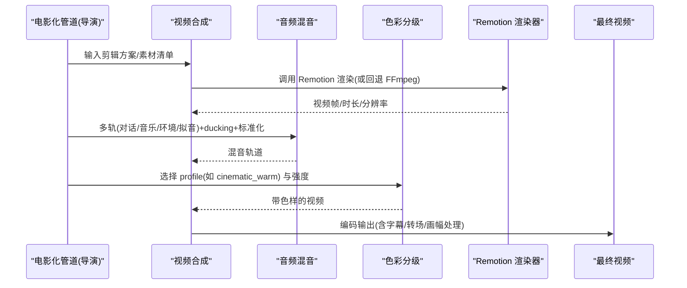
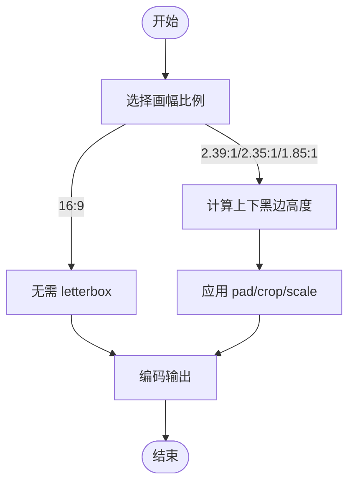
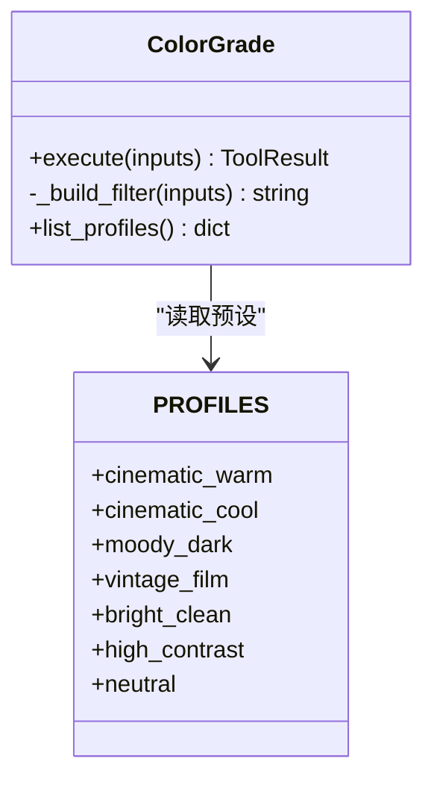
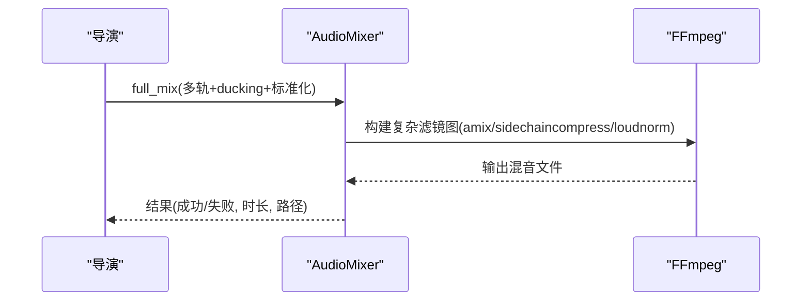
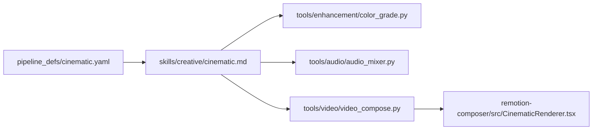

# 电影化制作技能

<cite>
**本文引用的文件**
- [pipeline_defs/cinematic.yaml](file://pipeline_defs/cinematic.yaml)
- [skills/creative/cinematic.md](file://skills/creative/cinematic.md)
- [tools/audio/audio_mixer.py](file://tools/audio/audio_mixer.py)
- [tools/enhancement/color_grade.py](file://tools/enhancement/color_grade.py)
- [skills/core/color-grading.md](file://skills/core/color-grading.md)
- [skills/core/ffmpeg.md](file://skills/core/ffmpeg.md)
- [tools/video/video_compose.py](file://tools/video/video_compose.py)
- [remotion-composer/src/CinematicRenderer.tsx](file://remotion-composer/src/CinematicRenderer.tsx)
- [tests/tools/test_audio_mixer_ducking.py](file://tests/tools/test_audio_mixer_ducking.py)
- [tests/tools/test_audio_mixer_segmented_music.py](file://tests/tools/test_audio_mixer_segmented_music.py)
- [tests/qa/test_04_audio_mix.py](file://tests/qa/test_04_audio_mix.py)
- [tests/tools/test_cinematic_remotion_adapter.py](file://tests/tools/test_cinematic_remotion_adapter.py)
- [skills/creative/music-gen-usage.md](file://skills/creative/music-gen-usage.md)
- [.agents/skills/hyperframes-media/references/bgm.md](file://.agents/skills/hyperframes-media/references/bgm.md)
</cite>

## 目录
1. [简介](#简介)
2. [项目结构](#项目结构)
3. [核心组件](#核心组件)
4. [架构总览](#架构总览)
5. [详细组件分析](#详细组件分析)
6. [依赖关系分析](#依赖关系分析)
7. [性能考量](#性能考量)
8. [故障排查指南](#故障排查指南)
9. [结论](#结论)
10. [附录：端到端工作流示例](#附录端到端工作流示例)

## 简介
本技术文档面向使用 OpenMontage 进行“电影级”视频制作的创作者与工程师，系统阐述从脚本创作到最终输出的完整流程。重点覆盖：
- 画幅比例选择与实现（2.39:1、2.35:1、1.85:1）
- 镜头时长控制与节奏编排（平均 4–8 秒）
- 电影化色彩分级（cinematic_warm、cinematic_cool、moody_dark 等）
- 音频分层与混音（对话、音乐、环境音、拟音），含侧链降噪（ducking）
- 真正的电影感落地：FFmpeg letterbox、24fps 渲染意图、动态音乐生成与混音
- 可复用的工作流与最佳实践

## 项目结构
OpenMontage 将“电影化”能力以“管道 + 工具 + 技能”的方式组织：
- 管道定义：pipeline_defs/cinematic.yaml 定义了电影化管道的阶段、产物、检查点与审核要点
- 创意技能：skills/creative/cinematic.md 提供电影化参数速查、画幅/时长/节奏/色彩/音频规范
- 工具层：audio_mixer、color_grade、video_compose 等工具封装 FFmpeg/Remotion 能力
- 渲染器：remotion-composer/src/CinematicRenderer.tsx 提供 Remotion 电影化渲染入口
- 测试与验证：tests 下包含音频混音、Remotion 适配等用例

图表来源
- [pipeline_defs/cinematic.yaml:1-288](file://pipeline_defs/cinematic.yaml#L1-L288)
- [skills/creative/cinematic.md:1-146](file://skills/creative/cinematic.md#L1-L146)
- [tools/enhancement/color_grade.py:24-75](file://tools/enhancement/color_grade.py#L24-L75)
- [tools/audio/audio_mixer.py:26-43](file://tools/audio/audio_mixer.py#L26-L43)
- [tools/video/video_compose.py:209-232](file://tools/video/video_compose.py#L209-L232)
- [remotion-composer/src/CinematicRenderer.tsx:1-38](file://remotion-composer/src/CinematicRenderer.tsx#L1-L38)

章节来源
- [pipeline_defs/cinematic.yaml:1-288](file://pipeline_defs/cinematic.yaml#L1-L288)
- [skills/creative/cinematic.md:1-146](file://skills/creative/cinematic.md#L1-L146)

## 核心组件
- 电影化管道（Pipeline）：以“研究→提案→脚本→场景计划→资产→剪辑→合成→发布”的阶段化流程组织生产，强调情绪导向、质量门禁与元数据治理
- 色彩分级（Color Grade）：内置 cinematic_warm、cinematic_cool、moody_dark 等预设，支持 LUT 与强度混合
- 音频混音（Audio Mixer）：支持多轨混音、侧链压缩（ducking）、淡入淡出、标准化（loudnorm）、分段音乐注入
- 视频合成/渲染（Video Compose）：优先 Remotion 渲染（适合混合内容），回退至 FFmpeg；支持字幕、转场、编码
- 电影化渲染器（Cinematic Renderer）：Remotion 中的电影化主题与叠加层，配合字体、渐变、时间轴控制

章节来源
- [pipeline_defs/cinematic.yaml:60-288](file://pipeline_defs/cinematic.yaml#L60-L288)
- [tools/enhancement/color_grade.py:78-124](file://tools/enhancement/color_grade.py#L78-L124)
- [tools/audio/audio_mixer.py:26-43](file://tools/audio/audio_mixer.py#L26-L43)
- [tools/video/video_compose.py:209-232](file://tools/video/video_compose.py#L209-L232)
- [remotion-composer/src/CinematicRenderer.tsx:1-38](file://remotion-composer/src/CinematicRenderer.tsx#L1-L38)

## 架构总览
电影化制作在 OpenMontage 中由“导演型技能 + 工具链 + 渲染器”协同完成：
- 导演技能负责策略与决策（如节奏、色彩、音乐风格）
- 工具链负责执行（FFmpeg/Remotion 的滤镜、混音、编码）
- 渲染器负责最终画面与动效（Remotion 电影化主题）

图表来源
- [pipeline_defs/cinematic.yaml:229-266](file://pipeline_defs/cinematic.yaml#L229-L266)
- [tools/video/video_compose.py:1375-1395](file://tools/video/video_compose.py#L1375-L1395)
- [tools/audio/audio_mixer.py:479-667](file://tools/audio/audio_mixer.py#L479-L667)
- [tools/enhancement/color_grade.py:134-179](file://tools/enhancement/color_grade.py#L134-L179)
- [remotion-composer/src/CinematicRenderer.tsx:1-38](file://remotion-composer/src/CinematicRenderer.tsx#L1-L38)

## 详细组件分析

### 画幅比例与 Letterbox 实现
- 推荐画幅：2.39:1（宽银幕电影感）、2.35:1（Scope）、1.85:1（轻度电影感）、16:9（默认）
- 通过 FFmpeg 的 pad/crop/scale 组合实现上下黑边（letterbox），或在原生比例下填充
- 规则：仅在内容真正受益于电影构图时使用 letterbox，避免浪费像素

图表来源
- [skills/creative/cinematic.md:34-53](file://skills/creative/cinematic.md#L34-L53)

章节来源
- [skills/creative/cinematic.md:34-53](file://skills/creative/cinematic.md#L34-L53)

### 镜头时长与节奏编排
- 标准电影化平均镜头时长：4–8 秒
- 节奏遵循“呼吸式”变化：长→中→短→短→长→中，避免连续相同长度造成单调
- 剪辑优先级（Murch 规则）：情感 > 故事 > 节奏 > 视线引导 > 平面地理 > 空间连续性

章节来源
- [skills/creative/cinematic.md:55-87](file://skills/creative/cinematic.md#L55-L87)

### 电影化色彩分级
- 内置 profile：
  - cinematic_warm：暖调电影感，提亮阴影、橙色高光
  - cinematic_cool：青橙好莱坞经典
  - moody_dark：压暗黑色、降低饱和度，营造阴郁氛围
  - vintage_film：复古胶片感
  - bright_clean/high_contrast/neutral：其他风格
- 支持外部 .cube LUT 与强度混合（intensity 0–1）
- 建议顺序：normalize → colortemperature → colorbalance → curves → eq → lut3d

图表来源
- [tools/enhancement/color_grade.py:24-75](file://tools/enhancement/color_grade.py#L24-L75)
- [tools/enhancement/color_grade.py:78-124](file://tools/enhancement/color_grade.py#L78-L124)
- [tools/enhancement/color_grade.py:134-179](file://tools/enhancement/color_grade.py#L134-L179)

章节来源
- [tools/enhancement/color_grade.py:24-75](file://tools/enhancement/color_grade.py#L24-L75)
- [skills/core/color-grading.md:1-79](file://skills/core/color-grading.md#L1-L79)

### 音频分层与混音（对话/音乐/环境音/拟音）
- 四层结构：对话（主）、音乐（背景）、环境音（房间底噪/环境声）、拟音/SFX（动作细节）
- Ducking（侧链压缩）：当对话出现时自动压低音乐音量，避免掩蔽
- 标准化：按平台目标响度（如 -14 LUFS）进行 loudnorm
- 分段音乐：在指定时间段内注入背景音乐，边界平滑淡入淡出

图表来源
- [tools/audio/audio_mixer.py:479-667](file://tools/audio/audio_mixer.py#L479-L667)
- [tests/qa/test_04_audio_mix.py:41-112](file://tests/qa/test_04_audio_mix.py#L41-L112)

章节来源
- [tools/audio/audio_mixer.py:26-43](file://tools/audio/audio_mixer.py#L26-L43)
- [tools/audio/audio_mixer.py:589-614](file://tools/audio/audio_mixer.py#L589-L614)
- [tests/tools/test_audio_mixer_ducking.py:44-89](file://tests/tools/test_audio_mixer_ducking.py#L44-L89)
- [tests/tools/test_audio_mixer_segmented_music.py:1-43](file://tests/tools/test_audio_mixer_segmented_music.py#L1-L43)
- [tests/qa/test_04_audio_mix.py:41-112](file://tests/qa/test_04_audio_mix.py#L41-L112)

### 动态音乐生成与 BPM 选择
- 根据视频类型选择 BPM 范围与提示词（如史诗/戏剧揭示用 60–80 BPM）
- 始终设置 force_instrumental=true，避免歌词干扰对白
- 时长匹配：按需生成精确时长，便于与视频对齐

章节来源
- [skills/creative/music-gen-usage.md:1-87](file://skills/creative/music-gen-usage.md#L1-L87)
- [.agents/skills/hyperframes-media/references/bgm.md:45-56](file://.agents/skills/hyperframes-media/references/bgm.md#L45-L56)

### 24fps 渲染与 Remotion 电影化
- 电影化通常采用 24fps 渲染意图；Remotion 内部默认 FPS 为 30，可通过配置调整
- 视频合成优先使用 Remotion 渲染（混合内容更灵活），不可用时回退 FFmpeg
- 测试覆盖了超时随场景数缩放、保留直接电影化场景等关键行为

章节来源
- [remotion-composer/src/CinematicRenderer.tsx:1-38](file://remotion-composer/src/CinematicRenderer.tsx#L1-L38)
- [tools/video/video_compose.py:1375-1395](file://tools/video/video_compose.py#L1375-L1395)
- [tests/tools/test_cinematic_remotion_adapter.py:120-177](file://tests/tools/test_cinematic_remotion_adapter.py#L120-L177)

## 依赖关系分析
- 管道依赖：导演技能、研究/提案/脚本/场景/资产/剪辑/合成/发布各阶段
- 工具依赖：
  - audio_mixer 依赖 FFmpeg（可选 pydub）
  - color_grade 依赖 FFmpeg
  - video_compose 优先 Remotion，回退 FFmpeg
- 外部资源：音乐生成 API、LUT 文件、字体等

图表来源
- [pipeline_defs/cinematic.yaml:1-288](file://pipeline_defs/cinematic.yaml#L1-L288)
- [skills/creative/cinematic.md:1-146](file://skills/creative/cinematic.md#L1-L146)
- [tools/enhancement/color_grade.py:78-124](file://tools/enhancement/color_grade.py#L78-L124)
- [tools/audio/audio_mixer.py:26-43](file://tools/audio/audio_mixer.py#L26-L43)
- [tools/video/video_compose.py:209-232](file://tools/video/video_compose.py#L209-L232)
- [remotion-composer/src/CinematicRenderer.tsx:1-38](file://remotion-composer/src/CinematicRenderer.tsx#L1-L38)

章节来源
- [pipeline_defs/cinematic.yaml:38-50](file://pipeline_defs/cinematic.yaml#L38-L50)
- [tools/audio/audio_mixer.py:36-43](file://tools/audio/audio_mixer.py#L36-L43)
- [tools/enhancement/color_grade.py:88-90](file://tools/enhancement/color_grade.py#L88-L90)
- [tools/video/video_compose.py:234-232](file://tools/video/video_compose.py#L234-L232)

## 性能考量
- 混音复杂度：full_mix 会构建复杂滤镜图（amix、sidechaincompress、loudnorm），注意 CPU 占用与时长
- 分段音乐：volume 表达式逐帧计算，需关注性能与精度
- 渲染超时：Remotion 渲染超时随场景数量增长而扩展
- 编码质量：CRF 与码率影响文件大小与质量，最终交付建议使用较低 CRF（如 18–20）

章节来源
- [tools/audio/audio_mixer.py:479-667](file://tools/audio/audio_mixer.py#L479-L667)
- [tools/audio/audio_mixer.py:669-776](file://tools/audio/audio_mixer.py#L669-L776)
- [tests/tools/test_cinematic_remotion_adapter.py:120-177](file://tests/tools/test_cinematic_remotion_adapter.py#L120-L177)
- [skills/core/ffmpeg.md:42-47](file://skills/core/ffmpeg.md#L42-L47)

## 故障排查指南
- 音频混音问题：
  - ducking 不生效：检查 sidechaincompress 参数与 speech key 是否正确
  - 分段音乐导致对白衰减：确保 amix 的 normalize=0，避免全局减半
  - 平台响度不符：核对 loudnorm_target（如 -14 LUFS）
- 色彩分级问题：
  - 肤色异常：检查 curves 与 colorbalance，确保肤色线落在矢量示波器的肤色线上
  - 过度处理：降低 intensity 或使用 neutral 基准对比
- 渲染问题：
  - Remotion 不可用：确认 npx/Node 环境与 composer 项目可用
  - 超时：增加超时或减少场景数量

章节来源
- [tests/tools/test_audio_mixer_segmented_music.py:1-43](file://tests/tools/test_audio_mixer_segmented_music.py#L1-L43)
- [tests/qa/test_04_audio_mix.py:41-112](file://tests/qa/test_04_audio_mix.py#L41-L112)
- [skills/core/color-grading.md:18-45](file://skills/core/color-grading.md#L18-L45)
- [tools/video/video_compose.py:1375-1395](file://tools/video/video_compose.py#L1375-L1395)

## 结论
OpenMontage 的电影化制作能力以“管道驱动 + 工具封装 + 渲染器主题”为核心，提供了从画幅、时长、节奏到色彩与音频的全链路解决方案。通过内置 profile、侧链压缩、标准化与 Remotion 渲染，能够在自动化流程中稳定产出具有电影感的作品。建议在真实项目中结合具体素材与平台目标，选择合适的画幅、BPM、profile 与响度目标，并通过测试与人工审核保障质量。

## 附录：端到端工作流示例
以下示例展示从脚本到输出的关键步骤与参数建议：
- 画幅：选择 2.39:1 并应用 letterbox（pad/crop/scale）
- 帧率：设定 24fps 渲染意图（Remotion 配置或 FFmpeg 输出）
- 镜头时长：平均 4–8 秒，节奏变化避免单调
- 色彩：使用 cinematic_warm 或 cinematic_cool，强度 0.7–0.85
- 音频：
  - 四层混音（对话/音乐/环境/拟音）
  - Ducking：speech 作为 key，压低音乐
  - 标准化：-14 LUFS（YouTube/TikTok/IG）
  - 分段音乐：只在需要处注入，边界淡入淡出
- 音乐生成：按类型选择 BPM（如 60–90 BPM 的管弦/氛围），force_instrumental=true
- 合成与发布：Remotion 优先，回退 FFmpeg；最终编码 CRF 18–20

章节来源
- [pipeline_defs/cinematic.yaml:229-266](file://pipeline_defs/cinematic.yaml#L229-L266)
- [skills/creative/cinematic.md:8-19](file://skills/creative/cinematic.md#L8-L19)
- [skills/creative/cinematic.md:34-53](file://skills/creative/cinematic.md#L34-L53)
- [skills/creative/cinematic.md:55-87](file://skills/creative/cinematic.md#L55-L87)
- [skills/creative/cinematic.md:89-146](file://skills/creative/cinematic.md#L89-L146)
- [tools/audio/audio_mixer.py:479-667](file://tools/audio/audio_mixer.py#L479-L667)
- [tools/enhancement/color_grade.py:24-75](file://tools/enhancement/color_grade.py#L24-L75)
- [skills/core/ffmpeg.md:56-77](file://skills/core/ffmpeg.md#L56-L77)
- [skills/creative/music-gen-usage.md:17-87](file://skills/creative/music-gen-usage.md#L17-L87)