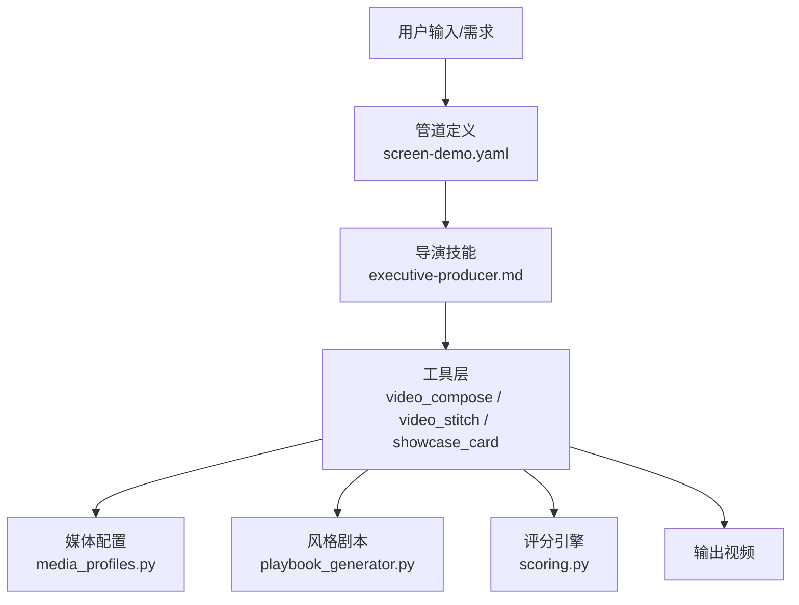
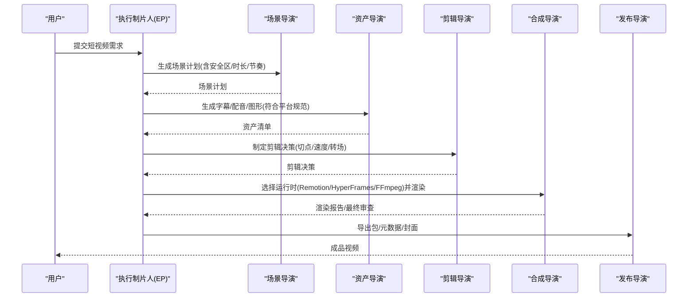
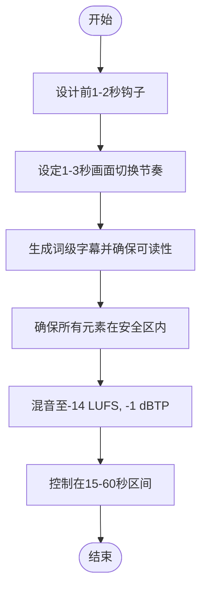
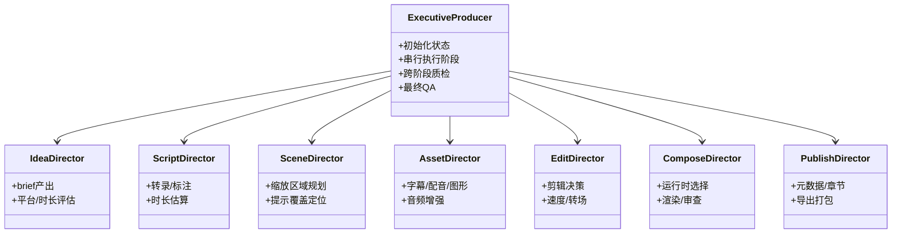
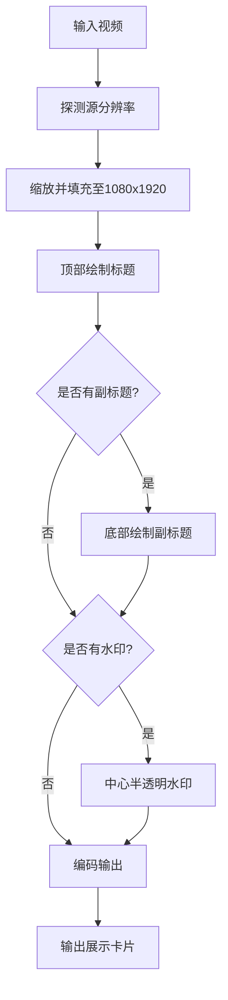
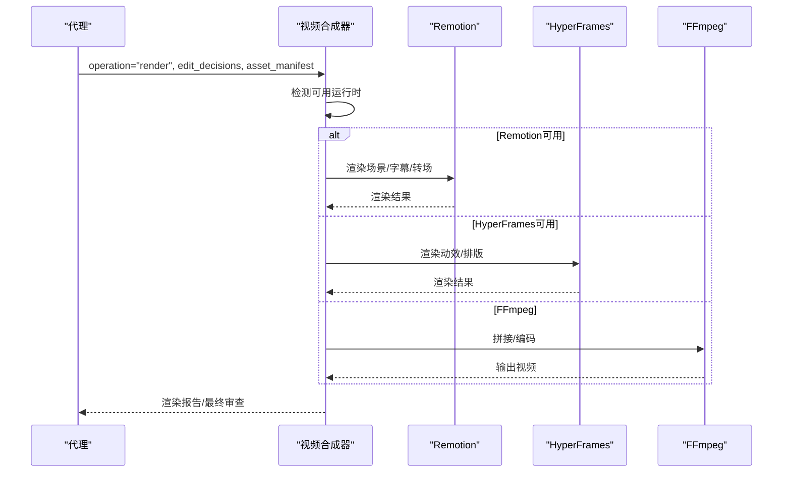
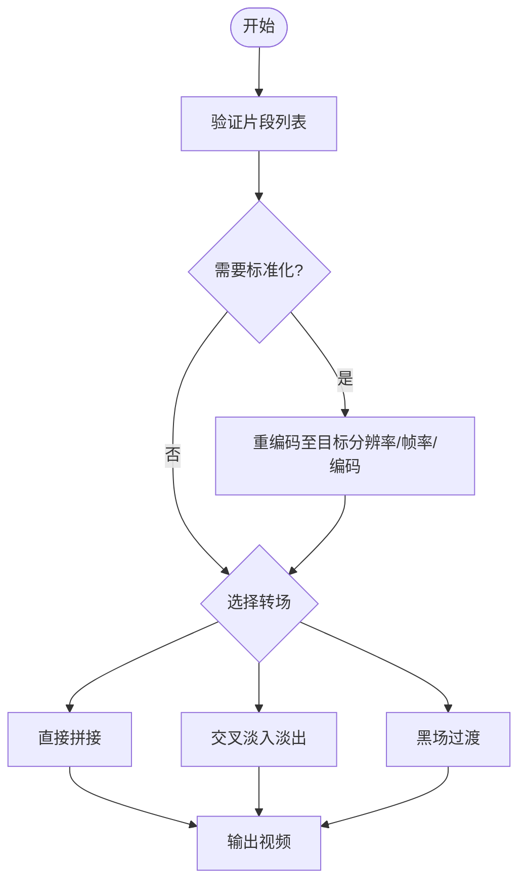
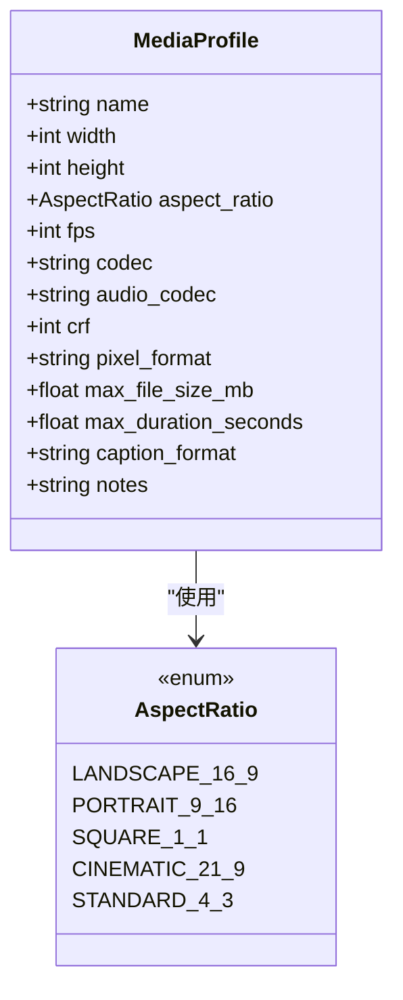
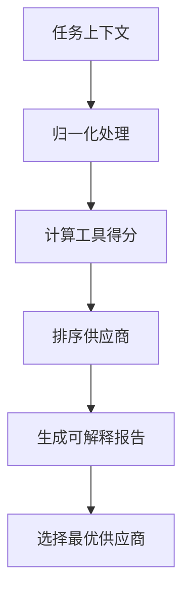
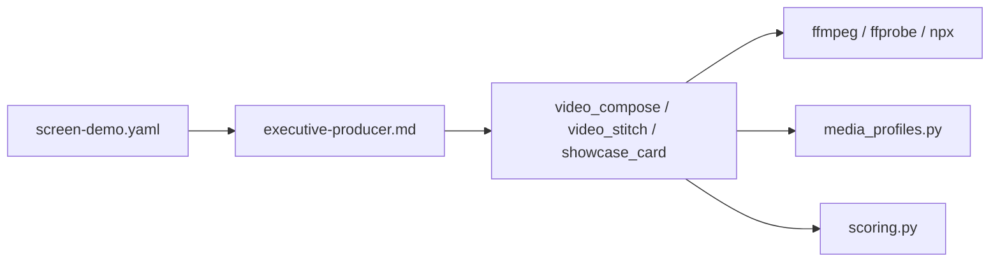

# 短视频制作技能

<cite>
**本文引用的文件**
- [README.md](file://README.md)
- [short-form.md](file://skills/creative/short-form.md)
- [screen-demo.yaml](file://pipeline_defs/screen-demo.yaml)
- [executive-producer.md](file://skills/pipelines/screen-demo/executive-producer.md)
- [showcase_card.py](file://tools/video/showcase_card.py)
- [video_compose.py](file://tools/video/video_compose.py)
- [video_stitch.py](file://tools/video/video_stitch.py)
- [media_profiles.py](file://lib/media_profiles.py)
- [scoring.py](file://lib/scoring.py)
- [playbook_generator.py](file://lib/playbook_generator.py)
</cite>

## 目录
1. [简介](#简介)
2. [项目结构](#项目结构)
3. [核心组件](#核心组件)
4. [架构总览](#架构总览)
5. [详细组件分析](#详细组件分析)
6. [依赖关系分析](#依赖关系分析)
7. [性能与质量保障](#性能与质量保障)
8. [故障排查指南](#故障排查指南)
9. [结论](#结论)
10. [附录](#附录)

## 简介
本技术文档面向“短视频制作技能”，聚焦抖音、TikTok、Instagram Reels、YouTube Shorts等平台的适配与优化。内容涵盖黄金时长控制（15-60秒）、开头钩子设计、快节奏剪辑技巧；展示卡片、屏幕演示、产品宣传等常见类型；平台特定的格式优化（竖屏构图、安全区域、字幕样式）；以及自动化批量生成、A/B测试优化、性能监控等高级能力。OpenMontage通过多工具编排、评分选择器、风格剧本与平台输出配置，提供端到端短视频生产流水线。

## 项目结构
OpenMontage以“管道+技能+工具”的三层知识体系组织：
- 管道定义：YAML描述阶段、工具、评审标准与成功条件
- 技能说明：Markdown指导AI代理如何执行各阶段
- 工具实现：Python封装FFmpeg/Remotion/HyperFrames等平台能力
- 媒体配置：平台分辨率、码率、编码等输出规范
- 评分系统：多维度加权选择最佳供应商与路径
- 风格剧本：可定制视觉语言与质量控制规则

图表来源
- [screen-demo.yaml:1-247](file://pipeline_defs/screen-demo.yaml#L1-L247)
- [executive-producer.md:1-278](file://skills/pipelines/screen-demo/executive-producer.md#L1-L278)
- [video_compose.py:1-800](file://tools/video/video_compose.py#L1-L800)
- [video_stitch.py:1-800](file://tools/video/video_stitch.py#L1-L800)
- [showcase_card.py:1-227](file://tools/video/showcase_card.py#L1-L227)
- [media_profiles.py:1-166](file://lib/media_profiles.py#L1-L166)
- [playbook_generator.py:1-226](file://lib/playbook_generator.py#L1-L226)
- [scoring.py:1-557](file://lib/scoring.py#L1-L557)

章节来源
- [README.md:356-475](file://README.md#L356-L475)

## 核心组件
- 短视频创作技能：提供平台安全区、时长策略、钩子技巧、节奏与字幕规范
- 屏幕演示管道：从真实录制或合成终端动画到最终渲染的全流程
- 展示卡片工具：将任意视频封装为9:16展示卡，叠加标题/副标题/水印
- 视频合成器：支持Remotion/HyperFrames/FFmpeg三种运行时，按提案锁定
- 视频拼接器：顺序拼接、交叉淡入淡出、空间布局（分屏/画中画）
- 媒体配置文件：平台化分辨率、帧率、编码、文件大小限制
- 评分引擎：任务匹配、质量、可控性、可靠性、成本、延迟、连续性加权
- 风格剧本生成：基于上下文自动生成或继承现有风格，统一视觉与音频规则

章节来源
- [short-form.md:1-206](file://skills/creative/short-form.md#L1-L206)
- [screen-demo.yaml:1-247](file://pipeline_defs/screen-demo.yaml#L1-L247)
- [showcase_card.py:1-227](file://tools/video/showcase_card.py#L1-L227)
- [video_compose.py:1-800](file://tools/video/video_compose.py#L1-L800)
- [video_stitch.py:1-800](file://tools/video/video_stitch.py#L1-L800)
- [media_profiles.py:1-166](file://lib/media_profiles.py#L1-L166)
- [scoring.py:1-557](file://lib/scoring.py#L1-L557)
- [playbook_generator.py:1-226](file://lib/playbook_generator.py#L1-L226)

## 架构总览
OpenMontage采用“代理驱动”的流水线架构：代理读取管道清单与导演技能，调用工具完成素材生成、编辑、合成与发布，并在关键节点进行自我审查与人类审批。

图表来源
- [screen-demo.yaml:77-247](file://pipeline_defs/screen-demo.yaml#L77-L247)
- [executive-producer.md:67-137](file://skills/pipelines/screen-demo/executive-producer.md#L67-L137)
- [video_compose.py:1-800](file://tools/video/video_compose.py#L1-L800)

## 详细组件分析

### 短视频创作技能（TikTok/Reels/Shorts）
- 黄金时长：15秒最高完成率、30秒最佳互动、60秒最灵活
- 开头钩子：首帧即有视觉/文本兴趣点，避免空白片头与Logo
- 节奏：每1-3秒变化一次画面，每分钟20-40次切镜
- 字幕：必须开启，词级高亮提升留存；字体≥42px、加粗无衬线
- 安全区：通用安全区900x1400居中，底部UI遮挡需避开
- 音频：目标-14 LUFS，真峰值-1 dBTP；音乐BPM根据内容类型调整

图表来源
- [short-form.md:7-19](file://skills/creative/short-form.md#L7-L19)
- [short-form.md:21-41](file://skills/creative/short-form.md#L21-L41)
- [short-form.md:43-58](file://skills/creative/short-form.md#L43-L58)
- [short-form.md:59-119](file://skills/creative/short-form.md#L59-L119)
- [short-form.md:120-163](file://skills/creative/short-form.md#L120-L163)
- [short-form.md:165-206](file://skills/creative/short-form.md#L165-L206)

章节来源
- [short-form.md:1-206](file://skills/creative/short-form.md#L1-L206)

### 屏幕演示管道（Screen Demo）
- 两种模式：真实录制（桌面/浏览器）与合成终端动画（Remotion TerminalScene）
- 阶段：创意→脚本→场景计划→资产→剪辑→合成→发布
- 关键检查：UI文字可读性、缩放裁剪可行性、死时间处理、字幕位置、音频降噪
- 预算与时限：默认$1预算，最多10分钟墙钟时间

图表来源
- [screen-demo.yaml:1-247](file://pipeline_defs/screen-demo.yaml#L1-L247)
- [executive-producer.md:1-278](file://skills/pipelines/screen-demo/executive-producer.md#L1-L278)

章节来源
- [screen-demo.yaml:1-247](file://pipeline_defs/screen-demo.yaml#L1-L247)
- [executive-producer.md:1-278](file://skills/pipelines/screen-demo/executive-producer.md#L1-L278)

### 展示卡片工具（Showcase Card）
- 功能：将源视频适配为9:16卡片，顶部标题、底部副标题、暗色背景、可选水印
- 适用：Instagram Reels/TikTok展示片段
- 参数：输出尺寸、背景色、字体大小、颜色、水印文本

图表来源
- [showcase_card.py:1-227](file://tools/video/showcase_card.py#L1-L227)

章节来源
- [showcase_card.py:1-227](file://tools/video/showcase_card.py#L1-L227)

### 视频合成器（Video Compose）
- 运行时：Remotion（React场景/词级字幕/动效）、HyperFrames（HTML/CSS/GSAP）、FFmpeg（纯视频拼接）
- 治理：运行时在提案阶段锁定，禁止静默替换
- 能力：compose/render/remotion_render/burn_subtitles/overlay/encode
- 字幕样式：优先级解析（显式>编辑决策>剧本>默认）

图表来源
- [video_compose.py:1-800](file://tools/video/video_compose.py#L1-L800)

章节来源
- [video_compose.py:1-800](file://tools/video/video_compose.py#L1-L800)

### 视频拼接器（Video Stitch）
- 操作：validate/stitch/preview_stitch/spatial
- 转场：cut/crossfade/fade-through-black
- 空间布局：side_by_side/vertical_stack/picture_in_picture
- 自动标准化：当属性不一致时重编码至共同格式

图表来源
- [video_stitch.py:1-800](file://tools/video/video_stitch.py#L1-L800)

章节来源
- [video_stitch.py:1-800](file://tools/video/video_stitch.py#L1-L800)

### 媒体配置文件（Media Profiles）
- 平台预设：YouTube横屏/4K/Shorts、Instagram Reels/Feed、TikTok、LinkedIn、Cinematic
- 字段：名称、宽高、纵横比、帧率、编码、音频编码、CRF、像素格式、最大文件大小/时长
- 辅助函数：按名称获取配置、按平台前缀筛选、生成FFmpeg输出参数

图表来源
- [media_profiles.py:1-166](file://lib/media_profiles.py#L1-L166)

章节来源
- [media_profiles.py:1-166](file://lib/media_profiles.py#L1-L166)

### 评分引擎（Scoring Engine）
- 维度：任务匹配(30%)、输出质量(20%)、可控性(15%)、可靠性(15%)、成本效率(10%)、延迟(5%)、连续性(5%)
- 用途：为每个工具/供应商打分并排序，解释选择理由
- 上下文归一化：从松散提示中提取意图、风格关键词、预算、是否需运动等

图表来源
- [scoring.py:1-557](file://lib/scoring.py#L1-L557)

章节来源
- [scoring.py:1-557](file://lib/scoring.py#L1-L557)

### 风格剧本生成（Playbook Generator）
- 功能：基于上下文生成或继承现有风格剧本，统一色彩、字体、动效、音频与质量规则
- 保存：校验Schema后写入自定义样式目录
- 适用：当预设风格不匹配时快速定制

章节来源
- [playbook_generator.py:1-226](file://lib/playbook_generator.py#L1-L226)

## 依赖关系分析
- 管道依赖技能：screen-demo.yaml声明所需导演技能与元技能
- 技能依赖工具：executive-producer.md指导调用video_compose/video_stitch等
- 工具依赖外部命令：FFmpeg/ffprobe/npx/Node.js
- 配置依赖：media_profiles.py提供平台输出参数
- 治理依赖：scoring.py用于供应商选择与路径评估

图表来源
- [screen-demo.yaml:57-69](file://pipeline_defs/screen-demo.yaml#L57-L69)
- [executive-producer.md:22-31](file://skills/pipelines/screen-demo/executive-producer.md#L22-L31)
- [video_compose.py:68-71](file://tools/video/video_compose.py#L68-L71)
- [video_stitch.py:39-46](file://tools/video/video_stitch.py#L39-L46)
- [showcase_card.py:36-38](file://tools/video/showcase_card.py#L36-L38)
- [media_profiles.py:1-166](file://lib/media_profiles.py#L1-L166)
- [scoring.py:1-557](file://lib/scoring.py#L1-L557)

章节来源
- [screen-demo.yaml:57-69](file://pipeline_defs/screen-demo.yaml#L57-L69)
- [executive-producer.md:22-31](file://skills/pipelines/screen-demo/executive-producer.md#L22-L31)

## 性能与质量保障
- 预合成校验：阻止违反交付承诺的计划，防止幻灯片风险
- 后渲染自检：ffprobe验证、帧采样、音频分析、字幕检查
- 滑动风险评分：六维分析防止“动画PPT”输出
- 供应商评分：七维加权选择，记录替代方案与理由
- 预算治理：预估/预留/对账，可配置阈值与硬上限
- 运行时治理：提案阶段锁定render_runtime，禁止静默替换

章节来源
- [README.md:652-686](file://README.md#L652-L686)
- [video_compose.py:26-28](file://tools/video/video_compose.py#L26-L28)
- [scoring.py:373-557](file://lib/scoring.py#L373-L557)

## 故障排查指南
- 运行时不可用：检查npx/Node.js/Remotion项目/node_modules或HyperFrames环境
- 片段属性不一致：启用auto_normalize或手动标准化分辨率/帧率/编码
- 字幕烧录失败：确认ASS样式与路径正确，必要时降级为copy模式
- 音频缺失：为无声片段注入静音轨道后再拼接
- 文本不可读：回放输出视频，调整缩放裁剪与字幕位置
- 预算超支：检查每阶段花费，降低昂贵步骤或切换更经济供应商

章节来源
- [video_compose.py:234-335](file://tools/video/video_compose.py#L234-L335)
- [video_stitch.py:412-475](file://tools/video/video_stitch.py#L412-L475)
- [executive-producer.md:139-217](file://skills/pipelines/screen-demo/executive-producer.md#L139-L217)

## 结论
OpenMontage将短视频制作的创意与工程解耦：创意由技能与剧本引导，工程由工具与管道执行。通过平台化输出配置、严格的质量门控与透明的评分机制，系统能在保证质量的前提下高效批量生产短视频。结合钩子设计、节奏控制与安全区规范，可显著提升完播率与算法推荐权重。

## 附录
- 平台输出建议：优先使用内置媒体配置文件，确保分辨率、帧率、编码符合平台要求
- 短视频模板：参考15/30/60秒结构模板，明确钩子、内容、结果与CTA
- 病毒式传播要素：强钩子、高频视觉变化、情感共鸣文案、趋势音乐与字幕高亮
- A/B测试优化：同一主题生成多版本钩子/时长/字幕样式，对比完播率与互动指标
- 性能监控：记录每阶段耗时与成本，分析瓶颈并优化供应商选择