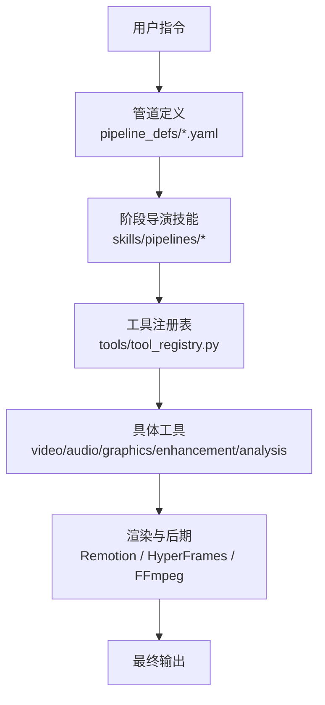
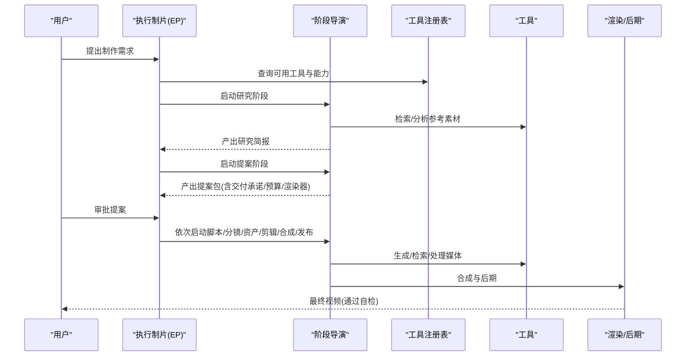
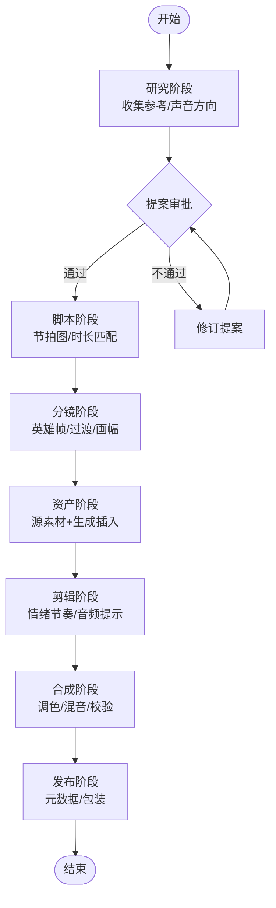
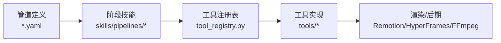

# 视频制作技能

<cite>
**本文引用的文件**
- [README.md](file://README.md)
- [skills/INDEX.md](file://skills/INDEX.md)
- [pipeline_defs/cinematic.yaml](file://pipeline_defs/cinematic.yaml)
- [pipeline_defs/documentary-montage.yaml](file://pipeline_defs/documentary-montage.yaml)
- [skills/creative/long-form.md](file://skills/creative/long-form.md)
- [skills/creative/short-form.md](file://skills/creative/short-form.md)
- [skills/creative/cinematic.md](file://skills/creative/cinematic.md)
- [skills/creative/video-editing.md](file://skills/creative/video-editing.md)
- [skills/pipelines/cinematic/executive-producer.md](file://skills/pipelines/cinematic/executive-producer.md)
- [tools/tool_registry.py](file://tools/tool_registry.py)
</cite>

## 目录
1. [简介](#简介)
2. [项目结构](#项目结构)
3. [核心组件](#核心组件)
4. [架构总览](#架构总览)
5. [详细组件分析](#详细组件分析)
6. [依赖分析](#依赖分析)
7. [性能与质量保障](#性能与质量保障)
8. [故障排查指南](#故障排查指南)
9. [结论](#结论)
10. [附录：工作流示例与最佳实践](#附录工作流示例与最佳实践)

## 简介
本技术文档面向使用 OpenMontage 进行电影化制作、故事叙述与视频编辑的创作者与工程师，系统阐述长视频与短视频的制作流程，覆盖脚本创作、场景规划、镜头设计、剪辑技巧、转场与节奏控制、风格指导与 AI 工具优化。OpenMontage 以“管道驱动 + 导演技能 + 工具注册”的方式，将研究、提案、脚本、分镜、资产、剪辑、合成与发布串联为可审计、可审批、可恢复的生产流水线，并提供 Remotion/HyperFrames/FFmpeg 等渲染与后期能力。

## 项目结构
OpenMontage 的核心由三层知识体系构成：
- 第一层（工具与编排）：tools/ 下的生产工具与 pipeline_defs/ 中的 YAML 管道定义，描述“能做什么”和“如何编排”。
- 第二层（技能与规范）：skills/ 下的 Markdown 技能，描述“如何在 OpenMontage 中正确使用这些工具”，包括创意技法、管线阶段导演技能、元技能等。
- 第三层（外部技术知识）：.agents/skills/ 下的通用技术知识包，按需加载，提供底层 API/模型的使用细节。

图表来源
- [README.md:450-475](file://README.md#L450-L475)
- [skills/INDEX.md:7-31](file://skills/INDEX.md#L7-L31)

章节来源
- [README.md:450-475](file://README.md#L450-L475)
- [skills/INDEX.md:7-31](file://skills/INDEX.md#L7-L31)

## 核心组件
- 管道定义（YAML）：声明阶段、所需技能、可用工具、检查点策略、成功标准与审查焦点。例如 cinematic.yaml 定义了从 research → proposal → script → scene_plan → assets → edit → compose → publish 的完整流程，并内置预算、最大修订次数、时间上限等治理参数。
- 导演技能（Markdown）：每个阶段都有“导演技能”指导 Agent 如何执行、如何自检、如何请求人类审批。例如 cinematic 管线的 Executive Producer 负责跨阶段质量门控与情绪节奏把控。
- 工具注册表：集中发现、筛选、降级与报告工具能力，支持按能力族、提供商、稳定性、状态查询，是 Agent 选择工具的统一入口。
- 渲染与后期：Remotion（React 程序化视频）、HyperFrames（HTML/CSS/GSAP 程序化视频）、FFmpeg（编码、字幕烧录、音频混音、调色）。

章节来源
- [pipeline_defs/cinematic.yaml:1-288](file://pipeline_defs/cinematic.yaml#L1-L288)
- [skills/pipelines/cinematic/executive-producer.md:1-192](file://skills/pipelines/cinematic/executive-producer.md#L1-L192)
- [tools/tool_registry.py:1-200](file://tools/tool_registry.py#L1-L200)
- [README.md:282-305](file://README.md#L282-L305)

## 架构总览
OpenMontage 采用“Agent 优先”的架构：没有硬编码编排器，AI 编程助手作为编排者读取管道清单与阶段技能，调用工具完成生产，并在关键节点进行自我审查与人类审批。

图表来源
- [README.md:408-444](file://README.md#L408-L444)
- [pipeline_defs/cinematic.yaml:60-288](file://pipeline_defs/cinematic.yaml#L60-L288)
- [skills/pipelines/cinematic/executive-producer.md:50-172](file://skills/pipelines/cinematic/executive-producer.md#L50-L172)

## 详细组件分析

### 电影化制作（Cinematic）
- 目标与适用：预告片、品牌影片、蒙太奇、短剧情剪辑；强调情绪弧线、色彩一致性与音频动态。
- 阶段要点：
  - 研究：基于真实参考建立视觉与声音方向，至少识别 3 种不同情绪走向。
  - 提案：明确情感弧线（构建→揭示→落地）、是否必需运动、渲染器家族锁定、音乐计划与成本估算。
  - 脚本：节拍图递进清晰，对白/标题卡克制，着陆节拍独立。
  - 分镜：英雄帧/高潮帧明确，过渡与画幅服务于情绪。
  - 资产：源素材优先，生成插入内容受限且合理；若要求运动，必须使用实际视频片段而非静态图替代。
  - 剪辑：保留强时刻不被过度裁剪，音频提示强化叙事节拍。
  - 合成：输出需通过 ffprobe 校验，颜色分级一致，音频动态可控，画幅/遮幅提升观感。
  - 发布：主导出与衍生导出标注清晰，元数据匹配分发意图。

图表来源
- [pipeline_defs/cinematic.yaml:60-288](file://pipeline_defs/cinematic.yaml#L60-L288)
- [skills/pipelines/cinematic/executive-producer.md:78-172](file://skills/pipelines/cinematic/executive-producer.md#L78-L172)

章节来源
- [pipeline_defs/cinematic.yaml:1-288](file://pipeline_defs/cinematic.yaml#L1-L288)
- [skills/pipelines/cinematic/executive-producer.md:1-192](file://skills/pipelines/cinematic/executive-producer.md#L1-L192)
- [skills/creative/cinematic.md:1-146](file://skills/creative/cinematic.md#L1-L146)

### 纪录片蒙太奇（Documentary Montage）
- 目标与适用：主题式蒙太奇，基于 CLIP 检索的真实素材库（Pexels、Archive.org、NASA、Wikimedia、Unsplash），按叙事节拍组织，统一调色与音乐同步。
- 阶段要点：
  - 构思：一句话主题问题、固定语气值、具体时长与形状、音乐计划（默认必需）、结尾标签计划（默认必需）。
  - 分镜：槽位描述用具体名词+形容词，每槽 2-3 个搜索查询，至少 2 个英雄槽，时长数学匹配。
  - 资产：每槽一个选定片段，无重复 clip_id，来源与许可信息齐全；标准路径需 corpus 规模与多样性检查。
  - 剪辑：英雄槽最长、中段切出最短；相邻切不能同主体同景别；转场词汇不超过 4 种；音乐配置必需；结尾标签按时序正确呈现。
  - 合成：输出时长匹配目标平台画布；全片统一 LUT；音乐混入；严格锁定渲染器家族（Remotion CinematicRenderer）。

章节来源
- [pipeline_defs/documentary-montage.yaml:1-179](file://pipeline_defs/documentary-montage.yaml#L1-L179)

### 长视频制作（Long-Form）
- 目标与适用：YouTube 10+ 分钟内容，强调章节结构、留存曲线管理、持续音乐床、LUFS 一致性、结尾屏。
- 关键指标与建议：
  - 钩子在前 30 秒内完成；每 45-90 秒一次模式中断；平均观看时长目标 40-60%。
  - 章节长度 2-4 分钟，最多 5-6 章；B-roll 占比 35-50%。
  - 音乐持续存在，人声时 duck 18-20 dB；目标 LUFS -14；真峰值 -1.5 dBTP。
  - 语速 150-160 WPM；在 2-3 分钟“留存低谷”前给出首次重大回报。
  - 最后 20 秒预留结尾屏，避免重要信息被 UI 遮挡。

章节来源
- [skills/creative/long-form.md:1-240](file://skills/creative/long-form.md#L1-L240)

### 短视频制作（Short-Form）
- 目标与适用：TikTok/Reels/Shorts，竖屏 9:16，安全区居中，强制字幕，快速节奏。
- 关键指标与建议：
  - 分辨率 1080x1920；码率 8-15 Mbps VBR；格式 mp4。
  - 钩子在首帧出现（文本+声音立即开始）；视觉变化每 1-3 秒；每分钟 20-40 次切。
  - 字幕必备（80% 静音观看）；字体 ≥42px，粗体无衬线；行内字符 ≤30，行数 ≤2。
  - 音乐起始即播放，能量型 120-140 BPM，解释型 90-110 BPM；目标 LUFS -14，真峰值 -1 dBTP。
  - 语速 180-200 WPM；建议时长 15-30 秒以获得最高完成率。

章节来源
- [skills/creative/short-form.md:1-206](file://skills/creative/short-form.md#L1-L206)

### 视频编辑与剪辑技巧
- 原则：剪掉填充词、错误开头、死寂、离题与重复；保留自然呼吸停顿、强调停顿与口头桥接。
- 技巧：J-cut/L-cut/Hard cut；根据形式调整节奏（短视频激进、中长平衡、长片留白）。
- 决策结构：cuts、overlays、subtitles、music、transitions 需完整记录。

章节来源
- [skills/creative/video-editing.md:1-62](file://skills/creative/video-editing.md#L1-L62)

### 电影化风格与镜头语言
- 画幅与遮幅：2.39:1 或 16:9 加遮幅；帧率 24fps；单镜头时长 4-8 秒。
- 节奏：遵循“呼吸式节奏”，避免连续三次相同时长；Murch 优先级（情绪→故事→节奏→视线→平面→空间）。
- 音频分层：对白/旁白、音乐/配乐、环境底噪、拟音/SFX；音乐 60-90 BPM，动态推进，关键揭示处刻意留白。
- 调色：cinematic_warm/cinematic_cool/moody_dark/vintage_film；阴影略提、高光略卷、肤色矢量合规、全片统一。

章节来源
- [skills/creative/cinematic.md:1-146](file://skills/creative/cinematic.md#L1-L146)

## 依赖分析
- 管道与技能耦合：YAML 管道定义声明所需技能与工具，导演技能指导执行与自检，二者共同约束产出质量。
- 工具注册表解耦：所有工具通过 BaseTool 抽象与 registry 发现，Agent 无需硬编码工具列表，按能力族与可用性动态选择。
- 渲染器选择：Remotion 适合数据驱动与现有 React 场景栈；HyperFrames 适合 HTML/GSAP 驱动的动效与网站到视频；两者在提案阶段锁定，禁止静默切换。

图表来源
- [skills/INDEX.md:7-31](file://skills/INDEX.md#L7-L31)
- [tools/tool_registry.py:55-200](file://tools/tool_registry.py#L55-L200)
- [README.md:282-305](file://README.md#L282-L305)

章节来源
- [tools/tool_registry.py:1-200](file://tools/tool_registry.py#L1-L200)
- [skills/INDEX.md:7-31](file://skills/INDEX.md#L7-L31)

## 性能与质量保障
- 质量门控：
  - 人类审批门：提案、脚本、分镜、资产、发布均暂停等待确认。
  - 预合成验证：阻止违反交付承诺、幻灯片风险过高或缺少渲染器的渲染。
  - 后渲染自检：ffprobe、抽帧检测黑帧/坏叠加、音频电平分析、交付承诺核验、字幕检查。
  - 幻灯片风险评分：六维分析防止“动画 PPT”输出。
- 提供商选择：七维度打分（任务契合度、输出质量、控制性、可靠性、成本效率、延迟、连续性），并记录决策审计轨迹。
- 预算治理：执行前预估、执行前预留、执行后对账；观察/警告/封顶模式；单项审批阈值与总预算上限。

章节来源
- [README.md:652-686](file://README.md#L652-L686)

## 故障排查指南
- 常见失败类：认证失败、提供商访问限制、工具缺陷、创意不匹配。遇到阻塞时，执行制片应停止并展示尝试路径、失败原因、可能类别、可选下一步与推荐方案。
- 供应商/模型/媒介变更：一旦用户表达偏好或批准计划，不得在未获批准的情况下静默切换。
- 渲染器家族锁定：提案阶段锁定的 render_runtime 必须在后续阶段保持一致，静默切换属于严重违规。
- 资源与权限：确保 .env 已加载（工具注册表会读取），API Key 缺失会导致对应工具不可用。

章节来源
- [skills/pipelines/cinematic/executive-producer.md:56-77](file://skills/pipelines/cinematic/executive-producer.md#L56-L77)
- [tools/tool_registry.py:86-117](file://tools/tool_registry.py#L86-L117)

## 结论
OpenMontage 将电影化制作、故事叙述与视频编辑转化为可编排、可审计、可恢复的生产流水线。通过 YAML 管道定义、阶段导演技能与工具注册表的协同，结合 Remotion/HyperFrames/FFmpeg 的渲染与后期能力，既能高效产出高质量短视频与长视频，也能支撑纪录片蒙太奇与电影化风格的复杂制作。配合质量门控、预算治理与决策审计，确保创意与技术决策透明可控。

## 附录：工作流示例与最佳实践

### 工作流一：电影化预告片（Cinematic）
- 输入：主题/参考视频/风格倾向
- 步骤：
  - 研究：收集视觉与声音参考，至少 3 条不同情绪方向。
  - 提案：确定情感弧线、是否必需运动、渲染器家族、音乐计划与成本估算。
  - 脚本：节拍图递进，对白/标题卡克制，着陆节拍独立。
  - 分镜：英雄帧/高潮帧明确，过渡与画幅服务于情绪。
  - 资产：源素材优先，生成插入受限且合理；若要求运动，使用实际视频片段。
  - 剪辑：保持强时刻，音频提示强化节拍。
  - 合成：调色一致、音频动态可控、画幅/遮幅提升观感。
  - 发布：主导出与衍生导出标注清晰，元数据匹配分发意图。
- 关键检查点：交付承诺、渲染器家族锁定、音乐计划、预算阈值、输出自检。

章节来源
- [pipeline_defs/cinematic.yaml:60-288](file://pipeline_defs/cinematic.yaml#L60-L288)
- [skills/pipelines/cinematic/executive-producer.md:78-172](file://skills/pipelines/cinematic/executive-producer.md#L78-L172)

### 工作流二：纪录片蒙太奇（Documentary Montage）
- 输入：主题问题、语气、时长
- 步骤：
  - 构思：一句话主题、固定语气、时长与形状、音乐计划、结尾标签计划。
  - 分镜：槽位描述具体，每槽 2-3 查询，至少 2 个英雄槽，时长数学匹配。
  - 资产：每槽一个片段，来源与许可齐全；标准路径 corpus 规模与多样性检查。
  - 剪辑：英雄槽最长、中段切出最短；转场词汇 ≤4；音乐配置必需；结尾标签按时序呈现。
  - 合成：输出时长匹配画布；全片统一 LUT；音乐混入；锁定 Remotion CinematicRenderer。
- 关键检查点：音乐与结尾标签是否必需、转场词汇数量、时长与画布匹配。

章节来源
- [pipeline_defs/documentary-montage.yaml:45-179](file://pipeline_defs/documentary-montage.yaml#L45-L179)

### 工作流三：长视频（YouTube 10+ 分钟）
- 输入：主题、受众、目标时长
- 步骤：
  - 结构设计：章节 2-4 分钟，最多 5-6 章；钩子在前 30 秒完成。
  - 留存管理：每 45-90 秒模式中断；2-3 分钟留存低谷前给首次回报；每 3-4 分钟再钩。
  - 音频：持续音乐床，人声 duck 18-20 dB；目标 LUFS -14；真峰值 -1.5 dBTP。
  - 视觉：B-roll 占比 35-50%；每 3-5 秒有变化，每 20-30 秒实质性画面变化。
  - 结尾：最后 20 秒预留结尾屏，避免重要信息被 UI 遮挡。
- 关键检查点：章节时长、留存曲线、LUFS 一致性、结尾屏位置。

章节来源
- [skills/creative/long-form.md:1-240](file://skills/creative/long-form.md#L1-L240)

### 工作流四：短视频（TikTok/Reels/Shorts）
- 输入：主题、平台、目标时长
- 步骤：
  - 规格：1080x1920，H.264 High Profile Level 4.2，mp4，码率 8-15 Mbps。
  - 钩子：首帧出现文本+声音立即开始；视觉变化每 1-3 秒；每分钟 20-40 次切。
  - 字幕：必备，字体 ≥42px，粗体无衬线，行内字符 ≤30，行数 ≤2。
  - 音频：音乐起始即播放，能量型 120-140 BPM；目标 LUFS -14，真峰值 -1 dBTP。
  - 语速：180-200 WPM；建议时长 15-30 秒。
- 关键检查点：安全区内文字、字幕准确性、节奏密度、平台兼容性。

章节来源
- [skills/creative/short-form.md:1-206](file://skills/creative/short-form.md#L1-L206)

### 最佳实践清单
- 在提案阶段明确交付承诺与渲染器家族，并锁定。
- 资产阶段区分源素材与生成插入，避免用静态图替代运动需求。
- 剪辑阶段保留强时刻，避免过度裁剪；音频提示强化节拍。
- 合成阶段统一调色与音频动态，输出通过 ffprobe 自检。
- 发布阶段标注主导出与衍生导出，元数据匹配分发意图。
- 全程记录决策审计轨迹，便于回溯与复盘。

章节来源
- [pipeline_defs/cinematic.yaml:60-288](file://pipeline_defs/cinematic.yaml#L60-L288)
- [README.md:652-686](file://README.md#L652-L686)