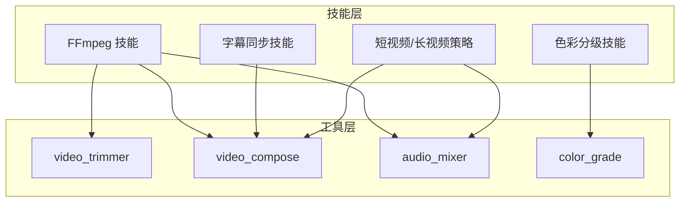
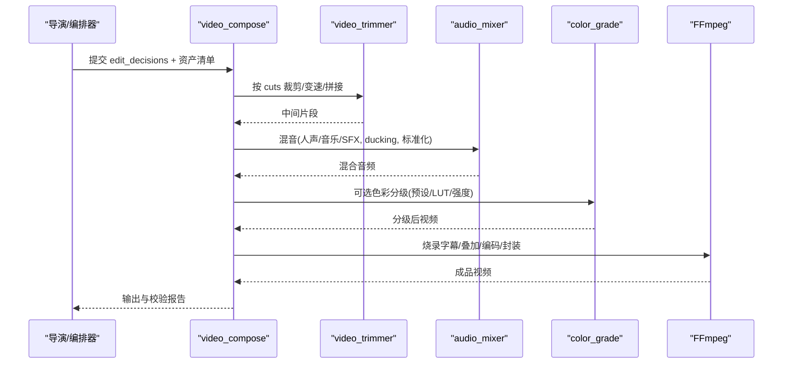
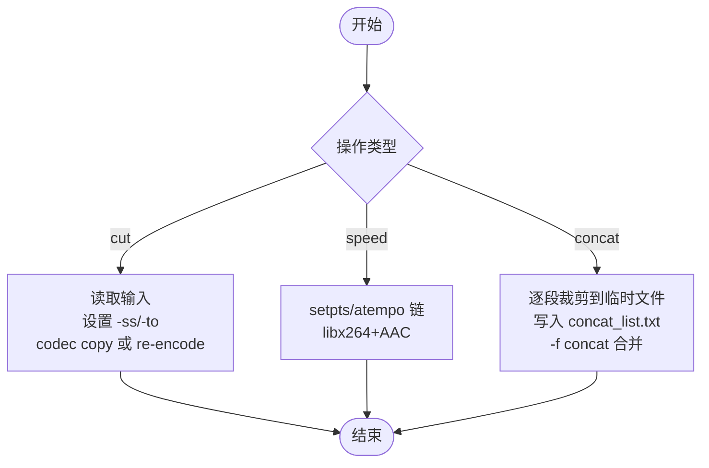
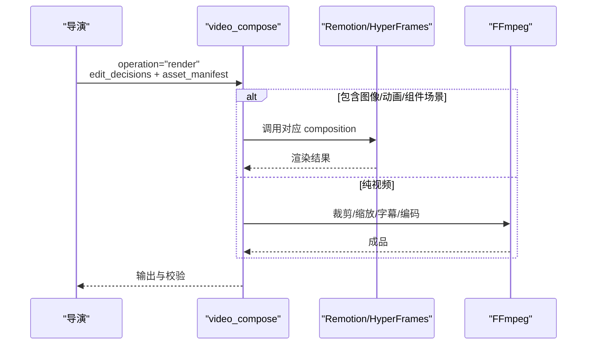
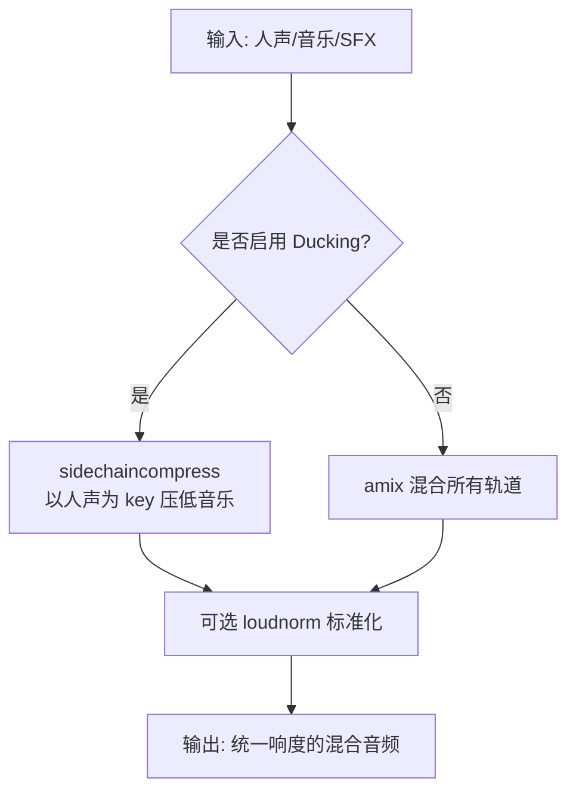
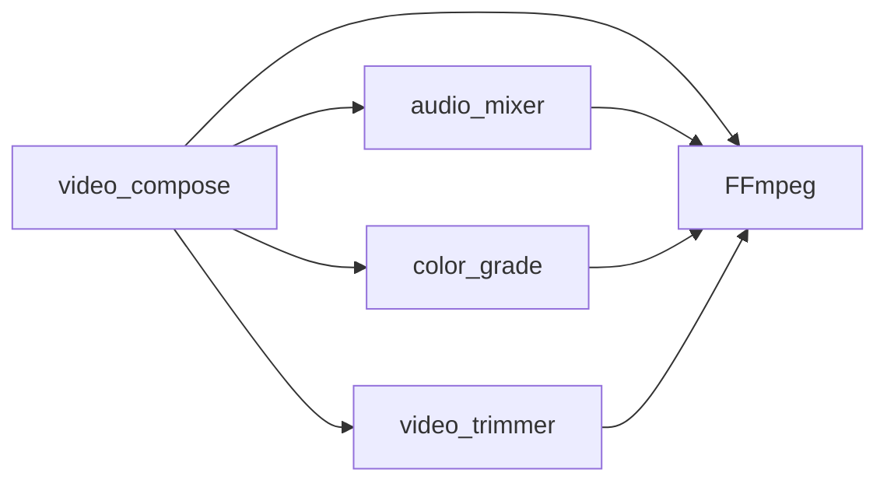

# 视频编辑技能

<cite>
**本文引用的文件**
- [skills/core/ffmpeg.md](file://skills/core/ffmpeg.md)
- [skills/core/subtitle-sync.md](file://skills/core/subtitle-sync.md)
- [skills/core/color-grading.md](file://skills/core/color-grading.md)
- [skills/creative/video-editing.md](file://skills/creative/video-editing.md)
- [skills/creative/short-form.md](file://skills/creative/short-form.md)
- [skills/creative/long-form.md](file://skills/creative/long-form.md)
- [tools/video/video_trimmer.py](file://tools/video/video_trimmer.py)
- [tools/video/video_compose.py](file://tools/video/video_compose.py)
- [tools/audio/audio_mixer.py](file://tools/audio/audio_mixer.py)
- [tools/enhancement/color_grade.py](file://tools/enhancement/color_grade.py)
- [README.md](file://README.md)
</cite>

## 目录
1. [简介](#简介)
2. [项目结构](#项目结构)
3. [核心组件](#核心组件)
4. [架构总览](#架构总览)
5. [详细组件分析](#详细组件分析)
6. [依赖关系分析](#依赖关系分析)
7. [性能与质量](#性能与质量)
8. [故障排查指南](#故障排查指南)
9. [结论](#结论)
10. [附录：工作流模板与清单](#附录工作流模板与清单)

## 简介
本技术文档面向使用 OpenMontage 进行专业级视频编辑的创作者与工程师，系统阐述剪辑原则、转场设计、节奏控制，以及基于 FFmpeg 的精确时间线编辑、多轨道混音、字幕合成等能力。文档还覆盖短视频快速剪辑、长视频章节结构、演示视频操作引导等不同类型的编辑策略，并提供色彩校正、音频同步、特效添加、批量处理自动化、质量检查与输出优化等实用方法。

## 项目结构
OpenMontage 将“技能（Skills）”与“工具（Tools）”解耦：
- 技能层：提供方法论、流程、平台规范与最佳实践（如 FFmpeg 技能、字幕同步、色彩分级、短视频/长视频策略）。
- 工具层：实现可复用的工程化能力（如 video_trimmer、video_compose、audio_mixer、color_grade），通过统一接口编排为完整流水线。

**图表来源**
- [skills/core/ffmpeg.md:1-92](file://skills/core/ffmpeg.md#L1-L92)
- [skills/core/subtitle-sync.md:1-105](file://skills/core/subtitle-sync.md#L1-L105)
- [skills/core/color-grading.md:1-162](file://skills/core/color-grading.md#L1-L162)
- [skills/creative/short-form.md:1-206](file://skills/creative/short-form.md#L1-L206)
- [skills/creative/long-form.md:1-240](file://skills/creative/long-form.md#L1-L240)
- [tools/video/video_trimmer.py:1-271](file://tools/video/video_trimmer.py#L1-L271)
- [tools/video/video_compose.py:1-800](file://tools/video/video_compose.py#L1-L800)
- [tools/audio/audio_mixer.py:1-776](file://tools/audio/audio_mixer.py#L1-L776)
- [tools/enhancement/color_grade.py:1-213](file://tools/enhancement/color_grade.py#L1-L213)

**章节来源**
- [skills/core/ffmpeg.md:1-92](file://skills/core/ffmpeg.md#L1-L92)
- [tools/video/video_compose.py:1-800](file://tools/video/video_compose.py#L1-L800)

## 核心组件
- 剪辑与拼接：video_trimmer 支持 cut/trim/speed/concat，保证关键帧对齐与无损或近无损输出。
- 合成与渲染：video_compose 负责按 edit_decisions 组装片段、烧录字幕、叠加素材、编码输出；支持 Remotion/HyperFrames/FFmpeg 三种运行时路由。
- 音频混音：audio_mixer 支持多轨混合、人声旁路（ducking）、淡入淡出、响度标准化（LUFS）、分段音乐注入。
- 色彩分级：color_grade 内置多种电影级预设与 LUT 应用，支持强度混合与自定义滤镜链。
- 字幕同步：subtitle-sync 技能指导从词级时间戳生成 SRT/VTT/Caption JSON，并给出不同画幅下的样式与可读性规范。

**章节来源**
- [tools/video/video_trimmer.py:1-271](file://tools/video/video_trimmer.py#L1-L271)
- [tools/video/video_compose.py:1-800](file://tools/video/video_compose.py#L1-L800)
- [tools/audio/audio_mixer.py:1-776](file://tools/audio/audio_mixer.py#L1-L776)
- [tools/enhancement/color_grade.py:1-213](file://tools/enhancement/color_grade.py#L1-L213)
- [skills/core/subtitle-sync.md:1-105](file://skills/core/subtitle-sync.md#L1-L105)

## 架构总览
OpenMontage 的视频编辑以“决策驱动”为核心：edit_decisions 描述时间线（cuts）、转场、字幕、音乐、元数据；video_compose 根据 render_runtime（Remotion/HyperFrames/FFmpeg）选择渲染路径，最终输出符合平台规范的成品。

**图表来源**
- [tools/video/video_compose.py:1-800](file://tools/video/video_compose.py#L1-L800)
- [tools/video/video_trimmer.py:1-271](file://tools/video/video_trimmer.py#L1-L271)
- [tools/audio/audio_mixer.py:1-776](file://tools/audio/audio_mixer.py#L1-L776)
- [tools/enhancement/color_grade.py:1-213](file://tools/enhancement/color_grade.py#L1-L213)

## 详细组件分析

### 剪辑与时间线（video_trimmer）
- 能力：cut/trim/speed_adjust/concat，支持无损复制与重编码两种模式。
- 关键点：
  - 速度调整通过 setpts/atempo 链实现，极端倍速自动拆分 atempo 段。
  - concat 使用 demuxer 列表，先对含起止时间的片段做临时裁剪再拼接，完成后清理临时文件。
  - 默认 codec=copy 实现瞬时无损；需要滤镜时走 libx264/AAC 重编码。

**图表来源**
- [tools/video/video_trimmer.py:86-271](file://tools/video/video_trimmer.py#L86-L271)

**章节来源**
- [tools/video/video_trimmer.py:1-271](file://tools/video/video_trimmer.py#L1-L271)

### 合成与渲染（video_compose）
- 能力：compose（纯视频拼接+字幕+音频）、render（自动路由到 Remotion/HyperFrames/FFmpeg）、burn_subtitles、overlay、encode。
- 关键点：
  - 分辨率与适配：支持 pad/cover 两种适配模式，确保不同来源片段统一画布。
  - 字幕烧录：优先从 edit_decisions 解析样式，必要时覆盖；路径转义与 ASS force_style 遵循 FFmpeg 技能。
  - 运行时治理：render_runtime 在提案阶段锁定，禁止静默切换；若不可用则返回结构化阻塞信息。
  - 外部音频复用：支持原子替换已渲染视频的音轨。

**图表来源**
- [tools/video/video_compose.py:337-714](file://tools/video/video_compose.py#L337-L714)

**章节来源**
- [tools/video/video_compose.py:1-800](file://tools/video/video_compose.py#L1-L800)

### 音频混音（audio_mixer）
- 能力：mix、duck、extract、full_mix、segmented_music。
- 关键点：
  - Ducking：sidechaincompress 以人声为 key 压低音乐音量，参数可调（阈值、压缩比、attack/release）。
  - 响度标准化：loudnorm 支持 LUFS 目标（-14/-16 等），匹配平台规范。
  - 分段音乐：通过 volume 表达式在指定时间段内平滑淡入淡出，其余时段静音。
  - 全链路混音：full_mix 将人声、音乐、SFX 在一个 filter graph 中完成，避免多次 I/O。

**图表来源**
- [tools/audio/audio_mixer.py:280-667](file://tools/audio/audio_mixer.py#L280-L667)

**章节来源**
- [tools/audio/audio_mixer.py:1-776](file://tools/audio/audio_mixer.py#L1-L776)

### 字幕同步（subtitle-sync）
- 能力：从词级时间戳生成 SRT/VTT/Caption JSON，适配竖屏/横屏阅读习惯。
- 关键点：
  - 竖屏短内容：每 cue 最多 3-4 词，行字符数限制，底部安全区放置。
  - 横屏标准：每 cue 最多 6-8 词，行字符数限制。
  - 样式：ASS force_style 颜色格式必须为 8 位 alpha（&H00FFFFFF），字体大小与边距按画幅调整。
  - 对齐：cue 起始对齐词 onset，结束延后约 200ms，避免跨说话者重叠。

**章节来源**
- [skills/core/subtitle-sync.md:1-105](file://skills/core/subtitle-sync.md#L1-L105)

### 色彩分级（color_grade）
- 能力：内置电影级预设（cinematic_warm/cool、moody_dark、bright_clean、vintage_film、high_contrast、neutral），支持 LUT 与自定义滤镜链，强度混合。
- 关键点：
  - 滤镜顺序：normalize → colortemperature → colorbalance → curves → eq → lut3d。
  - 皮肤保护：饱和度上限、色相偏移谨慎，优先验证肤色。
  - 可访问性：图形与叠加需满足 WCAG 对比度要求，推荐色盲友好调色板。

**章节来源**
- [tools/enhancement/color_grade.py:1-213](file://tools/enhancement/color_grade.py#L1-L213)
- [skills/core/color-grading.md:1-162](file://skills/core/color-grading.md#L1-L162)

## 依赖关系分析
- 工具间耦合：
  - video_compose 依赖 video_trimmer（片段裁剪）、audio_mixer（混音）、color_grade（可选）、FFmpeg（底层执行）。
  - audio_mixer 依赖 FFmpeg 的 sidechaincompress/loudnorm/amix 等滤镜。
  - color_grade 依赖 FFmpeg 的 colorbalance/curves/eq/lut3d。
- 运行时选择：
  - video_compose 根据 edit_decisions.metadata.compose_target 与 render_runtime 决定 Remotion/HyperFrames/FFmpeg 路径。
  - 运行时可用性检测（npx、node_modules、ffmpeg）在 get_info 中暴露，便于前置校验。

**图表来源**
- [tools/video/video_compose.py:234-335](file://tools/video/video_compose.py#L234-L335)
- [tools/audio/audio_mixer.py:1-776](file://tools/audio/audio_mixer.py#L1-L776)
- [tools/enhancement/color_grade.py:1-213](file://tools/enhancement/color_grade.py#L1-L213)
- [tools/video/video_trimmer.py:1-271](file://tools/video/video_trimmer.py#L1-L271)

**章节来源**
- [tools/video/video_compose.py:1-800](file://tools/video/video_compose.py#L1-L800)

## 性能与质量
- 无损与重编码策略：
  - 仅剪切/拼接时使用 -c copy 实现瞬时无损；需要滤镜（变速、字幕、叠加、缩放）时走 libx264/AAC 重编码。
  - CRF 默认 23，最终交付建议 18-20 提升画质。
- 响度目标：
  - 社交媒体（TikTok/Reels/Shorts）：-14 LUFS，真峰值 -1 dBTP。
  - YouTube/Podcast：-14 至 -16 LUFS。
  - 广播：-24 LUFS。
- 质量门禁（平台通用）：
  - 前后端播放无伪影、音视频同步、字幕位置不遮挡人脸、响度达标、增强自然、无削波/静音缺口、文件大小合理。
- 预/后审查：
  - 预合成校验：阻止违反交付承诺的渲染（如幻灯片风险、缺失 renderer_family）。
  - 后渲染自检：ffprobe 校验、黑帧检测、字幕存在性、音频电平分析。

**章节来源**
- [skills/core/ffmpeg.md:29-92](file://skills/core/ffmpeg.md#L29-L92)
- [README.md:656-662](file://README.md#L656-L662)

## 故障排查指南
- 常见错误与定位：
  - 输入不存在：video_trimmer/compose/mixer 均会返回明确错误，检查路径与权限。
  - 无音频流：stock 视频可能无声，video_compose 会探测并注入静音轨道以保证 concat 一致性。
  - 运行时不可用：Remotion/HyperFrames 缺少 npx/node_modules/ffmpeg 时会返回可用性与安装提示。
  - 字幕样式错误：ASS 颜色格式必须为 8 位 alpha；Windows 路径需转义。
- 调试步骤：
  - 逐步运行：先 trim，再 mix，再 compose；每一步单独验证输出。
  - 使用 ffprobe 检查流布局、时长、码率、像素格式。
  - 回放关键帧：截取字幕区域与人脸区域，确认可读性与遮挡情况。
  - 响度测量：使用 loudness meter 验证 LUFS 与真峰值。

**章节来源**
- [tools/video/video_trimmer.py:86-271](file://tools/video/video_trimmer.py#L86-L271)
- [tools/video/video_compose.py:395-714](file://tools/video/video_compose.py#L395-L714)
- [tools/audio/audio_mixer.py:280-776](file://tools/audio/audio_mixer.py#L280-L776)
- [skills/core/subtitle-sync.md:42-105](file://skills/core/subtitle-sync.md#L42-L105)

## 结论
OpenMontage 将“创意策略”与“工程实现”紧密结合：通过技能层定义剪辑原则、转场设计与节奏控制，再通过工具层以 FFmpeg 为核心实现精确的时间线编辑、多轨混音、字幕合成与色彩分级。借助统一的 edit_decisions 与运行时治理机制，可在短视频、长视频、演示视频等不同类型中稳定产出高质量成品，并通过质量门禁与自检保障一致性与可维护性。

## 附录：工作流模板与清单

### 短视频快速剪辑（TikTok/Reels/Shorts）
- 画幅与尺寸：9:16（1080x1920），安全区居中 900x1400。
- 节奏：画面每 1-3 秒变化，切点密集，语速 180-200 WPM。
- 字幕：强制开启，词级时间戳，竖屏每 cue 最多 3-4 词。
- 音频：音乐立即进入，目标 -14 LUFS，真峰值 -1 dBTP。
- 工具链：video_trimmer（快切/变速）→ audio_mixer（full_mix/ducking）→ video_compose（烧录字幕/编码）。

**章节来源**
- [skills/creative/short-form.md:1-206](file://skills/creative/short-form.md#L1-L206)
- [tools/video/video_trimmer.py:1-271](file://tools/video/video_trimmer.py#L1-L271)
- [tools/audio/audio_mixer.py:1-776](file://tools/audio/audio_mixer.py#L1-L776)
- [tools/video/video_compose.py:1-800](file://tools/video/video_compose.py#L1-L800)

### 长视频章节结构（YouTube 10+ 分钟）
- 结构：Hook 在 0:30 前完成，每章 2-4 分钟，最大 5-6 章。
- 节奏：每 45-90 秒一次主要中断，每 20-30 秒一次次要中断。
- 音频：连续音乐床，人声出现时压低 18-20 dB，目标 -14 LUFS。
- 工具链：video_trimmer（章节裁剪）→ audio_mixer（分段音乐/ducking）→ video_compose（字幕/编码）→ color_grade（统一风格）。

**章节来源**
- [skills/creative/long-form.md:1-240](file://skills/creative/long-form.md#L1-L240)
- [tools/audio/audio_mixer.py:669-776](file://tools/audio/audio_mixer.py#L669-L776)
- [tools/enhancement/color_grade.py:1-213](file://tools/enhancement/color_grade.py#L1-L213)

### 演示视频操作引导
- 重点：屏幕录制 + 关键步骤高亮 + 简洁旁白 + 字幕。
- 技巧：J-cut/L-cut 保持连贯，关键操作放大/标注，避免遮挡手指/光标。
- 工具链：video_trimmer（步骤裁剪）→ video_compose（叠加标注/字幕）→ audio_mixer（旁白与背景音混合）。

**章节来源**
- [skills/creative/video-editing.md:17-62](file://skills/creative/video-editing.md#L17-L62)
- [tools/video/video_compose.py:1-800](file://tools/video/video_compose.py#L1-L800)

### 批量处理自动化
- 批处理思路：
  - 生成 edit_decisions 列表（多源素材、多目标平台）。
  - 循环调用 video_trimmer（统一规格）→ audio_mixer（full_mix/segmented_music）→ video_compose（编码/字幕）。
  - 使用 idempotency_key_fields 避免重复计算。
- 质量控制：
  - 每批次抽样 ffprobe 校验、黑帧检测、响度测量。
  - 失败重试：RetryPolicy 配置，记录错误日志与回滚。

**章节来源**
- [tools/video/video_trimmer.py:77-84](file://tools/video/video_trimmer.py#L77-L84)
- [tools/video/video_compose.py:226-232](file://tools/video/video_compose.py#L226-L232)
- [tools/audio/audio_mixer.py:198-203](file://tools/audio/audio_mixer.py#L198-L203)

### 输出优化
- 编码参数：
  - H.264 High Profile Level 4.2，VBR 8-15 Mbps（短视频），CRF 18-20（高质量交付）。
  - 像素格式 yuv420p，采样率 48kHz，AAC 192k。
- 平台适配：
  - 短视频：-14 LUFS，真峰值 -1 dBTP，竖屏安全区。
  - 长视频：-14 LUFS，章节响度一致（差异 < 2 LUFS）。
- 资源管理：
  - 临时文件清理（concat_tmp/.compose_tmp），避免磁盘占用。

**章节来源**
- [skills/creative/short-form.md:34-41](file://skills/creative/short-form.md#L34-L41)
- [skills/creative/long-form.md:132-149](file://skills/creative/long-form.md#L132-L149)
- [tools/video/video_compose.py:548-701](file://tools/video/video_compose.py#L548-L701)
- [tools/video/video_trimmer.py:182-253](file://tools/video/video_trimmer.py#L182-L253)