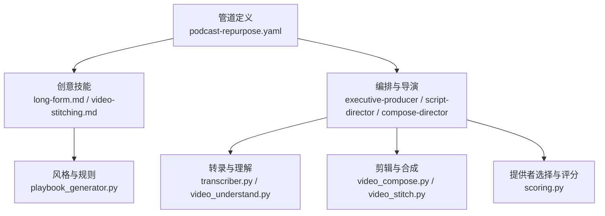
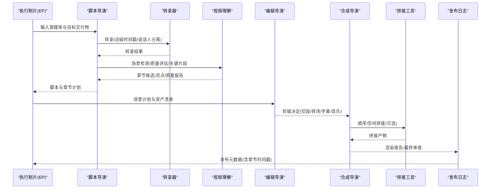
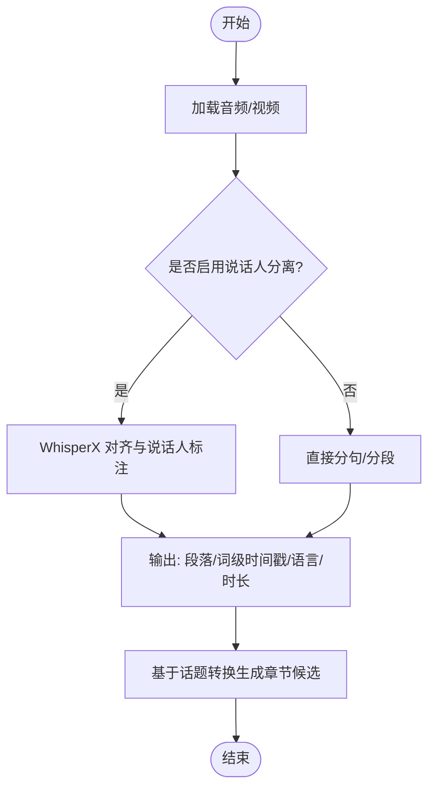
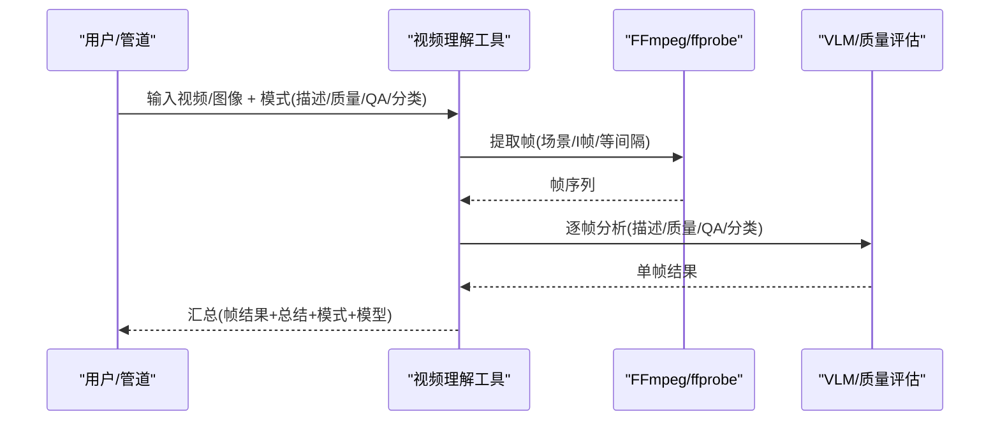
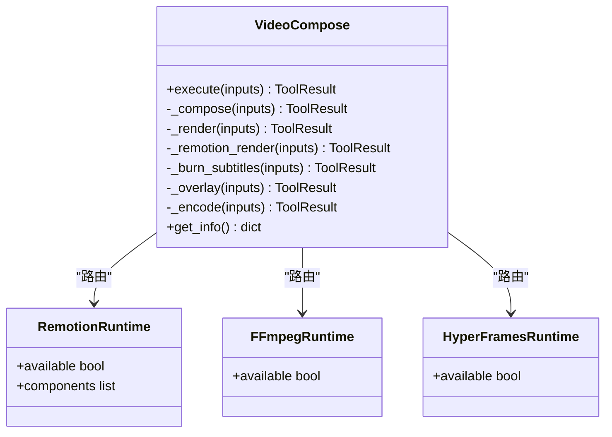
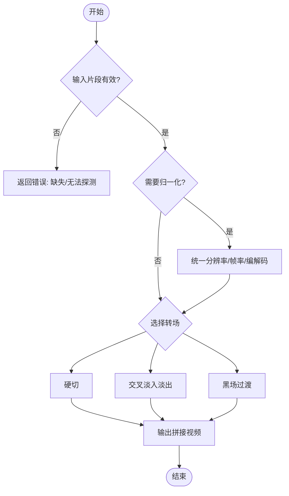

# 长视频制作技能

<cite>
**本文引用的文件**
- [skills/creative/long-form.md](file://skills/creative/long-form.md)
- [pipeline_defs/podcast-repurpose.yaml](file://pipeline_defs/podcast-repurpose.yaml)
- [skills/pipelines/podcast-repurpose/executive-producer.md](file://skills/pipelines/podcast-repurpose/executive-producer.md)
- [skills/pipelines/podcast-repurpose/script-director.md](file://skills/pipelines/podcast-repurpose/script-director.md)
- [skills/pipelines/podcast-repurpose/compose-director.md](file://skills/pipelines/podcast-repurpose/compose-director.md)
- [tools/analysis/transcriber.py](file://tools/analysis/transcriber.py)
- [tools/analysis/video_understand.py](file://tools/analysis/video_understand.py)
- [tools/video/video_compose.py](file://tools/video/video_compose.py)
- [tools/video/video_stitch.py](file://tools/video/video_stitch.py)
- [lib/playbook_generator.py](file://lib/playbook_generator.py)
- [lib/scoring.py](file://lib/scoring.py)
- [skills/creative/video-stitching.md](file://skills/creative/video-stitching.md)
</cite>

## 目录
1. [简介](#简介)
2. [项目结构](#项目结构)
3. [核心组件](#核心组件)
4. [架构总览](#架构总览)
5. [详细组件分析](#详细组件分析)
6. [依赖关系分析](#依赖关系分析)
7. [性能与质量考量](#性能与质量考量)
8. [故障排查指南](#故障排查指南)
9. [结论](#结论)
10. [附录](#附录)

## 简介
本技术文档面向“长视频制作技能”，聚焦从现有内容（播客、演讲、教程素材）到结构化长视频的自动化生产流程。内容涵盖：
- 章节结构与分段策略
- 观众注意力管理与节奏控制
- 自动章节标记、关键片段提取、摘要生成
- 质量保证方法（一致性、节奏平衡、信息密度）
- 自动化工作流配置、批量处理脚本与质量控制指标

该能力以 OpenMontage 的管道定义、工具链与创意技能为核心，提供端到端的生产路径与可验证的质量门禁。

## 项目结构
OpenMontage 将“长视频”能力拆解为：
- 管道定义：以 YAML 描述阶段、工件、工具与门禁
- 创意技能：指导如何设计章节、节奏、音频与视觉策略
- 工具层：转录、理解、剪辑、合成、拼接等具体实现
- 风格与评分：Playbook 生成与提供者选择评分引擎

图表来源
- [pipeline_defs/podcast-repurpose.yaml:1-213](file://pipeline_defs/podcast-repurpose.yaml#L1-L213)
- [skills/creative/long-form.md:1-240](file://skills/creative/long-form.md#L1-L240)
- [skills/pipelines/podcast-repurpose/executive-producer.md:1-136](file://skills/pipelines/podcast-repurpose/executive-producer.md#L1-L136)
- [tools/analysis/transcriber.py:1-280](file://tools/analysis/transcriber.py#L1-L280)
- [tools/analysis/video_understand.py:1-631](file://tools/analysis/video_understand.py#L1-L631)
- [tools/video/video_compose.py:1-800](file://tools/video/video_compose.py#L1-L800)
- [tools/video/video_stitch.py:1-800](file://tools/video/video_stitch.py#L1-L800)
- [lib/playbook_generator.py:1-226](file://lib/playbook_generator.py#L1-L226)
- [lib/scoring.py:1-557](file://lib/scoring.py#L1-L557)

章节来源
- [pipeline_defs/podcast-repurpose.yaml:1-213](file://pipeline_defs/podcast-repurpose.yaml#L1-L213)
- [skills/creative/long-form.md:1-240](file://skills/creative/long-form.md#L1-L240)

## 核心组件
- 管道编排与门禁：通过 YAML 定义 idea → script → scene_plan → assets → edit → compose → publish 的阶段与检查点，确保多交付物一致性与音频保真。
- 创意策略：长视频章节模板、模式中断、重钩子、音频一致性、视觉节奏、结尾屏与卡片策略。
- 转录与理解：词级时间戳、说话人分离、场景检测、质量评估与视觉问答。
- 剪辑与合成：Remotion/FFmpeg/HyperFrames 多运行时路由；字幕烧录、叠加、编码与混音。
- 拼接与空间布局：顺序拼接、交叉淡入淡出、黑场过渡、并排/画中画等。
- 风格与评分：Playbook 生成与提供者/路径评分，保证一致性与成本效率。

章节来源
- [pipeline_defs/podcast-repurpose.yaml:1-213](file://pipeline_defs/podcast-repurpose.yaml#L1-L213)
- [skills/creative/long-form.md:1-240](file://skills/creative/long-form.md#L1-L240)
- [tools/analysis/transcriber.py:1-280](file://tools/analysis/transcriber.py#L1-L280)
- [tools/analysis/video_understand.py:1-631](file://tools/analysis/video_understand.py#L1-L631)
- [tools/video/video_compose.py:1-800](file://tools/video/video_compose.py#L1-L800)
- [tools/video/video_stitch.py:1-800](file://tools/video/video_stitch.py#L1-L800)
- [lib/playbook_generator.py:1-226](file://lib/playbook_generator.py#L1-L226)
- [lib/scoring.py:1-557](file://lib/scoring.py#L1-L557)

## 架构总览
下图展示从源媒体到最终输出的端到端数据流与关键决策点。

图表来源
- [pipeline_defs/podcast-repurpose.yaml:46-213](file://pipeline_defs/podcast-repurpose.yaml#L46-L213)
- [tools/analysis/transcriber.py:116-240](file://tools/analysis/transcriber.py#L116-L240)
- [tools/analysis/video_understand.py:152-234](file://tools/analysis/video_understand.py#L152-L234)
- [tools/video/video_compose.py:337-360](file://tools/video/video_compose.py#L337-L360)
- [tools/video/video_stitch.py:148-173](file://tools/video/video_stitch.py#L148-L173)

## 详细组件分析

### 章节结构与注意力管理（长视频策略）
- 章节模板：建议每章 2-4 分钟，最多 5-6 章，避免碎片化。
- 注意力曲线：前 30 秒完成钩子；2-3 分钟处设置“留存低谷”应对策略（模式中断、重钩子）。
- 模式中断：每 45-90 秒一次重大中断，每 20-30 秒一次轻微中断（B-roll、文字、音效、音乐能量变化）。
- 音频一致性：背景音乐持续存在，语音时降 -18 至 -20 dB；整片 LUFS 目标 -14；章节间差异 < 2 LUFS。
- 视觉节奏：不同阶段的切频不同；B-roll 占比 35-50%；“必须有事件发生”原则（3-5 秒变化，最长无变化 15 秒）。
- 结尾屏与卡片：最后 20 秒留白给结束屏元素；信息卡片不超过每 2 分钟一个。

章节来源
- [skills/creative/long-form.md:1-240](file://skills/creative/long-form.md#L1-L240)

### 从播客到长视频：自动化流水线
- 阶段划分：idea → script → scene_plan → assets → edit → compose → publish，每个阶段有明确工件与人类审批门禁。
- 脚本阶段：强调转录质量、说话人分离、亮点识别与章节标记；产出结构化脚本与章节候选。
- 资产阶段：字幕生成、引用卡片、可选主题图形；预算与一致性检查。
- 编辑阶段：确保每段开头 3 秒内落地钩子；跨交付物风格与音量一致。
- 合成阶段：优先输出高价值片段；保持音频保真；按平台比例输出；校验字幕同步与品牌一致性。
- 发布阶段：为各平台优化元数据；为长视频附加章节时间戳。

章节来源
- [pipeline_defs/podcast-repurpose.yaml:46-213](file://pipeline_defs/podcast-repurpose.yaml#L46-L213)
- [skills/pipelines/podcast-repurpose/script-director.md:1-91](file://skills/pipelines/podcast-repurpose/script-director.md#L1-L91)
- [skills/pipelines/podcast-repurpose/compose-director.md:1-72](file://skills/pipelines/podcast-repurpose/compose-director.md#L1-L72)

### 转录与章节标记（词级时间戳 + 说话人分离）
- 使用 faster-whisper/WhisperX 进行转录，支持词级时间戳与可选说话人分离。
- 在 GPU 不可用时自动回退 CPU；失败时保留确定性基线。
- 输出包含段落、词级时间戳、语言、时长与设备信息；写入 JSON 便于后续阶段消费。
- 章节标记依据话题转换与章节候选，支撑长视频导航与留存提升。

图表来源
- [tools/analysis/transcriber.py:116-240](file://tools/analysis/transcriber.py#L116-L240)
- [tools/analysis/transcriber.py:242-280](file://tools/analysis/transcriber.py#L242-L280)

章节来源
- [tools/analysis/transcriber.py:1-280](file://tools/analysis/transcriber.py#L1-L280)

### 关键片段提取与质量评估（视频理解）
- 帧采样：支持场景切换、I 帧或等间隔采样；若场景模式未检测到变化则回退到等间隔。
- 质量评估：模糊度、亮度、对比度指标；判定“良好/存在问题”。
- 视觉问答与分类：CLIP/BLIP-2/LLaVA 多模型支持；用于内容 QA 与场景分类。
- 输出：JSON 包含帧路径、时间戳、转录片段与总结；便于人工复核与自动化门禁。

图表来源
- [tools/analysis/video_understand.py:152-234](file://tools/analysis/video_understand.py#L152-L234)
- [tools/analysis/video_understand.py:269-337](file://tools/analysis/video_understand.py#L269-L337)
- [tools/analysis/video_understand.py:343-388](file://tools/analysis/video_understand.py#L343-L388)
- [tools/analysis/video_understand.py:434-586](file://tools/analysis/video_understand.py#L434-L586)

章节来源
- [tools/analysis/video_understand.py:1-631](file://tools/analysis/video_understand.py#L1-L631)

### 剪辑与合成（多运行时路由）
- 运行时选择：Remotion（React 组件、词级字幕）、FFmpeg（纯视频裁剪/拼接）、HyperFrames（HTML/CSS/GSAP 动态排版）。
- 路由约束：运行时在提案阶段锁定，禁止静默替换；若不可用需显式阻断并等待用户批准。
- 合成流程：解析 cut 列表、统一分辨率与帧率、注入静音轨道（若无音频）、烧录字幕、混音与编码。
- 质量保障：核对提案与最终运行时一致性；输出渲染报告与最终审查。

图表来源
- [tools/video/video_compose.py:1-800](file://tools/video/video_compose.py#L1-L800)

章节来源
- [tools/video/video_compose.py:1-800](file://tools/video/video_compose.py#L1-L800)
- [skills/pipelines/podcast-repurpose/compose-director.md:1-72](file://skills/pipelines/podcast-repurpose/compose-director.md#L1-L72)

### 拼接与空间布局（顺序/交叉/画中画）
- 顺序拼接：支持 cut/crossfade/fade-through-black；自动归一化分辨率、帧率与编解码格式。
- 空间布局：并排、垂直堆叠、画中画；适用于对比、反应、评论等多画面需求。
- 预览与验证：dry_run 预检、低分辨率预览、属性不匹配提示。

图表来源
- [tools/video/video_stitch.py:148-173](file://tools/video/video_stitch.py#L148-L173)
- [tools/video/video_stitch.py:481-583](file://tools/video/video_stitch.py#L481-L583)
- [tools/video/video_stitch.py:584-735](file://tools/video/video_stitch.py#L584-L735)

章节来源
- [tools/video/video_stitch.py:1-800](file://tools/video/video_stitch.py#L1-L800)
- [skills/creative/video-stitching.md:1-116](file://skills/creative/video-stitching.md#L1-L116)

### 播放列表与风格一致性（Playbook 生成）
- 根据制作简报自动生成符合 schema 的 Playbook，覆盖色彩、字体、动效、音频与质量规则。
- 支持基于现有 Playbook 覆盖与扩展；保存至自定义样式目录。
- 与评分引擎结合，确保风格一致性与成本控制。

章节来源
- [lib/playbook_generator.py:1-226](file://lib/playbook_generator.py#L1-L226)

### 提供者与路径评分（选择与解释性）
- 多维度评分：任务契合度、输出质量、可控性、可靠性、成本效率、延迟、连续性。
- 语义同义词扩展与关键词重叠计算，提升匹配鲁棒性。
- 输出可解释的排名与说明，辅助人工决策与自动化门禁。

章节来源
- [lib/scoring.py:1-557](file://lib/scoring.py#L1-L557)

## 依赖关系分析
- 管道对技能与工具的强耦合：YAML 指定所需技能、工具与工件，确保阶段推进的契约。
- 创意技能对工具能力的约束：如长视频策略要求词级字幕、连续音乐床、LUFS 一致性，驱动合成与混音工具的使用。
- 工具间的协作：转录 → 理解 → 剪辑 → 合成 → 拼接，形成清晰的数据管线。
- 运行时治理：视频合成的多运行时需在提案阶段锁定，避免静默替换导致的不一致。

图表来源
- [pipeline_defs/podcast-repurpose.yaml:1-213](file://pipeline_defs/podcast-repurpose.yaml#L1-L213)
- [tools/video/video_compose.py:267-335](file://tools/video/video_compose.py#L267-L335)

章节来源
- [pipeline_defs/podcast-repurpose.yaml:1-213](file://pipeline_defs/podcast-repurpose.yaml#L1-L213)
- [tools/video/video_compose.py:267-335](file://tools/video/video_compose.py#L267-L335)

## 性能与质量考量
- 转录性能：CPU 默认运行，GPU 可用时加速；内存不足时重试策略；词级时间戳精度影响章节与字幕对齐。
- 视频理解：按帧采样而非全帧分析，控制推理成本；质量评估快速指标（模糊/曝光/对比度）。
- 合成性能：统一分辨率与帧率减少二次转码开销；必要时仅对必要片段重编码；字幕烧录与混音在最终阶段集中处理。
- 拼接性能：先验证兼容性，再按需归一化；交叉/黑场过渡需额外音频轨，提前注入静音以避免失败。
- 质量指标：
  - 音频：LUFS 目标 -14，章节间差异 < 2 LUFS；音乐在语音期间降 -18 至 -20 dB。
  - 视觉：切频与 B-roll 比例遵循长视频策略；结尾屏预留最后 20 秒。
  - 内容：章节导航、钩子与重钩子位置；亮点独立可懂。

章节来源
- [skills/creative/long-form.md:132-215](file://skills/creative/long-form.md#L132-L215)
- [tools/analysis/transcriber.py:112-115](file://tools/analysis/transcriber.py#L112-L115)
- [tools/analysis/video_understand.py:144-150](file://tools/analysis/video_understand.py#L144-L150)
- [tools/video/video_compose.py:438-714](file://tools/video/video_compose.py#L438-L714)
- [tools/video/video_stitch.py:481-583](file://tools/video/video_stitch.py#L481-L583)

## 故障排查指南
- 转录失败：检查依赖安装（faster-whisper/whisperx），确认 GPU/CPU 可用性；查看设备与计算类型；必要时回退 CPU。
- 视频理解失败：确认输入文件类型与路径；检查最大帧数与采样模式；若场景模式无变化，自动回退等间隔采样。
- 合成失败：确认运行时可用性（npx/ffmpeg/hyperframes）；检查提案阶段锁定的运行时；核对 cut 列表与资源路径；字幕与混音参数是否正确。
- 拼接失败：检查片段属性（分辨率/帧率/编解码）；开启 auto_normalize 或使用非 cut 转场；确保所有片段具备音频轨（交叉/黑场过渡）。
- 质量门禁：依据执行制片的多阶段检查点（G1-G7）逐项核验；失败时退回相应阶段修订。

章节来源
- [tools/analysis/transcriber.py:98-104](file://tools/analysis/transcriber.py#L98-L104)
- [tools/analysis/video_understand.py:160-183](file://tools/analysis/video_understand.py#L160-L183)
- [tools/video/video_compose.py:234-265](file://tools/video/video_compose.py#L234-L265)
- [tools/video/video_stitch.py:314-399](file://tools/video/video_stitch.py#L314-L399)
- [skills/pipelines/podcast-repurpose/executive-producer.md:107-118](file://skills/pipelines/podcast-repurpose/executive-producer.md#L107-L118)

## 结论
OpenMontage 的长视频制作技能通过“策略 + 管道 + 工具 + 质量门禁”的组合，实现了从现有内容到结构化长视频的自动化生产。其核心优势在于：
- 明确的章节结构与注意力管理策略，提升留存与可导航性
- 基于词级时间戳与说话人分离的精准章节标记与字幕对齐
- 多运行时视频合成与灵活的拼接能力，适配多种交付形态
- 可解释的提供者与路径评分，兼顾质量、成本与一致性
- 严格的质量门禁与回放机制，确保多交付物的一致性与可发布性

## 附录
- 实用建议：
  - 在脚本阶段尽早识别章节与亮点，降低后期返工
  - 合成阶段优先输出高价值片段，缩短反馈循环
  - 使用 dry_run 与预览功能降低试错成本
  - 结合 Playbook 与评分引擎，维持品牌一致性与成本可控
- 参考路径：
  - 章节模板与节奏：[skills/creative/long-form.md](file://skills/creative/long-form.md)
  - 播客重制管道：[pipeline_defs/podcast-repurpose.yaml](file://pipeline_defs/podcast-repurpose.yaml)
  - 转录与理解：[tools/analysis/transcriber.py](file://tools/analysis/transcriber.py)、[tools/analysis/video_understand.py](file://tools/analysis/video_understand.py)
  - 合成与拼接：[tools/video/video_compose.py](file://tools/video/video_compose.py)、[tools/video/video_stitch.py](file://tools/video/video_stitch.py)
  - 风格与评分：[lib/playbook_generator.py](file://lib/playbook_generator.py)、[lib/scoring.py](file://lib/scoring.py)