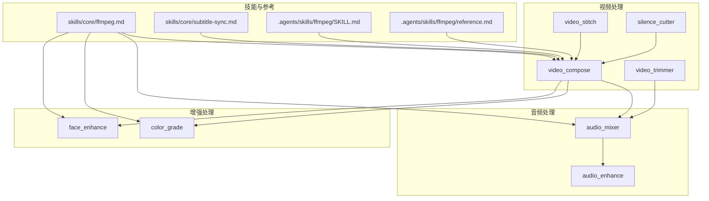
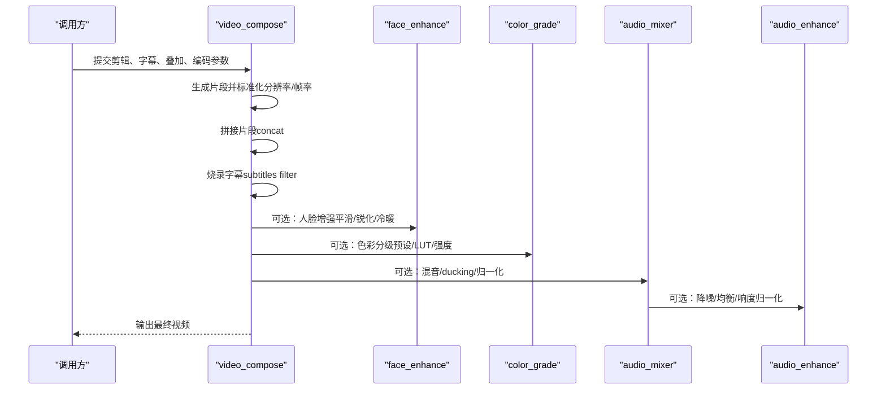
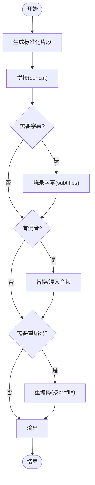
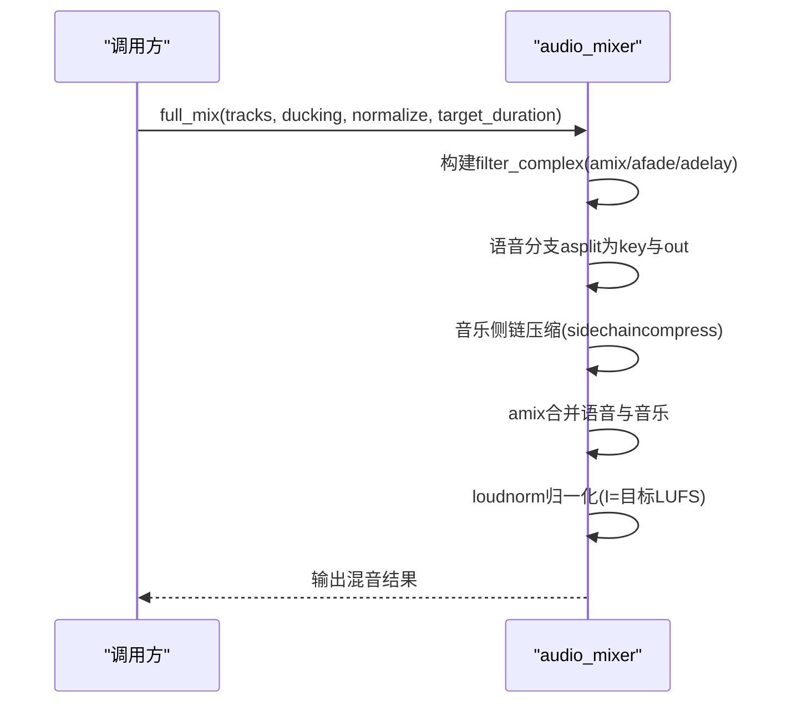
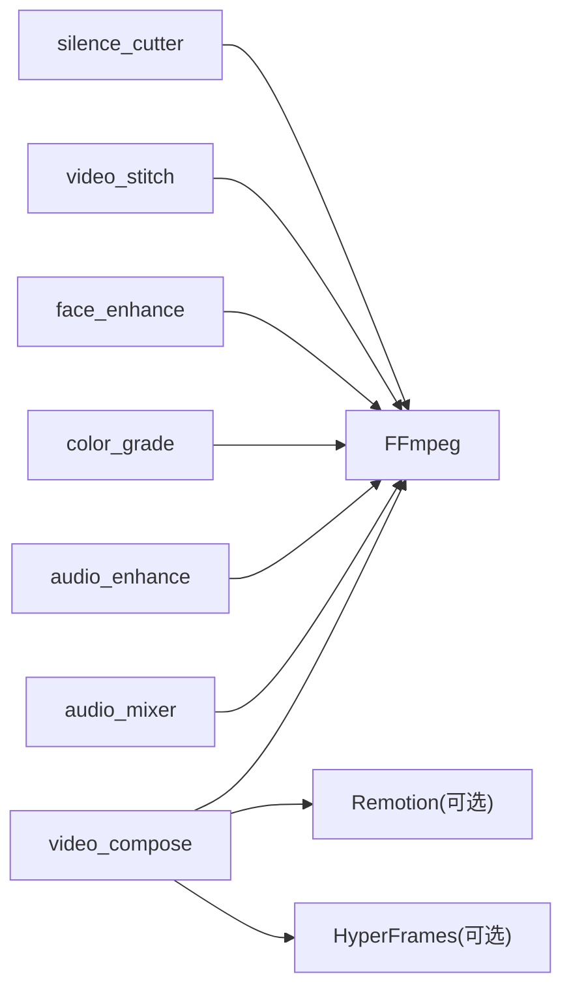

# FFmpeg集成技能

<cite>
**本文引用的文件**
- [skills/core/ffmpeg.md](file://skills/core/ffmpeg.md)
- [.agents/skills/ffmpeg/SKILL.md](file://.agents/skills/ffmpeg/SKILL.md)
- [.agents/skills/ffmpeg/reference.md](file://.agents/skills/ffmpeg/reference.md)
- [tools/video/video_compose.py](file://tools/video/video_compose.py)
- [tools/video/video_trimmer.py](file://tools/video/video_trimmer.py)
- [tools/audio/audio_mixer.py](file://tools/audio/audio_mixer.py)
- [tools/enhancement/color_grade.py](file://tools/enhancement/color_grade.py)
- [tools/enhancement/face_enhance.py](file://tools/enhancement/face_enhance.py)
- [tools/audio/audio_enhance.py](file://tools/audio/audio_enhance.py)
- [tools/video/video_stitch.py](file://tools/video/video_stitch.py)
- [tools/video/silence_cutter.py](file://tools/video/silence_cutter.py)
- [skills/core/subtitle-sync.md](file://skills/core/subtitle-sync.md)
</cite>

## 目录
1. [简介](#简介)
2. [项目结构](#项目结构)
3. [核心组件](#核心组件)
4. [架构总览](#架构总览)
5. [详细组件分析](#详细组件分析)
6. [依赖关系分析](#依赖关系分析)
7. [性能考虑](#性能考虑)
8. [故障排除指南](#故障排除指南)
9. [结论](#结论)
10. [附录：命令行与Python API示例](#附录命令行与python-api示例)

## 简介
本技术文档聚焦OpenMontage中基于FFmpeg的视频与音频处理技能，覆盖视频裁剪、拼接、速度调整、字幕烧录、音频混音、降噪等能力。文档解释增强链顺序原则（字幕→人脸增强→色彩分级→音频增强），说明无损与重新编码的选择策略，并提供平台特定的目标响度标准（如-14 LUFS用于社交媒体、-16 LUFS用于播客）。同时给出字幕烧录最佳实践、音频ducking设置、色彩分级强度控制建议，以及性能优化与故障排除指南。

## 项目结构
OpenMontage将FFmpeg相关能力以“工具”形式组织在tools目录下，并通过skills文档提供使用模式与最佳实践。关键路径包括：
- 视频工具：video_compose、video_trimmer、video_stitch、silence_cutter
- 音频工具：audio_mixer、audio_enhance
- 增强工具：color_grade、face_enhance
- 技能文档：skills/core/ffmpeg.md、skills/core/subtitle-sync.md
- 参考手册：.agents/skills/ffmpeg/SKILL.md、reference.md

图表来源
- [tools/video/video_compose.py:1-120](file://tools/video/video_compose.py#L1-L120)
- [tools/audio/audio_mixer.py:1-120](file://tools/audio/audio_mixer.py#L1-L120)
- [tools/enhancement/color_grade.py:1-120](file://tools/enhancement/color_grade.py#L1-L120)
- [tools/enhancement/face_enhance.py:25-116](file://tools/enhancement/face_enhance.py#L25-L116)
- [skills/core/ffmpeg.md:1-92](file://skills/core/ffmpeg.md#L1-L92)
- [skills/core/subtitle-sync.md:1-94](file://skills/core/subtitle-sync.md#L1-L94)

章节来源
- [skills/core/ffmpeg.md:1-92](file://skills/core/ffmpeg.md#L1-L92)
- [.agents/skills/ffmpeg/SKILL.md:1-120](file://.agents/skills/ffmpeg/SKILL.md#L1-L120)

## 核心组件
- video_compose：负责剪辑拼接、字幕烧录、叠加、编码与Remotion/HyperFrames路由；支持compose、render、burn_subtitles、overlay、encode等操作。
- video_trimmer：支持cut、speed、concat操作，内部调用FFmpeg进行精确裁剪与变速。
- audio_mixer：支持mix、duck、extract、full_mix、segmented_music；内置loudnorm目标可配置，支持sidechaincompress实现ducking。
- color_grade：内置多种电影级调色预设，支持外部.cube LUT与强度混合。
- face_enhance：内置皮肤平滑、锐化、冷暖色调、降噪等预设，组合为talking_head_standard等。
- audio_enhance：内置clean_speech、noise_reduce、podcast、broadcast、voice_clarity等预设，支持自定义音频滤镜链。

章节来源
- [tools/video/video_compose.py:58-232](file://tools/video/video_compose.py#L58-L232)
- [tools/video/video_trimmer.py:47-152](file://tools/video/video_trimmer.py#L47-L152)
- [tools/audio/audio_mixer.py:26-196](file://tools/audio/audio_mixer.py#L26-L196)
- [tools/enhancement/color_grade.py:24-124](file://tools/enhancement/color_grade.py#L24-L124)
- [tools/enhancement/face_enhance.py:25-116](file://tools/enhancement/face_enhance.py#L25-L116)
- [tools/audio/audio_enhance.py:25-120](file://tools/audio/audio_enhance.py#L25-L120)

## 架构总览
OpenMontage的FFmpeg集成遵循“先字幕、再画面增强、最后音频增强”的流水线顺序，确保各阶段互不干扰且效果最优。视频合成由video_compose统一编排，音频由audio_mixer与audio_enhance协同完成，画面增强由face_enhance与color_grade提供。

图表来源
- [tools/video/video_compose.py:438-714](file://tools/video/video_compose.py#L438-L714)
- [tools/enhancement/face_enhance.py:70-116](file://tools/enhancement/face_enhance.py#L70-L116)
- [tools/enhancement/color_grade.py:78-124](file://tools/enhancement/color_grade.py#L78-L124)
- [tools/audio/audio_mixer.py:257-667](file://tools/audio/audio_mixer.py#L257-L667)
- [tools/audio/audio_enhance.py:130-181](file://tools/audio/audio_enhance.py#L130-L181)

## 详细组件分析

### 视频合成（video_compose）
- 能力：compose（剪辑+字幕+音频）、burn_subtitles（单独烧字）、overlay（叠加）、encode（按媒体规格重编码）、remotion_render（通过Remotion渲染）。
- 关键点：
  - 片段标准化：统一分辨率、fps、像素格式，保证concat安全。
  - 无音频流时自动注入静音轨道，避免concat失败。
  - 字幕样式通过ASS force_style构建，支持字体、字号、颜色、边距等。
  - 根据是否应用滤镜或规格变更决定copy或re-encode。
  - 支持profile选择（如youtube_landscape、tiktok、instagram_reels）。

图表来源
- [tools/video/video_compose.py:511-714](file://tools/video/video_compose.py#L511-L714)

章节来源
- [tools/video/video_compose.py:58-232](file://tools/video/video_compose.py#L58-L232)
- [tools/video/video_compose.py:438-714](file://tools/video/video_compose.py#L438-L714)
- [tools/video/video_compose.py:2911-2944](file://tools/video/video_compose.py#L2911-L2944)

### 视频裁剪与速度（video_trimmer）
- 能力：cut（按起止时间裁剪）、speed（变速，音视频同步）、concat（同码率/分辨率片段快速拼接）。
- 关键点：
  - cut使用-ss/-to或-ss/-t，推荐重编码以保证帧准确。
  - speed通过setpts与atempo联动，支持多级atempo链以适应极端变速。
  - concat优先使用-c copy，若源不一致则需预转码。

章节来源
- [tools/video/video_trimmer.py:47-152](file://tools/video/video_trimmer.py#L47-L152)
- [.agents/skills/ffmpeg/SKILL.md:76-118](file://.agents/skills/ffmpeg/SKILL.md#L76-L118)

### 视频拼接（video_stitch）
- 能力：检测片段差异并标准化后拼接，支持不同分辨率/码率的统一化处理。
- 关键点：
  - _needs_normalization比较width、height、fps、video_codec、audio_codec、sample_rate。
  - _normalize_clip统一缩放、填充、帧率、像素格式与音频采样率。

章节来源
- [tools/video/video_stitch.py:441-479](file://tools/video/video_stitch.py#L441-L479)

### 静音段处理（silence_cutter）
- 能力：remove（跳剪）、speed_up（静音加速）、mark（仅检测）。
- 关键点：
  - 通过阈值与最小静音时长识别静音段。
  - remove模式使用concat demuxer合并非静音片段。
  - speed_up模式对静音段应用高倍速，保持连续性。

章节来源
- [tools/video/silence_cutter.py:55-93](file://tools/video/silence_cutter.py#L55-L93)
- [tools/video/silence_cutter.py:341-383](file://tools/video/silence_cutter.py#L341-L383)

### 音频混音与Ducking（audio_mixer）
- 能力：mix（多轨混音）、duck（语音压制音乐）、extract（提取音频）、full_mix（一键混音+duck+归一化）、segmented_music（分段背景音乐）。
- 关键点：
  - ducking使用sidechaincompress，以语音为key信号降低音乐音量。
  - loudnorm目标可通过loudnorm_target配置，默认-16 LUFS（播客），支持-14 LUFS（社交媒体）。
  - segmented_music通过volume表达式实现淡入淡出与静音区间控制。

图表来源
- [tools/audio/audio_mixer.py:479-667](file://tools/audio/audio_mixer.py#L479-L667)
- [tools/audio/audio_mixer.py:205-223](file://tools/audio/audio_mixer.py#L205-L223)

章节来源
- [tools/audio/audio_mixer.py:26-196](file://tools/audio/audio_mixer.py#L26-L196)
- [tools/audio/audio_mixer.py:340-445](file://tools/audio/audio_mixer.py#L340-L445)
- [tools/audio/audio_mixer.py:669-776](file://tools/audio/audio_mixer.py#L669-L776)

### 音频增强（audio_enhance）
- 能力：噪声抑制、高通/低通滤波、压缩、限制器、响度归一化、EQ。
- 预设：
  - clean_speech：适合对话清理，默认-16 LUFS。
  - noise_reduce：强降噪环境。
  - podcast：播客风格，压缩+归一化。
  - broadcast：广播标准，紧动态范围。
  - voice_clarity：人声清晰度提升。

章节来源
- [tools/audio/audio_enhance.py:25-77](file://tools/audio/audio_enhance.py#L25-L77)
- [tools/audio/audio_enhance.py:130-181](file://tools/audio/audio_enhance.py#L130-L181)

### 人脸增强（face_enhance）
- 能力：皮肤平滑、锐化、冷暖色调、提亮、对比度、降噪。
- 预设：soft_skin、sharpen、brighten、contrast_boost、warm、cool、denoise、talking_head_standard（组合）。
- 建议：在色彩分级前应用，以获得更自然的肤色与细节。

章节来源
- [tools/enhancement/face_enhance.py:25-116](file://tools/enhancement/face_enhance.py#L25-L116)

### 色彩分级（color_grade）
- 能力：内置电影级预设（cinematic_warm/cool、moody_dark、bright_clean、vintage_film、high_contrast、neutral），支持外部.cube LUT与强度混合。
- 强度控制：intensity在0~1之间，0为原片，1为全量效果；内部通过split+blend实现混合。

章节来源
- [tools/enhancement/color_grade.py:24-75](file://tools/enhancement/color_grade.py#L24-L75)
- [tools/enhancement/color_grade.py:181-207](file://tools/enhancement/color_grade.py#L181-L207)

### 字幕烧录最佳实践（subtitle-sync）
- 垂直短视频：每句最多3-4词，行宽不超过20字符，字号约18，边距约50px。
- 横向标准：每句最多6-8词，行宽不超过42字符，字号约22，边距约40px。
- ASS颜色格式必须为&H00FFFFFF（含Alpha通道），避免位置错乱。
- 字幕时机：对齐词语起始，结尾延后约200ms，避免跨说话者。

章节来源
- [skills/core/subtitle-sync.md:23-81](file://skills/core/subtitle-sync.md#L23-L81)
- [tools/video/video_compose.py:2911-2930](file://tools/video/video_compose.py#L2911-L2930)

## 依赖关系分析
- video_compose依赖FFmpeg与可选Remotion/HyperFrames；当存在图像或动画场景时路由到Remotion，纯视频走FFmpeg。
- audio_mixer依赖FFmpeg，可选pydub用于高级混音。
- color_grade与face_enhance均依赖FFmpeg滤镜链。
- silence_cutter与video_stitch依赖FFmpeg的concat demuxer与probe信息。

图表来源
- [tools/video/video_compose.py:234-253](file://tools/video/video_compose.py#L234-L253)
- [tools/audio/audio_mixer.py:36-41](file://tools/audio/audio_mixer.py#L36-L41)
- [tools/enhancement/color_grade.py:88-90](file://tools/enhancement/color_grade.py#L88-L90)
- [tools/enhancement/face_enhance.py:80-82](file://tools/enhancement/face_enhance.py#L80-L82)

章节来源
- [tools/video/video_compose.py:234-335](file://tools/video/video_compose.py#L234-L335)
- [tools/audio/audio_mixer.py:36-41](file://tools/audio/audio_mixer.py#L36-L41)

## 性能考虑
- 无损vs重编码：
  - 仅裁剪/拼接且源一致时使用-c copy，零损耗且速度快。
  - 应用滤镜（变速、字幕、叠加、缩放）时必须重编码；默认CRF 23，最终交付可用18-20提升质量。
- 片段标准化：
  - 统一分辨率、fps、像素格式（yuv420p）与音频采样率（48kHz/44.1kHz），避免concat报错。
- 音频归一化：
  - 使用loudnorm I=目标LUFS，社交媒体-14 LUFS，播客-16 LUFS，广播-24 LUFS。
- Ducking设置：
  - sidechaincompress threshold≈0.02，ratio≈9，attack≈200ms，release≈500ms；音乐音量在语音期间降至约0.15-0.25线性值。
- 色彩分级强度：
  - intensity≈0.85适用于人像暖色调；0.5为轻微效果；1.0为全量，可能过度处理。
- 字幕样式：
  - 垂直视频font_size≈18，margin_v≈50；横向font_size≈22，margin_v≈40；确保字幕位于底部20%且不遮挡面部。

章节来源
- [skills/core/ffmpeg.md:42-77](file://skills/core/ffmpeg.md#L42-L77)
- [tools/video/video_compose.py:555-592](file://tools/video/video_compose.py#L555-L592)
- [tools/audio/audio_mixer.py:205-223](file://tools/audio/audio_mixer.py#L205-L223)
- [tools/enhancement/color_grade.py:113-119](file://tools/enhancement/color_grade.py#L113-L119)
- [skills/core/subtitle-sync.md:47-73](file://skills/core/subtitle-sync.md#L47-L73)

## 故障排除指南
- 高度不可整除：添加scale过滤使宽高为偶数。
- 浏览器无法播放：使用-c:v libx264、-pix_fmt yuv420p、-movflags faststart。
- 变速后音画不同步：使用-filter_complex同时处理setpts与atempo。
- 文件过大：提高CRF或降低分辨率。
- 拼接失败：确保所有片段codec/resolution/fps/pix_fmt一致，必要时预转码。
- 字幕错位：检查ASS颜色格式是否为&H00FFFFFF，路径转义是否正确。
- 音频无声：确认输入是否有音频流，若无则注入静音轨道。

章节来源
- [.agents/skills/ffmpeg/SKILL.md:223-236](file://.agents/skills/ffmpeg/SKILL.md#L223-L236)
- [tools/video/video_compose.py:594-632](file://tools/video/video_compose.py#L594-L632)
- [tools/video/video_stitch.py:466-479](file://tools/video/video_stitch.py#L466-L479)

## 结论
OpenMontage的FFmpeg集成通过模块化工具与清晰的增强链顺序，实现了从基础剪辑到高级增强的完整视频生产流程。借助标准化的片段处理、可靠的字幕烧录、灵活的音频混音与降噪、以及可控的色彩分级，系统能够高效产出符合平台标准的成品。建议在工程实践中严格遵循无损/重编码策略、平台响度目标与字幕最佳实践，以获得稳定且高质量的输出。

## 附录：命令行与Python API示例

### 视频裁剪与速度（video_trimmer）
- Python API调用要点：
  - operation="cut"或"speed"，传入input_path、output_path、start_seconds、end_seconds、speed_factor。
  - codec默认"copy"，如需帧准确裁剪建议使用libx264/AAC重编码。
- 参考实现路径：
  - [tools/video/video_trimmer.py:105-152](file://tools/video/video_trimmer.py#L105-L152)

章节来源
- [tools/video/video_trimmer.py:47-152](file://tools/video/video_trimmer.py#L47-L152)

### 视频拼接（video_stitch）
- Python API调用要点：
  - 检测是否需要标准化（_needs_normalization），对不一致片段执行_normalize_clip后再concat。
- 参考实现路径：
  - [tools/video/video_stitch.py:441-479](file://tools/video/video_stitch.py#L441-L479)

章节来源
- [tools/video/video_stitch.py:441-479](file://tools/video/video_stitch.py#L441-L479)

### 字幕烧录（video_compose）
- Python API调用要点：
  - operation="burn_subtitles"或"compose"，传入subtitle_path与subtitle_style（字体、字号、颜色、边距等）。
  - 字幕样式通过_build_subtitle_style转换为ASS force_style。
- 参考实现路径：
  - [tools/video/video_compose.py:655-701](file://tools/video/video_compose.py#L655-L701)
  - [tools/video/video_compose.py:2911-2930](file://tools/video/video_compose.py#L2911-L2930)

章节来源
- [tools/video/video_compose.py:655-701](file://tools/video/video_compose.py#L655-L701)
- [tools/video/video_compose.py:2911-2930](file://tools/video/video_compose.py#L2911-L2930)

### 音频混音与Ducking（audio_mixer）
- Python API调用要点：
  - operation="full_mix"，传入tracks（speech/music/sfx）、ducking（enabled、music_volume_during_speech、attack_ms、release_ms）、normalize、target_duration。
  - loudnorm_target可设置为-14（社交媒体）或-16（播客）。
- 参考实现路径：
  - [tools/audio/audio_mixer.py:479-667](file://tools/audio/audio_mixer.py#L479-L667)
  - [tools/audio/audio_mixer.py:205-223](file://tools/audio/audio_mixer.py#L205-L223)

章节来源
- [tools/audio/audio_mixer.py:479-667](file://tools/audio/audio_mixer.py#L479-L667)
- [tools/audio/audio_mixer.py:205-223](file://tools/audio/audio_mixer.py#L205-L223)

### 音频增强（audio_enhance）
- Python API调用要点：
  - operation="enhance"（内部execute），传入preset（clean_speech/noise_reduce/podcast/broadcast/voice_clarity）或custom_af。
  - 视频输入时自动-c:v copy，音频输出codec与bitrate可配置。
- 参考实现路径：
  - [tools/audio/audio_enhance.py:130-181](file://tools/audio/audio_enhance.py#L130-L181)

章节来源
- [tools/audio/audio_enhance.py:25-77](file://tools/audio/audio_enhance.py#L25-L77)
- [tools/audio/audio_enhance.py:130-181](file://tools/audio/audio_enhance.py#L130-L181)

### 人脸增强与色彩分级（face_enhance、color_grade）
- Python API调用要点：
  - face_enhance：preset=talking_head_standard或组合多个预设；color_grade：profile或lut_path，intensity控制混合强度。
- 参考实现路径：
  - [tools/enhancement/face_enhance.py:25-116](file://tools/enhancement/face_enhance.py#L25-L116)
  - [tools/enhancement/color_grade.py:181-207](file://tools/enhancement/color_grade.py#L181-L207)

章节来源
- [tools/enhancement/face_enhance.py:25-116](file://tools/enhancement/face_enhance.py#L25-L116)
- [tools/enhancement/color_grade.py:181-207](file://tools/enhancement/color_grade.py#L181-L207)