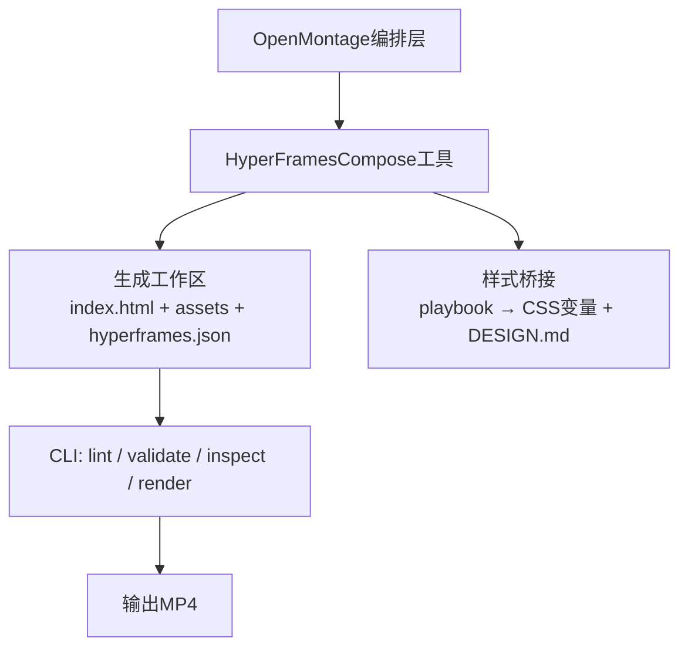
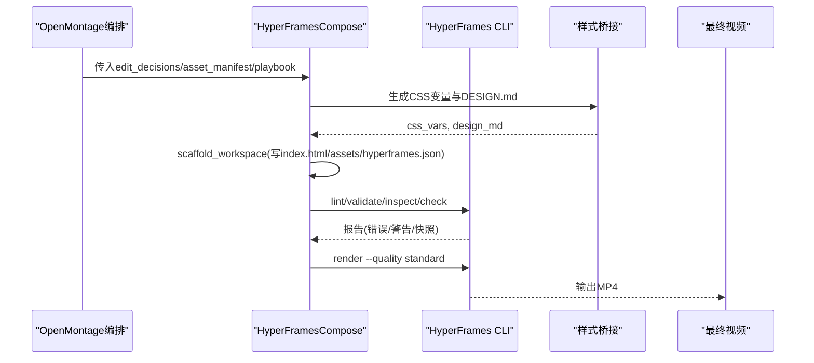
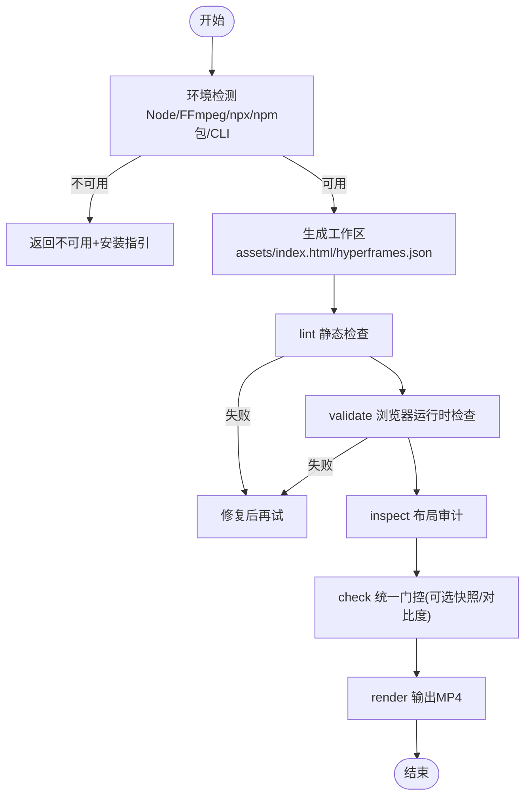
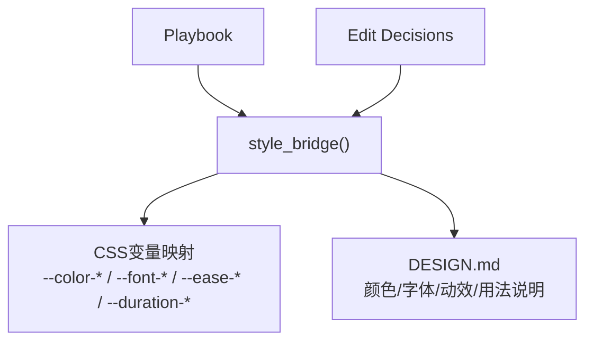
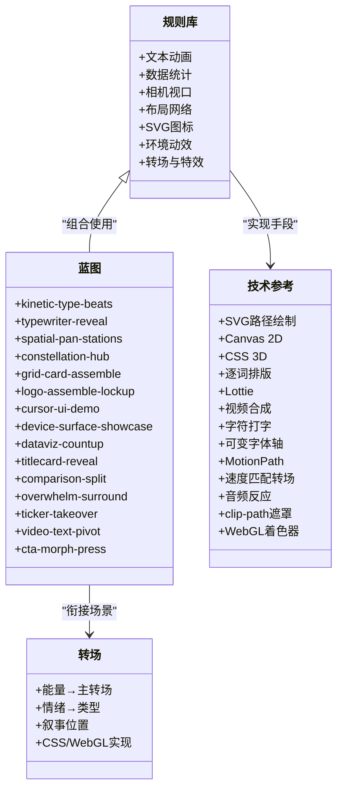
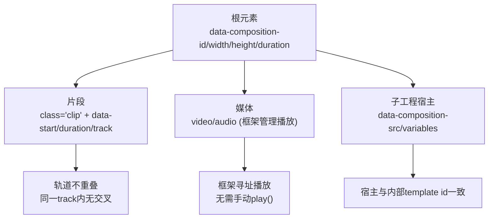
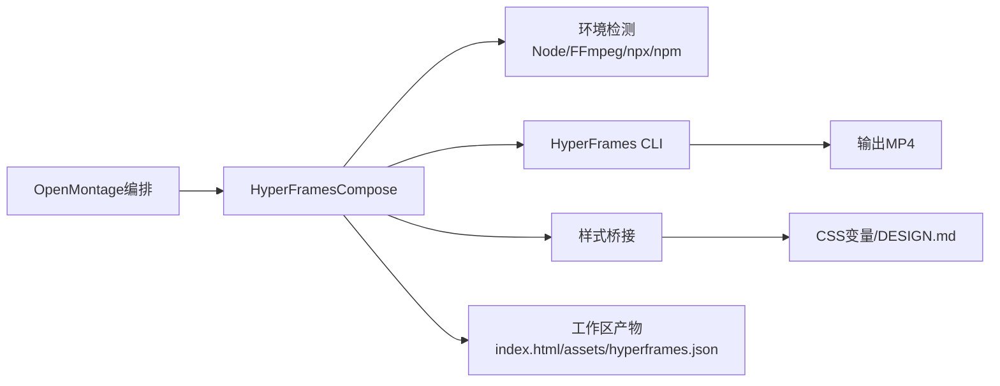

# HyperFrames动画引擎

<cite>
**本文引用的文件**
- [skills/core/hyperframes.md](file://skills/core/hyperframes.md)
- [.agents/skills/hyperframes/SKILL.md](file://.agents/skills/hyperframes/SKILL.md)
- [.agents/skills/hyperframes/PROVENANCE.md](file://.agents/skills/hyperframes/PROVENANCE.md)
- [.agents/skills/hyperframes-core/SKILL.md](file://.agents/skills/hyperframes-core/SKILL.md)
- [.agents/skills/hyperframes-animation/SKILL.md](file://.agents/skills/hyperframes-animation/SKILL.md)
- [.agents/skills/hyperframes-animation/rules-index.md](file://.agents/skills/hyperframes-animation/rules-index.md)
- [.agents/skills/hyperframes-animation/blueprints-index.md](file://.agents/skills/hyperframes-animation/blueprints-index.md)
- [.agents/skills/hyperframes-animation/techniques.md](file://.agents/skills/hyperframes-animation/techniques.md)
- [.agents/skills/hyperframes-animation/transitions/overview.md](file://.agents/skills/hyperframes-animation/transitions/overview.md)
- [.agents/skills/hyperframes-core/references/data-attributes.md](file://.agents/skills/hyperframes-core/references/data-attributes.md)
- [tools/video/hyperframes_compose.py](file://tools/video/hyperframes_compose.py)
- [lib/hyperframes_style_bridge.py](file://lib/hyperframes_style_bridge.py)
</cite>

## 目录
1. [简介](#简介)
2. [项目结构](#项目结构)
3. [核心组件](#核心组件)
4. [架构总览](#架构总览)
5. [详细组件分析](#详细组件分析)
6. [依赖关系分析](#依赖关系分析)
7. [性能考量](#性能考量)
8. [故障排查指南](#故障排查指南)
9. [结论](#结论)
10. [附录](#附录)

## 简介
HyperFrames是OpenMontage中的HTML/GSAP动画引擎，负责将声明式HTML与时间轴驱动的动画渲染为视频。它通过data-*属性声明元素时序、轨道与媒体播放，配合GSAP等运行时实现可寻址、确定性的单条暂停时间线，从而在浏览器中逐帧捕获并输出MP4。OpenMontage在提案阶段选择render_runtime（remotion或hyperframes），并在编排阶段由compose工具生成HyperFrames工作区，执行lint/validate/inspect后渲染。

## 项目结构
- OpenMontage将HyperFrames作为独立runtime：每个项目拥有独立的hyperframes工作区，包含index.html、compositions子工程、assets资源以及CLI配置。
- 编排工具将OpenMontage的edit_decisions、asset_manifest与playbook翻译为HyperFrames工程文件，并驱动CLI完成质量检查与渲染。
- 样式桥接将playbook转换为CSS自定义属性与DESIGN.md，确保视觉系统一致。

图表来源
- [tools/video/hyperframes_compose.py:532-621](file://tools/video/hyperframes_compose.py#L532-L621)
- [lib/hyperframes_style_bridge.py:70-141](file://lib/hyperframes_style_bridge.py#L70-L141)

章节来源
- [skills/core/hyperframes.md:102-164](file://skills/core/hyperframes.md#L102-L164)
- [tools/video/hyperframes_compose.py:532-621](file://tools/video/hyperframes_compose.py#L532-L621)
- [lib/hyperframes_style_bridge.py:70-141](file://lib/hyperframes_style_bridge.py#L70-L141)

## 核心组件
- 编排工具：提供scaffold/lint/validate/inspect/check/render/add_block等操作，统一调用HyperFrames CLI，保证环境可用性与质量门禁。
- 样式桥接：将playbook映射到CSS变量与DESIGN.md，支持颜色、字体、动效节奏的统一管理。
- 动画技能集：原子规则、蓝图、转场、技术参考与多运行时适配器（GSAP默认，支持Lottie/Three.js/Anime.js/CSS/WAAPI/TypeGPU）。
- 数据契约：data-*属性定义根、片段、轨道、媒体、变量与子工程；严格确定性约束保障可寻址与可重复渲染。

章节来源
- [tools/video/hyperframes_compose.py:51-105](file://tools/video/hyperframes_compose.py#L51-L105)
- [.agents/skills/hyperframes-core/SKILL.md:31-59](file://.agents/skills/hyperframes-core/SKILL.md#L31-L59)
- [.agents/skills/hyperframes-animation/SKILL.md:6-58](file://.agents/skills/hyperframes-animation/SKILL.md#L6-L58)
- [.agents/skills/hyperframes-core/references/data-attributes.md:5-48](file://.agents/skills/hyperframes-core/references/data-attributes.md#L5-L48)

## 架构总览
OpenMontage在提案阶段决定使用哪个渲染器；进入compose阶段后，若选择HyperFrames，则由hyperframes_compose生成工作区并驱动CLI完成质量检查与渲染。样式桥接确保视觉一致性；动画技能集提供原子规则与蓝图，转场体系提供场景间过渡方案。

图表来源
- [tools/video/hyperframes_compose.py:532-621](file://tools/video/hyperframes_compose.py#L532-L621)
- [tools/video/hyperframes_compose.py:623-718](file://tools/video/hyperframes_compose.py#L623-L718)
- [lib/hyperframes_style_bridge.py:70-141](file://lib/hyperframes_style_bridge.py#L70-L141)

章节来源
- [skills/core/hyperframes.md:145-164](file://skills/core/hyperframes.md#L145-L164)
- [tools/video/hyperframes_compose.py:766-800](file://tools/video/hyperframes_compose.py#L766-L800)

## 详细组件分析

### 编排工具（HyperFramesCompose）
- 能力：doctor、scaffold_workspace、lint、validate、inspect、check、render、add_block。
- 环境检测：校验Node版本、FFmpeg、npx与npm包解析，运行CLI doctor确认可执行。
- 工作区生成：复制/链接资源、写入hyperframes.json、DESIGN.md与index.html，计算总时长与尺寸。
- 质量门禁：lint静态检查、validate浏览器运行时检查、inspect布局审计、check统一门控。
- 渲染：按quality/fps/strict参数执行render，输出MP4。

图表来源
- [tools/video/hyperframes_compose.py:252-417](file://tools/video/hyperframes_compose.py#L252-L417)
- [tools/video/hyperframes_compose.py:532-621](file://tools/video/hyperframes_compose.py#L532-L621)
- [tools/video/hyperframes_compose.py:623-718](file://tools/video/hyperframes_compose.py#L623-L718)
- [tools/video/hyperframes_compose.py:766-800](file://tools/video/hyperframes_compose.py#L766-L800)

章节来源
- [tools/video/hyperframes_compose.py:51-105](file://tools/video/hyperframes_compose.py#L51-L105)
- [tools/video/hyperframes_compose.py:252-417](file://tools/video/hyperframes_compose.py#L252-L417)
- [tools/video/hyperframes_compose.py:532-621](file://tools/video/hyperframes_compose.py#L532-L621)
- [tools/video/hyperframes_compose.py:623-718](file://tools/video/hyperframes_compose.py#L623-L718)
- [tools/video/hyperframes_compose.py:766-800](file://tools/video/hyperframes_compose.py#L766-L800)

### 样式桥接（Playbook → CSS变量）
- 输入：playbook（visual_language/typography/motion）与edit_decisions元数据。
- 输出：:root CSS变量集合与DESIGN.md说明文档。
- 行为：从playbook提取颜色、字体、动效节奏，合并编辑决策覆盖项，生成可读的设计说明。

图表来源
- [lib/hyperframes_style_bridge.py:70-141](file://lib/hyperframes_style_bridge.py#L70-L141)
- [lib/hyperframes_style_bridge.py:144-195](file://lib/hyperframes_style_bridge.py#L144-L195)

章节来源
- [lib/hyperframes_style_bridge.py:1-15](file://lib/hyperframes_style_bridge.py#L1-L15)
- [lib/hyperframes_style_bridge.py:70-141](file://lib/hyperframes_style_bridge.py#L70-L141)
- [lib/hyperframes_style_bridge.py:144-195](file://lib/hyperframes_style_bridge.py#L144-L195)

### 动画技能集（规则/蓝图/转场/技术）
- 原子规则：文本动画、数据统计、相机视口、布局网络、SVG图标、环境动效、转场与特效等，均基于GSAP且满足确定性约束。
- 蓝图：预设计的时间编码镜头模板，按角色（Hook/Problem/Product_Intro等）匹配，指导每帧的结构与签名动作。
- 转场：场景间过渡策略，能量/情绪/叙事位置驱动选择，提供CSS与WebGL两种实现路径及兼容规则。
- 技术参考：SVG路径绘制、Canvas 2D、CSS 3D、逐词排版、Lottie、视频合成、字符打字、可变字体轴、MotionPath、速度匹配转场、音频反应、clip-path遮罩、WebGL着色器等。

图表来源
- [.agents/skills/hyperframes-animation/rules-index.md:5-80](file://.agents/skills/hyperframes-animation/rules-index.md#L5-L80)
- [.agents/skills/hyperframes-animation/blueprints-index.md:7-69](file://.agents/skills/hyperframes-animation/blueprints-index.md#L7-L69)
- [.agents/skills/hyperframes-animation/transitions/overview.md:17-148](file://.agents/skills/hyperframes-animation/transitions/overview.md#L17-L148)
- [.agents/skills/hyperframes-animation/techniques.md:32-495](file://.agents/skills/hyperframes-animation/techniques.md#L32-L495)

章节来源
- [.agents/skills/hyperframes-animation/SKILL.md:6-58](file://.agents/skills/hyperframes-animation/SKILL.md#L6-L58)
- [.agents/skills/hyperframes-animation/rules-index.md:5-80](file://.agents/skills/hyperframes-animation/rules-index.md#L5-L80)
- [.agents/skills/hyperframes-animation/blueprints-index.md:7-69](file://.agents/skills/hyperframes-animation/blueprints-index.md#L7-L69)
- [.agents/skills/hyperframes-animation/transitions/overview.md:17-148](file://.agents/skills/hyperframes-animation/transitions/overview.md#L17-L148)
- [.agents/skills/hyperframes-animation/techniques.md:32-495](file://.agents/skills/hyperframes-animation/techniques.md#L32-L495)

### 数据契约（data-*属性）
- 根元素：data-composition-id、data-width/height、data-duration、data-fps、data-composition-variables。
- 片段：id、data-start、data-duration、data-track-index、data-media-start、data-volume、data-has-audio；可见元素需class="clip"。
- 子工程宿主：data-composition-id、data-composition-src、data-width/height、data-variable-values。
- 作者提示：id命名约定、溢出控制、布局审计豁免等。

图表来源
- [.agents/skills/hyperframes-core/references/data-attributes.md:5-48](file://.agents/skills/hyperframes-core/references/data-attributes.md#L5-L48)
- [.agents/skills/hyperframes-core/references/data-attributes.md:50-59](file://.agents/skills/hyperframes-core/references/data-attributes.md#L50-L59)

章节来源
- [.agents/skills/hyperframes-core/references/data-attributes.md:5-48](file://.agents/skills/hyperframes-core/references/data-attributes.md#L5-L48)
- [.agents/skills/hyperframes-core/references/data-attributes.md:50-59](file://.agents/skills/hyperframes-core/references/data-attributes.md#L50-L59)

### 与Remotion协作与迁移
- 当存在现成React场景栈或需要逐字字幕烧录时，优先Remotion；HyperFrames更适合HTML/GSAP原生、注册表块驱动与网站转视频。
- 若用户明确要求迁移，可使用remotion-to-hyperframes流程进行单向转换与评估。

章节来源
- [skills/core/hyperframes.md:29-98](file://skills/core/hyperframes.md#L29-L98)
- [.agents/skills/hyperframes/SKILL.md:159-163](file://.agents/skills/hyperframes/SKILL.md#L159-L163)

## 依赖关系分析
- 外部依赖：Node.js ≥ 22、FFmpeg、npx与npm包hyperframes可解析并可执行。
- 内部依赖：OpenMontage编排层调用hyperframes_compose；样式桥接注入CSS变量；动画技能集提供规则与蓝图；转场体系提供场景过渡。
- 耦合与内聚：编排工具高内聚于工作区生成与CLI调度；样式桥接低耦合仅产出CSS与文档；动画技能集模块化，便于复用与扩展。

图表来源
- [tools/video/hyperframes_compose.py:252-417](file://tools/video/hyperframes_compose.py#L252-L417)
- [lib/hyperframes_style_bridge.py:70-141](file://lib/hyperframes_style_bridge.py#L70-L141)

章节来源
- [tools/video/hyperframes_compose.py:252-417](file://tools/video/hyperframes_compose.py#L252-L417)
- [lib/hyperframes_style_bridge.py:70-141](file://lib/hyperframes_style_bridge.py#L70-L141)

## 性能考量
- 并行捕获：视频密集场景建议workers=1以避免无头Chrome过载。
- 关键帧密度：下载素材需重编码以缩短关键帧间隔，避免渲染卡顿。
- 背景视频陷阱：确保源分辨率与裁切正确，避免小画面黑边。
- 字体编译：使用确定性字体映射支持的字体，避免回退导致不一致。
- 预览先行：在长渲染前进行preview/scrub验证布局与可读性。

章节来源
- [skills/core/hyperframes.md:301-418](file://skills/core/hyperframes.md#L301-L418)

## 故障排查指南
- 环境不可用：检查Node版本、FFmpeg、npx与npm包解析；运行doctor获取诊断信息。
- 工作区缺失：先执行scaffold_workspace生成index.html与assets。
- 质量门禁失败：根据lint/validate/inspect报告定位问题（重复ID、轨道重叠、未注册时间线、对比度不足等）。
- 渲染失败：查看CLI输出尾部日志，必要时降低并发或调整质量等级。
- 布局溢出：合理使用data-layout-allow-overflow与data-layout-ignore，避免误屏蔽真实内容。

章节来源
- [tools/video/hyperframes_compose.py:494-530](file://tools/video/hyperframes_compose.py#L494-L530)
- [tools/video/hyperframes_compose.py:623-718](file://tools/video/hyperframes_compose.py#L623-L718)
- [.agents/skills/hyperframes-core/references/data-attributes.md:50-59](file://.agents/skills/hyperframes-core/references/data-attributes.md#L50-L59)

## 结论
HyperFrames在OpenMontage中承担HTML/GSAP动画引擎的角色，通过声明式data-*契约、严格的确定性约束与完善的CLI质量门禁，实现了可维护、可复现的视频渲染流程。结合样式桥接与丰富的动画技能集，能够高效构建文字动画、图形变换、粒子效果与转场序列，并通过数据驱动方式生成动态视频内容。遵循最佳实践与性能优化建议，可在保证质量的同时提升渲染效率与稳定性。

## 附录

### 常见动画模式与示例路径
- 文字动画：逐词出现、打字机效果、关键词高亮、3D深度层叠、节拍撞击等。
  - 参考：[rules-index.md:5-17](file://.agents/skills/hyperframes-animation/rules-index.md#L5-L17)、[techniques.md:132-173](file://.agents/skills/hyperframes-animation/techniques.md#L132-L173)、[techniques.md:228-261](file://.agents/skills/hyperframes-animation/techniques.md#L228-L261)
- 图形变换：SVG路径绘制、3D卡片翻转、视口缩放/平移、运动轨迹、clip-path遮罩。
  - 参考：[techniques.md:32-59](file://.agents/skills/hyperframes-animation/techniques.md#L32-L59)、[techniques.md:112-129](file://.agents/skills/hyperframes-animation/techniques.md#L112-L129)、[techniques.md:298-319](file://.agents/skills/hyperframes-animation/techniques.md#L298-L319)、[techniques.md:395-425](file://.agents/skills/hyperframes-animation/techniques.md#L395-L425)
- 粒子效果：Canvas 2D程序化艺术、WebGL着色器背景、音频反应驱动。
  - 参考：[techniques.md:62-109](file://.agents/skills/hyperframes-animation/techniques.md#L62-L109)、[techniques.md:428-495](file://.agents/skills/hyperframes-animation/techniques.md#L428-L495)、[techniques.md:357-392](file://.agents/skills/hyperframes-animation/techniques.md#L357-L392)

### 响应式设计与媒体集成
- 媒体元素：video/audio必须为宿主根的直接子元素，框架管理播放与寻址；可见元素需class="clip"。
- 轨道与片段：同轨道片段不得重叠；媒体偏移与音量可通过data属性或时间线动画控制。
- 子工程：宿主与内部template的data-composition-id必须一致，变量可按实例覆盖。

章节来源
- [.agents/skills/hyperframes-core/references/data-attributes.md:5-48](file://.agents/skills/hyperframes-core/references/data-attributes.md#L5-L48)

### 调试方法
- 使用inspect采样布局与感知问题，必要时添加data-layout-allow-overflow或data-layout-ignore。
- 使用snapshot在中间时间点截图，人工核对关键帧。
- 使用preview在浏览器中交互式审查时间线与元素状态。

章节来源
- [.agents/skills/hyperframes-core/SKILL.md:69-79](file://.agents/skills/hyperframes-core/SKILL.md#L69-L79)