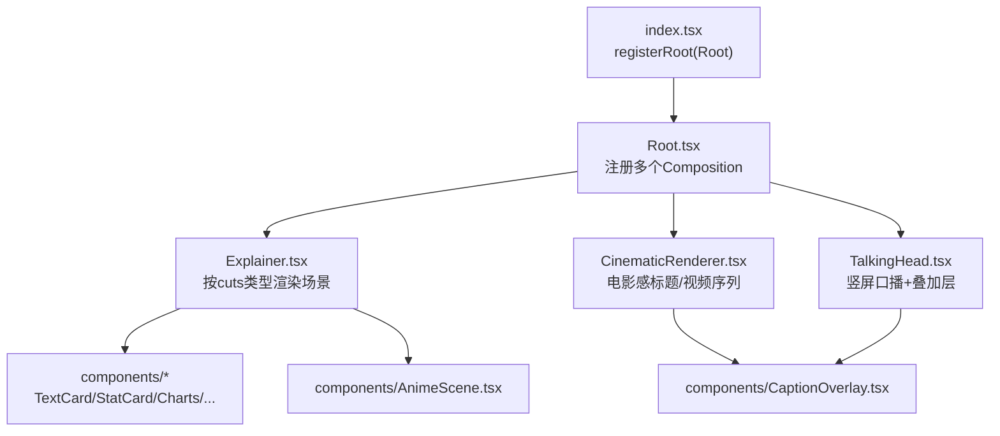
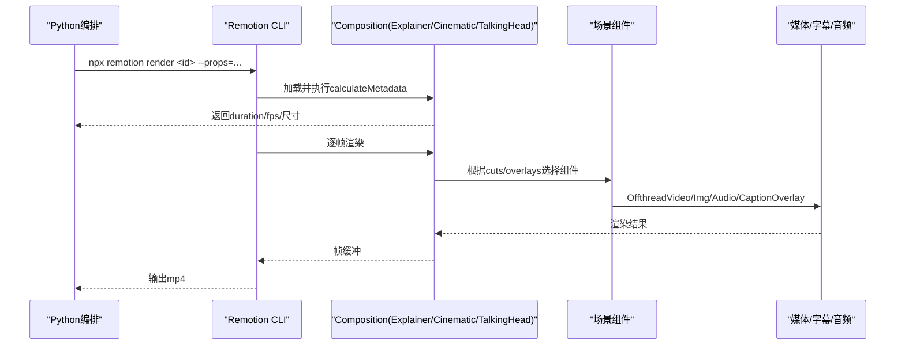
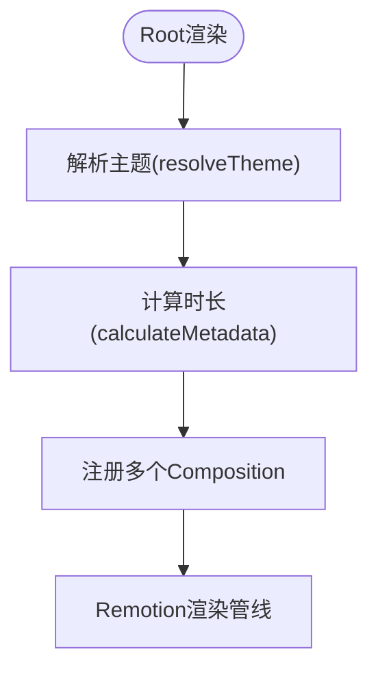
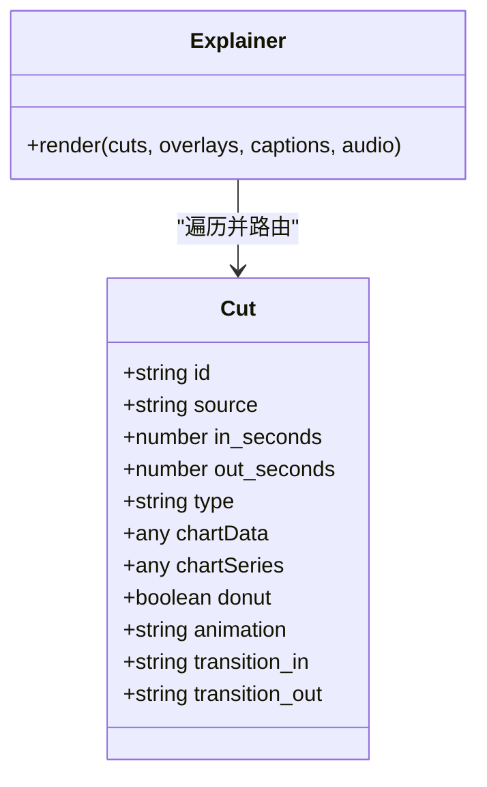
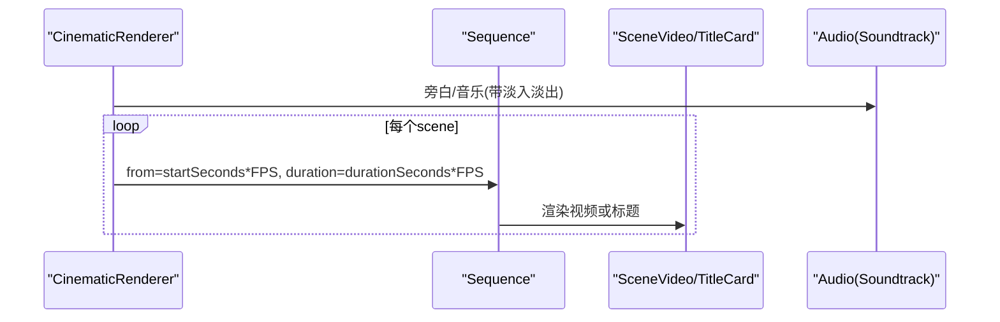
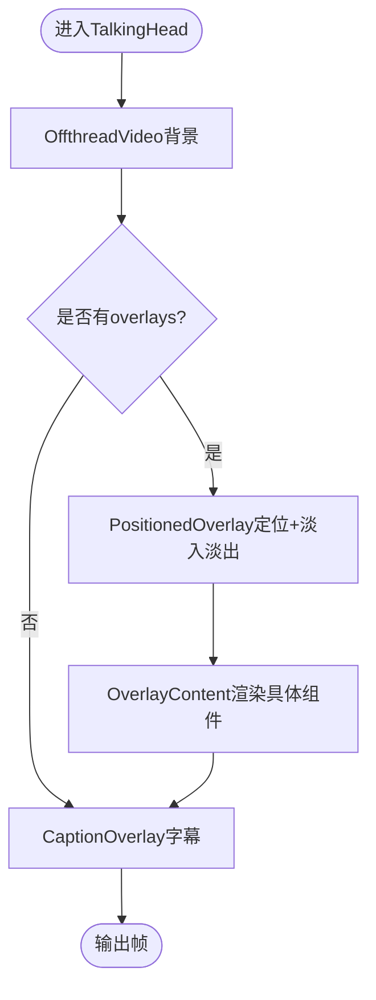
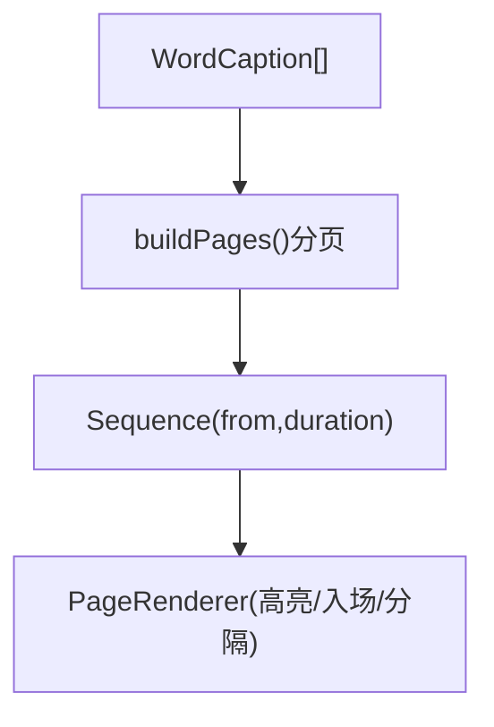
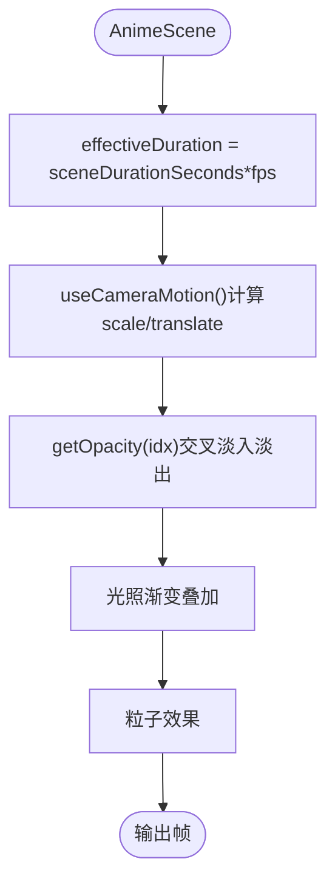
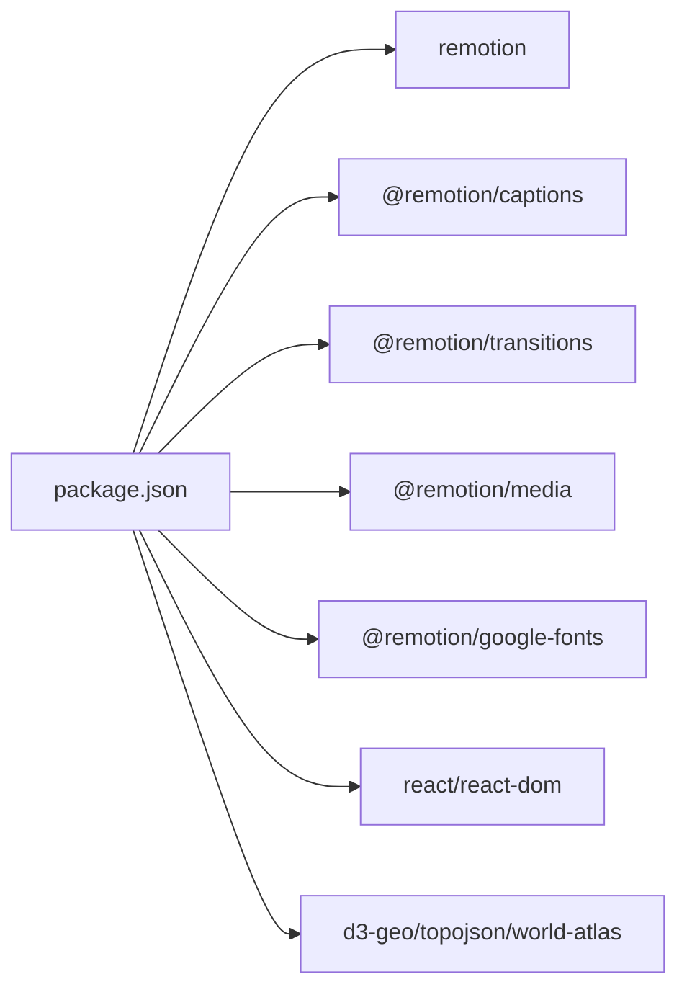

# Remotion渲染器

<cite>
**本文引用的文件**
- [package.json](file://remotion-composer/package.json)
- [index.tsx](file://remotion-composer/src/index.tsx)
- [Root.tsx](file://remotion-composer/src/Root.tsx)
- [Explainer.tsx](file://remotion-composer/src/Explainer.tsx)
- [CinematicRenderer.tsx](file://remotion-composer/src/CinematicRenderer.tsx)
- [TalkingHead.tsx](file://remotion-composer/src/TalkingHead.tsx)
- [CaptionOverlay.tsx](file://remotion-composer/src/components/CaptionOverlay.tsx)
- [AnimeScene.tsx](file://remotion-composer/src/components/AnimeScene.tsx)
- [skills/core/remotion.md](file://skills/core/remotion.md)
</cite>

## 目录
1. [简介](#简介)
2. [项目结构](#项目结构)
3. [核心组件](#核心组件)
4. [架构总览](#架构总览)
5. [详细组件分析](#详细组件分析)
6. [依赖关系分析](#依赖关系分析)
7. [性能考量](#性能考量)
8. [故障排查指南](#故障排查指南)
9. [结论](#结论)
10. [附录](#附录)

## 简介
本技术文档聚焦OpenMontage中的Remotion渲染器，阐述其作为React-based视频渲染引擎在项目中的应用方式：组件化视频制作、时间轴控制、媒体处理与导出。文档覆盖Remotion项目的结构组织、组件开发模式与生命周期管理；说明如何创建可复用视频组件、处理异步数据与实现复杂动画序列；提供文本动画、图表可视化、图像合成与视频叠加的具体示例思路；并给出与外部工具的集成建议、性能优化策略、测试方法、调试技巧与部署流程。

## 项目结构
Remotion子工程位于 remotion-composer，采用“入口注册 + 多Composition + 可复用组件”的组织方式：
- 入口注册：index.tsx 通过 registerRoot 挂载根组件 Root
- 根组件：Root.tsx 集中注册多个 Composition（Explainer、CinematicRenderer、TalkingHead、TitledVideo、HeroTitle、ProductReveal、CaptionOverlayOnly、CollageBurst、LyricOverlay、EndTag 等），并提供主题系统与动态时长计算
- 场景与渲染器：Explainer.tsx 负责按 cuts 类型分发到具体组件；CinematicRenderer.tsx 用于电影感标题/视频序列；TalkingHead.tsx 用于竖屏口播+叠加层
- 通用组件：components 下包含 CaptionOverlay、AnimeScene、TextCard、StatCard、CalloutBox、ComparisonCard、BarChart、LineChart、PieChart、KPIGrid、ProgressBar、HeroTitle、SectionTitle、StatReveal、TerminalScene、ScreenshotScene、ProviderChip、EndTag、ProductReveal、ParticleOverlay 等
- 资源与配置：public/demo-props 存放演示用 props JSON；package.json 声明依赖与脚本

**图示来源**
- [index.tsx:1-5](file://remotion-composer/src/index.tsx#L1-L5)
- [Root.tsx:135-333](file://remotion-composer/src/Root.tsx#L135-L333)
- [Explainer.tsx:558-775](file://remotion-composer/src/Explainer.tsx#L558-L775)
- [CinematicRenderer.tsx:458-529](file://remotion-composer/src/CinematicRenderer.tsx#L458-L529)
- [TalkingHead.tsx:313-365](file://remotion-composer/src/TalkingHead.tsx#L313-L365)

**章节来源**
- [package.json:1-36](file://remotion-composer/package.json#L1-L36)
- [index.tsx:1-5](file://remotion-composer/src/index.tsx#L1-L5)
- [Root.tsx:1-336](file://remotion-composer/src/Root.tsx#L1-L336)

## 核心组件
- 根注册与主题系统
  - Root.tsx 定义 ThemeConfig 与 THEMES，提供 resolveTheme 根据 props 或 playbook 选择主题；同时集中注册多个 Composition，并通过 calculateMetadata 动态计算时长
- Explainer 场景编排
  - Explainer.tsx 支持多种 cut.type（text_card、stat_card、hero_title、callout、comparison、bar_chart、line_chart、pie_chart、kpi_grid、progress_bar、anime_scene、terminal_scene、screenshot_scene），以及背景图/视频叠加、字幕与音频层
- CinematicRenderer 电影感序列
  - CinematicRenderer.tsx 将视频片段与标题卡组合为 Sequence，支持淡入淡出、缩放、滤镜、色调渐变、字幕与音轨分层
- TalkingHead 竖屏口播
  - TalkingHead.tsx 以 OffthreadVideo 为背景，叠加多种组件（图表、统计、提示框等）与词级字幕，适配 9:16 布局
- 词级字幕
  - CaptionOverlay.tsx 将词级时间戳分页显示，支持高亮当前词、页内切换、CJK无空格分隔符等

**章节来源**
- [Root.tsx:24-121](file://remotion-composer/src/Root.tsx#L24-L121)
- [Root.tsx:123-333](file://remotion-composer/src/Root.tsx#L123-L333)
- [Explainer.tsx:187-311](file://remotion-composer/src/Explainer.tsx#L187-L311)
- [Explainer.tsx:558-775](file://remotion-composer/src/Explainer.tsx#L558-L775)
- [CinematicRenderer.tsx:40-115](file://remotion-composer/src/CinematicRenderer.tsx#L40-L115)
- [CinematicRenderer.tsx:162-386](file://remotion-composer/src/CinematicRenderer.tsx#L162-L386)
- [CinematicRenderer.tsx:441-529](file://remotion-composer/src/CinematicRenderer.tsx#L441-L529)
- [TalkingHead.tsx:27-65](file://remotion-composer/src/TalkingHead.tsx#L27-L65)
- [TalkingHead.tsx:71-107](file://remotion-composer/src/TalkingHead.tsx#L71-L107)
- [TalkingHead.tsx:113-245](file://remotion-composer/src/TalkingHead.tsx#L113-L245)
- [TalkingHead.tsx:298-365](file://remotion-composer/src/TalkingHead.tsx#L298-L365)
- [CaptionOverlay.tsx:10-58](file://remotion-composer/src/components/CaptionOverlay.tsx#L10-L58)
- [CaptionOverlay.tsx:60-178](file://remotion-composer/src/components/CaptionOverlay.tsx#L60-L178)

## 架构总览
Remotion渲染器在OpenMontage中承担最终视频合成的职责：Python侧生成 composition props（如 cuts、overlays、captions、audio），通过 CLI 调用 Remotion 渲染，输出 mp4。Root.tsx 暴露多个 Composition，分别对应不同用途（解释型视频、电影感标题、口播、产品发布、纯字幕等）。Explainer 是通用编排器，依据 cut.type 路由到具体组件；CinematicRenderer 专注视频+标题的序列；TalkingHead 专注竖屏叠加与字幕。

**图示来源**
- [Root.tsx:123-152](file://remotion-composer/src/Root.tsx#L123-L152)
- [Root.tsx:153-333](file://remotion-composer/src/Root.tsx#L153-L333)
- [Explainer.tsx:558-775](file://remotion-composer/src/Explainer.tsx#L558-L775)
- [CinematicRenderer.tsx:441-529](file://remotion-composer/src/CinematicRenderer.tsx#L441-L529)
- [TalkingHead.tsx:313-365](file://remotion-composer/src/TalkingHead.tsx#L313-L365)

## 详细组件分析

### 根组件与主题系统（Root.tsx）
- 主题配置：定义 ThemeConfig 与多套主题（clean-professional、flat-motion-graphics、minimalist-diagram、anime-ghibli），包含颜色、字体、图表色板、弹簧参数、过渡时长、字幕高亮等
- 主题解析：resolveTheme 支持从 props.theme/playbook/themeConfig 中选择或合并主题
- 动态时长：calculateMetadata 基于 cuts 的 out_seconds 计算总时长，保证结尾留白
- Composition注册：集中注册多个 Composition，设置 id、component、fps、宽高、默认props与动态时长函数

**图示来源**
- [Root.tsx:24-121](file://remotion-composer/src/Root.tsx#L24-L121)
- [Root.tsx:123-152](file://remotion-composer/src/Root.tsx#L123-L152)
- [Root.tsx:153-333](file://remotion-composer/src/Root.tsx#L153-L333)

**章节来源**
- [Root.tsx:1-336](file://remotion-composer/src/Root.tsx#L1-L336)

### Explainer 场景编排（Explainer.tsx）
- 场景类型路由：根据 cut.type 渲染 TextCard、StatCard、CalloutBox、ComparisonCard、BarChart、LineChart、PieChart、KPIGrid、ProgressBar、HeroTitle、AnimeScene、TerminalScene、ScreenshotScene 等
- 背景层：支持 backgroundImage 与 backgroundVideo 叠加，并可调节遮罩透明度
- 媒体场景：ImageScene/VideoScene 支持缩放、平移、Ken Burns、视差等相机运动，以及淡入淡出过渡
- 字幕与音频：支持 WordCaption 词级字幕与 Audio 层（旁白、音乐、SFX）

**图示来源**
- [Explainer.tsx:187-311](file://remotion-composer/src/Explainer.tsx#L187-L311)
- [Explainer.tsx:558-775](file://remotion-composer/src/Explainer.tsx#L558-L775)

**章节来源**
- [Explainer.tsx:1-800](file://remotion-composer/src/Explainer.tsx#L1-L800)

### CinematicRenderer 电影感序列（CinematicRenderer.tsx）
- 视频片段：SceneVideo 支持 trimBefore/trimAfter、播放速率、缩放、滤镜、色调渐变与暗角
- 标题卡：TitleCard 支持多行文本、字级交错出现、光晕线条、背景模糊视频、变体 plate/overlay
- 音轨：Soundtrack 支持淡入淡出、音量曲线、裁剪
- 动态时长：calculateCinematicMetadata 根据 scenes 的最大结束时间计算总时长

**图示来源**
- [CinematicRenderer.tsx:40-115](file://remotion-composer/src/CinematicRenderer.tsx#L40-L115)
- [CinematicRenderer.tsx:162-386](file://remotion-composer/src/CinematicRenderer.tsx#L162-L386)
- [CinematicRenderer.tsx:388-439](file://remotion-composer/src/CinematicRenderer.tsx#L388-L439)
- [CinematicRenderer.tsx:441-529](file://remotion-composer/src/CinematicRenderer.tsx#L441-L529)

**章节来源**
- [CinematicRenderer.tsx:1-530](file://remotion-composer/src/CinematicRenderer.tsx#L1-L530)

### TalkingHead 竖屏口播（TalkingHead.tsx）
- 背景：OffthreadVideo 铺满全屏
- 叠加层：PositionedOverlay 支持 lower_third/upper_third/left_panel/right_panel/full_overlay 位置预设，带淡入淡出
- 内容：OverlayContent 映射到 TextCard、StatCard、CalloutBox、ComparisonCard、BarChart、LineChart、PieChart、KPIGrid、HeroTitle、SectionTitle、StatReveal
- 字幕：CaptionOverlay 词级高亮字幕，支持自定义字号、颜色、背景、分隔符

**图示来源**
- [TalkingHead.tsx:71-107](file://remotion-composer/src/TalkingHead.tsx#L71-L107)
- [TalkingHead.tsx:113-245](file://remotion-composer/src/TalkingHead.tsx#L113-L245)
- [TalkingHead.tsx:298-365](file://remotion-composer/src/TalkingHead.tsx#L298-L365)

**章节来源**
- [TalkingHead.tsx:1-366](file://remotion-composer/src/TalkingHead.tsx#L1-L366)

### 词级字幕（CaptionOverlay.tsx）
- 分页：buildPages 将 words 按 wordsPerPage 或 pageBreakAfter 切分为页面
- 渲染：PageRenderer 使用 spring 入场、interpolate 高亮当前词、支持CJK无空格分隔
- 时序：Sequence 根据 startMs/endMs 精确控制每页显示区间

**图示来源**
- [CaptionOverlay.tsx:10-58](file://remotion-composer/src/components/CaptionOverlay.tsx#L10-L58)
- [CaptionOverlay.tsx:60-178](file://remotion-composer/src/components/CaptionOverlay.tsx#L60-L178)

**章节来源**
- [CaptionOverlay.tsx:1-178](file://remotion-composer/src/components/CaptionOverlay.tsx#L1-L178)

### 动漫场景（AnimeScene.tsx）
- 多图交叉淡入淡出：按 segmentDur 分配时间片，crossfadeDur 重叠避免黑场
- 相机运动：zoom-in/out、pan-left/right、ken-burns、drift-up/down、parallax、static
- 光照渐变：lightingFrom/lightingTo 线性渐变叠加
- 粒子效果：ParticleOverlay 支持 fireflies/petals/sparkles/mist/light-rays
- 关键约束：必须传入 sceneDurationSeconds 以避免 useVideoConfig().durationInFrames 返回整段时长导致的时序错误

**图示来源**
- [AnimeScene.tsx:16-55](file://remotion-composer/src/components/AnimeScene.tsx#L16-L55)
- [AnimeScene.tsx:75-127](file://remotion-composer/src/components/AnimeScene.tsx#L75-L127)
- [AnimeScene.tsx:133-288](file://remotion-composer/src/components/AnimeScene.tsx#L133-L288)

**章节来源**
- [AnimeScene.tsx:1-288](file://remotion-composer/src/components/AnimeScene.tsx#L1-L288)

## 依赖关系分析
- 运行时依赖：remotion、@remotion/captions、@remotion/player、@remotion/transitions、@remotion/media、@remotion/google-fonts、react/react-dom、d3-geo、topojson-client、world-atlas
- 构建与脚本：start 启动Studio，build 执行渲染命令，upgrade 升级Remotion
- 版本覆盖：overrides.nanoid 固定安全版本

**图示来源**
- [package.json:10-24](file://remotion-composer/package.json#L10-L24)

**章节来源**
- [package.json:1-36](file://remotion-composer/package.json#L1-L36)

## 性能考量
- 使用 useCurrentFrame()/interpolate()/spring() 进行帧级动画，避免CSS动画与Tailwind animate-*类
- 对 interpolate 始终使用 clamp 外推，防止越界值导致异常
- 注意 useVideoConfig().durationInFrames 返回的是 Composition 总时长，不是 Sequence 时长；在 AnimeScene 等场景中需通过 sceneDurationSeconds 修正
- 渲染串行执行，避免并行导致内存不足；确保 Node.js 18+
- 合理使用 OffthreadVideo 与静态资源路径，减少重复加载
- 字幕分页与词级高亮仅在需要时启用，降低渲染压力

[本节为通用指导，不直接分析具体文件]

## 故障排查指南
- 预渲染校验：在渲染前运行 composition_validator，检查缺失资源、音频时长不匹配、无效剪辑时序等问题
- 音频验证：使用 ffprobe 确认输出包含音频流；若缺失，检查 Remotion audio 配置是否包含 narration/music
- 字幕核对：对输出音频进行转写，对比脚本字数，确保未截断
- 常见陷阱：
  - 忘记传 sceneDurationSeconds 导致 AnimeScene 时序错乱
  - 使用 CSS 动画或 Tailwind animate-* 导致帧渲染异常
  - 未对 interpolate 做 clamp 导致数值溢出
  - 资源路径未通过 resolveAsset 或 staticFile 正确引用

**章节来源**
- [skills/core/remotion.md:121-143](file://skills/core/remotion.md#L121-L143)
- [skills/core/remotion.md:324-332](file://skills/core/remotion.md#L324-L332)
- [skills/core/remotion.md:333-377](file://skills/core/remotion.md#L333-L377)

## 结论
OpenMontage 的 Remotion 渲染器以 Root.tsx 为中心，统一注册多类 Composition，结合 Explainer/CinematicRenderer/TalkingHead 等场景编排器，实现了高度组件化的视频制作能力。通过词级字幕、多图层媒体、主题系统与动态时长计算，满足从解释型视频到电影感标题、竖屏口播等多种需求。遵循最佳实践（帧级动画、clamp、sceneDurationSeconds、预校验与后验）可显著提升稳定性与质量。

[本节为总结性内容，不直接分析具体文件]

## 附录

### 快速开始与渲染命令
- 启动本地预览：npx remotion studio
- 渲染默认 Composition（Explainer）：npx remotion render src/index.tsx Explainer out/video.mp4
- 指定媒体规格与编码：npx remotion render ... --width=1080 --height=1920 --fps=30 --codec=h264 --crf=18

**章节来源**
- [package.json:5-8](file://remotion-composer/package.json#L5-L8)
- [skills/core/remotion.md:181-201](file://skills/core/remotion.md#L181-L201)

### 组件开发模式与生命周期
- 组件职责单一：每个 cut.type 对应一个组件，便于复用与维护
- 生命周期：使用 useCurrentFrame/useVideoConfig 获取帧与时序；Sequence 控制显示区间；interpolate/spring 驱动动画
- 数据流：Python 生成 props → Root 注册 Composition → Explainer/Cinematic/TalkingHead 渲染 → 输出帧

**章节来源**
- [Explainer.tsx:558-775](file://remotion-composer/src/Explainer.tsx#L558-L775)
- [CinematicRenderer.tsx:441-529](file://remotion-composer/src/CinematicRenderer.tsx#L441-L529)
- [TalkingHead.tsx:313-365](file://remotion-composer/src/TalkingHead.tsx#L313-L365)

### 与外部工具集成建议
- Three.js：可在独立 Canvas 中渲染 3D 场景，通过截图或离屏渲染接入 Remotion 画面层
- Lottie：将动画导出为 JSON，使用 @remotion/lottie 或自定义组件加载并同步时间轴
- GSAP：在浏览器环境可用，但在 Remotion 渲染中优先使用 useCurrentFrame/interpolate/spring 以保证帧一致性
- FFmpeg：用于简单裁剪、拼接、字幕烧录、格式转换等非组成式操作

[本节为通用指导，不直接分析具体文件]

### 测试与调试
- 单元测试：针对组件输入输出与动画边界条件编写测试（如字幕分页、插值范围）
- 集成测试：端到端渲染小样视频，校验分辨率、帧率、时长、音频存在性
- 调试技巧：
  - 使用 Studio 实时预览与步进调试
  - 打印关键帧值与插值结果，验证时序
  - 对资源路径与字体加载进行断点检查

[本节为通用指导，不直接分析具体文件]

### 部署与流水线
- 构建产物：npm build 生成视频文件
- 流水线集成：Python 编排生成 props 并调用 Remotion CLI；完成后执行 ffprobe 校验与 WhisperX 转写校验
- 平台适配：根据 media profile 调整 width/height/fps（如 YouTube Shorts、TikTok、Instagram Reels、Cinematic Wide）

**章节来源**
- [skills/core/remotion.md:203-213](file://skills/core/remotion.md#L203-L213)
- [skills/core/remotion.md:333-377](file://skills/core/remotion.md#L333-L377)