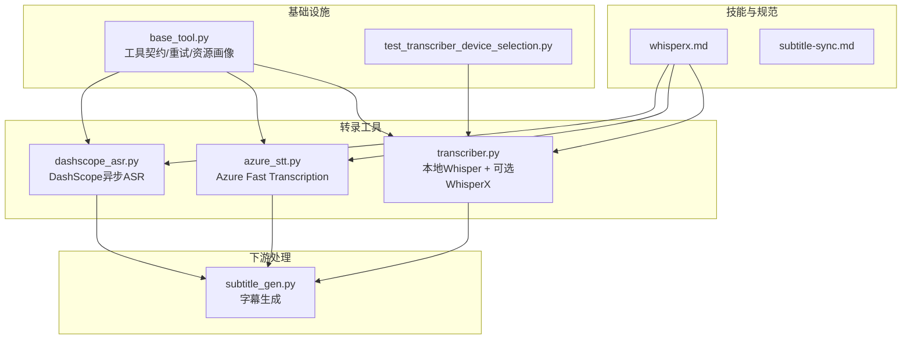
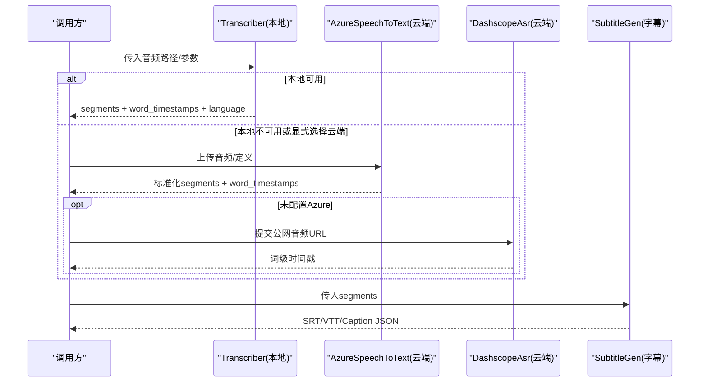
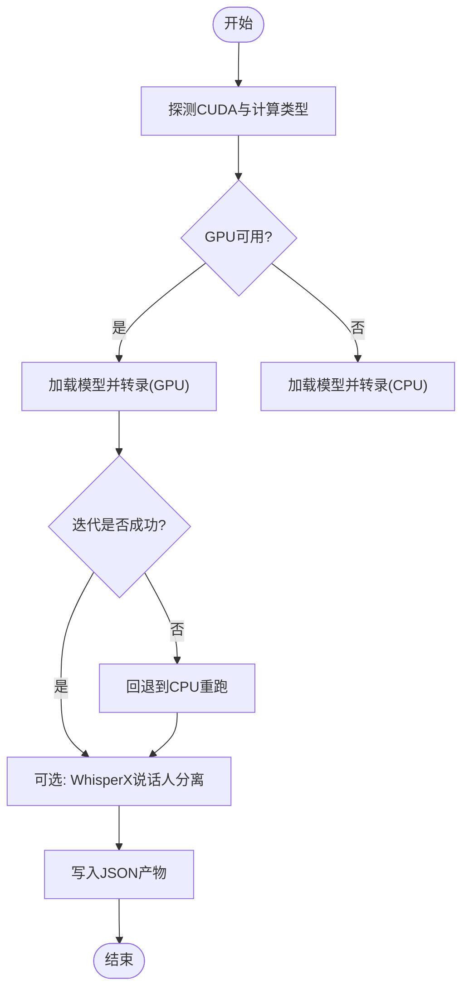
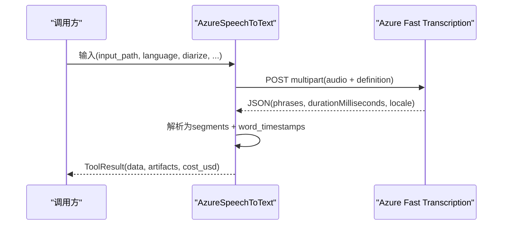
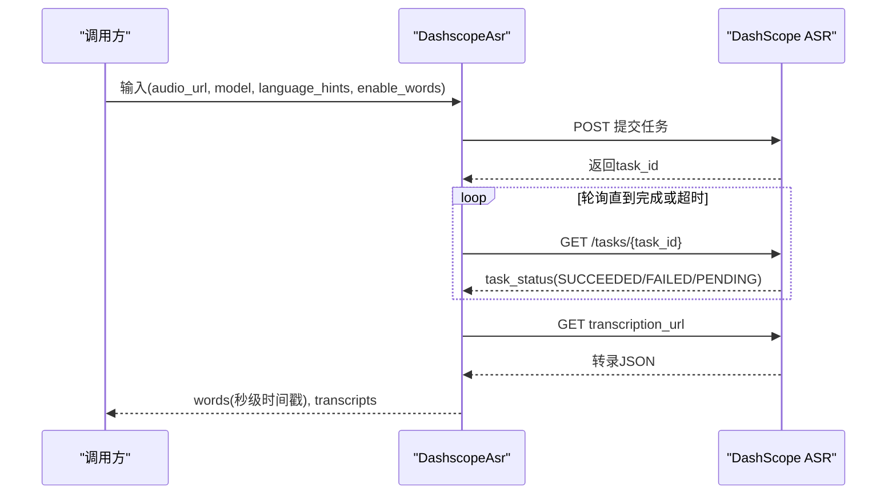
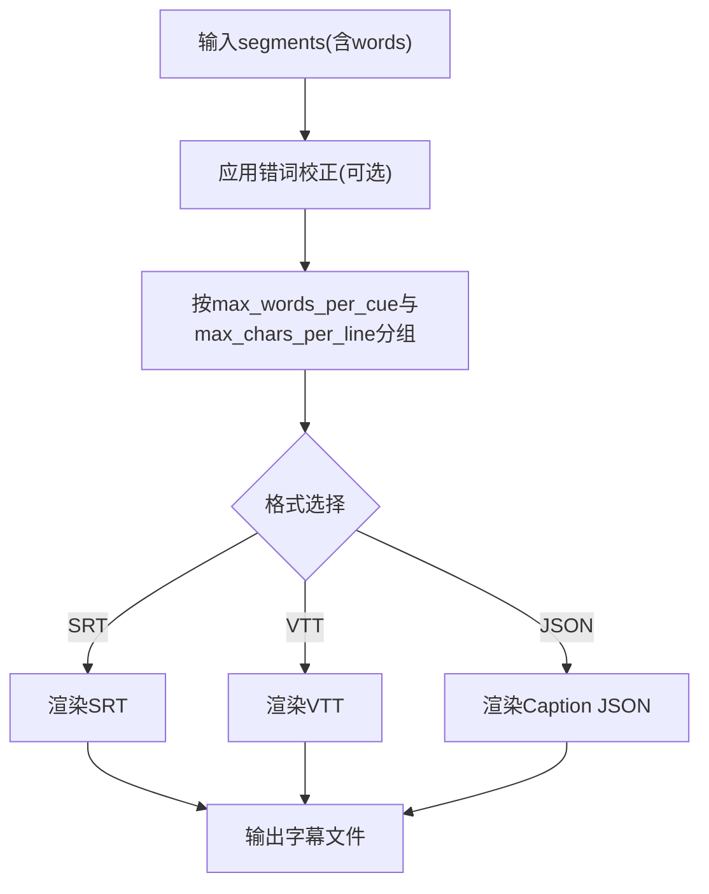
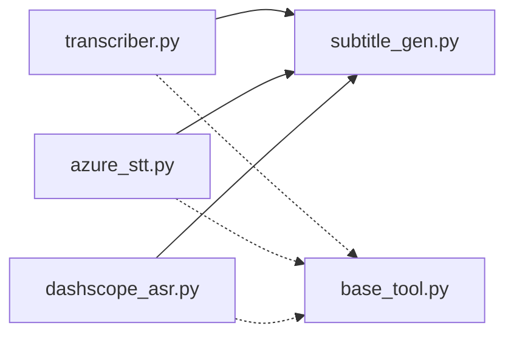

# WhisperX语音识别

<cite>
**本文引用的文件**
- [skills/core/whisperx.md](file://skills/core/whisperx.md)
- [tools/analysis/transcriber.py](file://tools/analysis/transcriber.py)
- [tools/analysis/azure_stt.py](file://tools/analysis/azure_stt.py)
- [tools/analysis/dashscope_asr.py](file://tools/analysis/dashscope_asr.py)
- [tools/subtitle/subtitle_gen.py](file://tools/subtitle/subtitle_gen.py)
- [skills/core/subtitle-sync.md](file://skills/core/subtitle-sync.md)
- [tests/tools/test_transcriber_device_selection.py](file://tests/tools/test_transcriber_device_selection.py)
- [tools/base_tool.py](file://tools/base_tool.py)
</cite>

## 目录
1. [简介](#简介)
2. [项目结构](#项目结构)
3. [核心组件](#核心组件)
4. [架构总览](#架构总览)
5. [详细组件分析](#详细组件分析)
6. [依赖关系分析](#依赖关系分析)
7. [性能与资源优化](#性能与资源优化)
8. [故障排查指南](#故障排查指南)
9. [结论](#结论)
10. [附录：配置与使用示例](#附录：配置与使用示例)

## 简介
本技术文档聚焦于OpenMontage中的WhisperX语音识别技能，系统介绍其作为高精度语音识别引擎的集成方式与能力边界。内容涵盖：
- 本地Whisper（faster-whisper）与可选WhisperX说话人分离（diarization）
- 云端后端Azure Speech-to-Text、DashScope ASR的接入与对比
- 转录结果的结构化输出、置信度评分与质量过滤
- 音频文件处理、流式/批量处理策略、并发与内存管理
- 错误处理、重试机制与成本优化建议
- 字幕生成与时间戳对齐的最佳实践

## 项目结构
围绕语音识别的核心代码分布在以下位置：
- 技能说明与最佳实践：skills/core/whisperx.md、skills/core/subtitle-sync.md
- 本地转录工具：tools/analysis/transcriber.py（基于faster-whisper，可选WhisperX diarization）
- 云端转录工具：tools/analysis/azure_stt.py（Azure Fast Transcription）、tools/analysis/dashscope_asr.py（DashScope异步ASR）
- 字幕生成：tools/subtitle/subtitle_gen.py（SRT/VTT/Caption JSON）
- 基础工具契约与执行框架：tools/base_tool.py
- 设备选择与回退测试：tests/tools/test_transcriber_device_selection.py

图表来源
- [skills/core/whisperx.md:1-64](file://skills/core/whisperx.md#L1-L64)
- [tools/analysis/transcriber.py:1-280](file://tools/analysis/transcriber.py#L1-L280)
- [tools/analysis/azure_stt.py:1-366](file://tools/analysis/azure_stt.py#L1-L366)
- [tools/analysis/dashscope_asr.py:1-387](file://tools/analysis/dashscope_asr.py#L1-L387)
- [tools/subtitle/subtitle_gen.py:40-139](file://tools/subtitle/subtitle_gen.py#L40-L139)
- [tools/base_tool.py:1-200](file://tools/base_tool.py#L1-L200)
- [tests/tools/test_transcriber_device_selection.py:1-84](file://tests/tools/test_transcriber_device_selection.py#L1-L84)

章节来源
- [skills/core/whisperx.md:1-64](file://skills/core/whisperx.md#L1-L64)
- [tools/analysis/transcriber.py:1-280](file://tools/analysis/transcriber.py#L1-L280)
- [tools/analysis/azure_stt.py:1-366](file://tools/analysis/azure_stt.py#L1-L366)
- [tools/analysis/dashscope_asr.py:1-387](file://tools/analysis/dashscope_asr.py#L1-L387)
- [tools/subtitle/subtitle_gen.py:40-139](file://tools/subtitle/subtitle_gen.py#L40-L139)
- [tools/base_tool.py:1-200](file://tools/base_tool.py#L1-L200)
- [tests/tools/test_transcriber_device_selection.py:1-84](file://tests/tools/test_transcriber_device_selection.py#L1-L84)

## 核心组件
- 本地转录工具（Transcriber）
  - 基于faster-whisper，支持多模型尺寸（tiny至large-v3），默认base；启用VAD静音过滤与词级时间戳
  - 可选WhisperX说话人分离（需HF_TOKEN），失败时优雅降级为无说话人标签
  - 自动探测CUDA并选择计算精度，失败时回退CPU
  - 输出segments、word_timestamps、language、duration_seconds等结构化数据，并写入JSON产物
- Azure Speech-to-Text（AzureSpeechToText）
  - 通过Fast Transcription REST API进行同步转录，支持多语言候选区域设置与说话人分离
  - 输出结构与本地transcriber一致，便于下游统一消费
  - 具备网络重试策略与成本估算
- DashScope ASR（DashscopeAsr）
  - 异步提交+轮询任务模式，返回词级时间戳，适合字幕对齐
  - 需要公网可访问的音频URL，支持语言提示
- 字幕生成（SubtitleGen）
  - 将词级时间戳转换为SRT/VTT/Caption JSON，支持每行字符数、每句词数、高亮样式与错词校正
- 基础工具契约（BaseTool）
  - 统一的输入/输出Schema、资源画像、重试策略、幂等键、状态检测、成本估算等

章节来源
- [tools/analysis/transcriber.py:29-92](file://tools/analysis/transcriber.py#L29-L92)
- [tools/analysis/azure_stt.py:80-183](file://tools/analysis/azure_stt.py#L80-L183)
- [tools/analysis/dashscope_asr.py:36-140](file://tools/analysis/dashscope_asr.py#L36-L140)
- [tools/subtitle/subtitle_gen.py:40-139](file://tools/subtitle/subtitle_gen.py#L40-L139)
- [tools/base_tool.py:110-139](file://tools/base_tool.py#L110-L139)

## 架构总览
OpenMontage的语音识别采用“本地优先、云端补充”的多后端架构。本地路径以faster-whisper为主，必要时叠加WhisperX做说话人分离；云端路径提供Azure与DashScope两种方案，均输出与本地一致的转录结构，确保下游字幕生成与视频合成无缝衔接。

图表来源
- [tools/analysis/transcriber.py:116-240](file://tools/analysis/transcriber.py#L116-L240)
- [tools/analysis/azure_stt.py:223-311](file://tools/analysis/azure_stt.py#L223-L311)
- [tools/analysis/dashscope_asr.py:159-281](file://tools/analysis/dashscope_asr.py#L159-L281)
- [tools/subtitle/subtitle_gen.py:82-129](file://tools/subtitle/subtitle_gen.py#L82-L129)

## 详细组件分析

### 本地转录工具（Transcriber）
- 关键流程
  - 设备与计算类型探测：优先尝试CUDA与float16/int8，失败则回退CPU int8
  - 转录：启用VAD静音过滤与词级时间戳，迭代解析segments与words
  - 可选说话人分离：加载对齐模型与pyannote，失败时返回原始segments
  - 输出：写入JSON产物，包含segments、word_timestamps、language、duration_seconds、model_size、device、compute_type、gpu_fallback_reason
- 错误与回退
  - CUDA库缺失或运行时异常时自动回退CPU，并在结果中记录回退原因
  - 缺少whisperx或HF_TOKEN时跳过说话人分离
- 资源与重试
  - 声明CPU/内存/磁盘需求，支持MemoryError重试
  - 幂等键基于input_path、model_size、language

图表来源
- [tools/analysis/transcriber.py:136-240](file://tools/analysis/transcriber.py#L136-L240)
- [tools/analysis/transcriber.py:242-280](file://tools/analysis/transcriber.py#L242-L280)

章节来源
- [tools/analysis/transcriber.py:116-280](file://tools/analysis/transcriber.py#L116-L280)
- [tests/tools/test_transcriber_device_selection.py:12-84](file://tests/tools/test_transcriber_device_selection.py#L12-L84)

### Azure Speech-to-Text（AzureSpeechToText）
- 关键流程
  - 校验环境变量（AZURE_SPEECH_KEY、REGION/ENDPOINT）
  - 构造Fast Transcription请求（multipart上传音频与definition）
  - 解析phrases为segments，words映射为word_timestamps，保留短语级confidence
  - 可选说话人分离（maxSpeakers）
- 错误与重试
  - 网络/超时/限流等错误纳入重试策略
  - HTTP非200或非JSON响应时返回明确错误
- 成本估算
  - 按音频时长估算费用

图表来源
- [tools/analysis/azure_stt.py:223-311](file://tools/analysis/azure_stt.py#L223-L311)
- [tools/analysis/azure_stt.py:313-366](file://tools/analysis/azure_stt.py#L313-L366)

章节来源
- [tools/analysis/azure_stt.py:80-183](file://tools/analysis/azure_stt.py#L80-L183)
- [tools/analysis/azure_stt.py:223-366](file://tools/analysis/azure_stt.py#L223-L366)

### DashScope ASR（DashscopeAsr）
- 关键流程
  - 校验API Key与公网音频URL（http自动升级为https）
  - 异步提交任务（X-DashScope-Async: enable），轮询任务状态直至完成
  - 下载transcription_url，提取sentences.words并归一化为秒级时间戳
- 错误与重试
  - 轮询超时、任务失败、非JSON响应均有明确错误处理
  - 重试策略针对timeout与rate_limit
- 适用场景
  - 需要词级时间戳的字幕对齐；不支持实时与离线

图表来源
- [tools/analysis/dashscope_asr.py:159-281](file://tools/analysis/dashscope_asr.py#L159-L281)
- [tools/analysis/dashscope_asr.py:299-332](file://tools/analysis/dashscope_asr.py#L299-L332)
- [tools/analysis/dashscope_asr.py:334-358](file://tools/analysis/dashscope_asr.py#L334-L358)

章节来源
- [tools/analysis/dashscope_asr.py:36-140](file://tools/analysis/dashscope_asr.py#L36-L140)
- [tools/analysis/dashscope_asr.py:159-387](file://tools/analysis/dashscope_asr.py#L159-L387)

### 字幕生成（SubtitleGen）
- 功能要点
  - 将词级时间戳聚合成字幕提示（cues），支持SRT/VTT/Caption JSON
  - 控制每cue词数与每行字符数，适配竖屏/横屏阅读体验
  - 支持高亮样式（逐词/卡拉OK）与错词校正字典
- 输入要求
  - 来自transcriber/azure_stt/dashscope_asr的segments（含words与时间戳）

图表来源
- [tools/subtitle/subtitle_gen.py:82-129](file://tools/subtitle/subtitle_gen.py#L82-L129)

章节来源
- [tools/subtitle/subtitle_gen.py:40-139](file://tools/subtitle/subtitle_gen.py#L40-L139)
- [skills/core/subtitle-sync.md:1-105](file://skills/core/subtitle-sync.md#L1-L105)

## 依赖关系分析
- 模块耦合
  - transcriber/azure_stt/dashscope_asr均输出标准化的segments与word_timestamps，被subtitle_gen统一消费
  - base_tool提供统一的工具契约（重试、资源画像、幂等键、状态检测）
- 外部依赖
  - faster-whisper/ctranslate2（本地推理）
  - whisperx/pyannote（可选说话人分离，需HF_TOKEN）
  - requests（Azure/DashScope网络调用）
- 潜在循环依赖
  - 各转录工具相互独立，无直接循环引用；通过统一Schema解耦

图表来源
- [tools/analysis/transcriber.py:1-280](file://tools/analysis/transcriber.py#L1-L280)
- [tools/analysis/azure_stt.py:1-366](file://tools/analysis/azure_stt.py#L1-L366)
- [tools/analysis/dashscope_asr.py:1-387](file://tools/analysis/dashscope_asr.py#L1-L387)
- [tools/subtitle/subtitle_gen.py:40-139](file://tools/subtitle/subtitle_gen.py#L40-L139)
- [tools/base_tool.py:1-200](file://tools/base_tool.py#L1-L200)

章节来源
- [tools/analysis/transcriber.py:1-280](file://tools/analysis/transcriber.py#L1-L280)
- [tools/analysis/azure_stt.py:1-366](file://tools/analysis/azure_stt.py#L1-L366)
- [tools/analysis/dashscope_asr.py:1-387](file://tools/analysis/dashscope_asr.py#L1-L387)
- [tools/subtitle/subtitle_gen.py:40-139](file://tools/subtitle/subtitle_gen.py#L40-L139)
- [tools/base_tool.py:1-200](file://tools/base_tool.py#L1-L200)

## 性能与资源优化
- 模型尺寸与速度/质量权衡
  - tiny/base/small/medium/large-v3，根据内容与时效选择；生产环境推荐large-v3
- 设备与计算类型
  - 优先CUDA float16/int8，失败回退CPU int8；避免在CPU上运行过大模型导致OOM
- VAD静音过滤
  - 减少无效片段，提升后续处理效率
- 并发与批处理
  - 对长音频可分片处理（由上游业务逻辑决定），每个片段独立调用转录工具
  - 云端工具（Azure/DashScope）天然支持并发，注意速率限制与配额
- 内存管理
  - 及时释放模型实例；避免同时加载多个大模型
  - 使用int8降低显存占用
- 成本优化
  - Azure按音频小时计费，合理裁剪音频长度与并行度
  - DashScope按分钟计费，尽量复用语言提示减少误识别导致的重算

[本节为通用指导，不直接分析具体文件]

## 故障排查指南
- 本地Whisper
  - 导入失败：安装faster-whisper；GPU模式需CUDA与对应驱动
  - CUDA运行时缺失：自动回退CPU，查看result.data.gpu_fallback_reason定位原因
  - 说话人分离失败：检查whisperx与HF_TOKEN；失败时仍返回无说话人标签的segments
- Azure STT
  - 未配置密钥/区域：检查AZURE_SPEECH_KEY与AZURE_SPEECH_REGION/ENDPOINT
  - 网络/超时/限流：利用内置重试策略；关注HTTP状态码与错误详情
  - 非JSON响应：检查服务返回与网络代理
- DashScope ASR
  - 未设置API Key：设置DASHSCOPE_API_KEY
  - 音频URL不可达：确保公网可达且为https；避免带签名参数的复杂URL
  - 轮询超时/任务失败：调整poll_interval_seconds与timeout_seconds；检查任务状态
- 字幕生成
  - 时间戳错位：确认上游segments的word时间戳准确；必要时调整max_words_per_cue与max_chars_per_line
  - 显示问题：参考subtitle-sync.md的竖屏/横屏样式建议

章节来源
- [tools/analysis/transcriber.py:198-240](file://tools/analysis/transcriber.py#L198-L240)
- [tools/analysis/azure_stt.py:185-248](file://tools/analysis/azure_stt.py#L185-L248)
- [tools/analysis/dashscope_asr.py:159-200](file://tools/analysis/dashscope_asr.py#L159-L200)
- [skills/core/subtitle-sync.md:82-105](file://skills/core/subtitle-sync.md#L82-L105)

## 结论
OpenMontage通过统一的转录输出Schema，将本地Whisper与云端Azure/DashScope无缝整合，既满足离线高质量识别，也提供弹性云端能力。结合词级时间戳与字幕生成工具，可实现端到端的高精度字幕流水线。通过合理的模型选择、设备探测与回退、重试与成本估算，可在不同场景下取得稳定、高效与经济的语音识别效果。

[本节为总结性内容，不直接分析具体文件]

## 附录：配置与使用示例
- 本地Whisper（faster-whisper）
  - 安装：pip install faster-whisper；GPU模式：pip install faster-whisper[gpu]
  - 可选说话人分离：pip install whisperx；设置HF_TOKEN
  - 典型调用：传入input_path、model_size、language、diarize、output_dir
  - 参考实现路径：[tools/analysis/transcriber.py:116-240](file://tools/analysis/transcriber.py#L116-L240)
- Azure Speech-to-Text
  - 环境变量：AZURE_SPEECH_KEY、AZURE_SPEECH_REGION（或AZURE_SPEECH_ENDPOINT）
  - 典型调用：传入input_path、language（ISO或BCP-47）、diarize、profanity_filter、output_dir
  - 参考实现路径：[tools/analysis/azure_stt.py:223-311](file://tools/analysis/azure_stt.py#L223-L311)
- DashScope ASR
  - 环境变量：DASHSCOPE_API_KEY
  - 输入：audio_url（公网https）、model、language_hints、enable_words
  - 典型调用：提交任务后轮询，下载transcription_url并解析词级时间戳
  - 参考实现路径：[tools/analysis/dashscope_asr.py:159-281](file://tools/analysis/dashscope_asr.py#L159-L281)
- 字幕生成
  - 输入：segments（来自上述任一转录工具）
  - 输出：SRT/VTT/Caption JSON；可调max_words_per_cue、max_chars_per_line、highlight_style、corrections
  - 参考实现路径：[tools/subtitle/subtitle_gen.py:82-129](file://tools/subtitle/subtitle_gen.py#L82-L129)
- 设备选择与回退验证
  - 测试覆盖CUDA探测与失败回退CPU的场景
  - 参考测试路径：[tests/tools/test_transcriber_device_selection.py:12-84](file://tests/tools/test_transcriber_device_selection.py#L12-L84)

章节来源
- [tools/analysis/transcriber.py:116-240](file://tools/analysis/transcriber.py#L116-L240)
- [tools/analysis/azure_stt.py:223-311](file://tools/analysis/azure_stt.py#L223-L311)
- [tools/analysis/dashscope_asr.py:159-281](file://tools/analysis/dashscope_asr.py#L159-L281)
- [tools/subtitle/subtitle_gen.py:82-129](file://tools/subtitle/subtitle_gen.py#L82-L129)
- [tests/tools/test_transcriber_device_selection.py:12-84](file://tests/tools/test_transcriber_device_selection.py#L12-L84)