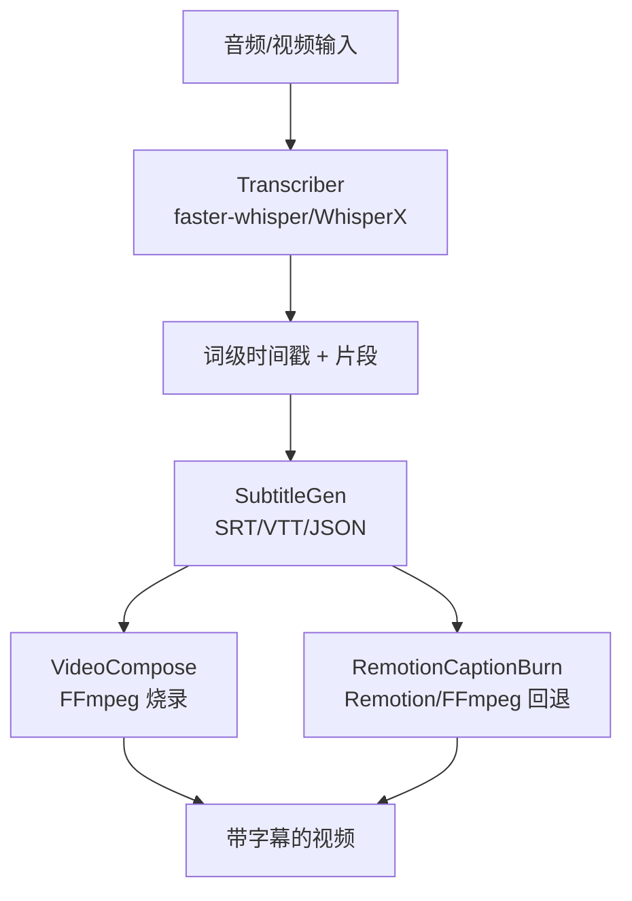
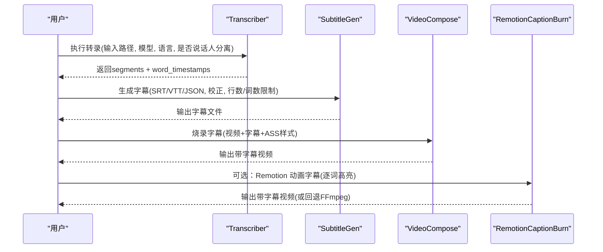
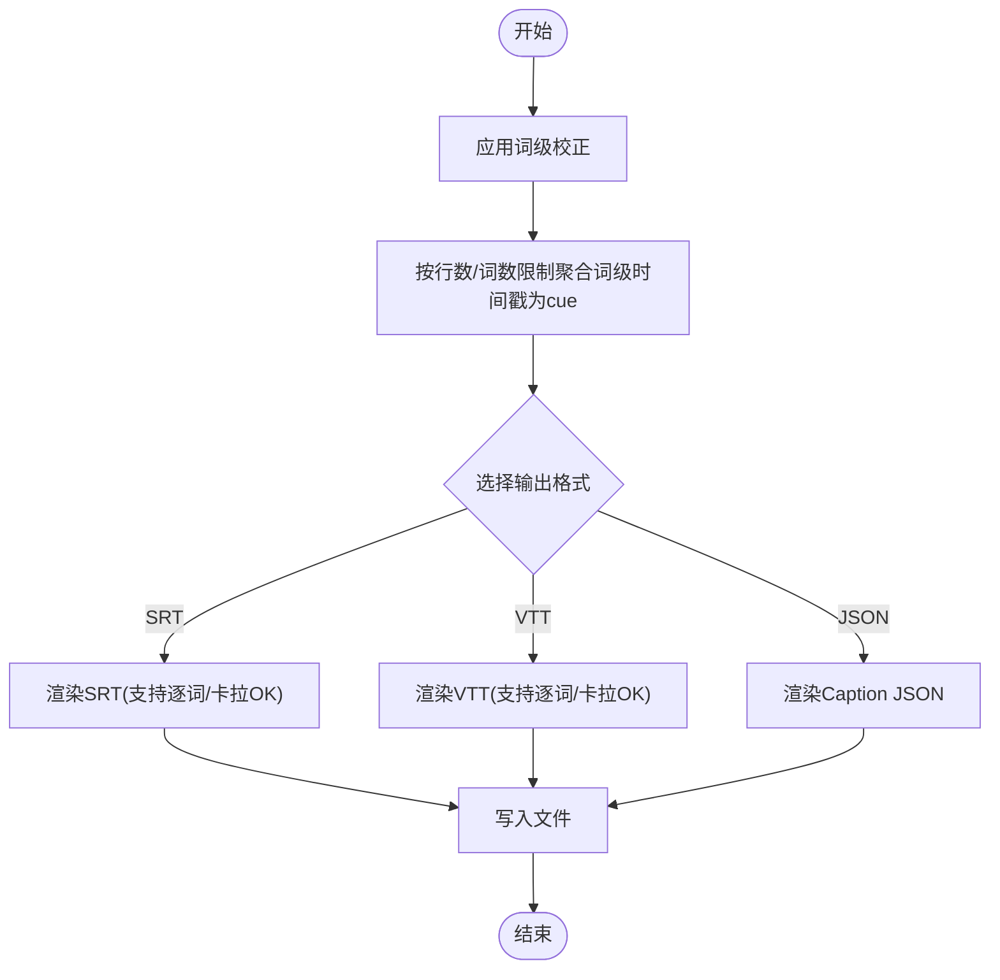
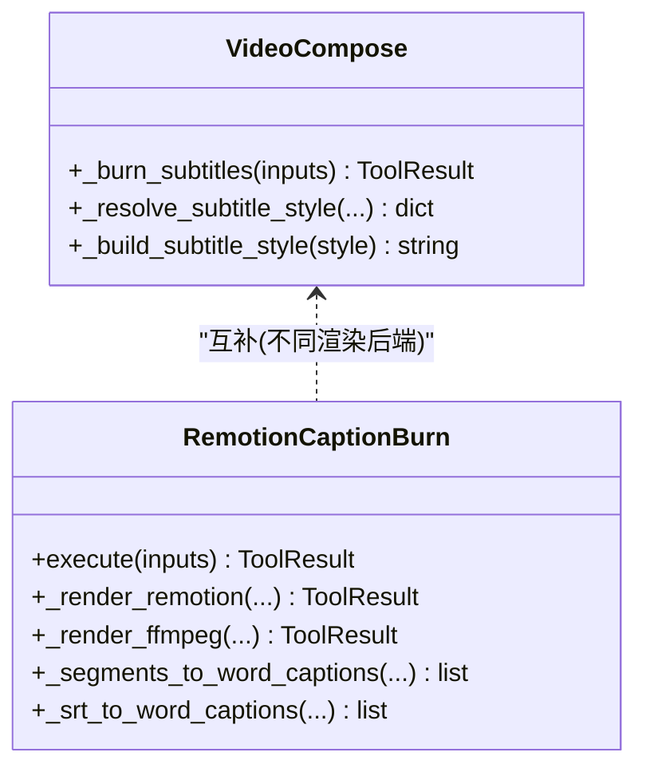
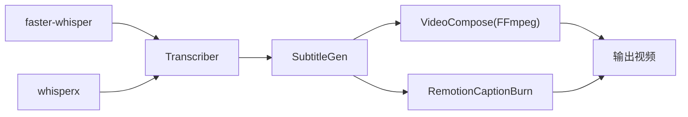

# 字幕同步技能

<cite>
**本文引用的文件**
- [skills/core/subtitle-sync.md](file://skills/core/subtitle-sync.md)
- [skills/core/whisperx.md](file://skills/core/whisperx.md)
- [tools/subtitle/subtitle_gen.py](file://tools/subtitle/subtitle_gen.py)
- [tools/analysis/transcriber.py](file://tools/analysis/transcriber.py)
- [tools/video/video_compose.py](file://tools/video/video_compose.py)
- [tools/video/remotion_caption_burn.py](file://tools/video/remotion_caption_burn.py)
- [tests/tools/test_subtitle_timestamps.py](file://tests/tools/test_subtitle_timestamps.py)
</cite>

## 目录
1. [简介](#简介)
2. [项目结构](#项目结构)
3. [核心组件](#核心组件)
4. [架构总览](#架构总览)
5. [详细组件分析](#详细组件分析)
6. [依赖关系分析](#依赖关系分析)
7. [性能与质量考量](#性能与质量考量)
8. [故障排查指南](#故障排查指南)
9. [结论](#结论)
10. [附录：API调用示例与最佳实践](#附录api调用示例与最佳实践)

## 简介
本技术文档聚焦 OpenMontage 中的“字幕同步技能”，覆盖从语音识别结果到字幕文件的完整流程，包括时间戳对齐、格式转换（SRT/VTT/Caption JSON）、字幕烧录与样式定制、多语言支持与质量控制。文档同时给出批量处理、修正时间偏移、添加样式属性的方法，以及与 WhisperX 等语音识别服务的集成要点。

## 项目结构
OpenMontage 将字幕相关能力拆分为多个工具与技能文档：
- 转录与对齐：transcriber（基于 faster-whisper/WhisperX），输出带词级时间戳的片段
- 字幕生成：subtitle_gen，将词级时间戳聚合成显示提示（cue）并渲染为 SRT/VTT/JSON
- 字幕烧录：video_compose 提供 FFmpeg 烧录；remotion_caption_burn 提供 Remotion 动画字幕或 FFmpeg 回退
- 技能说明：subtitle-sync.md、whisperx.md 提供使用规范、样式建议与最佳实践

图表来源
- [tools/analysis/transcriber.py:116-240](file://tools/analysis/transcriber.py#L116-L240)
- [tools/subtitle/subtitle_gen.py:82-129](file://tools/subtitle/subtitle_gen.py#L82-L129)
- [tools/video/video_compose.py:2709-2744](file://tools/video/video_compose.py#L2709-L2744)
- [tools/video/remotion_caption_burn.py:443-489](file://tools/video/remotion_caption_burn.py#L443-L489)

章节来源
- [skills/core/subtitle-sync.md:1-105](file://skills/core/subtitle-sync.md#L1-L105)
- [skills/core/whisperx.md:1-64](file://skills/core/whisperx.md#L1-L64)

## 核心组件
- 转录器（Transcriber）
  - 功能：语音转文本，支持词级时间戳、自动语言检测、可选说话人分离（WhisperX）
  - 关键行为：VAD 静音过滤、GPU/CPU 自适应、失败回退、写入 transcript JSON
- 字幕生成器（SubtitleGen）
  - 功能：按 max_words_per_cue 与 max_chars_per_line 聚合词级时间戳为 cue，渲染 SRT/VTT/JSON
  - 特性：词级高亮（逐词/卡拉OK）、词级校正（corrections）、毫秒进位安全的时间格式化
- 字幕烧录（VideoCompose / RemotionCaptionBurn）
  - VideoCompose：通过 FFmpeg subtitles filter 烧录 ASS 样式字幕
  - RemotionCaptionBurn：优先 Remotion 动画字幕（逐词高亮），不可用时回退 FFmpeg

章节来源
- [tools/analysis/transcriber.py:29-96](file://tools/analysis/transcriber.py#L29-L96)
- [tools/subtitle/subtitle_gen.py:26-80](file://tools/subtitle/subtitle_gen.py#L26-L80)
- [tools/video/video_compose.py:2709-2744](file://tools/video/video_compose.py#L2709-L2744)
- [tools/video/remotion_caption_burn.py:52-151](file://tools/video/remotion_caption_burn.py#L52-L151)

## 架构总览
端到端数据流如下：
- 输入音视频 → Transcriber 产出 segments 与 word_timestamps
- SubtitleGen 消费 segments，应用 corrections，构建 cues，渲染目标格式
- VideoCompose/RemotionCaptionBurn 将字幕以 ASS 样式烧录至视频

图表来源
- [tools/analysis/transcriber.py:116-240](file://tools/analysis/transcriber.py#L116-L240)
- [tools/subtitle/subtitle_gen.py:82-129](file://tools/subtitle/subtitle_gen.py#L82-L129)
- [tools/video/video_compose.py:2709-2744](file://tools/video/video_compose.py#L2709-L2744)
- [tools/video/remotion_caption_burn.py:443-489](file://tools/video/remotion_caption_burn.py#L443-L489)

## 详细组件分析

### 转录器（Transcriber）
- 输入：音视频路径、模型大小、语言代码（可为空以自动检测）、是否启用说话人分离、输出目录
- 处理：
  - 加载 faster-whisper 模型，尝试 GPU（CTranslate2 探测），失败回退 CPU
  - 转录时开启 VAD 过滤与词级时间戳
  - 可选 WhisperX 对齐与说话人分离（需要 HF_TOKEN）
- 输出：segments（含 words）、word_timestamps、language、duration_seconds、设备信息、错误回退原因
- 质量要点：
  - 词级时间戳精度用于后续字幕对齐
  - 自动语言检测会增加约 1 秒开销，已知语言时显式传入可提升速度

章节来源
- [tools/analysis/transcriber.py:116-240](file://tools/analysis/transcriber.py#L116-L240)
- [tools/analysis/transcriber.py:242-280](file://tools/analysis/transcriber.py#L242-L280)
- [skills/core/whisperx.md:16-64](file://skills/core/whisperx.md#L16-L64)

### 字幕生成器（SubtitleGen）
- 输入：segments、format（srt/vtt/json）、max_words_per_cue、max_chars_per_line、highlight_style、corrections、output_path
- 处理：
  - 应用 corrections（不区分大小写匹配，保留标点）
  - 聚合词级时间戳为 cue，尊重每行字符上限与每提示词数上限
  - 渲染 SRT/VTT/JSON；支持逐词高亮与卡拉OK模式
  - 时间戳格式化采用“先四舍五入到整毫秒再拆分”的策略，避免 0.9999s 产生 4 位毫秒字段
- 输出：字幕文件路径、cue 数量、耗时

图表来源
- [tools/subtitle/subtitle_gen.py:82-129](file://tools/subtitle/subtitle_gen.py#L82-L129)
- [tools/subtitle/subtitle_gen.py:131-166](file://tools/subtitle/subtitle_gen.py#L131-L166)
- [tools/subtitle/subtitle_gen.py:168-227](file://tools/subtitle/subtitle_gen.py#L168-L227)
- [tools/subtitle/subtitle_gen.py:229-309](file://tools/subtitle/subtitle_gen.py#L229-L309)
- [tools/subtitle/subtitle_gen.py:311-335](file://tools/subtitle/subtitle_gen.py#L311-L335)

章节来源
- [tools/subtitle/subtitle_gen.py:26-129](file://tools/subtitle/subtitle_gen.py#L26-L129)
- [tests/tools/test_subtitle_timestamps.py:1-49](file://tests/tools/test_subtitle_timestamps.py#L1-L49)

### 字幕烧录（VideoCompose 与 RemotionCaptionBurn）
- VideoCompose
  - 通过 FFmpeg subtitles filter 烧录字幕，支持 ASS force_style 样式
  - 样式解析优先级：显式样式 > edit_decisions.subtitles.style > playbook > 默认值
  - 输出：带字幕的视频
- RemotionCaptionBurn
  - 优先使用 Remotion 渲染动画字幕（逐词高亮），不可用时回退 FFmpeg
  - 支持从 segments 或 SRT 解析词级字幕，生成临时 SRT 或直接走 Remotion 管线
  - 输出：带字幕的视频（Remotion 或 FFmpeg 回退）

图表来源
- [tools/video/video_compose.py:2709-2744](file://tools/video/video_compose.py#L2709-L2744)
- [tools/video/video_compose.py:2860-2931](file://tools/video/video_compose.py#L2860-L2931)
- [tools/video/remotion_caption_burn.py:182-261](file://tools/video/remotion_caption_burn.py#L182-L261)
- [tools/video/remotion_caption_burn.py:267-356](file://tools/video/remotion_caption_burn.py#L267-L356)
- [tools/video/remotion_caption_burn.py:362-429](file://tools/video/remotion_caption_burn.py#L362-L429)
- [tools/video/remotion_caption_burn.py:443-489](file://tools/video/remotion_caption_burn.py#L443-L489)

章节来源
- [tools/video/video_compose.py:2709-2944](file://tools/video/video_compose.py#L2709-L2944)
- [tools/video/remotion_caption_burn.py:52-151](file://tools/video/remotion_caption_burn.py#L52-L151)
- [tools/video/remotion_caption_burn.py:182-489](file://tools/video/remotion_caption_burn.py#L182-L489)

## 依赖关系分析
- 外部依赖
  - faster-whisper：转录核心（CPU/GPU）
  - whisperx：可选说话人分离与对齐（需 HF_TOKEN）
  - ffmpeg/ffprobe：字幕烧录与媒体探测
  - Remotion（可选）：动画字幕渲染
- 内部耦合
  - transcriber 输出结构与 subtitle_gen 输入契约一致（segments/words/start/end）
  - subtitle_gen 输出的 SRT/VTT 被 video_compose 直接消费
  - remotion_caption_burn 兼容 segments 与 SRT 两种输入源

图表来源
- [tools/analysis/transcriber.py:39-44](file://tools/analysis/transcriber.py#L39-L44)
- [tools/subtitle/subtitle_gen.py:36-40](file://tools/subtitle/subtitle_gen.py#L36-L40)
- [tools/video/video_compose.py:2709-2744](file://tools/video/video_compose.py#L2709-L2744)
- [tools/video/remotion_caption_burn.py:62-67](file://tools/video/remotion_caption_burn.py#L62-L67)

章节来源
- [tools/analysis/transcriber.py:39-44](file://tools/analysis/transcriber.py#L39-L44)
- [tools/subtitle/subtitle_gen.py:36-40](file://tools/subtitle/subtitle_gen.py#L36-L40)
- [tools/video/remotion_caption_burn.py:62-67](file://tools/video/remotion_caption_burn.py#L62-L67)

## 性能与质量考量
- 转录性能
  - 模型大小与速度/质量权衡：tiny/base/small/medium/large-v3
  - 自动语言检测增加约 1 秒开销；已知语言时显式指定可提速
  - GPU 可用时优先使用，否则回退 CPU
- 字幕可读性
  - 竖屏短内容：每提示 3-4 词，每行不超过 20 字符
  - 横屏标准：每提示 6-8 词，每行不超过 42 字符
  - 平均阅读速率约 15 字符/秒；单提示最小 0.5 秒、最大 5 秒
- 时间戳精度
  - 时间戳格式化采用“先四舍五入到整毫秒再拆分”，避免 0.9999s 产生非法 4 位毫秒字段
  - 测试覆盖边界情况（分钟/小时进位）
- 样式与对比度
  - 使用 ASS force_style 颜色格式 &HAABBGGRR
  - 竖屏字体不宜过大，避免遮挡面部；边距 MarginV 不宜过大以免出画

章节来源
- [skills/core/whisperx.md:22-64](file://skills/core/whisperx.md#L22-L64)
- [skills/core/subtitle-sync.md:23-81](file://skills/core/subtitle-sync.md#L23-L81)
- [tests/tools/test_subtitle_timestamps.py:24-49](file://tests/tools/test_subtitle_timestamps.py#L24-L49)

## 故障排查指南
- 转录阶段
  - 若 GPU 不可用或 CUDA 库缺失，会自动回退 CPU；检查日志中的 gpu_fallback_reason
  - 说话人分离失败时仍会返回原始片段，确保下游不受影响
- 字幕生成阶段
  - 若未提供 segments 或格式不支持，会返回错误；确认输入 schema
  - 校正字典键不区分大小写，但会保留原词末尾标点，注意拼写
- 字幕烧录阶段
  - FFmpeg 路径包含冒号时需转义（Windows 下）；工具已内置转义逻辑
  - 若 Remotion 不可用，自动回退 FFmpeg；如需动画字幕请安装 Remotion
- 时间戳异常
  - 严格遵循 SRT/VTT 时间格式；测试用例保证毫秒进位正确

章节来源
- [tools/analysis/transcriber.py:198-217](file://tools/analysis/transcriber.py#L198-L217)
- [tools/subtitle/subtitle_gen.py:93-110](file://tools/subtitle/subtitle_gen.py#L93-L110)
- [tools/video/video_compose.py:2715-2735](file://tools/video/video_compose.py#L2715-L2735)
- [tools/video/remotion_caption_burn.py:392-409](file://tools/video/remotion_caption_burn.py#L392-L409)
- [tests/tools/test_subtitle_timestamps.py:1-49](file://tests/tools/test_subtitle_timestamps.py#L1-L49)

## 结论
OpenMontage 的字幕同步技能提供了从语音识别到字幕生成与烧录的完整闭环：
- 高精度词级时间戳保障对齐质量
- 灵活的格式与样式支持适配多平台播放
- 稳健的回退机制与严格的边界测试确保稳定性
- 结合技能文档的最佳实践可实现高质量的多语言字幕工作流

## 附录：API调用示例与最佳实践

### 基本流程（端到端）
- 步骤1：转录
  - 调用 transcriber，传入 input_path、model_size、language（可为 null）、diarize（可选）、output_dir
  - 获取 segments 与 word_timestamps
- 步骤2：生成字幕
  - 调用 subtitle_gen，传入 segments、format（srt/vtt/json）、max_words_per_cue、max_chars_per_line、highlight_style（none/word_by_word/karaoke）、corrections、output_path
- 步骤3：烧录字幕
  - 调用 video_compose 的 burn_subtitles，传入 input_path、subtitle_path、subtitle_style（font/font_size/bold/primary_color/outline_color/back_color/outline_width/shadow/margin_v/alignment）
  - 或调用 remotion_caption_burn 以获得动画字幕（优先 Remotion，否则 FFmpeg 回退）

章节来源
- [tools/analysis/transcriber.py:54-96](file://tools/analysis/transcriber.py#L54-L96)
- [tools/subtitle/subtitle_gen.py:42-80](file://tools/subtitle/subtitle_gen.py#L42-L80)
- [tools/video/video_compose.py:2709-2744](file://tools/video/video_compose.py#L2709-L2744)
- [tools/video/remotion_caption_burn.py:74-151](file://tools/video/remotion_caption_burn.py#L74-L151)

### 批量处理字幕文件
- 对多个音视频重复执行上述三步；利用 idempotency_key_fields 实现幂等（如 segments/format/max_words_per_cue）
- 在 pipeline 中循环调用 transcriber → subtitle_gen → video_compose/remotion_caption_burn，统一收集 artifacts 与 duration_seconds

章节来源
- [tools/subtitle/subtitle_gen.py:75-80](file://tools/subtitle/subtitle_gen.py#L75-L80)
- [tools/analysis/transcriber.py:88-96](file://tools/analysis/transcriber.py#L88-L96)

### 修正时间偏移
- 当前实现未提供全局时间偏移参数；可通过 corrections 进行词级文本替换，间接修正误识
- 若需整体偏移，可在上游调整转录段落的 start/end（例如在自定义脚本中对 segments 做加减），再传入 subtitle_gen

章节来源
- [tools/subtitle/subtitle_gen.py:63-73](file://tools/subtitle/subtitle_gen.py#L63-L73)
- [tools/subtitle/subtitle_gen.py:131-166](file://tools/subtitle/subtitle_gen.py#L131-L166)

### 添加样式属性（ASS force_style）
- 通过 video_compose 的 subtitle_style 设置字体、字号、粗细、主色、描边色、背景色、边框样式、描边宽度、阴影、垂直边距、对齐方式
- 颜色请使用 ASS 格式 &HAABBGGRR；竖屏建议较小字号与较粗描边以提升可读性

章节来源
- [tools/video/video_compose.py:2860-2931](file://tools/video/video_compose.py#L2860-L2931)
- [skills/core/subtitle-sync.md:42-81](file://skills/core/subtitle-sync.md#L42-L81)

### 与 WhisperX 集成与质量控制
- 启用 diarize 可获得说话人标签；需要 whisperx 与 HF_TOKEN
- 质量检查清单：
  - 抽查 3-5 段文本准确性
  - 词级时间戳与语音对齐
  - 无缺失段落或大空隙
  - 语言检测正确（自动模式下）
  - 说话人标签准确（启用时）

章节来源
- [skills/core/whisperx.md:32-64](file://skills/core/whisperx.md#L32-L64)
- [tools/analysis/transcriber.py:242-280](file://tools/analysis/transcriber.py#L242-L280)

### 多语言项目工作流程与最佳实践
- 明确目标语言：已知语言时显式传入 ISO 639-1 代码，减少自动检测开销
- 针对不同屏幕尺寸调整 cue 长度与行宽：竖屏更短更粗，横屏更宽松
- 使用 highlight_style=word_by_word 或 karaoke 增强观看体验（Remotion 或 SRT/VTT 支持）
- 统一样式策略：通过 playbook 或 edit_decisions 集中管理字幕风格，避免不一致

章节来源
- [skills/core/subtitle-sync.md:23-81](file://skills/core/subtitle-sync.md#L23-L81)
- [tools/video/video_compose.py:2860-2931](file://tools/video/video_compose.py#L2860-L2931)
- [tools/subtitle/subtitle_gen.py:58-62](file://tools/subtitle/subtitle_gen.py#L58-L62)