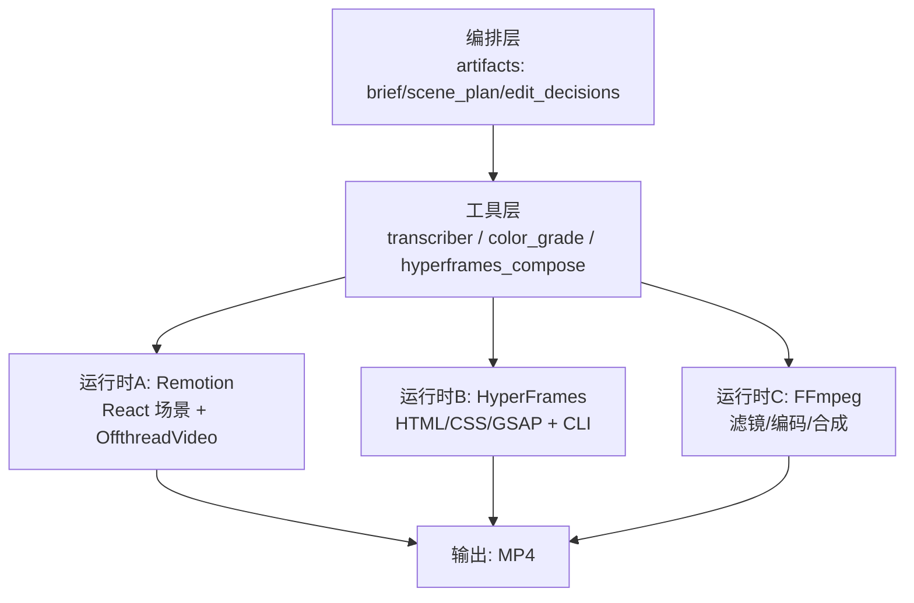
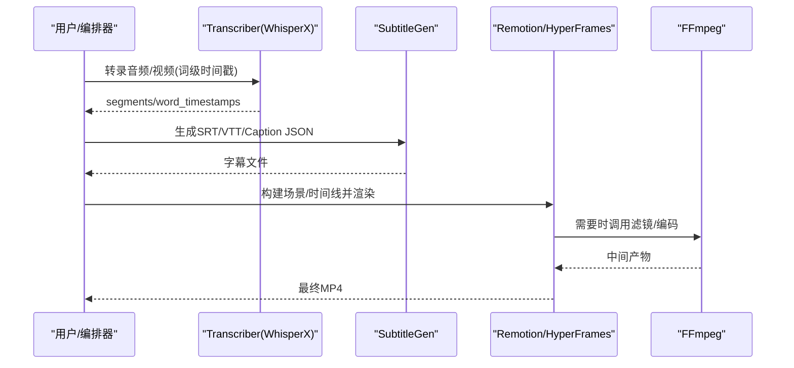
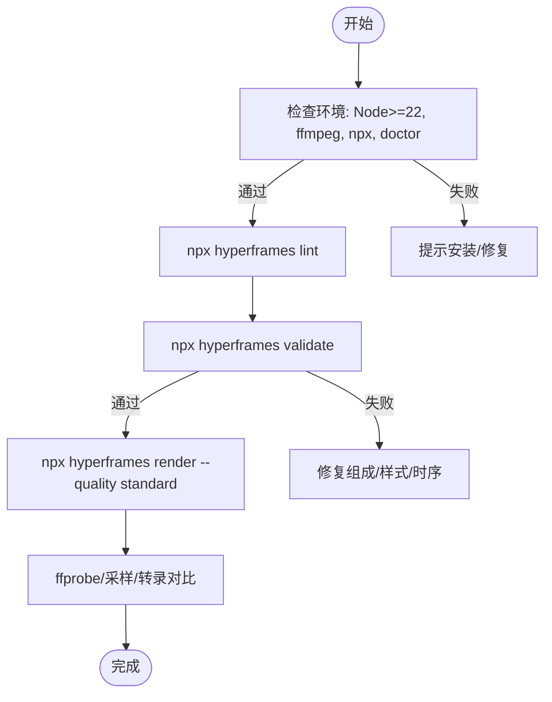
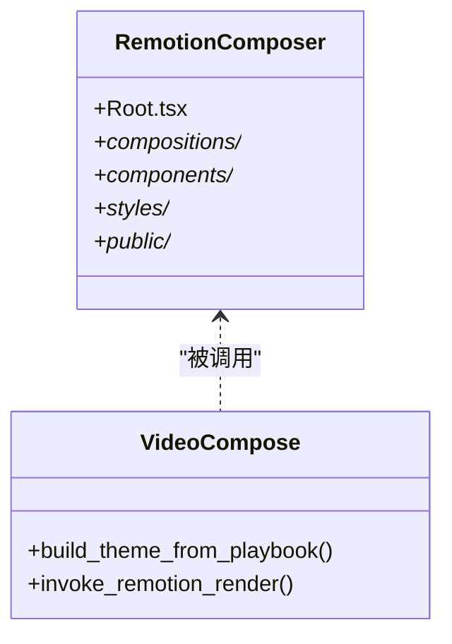
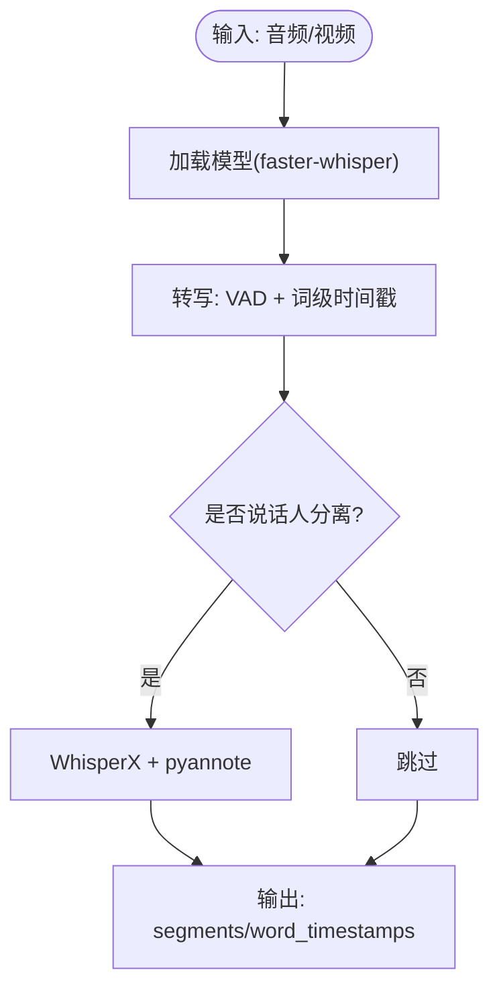
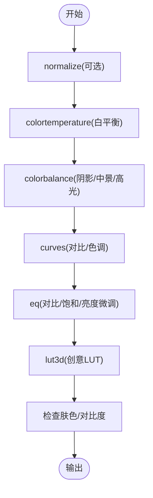
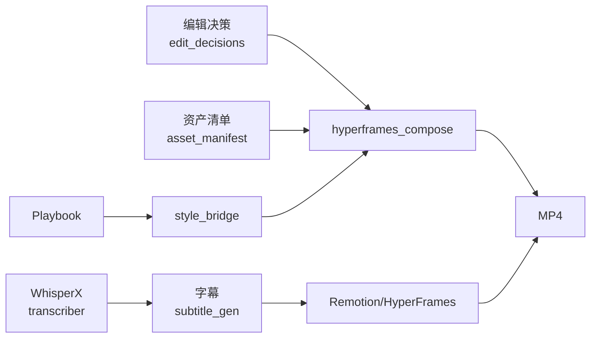

# 核心技能

<cite>
**本文引用的文件**
- [skills/core/ffmpeg.md](file://skills/core/ffmpeg.md)
- [skills/core/hyperframes.md](file://skills/core/hyperframes.md)
- [skills/core/remotion.md](file://skills/core/remotion.md)
- [skills/core/subtitle-sync.md](file://skills/core/subtitle-sync.md)
- [skills/core/whisperx.md](file://skills/core/whisperx.md)
- [skills/core/color-grading.md](file://skills/core/color-grading.md)
- [tools/video/hyperframes_compose.py](file://tools/video/hyperframes_compose.py)
- [tools/analysis/transcriber.py](file://tools/analysis/transcriber.py)
- [tools/enhancement/color_grade.py](file://tools/enhancement/color_grade.py)
- [lib/hyperframes_style_bridge.py](file://lib/hyperframes_style_bridge.py)
</cite>

## 目录
1. [简介](#简介)
2. [项目结构](#项目结构)
3. [核心组件](#核心组件)
4. [架构总览](#架构总览)
5. [详细组件分析](#详细组件分析)
6. [依赖关系分析](#依赖关系分析)
7. [性能考虑](#性能考虑)
8. [故障排除指南](#故障排除指南)
9. [结论](#结论)
10. [附录](#附录)

## 简介
本技术文档聚焦 OpenMontage 的六大基础核心技能：FFmpeg 集成、HyperFrames 动画引擎、Remotion 渲染、字幕同步、WhisperX 语音识别与色彩分级。文档从系统架构、数据流、处理逻辑、集成点、错误处理、性能特性等维度展开，提供配置选项、参数设置、最佳实践、调用方式与扩展建议，帮助读者在理解各技能工作原理的同时，掌握跨技能协作与端到端视频生产流程。

## 项目结构
OpenMontage 将“创意语法”（renderer_family）与“技术引擎”（render_runtime）解耦，默认最终渲染走 Remotion，当具备条件时可选择 HyperFrames；纯剪辑/转码/滤镜则优先 FFmpeg。核心技能通过工具层暴露能力，上层编排通过 artifacts（如 edit_decisions、asset_manifest、brief、scene_plan）驱动。

图表来源
- [skills/core/remotion.md:16-44](file://skills/core/remotion.md#L16-L44)
- [skills/core/hyperframes.md:29-83](file://skills/core/hyperframes.md#L29-L83)
- [skills/core/ffmpeg.md:10-46](file://skills/core/ffmpeg.md#L10-L46)

章节来源
- [skills/core/remotion.md:16-44](file://skills/core/remotion.md#L16-L44)
- [skills/core/hyperframes.md:29-83](file://skills/core/hyperframes.md#L29-L83)
- [skills/core/ffmpeg.md:10-46](file://skills/core/ffmpeg.md#L10-L46)

## 核心组件
- FFmpeg 集成：负责剪辑、拼接、速度调整、字幕烧录、叠加合成、编码、人脸增强、色彩分级、音频清理等无 AI 推理的视频/音频处理。
- HyperFrames 动画引擎：以 HTML/CSS/GSAP 为核心的本地渲染路径，适合动效密集、注册块驱动的视觉呈现。
- Remotion 渲染：React 场景组装、过渡、数据驱动批量渲染，默认最终渲染引擎。
- 字幕同步：基于词级时间戳生成 SRT/VTT/Caption JSON，适配横竖屏可读性规范。
- WhisperX 语音识别：faster-whisper/WhisperX 实现带词级时间戳的语音转文本，可选说话人分离。
- 色彩分级：内置 LUT 与滤镜链，按内容类型选择风格，遵循皮肤保护与可访问性原则。

章节来源
- [skills/core/ffmpeg.md:10-46](file://skills/core/ffmpeg.md#L10-L46)
- [skills/core/hyperframes.md:29-83](file://skills/core/hyperframes.md#L29-L83)
- [skills/core/remotion.md:16-44](file://skills/core/remotion.md#L16-L44)
- [skills/core/subtitle-sync.md:15-41](file://skills/core/subtitle-sync.md#L15-L41)
- [skills/core/whisperx.md:16-31](file://skills/core/whisperx.md#L16-L31)
- [skills/core/color-grading.md:18-45](file://skills/core/color-grading.md#L18-L45)

## 架构总览
OpenMontage 的核心工作流如下：
- 输入：brief、script、scene_plan、edit_decisions、asset_manifest、style playbook。
- 预处理：WhisperX 转录 → 字幕生成 → 素材准备（缩放/关键帧重编码）。
- 渲染：根据 render_runtime 路由到 Remotion 或 HyperFrames；必要时使用 FFmpeg 做独立操作。
- 后处理：色彩分级、音频混音、质量校验与交付。

图表来源
- [tools/analysis/transcriber.py:116-196](file://tools/analysis/transcriber.py#L116-L196)
- [skills/core/subtitle-sync.md:15-41](file://skills/core/subtitle-sync.md#L15-L41)
- [skills/core/remotion.md:181-201](file://skills/core/remotion.md#L181-L201)
- [tools/video/hyperframes_compose.py:107-200](file://tools/video/hyperframes_compose.py#L107-L200)

## 详细组件分析

### FFmpeg 集成
- 适用场景：剪辑、拼接、变速、提取/混音、字幕烧录、叠加、编码、人脸增强、色彩分级、音频降噪与响度标准化。
- 关键模式：
  - 增强链顺序：先字幕 → 人脸增强 → 色彩分级 → 音频增强。
  - 无损 vs 重编码：仅裁剪/拼接用 copy；应用滤镜需重编码；默认 CRF 23，交付可用 18-20。
  - 字幕烧录：推荐 SRT；ASS force_style 颜色格式为 &H00FFFFFF；Windows 路径需转义；横竖屏字号与边距不同。
  - 音频响度目标：社交媒体 -14 LUFS、YouTube -14~-16 LUFS、播客 -16 LUFS、广播 -24 LUFS。
  - 旁路压缩（Ducking）：sidechaincompress 阈值/比例/攻击/释放典型值。
  - 拼接：同编解码器用 concat demuxer；混合编解码/分辨率需先统一重编码。
- 质量清单：播放无伪影、音画同步、字幕位置合理、响度达标、肤色自然、无削波/静音缺口、文件大小合理。

章节来源
- [skills/core/ffmpeg.md:31-82](file://skills/core/ffmpeg.md#L31-L82)
- [skills/core/ffmpeg.md:83-92](file://skills/core/ffmpeg.md#L83-L92)

### HyperFrames 动画引擎
- 何时选择：动效密集、注册块驱动、网站转视频、UI 驱动合成；Remotion 已有 React 场景时优先 Remotion。
- 工作区布局：每个项目独立 workspace，index.html + compositions/assets/hyperframes.json 等；不共享 remotion-composer/public。
- 工件映射：edit_decisions.cuts → 时间线与 composition 元素；asset_manifest → 资源拷贝/软链；audio/music → <audio>；playbook → CSS 变量 + DESIGN.md。
- 预检与验证：lint → validate → render；失败不渲染；最终 ffprobe/采样/转录对比。
- 风格桥接：playbook → :root CSS 自定义属性 + DESIGN.md。
- 成本模型：本地渲染，$0 API 成本，CPU 密集；通过 cost_tracker 估算与对账。
- 常见陷阱：背景视频源分辨率不足导致黑边；需 scale-to-cover + crop + unsharp；下载素材需密集关键帧；视频多背景时 workers=1；字体选择受限于确定性编译器。

图表来源
- [skills/core/hyperframes.md:206-258](file://skills/core/hyperframes.md#L206-L258)
- [tools/video/hyperframes_compose.py:107-200](file://tools/video/hyperframes_compose.py#L107-L200)

章节来源
- [skills/core/hyperframes.md:29-83](file://skills/core/hyperframes.md#L29-L83)
- [skills/core/hyperframes.md:102-185](file://skills/core/hyperframes.md#L102-L185)
- [skills/core/hyperframes.md:206-258](file://skills/core/hyperframes.md#L206-L258)
- [lib/hyperframes_style_bridge.py:70-141](file://lib/hyperframes_style_bridge.py#L70-L141)

### Remotion 渲染
- 默认策略：最终渲染默认走 Remotion；简单裁剪/拼接/烧录/滤镜走 FFmpeg。
- 场景类型：text_card、stat_card、hero_title、callout、comparison、bar_chart、line_chart、pie_chart、kpi_grid、progress_bar、anime_scene。
- 架构：remotion-composer/src 下 Root.tsx 与 compositions/components/styles；public 静态资源。
- 管线集成：scene_plan → TransitionSeries；media_profile → 尺寸/FPS；edit_decisions → cuts；style_playbook → theme。
- 渲染调用：npx remotion render Explainer --props ... --output ...；注意不要指定 src/index.ts。
- 关键约束：禁用 CSS 动画/Tailwind animate-*；clamp interpolate()；useVideoConfig().durationInFrames 是整段时长而非 Sequence 时长；Node 18+；串行渲染避免内存压力。
- 后验协议：ffprobe 校验音视频流、抽取审阅帧、转录核对文案、结构化评审。

图表来源
- [skills/core/remotion.md:144-164](file://skills/core/remotion.md#L144-L164)
- [skills/core/remotion.md:181-201](file://skills/core/remotion.md#L181-L201)

章节来源
- [skills/core/remotion.md:16-44](file://skills/core/remotion.md#L16-L44)
- [skills/core/remotion.md:46-86](file://skills/core/remotion.md#L46-L86)
- [skills/core/remotion.md:144-201](file://skills/core/remotion.md#L144-L201)
- [skills/core/remotion.md:324-377](file://skills/core/remotion.md#L324-L377)

### 字幕同步
- 工具：subtitle_gen 将词级时间戳转为 SRT/VTT/Caption JSON。
- 格式与规范：
  - 竖屏短视频：每句 3-4 词，行字符 ≤20，字幕必开。
  - 横屏标准：每句 6-8 词，行字符 ≤42。
  - 一般规则：阅读速率约 15 字/秒；单条显示 0.5-5 秒。
- 烧录样式：ASS force_style 颜色格式 &H00FFFFFF；竖屏字号 18、边距 50；横屏字号 22、边距 40。
- 对齐最佳实践：cue 起始匹配词 onset；结束延后约 200ms；不与下一说话人重叠。

章节来源
- [skills/core/subtitle-sync.md:15-41](file://skills/core/subtitle-sync.md#L15-L41)
- [skills/core/subtitle-sync.md:42-81](file://skills/core/subtitle-sync.md#L42-L81)
- [skills/core/subtitle-sync.md:82-105](file://skills/core/subtitle-sync.md#L82-L105)

### WhisperX 语音识别
- 工具：transcriber，基于 faster-whisper/WhisperX，支持词级时间戳、语言检测、可选说话人分离。
- 模型选择：tiny/base/small/medium/large-v3，速度与质量权衡。
- 关键模式：VAD 过滤静音；词级时间戳始终开启；单说话人跳过 diarization；多说话人启用；自动语言检测有额外开销。
- 输出：segments、word_timestamps、language、duration_seconds。

图表来源
- [tools/analysis/transcriber.py:116-196](file://tools/analysis/transcriber.py#L116-L196)
- [skills/core/whisperx.md:16-31](file://skills/core/whisperx.md#L16-L31)

章节来源
- [skills/core/whisperx.md:16-31](file://skills/core/whisperx.md#L16-L31)
- [tools/analysis/transcriber.py:116-196](file://tools/analysis/transcriber.py#L116-L196)

### 色彩分级
- 滤镜参考：eq、colorbalance、curves、colortemperature、lut3d、hue、normalize；链顺序：normalize → colortemperature → colorbalance → curves → eq → lut3d。
- 内容类型与强度：企业/科普/叙事/科技/剧情/生活方式/复古分别推荐 profile 与 intensity。
- LUT 工作流：校正后再套用 LUT；强度 0.6-0.8；测试肤色；同一项目固定 LUT；存放 assets/luts。
- 肤色保护：向量图肤色线约 123°；饱和度不超 1.2；异常肤色回调。
- 可访问性：色盲安全调色板（Wong）；WCAG 对比度要求（正文 ≥4.5:1，大字 ≥3:1）。
- 工具实现：color_grade 支持内置 profile、外部 .cube LUT、自定义 vf 链，CRF 与编码可控。

图表来源
- [skills/core/color-grading.md:18-45](file://skills/core/color-grading.md#L18-L45)
- [tools/enhancement/color_grade.py:24-75](file://tools/enhancement/color_grade.py#L24-L75)

章节来源
- [skills/core/color-grading.md:18-45](file://skills/core/color-grading.md#L18-L45)
- [skills/core/color-grading.md:47-100](file://skills/core/color-grading.md#L47-L100)
- [skills/core/color-grading.md:108-149](file://skills/core/color-grading.md#L108-L149)
- [tools/enhancement/color_grade.py:24-75](file://tools/enhancement/color_grade.py#L24-L75)
- [tools/enhancement/color_grade.py:134-179](file://tools/enhancement/color_grade.py#L134-L179)

## 依赖关系分析
- 运行时选择：
  - Remotion 默认用于最终渲染；不可用时回退 FFmpeg。
  - HyperFrames 作为替代运行时，适用于动效密集/注册块/网站转视频。
  - FFmpeg 用于纯剪辑/滤镜/烧录/编码。
- 工具依赖：
  - transcriber 依赖 faster-whisper，可选 whisperx（说话人分离）。
  - hyperframes_compose 依赖 npx、ffmpeg，运行 hyperframes CLI。
  - color_grade 依赖 ffmpeg。
- 数据流转：
  - transcriber 输出 word_timestamps → subtitle_gen 生成字幕 → Remotion/HyperFrames 烧录或覆盖。
  - edit_decisions + asset_manifest → hyperframes_compose 生成 workspace → 渲染 MP4。
  - style playbook → hyperframes_style_bridge 生成 CSS 变量与 DESIGN.md。

图表来源
- [tools/analysis/transcriber.py:116-196](file://tools/analysis/transcriber.py#L116-L196)
- [tools/video/hyperframes_compose.py:107-200](file://tools/video/hyperframes_compose.py#L107-L200)
- [lib/hyperframes_style_bridge.py:70-141](file://lib/hyperframes_style_bridge.py#L70-L141)

章节来源
- [skills/core/remotion.md:16-44](file://skills/core/remotion.md#L16-L44)
- [skills/core/hyperframes.md:29-83](file://skills/core/hyperframes.md#L29-L83)
- [skills/core/ffmpeg.md:10-46](file://skills/core/ffmpeg.md#L10-L46)

## 性能考虑
- Remotion：
  - 串行渲染避免内存压力；确保 Node 18+；禁用 CSS 动画类；clamp interpolate。
  - 计算元数据时使用 sceneDurationSeconds 而非 useVideoConfig().durationInFrames。
- HyperFrames：
  - 预检严格：lint/validate 必须通过；视频密集场景 workers=1；下载素材需密集关键帧。
  - 背景视频源分辨率不足需 pre-transform scale-to-cover + crop + unsharp。
  - 字体选择受限于确定性编译器，优先 Outfit/Inter/JetBrains Mono 等。
- FFmpeg：
  - 无损 copy 仅用于无需滤镜的裁剪/拼接；滤镜需重编码；CRF 控制质量与体积。
  - 音频响度按平台目标标准化；旁路压缩降低音乐音量突出人声。
- WhisperX：
  - 模型大小与速度/质量权衡；GPU 加速可选但非必需；自动语言检测有额外开销。
- 色彩分级：
  - 先校正再套用 LUT；强度 0.6-0.8；测试肤色；保持项目内一致。

[本节为通用指导，不直接分析具体文件]

## 故障排除指南
- Remotion 渲染失败：
  - 缺失音频流：ffprobe 确认存在 audio stream；若缺失，检查 audio.narration/music 是否传入 props 并重渲染。
  - 文本/图片资源未找到：pre-render 校验 composition_validator。
  - 字幕/标题错位：检查 transition 重叠与 Scene 时长计算。
- HyperFrames 渲染问题：
  - 背景视频黑边：检查源分辨率与 pre-transform，采用 scale-to-cover + crop + unsharp。
  - 渲染卡顿/超时：减少并行 workers；确保素材关键帧密集；避免无限 repeat 动画。
  - 字体不一致：使用确定性编译器支持的字体。
- FFmpeg 问题：
  - 字幕位置不当：调整 ASS force_style 字号与 margin_v；Windows 路径转义。
  - 音频削波/静音：检查响度目标与侧链压缩参数；拼接前后检查边界。
- WhisperX：
  - 无 GPU：回退 CPU；大模型速度慢属预期。
  - 说话人分离失败：检查 whisperx 与 HF_TOKEN；单说话人场景可跳过。

章节来源
- [skills/core/remotion.md:324-377](file://skills/core/remotion.md#L324-L377)
- [skills/core/hyperframes.md:296-418](file://skills/core/hyperframes.md#L296-L418)
- [skills/core/ffmpeg.md:48-82](file://skills/core/ffmpeg.md#L48-L82)
- [skills/core/whisperx.md:32-64](file://skills/core/whisperx.md#L32-L64)

## 结论
OpenMontage 通过解耦创意语法与技术引擎，结合 FFmpeg、Remotion、HyperFrames 三大运行时，以及 WhisperX、字幕同步、色彩分级等基础技能，形成可扩展、可验证、可交付的视频生产流水线。实践中应严格遵循预检与后验协议，依据内容类型与平台目标选择合适的运行时与参数，关注性能与可访问性，持续优化与扩展以满足特定需求。

[本节为总结，不直接分析具体文件]

## 附录
- 常用命令与调用方式（路径引用）：
  - Remotion 渲染：参见 [skills/core/remotion.md:181-201](file://skills/core/remotion.md#L181-L201)
  - HyperFrames 工作流：参见 [skills/core/hyperframes.md:206-258](file://skills/core/hyperframes.md#L206-L258)
  - FFmpeg 增强链与烧录：参见 [skills/core/ffmpeg.md:31-82](file://skills/core/ffmpeg.md#L31-L82)
  - 字幕规范与样式：参见 [skills/core/subtitle-sync.md:15-81](file://skills/core/subtitle-sync.md#L15-L81)
  - WhisperX 转录与模型选择：参见 [skills/core/whisperx.md:16-31](file://skills/core/whisperx.md#L16-L31)
  - 色彩分级滤镜链与 LUT：参见 [skills/core/color-grading.md:18-100](file://skills/core/color-grading.md#L18-L100)
- 工具实现参考：
  - transcriber：[tools/analysis/transcriber.py:116-196](file://tools/analysis/transcriber.py#L116-L196)
  - hyperframes_compose：[tools/video/hyperframes_compose.py:107-200](file://tools/video/hyperframes_compose.py#L107-L200)
  - color_grade：[tools/enhancement/color_grade.py:24-75](file://tools/enhancement/color_grade.py#L24-L75), [tools/enhancement/color_grade.py:134-179](file://tools/enhancement/color_grade.py#L134-L179)
  - style bridge：[lib/hyperframes_style_bridge.py:70-141](file://lib/hyperframes_style_bridge.py#L70-L141)

[本节为附录，不直接分析具体文件]