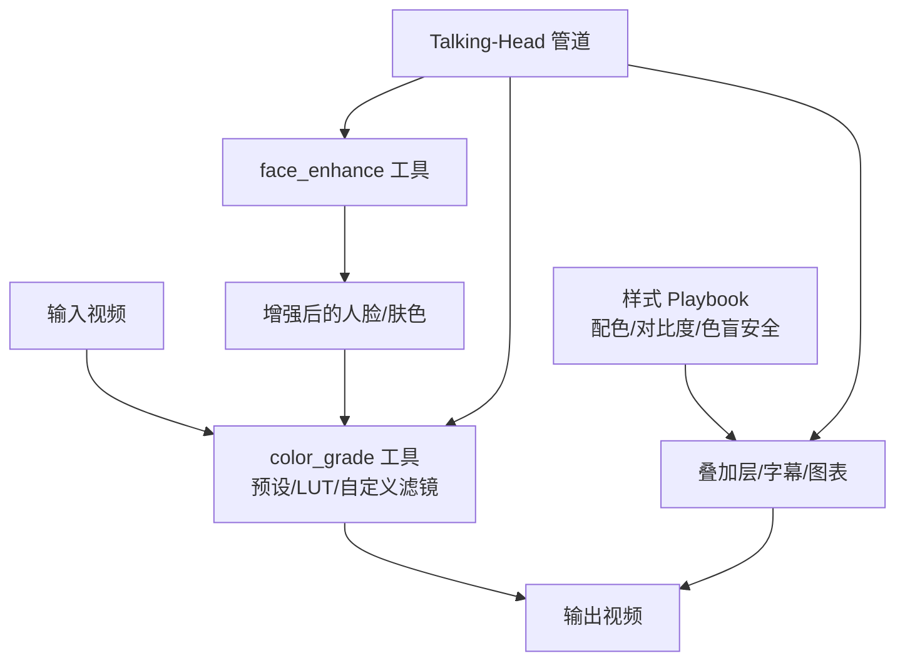
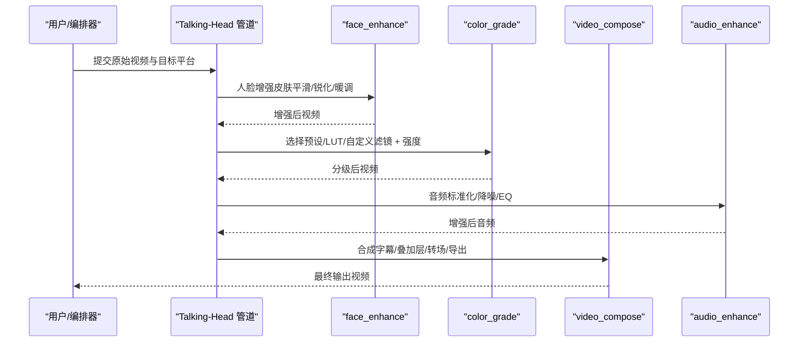
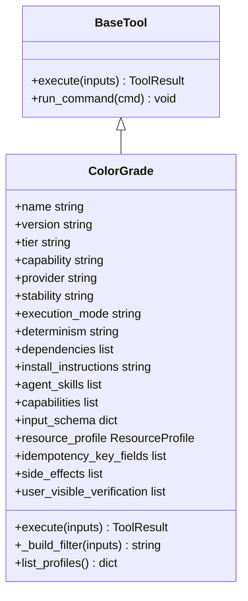
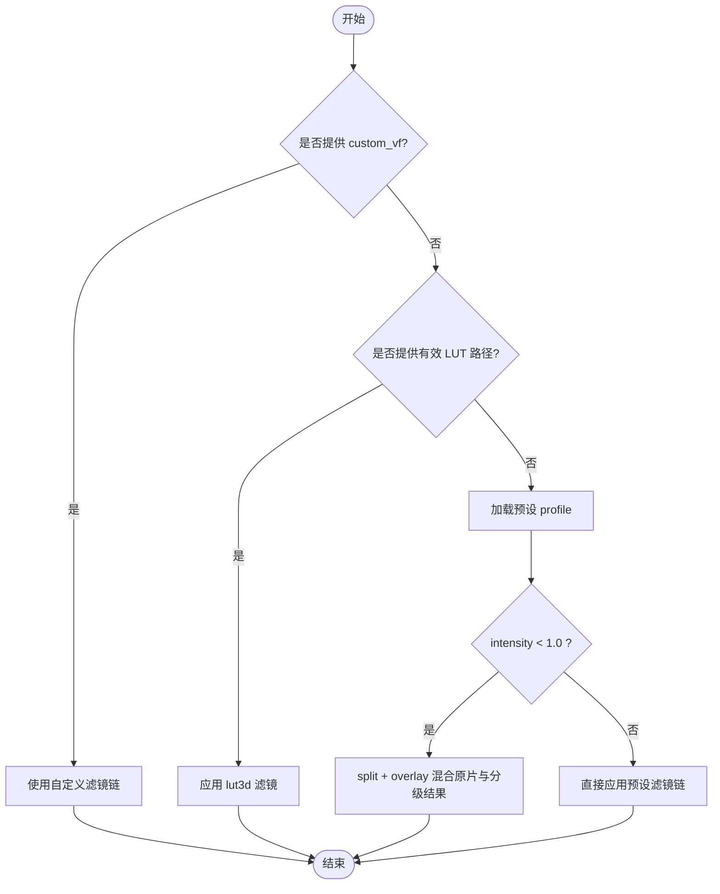
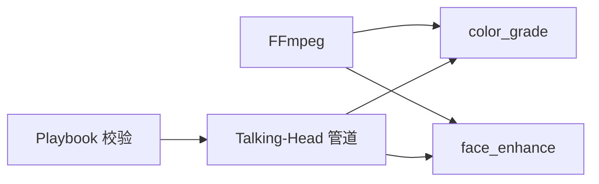

# 色彩分级技能

<cite>
**本文引用的文件**
- [tools/enhancement/color_grade.py](file://tools/enhancement/color_grade.py)
- [skills/core/color-grading.md](file://skills/core/color-grading.md)
- [skills/creative/enhancement-strategy.md](file://skills/creative/enhancement-strategy.md)
- [tools/enhancement/face_enhance.py](file://tools/enhancement/face_enhance.py)
- [styles/playbook_loader.py](file://styles/playbook_loader.py)
- [pipeline_defs/talking-head.yaml](file://pipeline_defs/talking-head.yaml)
</cite>

## 目录
1. [简介](#简介)
2. [项目结构](#项目结构)
3. [核心组件](#核心组件)
4. [架构总览](#架构总览)
5. [详细组件分析](#详细组件分析)
6. [依赖关系分析](#依赖关系分析)
7. [性能考量](#性能考量)
8. [故障排查指南](#故障排查指南)
9. [结论](#结论)
10. [附录](#附录)

## 简介
本技术文档聚焦 OpenMontage 中的自动色彩分级能力，围绕预设风格应用、强度控制与智能色调调整展开。内容涵盖：
- 内置色彩风格的适用场景与参数调节方法
- 色彩分级的技术原理（色轮/曲线/对比度优化/肤色保护）
- 自定义风格创建与批量处理视频素材的配置示例
- 与人脸增强的协作关系及避免过度处理的技巧
- 质量评估标准与不同平台的色彩适配建议

## 项目结构
OpenMontage 的色彩分级由“工具层 + 技能文档 + 样式系统 + 管道编排”共同构成：
- 工具层：color_grade 工具封装 FFmpeg 滤镜链与 LUT 应用，提供预设、LUT 与自定义三种模式
- 技能文档：color-grading.md 提供滤镜参考、流程顺序、肤色保护、可访问性与平台建议
- 样式系统：playbook_loader.py 提供配色、对比度与色盲安全校验，辅助生成可访问的叠加层与图表
- 管道编排：talking-head.yaml 将 color_grade 纳入最终合成阶段，并与 face_enhance、audio_enhance 等协同

**图示来源**
- [tools/enhancement/color_grade.py:78-124](file://tools/enhancement/color_grade.py#L78-L124)
- [tools/enhancement/face_enhance.py:25-67](file://tools/enhancement/face_enhance.py#L25-L67)
- [styles/playbook_loader.py:210-396](file://styles/playbook_loader.py#L210-L396)
- [pipeline_defs/talking-head.yaml:162-203](file://pipeline_defs/talking-head.yaml#L162-L203)

**章节来源**
- [tools/enhancement/color_grade.py:78-124](file://tools/enhancement/color_grade.py#L78-L124)
- [skills/core/color-grading.md:18-45](file://skills/core/color-grading.md#L18-L45)
- [styles/playbook_loader.py:210-396](file://styles/playbook_loader.py#L210-L396)
- [pipeline_defs/talking-head.yaml:162-203](file://pipeline_defs/talking-head.yaml#L162-L203)

## 核心组件
- ColorGrade 工具
  - 支持三种模式：预设风格、外部 .cube LUT、自定义滤镜链
  - 通过 intensity 实现原片与分级结果的混合，便于微调效果
  - 使用 FFmpeg 执行，输出可配置编码与质量参数
- 内置预设风格
  - cinematic_warm / cinematic_cool / moody_dark / bright_clean / vintage_film / high_contrast / neutral
  - 每个预设包含一组 colorbalance、curves、eq 等滤镜组合，形成稳定的视觉基调
- 滤镜链与顺序
  - normalize → colortemperature → colorbalance → curves → eq → lut3d
  - 该顺序确保先校正白平衡与曝光，再进行创意调色与 LUT 应用
- 肤色保护与可访问性
  - 基于向量示波器的肤色线原则与饱和度上限约束
  - 叠加层与图表遵循 WCAG 对比度与色盲安全规范

**章节来源**
- [tools/enhancement/color_grade.py:24-75](file://tools/enhancement/color_grade.py#L24-L75)
- [tools/enhancement/color_grade.py:98-124](file://tools/enhancement/color_grade.py#L98-L124)
- [skills/core/color-grading.md:18-45](file://skills/core/color-grading.md#L18-L45)
- [skills/core/color-grading.md:108-148](file://skills/core/color-grading.md#L108-L148)

## 架构总览
色彩分级在 Talking-Head 管道中作为可选步骤参与最终合成阶段，与人脸增强、音频增强、字幕与叠加层协同工作。

**图示来源**
- [pipeline_defs/talking-head.yaml:162-203](file://pipeline_defs/talking-head.yaml#L162-L203)
- [skills/creative/enhancement-strategy.md:20-31](file://skills/creative/enhancement-strategy.md#L20-L31)
- [tools/enhancement/face_enhance.py:25-67](file://tools/enhancement/face_enhance.py#L25-L67)
- [tools/enhancement/color_grade.py:134-179](file://tools/enhancement/color_grade.py#L134-L179)

## 详细组件分析

### ColorGrade 工具类图

**图示来源**
- [tools/enhancement/color_grade.py:78-124](file://tools/enhancement/color_grade.py#L78-L124)
- [tools/enhancement/color_grade.py:134-179](file://tools/enhancement/color_grade.py#L134-L179)
- [tools/enhancement/color_grade.py:181-213](file://tools/enhancement/color_grade.py#L181-L213)

**章节来源**
- [tools/enhancement/color_grade.py:78-124](file://tools/enhancement/color_grade.py#L78-L124)
- [tools/enhancement/color_grade.py:134-179](file://tools/enhancement/color_grade.py#L134-L179)
- [tools/enhancement/color_grade.py:181-213](file://tools/enhancement/color_grade.py#L181-L213)

### 滤镜链构建与强度混合流程图

**图示来源**
- [tools/enhancement/color_grade.py:181-207](file://tools/enhancement/color_grade.py#L181-L207)

**章节来源**
- [tools/enhancement/color_grade.py:181-207](file://tools/enhancement/color_grade.py#L181-L207)

### 预设风格与适用场景
- cinematic_warm：电影感暖色调，适合叙事与情感连接
- cinematic_cool：冷色调电影感，适合科技与暗主题 UI
- moody_dark：暗调氛围，压低高光与中间调，营造戏剧感
- bright_clean：明亮干净，适合企业介绍与教育内容
- vintage_film：复古胶片质感，低饱和与轻微褪色
- high_contrast：高对比动态风格，适合社交媒体抓眼球
- neutral：最小化校正，保持真实色彩

推荐强度：
- 一般内容从 0.8 起步，移动端观看更自然
- 人物出镜时避免过饱和（饱和度不超过 1.2）
- 暗调风格建议控制在 0.6–0.7，防止肤色发灰

**章节来源**
- [tools/enhancement/color_grade.py:24-75](file://tools/enhancement/color_grade.py#L24-L75)
- [skills/core/color-grading.md:47-58](file://skills/core/color-grading.md#L47-L58)
- [skills/core/color-grading.md:108-121](file://skills/core/color-grading.md#L108-L121)

### 技术原理：色轮、曲线与对比度优化
- 色轮/色温：colortemperature 用于白平衡偏移；colorbalance 对阴影/中间调/高光分别进行 RGB 调整
- 曲线：curves 用于塑造对比度与色调分布（S 曲线提升对比，A 曲线降低对比）
- 对比度与饱和度：eq 统一调整 contrast/saturation/brightness/gamma
- LUT：lut3d 在最后一步应用创意 LUT，确保先校正再创作
- 直方图拉伸：normalize 用于 LOG/平卷素材的自动电平校正

最佳实践：
- 严格遵循滤镜顺序，保证结果可预测
- 小步快跑：每次 ±0.05 的参数变化，逐帧验证
- 人物画面优先检查肤色线（约 123° I 线），避免偏橙/绿/品红

**章节来源**
- [skills/core/color-grading.md:18-45](file://skills/core/color-grading.md#L18-L45)
- [skills/core/color-grading.md:108-148](file://skills/core/color-grading.md#L108-L148)

### 与人脸增强的协作与避免过度处理
- 处理顺序：字幕 → 人脸增强 → 色彩分级 → 音频增强 → 最终合成
- 人脸增强提供皮肤平滑、锐化与基础暖调，为后续色彩分级奠定健康肤色基础
- 避免过度处理：
  - 人脸增强后不要再次大幅推高饱和度或色相
  - 色彩分级强度控制在 0.6–0.85，保留自然观感
  - 若人脸已较清晰，优先使用 neutral 或 bright_clean，减少二次修饰

**章节来源**
- [skills/creative/enhancement-strategy.md:20-31](file://skills/creative/enhancement-strategy.md#L20-L31)
- [tools/enhancement/face_enhance.py:25-67](file://tools/enhancement/face_enhance.py#L25-L67)
- [skills/core/color-grading.md:150-161](file://skills/core/color-grading.md#L150-L161)

### 自定义风格与批量处理配置示例
- 自定义风格
  - 使用 custom_vf 指定滤镜链，遵循“校正→创意→LUT”的顺序
  - 示例思路：先 normalize/colortemperature，再 colorbalance/curves，最后 eq/lut3d
  - 强度控制：设置 intensity 为 0.6–0.85，逐步观察效果
- 批量处理
  - 在 Talking-Head 管道的 compose 阶段启用 color_grade，并传入统一的 profile/intensity
  - 对多段素材使用相同 profile，确保全片视觉一致性
  - 结合 video_stitch 与 auto_reframe，完成拼接与画幅转换

注意：
- 生成的可视化（如 diagram/code snippet）应使用 Wong 色板，确保色盲可访问
- 叠加层与字幕需满足 WCAG 对比度要求（正文至少 4.5:1）

**章节来源**
- [skills/core/color-grading.md:59-106](file://skills/core/color-grading.md#L59-L106)
- [styles/playbook_loader.py:210-396](file://styles/playbook_loader.py#L210-L396)
- [pipeline_defs/talking-head.yaml:162-203](file://pipeline_defs/talking-head.yaml#L162-L203)

### 质量评估标准与平台适配建议
- 质量评估
  - 对比度：正文与背景至少 4.5:1（WCAG AA），大文本 3:1
  - 色盲安全：主色/强调色/图表色应避免混淆对（deuteranopia/protanopia/tritanopia）
  - 肤色健康：向量示波器落在肤色线附近，饱和度不超 1.2
- 平台适配
  - Web 交付使用 BT.709 色彩空间，HDR 才用 BT.2020
  - 尽量以 10-bit 进行分级，最终以 8-bit 交付 Web
  - 移动端观看偏好更柔和的强度（0.6–0.85），避免过曝/过饱和

**章节来源**
- [skills/core/color-grading.md:7-16](file://skills/core/color-grading.md#L7-L16)
- [skills/core/color-grading.md:122-148](file://skills/core/color-grading.md#L122-L148)
- [styles/playbook_loader.py:210-396](file://styles/playbook_loader.py#L210-L396)

## 依赖关系分析
- 工具依赖
  - color_grade 依赖 ffmpeg 命令执行滤镜链与 LUT 应用
  - face_enhance 同样依赖 ffmpeg，提供人脸增强预设
- 管道集成
  - talking-head 管道在 compose 阶段调用 color_grade、face_enhance、audio_enhance 等工具
- 样式与可访问性
  - playbook_loader 提供对比度计算与色盲安全检查，保障叠加层与图表的可访问性

**图示来源**
- [tools/enhancement/color_grade.py:88-90](file://tools/enhancement/color_grade.py#L88-L90)
- [tools/enhancement/face_enhance.py:80-82](file://tools/enhancement/face_enhance.py#L80-L82)
- [pipeline_defs/talking-head.yaml:162-203](file://pipeline_defs/talking-head.yaml#L162-L203)
- [styles/playbook_loader.py:210-396](file://styles/playbook_loader.py#L210-L396)

**章节来源**
- [tools/enhancement/color_grade.py:88-90](file://tools/enhancement/color_grade.py#L88-L90)
- [tools/enhancement/face_enhance.py:80-82](file://tools/enhancement/face_enhance.py#L80-L82)
- [pipeline_defs/talking-head.yaml:162-203](file://pipeline_defs/talking-head.yaml#L162-L203)
- [styles/playbook_loader.py:210-396](file://styles/playbook_loader.py#L210-L396)

## 性能考量
- 资源占用
  - color_grade 与 face_enhance 均为 CPU 密集型任务，默认分配 2 核 CPU 与 1GB 内存
- 渲染时间
  - 建议在单帧上测试滤镜链与强度，确认效果后再批量处理整段视频
- 编码质量
  - 使用 libx264 编码器与 CRF 控制画质，CRF 越低画质越高但体积越大
- 滤镜复杂度
  - 复杂滤镜链会增加处理时间，建议拆分调试与缓存关键中间产物

[本节为通用指导，无需特定文件引用]

## 故障排查指南
- 常见错误
  - 未提供 profile、lut_path 或 custom_vf：返回“无滤镜链”错误
  - 输入文件不存在：返回“输入未找到”错误
  - FFmpeg 执行失败：捕获异常并返回错误信息
- 排查步骤
  - 检查输入路径与权限
  - 验证 LUT 路径是否存在且格式正确（.cube）
  - 逐步简化滤镜链，定位问题节点
  - 查看输出日志与耗时，评估性能瓶颈

**章节来源**
- [tools/enhancement/color_grade.py:134-163](file://tools/enhancement/color_grade.py#L134-L163)
- [tools/enhancement/color_grade.py:181-207](file://tools/enhancement/color_grade.py#L181-L207)

## 结论
OpenMontage 的色彩分级能力通过预设风格、强度控制与 LUT 应用，提供了灵活而可控的自动调色方案。配合人脸增强与样式系统的可访问性校验，能够在不同平台与内容类型下产出高质量、一致性的视觉风格。建议在实际项目中：
- 根据内容类型选择合适的预设与强度
- 严格遵循滤镜顺序与肤色保护原则
- 利用样式系统进行对比度与色盲安全检查
- 在管道中统一应用风格，确保全片视觉一致性

[本节为总结性内容，无需特定文件引用]

## 附录
- 快速参考
  - 预设：cinematic_warm | cinematic_cool | moody_dark | bright_clean | vintage_film | high_contrast | neutral
  - LUT 格式：.cube（行业标准）
  - 强度：0.6–0.85 用于微妙分级，1.0 用于完整效果
  - 肤色线：向量示波器约 123° I 线
  - 色彩空间：Web 使用 BT.709，HDR 使用 BT.2020
  - 位深：尽可能以 10-bit 分级，Web 交付 8-bit

**章节来源**
- [skills/core/color-grading.md:7-16](file://skills/core/color-grading.md#L7-L16)