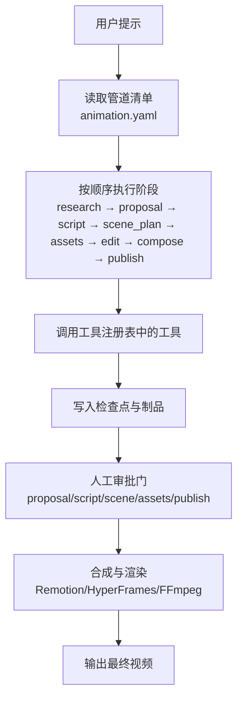
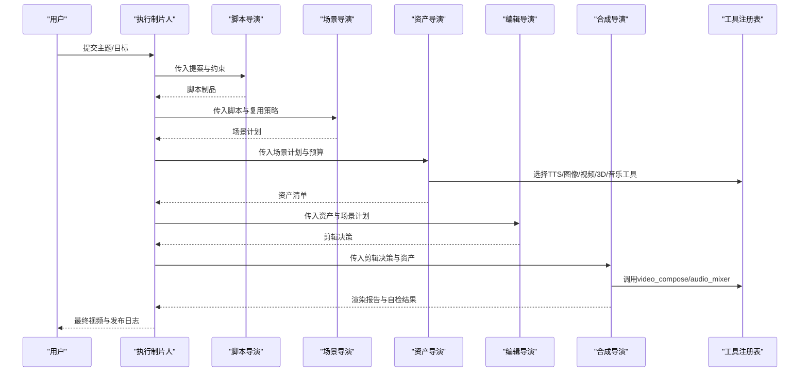
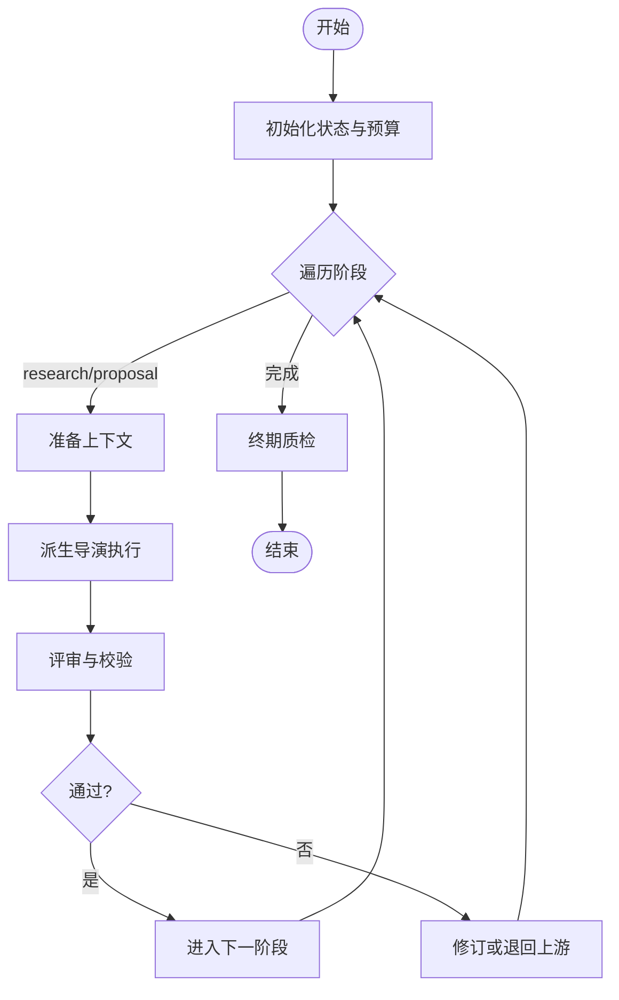
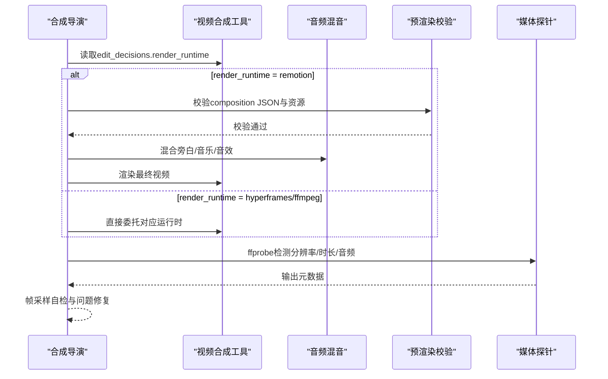
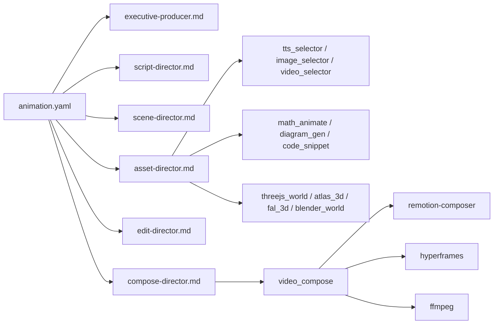

# 动画管道

<cite>
**本文引用的文件**
- [README.md](file://README.md)
- [PROJECT_CONTEXT.md](file://PROJECT_CONTEXT.md)
- [docs/ARCHITECTURE.md](file://docs/ARCHITECTURE.md)
- [pipeline_defs/animation.yaml](file://pipeline_defs/animation.yaml)
- [pipeline_defs/cinematic.yaml](file://pipeline_defs/cinematic.yaml)
- [skills/pipelines/animation/executive-producer.md](file://skills/pipelines/animation/executive-producer.md)
- [skills/pipelines/animation/script-director.md](file://skills/pipelines/animation/script-director.md)
- [skills/pipelines/animation/scene-director.md](file://skills/pipelines/animation/scene-director.md)
- [skills/pipelines/animation/asset-director.md](file://skills/pipelines/animation/asset-director.md)
- [skills/pipelines/animation/edit-director.md](file://skills/pipelines/animation/edit-director.md)
- [skills/pipelines/animation/compose-director.md](file://skills/pipelines/animation/compose-director.md)
</cite>

## 目录
1. [简介](#简介)
2. [项目结构](#项目结构)
3. [核心组件](#核心组件)
4. [架构总览](#架构总览)
5. [详细组件分析](#详细组件分析)
6. [依赖分析](#依赖分析)
7. [性能考虑](#性能考虑)
8. [故障排查指南](#故障排查指南)
9. [结论](#结论)
10. [附录](#附录)

## 简介
本技术文档聚焦 OpenMontage 的“动画管道”，系统化阐述从创意构思到后期编辑的完整流程，并明确执行制片人、脚本导演、场景导演、资产导演、合成导演与编辑导演的职责边界。文档同时解释管道如何协调 AI 工具完成角色动画、场景动画与特效处理，并提供质量优化技巧、性能调优策略以及可复现的项目实践要点。

## 项目结构
OpenMontage 采用“指令驱动 + 工具注册”的架构：YAML 清单定义阶段与准入条件，Markdown 技能文件指导智能体如何执行每个阶段，Python 提供工具与持久化能力。动画管道通过 pipeline_defs/animation.yaml 声明阶段序列、所需技能、可用工具与审查焦点；各导演技能文件（executive-producer、script、scene、asset、edit、compose）则细化每阶段的输入、过程、质量门与常见陷阱。

**图示来源**
- [pipeline_defs/animation.yaml:62-300](file://pipeline_defs/animation.yaml#L62-L300)
- [docs/ARCHITECTURE.md:11-27](file://docs/ARCHITECTURE.md#L11-L27)

**章节来源**
- [pipeline_defs/animation.yaml:1-300](file://pipeline_defs/animation.yaml#L1-L300)
- [docs/ARCHITECTURE.md:31-76](file://docs/ARCHITECTURE.md#L31-L76)

## 核心组件
- 执行制片人（Executive Producer）
  - 维护跨阶段累计状态（预算、时长、风格锚点、数学准确性约束等），串行调度各导演，实施质量门禁与回滚机制。
- 脚本导演（Script Director）
  - 将已批准提案转化为“动画节拍”脚本，控制字数与时长匹配、留白与视觉停顿、字幕与屏幕文本限制，并为旁白注入表现提示。
- 场景导演（Scene Director）
  - 将脚本映射为可执行的场景计划，限定转场家族、指定每场景动画模式与工具路径，保证视觉一致性与复用策略落地。
- 资产导演（Asset Director）
  - 生成或编排实际素材：旁白、图表、数学动画、代码可视化、3D 世界、音乐与可复用模板；对高成本资产先出样再批量生产。
- 编辑导演（Edit Director）
  - 制定时间线级剪辑决策，保护停顿与层次揭示，确保运动服务于信息层级而非装饰。
- 合成导演（Compose Director）
  - 负责最终合成与渲染，严格遵循锁定渲染运行时（Remotion/HyperFrames/FFmpeg），执行预渲染校验与后渲染自检，保障文本锐度、时序与音频同步。

**章节来源**
- [skills/pipelines/animation/executive-producer.md:32-87](file://skills/pipelines/animation/executive-producer.md#L32-L87)
- [skills/pipelines/animation/script-director.md:17-93](file://skills/pipelines/animation/script-director.md#L17-L93)
- [skills/pipelines/animation/scene-director.md:15-99](file://skills/pipelines/animation/scene-director.md#L15-L99)
- [skills/pipelines/animation/asset-director.md:37-127](file://skills/pipelines/animation/asset-director.md#L37-L127)
- [skills/pipelines/animation/edit-director.md:1-55](file://skills/pipelines/animation/edit-director.md#L1-L55)
- [skills/pipelines/animation/compose-director.md:7-35](file://skills/pipelines/animation/compose-director.md#L7-L35)

## 架构总览
OpenMontage 以“智能体即编排器”为核心：智能体读取 YAML 清单与 Markdown 技能，调用 Python 工具，产出制品并通过检查点持久化；在关键节点触发人工审批。动画管道在标准阶段之上，强化了动画特有的质量门（文本锐度、运动一致性、数学准确性、复用策略）。

**图示来源**
- [pipeline_defs/animation.yaml:62-300](file://pipeline_defs/animation.yaml#L62-L300)
- [docs/ARCHITECTURE.md:102-167](file://docs/ARCHITECTURE.md#L102-L167)

**章节来源**
- [docs/ARCHITECTURE.md:80-167](file://docs/ARCHITECTURE.md#L80-L167)
- [PROJECT_CONTEXT.md:9-57](file://PROJECT_CONTEXT.md#L9-L57)

## 详细组件分析

### 执行制片人（Executive Producer）
- 职责
  - 维护全局状态（预算、时长、风格锚点、数学准确性约束、叙事时长统计等）。
  - 串行调度各导演，执行 schema 校验、成功标准与审查焦点检查。
  - 实施跨阶段交叉检查（如旁白时长反馈、预算门、文本锐度、运动一致性）。
  - 管理修订上限、退回次数与超时保护，避免无限循环。
- 关键流程
  - 初始化：加载清单、风格手册、预算。
  - 阶段执行：准备→派生导演→评审→门禁决策（通过/修订/退回）。
  - 终检：探测输出、文本与图表锐度、运动一致性、风格一致性、数学准确性、预算对账。

**图示来源**
- [skills/pipelines/animation/executive-producer.md:89-203](file://skills/pipelines/animation/executive-producer.md#L89-L203)

**章节来源**
- [skills/pipelines/animation/executive-producer.md:1-431](file://skills/pipelines/animation/executive-producer.md#L1-L431)

### 脚本导演（Script Director）
- 职责
  - 将提案转化为动画节拍脚本，控制字数与时长匹配，预留视觉停顿。
  - 根据动画模式调整写作风格（Manim/Remotion/AI Video/Diagram Stills/Mixed）。
  - 为旁白注入表现提示（节奏、强调、停顿），并确保屏幕文本精简。
- 质量门
  - 每节表达一个清晰视觉想法；屏幕文本长度受限；时长匹配；研究数据融入；数学准确性保留。

**章节来源**
- [skills/pipelines/animation/script-director.md:17-128](file://skills/pipelines/animation/script-director.md#L17-L128)

### 场景导演（Scene Director）
- 职责
  - 将脚本映射为可执行场景计划，限定转场家族，指定每场景动画模式与工具路径。
  - 针对 image_animation（动漫/插画风格）规划镜头运动、粒子效果、光照渐变与景深。
  - 使用五维清单（主体、主体运动、场景、空间构图、摄影机）确保计划完备。
- 质量门
  - 每场景具备明确时序意图；过渡系统有限且有意义；工具路径明确；整体像一套设计系统。

**章节来源**
- [skills/pipelines/animation/scene-director.md:15-109](file://skills/pipelines/animation/scene-director.md#L15-L109)

### 资产导演（Asset Director）
- 职责
  - 生成或编排真实素材：旁白、图表、数学动画、代码可视化、3D 世界、音乐与可复用模板。
  - 对高成本资产先出样确认再批量生产；优先确定性资产（diagram/code/math）。
  - 为 image_animation 构建多图序列以实现平滑转场，并复制资源至 Remotion 公共目录。
- 质量门
  - 资产路径明确；可复用资产真正复用；缺失能力如实上报；引用文件存在；旁白应用已批准的语音表现设置。

**章节来源**
- [skills/pipelines/animation/asset-director.md:37-146](file://skills/pipelines/animation/asset-director.md#L37-L146)

### 编辑导演（Edit Director）
- 职责
  - 将场景计划转为时间线级剪辑决策，保护停顿与层次揭示，确保运动服务于信息层级。
  - 配置旁白段落的音乐避让（ducking），保持平台可读性。
- 质量门
  - 关键信息有足够停留时间；运动强化层级；转场一致；目标平台可读。

**章节来源**
- [skills/pipelines/animation/edit-director.md:1-55](file://skills/pipelines/animation/edit-director.md#L1-L55)

### 合成导演（Compose Director）
- 职责
  - 严格按提案锁定的渲染运行时（Remotion/HyperFrames/FFmpeg）进行合成与渲染，禁止静默切换。
  - 构建 composition JSON（image_animation 场景）、选择音乐并计算最佳偏移、执行预渲染校验。
  - 执行后渲染自检：帧采样、ffprobe 验证、承诺保持检查。
- 质量门
  - 文本与图表锐度；运动时序完整；音频同步；时长偏差在允许范围；运行时未静默替换。

**图示来源**
- [skills/pipelines/animation/compose-director.md:7-35](file://skills/pipelines/animation/compose-director.md#L7-L35)
- [skills/pipelines/animation/compose-director.md:150-217](file://skills/pipelines/animation/compose-director.md#L150-L217)

**章节来源**
- [skills/pipelines/animation/compose-director.md:1-237](file://skills/pipelines/animation/compose-director.md#L1-L237)

## 依赖分析
- 管道清单依赖
  - animation.yaml 声明阶段顺序、所需技能、可用工具、审查焦点与成功标准。
  - cinematic.yaml 展示电影感管道的类似结构，便于对比不同类别的差异化要求。
- 技能依赖
  - 各导演技能依赖元技能（reviewer、checkpoint-protocol、voice-performance-director、animation-runtime-selector）。
- 工具依赖
  - 工具注册表自动发现 BaseTool 子类；选择器（tts/image/video_selector）基于七维度评分路由到具体提供者。
- 运行时依赖
  - 渲染运行时在提案阶段锁定，合成阶段不可静默切换；Remotion/HyperFrames/FFmpeg 三引擎由 video_compose 统一调度。

**图示来源**
- [pipeline_defs/animation.yaml:30-48](file://pipeline_defs/animation.yaml#L30-L48)
- [docs/ARCHITECTURE.md:139-167](file://docs/ARCHITECTURE.md#L139-L167)
- [docs/ARCHITECTURE.md:448-475](file://docs/ARCHITECTURE.md#L448-L475)

**章节来源**
- [pipeline_defs/animation.yaml:1-300](file://pipeline_defs/animation.yaml#L1-L300)
- [docs/ARCHITECTURE.md:102-167](file://docs/ARCHITECTURE.md#L102-L167)

## 性能考虑
- 渲染前校验
  - 强制运行 composition_validator，避免缺失资源、错误时序导致的黑帧与失败渲染。
- 资源组织
  - 将生成的图片与音乐复制到 Remotion 公共目录，防止静态资源解析失败。
- 音频能量分析
  - 使用音频能量分析工具选取最佳起始偏移与是否需要循环，提升听感与时长匹配。
- 文本与图表锐度
  - 渲染参数（CRF、编码）需兼顾清晰度与体积；导出时避免过度压缩导致细线模糊。
- 运行时选择
  - 在提案阶段锁定渲染运行时，避免运行时切换带来的不一致与额外开销。
- 预算治理
  - 估算→预留→对账，单动作审批阈值与总预算上限防止超支。

**章节来源**
- [skills/pipelines/animation/compose-director.md:108-168](file://skills/pipelines/animation/compose-director.md#L108-L168)
- [docs/ARCHITECTURE.md:290-318](file://docs/ARCHITECTURE.md#L290-L318)

## 故障排查指南
- 渲染失败（黑帧/缺资源）
  - 检查是否已将图片与音乐复制到 Remotion 公共目录；确认 composition JSON 中路径正确；运行 composition_validator。
- 文本模糊/线条发虚
  - 调整 CRF 与编码参数；避免移动端过密排版；确保矢量/高分辨率源。
- 时长漂移
  - 使用 ffprobe 检测输出；核对剪辑决策与场景时长；定位造成漂移的阶段。
- 运行时静默切换
  - 若检测到 runtime_swap_detected，需在 decision_log 记录 render_runtime_selection 并等待审批。
- 旁白与画面不同步
  - 核查旁白实际时长与场景时长关系；必要时退回脚本或场景阶段调整。
- 预算超限
  - 检查 CostTracker 预估与预留；降低高成本工具使用频率或切换到免费/本地替代。

**章节来源**
- [skills/pipelines/animation/compose-director.md:150-217](file://skills/pipelines/animation/compose-director.md#L150-L217)
- [docs/ARCHITECTURE.md:290-318](file://docs/ARCHITECTURE.md#L290-L318)

## 结论
OpenMontage 的动画管道通过“执行制片人”集中治理跨阶段状态与质量门，配合各导演技能将创意逐步工程化。借助工具注册表与选择器，系统可在云 API 与本地开源方案之间灵活路由；通过严格的预/后渲染校验与预算治理，确保最终交付的质量与可控成本。对于复杂任务（角色动画、场景动画、特效处理），建议优先使用确定性资产与可复用模板，并在提案阶段锁定渲染运行时，以获得稳定一致的产出。

## 附录
- 快速参考
  - 动画模式：image_animation、clip_video、manim、remotion_dataviz、diagram_stills、mixed。
  - 渲染运行时：remotion（React/Remotion）、hyperframes（HTML/CSS/GSAP）、ffmpeg（简单拼接/转码）。
  - 关键制品：brief、script、scene_plan、asset_manifest、edit_decisions、render_report、publish_log。
- 实践建议
  - 先出样再批量：对高成本资产（TTS、图像、视频、3D）先做样本确认。
  - 复用优先：建立可复用模板与样式锚点，减少重复劳动。
  - 数据驱动：利用研究简报中的数据点与准确性约束，避免误导简化。
  - 平台适配：根据目标平台选择媒体配置文件（YouTube/TikTok/Instagram 等）。

**章节来源**
- [pipeline_defs/animation.yaml:62-300](file://pipeline_defs/animation.yaml#L62-L300)
- [docs/ARCHITECTURE.md:429-445](file://docs/ARCHITECTURE.md#L429-L445)
- [README.md:356-383](file://README.md#L356-L383)