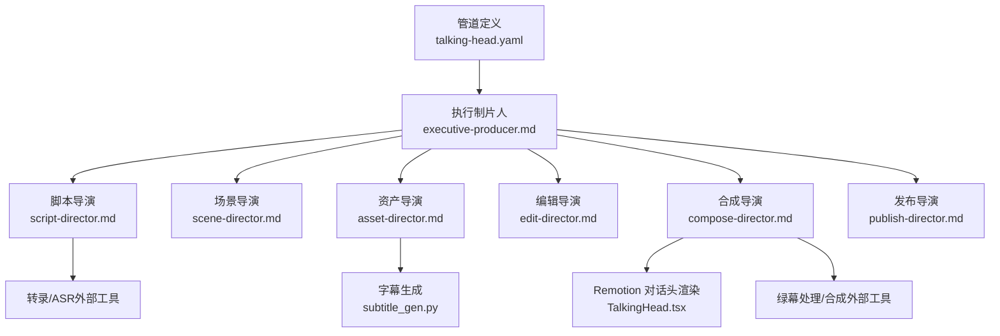
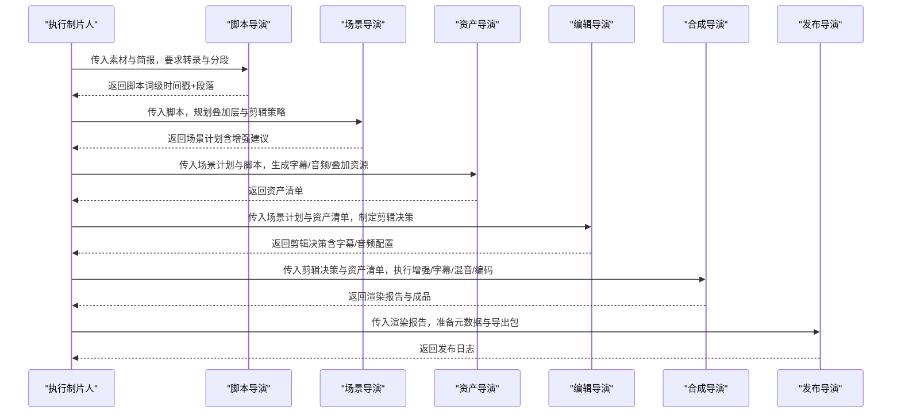
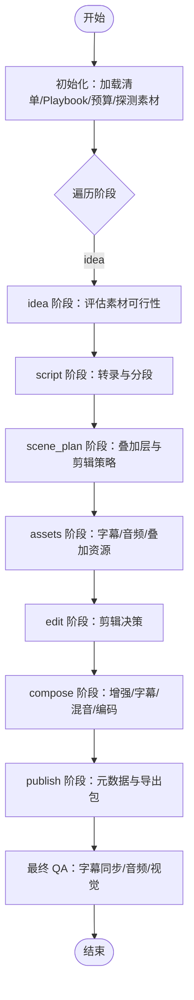
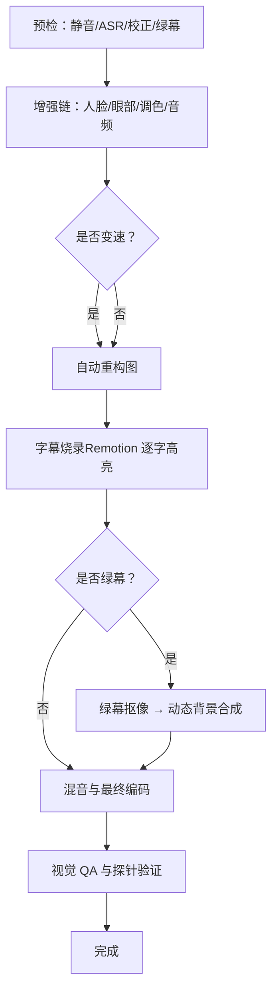
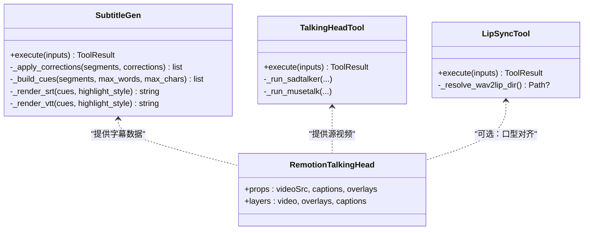
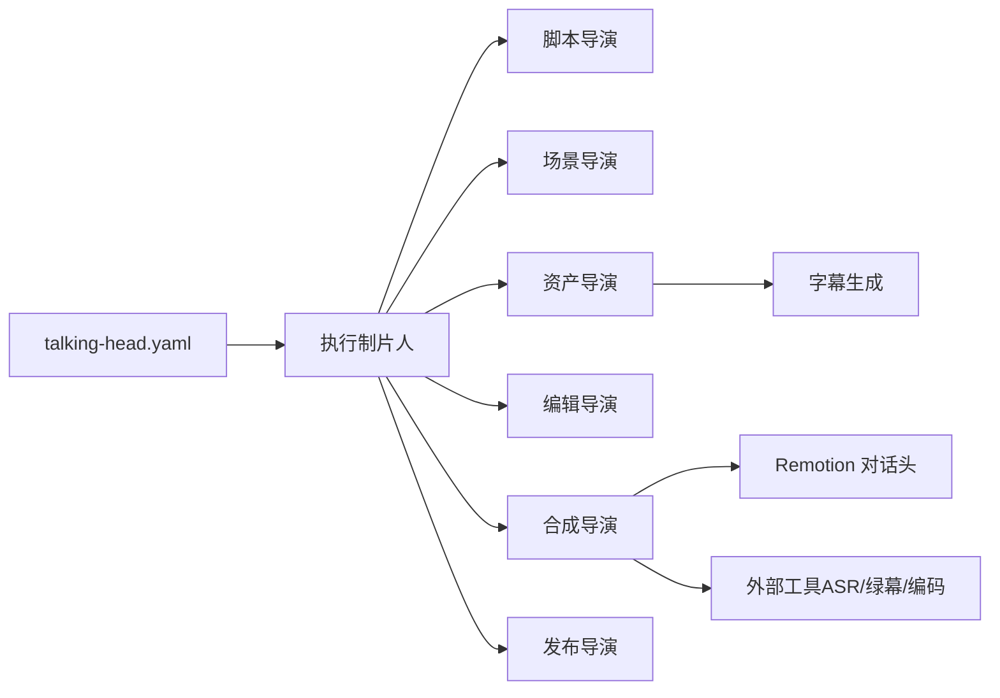

# 对话头管道

<cite>
**本文引用的文件**
- [pipeline_defs/talking-head.yaml](file://pipeline_defs/talking-head.yaml)
- [skills/pipelines/talking-head/executive-producer.md](file://skills/pipelines/talking-head/executive-producer.md)
- [skills/pipelines/talking-head/script-director.md](file://skills/pipelines/talking-head/script-director.md)
- [skills/pipelines/talking-head/scene-director.md](file://skills/pipelines/talking-head/scene-director.md)
- [skills/pipelines/talking-head/asset-director.md](file://skills/pipelines/talking-head/asset-director.md)
- [skills/pipelines/talking-head/edit-director.md](file://skills/pipelines/talking-head/edit-director.md)
- [skills/pipelines/talking-head/compose-director.md](file://skills/pipelines/talking-head/compose-director.md)
- [skills/pipelines/talking-head/publish-director.md](file://skills/pipelines/talking-head/publish-director.md)
- [tools/avatar/talking_head.py](file://tools/avatar/talking_head.py)
- [tools/avatar/lip_sync.py](file://tools/avatar/lip_sync.py)
- [tools/subtitle/subtitle_gen.py](file://tools/subtitle/subtitle_gen.py)
- [remotion-composer/src/TalkingHead.tsx](file://remotion-composer/src/TalkingHead.tsx)
</cite>

## 目录
1. [简介](#简介)
2. [项目结构](#项目结构)
3. [核心组件](#核心组件)
4. [架构总览](#架构总览)
5. [详细组件分析](#详细组件分析)
6. [依赖关系分析](#依赖关系分析)
7. [性能考量](#性能考量)
8. [故障排查指南](#故障排查指南)
9. [结论](#结论)
10. [附录](#附录)

## 简介
本技术文档系统化阐述 OpenMontage 的“对话头视频”自动化制作管道，覆盖从原始口播素材到最终可发布视频的完整流程。该管道以“执行制片人”为中枢，串联脚本导演、场景导演、资产导演、编辑导演、合成导演与发布导演，形成端到端协作机制。对话头视频的核心能力包括：
- 口型同步：通过本地或云端模型将音频驱动至人脸动画，实现自然口型匹配
- 表情增强：对生成或实拍的人脸进行细节优化（如眼部提亮、黑眼圈淡化）
- 背景替换：绿幕/蓝幕检测与抠像，结合动态背景合成
- 字幕生成：基于词级时间戳的字幕生成与逐字高亮渲染
- 音频优化：降噪、响度标准化、背景音乐混音与避让

同时，文档说明如何利用 AI 技术（语音识别、语音合成、面部捕捉与渲染）达成接近真人的视频效果，并提供质量优化技巧、多语言支持与批量生产策略，以及教育内容、企业培训与社交媒体内容的实际应用案例。

## 项目结构
对话头管道的定义与编排由 YAML 清单管理，各阶段由对应的“技能文档”描述职责与流程；工具层提供字幕、口型同步、唇形对齐等能力；Remotion 前端用于高质量字幕与叠加层渲染。

**图表来源**
- [pipeline_defs/talking-head.yaml:1-229](file://pipeline_defs/talking-head.yaml#L1-L229)
- [skills/pipelines/talking-head/executive-producer.md:1-447](file://skills/pipelines/talking-head/executive-producer.md#L1-L447)
- [skills/pipelines/talking-head/script-director.md:1-77](file://skills/pipelines/talking-head/script-director.md#L1-L77)
- [skills/pipelines/talking-head/scene-director.md:1-253](file://skills/pipelines/talking-head/scene-director.md#L1-L253)
- [skills/pipelines/talking-head/asset-director.md:1-218](file://skills/pipelines/talking-head/asset-director.md#L1-L218)
- [skills/pipelines/talking-head/edit-director.md:1-77](file://skills/pipelines/talking-head/edit-director.md#L1-L77)
- [skills/pipelines/talking-head/compose-director.md:1-478](file://skills/pipelines/talking-head/compose-director.md#L1-L478)
- [skills/pipelines/talking-head/publish-director.md:1-62](file://skills/pipelines/talking-head/publish-director.md#L1-L62)
- [tools/subtitle/subtitle_gen.py:1-336](file://tools/subtitle/subtitle_gen.py#L1-L336)
- [remotion-composer/src/TalkingHead.tsx:1-366](file://remotion-composer/src/TalkingHead.tsx#L1-L366)

**章节来源**
- [pipeline_defs/talking-head.yaml:1-229](file://pipeline_defs/talking-head.yaml#L1-L229)

## 核心组件
- 执行制片人（EP）：维护全局状态、预算、素材元数据与各阶段产物；串行调度并评审每个阶段，必要时回退修订或跨阶段回送；最终 QA 把关字幕同步、音频质量与视觉质量。
- 脚本导演：使用 ASR 获取词级时间戳，按主题切分段落，产出结构化脚本。
- 场景导演：分析画面（背景类型、人物位置、光照），规划叠加层（图表、统计卡、标题等）与剪辑策略（静音裁剪、变速、自动重构图）。
- 资产导演：生成字幕、提取与处理音频、选择或生成背景乐、生成叠加层资源，构建资产清单。
- 编辑导演：依据场景计划与资产清单制定剪辑决策（静音裁剪模式、主片段、字幕配置、音频配置、叠加层时机）。
- 合成导演：执行增强链（人脸/眼部增强、调色、音频增强）、自动重构图、字幕烧录（Remotion 逐字高亮优先）、绿幕抠像与背景合成、多段拼接、混音与最终编码。
- 发布导演：生成平台化元数据、缩略图概念、导出包与发布日志。

关键工具：
- 字幕生成：支持 SRT/VTT/Caption JSON，含逐字高亮与校正字典
- 口型同步：SadTalker/MuseTalk 驱动静态人像生成说话视频
- 唇形对齐：Wav2Lip 将新配音与原有口型对齐（本地 GPU）
- Remotion 对话头渲染：三层结构（视频底、叠加层中、字幕顶），支持多种叠加组件与样式

**章节来源**
- [skills/pipelines/talking-head/executive-producer.md:1-447](file://skills/pipelines/talking-head/executive-producer.md#L1-L447)
- [skills/pipelines/talking-head/script-director.md:1-77](file://skills/pipelines/talking-head/script-director.md#L1-L77)
- [skills/pipelines/talking-head/scene-director.md:1-253](file://skills/pipelines/talking-head/scene-director.md#L1-L253)
- [skills/pipelines/talking-head/asset-director.md:1-218](file://skills/pipelines/talking-head/asset-director.md#L1-L218)
- [skills/pipelines/talking-head/edit-director.md:1-77](file://skills/pipelines/talking-head/edit-director.md#L1-L77)
- [skills/pipelines/talking-head/compose-director.md:1-478](file://skills/pipelines/talking-head/compose-director.md#L1-L478)
- [skills/pipelines/talking-head/publish-director.md:1-62](file://skills/pipelines/talking-head/publish-director.md#L1-L62)
- [tools/subtitle/subtitle_gen.py:1-336](file://tools/subtitle/subtitle_gen.py#L1-L336)
- [tools/avatar/talking_head.py:1-259](file://tools/avatar/talking_head.py#L1-L259)
- [tools/avatar/lip_sync.py:1-232](file://tools/avatar/lip_sync.py#L1-L232)
- [remotion-composer/src/TalkingHead.tsx:1-366](file://remotion-composer/src/TalkingHead.tsx#L1-L366)

## 架构总览
对话头管道采用“阶段门控 + 中央协调”的架构。YAML 清单定义阶段顺序、所需制品、可用工具与审查重点；执行制片人负责注入上下文、评审输出、控制预算与修订次数，并在必要时向先前阶段回送问题。

**图表来源**
- [pipeline_defs/talking-head.yaml:1-229](file://pipeline_defs/talking-head.yaml#L1-L229)
- [skills/pipelines/talking-head/executive-producer.md:1-447](file://skills/pipelines/talking-head/executive-producer.md#L1-L447)

## 详细组件分析

### 执行制片人（EP）
- 职责：初始化管线、探测素材元数据、串行调度各阶段、Schema 校验、成功标准检查、跨阶段一致性校验（预算、时长、风格锚点、转录连续性）、最终 QA（字幕同步、音频质量、视觉质量）。
- 关键机制：每阶段最多修订次数限制、跨阶段回送上限、超时与预算保护；失败时精准定位回退目标（如字幕漂移→资产导演，音频问题→合成导演）。
- 质量门禁：idea→script→scene_plan→assets→edit→compose→publish 七道关卡，最终全量复核。

**图表来源**
- [pipeline_defs/talking-head.yaml:1-229](file://pipeline_defs/talking-head.yaml#L1-L229)
- [skills/pipelines/talking-head/executive-producer.md:1-447](file://skills/pipelines/talking-head/executive-producer.md#L1-L447)

**章节来源**
- [pipeline_defs/talking-head.yaml:1-229](file://pipeline_defs/talking-head.yaml#L1-L229)
- [skills/pipelines/talking-head/executive-producer.md:1-447](file://skills/pipelines/talking-head/executive-producer.md#L1-L447)

### 脚本导演
- 输入：素材与简报
- 过程：使用 ASR 获取词级时间戳；按主题切分段落；补充增强提示与演讲者备注；自检准确性与覆盖率；提交制品。
- 关键点：确保时间戳单调递增、无长空白；低置信度时触发修订；携带转录数据至后续阶段以保证字幕同步。

**章节来源**
- [skills/pipelines/talking-head/script-director.md:1-77](file://skills/pipelines/talking-head/script-director.md#L1-L77)

### 场景导演
- 输入：脚本与素材
- 过程：采样帧分析背景/人物位置/光照；提出叠加层方案（文本卡、统计卡、对比、图表、KPI、进度条、标题、引用、下三分之一等）；规划静音裁剪、变速、自动重构图；提交场景计划。
- 关键点：叠加层密度与多样性控制；在竖屏（720px）下避免超宽组件（如 comparison）；根据人物安全区放置叠加层。

**章节来源**
- [skills/pipelines/talking-head/scene-director.md:1-253](file://skills/pipelines/talking-head/scene-director.md#L1-L253)

### 资产导演
- 输入：场景计划与脚本
- 过程：生成字幕（SRT/VTT/Caption JSON，支持逐字高亮与校正字典）；提取与处理音频；选择或生成背景音乐；生成叠加层资源（Remotion 组件映射）；构建资产清单。
- 关键点：Hero 场景先出样确认风格；叠加层数据必须数值化（kpi_grid 等）；音乐能量分析确定最佳起始偏移。

**章节来源**
- [skills/pipelines/talking-head/asset-director.md:1-218](file://skills/pipelines/talking-head/asset-director.md#L1-L218)
- [tools/subtitle/subtitle_gen.py:1-336](file://tools/subtitle/subtitle_gen.py#L1-L336)

### 编辑导演
- 输入：场景计划与资产清单
- 过程：应用静音裁剪（remove/speed_up）；定义主片段；配置字幕与音频；规划叠加层时机；自检覆盖率与完整性。
- 关键点：裁剪需保留必要上下文；字幕启用且样式符合 Playbook；音频配置完整（人声与背景音乐避让）。

**章节来源**
- [skills/pipelines/talking-head/edit-director.md:1-77](file://skills/pipelines/talking-head/edit-director.md#L1-L77)

### 合成导演
- 输入：剪辑决策与资产清单
- 过程：预检（静音标记、ASR 置信度、校正字典、绿幕标志）；增强链（人脸/眼部增强、调色、音频增强）；变速；自动重构图；字幕烧录（Remotion 逐字高亮优先，FFmpeg 降级）；绿幕抠像与动态背景合成；多段拼接；混音；最终编码；视觉 QA。
- 关键点：字幕必须位于底部（避免遮挡人脸）；竖屏字幕位置强制调整；叠加层与字幕在同一 Remotion 通道渲染；最终编码按平台规格控制体积与码率。

**图表来源**
- [skills/pipelines/talking-head/compose-director.md:1-478](file://skills/pipelines/talking-head/compose-director.md#L1-L478)
- [remotion-composer/src/TalkingHead.tsx:1-366](file://remotion-composer/src/TalkingHead.tsx#L1-L366)

**章节来源**
- [skills/pipelines/talking-head/compose-director.md:1-478](file://skills/pipelines/talking-head/compose-director.md#L1-L478)
- [remotion-composer/src/TalkingHead.tsx:1-366](file://remotion-composer/src/TalkingHead.tsx#L1-L366)

### 发布导演
- 输入：渲染报告与简报
- 过程：生成平台化元数据（标题、描述、标签、章节）；缩略图概念；导出包（视频、元数据、描述、章节、缩略图）；发布日志。
- 关键点：元数据需具吸引力与信息性；导出包结构完整。

**章节来源**
- [skills/pipelines/talking-head/publish-director.md:1-62](file://skills/pipelines/talking-head/publish-director.md#L1-L62)

### 工具与渲染组件
- 字幕生成器：纯 Python，支持 SRT/VTT/Caption JSON，逐字高亮与校正字典，保证时间戳格式正确。
- 口型同步工具：SadTalker/MuseTalk 驱动静态人像生成说话视频；参数包括表达式强度、静止模式、预处理方式。
- 唇形对齐工具：Wav2Lip 将新配音与原有口型对齐，支持模型变体与裁剪参数。
- Remotion 对话头渲染：三层结构（视频底、叠加层中、字幕顶），支持多种叠加组件（文本卡、统计卡、对比、图表、KPI、标题、引用等）与样式配置。

**图表来源**
- [tools/subtitle/subtitle_gen.py:1-336](file://tools/subtitle/subtitle_gen.py#L1-L336)
- [tools/avatar/talking_head.py:1-259](file://tools/avatar/talking_head.py#L1-L259)
- [tools/avatar/lip_sync.py:1-232](file://tools/avatar/lip_sync.py#L1-L232)
- [remotion-composer/src/TalkingHead.tsx:1-366](file://remotion-composer/src/TalkingHead.tsx#L1-L366)

**章节来源**
- [tools/subtitle/subtitle_gen.py:1-336](file://tools/subtitle/subtitle_gen.py#L1-L336)
- [tools/avatar/talking_head.py:1-259](file://tools/avatar/talking_head.py#L1-L259)
- [tools/avatar/lip_sync.py:1-232](file://tools/avatar/lip_sync.py#L1-L232)
- [remotion-composer/src/TalkingHead.tsx:1-366](file://remotion-composer/src/TalkingHead.tsx#L1-L366)

## 依赖关系分析
- 阶段依赖：YAML 清单明确各阶段所需制品与工具，EP 负责注入上下文与校验。
- 工具依赖：字幕生成无需外部依赖；口型同步与唇形对齐需要本地 GPU 与相应模型路径；Remotion 渲染需要前端环境与组件库。
- 外部集成：ASR（WhisperX）、绿幕处理、媒体编码（FFmpeg）等作为外部工具被调用。

**图表来源**
- [pipeline_defs/talking-head.yaml:1-229](file://pipeline_defs/talking-head.yaml#L1-L229)
- [skills/pipelines/talking-head/executive-producer.md:1-447](file://skills/pipelines/talking-head/executive-producer.md#L1-L447)

**章节来源**
- [pipeline_defs/talking-head.yaml:1-229](file://pipeline_defs/talking-head.yaml#L1-L229)

## 性能考量
- 转录与字幕：词级时间戳生成影响字幕同步精度；校正字典可减少常见误识导致的后期返工。
- 增强链：人脸/眼部增强与调色会增加渲染时间；建议按需启用并保持适度强度以避免失真。
- 自动重构图：基于人脸跟踪的动态裁剪会引入额外计算；建议在增强后、字幕前执行。
- 字幕烧录：Remotion 逐字高亮体验最佳但耗时；若不可用则降级 FFmpeg，需注意竖屏字幕位置。
- 最终编码：按平台规格控制码率与体积，避免过大导致上传失败或播放卡顿。

[本节为通用指导，不直接分析具体文件]

## 故障排查指南
- 转录质量低：检查 ASR 置信度，必要时更换模型或语言提示；修正校正字典并重新生成字幕。
- 字幕不同步：核对字幕 cue 时间与词级时间戳偏差（阈值 ±0.3s）；若漂移较大，回退至资产导演重新生成。
- 音频问题：检查噪声、响度与背景音乐避让；必要时在合成阶段重新混音。
- 视觉问题：检查人脸增强过度、字幕遮挡人脸、转场伪影；使用视觉 QA 抽取关键帧复核。
- 绿幕合成失败：确认背景颜色检测与抠像方法；动态背景渲染后再合成；最后再烧字幕。

**章节来源**
- [skills/pipelines/talking-head/executive-producer.md:1-447](file://skills/pipelines/talking-head/executive-producer.md#L1-L447)
- [skills/pipelines/talking-head/compose-director.md:1-478](file://skills/pipelines/talking-head/compose-director.md#L1-L478)

## 结论
OpenMontage 的对话头管道通过严谨的阶段门控与中央协调，实现了从原始素材到高质量成品的自动化制作。借助 ASR、AI 面部动画、Remotion 渲染与完善的增强链，系统能够稳定产出具备口型同步、表情增强、背景替换、字幕生成与音频优化的对话头视频。配合质量优化技巧、多语言支持与批量生产策略，该管道适用于教育内容、企业培训与社交媒体等多种场景。

[本节为总结，不直接分析具体文件]

## 附录
- 多语言支持：同一人像照片可为不同语言生成独立音频轨道，分别驱动口型动画并组合为多语言版本。
- 批量生产策略：统一 Playbook 与样式模板，批量生成字幕与叠加层；利用资产清单与 Remotion 组件复用提升效率。
- 应用场景：
  - 教育内容：讲师口播 + 图表/统计卡叠加，逐字高亮字幕提升可读性
  - 企业培训：绿幕抠像 + 动态背景，专业呈现；背景音乐避让突出讲解
  - 社交媒体：短视频节奏（静音裁剪/变速），竖屏自动重构图，快速产出

[本节为扩展信息，不直接分析具体文件]