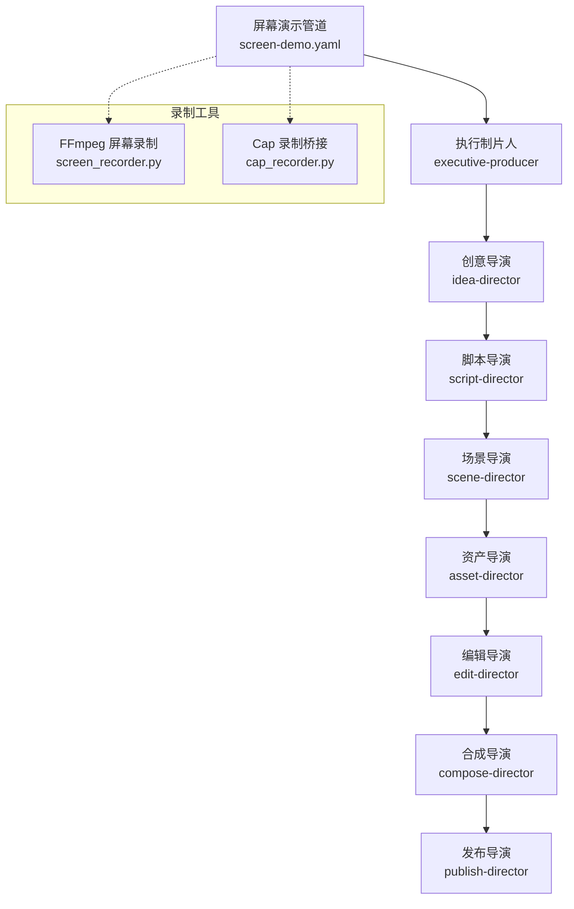
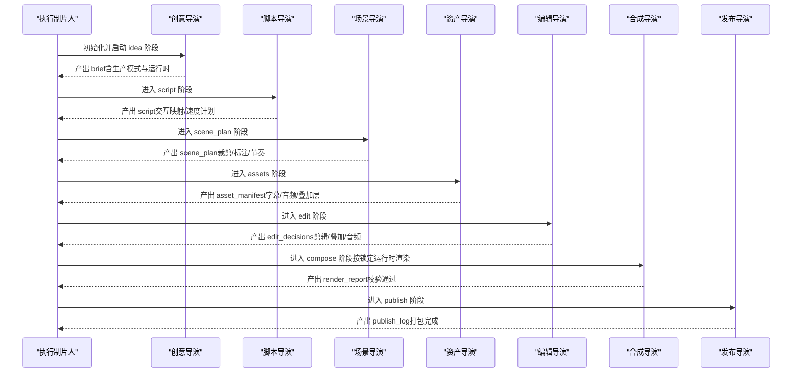
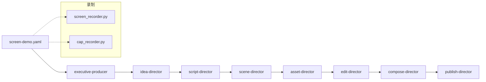

# 屏幕演示管道

<cite>
**本文引用的文件**
- [pipeline_defs/screen-demo.yaml](file://pipeline_defs/screen-demo.yaml)
- [skills/pipelines/screen-demo/executive-producer.md](file://skills/pipelines/screen-demo/executive-producer.md)
- [skills/pipelines/screen-demo/idea-director.md](file://skills/pipelines/screen-demo/idea-director.md)
- [skills/pipelines/screen-demo/script-director.md](file://skills/pipelines/screen-demo/script-director.md)
- [skills/pipelines/screen-demo/scene-director.md](file://skills/pipelines/screen-demo/scene-director.md)
- [skills/pipelines/screen-demo/asset-director.md](file://skills/pipelines/screen-demo/asset-director.md)
- [skills/pipelines/screen-demo/edit-director.md](file://skills/pipelines/screen-demo/edit-director.md)
- [skills/pipelines/screen-demo/compose-director.md](file://skills/pipelines/screen-demo/compose-director.md)
- [skills/pipelines/screen-demo/publish-director.md](file://skills/pipelines/screen-demo/publish-director.md)
- [tools/capture/screen_recorder.py](file://tools/capture/screen_recorder.py)
- [tools/capture/cap_recorder.py](file://tools/capture/cap_recorder.py)
</cite>

## 目录
1. [简介](#简介)
2. [项目结构](#项目结构)
3. [核心组件](#核心组件)
4. [架构总览](#架构总览)
5. [详细组件分析](#详细组件分析)
6. [依赖关系分析](#依赖关系分析)
7. [性能与质量考量](#性能与质量考量)
8. [故障排查指南](#故障排查指南)
9. [结论](#结论)
10. [附录](#附录)

## 简介
本技术文档围绕 OpenMontage 的“屏幕演示管道”展开，系统化说明如何通过执行制片人、脚本导演、场景导演、资产导演、合成导演、编辑导演和发布导演的协作，自动化制作专业的软件教程与产品演示。文档覆盖两大生产模式：真实录制（real_capture）与合成终端（synthetic_terminal），并深入讲解屏幕录制的核心技术要点：鼠标轨迹优化、键盘输入高亮、界面元素标注、操作步骤分解和用户引导设计。同时给出多分辨率适配、操作加速、错误处理与用户反馈集成的实践方案，以及质量标准、无障碍访问与多平台发布策略，并提供培训、演示与手册落地的应用案例指引。

## 项目结构
屏幕演示管道由一个编排清单与七个导演技能组成，配合底层录制工具与渲染工具链完成端到端流程。关键位置如下：
- 管道定义：pipeline_defs/screen-demo.yaml
- 导演技能：skills/pipelines/screen-demo/*
- 录制工具：tools/capture/screen_recorder.py、tools/capture/cap_recorder.py

图表来源
- [pipeline_defs/screen-demo.yaml:1-247](file://pipeline_defs/screen-demo.yaml#L1-L247)
- [skills/pipelines/screen-demo/executive-producer.md:1-278](file://skills/pipelines/screen-demo/executive-producer.md#L1-L278)
- [tools/capture/screen_recorder.py:1-395](file://tools/capture/screen_recorder.py#L1-L395)
- [tools/capture/cap_recorder.py:1-441](file://tools/capture/cap_recorder.py#L1-L441)

章节来源
- [pipeline_defs/screen-demo.yaml:1-247](file://pipeline_defs/screen-demo.yaml#L1-L247)

## 核心组件
- 执行制片人（Executive Producer）：串行编排七阶段，维护累计状态与预算，设置跨阶段质量门控，最终进行输出验证与放行决策。
- 创意导演（Idea Director）：确定生产模式（real_capture 或 synthetic_terminal）、目标时长、平台形状、运行时选择（Remotion/Hyperframes/FFmpeg），产出 brief。
- 脚本导演（Script Director）：基于源素材生成时间戳化的步骤脚本，构建交互映射、速度计划与章节候选。
- 场景导演（Scene Director）：规划注意力移动、缩放裁剪区域、标注与遮罩策略、节奏与分镜形状。
- 资产导演（Asset Director）：产出字幕、音频增强、可复用叠加层、可选 TTS 与辅助卡片；对合成模式产出 steps 与旁白对齐。
- 编辑导演（Edit Director）：将计划转化为可执行的剪辑决策（裁剪、变速、叠加、字幕、音频行为）。
- 合成导演（Compose Director）：按锁定运行时渲染最终视频，校验文本可读性、分辨率、音频与编码质量。
- 发布导演（Publish Director）：打包元数据、章节、缩略图概念与平台化文案，形成可发布的导出包。

章节来源
- [skills/pipelines/screen-demo/executive-producer.md:1-278](file://skills/pipelines/screen-demo/executive-producer.md#L1-L278)
- [skills/pipelines/screen-demo/idea-director.md:1-145](file://skills/pipelines/screen-demo/idea-director.md#L1-L145)
- [skills/pipelines/screen-demo/script-director.md:1-137](file://skills/pipelines/screen-demo/script-director.md#L1-L137)
- [skills/pipelines/screen-demo/scene-director.md:1-141](file://skills/pipelines/screen-demo/scene-director.md#L1-L141)
- [skills/pipelines/screen-demo/asset-director.md:1-176](file://skills/pipelines/screen-demo/asset-director.md#L1-L176)
- [skills/pipelines/screen-demo/edit-director.md:1-88](file://skills/pipelines/screen-demo/edit-director.md#L1-L88)
- [skills/pipelines/screen-demo/compose-director.md:1-100](file://skills/pipelines/screen-demo/compose-director.md#L1-L100)
- [skills/pipelines/screen-demo/publish-director.md:1-90](file://skills/pipelines/screen-demo/publish-director.md#L1-L90)

## 架构总览
屏幕演示管道采用“串行编排 + 多模式路由”的架构。执行制片人负责阶段推进与质量门禁；创意阶段即锁定生产模式与运行时；后续阶段在各自职责内产出结构化工件；合成阶段严格遵循锁定的运行时，禁止静默替换；发布阶段以平台为中心打包。

图表来源
- [pipeline_defs/screen-demo.yaml:43-69](file://pipeline_defs/screen-demo.yaml#L43-L69)
- [pipeline_defs/screen-demo.yaml:77-247](file://pipeline_defs/screen-demo.yaml#L77-L247)
- [skills/pipelines/screen-demo/compose-director.md:7-18](file://skills/pipelines/screen-demo/compose-director.md#L7-L18)

## 详细组件分析

### 执行制片人（Executive Producer）
- 职责：加载管道清单与风格规则，设定预算与目标时长，串行驱动各阶段，执行 schema 校验与成功标准检查，实施跨阶段质量门禁（如可读性、音频清晰度、节奏），必要时退回修订或重跑。
- 关键检查点：idea 后评估源素材可行性；script 后核验转录与时长估计；scene_plan 后校验裁剪可行性和标注布局；assets 后检查字幕定位与音频质量；edit 后确认时间线完整性与死时间处理；compose 后探测输出文件、文本锐度与音频清晰度；publish 后校验元数据与章节。
- 限制：每阶段最多修订次数、最大退回次数、总预算上限与总耗时上限。

章节来源
- [skills/pipelines/screen-demo/executive-producer.md:22-65](file://skills/pipelines/screen-demo/executive-producer.md#L22-L65)
- [skills/pipelines/screen-demo/executive-producer.md:67-137](file://skills/pipelines/screen-demo/executive-producer.md#L67-L137)
- [skills/pipelines/screen-demo/executive-producer.md:139-217](file://skills/pipelines/screen-demo/executive-producer.md#L139-L217)
- [skills/pipelines/screen-demo/executive-producer.md:248-278](file://skills/pipelines/screen-demo/executive-producer.md#L248-L278)

### 创意导演（Idea Director）
- 职责：根据需求判断生产模式（real_capture 或 synthetic_terminal），选择可行的运行时（Remotion/Hyperframes/FFmpeg），明确目标时长与平台形状，产出 schema 有效的 brief，并在 metadata 中记录生产真相（源路径、分辨率、是否有旁白、关键瞬间、死时间段等）。
- 运行时选择原则：当模式允许多运行时且机器可用时，需向用户呈现两种选项并推荐其一；若模式约束（如合成终端仅 Remotion），则显式告知约束并记录决策日志。

章节来源
- [skills/pipelines/screen-demo/idea-director.md:3-28](file://skills/pipelines/screen-demo/idea-director.md#L3-L28)
- [skills/pipelines/screen-demo/idea-director.md:46-129](file://skills/pipelines/screen-demo/idea-director.md#L46-L129)

### 脚本导演（Script Director）
- 职责：将源素材转译为带时间戳的步骤脚本，构建 interaction_map（点击、输入、等待、结果等），制定 speed_plan（实时、加速、剪切），并标记章节候选与需要放大的片段。
- 叙事原则：聚焦意图与效果而非游标运动；语言简洁直接；避免行话；保持语音与画面同步；保留原声说话人风格。

章节来源
- [skills/pipelines/screen-demo/script-director.md:15-48](file://skills/pipelines/screen-demo/script-director.md#L15-L48)
- [skills/pipelines/screen-demo/script-director.md:49-99](file://skills/pipelines/screen-demo/script-director.md#L49-L99)
- [skills/pipelines/screen-demo/script-director.md:100-137](file://skills/pipelines/screen-demo/script-director.md#L100-L137)

### 场景导演（Scene Director）
- 职责：规划注意力流动，决定何时保持全景、何时放大、何时重置；为关键 UI 元素制定 crop_regions（触发器、缩放级别、过渡时长、理由）；用克制的方式规划标注（高亮框、箭头、步骤标签、按键徽章、模糊遮罩）；为重复段落制定 speed_up/cut/realtime 策略；按段考虑不同画幅的可行性。
- 质量门禁：确保缩放连贯、标注不遮挡、节奏合理、敏感信息遮蔽。

章节来源
- [skills/pipelines/screen-demo/scene-director.md:16-64](file://skills/pipelines/screen-demo/scene-director.md#L16-L64)
- [skills/pipelines/screen-demo/scene-director.md:65-124](file://skills/pipelines/screen-demo/scene-director.md#L65-L124)
- [skills/pipelines/screen-demo/scene-director.md:125-141](file://skills/pipelines/screen-demo/scene-director.md#L125-L141)

### 资产导演（Asset Director）
- 职责：产出最小但高杠杆的资产——字幕、清理后的主音频、可复用叠加层套件（高亮框、箭头、步骤标签、按键徽章、模糊遮罩模板），以及在合成模式下生成与旁白对齐的 steps 列表与旁白，并进行节奏对齐验证。
- 模式分支：real_capture 侧重捕获+叠加；synthetic_terminal 无捕获，专注命令逐字输入、输出滚动、提示牌与光标闪烁的终端动画。
- 质量门禁：字幕存在性与解析、时间戳对齐、字体可读性、对比度、遮罩覆盖、TTS 可用性声明。

章节来源
- [skills/pipelines/screen-demo/asset-director.md:7-23](file://skills/pipelines/screen-demo/asset-director.md#L7-L23)
- [skills/pipelines/screen-demo/asset-director.md:33-74](file://skills/pipelines/screen-demo/asset-director.md#L33-L74)
- [skills/pipelines/screen-demo/asset-director.md:75-130](file://skills/pipelines/screen-demo/asset-director.md#L75-L130)
- [skills/pipelines/screen-demo/asset-director.md:131-176](file://skills/pipelines/screen-demo/asset-director.md#L131-L176)

### 编辑导演（Edit Director）
- 职责：将计划落地为可执行的剪辑决策，顺序为：裁剪/切掉死时间 → 变速 → 放置叠加层 → 设置字幕行为 → 定义音频行为；将屏幕演示特有细节写入 metadata（裁剪关键帧、速度计划、字幕位置覆盖、音频备注、变体备注）。
- 规则：首秒内展示有用动作或结果；结果时刻保持正常速度；安装/编译/等待加速或移除；避免过度动效；字幕与标注不冲突。

章节来源
- [skills/pipelines/screen-demo/edit-director.md:15-37](file://skills/pipelines/screen-demo/edit-director.md#L15-L37)
- [skills/pipelines/screen-demo/edit-director.md:38-88](file://skills/pipelines/screen-demo/edit-director.md#L38-L88)

### 合成导演（Compose Director）
- 职责：按锁定运行时渲染最终输出，优先保证可读性；选择合适的输出形状（16:9/1:1/9:16）；按正确顺序组合（裁剪/变速 → 构图 → 遮罩/叠加 → 烧录字幕 → 混音 → 编码）；使用文本友好的编码参数；严格校验输出文件、视觉与音频质量。
- 运行时路由：TerminalScene（合成终端）→ Remotion；混合捕获+动画 → Remotion；自定义 HTML UI → Hyperframes（需 lint+validate）；简单拼接 → FFmpeg。严禁静默替换运行时。

章节来源
- [skills/pipelines/screen-demo/compose-director.md:7-18](file://skills/pipelines/screen-demo/compose-director.md#L7-L18)
- [skills/pipelines/screen-demo/compose-director.md:29-60](file://skills/pipelines/screen-demo/compose-director.md#L29-L60)
- [skills/pipelines/screen-demo/compose-director.md:61-100](file://skills/pipelines/screen-demo/compose-director.md#L61-L100)

### 发布导演（Publish Director）
- 职责：构建可搜索的元数据（任务+工具+结果），以脚本章节为基础生成章节标记与包装要点；提供缩略图概念（展示结果状态、可识别工具表面、2-4 个价值词）；按平台准备视频、标题/描述、章节、关键词与缩略图概念；开发者/产品演示额外打包命令、软件版本与错误术语。
- 质量门禁：元数据命名准确、章节与实际渲染一致、导出文件夹整洁、文案针对平台定制。

章节来源
- [skills/pipelines/screen-demo/publish-director.md:15-68](file://skills/pipelines/screen-demo/publish-director.md#L15-L68)
- [skills/pipelines/screen-demo/publish-director.md:69-90](file://skills/pipelines/screen-demo/publish-director.md#L69-L90)

## 依赖关系分析
- 录制工具依赖：
  - screen_recorder.py：基于 FFmpeg 的跨平台屏幕录制（Windows/macOS/Linux），支持区域录制与可选音频采集，输出 MP4，失败时回退到 cap_recorder。
  - cap_recorder.py：检测 Cap 是否安装/运行，查找最近录制文件，提供安装指导与最新录制抓取，适合带摄像头画中画、光标高亮与点击效果的录制。
- 管道与导演依赖：
  - pipeline_defs/screen-demo.yaml 定义了阶段、所需技能、工具与审查焦点。
  - 各导演技能文件定义了输入/输出工件、工具可用性与质量门禁。
  - 合成阶段依赖 video_compose/audio_mixer/video_trimmer 等工具，并严格遵循运行时锁定。

图表来源
- [pipeline_defs/screen-demo.yaml:43-69](file://pipeline_defs/screen-demo.yaml#L43-L69)
- [tools/capture/screen_recorder.py:80-175](file://tools/capture/screen_recorder.py#L80-L175)
- [tools/capture/cap_recorder.py:163-250](file://tools/capture/cap_recorder.py#L163-L250)

章节来源
- [pipeline_defs/screen-demo.yaml:43-69](file://pipeline_defs/screen-demo.yaml#L43-L69)
- [tools/capture/screen_recorder.py:176-254](file://tools/capture/screen_recorder.py#L176-L254)
- [tools/capture/cap_recorder.py:257-344](file://tools/capture/cap_recorder.py#L257-L344)

## 性能与质量考量
- 多分辨率适配：
  - 默认桌面内容优先 16:9（1920x1080 或更高），LinkedIn 可用 1:1，短视频平台仅在裁剪后可读时使用 9:16。
  - 若源为 4K 且文字较小，尽量保持更高分辨率以确保文本锐利。
- 操作加速与节奏：
  - 安装、编译、长输入等死时间应加速或剪除；结果时刻保持正常速度；速度变化需平滑过渡。
- 错误处理：
  - 录制失败时自动回退（FFmpeg → Cap）；Cap 未安装时提供安装指引；合成阶段运行时不可用时需上报而非静默替换。
- 用户反馈集成：
  - 每个阶段均设有人类审批门（human_approval_default: true），在 Backlot 界面呈现工件摘要，批准后才进入下一阶段。
- 质量标准：
  - 文本可读性、标注不遮挡、字幕不与屏幕内容冲突、音频清晰无键盘噪声、输出容器有效、时长与目标匹配。
- 无障碍访问：
  - 始终提供字幕；字幕位置避开关键 UI；对敏感信息进行模糊遮罩；为短视频提供替代画幅或简化版。
- 多平台发布：
  - 按平台定制标题、描述、章节与缩略图概念；开发者/产品演示附带命令与错误术语以便检索。

章节来源
- [skills/pipelines/screen-demo/compose-director.md:40-60](file://skills/pipelines/screen-demo/compose-director.md#L40-L60)
- [skills/pipelines/screen-demo/asset-director.md:55-89](file://skills/pipelines/screen-demo/asset-director.md#L55-L89)
- [skills/pipelines/screen-demo/edit-director.md:38-88](file://skills/pipelines/screen-demo/edit-director.md#L38-L88)
- [skills/pipelines/screen-demo/publish-director.md:17-68](file://skills/pipelines/screen-demo/publish-director.md#L17-L68)

## 故障排查指南
- 录制问题：
  - FFmpeg 录制失败：检查平台设备与权限；查看 stderr 输出；确认输出文件是否存在；必要时切换到 Cap 录制。
  - Cap 未安装或未运行：使用 cap_recorder 的 setup_guide 获取安装指引；确认进程状态；抓取最近录制。
- 合成问题：
  - 运行时锁定不一致：确保 edit_decisions.render_runtime 与 proposal_packet 一致；若不可用需上报而非静默替换。
  - 文本模糊：检查缩放与编码参数；避免过度压缩；使用文本友好编码。
- 音频问题：
  - 键盘噪声：在资产阶段进行降噪与均衡；加速段静音或降低无关噪声；混音时突出主语音。
- 节奏问题：
  - 死时间过多：在脚本与编辑阶段标记并处理；确保结果时刻不被加速。
- 发布问题：
  - 元数据不准确：核对工具名、任务与结果；章节与实际渲染一致；缩略图概念聚焦结果与工具表面。

章节来源
- [tools/capture/screen_recorder.py:199-254](file://tools/capture/screen_recorder.py#L199-L254)
- [tools/capture/cap_recorder.py:279-344](file://tools/capture/cap_recorder.py#L279-L344)
- [skills/pipelines/screen-demo/compose-director.md:7-18](file://skills/pipelines/screen-demo/compose-director.md#L7-L18)
- [skills/pipelines/screen-demo/asset-director.md:75-130](file://skills/pipelines/screen-demo/asset-director.md#L75-L130)

## 结论
OpenMontage 的屏幕演示管道通过严格的阶段划分、运行时锁定与质量门禁，实现了从源素材到可发布内容的自动化流水线。其核心价值在于：
- 以“可读性优先”的屏幕录制与合成策略，确保 UI 文本与关键操作的清晰传达；
- 以“真实录制 + 合成终端”双模式覆盖广泛演示场景；
- 以“人类审批 + 跨阶段质检”保障质量与一致性；
- 以“平台化发布”提升传播效率与可发现性。
该管道适用于软件培训、产品演示与用户手册的视频化落地，可在多平台上快速产出专业级教程与演示。

## 附录

### 屏幕演示核心技术要点
- 鼠标轨迹优化：减少随机运动，采用点击驱动的缩放；在理解阶段保持稳定，仅在需要阅读或定位时放大。
- 键盘输入高亮：使用按键徽章与短暂高亮，避免持续遮挡；重要输入放慢或保持实时。
- 界面元素标注：克制使用高亮框、箭头、步骤标签与模糊遮罩；同一时刻不超过两个注意力提示。
- 操作步骤分解：以用户步骤为单位组织脚本与场景；每个步骤包含“做什么、为什么、如何强调”。
- 用户引导设计：首秒内展示有用动作或结果；结果时刻保持正常速度；死时间加速或剪除；字幕与标注不冲突。

章节来源
- [skills/pipelines/screen-demo/scene-director.md:18-80](file://skills/pipelines/screen-demo/scene-director.md#L18-L80)
- [skills/pipelines/screen-demo/script-director.md:66-99](file://skills/pipelines/screen-demo/script-director.md#L66-L99)
- [skills/pipelines/screen-demo/edit-director.md:38-88](file://skills/pipelines/screen-demo/edit-director.md#L38-L88)

### 实际应用场景示例
- 软件培训：以 real_capture 录制 IDE/设计工具操作流程，结合字幕与高亮标注，生成 16:9 教程视频，用于内部知识库与新人入职。
- 产品演示：以 synthetic_terminal 演示 CLI 安装与配置流程，命令逐字输入、输出滚动、提示牌与光标闪烁，确保精确节奏与隐私安全。
- 用户手册：将复杂工作流拆分为章节，配套缩略图概念与平台化文案，便于多渠道分发与检索。

章节来源
- [pipeline_defs/screen-demo.yaml:22-41](file://pipeline_defs/screen-demo.yaml#L22-L41)
- [skills/pipelines/screen-demo/asset-director.md:7-23](file://skills/pipelines/screen-demo/asset-director.md#L7-L23)
- [skills/pipelines/screen-demo/publish-director.md:17-68](file://skills/pipelines/screen-demo/publish-director.md#L17-L68)