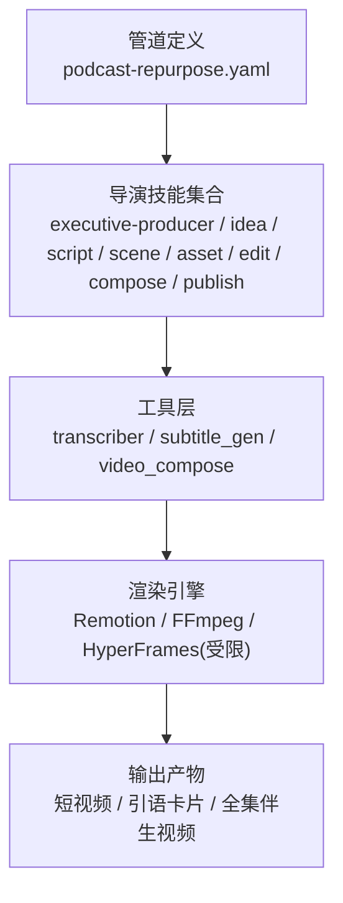
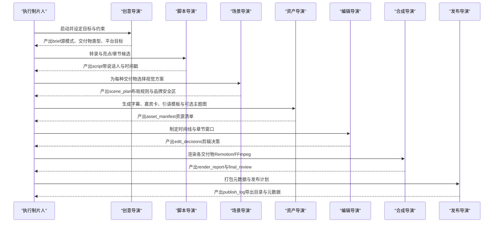
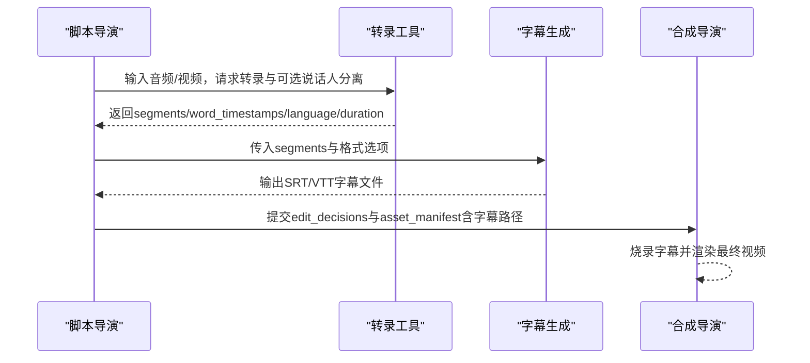
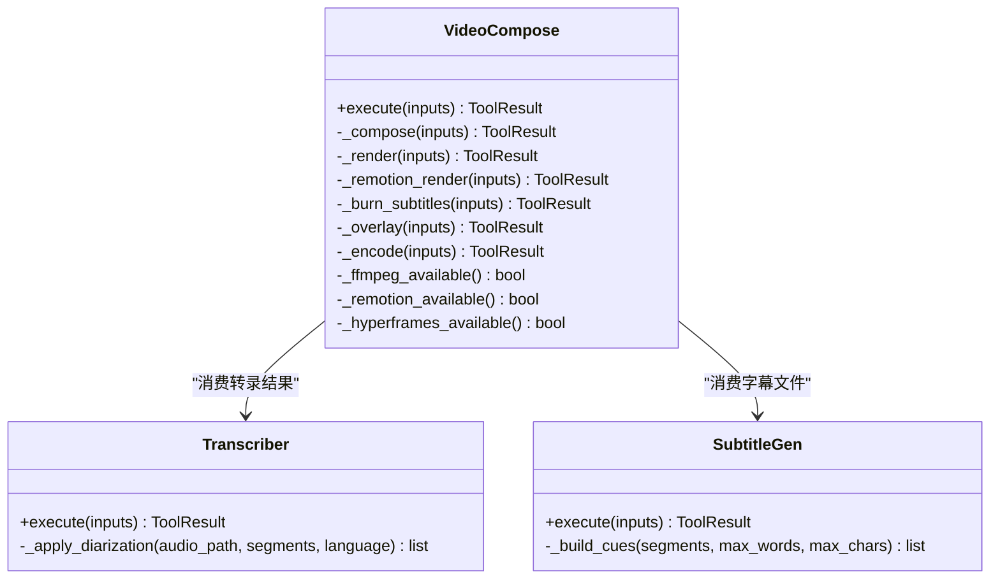
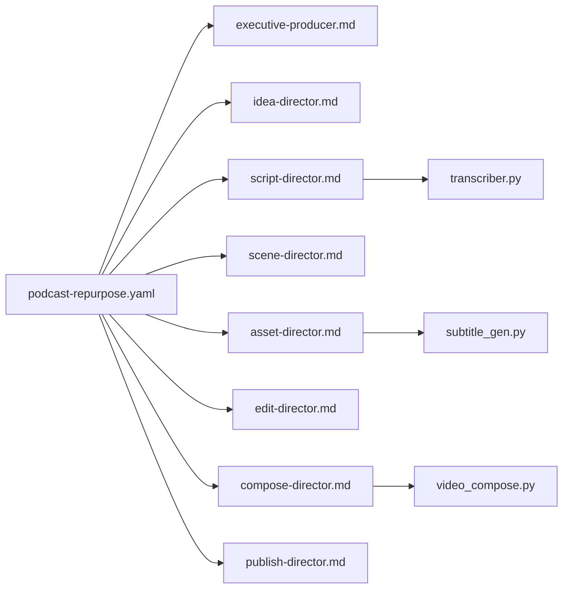

# 播客重制管道

<cite>
**本文引用的文件**
- [README.md](file://README.md)
- [podcast-repurpose.yaml](file://pipeline_defs/podcast-repurpose.yaml)
- [executive-producer.md](file://skills/pipelines/podcast-repurpose/executive-producer.md)
- [idea-director.md](file://skills/pipelines/podcast-repurpose/idea-director.md)
- [script-director.md](file://skills/pipelines/podcast-repurpose/script-director.md)
- [scene-director.md](file://skills/pipelines/podcast-repurpose/scene-director.md)
- [asset-director.md](file://skills/pipelines/podcast-repurpose/asset-director.md)
- [edit-director.md](file://skills/pipelines/podcast-repurpose/edit-director.md)
- [compose-director.md](file://skills/pipelines/podcast-repurpose/compose-director.md)
- [publish-director.md](file://skills/pipelines/podcast-repurpose/publish-director.md)
- [transcriber.py](file://tools/analysis/transcriber.py)
- [subtitle_gen.py](file://tools/subtitle/subtitle_gen.py)
- [video_compose.py](file://tools/video/video_compose.py)
</cite>

## 目录
1. [简介](#简介)
2. [项目结构](#项目结构)
3. [核心组件](#核心组件)
4. [架构总览](#架构总览)
5. [详细组件分析](#详细组件分析)
6. [依赖关系分析](#依赖关系分析)
7. [性能与质量考量](#性能与质量考量)
8. [故障排查指南](#故障排查指南)
9. [结论](#结论)
10. [附录：平台适配与多语言策略](#附录：平台适配与多语言策略)

## 简介
本技术文档围绕 OpenMontage 的“播客重制”管道，系统化说明如何将纯音频或视频播客内容自动化转换为可发布的短视频、引语卡片与可选的全集伴生视频。管道以“执行制片人”为总控，串联脚本导演、场景导演、资产导演、编辑导演、合成导演与发布导演，形成从转录、章节标记、嘉宾识别、关键词提取、字幕生成到精彩片段剪辑与发布的完整闭环。

该管道的关键能力包括：
- 音频转视频：基于 Remotion 或 FFmpeg 的渲染路径，将音频驱动的字幕、波形可视化与品牌元素组合成视频。
- 章节标记与嘉宾识别：通过带词级时间戳的转录与说话人分离（Diarization），构建章节与嘉宾信息。
- 关键词提取与亮点筛选：在脚本阶段对高光时刻进行评分与排序，支撑短视频钩子。
- 字幕生成：基于词级时间戳生成 SRT/VTT，并在合成阶段烧录进视频。
- 精彩片段剪辑：按平台规格输出 9:16/1:1/16:9 的多尺寸版本，并附带元数据与发布建议。

此外，管道强调音质优先、多语言支持与平台适配策略，适用于教育播客、商业访谈与技术讨论等场景。

**章节来源**
- [podcast-repurpose.yaml:1-213](file://pipeline_defs/podcast-repurpose.yaml#L1-L213)
- [executive-producer.md:1-136](file://skills/pipelines/podcast-repurpose/executive-producer.md#L1-L136)

## 项目结构
OpenMontage 采用“管道定义 + 技能指令 + 工具注册表”的分层架构。播客重制管道由 YAML 清单定义阶段、产物与审查要点；每个阶段由对应的“导演技能”指导 AI Agent 如何执行；工具层提供转录、字幕、音视频合成等能力。

**图表来源**
- [podcast-repurpose.yaml:13-38](file://pipeline_defs/podcast-repurpose.yaml#L13-L38)
- [video_compose.py:1-29](file://tools/video/video_compose.py#L1-L29)

**章节来源**
- [README.md:356-383](file://README.md#L356-L383)
- [podcast-repurpose.yaml:13-38](file://pipeline_defs/podcast-repurpose.yaml#L13-L38)

## 核心组件
- 执行制片人（Executive Producer）：串行编排七阶段，设置质量门限与预算限制，确保音频保真、选片质量与多交付物一致性。
- 创意/脚本导演（Idea/Script Director）：分类源模式（纯音频/视频播客/混合），产出结构化 brief 与带说话人标注的转录、亮点候选与章节候选。
- 场景导演（Scene Director）：为每类交付物选择合适视觉方案（源视频镜头、字幕主导、引语卡片、主题图），避免虚假复杂化。
- 资产导演（Asset Director）：生成字幕、嘉宾卡、引语模板、可选主题图与音乐支持，先出“英雄片段样本”再批量生产。
- 编辑导演（Edit Director）：制定短片段时间线与长视频章节结构，保证开头钩子、引用停留时间与可读性。
- 合成导演（Compose Director）：以音频质量为最高优先级，使用 Remotion 或 FFmpeg 渲染各交付物，校验分辨率、比例、字幕同步与品牌一致性。
- 发布导演（Publish Director）：为每个短视频附加剧集链接、嘉宾标签与平台文案，规划发布顺序与排期。

**章节来源**
- [executive-producer.md:18-118](file://skills/pipelines/podcast-repurpose/executive-producer.md#L18-L118)
- [idea-director.md:23-86](file://skills/pipelines/podcast-repurpose/idea-director.md#L23-L86)
- [script-director.md:15-64](file://skills/pipelines/podcast-repurpose/script-director.md#L15-L64)
- [scene-director.md:18-64](file://skills/pipelines/podcast-repurpose/scene-director.md#L18-L64)
- [asset-director.md:18-69](file://skills/pipelines/podcast-repurpose/asset-director.md#L18-L69)
- [edit-director.md:15-54](file://skills/pipelines/podcast-repurpose/edit-director.md#L15-L54)
- [compose-director.md:24-65](file://skills/pipelines/podcast-repurpose/compose-director.md#L24-L65)
- [publish-director.md:15-55](file://skills/pipelines/podcast-repurpose/publish-director.md#L15-L55)

## 架构总览
播客重制管道遵循“研究→提案→脚本→分镜→资产→剪辑→合成→发布”的通用流程，但在播客场景中省略了前期创意构思，直接以现有音频/视频为输入，聚焦于高质量转录、亮点提取、字幕与轻量视觉包装。

**图表来源**
- [podcast-repurpose.yaml:46-213](file://pipeline_defs/podcast-repurpose.yaml#L46-L213)
- [executive-producer.md:46-118](file://skills/pipelines/podcast-repurpose/executive-producer.md#L46-L118)

**章节来源**
- [README.md:374-444](file://README.md#L374-L444)
- [podcast-repurpose.yaml:46-213](file://pipeline_defs/podcast-repurpose.yaml#L46-L213)

## 详细组件分析

### 执行制片人（Executive Producer）
- 职责：串行编排七阶段，维护累计状态（预算、源格式、交付物类型、稿件流），在各阶段后执行跨阶段检查（如转录质量、片段独立性、音频保真、多交付物一致性）。
- 质量门：G1-G7 覆盖从创意到发布的每个关键节点，失败时触发修订或退回上游。
- 限制：每阶段最多修订次数、最大退回次数、总预算与总时长上限，防止无限循环与超支。

**图表来源**
- [executive-producer.md:46-118](file://skills/pipelines/podcast-repurpose/executive-producer.md#L46-L118)

**章节来源**
- [executive-producer.md:18-136](file://skills/pipelines/podcast-repurpose/executive-producer.md#L18-L136)

### 脚本导演（Script Director）
- 职责：保护转录质量（必要时先做音频增强），产出带说话人标注的转录、亮点候选与章节候选；保持 schema 整洁，将丰富信息放入 metadata。
- 亮点评估：独立清晰度、钩子强度、归属置信度、平台匹配度。
- 事实核查：遇到不确定点时使用网络搜索验证，记录决策日志类别。

**章节来源**
- [script-director.md:15-75](file://skills/pipelines/podcast-repurpose/script-director.md#L15-L75)

### 场景导演（Scene Director）
- 职责：根据实际源模式选择视觉方案（源视频优先、音频-only 用字幕/引语卡片），避免“虚假复杂性”，定义场景家族（talking_head、text_card、generated、diagram、transition）。
- 布局策略：通过 metadata 指定交付物布局、嘉宾卡规则、引语卡规则、字幕区域与安全区。

**章节来源**
- [scene-director.md:18-64](file://skills/pipelines/podcast-repurpose/scene-director.md#L18-L64)

### 资产导演（Asset Director）
- 职责：首先生成所有必需资产（字幕、嘉宾卡、引语模板），再考虑可选主题图；先出“英雄片段样本”确认方向后再批量生产，避免昂贵返工。
- 模板化：复用嘉宾卡、引语卡、结尾卡与品牌容器，保持一致性。
- 事实核查：涉及具体地点/人物/物体时，先检索参考图像再生成插图。

**章节来源**
- [asset-director.md:18-80](file://skills/pipelines/podcast-repurpose/asset-director.md#L18-L80)

### 编辑导演（Edit Director）
- 职责：为短视频建立快速钩子的时间线，确保开场 3 秒内抓住注意力；为引语片段保留足够阅读时间；为全集伴生视频保持简洁与可实现性。
- 元数据：记录 clip_timelines、quote_hold_times、speaker_change_markers、chapter_card_windows。

**章节来源**
- [edit-director.md:15-54](file://skills/pipelines/podcast-repurpose/edit-director.md#L15-L54)

### 合成导演（Compose Director）
- 职责：以音频质量为最高优先级，优先渲染高价值交付物（短视频 > 引语片段 > 全集伴生视频）；尊重平台形状（9:16/1:1/16:9）；校验字幕同步与品牌一致性。
- 运行时约束：Phase 1 仅允许 Remotion 或 FFmpeg；禁止静默切换到 HyperFrames，需向用户呈现约束并记录决策。

**章节来源**
- [compose-director.md:7-65](file://skills/pipelines/podcast-repurpose/compose-director.md#L7-L65)

### 发布导演（Publish Director）
- 职责：每个短视频必须回链到全集（节目名、剧集标题/编号、嘉宾名、全集目的地）；按平台定制文案（Shorts/Reels/TikTok 钩子式，LinkedIn 洞察式，YouTube 章节友好）；规划发布顺序（最强宣布片段 → 次佳洞察 → 引语/嘉宾跟进 → 其余支持片段）。

**章节来源**
- [publish-director.md:15-55](file://skills/pipelines/podcast-repurpose/publish-director.md#L15-L55)

### 转录与字幕工具链
- 转录工具（Transcriber）：基于 faster-whisper 与 WhisperX，支持词级时间戳、自动语言检测与可选说话人分离；GPU 不可用时自动回退 CPU；输出 JSON 包含 segments、word_timestamps、language、duration_seconds 等。
- 字幕生成（SubtitleGen）：从词级时间戳构建字幕提示（cues），支持 SRT/VTT 输出与行/词数限制；可应用修正并生成用户可见验证项。

**图表来源**
- [transcriber.py:116-240](file://tools/analysis/transcriber.py#L116-L240)
- [subtitle_gen.py:82-98](file://tools/subtitle/subtitle_gen.py#L82-L98)
- [video_compose.py:438-714](file://tools/video/video_compose.py#L438-L714)

**章节来源**
- [transcriber.py:1-280](file://tools/analysis/transcriber.py#L1-280)
- [subtitle_gen.py:75-98](file://tools/subtitle/subtitle_gen.py#L75-L98)

### 视频合成与渲染路由
- 视频合成（VideoCompose）：统一入口，依据 edit_decisions.render_runtime 路由到 Remotion（React-based）、FFmpeg（纯视频拼接/裁剪/烧字幕）或 HyperFrames（HTML/CSS/GSAP，当前受限于字幕烧录能力）。
- 运行时治理：禁止静默切换；若所选运行时不可用或失败，需上报结构化阻塞并等待用户批准后再切换。
- 媒体资料与编码：支持 profile（YouTube Landscape/Shorts/Reels/TikTok/LinkedIn/Cinematic），自动处理分辨率、帧率与像素格式；对无音频流的素材注入静音轨道以保证 concat 一致性。

**图表来源**
- [video_compose.py:58-335](file://tools/video/video_compose.py#L58-L335)
- [transcriber.py:29-96](file://tools/analysis/transcriber.py#L29-L96)
- [subtitle_gen.py:75-98](file://tools/subtitle/subtitle_gen.py#L75-L98)

**章节来源**
- [video_compose.py:1-800](file://tools/video/video_compose.py#L1-L800)

## 依赖关系分析
- 管道依赖：YAML 清单声明所需技能与兼容样式；导演技能依赖 schema 与工具；工具依赖外部二进制（FFmpeg、Node.js/npx）与 Python 包（faster-whisper、whisperx）。
- 运行时依赖：Remotion 需要 Node.js、npx 与 remotion-composer 的 node_modules；HyperFrames 需要 Node.js ≥ 22、FFmpeg 与 npm 包；FFmpeg 是基础。
- 数据流依赖：转录结果驱动字幕生成；字幕与资产清单驱动合成；合成报告驱动发布打包。

**图表来源**
- [podcast-repurpose.yaml:27-38](file://pipeline_defs/podcast-repurpose.yaml#L27-L38)
- [transcriber.py:29-96](file://tools/analysis/transcriber.py#L29-L96)
- [subtitle_gen.py:75-98](file://tools/subtitle/subtitle_gen.py#L75-L98)
- [video_compose.py:58-335](file://tools/video/video_compose.py#L58-L335)

**章节来源**
- [podcast-repurpose.yaml:27-38](file://pipeline_defs/podcast-repurpose.yaml#L27-L38)

## 性能与质量考量
- 转录性能：默认 base 模型在 CPU 上约 5x 实时；large-v3 质量最佳但较慢；GPU 可用时自动选择 float16/int8_float16 等计算类型，失败则回退 CPU。
- 字幕生成：词级时间戳确保精确烧录；可通过 max_words_per_cue 与 max_chars_per_line 控制可读性。
- 合成性能：FFmpeg 分段标准化分辨率与帧率，避免 concat 错误；对无音频流素材注入静音轨道；按需重编码或 copy 以减少耗时。
- 质量门：执行制片人在各阶段后检查转录质量、片段独立性、音频保真、多交付物一致性与平台规格；合成后执行 ffprobe 验证、帧采样与音频分析。

**章节来源**
- [transcriber.py:112-114](file://tools/analysis/transcriber.py#L112-L114)
- [transcriber.py:138-207](file://tools/analysis/transcriber.py#L138-L207)
- [video_compose.py:548-634](file://tools/video/video_compose.py#L548-L634)
- [executive-producer.md:107-118](file://skills/pipelines/podcast-repurpose/executive-producer.md#L107-L118)

## 故障排查指南
- 转录失败或无 GPU：检查 faster-whisper 安装与 CUDA 可用性；若无 GPU，工具会自动回退 CPU 并记录 gpu_fallback_reason。
- 说话人分离不可用：缺少 whisperx 或 HF_TOKEN 时将跳过 diarization，返回原始 segments。
- 字幕烧录失败：确认 subtitle_path 存在且样式正确；检查 FFmpeg 是否可用；必要时调整字体与边距。
- 运行时不可用：Remotion 需要 npx 与 node_modules；HyperFrames 需要 Node.js ≥ 22 与 npm 包；FFmpeg 必须在 PATH。
- 运行时静默切换被禁止：若所选运行时失败，需上报结构化阻塞并等待用户批准后再切换。

**章节来源**
- [transcriber.py:198-216](file://tools/analysis/transcriber.py#L198-L216)
- [transcriber.py:242-280](file://tools/analysis/transcriber.py#L242-L280)
- [video_compose.py:234-335](file://tools/video/video_compose.py#L234-L335)

## 结论
OpenMontage 的播客重制管道通过严谨的阶段编排与质量门，将纯音频或视频播客高效转化为多平台可用的短视频与伴生视频。其核心在于：
- 以音频质量为最高优先级，避免不必要的重编码与视觉竞争。
- 以词级时间戳驱动的转录与字幕，确保精准同步与可读性。
- 以“英雄片段样本”先行确认方向，降低批量生产的返工风险。
- 以运行时治理保障渲染路径的可控性与可审计性。
该管道适用于教育播客、商业访谈与技术讨论等多种场景，并提供平台适配与多语言支持策略。

## 附录：平台适配与多语言策略
- 平台适配：
  - 短视频：9:16（Shorts/Reels/TikTok），注重钩子与紧凑节奏。
  - 引语卡片：1:1（LinkedIn/Feed），注重可读性与品牌安全区。
  - 全集伴生：16:9（YouTube），注重章节结构与搜索友好。
- 多语言支持：
  - 转录支持自动语言检测与 ISO 代码提示；可选说话人分离提升多语种对话解析。
  - 字幕生成支持多语言文本与本地化样式；可在发布阶段为不同地区生成差异化文案。
- 音质优化：
  - 转录前可选音频增强；合成阶段避免不必要重编码，保持语音清晰稳定；背景音乐仅在不妨碍语音时加入。

**章节来源**
- [compose-director.md:36-56](file://skills/pipelines/podcast-repurpose/compose-director.md#L36-L56)
- [transcriber.py:54-68](file://tools/analysis/transcriber.py#L54-L68)
- [README.md:635-649](file://README.md#L635-L649)