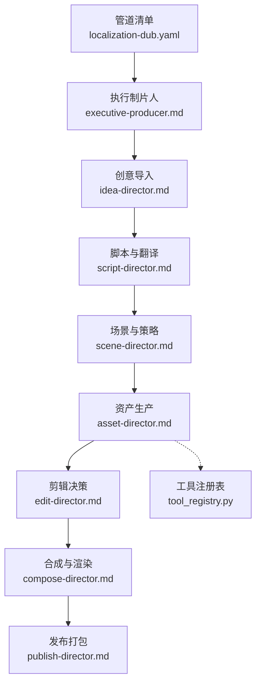
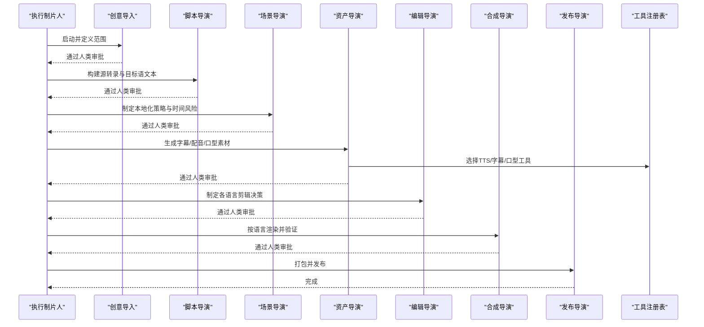
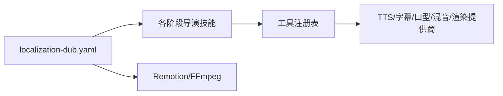

# 本地化配音管道

<cite>
**本文引用的文件**   
- [localization-dub.yaml](file://pipeline_defs/localization-dub.yaml)
- [executive-producer.md](file://skills/pipelines/localization-dub/executive-producer.md)
- [idea-director.md](file://skills/pipelines/localization-dub/idea-director.md)
- [script-director.md](file://skills/pipelines/localization-dub/script-director.md)
- [scene-director.md](file://skills/pipelines/localization-dub/scene-director.md)
- [asset-director.md](file://skills/pipelines/localization-dub/asset-director.md)
- [edit-director.md](file://skills/pipelines/localization-dub/edit-director.md)
- [compose-director.md](file://skills/pipelines/localization-dub/compose-director.md)
- [publish-director.md](file://skills/pipelines/localization-dub/publish-director.md)
- [README.md](file://README.md)
- [tool_registry.py](file://tools/tool_registry.py)
</cite>

## 目录
1. [简介](#简介)
2. [项目结构](#项目结构)
3. [核心组件](#核心组件)
4. [架构总览](#架构总览)
5. [详细组件分析](#详细组件分析)
6. [依赖关系分析](#依赖关系分析)
7. [性能与成本考量](#性能与成本考量)
8. [故障排查指南](#故障排查指南)
9. [结论](#结论)
10. [附录](#附录)

## 简介
本技术文档面向OpenMontage的“本地化配音管道”，系统化说明如何基于已有源视频，自动化产出多语言字幕、配音与可选口型同步版本。管道以“转录优先”的方式工作：先建立可靠的源转录与目标语文本，再按场景策略生成配音、字幕与合成输出，并通过严格的质量门控保障翻译准确性、时间轴对齐、口型质量与多语种一致性。

该管道由执行制片人统筹，串联脚本导演、场景导演、资产导演、编辑导演、合成导演与发布导演，形成从需求澄清到打包发布的端到端流程。它支持方言与区域变体、术语一致性与文化敏感内容处理，并提供可审计的决策日志与预算治理，以满足全球化产品、国际教育与跨国企业的规模化本地化需求。

## 项目结构
本地化配音管道的核心由三部分构成：
- 管道清单：定义阶段、工具、检查点与成功标准。
- 导演技能：每个阶段的执行指令、质量门控与常见陷阱提示。
- 工具与注册表：提供语音识别、文本翻译、语音合成、字幕生成、口型同步、音视频混音与渲染等能力。

图表来源
- [localization-dub.yaml:1-208](file://pipeline_defs/localization-dub.yaml#L1-L208)
- [executive-producer.md:1-134](file://skills/pipelines/localization-dub/executive-producer.md#L1-L134)
- [idea-director.md:1-86](file://skills/pipelines/localization-dub/idea-director.md#L1-L86)
- [script-director.md:1-75](file://skills/pipelines/localization-dub/script-director.md#L1-L75)
- [scene-director.md:1-75](file://skills/pipelines/localization-dub/scene-director.md#L1-L75)
- [asset-director.md:1-102](file://skills/pipelines/localization-dub/asset-director.md#L1-L102)
- [edit-director.md:1-47](file://skills/pipelines/localization-dub/edit-director.md#L1-L47)
- [compose-director.md:1-66](file://skills/pipelines/localization-dub/compose-director.md#L1-L66)
- [publish-director.md:1-54](file://skills/pipelines/localization-dub/publish-director.md#L1-L54)
- [tool_registry.py:1-200](file://tools/tool_registry.py#L1-L200)

章节来源
- [localization-dub.yaml:1-208](file://pipeline_defs/localization-dub.yaml#L1-L208)
- [README.md:356-475](file://README.md#L356-L475)

## 核心组件
- 执行制片人（EP）：串行编排管道，维护累计状态、跨阶段检查、预算与时限控制，确保翻译准确性、时间轴保持、口型质量与多语种一致性。
- 创意导入（Idea Director）：明确源语言、目标语言、交付模式（仅字幕/配音/带口型）、术语表与审查要求；锁定渲染运行时为Remotion或FFmpeg。
- 脚本导演（Script Director）：构建源转录真相，产出可审阅的目标语文本包，保留术语与受保护词，记录发音备注与分段时长风险。
- 场景导演（Scene Director）：为每份交付物选择本地化策略（仅字幕/纯配音/口型同步/混合覆盖），标注时间漂移风险与屏显文字替换需求。
- 资产导演（Asset Director）：生成字幕、配音与可选口型素材；先做英雄片段样音确认，再批量生产；记录声音映射与发音警告。
- 编辑导演（Edit Director）：将场景计划与资产转化为各语言的剪辑决策，尽量保持原结构，仅在必要时调整时长与覆盖。
- 合成导演（Compose Director）：按语言渲染最终输出，校验可懂度、字幕适配、明显同步漂移与版本标签；限制运行时为Remotion或FFmpeg。
- 发布导演（Publish Director）：按语言打包视频、字幕、脚本副本、审查备注与元数据，保证命名精确、上下文不丢失。

章节来源
- [executive-producer.md:18-134](file://skills/pipelines/localization-dub/executive-producer.md#L18-L134)
- [idea-director.md:9-86](file://skills/pipelines/localization-dub/idea-director.md#L9-L86)
- [script-director.md:13-75](file://skills/pipelines/localization-dub/script-director.md#L13-L75)
- [scene-director.md:14-75](file://skills/pipelines/localization-dub/scene-director.md#L14-L75)
- [asset-director.md:16-102](file://skills/pipelines/localization-dub/asset-director.md#L16-L102)
- [edit-director.md:7-47](file://skills/pipelines/localization-dub/edit-director.md#L7-L47)
- [compose-director.md:7-66](file://skills/pipelines/localization-dub/compose-director.md#L7-L66)
- [publish-director.md:7-54](file://skills/pipelines/localization-dub/publish-director.md#L7-L54)

## 架构总览
本地化配音管道采用“清单驱动+导演技能+工具注册”的分层架构。YAML清单定义阶段顺序、所需制品、可用工具与成功标准；Markdown技能文件指导AI代理在每个阶段的具体操作、质量门控与常见陷阱；工具注册表自动发现并暴露可用的TTS、字幕、口型同步、音频混音与视频合成能力。

图表来源
- [localization-dub.yaml:11-208](file://pipeline_defs/localization-dub.yaml#L11-L208)
- [executive-producer.md:47-134](file://skills/pipelines/localization-dub/executive-producer.md#L47-L134)
- [tool_registry.py:118-196](file://tools/tool_registry.py#L118-L196)

## 详细组件分析

### 执行制片人（EP）
职责与机制
- 管理累计状态：源语言、目标语言、每语种的交付模式、术语表、时间漂移容忍度、修订计数与问题日志。
- 跨阶段检查：在IDEA/SCRIPT/SCENE_PLAN/ASSETS/EDIT/COMPOSE/PUBLISH后分别进行范围、转录真实性、策略可行性、资产完整性、时间保持、每语种验证与包装一致性检查。
- 质量门控：七道门加最终验收，失败即退回修订或发送回退。
- 执行限制：每阶段最大修订次数、最大回退次数、总预算与时限。

关键约束
- 预算默认值与上限、墙钟时间上限、每阶段人类审批开关。
- 对“语言扩展导致时长膨胀”“口型同步仅限合适镜头”“术语保护”“地区标签一致性”等陷阱有明确提示。

章节来源
- [executive-producer.md:18-134](file://skills/pipelines/localization-dub/executive-producer.md#L18-L134)
- [localization-dub.yaml:11-23](file://pipeline_defs/localization-dub.yaml#L11-L23)

### 创意导入（Idea Director）
职责与机制
- 明确本地化范围：源语言、目标语言、交付模式（仅字幕/配音/带口型）、术语表与法律/术语审查要求。
- 分类源视频：单人/多人/旁白主导/出镜说话人，标注屏显文字与动效是否需要替换或覆盖。
- 选择现实可行的交付物组合，避免过度承诺。
- 运行时选择：强制锁定Remotion或FFmpeg，Phase 1不支持HyperFrames用于本地化配音（因字幕与TalkingHead口型能力尚未对齐）。

章节来源
- [idea-director.md:9-86](file://skills/pipelines/localization-dub/idea-director.md#L9-L86)

### 脚本导演（Script Director）
职责与机制
- 构建源转录真相：修正名称、术语、说话人分配、数字与CTA措辞。
- 产出可审阅的目标语文本：保留术语与受保护词，记录发音备注与分段时长估计。
- 尽量保持结构与时序，除非翻译节奏需要不同策略。
- 事实核查：遇到不确定信息时进行网络检索并记录类别为视觉准确性检查的决策日志。

章节来源
- [script-director.md:13-75](file://skills/pipelines/localization-dub/script-director.md#L13-L75)

### 场景导演（Scene Director）
职责与机制
- 为每份交付物选择本地化策略：仅字幕、纯配音、口型同步、混合覆盖（用B-roll/图形/文字覆盖嘴部不匹配段落）。
- 标注时间漂移风险：快语速、密集法务文案、多说话人、快速剪辑、可见近景嘴部。
- 记录屏显语言依赖：UI文字、下三分之一标题、标题卡、内嵌字幕、图表标签等需替换或覆盖的场景。

章节来源
- [scene-director.md:14-75](file://skills/pipelines/localization-dub/scene-director.md#L14-L75)

### 资产导演（Asset Director）
职责与机制
- 首先生成字幕包作为可审阅的回退方案。
- 英雄片段样音确认：先为最重要画面生成单条目标语配音样本，经批准后再批量生产，避免昂贵错误。
- 按语言生成配音：使用已审阅的翻译文本，记录所用声音或合成路径。
- 口型同步按需启用：仅对必要场景与语言启用，若工具不可用则降级为纯配音路径。
- 元数据记录：字幕/配音/口型资产按语言组织，记录声音映射、发音警告与受阻资产。

章节来源
- [asset-director.md:16-102](file://skills/pipelines/localization-dub/asset-director.md#L16-L102)

### 编辑导演（Edit Director）
职责与机制
- 默认保持原结构：仅在翻译音频明显需要延长、压缩或覆盖时调整。
- 应用所选本地化策略：字幕、换音、口型或覆盖。
- 按语言分离时间线决策，确保版本清晰。

章节来源
- [edit-director.md:7-47](file://skills/pipelines/localization-dub/edit-director.md#L7-L47)

### 合成导演（Compose Director）
职责与机制
- 按语言渲染输出，允许字幕重排、配音时长漂移、CTA停留延长与可选裁剪/覆盖。
- 严格运行时约束：必须为Remotion或FFmpeg；如检测到HyperFrames，停止并回到创意导入阶段重新沟通约束。
- 逐语种验证：可懂度、字幕适配、明显同步漂移、版本标签清晰度。

章节来源
- [compose-director.md:7-66](file://skills/pipelines/localization-dub/compose-director.md#L7-L66)

### 发布导演（Publish Director）
职责与机制
- 按语言打包：视频、字幕、脚本副本、审查备注与元数据。
- 精确命名：包含locale、language_name、deliverable_mode、subtitle_included、review_owner等键。
- 保留审查上下文：发音注意事项、时间警告、缺失口型等信息随包发布。

章节来源
- [publish-director.md:7-54](file://skills/pipelines/localization-dub/publish-director.md#L7-L54)

### 工具与注册表（Tool Registry）
作用
- 自动发现并注册所有工具，报告可用性、稳定性与支持范围。
- 提供按能力、提供商、状态、稳定性的查询接口，以及回退工具查找。
- 在本地化配音中，资产导演通过tts_selector等工具调用注册表，动态选择可用的TTS/字幕/口型能力。

章节来源
- [tool_registry.py:1-200](file://tools/tool_registry.py#L1-L200)

## 依赖关系分析
- 管道清单依赖导演技能与工具：每个阶段声明所需制品、可选/必需工具与成功标准。
- 导演技能依赖工具注册表：通过能力查询与评分选择最佳提供商（如TTS、字幕、口型同步）。
- 运行时依赖：本地化配音在Phase 1限定Remotion或FFmpeg，以保证字幕烧录与TalkingHead口型能力对齐。
- 外部集成：语音识别、文本翻译、语音合成、口型同步、音视频混音与渲染均通过工具抽象接入，便于替换与回退。

图表来源
- [localization-dub.yaml:44-208](file://pipeline_defs/localization-dub.yaml#L44-L208)
- [tool_registry.py:118-196](file://tools/tool_registry.py#L118-L196)
- [compose-director.md:7-13](file://skills/pipelines/localization-dub/compose-director.md#L7-L13)

章节来源
- [localization-dub.yaml:44-208](file://pipeline_defs/localization-dub.yaml#L44-L208)
- [tool_registry.py:118-196](file://tools/tool_registry.py#L118-L196)

## 性能与成本考量
- 预算治理：管道默认预算与上限可配置，支持预估、预留、结算与阈值审批，避免意外账单。
- 成本控制：优先使用免费/低成本工具（如Piper TTS、开源字幕与混音），必要时再调用付费API；英雄片段样音确认减少批量生成浪费。
- 性能优化：
  - 转录优先：先建可靠文本，再决定配音/口型策略，降低无效渲染。
  - 选择性口型同步：仅对前向清晰嘴部镜头启用，避免不必要计算。
  - 运行时限制：Phase 1限定Remotion/FFmpeg，减少兼容性开销。
- 质量评估：每阶段质量门控与最终验收，结合ffprobe、帧采样、音频电平分析与交付承诺验证，确保输出可用。

章节来源
- [executive-producer.md:117-134](file://skills/pipelines/localization-dub/executive-producer.md#L117-L134)
- [asset-director.md:22-39](file://skills/pipelines/localization-dub/asset-director.md#L22-L39)
- [compose-director.md:24-66](file://skills/pipelines/localization-dub/compose-director.md#L24-L66)
- [README.md:652-686](file://README.md#L652-L686)

## 故障排查指南
常见问题与对策
- 语言时长膨胀：部分语言比英语长20-30%，需在场景规划阶段标记时间漂移风险并在剪辑阶段调整。
- 口型同步不适配：非正面或远景镜头不建议口型同步；若工具不可用，降级为纯配音。
- 术语不一致：术语表与受保护词必须在脚本与资产阶段贯穿，避免品牌名与技术术语漂移。
- 运行时冲突：如误选HyperFrames，合成阶段会停止并返回创意导入阶段重新沟通约束。
- 资产缺失：确保每语种字幕与配音资产存在，引用文件必须真实可访问。

定位方法
- 查看各阶段质量门控失败原因与修订建议。
- 检查资产清单中的声音映射、发音警告与受阻资产。
- 核对渲染报告中的验证备注、警告与元数据。
- 利用工具注册表查询当前可用能力与回退路径。

章节来源
- [executive-producer.md:47-116](file://skills/pipelines/localization-dub/executive-producer.md#L47-L116)
- [asset-director.md:40-57](file://skills/pipelines/localization-dub/asset-director.md#L40-L57)
- [compose-director.md:7-13](file://skills/pipelines/localization-dub/compose-director.md#L7-L13)
- [tool_registry.py:184-196](file://tools/tool_registry.py#L184-L196)

## 结论
OpenMontage的本地化配音管道以“转录优先、策略先行、资产可控、合成验证”为核心原则，通过执行制片人与七位导演的协作，实现高质量的多语言版本制作。其优势在于：
- 明确的阶段与质量门控，确保翻译准确性、时间轴保持与口型质量。
- 灵活的本地化策略与按需口型同步，兼顾成本与效果。
- 严格的运行时约束与工具注册表，保证能力可用与回退路径。
- 完善的预算治理与审计追踪，满足企业级合规与成本管理。

该管道适用于全球化产品、国际教育与跨国企业的多语种分发，支持方言与区域变体、术语一致性与文化敏感内容处理，并提供可扩展的工具生态与风格系统。

## 附录
- 推荐实践
  - 在创意导入阶段明确交付模式与术语表，避免后期返工。
  - 在脚本阶段保留受保护词与发音备注，提升后续合成质量。
  - 在场景阶段标注屏显文字替换需求与时间漂移风险。
  - 在资产阶段先做英雄片段样音确认，再批量生产。
  - 在合成阶段逐语种验证可懂度与字幕适配，保留警告与备注。
  - 在发布阶段精确命名与打包，确保下游团队可直接使用。

- 参考资源
  - 管道清单与阶段定义：[localization-dub.yaml](file://pipeline_defs/localization-dub.yaml)
  - 各阶段导演技能：见skills/pipelines/localization-dub/*.md
  - 工具注册与能力查询：[tool_registry.py](file://tools/tool_registry.py)
  - 平台与运行时说明：[README.md](file://README.md)