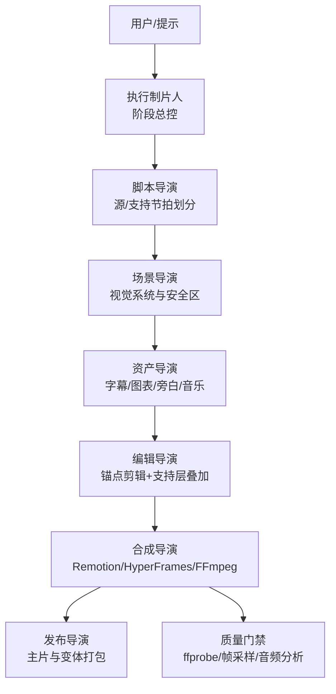
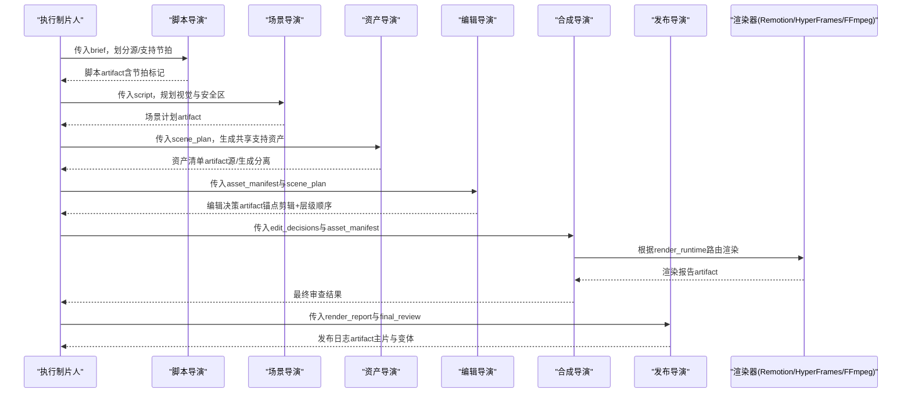
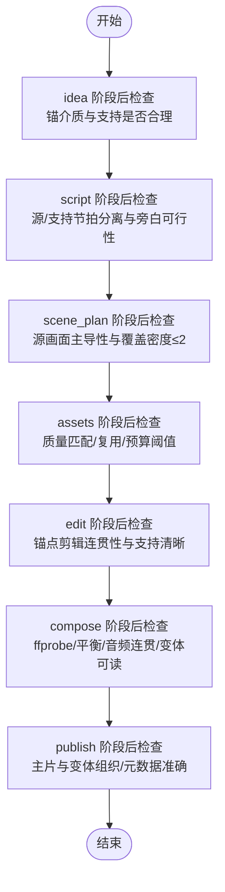
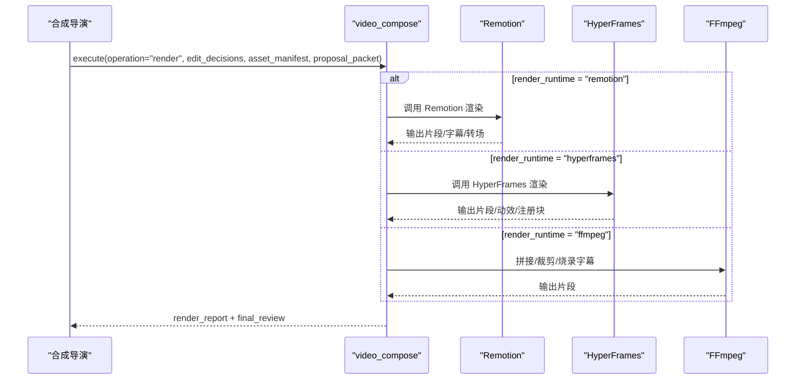
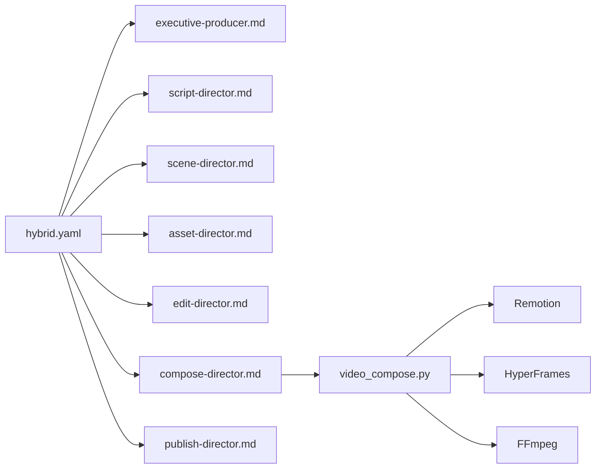

# 混合媒体管道

<cite>
**本文引用的文件**
- [README.md](file://README.md)
- [PROJECT_CONTEXT.md](file://PROJECT_CONTEXT.md)
- [ARCHITECTURE.md](file://docs/ARCHITECTURE.md)
- [hybrid.yaml](file://pipeline_defs/hybrid.yaml)
- [executive-producer.md](file://skills/pipelines/hybrid/executive-producer.md)
- [script-director.md](file://skills/pipelines/hybrid/script-director.md)
- [scene-director.md](file://skills/pipelines/hybrid/scene-director.md)
- [asset-director.md](file://skills/pipelines/hybrid/asset-director.md)
- [edit-director.md](file://skills/pipelines/hybrid/edit-director.md)
- [compose-director.md](file://skills/pipelines/hybrid/compose-director.md)
- [publish-director.md](file://skills/pipelines/hybrid/publish-director.md)
- [video_compose.py](file://tools/video/video_compose.py)
</cite>

## 目录
1. [简介](#简介)
2. [项目结构](#项目结构)
3. [核心组件](#核心组件)
4. [架构总览](#架构总览)
5. [详细组件分析](#详细组件分析)
6. [依赖关系分析](#依赖关系分析)
7. [性能与质量保障](#性能与质量保障)
8. [故障排查指南](#故障排查指南)
9. [结论](#结论)
10. [附录](#附录)

## 简介
本技术文档聚焦 OpenMontage 的“混合媒体管道”，即把真实素材（采访、产品实拍、屏幕录制等）与 AI 生成的支持性内容（图表、动效、字幕、音乐、旁白等）进行无缝融合，形成跨平台、可复用的视频产出。该管道以“执行制片人”为总控，串联脚本导演、场景导演、资产导演、编辑导演、合成导演与发布导演，通过严格的阶段门禁、预算治理与多运行时渲染（Remotion/HyperFrames/FFmpeg），实现从创意到发布的端到端自动化生产。

混合媒体的核心能力包括：
- 真实素材与 AI 生成内容的无缝融合：在时间线上明确区分“源主导节拍”和“支持主导节拍”，确保源画面始终为主视觉锚点。
- 多格式媒体整合：统一处理视频、图像、音频、文本与交互元素，自动适配分辨率、画幅与平台规范。
- 跨平台内容适配：基于媒体配置与变体规则，输出横屏、竖屏、方形等多比例版本，保证可读性与一致性。
- 交互式体验设计：在 Remotion/HyperFrames 中嵌入动画、数据可视化、GSAP 动效与响应式布局，提升观看体验。

## 项目结构
OpenMontage 采用“指令驱动 + 工具注册表”的架构：AI 智能体读取 YAML 管线清单与 Markdown 技能文件，调用 Python 工具完成具体任务，并通过检查点持久化状态。混合媒体管道的定义位于 pipeline_defs/hybrid.yaml，各阶段导演技能位于 skills/pipelines/hybrid/*，渲染路由由 tools/video/video_compose.py 统一管理。

图示来源
- [hybrid.yaml:1-228](file://pipeline_defs/hybrid.yaml#L1-L228)
- [executive-producer.md:1-130](file://skills/pipelines/hybrid/executive-producer.md#L1-L130)
- [video_compose.py:1-800](file://tools/video/video_compose.py#L1-L800)

章节来源
- [README.md:356-444](file://README.md#L356-L444)
- [PROJECT_CONTEXT.md:9-57](file://PROJECT_CONTEXT.md#L9-L57)
- [ARCHITECTURE.md:31-76](file://docs/ARCHITECTURE.md#L31-L76)

## 核心组件
- 执行制片人（Executive Producer）：串行编排七阶段，设置预算、时长、修订上限与发送回退次数；在各阶段后执行交叉检查，确保“源/支持”平衡、覆盖密度与跨媒介一致性。
- 脚本导演（Script Director）：将故事映射到“源主导节拍”和“支持主导节拍”，优先保留源对话或画面，仅在必要时用旁白或支持图层澄清。
- 场景导演（Scene Director）：将脚本转化为视觉系统，保持源画面可见性，规划安全区与多画幅变体，限制并发覆盖层数量。
- 资产导演（Asset Director）：构建共享支持资产库（字幕样式、标签、统计卡片、CTA、图表风格），先出样再批量生成，严格区分源/提供/录制/生成四类资产。
- 编辑导演（Edit Director）：先锁定“锚点剪辑”，再按优先级叠加支持层（字幕→标签→图表→插入→CTA），保护可读性与移动端阅读体验。
- 合成导演（Compose Director）：根据 edit_decisions.render_runtime 选择渲染器（Remotion/HyperFrames/FFmpeg），确保最终输出的平衡、变体完整性与音频连贯性。
- 发布导演（Publish Director）：组织主片与衍生版本，标注元数据中的“源/支持”混合信息，确保导出包可直接使用。

章节来源
- [hybrid.yaml:46-228](file://pipeline_defs/hybrid.yaml#L46-L228)
- [executive-producer.md:18-113](file://skills/pipelines/hybrid/executive-producer.md#L18-L113)
- [script-director.md:15-65](file://skills/pipelines/hybrid/script-director.md#L15-L65)
- [scene-director.md:16-57](file://skills/pipelines/hybrid/scene-director.md#L16-L57)
- [asset-director.md:16-76](file://skills/pipelines/hybrid/asset-director.md#L16-L76)
- [edit-director.md:15-50](file://skills/pipelines/hybrid/edit-director.md#L15-L50)
- [compose-director.md:7-55](file://skills/pipelines/hybrid/compose-director.md#L7-L55)
- [publish-director.md:15-45](file://skills/pipelines/hybrid/publish-director.md#L15-L45)

## 架构总览
OpenMontage 的混合媒体管道遵循“研究→提案→脚本→场景计划→资产→编辑→合成→发布”的标准流程。每个阶段都有明确的输入/输出、可用工具、审查重点与成功标准，并由执行制片人设定质量门禁与预算控制。

图示来源
- [hybrid.yaml:46-228](file://pipeline_defs/hybrid.yaml#L46-L228)
- [video_compose.py:1-800](file://tools/video/video_compose.py#L1-L800)

章节来源
- [ARCHITECTURE.md:171-239](file://docs/ARCHITECTURE.md#L171-L239)
- [PROJECT_CONTEXT.md:43-57](file://PROJECT_CONTEXT.md#L43-L57)

## 详细组件分析

### 执行制片人（Executive Producer）
职责与机制：
- 管理全局状态（目标时长、预算、源/支持比例、修订计数、问题日志）。
- 在每个阶段后执行交叉检查：锚介质清晰度、源/支持节拍分离、源画面主导性、覆盖密度限制（最多2个并发覆盖层）、变体可读性、预算阈值告警、最终输出验证。
- 设定执行限制：每阶段最大修订次数、最大发送回退次数、总预算上限、总运行时间上限。

图示来源
- [executive-producer.md:46-113](file://skills/pipelines/hybrid/executive-producer.md#L46-L113)

章节来源
- [executive-producer.md:1-130](file://skills/pipelines/hybrid/executive-producer.md#L1-L130)

### 脚本导演（Script Director）
职责与机制：
- 将故事划分为“源主导节拍”和“支持主导节拍”，优先保留源对话或画面，避免不必要的旁白重写。
- 使用元数据键（anchor_sections、support_sections、narration_sections、required_support_assets）结构化表达。
- 质量门禁：源/支持节拍清晰、旁白计划可行、不依赖未声明的资产。

章节来源
- [script-director.md:15-65](file://skills/pipelines/hybrid/script-director.md#L15-L65)

### 场景导演（Scene Director）
职责与机制：
- 保持锚介质可见性，仅将支持用于章节过渡、澄清图表、强调数据、CTA 或填补空白。
- 规划多画幅变体的安全区（字幕、说话人标签、图表/代码安全区、裁剪敏感区域）。
- 使用元数据键（anchor_rules、support_rules、safe_zones、variant_rules、overlay_density_limits）约束布局。

章节来源
- [scene-director.md:16-57](file://skills/pipelines/hybrid/scene-director.md#L16-L57)

### 资产导演（Asset Director）
职责与机制：
- 先构建共享支持资产库（字幕样式、标签、统计卡片、CTA、图表风格），再进行批量生成。
- 对昂贵生成类型先出样确认（TTS、图像/视频插入），拒绝后再调整参数重试（最多3次）。
- 严格区分源派生、提供、录制、生成四类资产，使用元数据键（shared_support_assets、scene_asset_index、source_vs_generated_map、variant_assets）。

章节来源
- [asset-director.md:16-76](file://skills/pipelines/hybrid/asset-director.md#L16-L76)

### 编辑导演（Edit Director）
职责与机制：
- 先锁定“锚点剪辑”，再按优先级叠加支持层（字幕→标签→图表→插入→CTA）。
- 保护可读性，避免多层叠加冲突；使用元数据键（anchor_cut_notes、layer_order、overlay_windows、variant_edit_rules）。
- 质量门禁：锚点剪辑独立成立、支持层澄清而非干扰、移动端可读、变体一致。

章节来源
- [edit-director.md:15-50](file://skills/pipelines/hybrid/edit-director.md#L15-L50)

### 合成导演（Compose Director）
职责与机制：
- 强制第一步读取 edit_decisions.render_runtime，并据此路由渲染器：
  - remotion：默认，适合源视频 + React 支持图层一次渲染。
  - hyperframes：当支持层为 HTML/GSAP 原生时使用。
  - ffmpeg：极少使用，适用于无生成支持层的纯剪辑。
- 传递 proposal_packet 给 video_compose.execute()，以便工具内部检测“运行时替换”违规。
- 质量门禁：源/支持平衡、变体完整性、音频连贯性。

图示来源
- [compose-director.md:7-55](file://skills/pipelines/hybrid/compose-director.md#L7-L55)
- [video_compose.py:1-800](file://tools/video/video_compose.py#L1-L800)

章节来源
- [compose-director.md:7-55](file://skills/pipelines/hybrid/compose-director.md#L7-L55)
- [video_compose.py:1-800](file://tools/video/video_compose.py#L1-L800)

### 发布导演（Publish Director）
职责与机制：
- 区分主片与变体（短版、格式变体、章节/上下文变体）。
- 在元数据中标注“源/支持”混合信息，避免将源主导项目包装成纯生成内容。
- 质量门禁：主片与变体清晰标注、元数据与实际源混合一致、导出文件夹组织有序。

章节来源
- [publish-director.md:15-45](file://skills/pipelines/hybrid/publish-director.md#L15-L45)

## 依赖关系分析
混合媒体管道的依赖关系围绕“YAML 管线清单 → 阶段技能 → 工具注册表 → 渲染器”展开。关键依赖如下：
- 管线清单（hybrid.yaml）定义了阶段顺序、所需技能、兼容风格与人工审批策略。
- 阶段技能（skills/pipelines/hybrid/*）指导智能体如何执行每个阶段，包含输入/输出、工具可用性、审查重点与成功标准。
- 工具注册表（tools/tool_registry.py）自动发现 BaseTool 子类，提供能力查询与降级路径。
- 渲染器（video_compose.py）根据 render_runtime 路由到 Remotion/HyperFrames/FFmpeg，禁止静默切换。

图示来源
- [hybrid.yaml:1-228](file://pipeline_defs/hybrid.yaml#L1-L228)
- [video_compose.py:1-800](file://tools/video/video_compose.py#L1-L800)

章节来源
- [ARCHITECTURE.md:171-239](file://docs/ARCHITECTURE.md#L171-L239)
- [PROJECT_CONTEXT.md:43-57](file://PROJECT_CONTEXT.md#L43-L57)

## 性能与质量保障
- 预合成校验：在渲染前检查交付承诺（如“运动主导”的视频不能退回静态幻灯片）、幻灯片风险评分、渲染器家族缺失等，避免浪费 GPU 时间。
- 后渲染自检：每次渲染后执行 ffprobe 验证、四位置帧提取（黑帧/破损叠加）、音频电平分析（静音/削波）、交付承诺核验与字幕存在性检查。
- 源媒体探测：对用户提供的素材进行分辨率、编码、声道、时长探测，生成规划影响，避免基于文件名臆测。
- 预算治理：估算→预留→对账，支持观察/警告/封顶模式，单动作审批阈值与总预算上限防止意外账单。
- 多运行时治理：render_runtime 在提案阶段锁定，禁止静默切换；若所选运行时不可用或失败，返回结构化阻塞并等待用户批准。

章节来源
- [README.md:652-686](file://README.md#L652-L686)
- [ARCHITECTURE.md:290-318](file://docs/ARCHITECTURE.md#L290-L318)
- [video_compose.py:267-335](file://tools/video/video_compose.py#L267-L335)

## 故障排查指南
常见问题与定位方法：
- 渲染器不可用：检查 npx/Node.js、remotion-composer/node_modules、HyperFrames npm 包与 FFmpeg 是否在 PATH；通过 get_info() 查看各引擎可用性。
- 运行时替换违规：确保 proposal_packet 传递给 video_compose.execute()，以便工具检测 runtime_swap_detected。
- 音频缺失或不同步：检查源片段是否有音频流；若无则注入静音轨道；核对字幕与旁白时间戳。
- 变体可读性问题：确认安全区与字幕位置在竖屏/方形/横屏下均有效；避免过多覆盖层导致遮挡。
- 预算超支：查看 cost_log.json，确认 estimate/reserve/reconcile 流程；调整单动作审批阈值或总预算上限。

章节来源
- [video_compose.py:234-335](file://tools/video/video_compose.py#L234-L335)
- [ARCHITECTURE.md:382-414](file://docs/ARCHITECTURE.md#L382-L414)

## 结论
OpenMontage 的混合媒体管道通过“执行制片人”统筹七阶段导演协作，结合严格的阶段门禁、预算治理与多运行时渲染，实现了真实素材与 AI 生成内容的无缝融合。其核心价值在于：
- 明确区分源/支持角色，确保源画面主导叙事。
- 通过共享资产库与变体规划，提升跨平台一致性与复用效率。
- 以 schema 验证与自检流程保障输出质量，避免“幻灯片式”产物。
- 以预算治理与审计轨迹控制成本与风险。

该管道适用于广告创意、产品展示与品牌宣传等多种场景，既能快速产出高质量视频，又能保持创作过程的可解释、可审计与可扩展。

## 附录
- 媒体配置与平台输出：YouTube 横屏/4K、Shorts、Reels、Instagram Feed、TikTok、LinkedIn、Cinematic 等预设。
- 风格剧本：clean-professional、flat-motion-graphics、minimalist-diagram 等，控制字体、配色、动效与音频规范。
- 工具扩展：新增工具需继承 BaseTool，放入对应能力包，通过注册表自动发现；新增管线需在 pipeline_defs/ 添加 YAML 清单并在 skills/pipelines/ 添加阶段技能。

章节来源
- [ARCHITECTURE.md:417-444](file://docs/ARCHITECTURE.md#L417-L444)
- [README.md:621-649](file://README.md#L621-L649)
- [PROJECT_CONTEXT.md:106-125](file://PROJECT_CONTEXT.md#L106-L125)