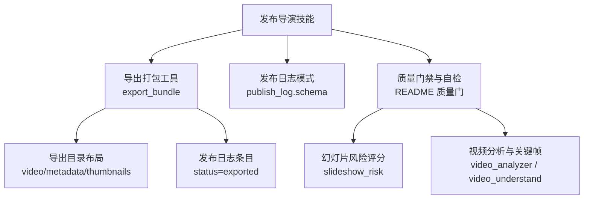
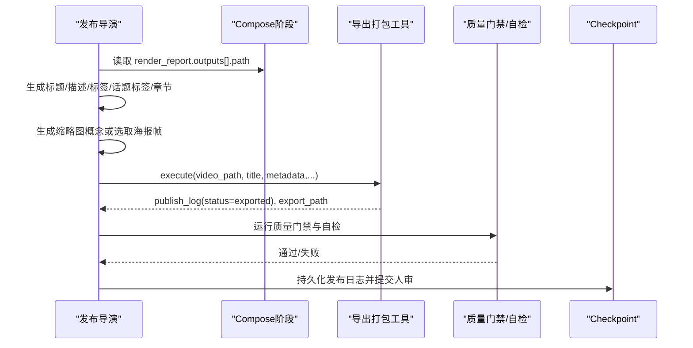
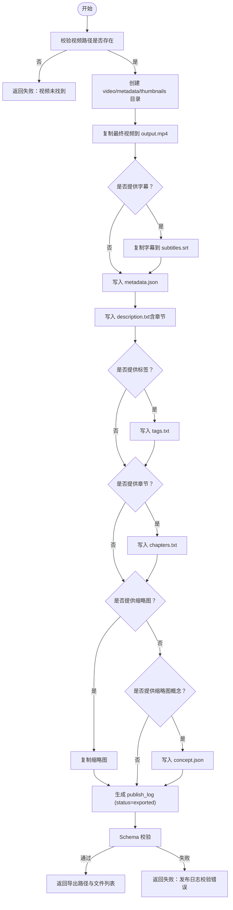
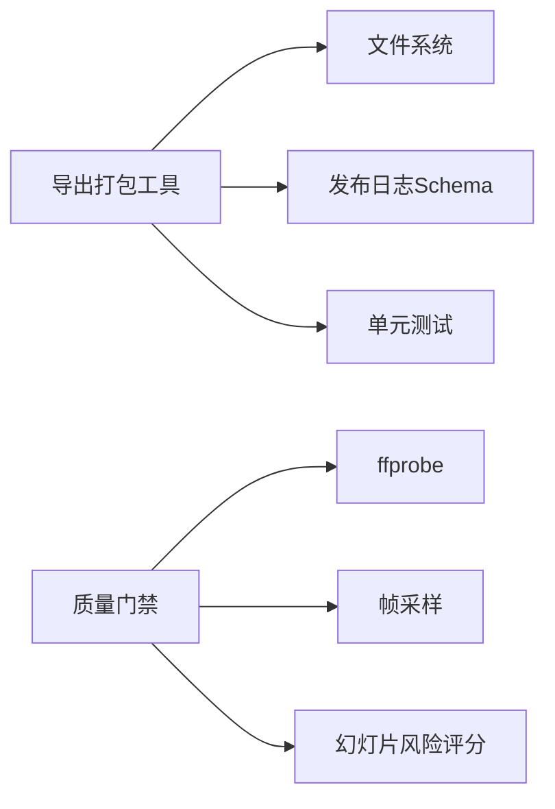

# 发布导演

<cite>
**本文引用的文件**
- [tools/publishers/export_bundle.py](file://tools/publishers/export_bundle.py)
- [schemas/artifacts/publish_log.schema.json](file://schemas/artifacts/publish_log.schema.json)
- [skills/pipelines/explainer/publish-director.md](file://skills/pipelines/explainer/publish-director.md)
- [skills/pipelines/cinematic/publish-director.md](file://skills/pipelines/cinematic/publish-director.md)
- [skills/pipelines/cinematic/compose-director.md](file://skills/pipelines/cinematic/compose-director.md)
- [README.md](file://README.md)
- [tests/tools/test_export_bundle.py](file://tests/tools/test_export_bundle.py)
- [lib/slideshow_risk.py](file://lib/slideshow_risk.py)
- [tools/analysis/video_analyzer.py](file://tools/analysis/video_analyzer.py)
- [tools/analysis/video_understand.py](file://tools/analysis/video_understand.py)
</cite>

## 目录
1. [简介](#简介)
2. [项目结构](#项目结构)
3. [核心组件](#核心组件)
4. [架构总览](#架构总览)
5. [详细组件分析](#详细组件分析)
6. [依赖关系分析](#依赖关系分析)
7. [性能考量](#性能考量)
8. [故障排查指南](#故障排查指南)
9. [结论](#结论)
10. [附录](#附录)

## 简介
本技术文档聚焦OpenMontage电影化管道中的“发布导演”角色，说明其在收尾阶段的关键职责与标准化流程。发布导演负责最终质量检查、元数据整理、海报帧选择与发布包准备，确保成片在情绪连贯性、音频质量与视觉精致度上达到可发布的标准，并以可审计的方式产出多版本输出与平台适配的元数据。

## 项目结构
围绕发布导演的关键代码与规范分布在以下位置：
- 发布打包工具：本地离线导出与日志生成
- 发布日志模式：严格的JSON Schema约束
- 技能手册：解释器与电影化管道的发布步骤、质量门禁与人审关卡
- 质量门禁与自检：渲染前后校验、幻灯片风险评分、视频理解与关键帧采样
- 测试用例：验证导出包结构与发布日志合法性

图表来源
- [tools/publishers/export_bundle.py:39-122](file://tools/publishers/export_bundle.py#L39-L122)
- [schemas/artifacts/publish_log.schema.json:1-40](file://schemas/artifacts/publish_log.schema.json#L1-L40)
- [README.md:656-662](file://README.md#L656-L662)
- [lib/slideshow_risk.py:34-255](file://lib/slideshow_risk.py#L34-L255)
- [tools/analysis/video_analyzer.py:448-476](file://tools/analysis/video_analyzer.py#L448-L476)
- [tools/analysis/video_understand.py:598-630](file://tools/analysis/video_understand.py#L598-L630)

章节来源
- [tools/publishers/export_bundle.py:39-122](file://tools/publishers/export_bundle.py#L39-L122)
- [schemas/artifacts/publish_log.schema.json:1-40](file://schemas/artifacts/publish_log.schema.json#L1-L40)
- [skills/pipelines/explainer/publish-director.md:1-174](file://skills/pipelines/explainer/publish-director.md#L1-L174)
- [skills/pipelines/cinematic/publish-director.md:1-66](file://skills/pipelines/cinematic/publish-director.md#L1-L66)
- [README.md:656-662](file://README.md#L656-L662)

## 核心组件
- 导出打包工具（ExportBundle）
  - 能力：package_export、write_publish_log
  - 特性：本地离线、确定性执行、无网络依赖
  - 输入：视频路径、标题、可选描述/标签/话题标签/章节/字幕/缩略图/平台/可见性/时间戳
  - 输出：导出目录、files_written、schema有效的publish_log（status=exported）
- 发布日志模式（publish_log.schema）
  - 严格字段约束，禁止额外属性
  - 支持平台、状态、可见性、导出路径、时间戳、已用元数据等
- 发布导演技能（解释器/电影化）
  - 明确步骤：收集上下文、SEO元数据、缩略图概念、章节标记、打包导出、构建发布日志、自评、提交
  - 人审关卡：发布阶段默认需要人类审批
- 质量门禁与自检
  - 预合成校验、后渲染自检（ffprobe、黑帧、音频电平、字幕存在性）
  - 幻灯片风险评分（六维度）
  - 视频理解与关键帧采样用于质量评估

章节来源
- [tools/publishers/export_bundle.py:39-122](file://tools/publishers/export_bundle.py#L39-L122)
- [schemas/artifacts/publish_log.schema.json:1-40](file://schemas/artifacts/publish_log.schema.json#L1-L40)
- [skills/pipelines/explainer/publish-director.md:1-174](file://skills/pipelines/explainer/publish-director.md#L1-L174)
- [skills/pipelines/cinematic/publish-director.md:1-66](file://skills/pipelines/cinematic/publish-director.md#L1-L66)
- [README.md:656-662](file://README.md#L656-L662)
- [lib/slideshow_risk.py:34-255](file://lib/slideshow_risk.py#L34-L255)
- [tools/analysis/video_analyzer.py:448-476](file://tools/analysis/video_analyzer.py#L448-L476)
- [tools/analysis/video_understand.py:598-630](file://tools/analysis/video_understand.py#L598-L630)

## 架构总览
发布导演在收尾阶段的工作流如下：
- 从compose阶段的render_report获取最终视频路径
- 基于proposal/research/script生成SEO元数据与章节
- 选择或设计缩略图概念
- 调用导出打包工具生成标准化导出包与发布日志
- 通过质量门禁与自检确认可发布
- 提交至checkpoint并等待人审

图表来源
- [skills/pipelines/explainer/publish-director.md:19-156](file://skills/pipelines/explainer/publish-director.md#L19-L156)
- [tools/publishers/export_bundle.py:158-285](file://tools/publishers/export_bundle.py#L158-L285)
- [README.md:656-662](file://README.md#L656-L662)

## 详细组件分析

### 导出打包工具（ExportBundle）
- 职责
  - 将最终渲染视频复制到导出目录
  - 写入metadata.json、description.txt、tags.txt、chapters.txt
  - 复制字幕与缩略图，或写入缩略图概念JSON
  - 生成schema有效的publish_log条目（status=exported）
- 输入与输出
  - 输入：video_path、title为必填；可选subtitles_path、thumbnail_path、thumbnail_concept、platform、visibility、timestamp等
  - 输出：publish_log、export_path、files_written
- 错误处理
  - 视频路径不存在返回失败
  - 显式提供的可选资源必须存在，否则失败
  - 发布日志需通过Schema校验，否则失败
- 目录布局
  - exports/<project>/video/output.mp4（含字幕）
  - exports/<project>/metadata/{metadata.json, description.txt, tags.txt, chapters.txt}
  - exports/<project>/thumbnails/{concept.json 或 thumbnail.*}

图表来源
- [tools/publishers/export_bundle.py:158-285](file://tools/publishers/export_bundle.py#L158-L285)

章节来源
- [tools/publishers/export_bundle.py:39-122](file://tools/publishers/export_bundle.py#L39-L122)
- [tools/publishers/export_bundle.py:158-285](file://tools/publishers/export_bundle.py#L158-L285)
- [tests/tools/test_export_bundle.py:27-73](file://tests/tools/test_export_bundle.py#L27-L73)

### 发布日志模式（publish_log.schema）
- 关键字段
  - version: 固定为"1.0"
  - entries: 数组，每项包含platform、status、timestamp等必填字段
  - status枚举：published、exported、failed、draft、pending_review
  - visibility枚举：public、private、unlisted
  - metadata_used：记录使用的标题、描述、话题标签、章节
  - additionalProperties: false，禁止扩展字段
- 使用建议
  - 由导出打包工具直接生成并发布，避免手工构造导致字段不合法
  - 在发布导演技能中直接持久化该日志作为阶段产物

章节来源
- [schemas/artifacts/publish_log.schema.json:1-40](file://schemas/artifacts/publish_log.schema.json#L1-L40)
- [skills/pipelines/explainer/publish-director.md:116-156](file://skills/pipelines/explainer/publish-director.md#L116-L156)

### 发布导演技能（解释器与电影化）
- 解释器管道
  - 步骤：收集上下文、生成SEO元数据、缩略图概念、章节标记、打包导出、构建发布日志、自评、提交
  - 自评维度：SEO质量、描述完整性、缩略图概念、导出包完备性、平台适配
- 电影化管道
  - 区分英雄版与衍生版本（预告片、品牌片、预告剪辑、社交剪辑、海报帧/缩略图概念）
  - 元数据匹配情绪基调（戏剧性、高端、神秘、内省、紧迫）
  - 保留编辑真实性，记录hero_output、derivative_outputs、poster_frame_notes、distribution_notes
  - 质量门禁：英雄导出清晰标识、衍生版本按用途标注、元数据符合基调、包可直接使用无需人工清理
  - 人审关卡：发布阶段默认需要人类审批

章节来源
- [skills/pipelines/explainer/publish-director.md:1-174](file://skills/pipelines/explainer/publish-director.md#L1-L174)
- [skills/pipelines/cinematic/publish-director.md:1-66](file://skills/pipelines/cinematic/publish-director.md#L1-L66)

### 质量门禁与自检
- 人审关卡
  - 提案、脚本、场景计划、生成资产、发布均暂停等待人类批准
  - checkpoint拒绝无记录的“已完成”关卡，归档被覆盖的检查点以保留审计轨迹
- 预合成校验
  - 若交付承诺被违反（例如“运动主导”的视频却大量静态图）、幻灯片风险评分严重、渲染器族缺失，则阻止渲染
- 后渲染自检
  - ffprobe校验、抽取四位置帧检测黑帧与破损叠加层、分析音频电平（静音与削波）、验证交付承诺、检查字幕存在性
  - 自检失败则不呈现视频
- 幻灯片风险评分
  - 六维度：重复、装饰性视觉、弱运动、弱镜头意图、排版过度依赖、不支持的电影化声明
  - 根据场景与渲染器族进行评分与归因
- 视频理解与关键帧采样
  - 基于时间戳抽取关键帧，映射到场景索引，便于视觉质检与问题定位
  - 质量模式汇总帧级问题，辅助发布前整体评估

章节来源
- [README.md:656-662](file://README.md#L656-L662)
- [lib/slideshow_risk.py:34-255](file://lib/slideshow_risk.py#L34-L255)
- [tools/analysis/video_analyzer.py:448-476](file://tools/analysis/video_analyzer.py#L448-L476)
- [tools/analysis/video_understand.py:598-630](file://tools/analysis/video_understand.py#L598-L630)

### 电影化音频与视觉精致度
- 音频动态保留
  - 混音应允许安静时刻、冲击时刻、清晰对白/旁白、受控音乐高潮
- 视觉精致度
  - 谨慎使用画幅遮罩、24fps意图、重度调色；仅在有助于作品时应用
  - 检查开场帧、揭示节拍、结尾落点、字幕可读性
  - 推荐记录frame_treatment、grade_profile、mix_notes、variant_outputs

章节来源
- [skills/pipelines/cinematic/compose-director.md:57-94](file://skills/pipelines/cinematic/compose-director.md#L57-L94)

## 依赖关系分析
- 导出打包工具依赖
  - 文件系统操作（复制视频、字幕、缩略图）
  - JSON序列化与Schema校验
  - 无网络依赖，纯本地离线
- 发布日志模式依赖
  - 严格字段约束，禁止额外属性
- 质量门禁依赖
  - ffprobe、帧采样、音频分析、幻灯片风险评分算法
- 测试依赖
  - 验证工具契约、导出包布局、发布日志合法性、章节格式、缺失视频错误路径

图表来源
- [tools/publishers/export_bundle.py:39-122](file://tools/publishers/export_bundle.py#L39-L122)
- [schemas/artifacts/publish_log.schema.json:1-40](file://schemas/artifacts/publish_log.schema.json#L1-L40)
- [tests/tools/test_export_bundle.py:27-73](file://tests/tools/test_export_bundle.py#L27-L73)
- [lib/slideshow_risk.py:34-255](file://lib/slideshow_risk.py#L34-L255)

章节来源
- [tools/publishers/export_bundle.py:39-122](file://tools/publishers/export_bundle.py#L39-L122)
- [schemas/artifacts/publish_log.schema.json:1-40](file://schemas/artifacts/publish_log.schema.json#L1-L40)
- [tests/tools/test_export_bundle.py:27-73](file://tests/tools/test_export_bundle.py#L27-L73)
- [lib/slideshow_risk.py:34-255](file://lib/slideshow_risk.py#L34-L255)

## 性能考量
- 导出打包工具为纯本地操作，资源占用低（CPU核数1、内存约128MB、无VRAM与网络需求），适合快速打包与多次迭代
- 质量门禁与自检涉及ffprobe与帧采样，建议在GPU/CPU可用环境下执行以提升速度
- 幻灯片风险评分基于场景与渲染器族信息，计算开销较小但能显著降低低质量输出风险
- 建议在批量导出与多版本输出时并行处理不同平台的元数据与章节，减少等待时间

[本节为通用指导，不直接分析具体文件]

## 故障排查指南
- 视频路径不存在
  - 现象：导出失败，错误提示包含“not found”
  - 解决：确认render_report.outputs[].path有效且可访问
- 可选资源缺失
  - 现象：提供了subtitles_path或thumbnail_path但文件不存在，导出失败
  - 解决：确保所有显式提供的资源存在；如不需要，移除对应参数
- 发布日志Schema校验失败
  - 现象：导出成功但返回错误，提示publish_log校验失败
  - 解决：检查entries字段是否符合枚举与格式要求；不要添加额外字段
- 章节格式不正确
  - 现象：章节无法正确生成或显示
  - 解决：确保章节对象包含start_seconds/time_seconds或time字段，并提供title/label
- 质量门禁失败
  - 现象：自检报告指出黑帧、静音、削波、字幕缺失或交付承诺未满足
  - 解决：根据自检报告修复音频电平、替换黑帧、补充字幕、调整交付承诺

章节来源
- [tools/publishers/export_bundle.py:158-285](file://tools/publishers/export_bundle.py#L158-L285)
- [tests/tools/test_export_bundle.py:39-73](file://tests/tools/test_export_bundle.py#L39-L73)
- [README.md:656-662](file://README.md#L656-L662)

## 结论
发布导演在电影化管道收尾阶段承担最终质量把关与发布包标准化的关键职责。通过明确的步骤、严格的Schema约束、系统化的质量门禁与自检，以及人审关卡，确保成片在情绪连贯性、音频质量与视觉精致度上达到可发布标准，并产出多版本输出与平台适配的元数据。结合导出打包工具与测试用例，可实现可重复、可审计、可回滚的发布流程。

[本节为总结性内容，不直接分析具体文件]

## 附录
- 导出目录结构示例
  - exports/<project>/video/output.mp4（含subtitles.srt）
  - exports/<project>/metadata/metadata.json、description.txt、tags.txt、chapters.txt
  - exports/<project>/thumbnails/concept.json 或 thumbnail.*
- 发布日志示例结构
  - version: "1.0"
  - entries: [{ platform, status="exported", export_path, timestamp, metadata_used }]
- 自评清单
  - SEO质量、描述完整性、缩略图概念、导出包完备性、平台适配

[本节为参考信息，不直接分析具体文件]