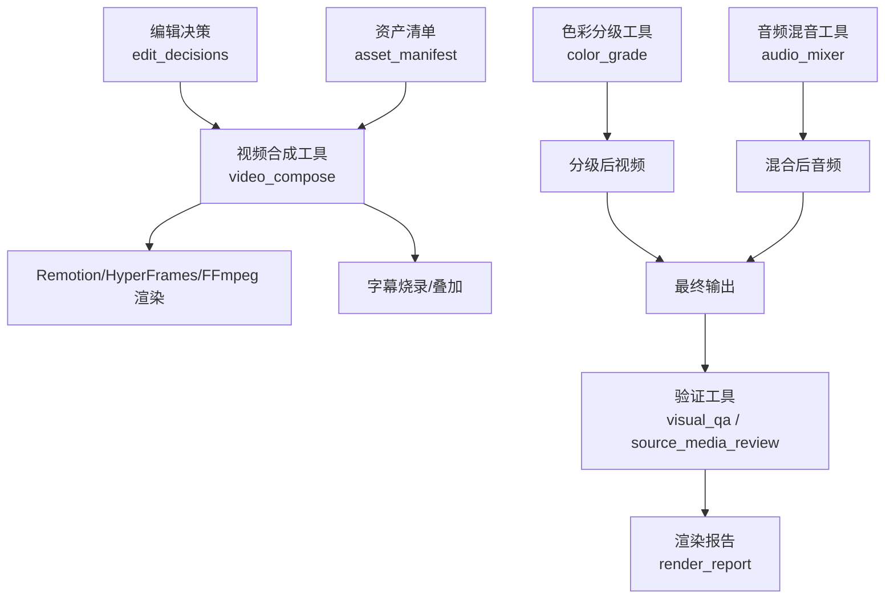
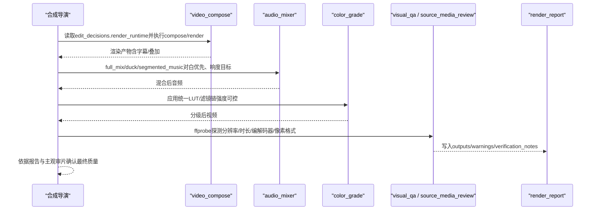
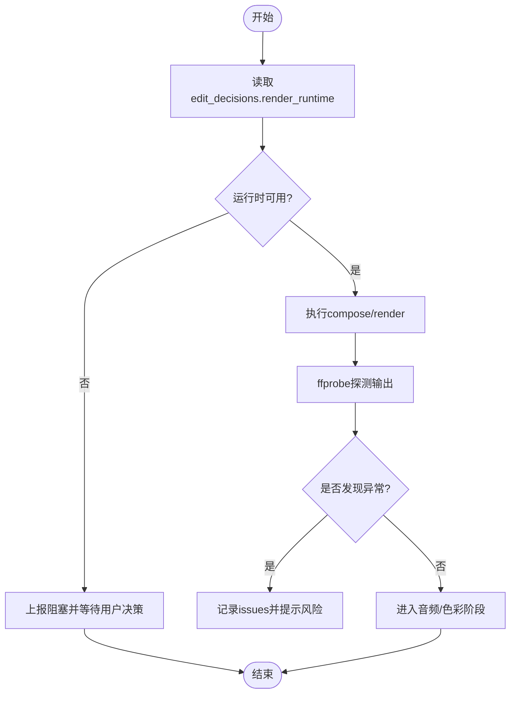
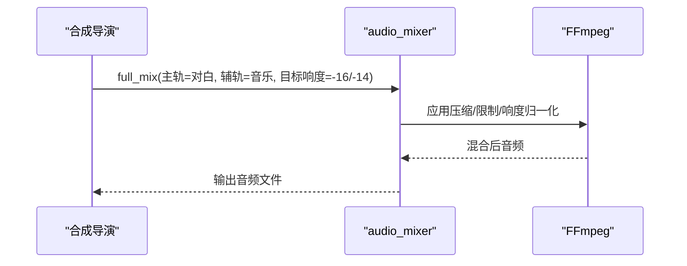
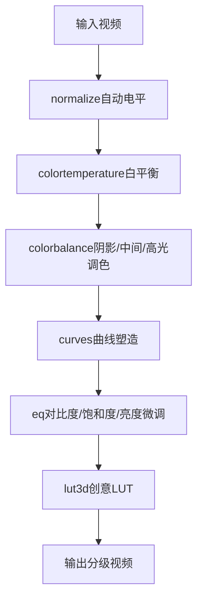
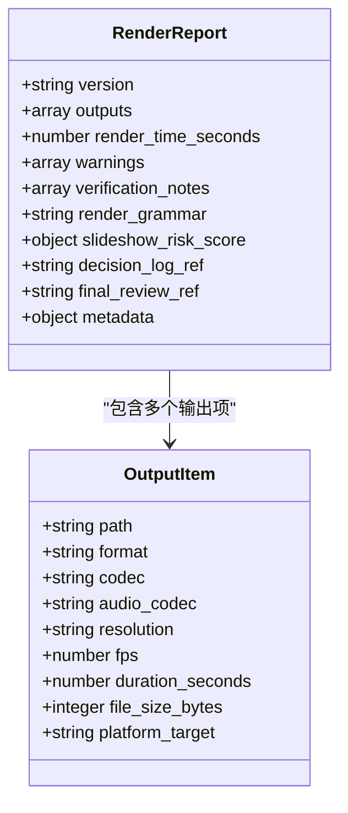
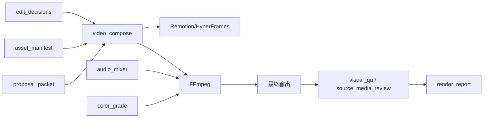

# 合成导演

<cite>
**本文引用的文件**
- [compose-director.md](file://skills/pipelines/cinematic/compose-director.md)
- [video_compose.py](file://tools/video/video_compose.py)
- [audio_mixer.py](file://tools/audio/audio_mixer.py)
- [color_grade.py](file://tools/enhancement/color_grade.py)
- [visual_qa.py](file://tools/analysis/visual_qa.py)
- [source_media_review.py](file://lib/source_media_review.py)
- [render_report.schema.json](file://schemas/artifacts/render_report.schema.json)
- [QA_PLAN.md](file://tests/qa/QA_PLAN.md)
- [cinematic.md](file://skills/creative/cinematic.md)
</cite>

## 目录
1. [简介](#简介)
2. [项目结构](#项目结构)
3. [核心组件](#核心组件)
4. [架构总览](#架构总览)
5. [详细组件分析](#详细组件分析)
6. [依赖关系分析](#依赖关系分析)
7. [性能考量](#性能考量)
8. [故障排查指南](#故障排查指南)
9. [结论](#结论)
10. [附录：质量检查清单与常见问题](#附录质量检查清单与常见问题)

## 简介
本技术文档面向OpenMontage电影化管道中的“合成导演”角色，聚焦其在后期制作阶段的职责与技术实现。合成导演负责最终的视频合成与输出验证、色彩分级应用、音频动态控制与视觉效果增强，确保成片满足宽银幕美学、运动承诺与平台交付标准。文档同时提供基于工具链（FFmpeg、Remotion/HyperFrames）的标准化流程、质量标准与问题定位方法。

## 项目结构
围绕合成导演的关键能力由以下模块协同完成：
- 视频合成与渲染路由：根据提案阶段锁定的运行时（Remotion/HyperFrames/FFmpeg）进行合规渲染与封装。
- 音频混音与动态控制：对白优先、音乐避让、响度归一化与分段音乐控制。
- 色彩分级与视觉增强：统一LUT/滤镜链、肤色保护、对比度与饱和度控制。
- 输出验证与报告：使用ffprobe等技术指标校验分辨率、时长、编解码器、像素格式等，并生成结构化报告。

图表来源
- [video_compose.py:1-200](file://tools/video/video_compose.py#L1-L200)
- [audio_mixer.py:1-200](file://tools/audio/audio_mixer.py#L1-L200)
- [color_grade.py:1-200](file://tools/enhancement/color_grade.py#L1-L200)
- [visual_qa.py:231-278](file://tools/analysis/visual_qa.py#L231-L278)
- [source_media_review.py:77-83](file://lib/source_media_review.py#L77-L83)
- [render_report.schema.json:1-64](file://schemas/artifacts/render_report.schema.json#L1-L64)

章节来源
- [compose-director.md:1-94](file://skills/pipelines/cinematic/compose-director.md#L1-L94)
- [video_compose.py:1-200](file://tools/video/video_compose.py#L1-L200)
- [audio_mixer.py:1-200](file://tools/audio/audio_mixer.py#L1-L200)
- [color_grade.py:1-200](file://tools/enhancement/color_grade.py#L1-L200)
- [visual_qa.py:231-278](file://tools/analysis/visual_qa.py#L231-L278)
- [source_media_review.py:77-83](file://lib/source_media_review.py#L77-L83)
- [render_report.schema.json:1-64](file://schemas/artifacts/render_report.schema.json#L1-L64)

## 核心组件
- 视频合成与渲染路由（video_compose）
  - 支持remotion/hyperframes/ffmpeg三种运行时，严格遵循提案阶段锁定的render_runtime，禁止静默降级或替换。
  - 提供compose/render/remotion_render/burn_subtitles/overlay/encode等操作，支持字幕烧录、叠加、编码参数配置。
  - 输出时进行技术探测（duration、resolution、fps、codec、文件大小），并记录潜在问题。
- 音频混音与动态控制（audio_mixer）
  - 支持mix/duck/fade/normalize/full_mix/segmented_music等操作。
  - 对白优先策略：在对话出现时对背景音乐自动避让（ducking），保证清晰度。
  - 响度目标可配置（如-16 LUFS播客、-14 LUFS短视频平台），支持分段音乐与淡入淡出。
- 色彩分级与视觉增强（color_grade）
  - 内置多种风格化预设（cinematic_warm/cool、moody_dark、bright_clean、vintage_film、high_contrast、neutral）。
  - 支持外部.cube LUT与自定义滤镜链；强度可调，避免过度处理破坏人脸与文字。
  - 推荐滤镜顺序：normalize → colortemperature → colorbalance → curves → eq → lut3d。
- 输出验证与报告（visual_qa / source_media_review / render_report.schema）
  - 通过ffprobe解析容器、流信息，校验宽度/高度、像素格式、帧率、音频通道、采样率等。
  - 将结果写入结构化渲染报告，包含outputs数组、warnings、verification_notes等字段。

章节来源
- [video_compose.py:1-200](file://tools/video/video_compose.py#L1-L200)
- [video_compose.py:2339-2354](file://tools/video/video_compose.py#L2339-L2354)
- [audio_mixer.py:1-200](file://tools/audio/audio_mixer.py#L1-L200)
- [color_grade.py:1-200](file://tools/enhancement/color_grade.py#L1-L200)
- [visual_qa.py:231-278](file://tools/analysis/visual_qa.py#L231-L278)
- [source_media_review.py:77-83](file://lib/source_media_review.py#L77-L83)
- [render_report.schema.json:1-64](file://schemas/artifacts/render_report.schema.json#L1-L64)

## 架构总览
合成导演的工作流以“编辑决策”和“资产清单”为输入，经视频合成、音频混音、色彩分级后产出最终视频，并通过验证工具生成渲染报告。运行时选择受提案约束，任何变更需显式沟通与审批。

图表来源
- [compose-director.md:1-94](file://skills/pipelines/cinematic/compose-director.md#L1-L94)
- [video_compose.py:1-200](file://tools/video/video_compose.py#L1-L200)
- [audio_mixer.py:1-200](file://tools/audio/audio_mixer.py#L1-L200)
- [color_grade.py:1-200](file://tools/enhancement/color_grade.py#L1-L200)
- [visual_qa.py:231-278](file://tools/analysis/visual_qa.py#L231-L278)
- [render_report.schema.json:1-64](file://schemas/artifacts/render_report.schema.json#L1-L64)

## 详细组件分析

### 视频合成与渲染路由（video_compose）
- 运行时锁定与治理
  - 必须读取edit_decisions.render_runtime，并在提案阶段锁定的运行时下进行渲染。若Remotion不可用或失败，应停止并上报，不得静默降级到FFmpeg静态图路径。
  - 当场景计划包含标题卡、数据卡、英雄标题、结尾标签、叠加等Remotion场景类型时，必须进行Remotion预检。
- 操作能力
  - compose：低层拼接剪辑+音频+字幕。
  - render：高层编排，自动路由到Remotion（图像/动画）或FFmpeg（纯视频）。
  - remotion_render：通过Remotion进行帧精确渲染。
  - burn_subtitles：将字幕烧录进视频。
  - overlay：将叠加素材合成到基础视频上。
  - encode：按目标profile/codec重新编码。
- 输出技术探测
  - 对输出进行ffprobe探测，记录valid_container、duration_seconds、resolution、fps、has_audio、codec、file_size_bytes及issues（如时长过短等）。

图表来源
- [compose-director.md:1-94](file://skills/pipelines/cinematic/compose-director.md#L1-L94)
- [video_compose.py:1-200](file://tools/video/video_compose.py#L1-L200)
- [video_compose.py:2339-2354](file://tools/video/video_compose.py#L2339-L2354)

章节来源
- [compose-director.md:1-94](file://skills/pipelines/cinematic/compose-director.md#L1-L94)
- [video_compose.py:1-200](file://tools/video/video_compose.py#L1-L200)
- [video_compose.py:2339-2354](file://tools/video/video_compose.py#L2339-L2354)

### 音频混音与动态控制（audio_mixer）
- 对白优先与音乐避让
  - 使用ducking在对白出现时降低背景音乐音量，确保对话清晰。
  - 支持简单API（primary_audio/secondary_audio）与高级tracks模式。
- 响度归一化与平台目标
  - 支持loudnorm目标值配置（如-16 LUFS播客、-14 LUFS短视频平台），匹配不同平台的响度规范。
- 分段音乐与淡入淡出
  - segmented_music可在指定时间段内插入音乐，并在边界处淡入淡出，其他时段静音。
- 完整混音流程
  - full_mix可将旁白轨道与音乐合并，结合ducking与normalize一次性完成。

图表来源
- [audio_mixer.py:1-200](file://tools/audio/audio_mixer.py#L1-L200)

章节来源
- [audio_mixer.py:1-200](file://tools/audio/audio_mixer.py#L1-L200)

### 色彩分级与视觉增强（color_grade）
- 预设与LUT
  - 内置多套风格化预设，适用于企业、科学、叙事、科技、戏剧、生活方式、复古等不同内容类型。
  - 支持外部.cube LUT，最后应用于已校正的画面。
- 滤镜链顺序
  - normalize → colortemperature → colorbalance → curves → eq → lut3d，确保可预测的结果。
- 强度控制与保护
  - intensity参数用于混合原始画面与分级后的画面，避免过度处理破坏人脸与文字。
  - 建议在人脸增强之后进行色彩分级，保持整体处理顺序合理。

图表来源
- [color_grade.py:1-200](file://tools/enhancement/color_grade.py#L1-L200)
- [color-grading.md:1-162](file://skills/core/color-grading.md#L1-L162)

章节来源
- [color_grade.py:1-200](file://tools/enhancement/color_grade.py#L1-L200)
- [color-grading.md:1-162](file://skills/core/color-grading.md#L1-L162)

### 输出验证与报告（visual_qa / source_media_review / render_report.schema）
- ffprobe探测
  - 解析容器、视频流、音频流信息，提取width/height、pixel_format、video_codec、frame_rate、audio_codec、sample_rate、channels等。
  - 与期望值对比，生成validation_issues与validation_passed标志。
- 源媒体审查
  - 对输入媒体进行质量风险评估，捕获无法探测的文件并记录警告。
- 渲染报告
  - outputs数组包含path、format、codec、audio_codec、resolution、fps、duration_seconds、file_size_bytes、platform_target等字段。
  - 支持warnings、verification_notes、render_grammar、slideshow_risk_score等元数据。

图表来源
- [render_report.schema.json:1-64](file://schemas/artifacts/render_report.schema.json#L1-L64)
- [visual_qa.py:231-278](file://tools/analysis/visual_qa.py#L231-L278)
- [source_media_review.py:77-83](file://lib/source_media_review.py#L77-L83)

章节来源
- [visual_qa.py:231-278](file://tools/analysis/visual_qa.py#L231-L278)
- [source_media_review.py:77-83](file://lib/source_media_review.py#L77-L83)
- [render_report.schema.json:1-64](file://schemas/artifacts/render_report.schema.json#L1-L64)

## 依赖关系分析
- 运行时依赖
  - video_compose依赖FFmpeg与可选的Remotion/HyperFrames环境；必须在渲染前检测可用性。
  - audio_mixer依赖FFmpeg，可选pydub用于高级混音。
  - color_grade依赖FFmpeg与.cube LUT（可选）。
- 数据依赖
  - edit_decisions与asset_manifest作为合成输入，驱动剪辑、字幕、叠加与编码参数。
  - proposal_packet用于运行时一致性校验，防止静默切换。
- 外部集成点
  - 平台目标（YouTube/TikTok/IG）影响响度目标与编码参数。
  - 审阅与测试脚本（QA_PLAN）指导人工审片与自动化验证。

图表来源
- [video_compose.py:1-200](file://tools/video/video_compose.py#L1-L200)
- [audio_mixer.py:1-200](file://tools/audio/audio_mixer.py#L1-L200)
- [color_grade.py:1-200](file://tools/enhancement/color_grade.py#L1-L200)
- [visual_qa.py:231-278](file://tools/analysis/visual_qa.py#L231-L278)
- [source_media_review.py:77-83](file://lib/source_media_review.py#L77-L83)

章节来源
- [video_compose.py:1-200](file://tools/video/video_compose.py#L1-L200)
- [audio_mixer.py:1-200](file://tools/audio/audio_mixer.py#L1-L200)
- [color_grade.py:1-200](file://tools/enhancement/color_grade.py#L1-L200)
- [visual_qa.py:231-278](file://tools/analysis/visual_qa.py#L231-L278)
- [source_media_review.py:77-83](file://lib/source_media_review.py#L77-L83)

## 性能考量
- 渲染引擎选择
  - Remotion适合需要帧精确、复杂转场与叠加的场景；HyperFrames适合动效排版与HTML/GSAP驱动；FFmpeg适合简单拼接与无合成需求。
- 编码参数
  - CRF与preset影响画质与渲染速度；建议根据平台目标选择合适的profile与编码器。
- 音频处理
  - loudnorm与压缩/限制会增加CPU负载；合理设置目标响度与阈值以避免削波。
- 色彩分级
  - 滤镜链较长会延长处理时间；建议先单帧测试再全片处理，减少无效渲染。

[本节为通用指导，不直接分析具体文件]

## 故障排查指南
- 运行时不可用或失败
  - 现象：Remotion/HyperFrames未安装或执行失败。
  - 处理：立即上报阻塞，不得静默降级；检查环境与依赖，必要时回退到已批准的替代方案。
- 输出时长异常
  - 现象：输出时长过短或过长。
  - 处理：检查剪辑与转场逻辑；使用ffprobe验证duration_seconds，调整trim或stitch。
- 分辨率或像素格式不符
  - 现象：输出分辨率或像素格式不符合预期。
  - 处理：核对期望值与平台要求；必要时重采样或转换像素格式。
- 音频清晰度不足
  - 现象：对白被音乐掩盖。
  - 处理：启用ducking并调整避让幅度；检查响度目标与压缩阈值。
- 色彩过度或失真
  - 现象：人脸过饱和或文字可读性下降。
  - 处理：降低intensity；调整curves与eq；确保滤镜顺序正确。

章节来源
- [compose-director.md:1-94](file://skills/pipelines/cinematic/compose-director.md#L1-L94)
- [video_compose.py:2339-2354](file://tools/video/video_compose.py#L2339-L2354)
- [visual_qa.py:231-278](file://tools/analysis/visual_qa.py#L231-L278)
- [audio_mixer.py:1-200](file://tools/audio/audio_mixer.py#L1-L200)
- [color_grade.py:1-200](file://tools/enhancement/color_grade.py#L1-L200)

## 结论
合成导演在电影化后期制作中承担最终合成的关键职责：确保运行时合规、输出质量达标、视听体验一致。通过严格的验证流程、合理的色彩与音频处理、以及对宽银幕美学与运动承诺的尊重，合成导演能够稳定地产出符合平台与受众期待的高质量成品。

[本节为总结性内容，不直接分析具体文件]

## 附录：质量检查清单与常见问题

### 合成质量检查清单
- 运行时与承诺
  - 确认edit_decisions.render_runtime与提案一致；若Remotion必需且不可用，立即上报。
  - 若delivery_promise.motion_required=true，确保最终输出包含足够的运动片段，避免静止图主导。
- 视频技术指标
  - 使用ffprobe验证：duration_seconds、resolution、fps、codec、pixel_format、has_audio。
  - 检查是否有issues（如时长过短、分辨率不符、像素格式错误）。
- 色彩与画面
  - 统一LUT/滤镜链；强度适中，保护人脸与文字；对比度与饱和度合理。
  - 宽银幕效果（如2.39:1 letterbox）仅在有助于作品时使用，避免浪费像素。
- 音频动态
  - 对白优先；音乐避让；响度目标匹配平台（-16/-14 LUFS）。
  - 分段音乐淡入淡出自然；无削波与爆音。
- 最终审片
  - 检查开场帧、揭示节拍、结尾落幅与字幕可读性。
  - 主观评估情绪与节奏是否符合创意意图。

章节来源
- [compose-director.md:1-94](file://skills/pipelines/cinematic/compose-director.md#L1-L94)
- [video_compose.py:2339-2354](file://tools/video/video_compose.py#L2339-L2354)
- [visual_qa.py:231-278](file://tools/analysis/visual_qa.py#L231-L278)
- [audio_mixer.py:1-200](file://tools/audio/audio_mixer.py#L1-L200)
- [color_grade.py:1-200](file://tools/enhancement/color_grade.py#L1-L200)
- [QA_PLAN.md:1-26](file://tests/qa/QA_PLAN.md#L1-L26)
- [cinematic.md:21-41](file://skills/creative/cinematic.md#L21-L41)

### 常见问题解决方案
- 静默运行时切换
  - 解决：禁止静默降级；若首选运行时失败，上报并等待用户决策。
- 对白不清
  - 解决：启用ducking，调整避让幅度；检查响度目标与压缩设置。
- 色彩失真
  - 解决：降低intensity；调整滤镜链顺序与参数；避免过度饱和与对比度过高。
- 输出尺寸不符
  - 解决：核对期望分辨率与平台要求；必要时重采样或裁剪。
- 时长异常
  - 解决：检查剪辑与转场；使用ffprobe验证并调整trim/stitch。

章节来源
- [compose-director.md:1-94](file://skills/pipelines/cinematic/compose-director.md#L1-L94)
- [video_compose.py:2339-2354](file://tools/video/video_compose.py#L2339-L2354)
- [audio_mixer.py:1-200](file://tools/audio/audio_mixer.py#L1-L200)
- [color_grade.py:1-200](file://tools/enhancement/color_grade.py#L1-L200)
- [visual_qa.py:231-278](file://tools/analysis/visual_qa.py#L231-L278)