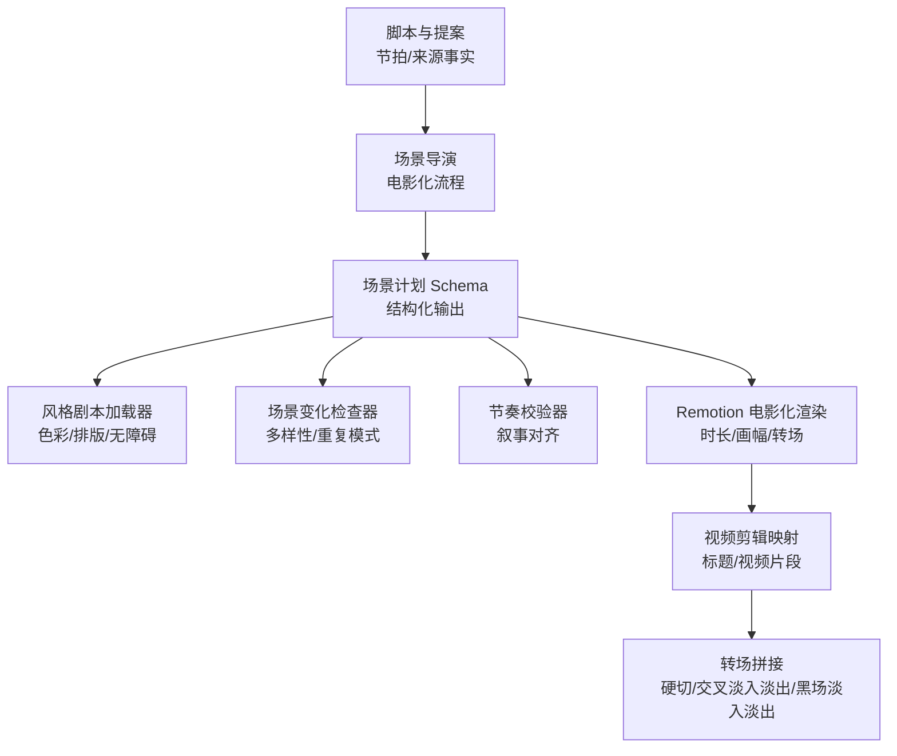
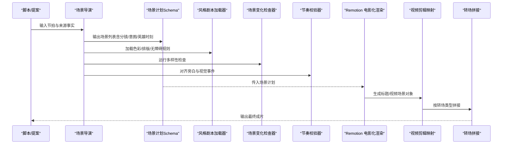
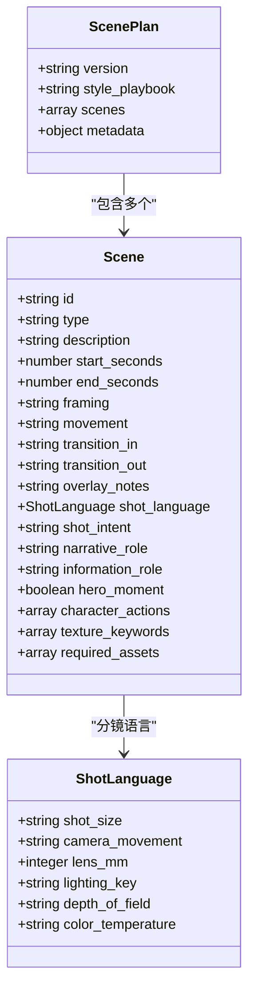
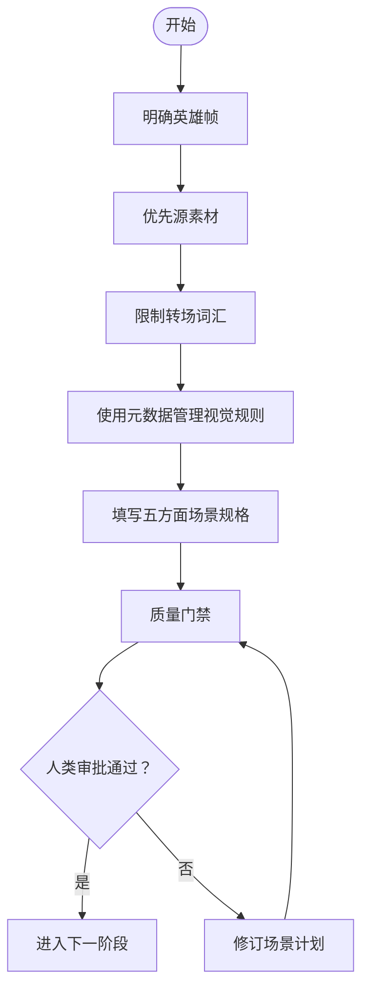
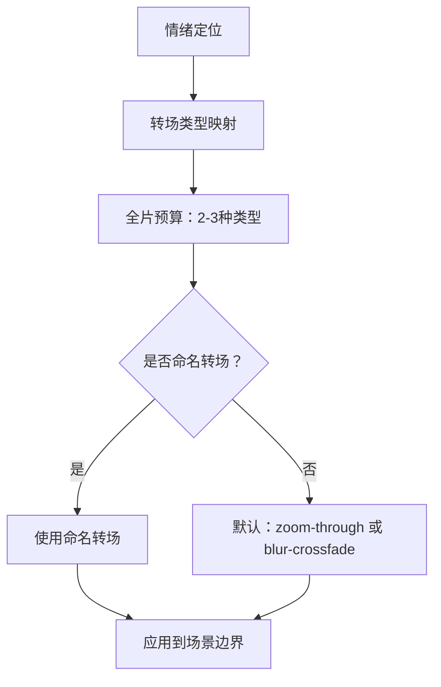
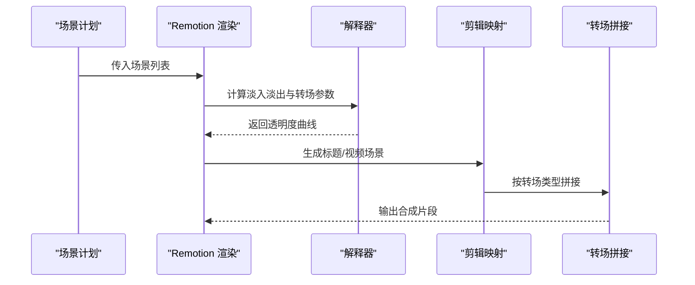
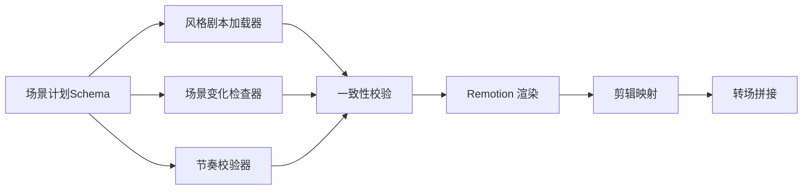

# 场景导演

<cite>
**本文引用的文件**
- [scene_plan.schema.json](file://schemas/artifacts/scene_plan.schema.json)
- [scene-director.md（电影化）](file://skills/pipelines/cinematic/scene-director.md)
- [cinematic.md（电影化技能）](file://skills/creative/cinematic.md)
- [video-gen-prompting.md（通用视频提示词）](file://skills/creative/video-gen-prompting.md)
- [color-grading.md（调色指南）](file://skills/core/color-grading.md)
- [playbook_loader.py（风格剧本加载器）](file://styles/playbook_loader.py)
- [variation_checker.py（场景变化检查器）](file://lib/variation_checker.py)
- [verify_scene_pacing.py（节奏校验）](file://lib/verify_scene_pacing.py)
- [CinematicRenderer.tsx（Remotion 电影化渲染）](file://remotion-composer/src/CinematicRenderer.tsx)
- [Explainer.tsx（转场与淡入淡出）](file://remotion-composer/src/Explainer.tsx)
- [video_compose.py（剪辑到场景映射）](file://tools/video/video_compose.py)
- [video_stitch.py（转场拼接）](file://tools/video/video_stitch.py)
- [TRANSITION-REGISTRY.md（过渡注册表）](file://.agents/skills/hyperframes-animation/transitions/TRANSITION-REGISTRY.md)
- [executive-producer.md（执行制片人检查点）](file://skills/pipelines/cinematic/executive-producer.md)
</cite>

## 目录
1. [简介](#简介)
2. [项目结构](#项目结构)
3. [核心组件](#核心组件)
4. [架构总览](#架构总览)
5. [详细组件分析](#详细组件分析)
6. [依赖关系分析](#依赖关系分析)
7. [性能考虑](#性能考虑)
8. [故障排查指南](#故障排查指南)
9. [结论](#结论)
10. [附录](#附录)

## 简介
本技术文档聚焦 OpenMontage 电影化管道中的“场景导演”角色，说明其如何将脚本节拍转化为可执行的视觉场景规划。场景导演的核心职责包括：
- 明确英雄时刻（高潮、揭示帧），确保关键画面具备强记忆点
- 规划场景转换，限制转场词汇以维持情绪连贯
- 保证视觉一致性（色彩/情绪系统、画幅比、镜头语言）
- 优先使用源素材，生成内容仅用于补充缺失或强调信息
- 设计支持情绪而非分散注意力的转场效果

文档同时提供标准化场景规划格式、质量检查清单与视觉一致性验证方法，并给出从计划到渲染的端到端流程图。

## 项目结构
OpenMontage 将“场景导演”的职责分布在规范、工具与渲染层：
- 规范层：场景计划 Schema、电影化技能、通用提示词、调色指南
- 工具层：风格剧本加载、场景变化检查、节奏校验、转场注册表
- 渲染层：Remotion 电影化渲染、剪辑到场景映射、转场拼接

**图表来源**
- [scene_plan.schema.json:1-118](file://schemas/artifacts/scene_plan.schema.json#L1-L118)
- [scene-director.md（电影化）:1-88](file://skills/pipelines/cinematic/scene-director.md#L1-L88)
- [playbook_loader.py:37-84](file://styles/playbook_loader.py#L37-L84)
- [variation_checker.py:26-177](file://lib/variation_checker.py#L26-L177)
- [verify_scene_pacing.py:59-135](file://lib/verify_scene_pacing.py#L59-L135)
- [CinematicRenderer.tsx:441-456](file://remotion-composer/src/CinematicRenderer.tsx#L441-L456)
- [video_compose.py:794-832](file://tools/video/video_compose.py#L794-L832)
- [video_stitch.py:544-564](file://tools/video/video_stitch.py#L544-L564)

**章节来源**
- [scene_plan.schema.json:1-118](file://schemas/artifacts/scene_plan.schema.json#L1-L118)
- [scene-director.md（电影化）:1-88](file://skills/pipelines/cinematic/scene-director.md#L1-L88)
- [playbook_loader.py:37-84](file://styles/playbook_loader.py#L37-L84)
- [variation_checker.py:26-177](file://lib/variation_checker.py#L26-L177)
- [verify_scene_pacing.py:59-135](file://lib/verify_scene_pacing.py#L59-L135)
- [CinematicRenderer.tsx:441-456](file://remotion-composer/src/CinematicRenderer.tsx#L441-L456)
- [video_compose.py:794-832](file://tools/video/video_compose.py#L794-L832)
- [video_stitch.py:544-564](file://tools/video/video_stitch.py#L544-L564)

## 核心组件
- 场景计划 Schema：定义场景对象的结构，包含类型、时间范围、分镜语言、意图、角色、英雄时刻、纹理关键词、必需资产等字段，确保下游工具可解析与校验。
- 电影化场景导演流程：明确英雄帧、优先源素材、限制转场词汇、使用元数据管理视觉规则、五方面场景规格、质量门禁与人工审批。
- 风格剧本加载器：加载并验证样式 YAML，提供色彩对比度、色盲安全、字体层级与无障碍校验。
- 场景变化检查器：检测重复模式（景别、运动、光照、描述泛化、纹理关键词、意图完整性），避免幻灯片式输出。
- 节奏校验器：将步骤序列与旁白提示对齐，确保视觉事件在容差范围内匹配叙事节拍。
- Remotion 电影化渲染：计算总时长、帧率与画幅；解释器处理淡入淡出与转场；剪辑映射将标题与视频片段转换为场景对象；拼接器实现硬切、交叉淡入淡出、黑场淡入淡出。
- 过渡注册表：为不同情绪选择转场类型，限制全片使用的转场种类数量，保持专业感。

**章节来源**
- [scene_plan.schema.json:11-113](file://schemas/artifacts/scene_plan.schema.json#L11-L113)
- [scene-director.md（电影化）:16-88](file://skills/pipelines/cinematic/scene-director.md#L16-L88)
- [playbook_loader.py:37-84](file://styles/playbook_loader.py#L37-L84)
- [variation_checker.py:26-177](file://lib/variation_checker.py#L26-L177)
- [verify_scene_pacing.py:59-135](file://lib/verify_scene_pacing.py#L59-L135)
- [CinematicRenderer.tsx:441-456](file://remotion-composer/src/CinematicRenderer.tsx#L441-L456)
- [Explainer.tsx:441-481](file://remotion-composer/src/Explainer.tsx#L441-L481)
- [video_compose.py:794-832](file://tools/video/video_compose.py#L794-L832)
- [video_stitch.py:544-564](file://tools/video/video_stitch.py#L544-L564)
- [TRANSITION-REGISTRY.md:141-168](file://.agents/skills/hyperframes-animation/transitions/TRANSITION-REGISTRY.md#L141-L168)

## 架构总览
场景导演在电影化管道中处于“创意到工程”的关键桥接位置：上游读取脚本与提案，产出结构化场景计划；中游通过风格剧本与检查器保障一致性与多样性；下游由 Remotion 与视频工具完成渲染与拼接。

**图表来源**
- [scene_plan.schema.json:11-113](file://schemas/artifacts/scene_plan.schema.json#L11-L113)
- [scene-director.md（电影化）:16-88](file://skills/pipelines/cinematic/scene-director.md#L16-L88)
- [playbook_loader.py:37-84](file://styles/playbook_loader.py#L37-L84)
- [variation_checker.py:26-177](file://lib/variation_checker.py#L26-L177)
- [verify_scene_pacing.py:59-135](file://lib/verify_scene_pacing.py#L59-L135)
- [CinematicRenderer.tsx:441-456](file://remotion-composer/src/CinematicRenderer.tsx#L441-L456)
- [video_compose.py:794-832](file://tools/video/video_compose.py#L794-L832)
- [video_stitch.py:544-564](file://tools/video/video_stitch.py#L544-L564)

## 详细组件分析

### 场景计划数据结构（Schema）
- 版本与风格剧本名称：便于追踪与复用
- 场景数组：每个场景包含 id、type、description、start_seconds、end_seconds 等必填字段
- 分镜语言 shot_language：限定景别、镜头运动、焦距、布光、景深、色温等枚举值
- 叙事与意图：narrative_role、shot_intent、information_role 明确场景作用
- 英雄时刻 hero_moment：标记视觉峰值
- 纹理关键词 texture_keywords：增强生成提示词质感
- 必需资产 required_assets：标注来源（generate/source/provided/record）

**图表来源**
- [scene_plan.schema.json:11-113](file://schemas/artifacts/scene_plan.schema.json#L11-L113)

**章节来源**
- [scene_plan.schema.json:11-113](file://schemas/artifacts/scene_plan.schema.json#L11-L113)

### 场景导演流程（电影化）
- 明确英雄帧：开场、揭示、结尾、标题卡的高光时刻
- 优先源素材：让真实素材承载主体，生成插入仅作过渡或强调
- 限制转场词汇：硬切、黑场淡入淡出、慢溶解、克制的推近/切入
- 使用元数据管理视觉规则：hero_frames、transition_rules、aspect_ratio_rules、title_card_rules、support_insert_rules
- 五方面场景规格：主体、主体运动、场景、空间构图、相机；覆盖物单独记录
- 质量门禁：每节拍有场景处理、英雄帧完整指定、支撑插入合理、覆盖物正确记录、视觉语言一致
- 人工审批：通过后进入下一阶段

**图表来源**
- [scene-director.md（电影化）:16-88](file://skills/pipelines/cinematic/scene-director.md#L16-L88)

**章节来源**
- [scene-director.md（电影化）:16-88](file://skills/pipelines/cinematic/scene-director.md#L16-L88)

### 色彩与情绪系统（调色与画幅）
- 电影化画幅：推荐 2.39:1 宽银幕或 16:9 加上下黑边；帧率 24fps；平均镜头时长 4-8 秒
- 调色建议：使用 cinematic_warm 或 cinematic_cool 配置文件；强度 0.6-0.85；肤色向量归位；BT.709 交付
- 文本对比度：叠加字幕需满足 WCAG AA/AAA；调色后仍须可读
- 画幅一致性：若使用 letterbox，全片保持一致；避免混用不同比例造成跳变

**章节来源**
- [cinematic.md（电影化技能）:1-41](file://skills/creative/cinematic.md#L1-L41)
- [color-grading.md（调色指南）:1-148](file://skills/core/color-grading.md#L1-L148)

### 转场设计与情绪匹配
- 情绪→转场映射：温暖/邀请、冷峻/临床、编辑/杂志、科技/未来、紧张/边缘、趣味/欢乐、戏剧/电影、高端/奢华、复古/模拟
- 默认推导：无命名转场时，根据能量级别选择 zoom-through 或 blur-crossfade
- 全片预算：仅使用 2-3 种 Tier-B 转场类型，重复产生专业感；共享元素过渡不计入预算

**图表来源**
- [TRANSITION-REGISTRY.md:141-168](file://.agents/skills/hyperframes-animation/transitions/TRANSITION-REGISTRY.md#L141-L168)

**章节来源**
- [TRANSITION-REGISTRY.md:141-168](file://.agents/skills/hyperframes-animation/transitions/TRANSITION-REGISTRY.md#L141-L168)

### 风格剧本与一致性校验
- 加载与验证：按名称查找 YAML，支持预设与自定义目录；校验 schema
- 色彩对比度：计算 WCAG 比率，检查主文本/背景、 muted 文本、覆盖物文本/背景
- 色盲安全：模拟 deuteranopia、protanopia、tritanopia 混淆对
- 字体层级：检查 heading/body/code/stat_card 权重与尺寸倍数，确保层次清晰
- 无障碍：最小字号、对比度、色盲安全综合评估

**章节来源**
- [playbook_loader.py:37-84](file://styles/playbook_loader.py#L37-L84)
- [playbook_loader.py:210-396](file://styles/playbook_loader.py#L210-L396)
- [playbook_loader.py:446-565](file://styles/playbook_loader.py#L446-L565)
- [playbook_loader.py:739-800](file://styles/playbook_loader.py#L739-L800)

### 场景多样性与重复模式检查
- 景别多样性：统计最常见景别占比，超过阈值则警告
- 连续相同景别：最长连续相同景别≥3 则警告
- 静态镜头滥用：静态或未指定运动占比过高则警告
- 光照多样性：唯一光照设置过少则警告
- 英雄时刻：至少一个 hero_moment，且与相邻景别区分
- 描述具体性：泛化短语过多则警告
- 纹理关键词：不足 30% 则警告
- 意图完整性：少于 50% 场景有 shot_intent 则警告

**章节来源**
- [variation_checker.py:26-177](file://lib/variation_checker.py#L26-L177)

### 节奏与旁白对齐
- 步骤时长计算：命令、输出、暂停、胶囊（pill）各自贡献时长
- 地标追踪：遍历步骤生成可见事件的时间戳
- 对齐断言：每个旁白提示需在容差内找到对应视觉事件；检查溢出与填充不足

**章节来源**
- [verify_scene_pacing.py:33-80](file://lib/verify_scene_pacing.py#L33-L80)
- [verify_scene_pacing.py:83-135](file://lib/verify_scene_pacing.py#L83-L135)

### 渲染与转场实现
- 电影化渲染：计算总时长、帧率、画幅；音频淡入淡出控制音量
- 解释器转场：根据 transition_in/transition_out 决定硬切或淡入淡出；透明度插值控制进出
- 剪辑映射：标题与视频片段转换为场景对象；硬转场时淡入淡出帧数为 0
- 转场拼接：crossfade/fade 需要静音音轨；cut/crossfade/fade 分别调用对应拼接函数

**图表来源**
- [CinematicRenderer.tsx:441-456](file://remotion-composer/src/CinematicRenderer.tsx#L441-L456)
- [Explainer.tsx:441-481](file://remotion-composer/src/Explainer.tsx#L441-L481)
- [video_compose.py:794-832](file://tools/video/video_compose.py#L794-L832)
- [video_stitch.py:544-564](file://tools/video/video_stitch.py#L544-L564)

**章节来源**
- [CinematicRenderer.tsx:441-456](file://remotion-composer/src/CinematicRenderer.tsx#L441-L456)
- [Explainer.tsx:441-481](file://remotion-composer/src/Explainer.tsx#L441-L481)
- [video_compose.py:794-832](file://tools/video/video_compose.py#L794-L832)
- [video_stitch.py:544-564](file://tools/video/video_stitch.py#L544-L564)

### 执行制片人检查点（SCENE_PLAN 后）
- 英雄时刻定义：高潮/揭示帧是否明确
- 源素材优先：是否优先使用真实素材
- 转场支持情绪：是否不分散注意力
- 视觉一致性：色彩/情绪系统连贯、画幅比一致（letterbox 使用一致）

**章节来源**
- [executive-producer.md:113-123](file://skills/pipelines/cinematic/executive-producer.md#L113-L123)

## 依赖关系分析
- 场景计划依赖分镜语言枚举与叙事角色，确保下游工具可解析
- 风格剧本影响色彩、排版与无障碍校验，约束生成与叠加层
- 变化检查器依赖 shot_language 与描述文本，检测重复与泛化
- 节奏校验器依赖步骤序列与旁白提示，确保视听同步
- 渲染与拼接依赖转场类型与时长，影响最终成片的流畅度

**图表来源**
- [scene_plan.schema.json:11-113](file://schemas/artifacts/scene_plan.schema.json#L11-L113)
- [playbook_loader.py:37-84](file://styles/playbook_loader.py#L37-L84)
- [variation_checker.py:26-177](file://lib/variation_checker.py#L26-L177)
- [verify_scene_pacing.py:59-135](file://lib/verify_scene_pacing.py#L59-L135)
- [CinematicRenderer.tsx:441-456](file://remotion-composer/src/CinematicRenderer.tsx#L441-L456)
- [video_compose.py:794-832](file://tools/video/video_compose.py#L794-L832)
- [video_stitch.py:544-564](file://tools/video/video_stitch.py#L544-L564)

**章节来源**
- [scene_plan.schema.json:11-113](file://schemas/artifacts/scene_plan.schema.json#L11-L113)
- [playbook_loader.py:37-84](file://styles/playbook_loader.py#L37-L84)
- [variation_checker.py:26-177](file://lib/variation_checker.py#L26-L177)
- [verify_scene_pacing.py:59-135](file://lib/verify_scene_pacing.py#L59-L135)
- [CinematicRenderer.tsx:441-456](file://remotion-composer/src/CinematicRenderer.tsx#L441-L456)
- [video_compose.py:794-832](file://tools/video/video_compose.py#L794-L832)
- [video_stitch.py:544-564](file://tools/video/video_stitch.py#L544-L564)

## 性能考虑
- 转场复杂度：硬切与简单淡入淡出开销低；复杂 shader 转场可能增加渲染成本
- 帧率与时长：24fps 电影标准；长镜头与多转场叠加会增加计算量
- 音轨处理：交叉淡入淡出需确保所有片段有音轨，图像转视频需添加静音轨道
- 批量检查：变化检查与节奏校验应在生成前运行，避免无效资源消耗

[本节为通用指导，无需特定文件引用]

## 故障排查指南
- 无英雄时刻：检查 variation_checker 是否报告缺少 hero_moment；在场景计划中标记最 impactful 的场景
- 转场过多导致情绪断裂：限制全片转场类型至 2-3 种；使用默认推导避免随意选择
- 旁白与视觉不对齐：使用 verify_scene_pacing 的对齐断言，调整步骤时长或插入 pause
- 色彩不可读：使用 playbook_loader 的对比度检查，调整文本/背景颜色或降低调色强度
- 画幅不一致：统一使用 2.39:1 或 16:9 letterbox；避免混用比例
- 拼接失败：确认 crossfade/fade 时所有片段有音轨；图像转视频需添加静音轨道

**章节来源**
- [variation_checker.py:101-107](file://lib/variation_checker.py#L101-L107)
- [TRANSITION-REGISTRY.md:141-168](file://.agents/skills/hyperframes-animation/transitions/TRANSITION-REGISTRY.md#L141-L168)
- [verify_scene_pacing.py:83-135](file://lib/verify_scene_pacing.py#L83-L135)
- [playbook_loader.py:210-396](file://styles/playbook_loader.py#L210-L396)
- [video_stitch.py:544-564](file://tools/video/video_stitch.py#L544-L564)

## 结论
场景导演在 OpenMontage 电影化管道中承担“创意到工程”的关键转化职责。通过明确的英雄时刻、严格的转场词汇、一致的画幅与色彩系统、以及基于 Schema 的结构化输出，确保影片情绪连贯、视觉一致、制作可控。配合风格剧本校验、多样性检查与节奏对齐，可在生成前发现并修正问题，提升最终成片质量。

[本节为总结，无需特定文件引用]

## 附录
- 标准化场景规划字段建议：
  - 必填：id、type、description、start_seconds、end_seconds
  - 分镜语言：shot_size、camera_movement、lens_mm、lighting_key、depth_of_field、color_temperature
  - 叙事与意图：narrative_role、shot_intent、information_role
  - 英雄时刻：hero_moment
  - 纹理关键词：texture_keywords
  - 必需资产：required_assets（source 枚举：generate/source/provided/record）
- 质量检查清单：
  - 每节拍有场景处理
  - 英雄帧完整指定（五方面）
  - 支撑插入合理
  - 覆盖物记录在 overlays，不在深度/构图描述中
  - 视觉语言一致（色彩/情绪/画幅）
- 视觉一致性验证方法：
  - 使用 playbook_loader 进行对比度与色盲安全检查
  - 使用 variation_checker 检测重复模式
  - 使用 verify_scene_pacing 对齐旁白与视觉事件
  - 使用 Remotion 与 video_stitch 验证转场与拼接

**章节来源**
- [scene_plan.schema.json:11-113](file://schemas/artifacts/scene_plan.schema.json#L11-L113)
- [scene-director.md（电影化）:52-88](file://skills/pipelines/cinematic/scene-director.md#L52-L88)
- [playbook_loader.py:210-396](file://styles/playbook_loader.py#L210-L396)
- [variation_checker.py:26-177](file://lib/variation_checker.py#L26-L177)
- [verify_scene_pacing.py:59-135](file://lib/verify_scene_pacing.py#L59-L135)
- [video_stitch.py:544-564](file://tools/video/video_stitch.py#L544-L564)