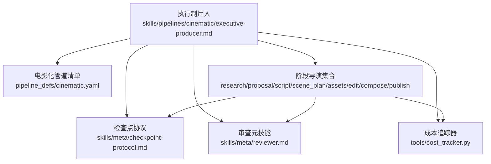
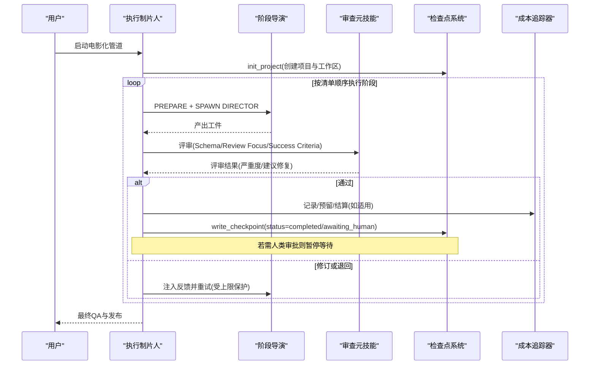
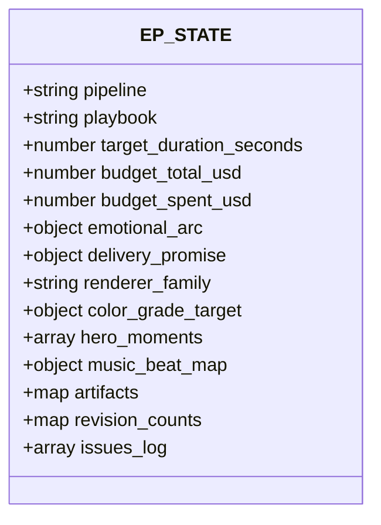
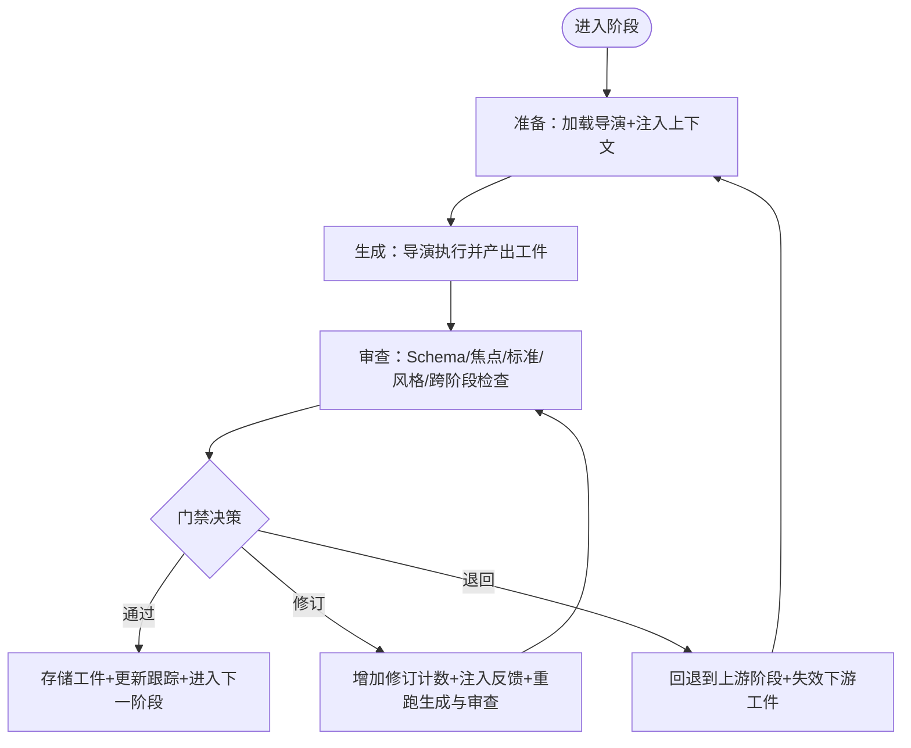
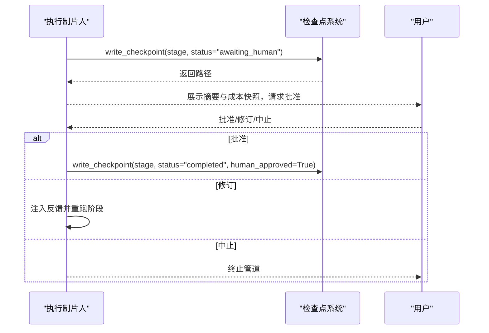
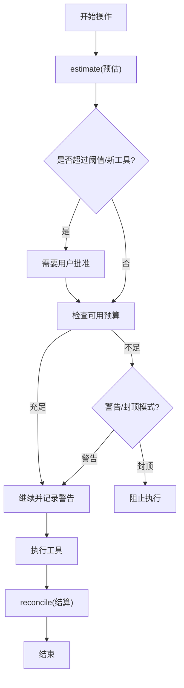
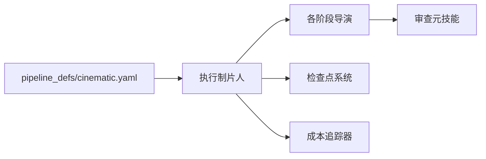

# 执行制片人

<cite>
**本文引用的文件**
- [skills/pipelines/cinematic/executive-producer.md](file://skills/pipelines/cinematic/executive-producer.md)
- [pipeline_defs/cinematic.yaml](file://pipeline_defs/cinematic.yaml)
- [lib/checkpoint.py](file://lib/checkpoint.py)
- [tools/cost_tracker.py](file://tools/cost_tracker.py)
- [skills/meta/reviewer.md](file://skills/meta/reviewer.md)
- [skills/meta/checkpoint-protocol.md](file://skills/meta/checkpoint-protocol.md)
- [skills/pipelines/cinematic/edit-director.md](file://skills/pipelines/cinematic/edit-director.md)
- [tests/tools/test_cost_tracker_governance.py](file://tests/tools/test_cost_tracker_governance.py)
</cite>

## 目录
1. [简介](#简介)
2. [项目结构](#项目结构)
3. [核心组件](#核心组件)
4. [架构总览](#架构总览)
5. [详细组件分析](#详细组件分析)
6. [依赖关系分析](#依赖关系分析)
7. [性能与成本考量](#性能与成本考量)
8. [故障排查指南](#故障排查指南)
9. [结论](#结论)
10. [附录](#附录)

## 简介
本文件面向OpenMontage电影化管道中的“执行制片人（Executive Producer，简称EP）”角色。EP是整条管道的总指挥：负责项目初始化、阶段编排、质量门禁控制、预算管理以及用户决策流程管理；同时维护贯穿全链路的累积状态（EP_STATE），包括情感弧线、交付承诺、渲染器家族锁定、色彩分级目标等电影化特有属性。本文基于仓库中电影化管道定义、执行协议、检查点协议、审查元技能与成本追踪实现，给出可操作的流程说明、图示与最佳实践。

## 项目结构
电影化管道以声明式清单驱动，EP通过清单加载各阶段、所需技能、工具与评审关注点，并串行推进每个阶段。关键位置如下：
- 管道清单：定义阶段顺序、人类审批门、评审焦点与成功标准
- 执行制片人技能：定义EP的累计状态、跨阶段检查、质量门禁与限制
- 检查点协议：定义阶段完成后的保存、恢复、人类审批门与历史归档
- 审查元技能：定义统一的评审流程与严重度判定
- 成本追踪：定义预算预估、预留、实际结算与超支策略

**图表来源**
- [pipeline_defs/cinematic.yaml:24-50](file://pipeline_defs/cinematic.yaml#L24-L50)
- [skills/pipelines/cinematic/executive-producer.md:18-54](file://skills/pipelines/cinematic/executive-producer.md#L18-L54)
- [skills/meta/checkpoint-protocol.md:11-108](file://skills/meta/checkpoint-protocol.md#L11-L108)
- [skills/meta/reviewer.md:23-46](file://skills/meta/reviewer.md#L23-L46)
- [tools/cost_tracker.py:40-171](file://tools/cost_tracker.py#L40-L171)

**章节来源**
- [pipeline_defs/cinematic.yaml:24-50](file://pipeline_defs/cinematic.yaml#L24-L50)
- [skills/pipelines/cinematic/executive-producer.md:18-54](file://skills/pipelines/cinematic/executive-producer.md#L18-L54)

## 核心组件
- 执行制片人（EP）
  - 职责：初始化项目、串行编排阶段、在每个阶段执行准备→生成导演→审查→门禁决策；维护EP_STATE；对用户透明地呈现决策依据与变更。
  - 电影化特有属性：情感弧线、交付承诺、渲染器家族锁定、色彩分级目标、英雄时刻、音乐节拍映射。
- 管道清单（cinematic.yaml）
  - 职责：声明阶段顺序、必需/可选技能、工具集、人类审批门、评审焦点与成功标准。
- 检查点协议
  - 职责：阶段完成写入检查点、支持中断恢复、强制人类审批门、归档历史版本、合并决策日志。
- 审查元技能
  - 职责：统一评审流程、严重度判定、建议修复、幻灯片风险评分、决策日志审计。
- 成本追踪器
  - 职责：预估→预留→结算的全链路预算治理，支持警告/封顶模式、单动作审批阈值、新付费工具审批。

**章节来源**
- [skills/pipelines/cinematic/executive-producer.md:18-54](file://skills/pipelines/cinematic/executive-producer.md#L18-L54)
- [pipeline_defs/cinematic.yaml:60-288](file://pipeline_defs/cinematic.yaml#L60-L288)
- [skills/meta/checkpoint-protocol.md:11-108](file://skills/meta/checkpoint-protocol.md#L11-L108)
- [skills/meta/reviewer.md:23-46](file://skills/meta/reviewer.md#L23-L46)
- [tools/cost_tracker.py:40-171](file://tools/cost_tracker.py#L40-L171)

## 架构总览
EP作为状态机控制器，串联各阶段导演，并在每个阶段后执行严格的质量门禁。检查点系统保证可恢复性与人类审批；成本追踪确保预算可控；审查元技能提供一致的评审标准。

**图表来源**
- [pipeline_defs/cinematic.yaml:60-288](file://pipeline_defs/cinematic.yaml#L60-L288)
- [skills/meta/checkpoint-protocol.md:11-108](file://skills/meta/checkpoint-protocol.md#L11-L108)
- [skills/meta/reviewer.md:23-46](file://skills/meta/reviewer.md#L23-L46)
- [tools/cost_tracker.py:101-171](file://tools/cost_tracker.py#L101-L171)

## 详细组件分析

### 执行制片人的累计状态（EP_STATE）
EP在整条管道中维护一个累积状态对象，包含通用字段与电影化特有字段：
- 通用字段：管道类型、选定的风格剧本、目标时长、预算总额与已花费、各阶段工件、修订计数、问题日志
- 电影化特有字段：情感弧线、交付承诺、渲染器家族锁定、色彩分级目标、英雄时刻、音乐节拍映射

这些字段在提案阶段被明确并锁定，后续阶段必须遵守，避免“静默降级”。

**图表来源**
- [skills/pipelines/cinematic/executive-producer.md:18-48](file://skills/pipelines/cinematic/executive-producer.md#L18-L48)

**章节来源**
- [skills/pipelines/cinematic/executive-producer.md:18-48](file://skills/pipelines/cinematic/executive-producer.md#L18-L48)

### 执行协议：准备→生成→审查→门禁
每个阶段的执行遵循统一协议：
- 准备：加载对应导演技能，注入EP_STATE上下文与上一轮修订反馈
- 生成：导演执行其完整流程，产出工件
- 审查：使用审查元技能进行Schema校验、评审焦点与成功标准核对、风格约束交叉检查、执行EP特定跨阶段检查
- 门禁决策：通过则进入下一阶段；修订则带反馈重试（每阶段最多3次）；退回则回退到上游阶段（每对阶段最多1次退回）

**图表来源**
- [skills/pipelines/cinematic/executive-producer.md:50-76](file://skills/pipelines/cinematic/executive-producer.md#L50-L76)
- [skills/meta/reviewer.md:23-46](file://skills/meta/reviewer.md#L23-L46)

**章节来源**
- [skills/pipelines/cinematic/executive-producer.md:50-76](file://skills/pipelines/cinematic/executive-producer.md#L50-L76)
- [skills/meta/reviewer.md:23-46](file://skills/meta/reviewer.md#L23-L46)

### 质量门禁与跨阶段检查（电影化）
EP在各阶段完成后执行针对性检查，确保情绪节奏、视觉一致性与音频动态达标：
- 研究阶段：视觉参考具体相关、声音/音乐方向实质、至少3种不同情感弧线、运动承诺诚实
- 提案阶段：情感弧线明确、源模式清晰、交付承诺完整、渲染器家族锁定、音乐计划解决、成本估算逐项透明、用户批准
- 脚本阶段：节拍递进清晰、对白/字幕克制、着陆节拍独立、时长匹配电影化语速
- 场景规划：英雄时刻明确、优先使用源素材、转场支持情绪、色彩/画幅一致
- 资产阶段：音乐节拍与脚本节拍对齐、生成插入有限且合理、运动要求未降级为静态、预算告警（90%阈值）
- 剪辑阶段：强镜头不被过度裁剪、音频提示强化节拍、标题卡时机克制、时间线完整无空隙
- 合成阶段：输出探测（时长/分辨率/编码）、色彩分级一致、音频动态受控、帧处理不破坏输出、运动承诺未被静默降级
- 发布阶段：元数据与海报帧概念一致、导出包完整

**图表来源**
- [skills/pipelines/cinematic/executive-producer.md:78-172](file://skills/pipelines/cinematic/executive-producer.md#L78-L172)

**章节来源**
- [skills/pipelines/cinematic/executive-producer.md:78-172](file://skills/pipelines/cinematic/executive-producer.md#L78-L172)

### 检查点与人类审批门
- 每个阶段完成后写入检查点，支持中断恢复与历史归档
- 若清单标记需要人类审批，则写入“等待人类”状态并结束本轮，等待用户批准后再继续
- 前置阶段未完成或未获批时，禁止推进到下一阶段
- 决策日志合并到项目级文件，便于审计

**图表来源**
- [skills/meta/checkpoint-protocol.md:11-108](file://skills/meta/checkpoint-protocol.md#L11-L108)
- [lib/checkpoint.py:422-564](file://lib/checkpoint.py#L422-L564)

**章节来源**
- [skills/meta/checkpoint-protocol.md:11-108](file://skills/meta/checkpoint-protocol.md#L11-L108)
- [lib/checkpoint.py:422-564](file://lib/checkpoint.py#L422-L564)

### 预算管理：预估→预留→结算
- 每次付费操作前进行预估，随后预留预算
- 单动作超过阈值或首次使用付费工具需用户批准
- 超出可用预算时在警告模式下记录警告，在封顶模式下直接阻止
- 执行完成后进行结算，释放预留并记录实际花费

**图表来源**
- [tools/cost_tracker.py:101-171](file://tools/cost_tracker.py#L101-L171)
- [tests/tools/test_cost_tracker_governance.py:15-59](file://tests/tools/test_cost_tracker_governance.py#L15-L59)

**章节来源**
- [tools/cost_tracker.py:101-171](file://tools/cost_tracker.py#L101-L171)
- [tests/tools/test_cost_tracker_governance.py:15-59](file://tests/tools/test_cost_tracker_governance.py#L15-L59)

### 用户决策流程管理
- 在执行任何昂贵或关键步骤前，向用户透明展示所选工具、提供商、模型/变体、选择理由与运行性质（样本或批量）
- 若批准路径受阻，立即停止并呈现：尝试路径、具体失败、可能的问题类别、可用选项与推荐选项
- 一旦用户表达偏好或批准计划，不得在未获批准的情况下切换提供商、模型或媒介

**章节来源**
- [skills/pipelines/cinematic/executive-producer.md:56-76](file://skills/pipelines/cinematic/executive-producer.md#L56-L76)

### 常见陷阱与最佳实践
- 过度调色：色彩分级应增强情绪而非使画面失真
- 滥用生成插入：应以源素材为主，生成内容仅填补空白
- 忽视音频动态：电影化视频成败在于音频，音乐/对白平衡至关重要
- 压缩高潮：高潮时刻需要呼吸空间，不要因节奏过快而削弱
- 静默降级：当技术限制导致无法实现运动主导的承诺时，应立即上报用户，不得悄悄切换媒介
- 决策不可见：必须在执行前与变更时明确告知用户选择了何种提供商/模型及原因

**章节来源**
- [skills/pipelines/cinematic/executive-producer.md:184-192](file://skills/pipelines/cinematic/executive-producer.md#L184-L192)

## 依赖关系分析
- EP依赖管道清单获取阶段顺序、工具与评审规则
- 各阶段导演依赖审查元技能进行一致性评审
- 检查点系统依赖清单与项目标记文件进行门限与恢复控制
- 成本追踪器与EP协同，确保预算治理贯穿全流程

**图表来源**
- [pipeline_defs/cinematic.yaml:24-50](file://pipeline_defs/cinematic.yaml#L24-L50)
- [skills/meta/reviewer.md:23-46](file://skills/meta/reviewer.md#L23-L46)
- [lib/checkpoint.py:422-564](file://lib/checkpoint.py#L422-L564)
- [tools/cost_tracker.py:40-171](file://tools/cost_tracker.py#L40-L171)

**章节来源**
- [pipeline_defs/cinematic.yaml:24-50](file://pipeline_defs/cinematic.yaml#L24-L50)
- [skills/meta/reviewer.md:23-46](file://skills/meta/reviewer.md#L23-L46)
- [lib/checkpoint.py:422-564](file://lib/checkpoint.py#L422-L564)
- [tools/cost_tracker.py:40-171](file://tools/cost_tracker.py#L40-L171)

## 性能与成本考量
- 阶段内部分进度检查点：长耗时阶段（如资产、合成）应频繁写入“进行中”检查点，支持断点续跑
- 预算预警：接近阈值时提前告警，避免后期阻塞
- 渲染器与运行时选择：保持与提案一致，避免静默切换导致质量下降
- 资源复用：在动画/图形类场景中尽量复用样式锚点与模板，减少重复生成

[本节为通用指导，无需引用具体文件]

## 故障排查指南
- 检查点写入失败：确认项目工作区存在、权限正常、JSON序列化成功；查看历史归档是否保留旧版本
- 人类审批门未触发：确认清单中该阶段human_approval_default为true，且write_checkpoint传入正确标志
- 预算超限：检查预估与预留逻辑、单动作阈值与新工具审批设置；在警告模式下允许继续但记录警告
- 评审不通过：根据审查元技能的严重度与建议修复逐项处理；必要时退回上游阶段修正

**章节来源**
- [lib/checkpoint.py:422-564](file://lib/checkpoint.py#L422-L564)
- [tools/cost_tracker.py:101-171](file://tools/cost_tracker.py#L101-L171)
- [skills/meta/reviewer.md:23-46](file://skills/meta/reviewer.md#L23-L46)

## 结论
执行制片人是电影化管道的中枢：通过严格的阶段编排、质量门禁与预算治理，确保从创意到成片的每一步都受控、可追溯、可恢复。配合检查点协议与审查元技能，EP能够在复杂的多阶段协作中维持电影化特有的情绪、视觉与音频一致性，并在用户参与下做出透明、负责任的决策。

[本节为总结性内容，无需引用具体文件]

## 附录
- 剪辑阶段要点：以情绪为先保护强镜头，用声音推动剪辑，利用元数据进行时序逻辑，避免过度覆盖与花哨转场
- 审核重点：确保输出满足交付承诺，尤其是运动主导型内容的完整性与一致性

**章节来源**
- [skills/pipelines/cinematic/edit-director.md:17-57](file://skills/pipelines/cinematic/edit-director.md#L17-L57)