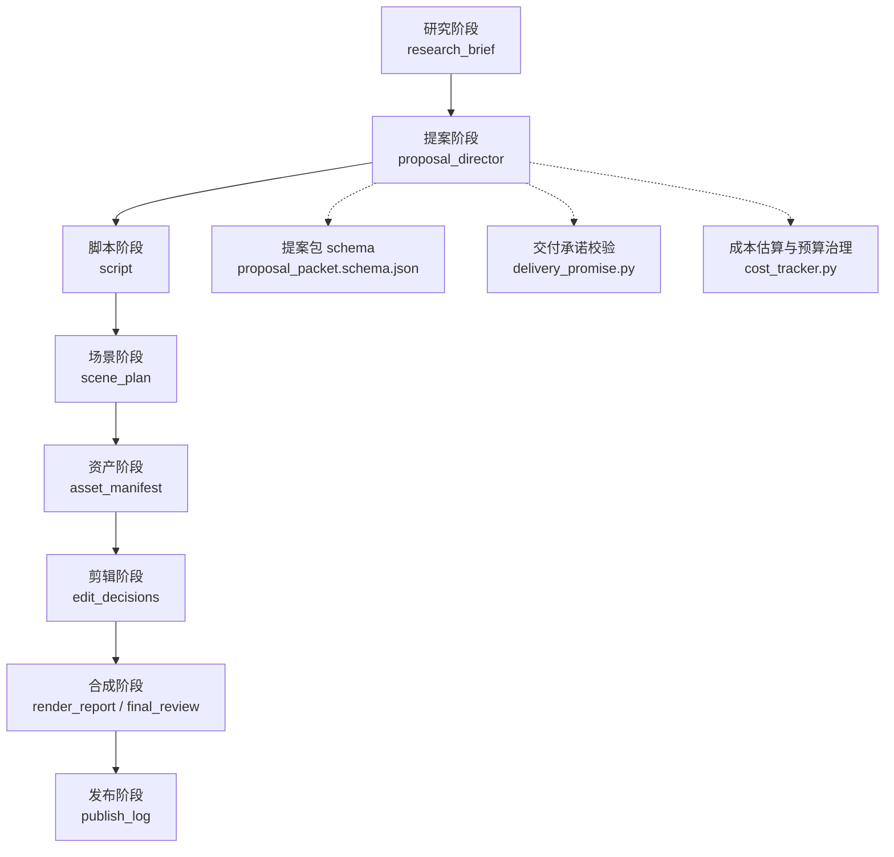
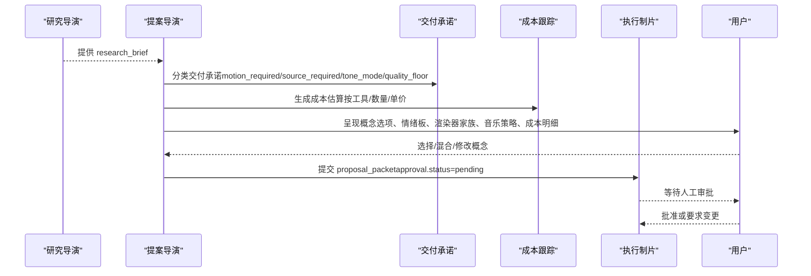
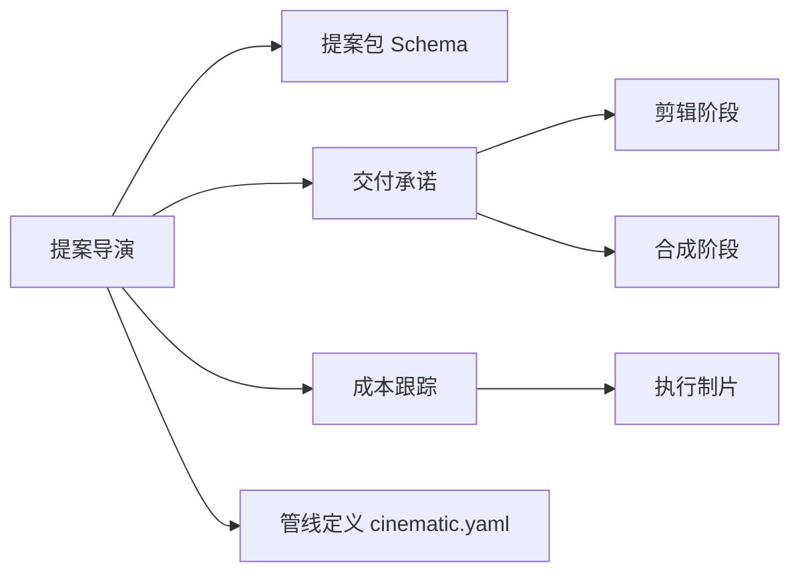

# 提案导演

<cite>
**本文引用的文件**
- [cinematic.yaml](file://pipeline_defs/cinematic.yaml)
- [proposal_packet.schema.json](file://schemas/artifacts/proposal_packet.schema.json)
- [delivery_promise.py](file://lib/delivery_promise.py)
- [cost_tracker.py](file://tools/cost_tracker.py)
- [proposal-director.md（电影化）](file://skills/pipelines/cinematic/proposal-director.md)
- [executive-producer.md（电影化）](file://skills/pipelines/cinematic/executive-producer.md)
</cite>

## 目录
1. [简介](#简介)
2. [项目结构](#项目结构)
3. [核心组件](#核心组件)
4. [架构总览](#架构总览)
5. [详细组件分析](#详细组件分析)
6. [依赖关系分析](#依赖关系分析)
7. [性能与可行性考量](#性能与可行性考量)
8. [故障排查指南](#故障排查指南)
9. [结论](#结论)
10. [附录：提案文档结构与审批流程](#附录提案文档结构与审批流程)

## 简介
本文件面向OpenMontage电影化管道中的“提案导演”角色，系统化阐述其如何将研究结果转化为可执行、可审批的制作方案。提案导演是用户批准前的关键闸门：在没有任何资金消耗之前，明确交付承诺、设计情感弧线（build → reveal → landing）、选择渲染器家族与技术运行时、规划音乐策略、完成成本估算并验证可行性（源模式、运动需求、预算合理性）。

## 项目结构
电影化管道的提案阶段由编排层定义，并由提案导演技能驱动，产出标准化的提案包（proposal_packet），并通过严格的审批门控进入后续脚本、场景、资产、剪辑、合成与发布阶段。

图表来源
- [cinematic.yaml:60-114](file://pipeline_defs/cinematic.yaml#L60-L114)
- [proposal_packet.schema.json:1-379](file://schemas/artifacts/proposal_packet.schema.json#L1-L379)
- [delivery_promise.py:1-248](file://lib/delivery_promise.py#L1-L248)
- [cost_tracker.py:1-524](file://tools/cost_tracker.py#L1-L524)

章节来源
- [cinematic.yaml:60-114](file://pipeline_defs/cinematic.yaml#L60-L114)

## 核心组件
- 提案包（proposal_packet）：承载概念选项、选定概念、制作计划、成本估算与审批状态的结构化产物，用于跨阶段传递决策与约束。
- 交付承诺（DeliveryPromise）：对“视频质量是否依赖真实运动/素材/数据可视化等”进行类型化分类，并在剪辑与合成阶段强制执行最低运动比例与回退策略。
- 成本跟踪（CostTracker）：提供基于参考分析的预估、预算预留、超支拦截、实际花费对账与审计日志。
- 提案导演技能（电影化）：规定从研究到提案的完整步骤，包括情绪板、概念方向、渲染器家族选择、音乐策略、生产计划、成本估算与审批提交。

章节来源
- [proposal_packet.schema.json:1-379](file://schemas/artifacts/proposal_packet.schema.json#L1-L379)
- [delivery_promise.py:1-248](file://lib/delivery_promise.py#L1-L248)
- [cost_tracker.py:1-524](file://tools/cost_tracker.py#L1-L524)
- [proposal-director.md（电影化）:1-310](file://skills/pipelines/cinematic/proposal-director.md#L1-L310)

## 架构总览
提案导演处于研究阶段之后、脚本阶段之前，承担“创意与工程之间的翻译”职责：将研究提供的视觉参考、情绪方向与能力边界，转化为可执行的方案与明确的预算承诺。

图表来源
- [proposal-director.md（电影化）:52-273](file://skills/pipelines/cinematic/proposal-director.md#L52-L273)
- [delivery_promise.py:82-193](file://lib/delivery_promise.py#L82-L193)
- [cost_tracker.py:183-398](file://tools/cost_tracker.py#L183-L398)
- [cinematic.yaml:79-114](file://pipeline_defs/cinematic.yaml#L79-L114)

## 详细组件分析

### 提案包（proposal_packet）
- 作用：统一表达概念选项、选定概念、制作计划、成本估算与审批状态；下游各阶段据此执行。
- 关键字段：
  - concept_options：至少3个不同情感/视觉方向的概念，包含标题、钩子、叙事结构、视觉手法、目标时长、受众、平台、关键信息、核心信息、CTA、调性、依据研究与为何有效等。
  - selected_concept：选定概念ID、理由及用户要求的修改项。
  - production_plan：流水线名称、风格剧本、分阶段工具与路径、质量权衡、替代路径、交付承诺、渲染器家族、技术运行时、组合模式、艺术指导、口味画像、音乐来源、配音选择、决策日志引用、供应商排名等。
  - cost_estimate：总估、分项明细、预算上限、预算判定、节省选项。
  - approval：状态（待审/已批/带改通过/拒绝）、用户备注、已批准预算。
- 约束：schema强制必填字段，确保提案完整性与可审计性。

章节来源
- [proposal_packet.schema.json:1-379](file://schemas/artifacts/proposal_packet.schema.json#L1-L379)

### 交付承诺（DeliveryPromise）
- 作用：在提案阶段锁定“视频质量是否依赖真实运动/素材/数据可视化”，并在剪辑与合成阶段强制执行规则，防止无声降级。
- 类型与规则：
  - motion_led：禁止静帧回退，要求真实运动片段占比不低于阈值（默认≥70%）。
  - source_led：以用户素材为主，允许静帧回退，最低运动比例较低。
  - data_explainer/teacher_explainer/screen_demo/avatar_presenter/hybrid/localization：各自有最小运动比例与回退策略。
- 校验逻辑：统计真实运动（video/animation/avatar）与动画幻灯片（Remotion组件）和静帧的比例，若低于阈值或违反回退规则则标记违规。
- 建议：提案导演需根据研究简报与能力检查，显式设置 promise_type、motion_required、source_required、tone_mode、quality_floor 与 approved_fallback。

章节来源
- [delivery_promise.py:18-79](file://lib/delivery_promise.py#L18-L79)
- [delivery_promise.py:82-193](file://lib/delivery_promise.py#L82-L193)
- [delivery_promise.py:196-248](file://lib/delivery_promise.py#L196-L248)

### 成本估算与预算治理（CostTracker）
- 作用：为每项付费操作提供预评估、预算预留、超支拦截与实际花费对账，输出审计日志。
- 关键能力：
  - estimate/reserve/reconcile/refund：记录估计、预留、结算、退款。
  - 单动作审批阈值与新付费工具审批：超过阈值或首次使用付费工具需用户批准。
  - 参考驱动估算：基于参考视频的节拍密度、场景数、旁白字数、运动比例，推算图像/视频/TTS/音乐等用量与成本区间。
  - 重试缓冲：为生成类任务增加约30%重试缓冲，避免低估失败率。
- 提案导演使用方式：结合工具清单与目标时长，逐项列出工具、操作、数量、单价与总计，给出预算判定与节省选项。

章节来源
- [cost_tracker.py:22-179](file://tools/cost_tracker.py#L22-L179)
- [cost_tracker.py:183-398](file://tools/cost_tracker.py#L183-L398)
- [cost_tracker.py:400-483](file://tools/cost_tracker.py#L400-L483)

### 提案导演工作流（电影化）
- 前置条件：读取 research_brief、管线清单、工具可用性、成本跟踪、风格剧本与用户输入。
- 步骤概览：
  - 检查参考视频上下文：若有 VideoAnalysisBrief，遵循“不复制”原则，每个概念保留至少一个参考元素并改变至少一个元素，解释情感差异。
  - 吸收研究：提取研究摘要、角度、视觉参考、音频方向、素材现实与运动承诺。
  - 预检能力：确认视频/图像/TTS/音乐/增强工具与渲染引擎可用性；若 motion_required=true 却无可用运动能力，必须如实告知而非静默降级。
  - 情绪板先行：展示3-5张参考图、调色方向、调性参考与1-2个音乐情绪参考，尽早对齐感觉。
  - 设计概念方向：至少3个不同情感/视觉方向，明确标题与钩子、情感弧线（tension→reveal/wonder→scale/intimacy→payoff/urgency→resolution/mystery→CTA/stillness→eruption）、交付承诺、视觉处理与渲染器家族。
  - 渐进揭示与多样性检查：逐步呈现研究摘要、情绪板、概念方向、邀请混合、最终生产计划；确保概念间情感弧与视觉处理不重复，至少一个概念有风险尝试。
  - 音乐策略：优先用户曲库，其次免版税搜索，再次AI生成，最后自带；明确推荐与成本。
  - 制作计划：颜色分级、音频增强、视频生成（如需要）、音乐必须明确；工具优先级与权衡透明。
  - 成本估算：逐项列明工具、操作、数量、单价、总计；给出预算判定与节省选项。
  - 呈现与审批：用户可选择原样、混合、修改或重定向；设置 approval.status="pending"，未获批准不得继续。
  - 提交：按 schema 校验 proposal_packet 并提交。

章节来源
- [proposal-director.md（电影化）:40-310](file://skills/pipelines/cinematic/proposal-director.md#L40-L310)

### 渲染器家族与技术运行时选择
- 渲染器家族（creative grammar）：cinematic-trailer、documentary-montage、presenter、explainer-data 等，锁定于提案阶段，合成阶段不可擅自更改。
- 技术运行时（technical engine）：remotion、hyperframes、ffmpeg，需在提案阶段显式选择并记录决策日志；若两者均可用，必须同时呈现并等待用户批准。
- 选择建议：
  - 视频主导的预告片/品牌片：倾向 Remotion（CinematicRenderer、OffthreadVideo、现有过渡栈）。
  - HTML/GSAP驱动的标题序列或品牌片：倾向 HyperFrames（动能标题、注册表着色器过渡）。
  - 仅拼接源素材且无需复杂合成：ffmpeg。
- 运动承诺：若 delivery_promise.motion_required=true，所选运行时即承诺；运行时不可用时须升级而非静默替换。

章节来源
- [proposal-director.md（电影化）:9-38](file://skills/pipelines/cinematic/proposal-director.md#L9-L38)
- [proposal_packet.schema.json:148-167](file://schemas/artifacts/proposal_packet.schema.json#L148-L167)

### 情感弧线（build → reveal → landing）
- 提案导演需为每个概念明确情感弧线，例如 tension→reveal、wonder→scale、intimacy→payoff、urgency→resolution、mystery→CTA、stillness→eruption。
- 执行制片在提案后检查：情感弧线是否明确、节奏是否清晰、高潮/揭示时刻是否突出。

章节来源
- [proposal-director.md（电影化）:140-152](file://skills/pipelines/cinematic/proposal-director.md#L140-L152)
- [executive-producer.md（电影化）:89-100](file://skills/pipelines/cinematic/executive-producer.md#L89-L100)

### 源模式选择与运动需求声明
- 源模式：source_led（以用户素材为主）、motion_led（以真实运动为核心）、hybrid（混合）。
- 运动需求：若 motion_required=true，必须在提案中明确，并确保具备可用的视频生成或源素材；否则不得静默降级为静帧+Ken Burns。
- 3D世界路径：当 threejs_world 与 HyperFrames 可用时，可作为真实运动路径（本地$0生成成本、HyperFrames运行时、atelier模式），需在提案中记录。

章节来源
- [proposal-director.md（电影化）:30-38](file://skills/pipelines/cinematic/proposal-director.md#L30-L38)
- [delivery_promise.py:31-79](file://lib/delivery_promise.py#L31-L79)

### 成本估算与预算合理性验证
- 逐项估算：图像生成、视频生成、TTS、音乐、后期增强等；考虑重试缓冲与置信度。
- 预算判定：within_budget/near_limit/over_budget/no_budget_set；提供节省选项。
- 预算治理：单动作审批阈值、新付费工具审批、CAP/WARN/OBSERVE模式；超支时暂停或警告。

章节来源
- [cost_tracker.py:183-398](file://tools/cost_tracker.py#L183-L398)
- [cost_tracker.py:117-179](file://tools/cost_tracker.py#L117-L179)

### 提案质量检查与常见问题
- 质量检查要点：
  - 源模式与情感弧线清晰；运动需求明确；交付承诺诚实。
  - 渲染器家族已选择并锁定；音乐策略已解决。
  - 成本估算逐项透明；预算判定合理。
- 常见问题与对策：
  - 误把黑边当作电影感：需包含镜头语言、灯光、运动与情感弧线。
  - 隐藏运动降级：若实际为静帧+Ken Burns，必须明示。
  - 音乐作为事后补充：电影化作品音乐占情绪一半，需提前确定。
  - 三个“暗黑情绪”的同质概念：需保证情感弧与视觉处理差异化。
  - 忽视素材现实：若无素材且生成受限，提案必须反映限制。

章节来源
- [proposal-director.md（电影化）:275-282](file://skills/pipelines/cinematic/proposal-director.md#L275-L282)

## 依赖关系分析
提案导演依赖多个子系统与契约：
- 管线定义（cinematic.yaml）：规定阶段顺序、所需技能、产出物与审查重点。
- 提案包Schema（proposal_packet.schema.json）：强制结构化提案内容，保障下游一致性。
- 交付承诺（delivery_promise.py）：在剪辑与合成阶段校验运动比例与回退策略。
- 成本跟踪（cost_tracker.py）：提供估算、预留、对账与审计。
- 提案导演技能（proposal-director.md）：指导具体步骤与最佳实践。

图表来源
- [cinematic.yaml:60-114](file://pipeline_defs/cinematic.yaml#L60-L114)
- [proposal_packet.schema.json:1-379](file://schemas/artifacts/proposal_packet.schema.json#L1-L379)
- [delivery_promise.py:1-248](file://lib/delivery_promise.py#L1-L248)
- [cost_tracker.py:1-524](file://tools/cost_tracker.py#L1-L524)

章节来源
- [cinematic.yaml:60-114](file://pipeline_defs/cinematic.yaml#L60-L114)
- [proposal_packet.schema.json:1-379](file://schemas/artifacts/proposal_packet.schema.json#L1-L379)
- [delivery_promise.py:1-248](file://lib/delivery_promise.py#L1-L248)
- [cost_tracker.py:1-524](file://tools/cost_tracker.py#L1-L524)

## 性能与可行性考量
- 运动覆盖率：基于参考视频的节拍密度与目标时长，估算所需视频片段数量与时长覆盖，避免低估生成成本。
- 重试缓冲：为生成类任务增加约30%缓冲，降低失败率对预算的影响。
- 运行时选择：根据创意语法与能力矩阵选择 remotion/hyperframes/ffmpeg，避免运行时不可用导致的降级风险。
- 3D世界路径：当可用时，作为低成本、可编辑的真实运动路径，记录工具、成本与运行时。

章节来源
- [cost_tracker.py:259-331](file://tools/cost_tracker.py#L259-L331)
- [proposal-director.md（电影化）:30-38](file://skills/pipelines/cinematic/proposal-director.md#L30-L38)

## 故障排查指南
- 交付承诺违规：
  - 现象：剪辑阶段的 motion_ratio 低于阈值或静帧回退被禁止。
  - 处理：回溯提案阶段的 delivery_promise 与所选运行时，必要时调整概念或补充运动内容。
- 运行时不可用：
  - 现象：所选运行时在合成阶段不可用。
  - 处理：不得静默替换；应升级问题并重新协商运行时与方案。
- 预算超支：
  - 现象：单次操作或累计花费超出可用预算。
  - 处理：触发审批或暂停；调整工具/数量/重试缓冲；提供节省选项。
- 音乐缺失：
  - 现象：成片出现意外静音。
  - 处理：在提案阶段明确音乐来源与成本；若AI生成不可用，切换至免版税或自带曲目。

章节来源
- [delivery_promise.py:113-193](file://lib/delivery_promise.py#L113-L193)
- [cost_tracker.py:117-179](file://tools/cost_tracker.py#L117-L179)
- [proposal-director.md（电影化）:226-259](file://skills/pipelines/cinematic/proposal-director.md#L226-L259)

## 结论
提案导演是电影化管道的关键闸门，负责将研究洞察转化为可执行、可审批的方案。通过明确的交付承诺、情感弧线设计、渲染器家族与技术运行时选择、音乐策略与成本估算，确保方案既具创意又具备工程可行性。严格的质量检查与预算治理，能有效避免常见陷阱与资源浪费，保障后续阶段顺利推进。

## 附录：提案文档结构与审批流程
- 提案文档结构：
  - 概念选项（至少3个）：标题、钩子、叙事结构、视觉手法、目标时长、受众、平台、关键信息、核心信息、CTA、调性、依据研究与为何有效。
  - 选定概念：ID、理由、用户修改项。
  - 制作计划：流水线、风格剧本、分阶段工具与路径、质量权衡、替代路径、交付承诺、渲染器家族、技术运行时、组合模式、艺术指导、口味画像、音乐来源、配音选择、决策日志引用、供应商排名。
  - 成本估算：总估、分项明细、预算上限、预算判定、节省选项。
  - 审批：状态（待审/已批/带改通过/拒绝）、用户备注、已批准预算。
- 审批流程：
  - 提案导演完成提案后，设置 approval.status="pending"。
  - 执行制片在提案阶段后进行质量检查（情感弧线、源模式、运动需求、交付承诺、渲染器家族、音乐策略、成本估算、用户批准）。
  - 用户批准后，方可进入脚本阶段；未获批准不得继续。

章节来源
- [proposal_packet.schema.json:1-379](file://schemas/artifacts/proposal_packet.schema.json#L1-L379)
- [executive-producer.md（电影化）:89-100](file://skills/pipelines/cinematic/executive-producer.md#L89-L100)
- [proposal-director.md（电影化）:261-273](file://skills/pipelines/cinematic/proposal-director.md#L261-L273)