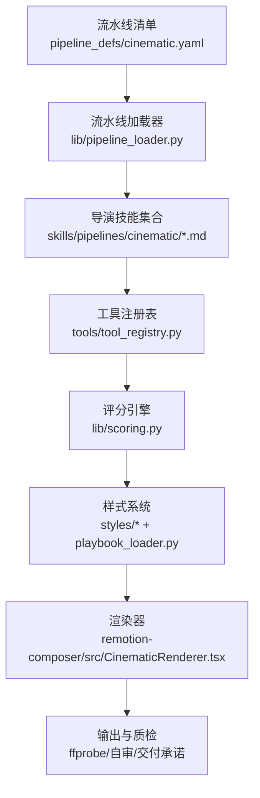
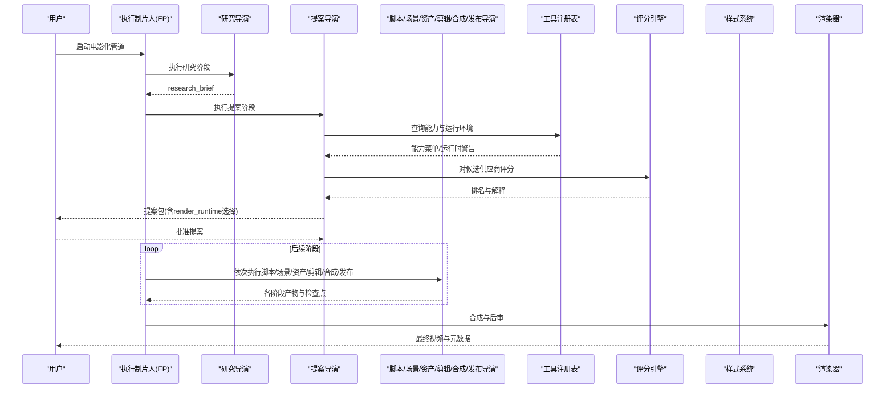
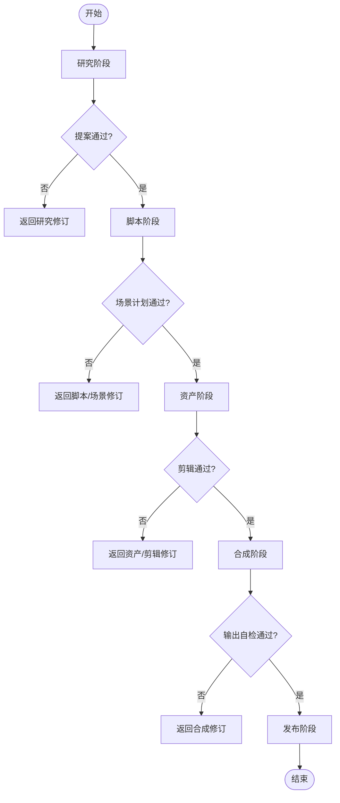
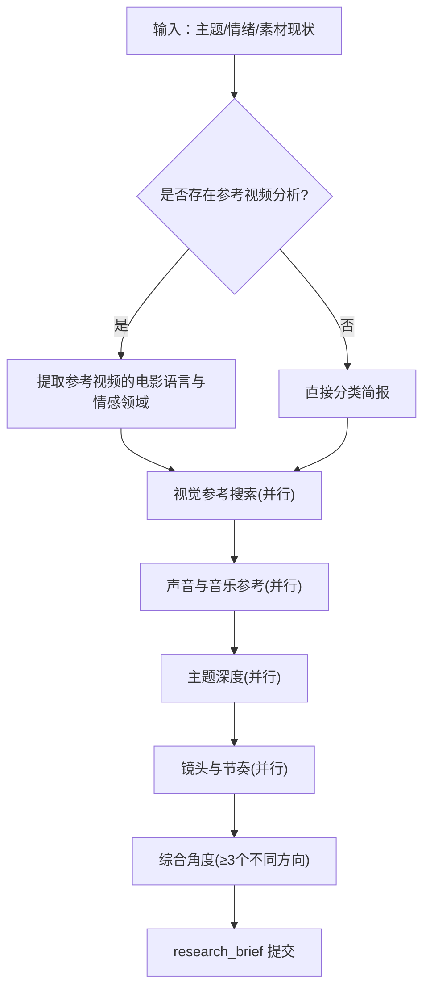
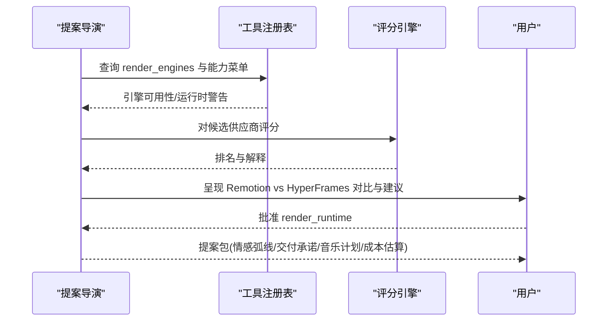
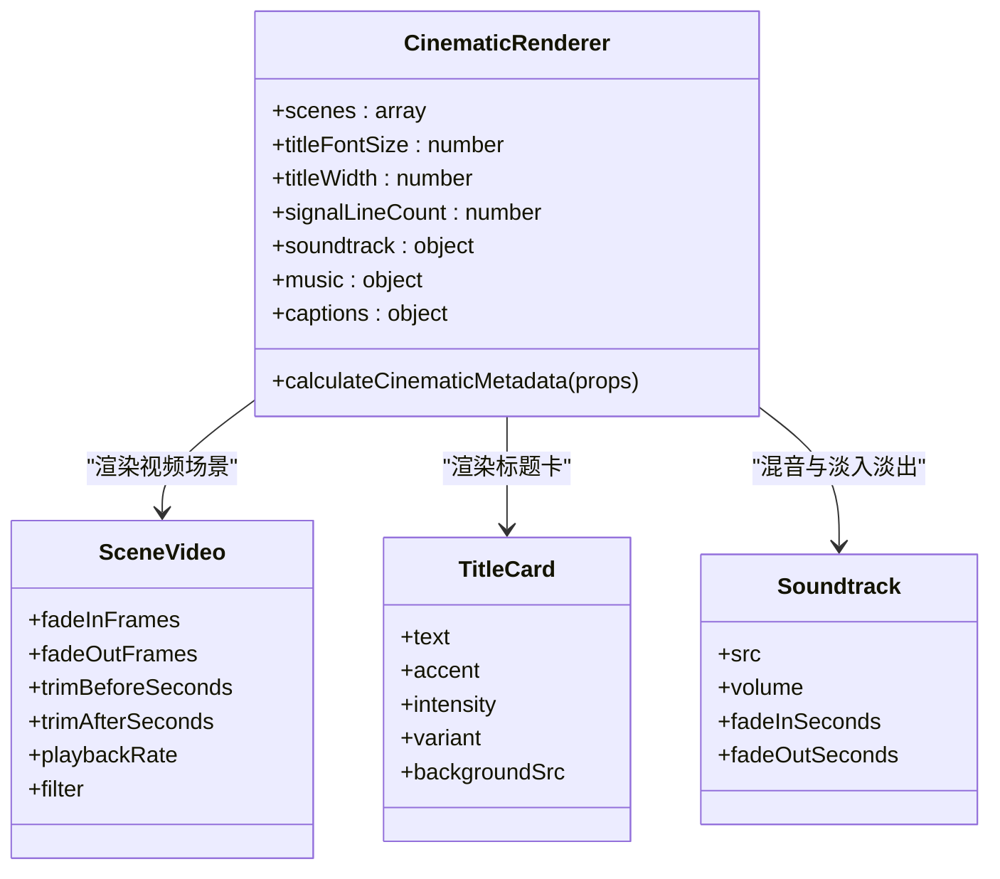

# 电影化管道

<cite>
**本文引用的文件**
- [README.md](file://README.md)
- [cinematic.yaml](file://pipeline_defs/cinematic.yaml)
- [pipeline_loader.py](file://lib/pipeline_loader.py)
- [config_model.py](file://lib/config_model.py)
- [pipeline_manifest.schema.json](file://schemas/pipelines/pipeline_manifest.schema.json)
- [scoring.py](file://lib/scoring.py)
- [tool_registry.py](file://tools/tool_registry.py)
- [playbook_loader.py](file://styles/playbook_loader.py)
- [clean-professional.yaml](file://styles/clean-professional.yaml)
- [CinematicRenderer.tsx](file://remotion-composer/src/CinematicRenderer.tsx)
- [executive-producer.md](file://skills/pipelines/cinematic/executive-producer.md)
- [research-director.md](file://skills/pipelines/cinematic/research-director.md)
- [proposal-director.md](file://skills/pipelines/cinematic/proposal-director.md)
</cite>

## 目录
1. [简介](#简介)
2. [项目结构](#项目结构)
3. [核心组件](#核心组件)
4. [架构总览](#架构总览)
5. [详细组件分析](#详细组件分析)
6. [依赖关系分析](#依赖关系分析)
7. [性能考量](#性能考量)
8. [故障排查指南](#故障排查指南)
9. [结论](#结论)
10. [附录](#附录)

## 简介
本技术文档面向“OpenMontage 电影化管道”，系统化阐述从研究导演、提案导演、执行制片人、脚本导演、场景导演、资产导演、合成导演到编辑导演与发布导演的完整工作链。重点覆盖深度研究分析、专业提案设计、复杂场景编排、高质量素材管理、电影级合成效果与专业化后期制作，并说明如何通过质量门禁、评分选型、风格系统与渲染引擎组合实现好莱坞级别的制作标准与质量控制。同时给出电影化风格配置、色彩分级与音效设计的最佳实践建议。

## 项目结构
OpenMontage 的电影化管道由“声明式流水线清单 + 指令型技能 + 工具注册与评分 + 样式/播放列表 + 渲染器”构成：
- 流水线清单定义阶段、产物、工具与策略（YAML）
- 导演技能以 Markdown 形式指导 AI 代理在每个阶段如何执行
- 工具注册表提供能力发现、状态与菜单汇总
- 评分引擎对供应商进行多维度打分与排序
- 样式系统提供调色板、排版、动效与可访问性校验
- 渲染器（Remotion/HyperFrames/FFmpeg）负责最终合成与输出

图表来源
- [cinematic.yaml:1-288](file://pipeline_defs/cinematic.yaml#L1-L288)
- [pipeline_loader.py:1-241](file://lib/pipeline_loader.py#L1-L241)
- [tool_registry.py:1-493](file://tools/tool_registry.py#L1-L493)
- [scoring.py:1-557](file://lib/scoring.py#L1-L557)
- [playbook_loader.py:1-800](file://styles/playbook_loader.py#L1-L800)
- [CinematicRenderer.tsx:1-530](file://remotion-composer/src/CinematicRenderer.tsx#L1-L530)

章节来源
- [README.md:356-475](file://README.md#L356-L475)
- [cinematic.yaml:1-288](file://pipeline_defs/cinematic.yaml#L1-L288)

## 核心组件
- 流水线清单与加载器：定义电影化管道的阶段顺序、产物、工具可用性与人类审批门；支持参考视频输入、子阶段条件激活、扩展能力开关。
- 导演技能：为每个阶段提供明确的执行协议、检查点、评审焦点与成功标准，确保创意决策可审计、可回滚。
- 工具注册表：自动发现工具、报告可用性、生成能力菜单与运行时警告，支撑前置能力盘点与供应商选择。
- 评分引擎：基于任务契合度、输出质量、可控性、可靠性、成本效率、延迟与连续性等维度加权评分，解释选择理由。
- 样式系统：加载与验证风格播放列表，提供配色、排版、动效与可访问性校验，保障视觉一致性与无障碍。
- 渲染器：Remotion CinematicRenderer 提供电影化转场、标题卡、信号纹理、字幕叠加与音频淡入淡出；配合 FFmpeg/HyperFrames 完成最终合成。

章节来源
- [pipeline_loader.py:1-241](file://lib/pipeline_loader.py#L1-L241)
- [executive-producer.md:1-192](file://skills/pipelines/cinematic/executive-producer.md#L1-L192)
- [tool_registry.py:1-493](file://tools/tool_registry.py#L1-L493)
- [scoring.py:1-557](file://lib/scoring.py#L1-L557)
- [playbook_loader.py:1-800](file://styles/playbook_loader.py#L1-L800)
- [CinematicRenderer.tsx:1-530](file://remotion-composer/src/CinematicRenderer.tsx#L1-L530)

## 架构总览
电影化管道采用“声明式清单 + 指令型技能 + 工具评分 + 样式治理 + 多引擎渲染”的分层架构。执行流程遵循研究→提案→脚本→场景计划→资产→剪辑→合成→发布的串行阶段，每阶段均有检查点与人类审批门，确保创意与技术决策透明、可追溯。

图表来源
- [cinematic.yaml:60-288](file://pipeline_defs/cinematic.yaml#L60-L288)
- [executive-producer.md:50-173](file://skills/pipelines/cinematic/executive-producer.md#L50-L173)
- [tool_registry.py:249-471](file://tools/tool_registry.py#L249-L471)
- [scoring.py:373-542](file://lib/scoring.py#L373-L542)
- [CinematicRenderer.tsx:441-529](file://remotion-composer/src/CinematicRenderer.tsx#L441-L529)

## 详细组件分析

### 执行制片人（EP）与质量门禁
- 职责：串行编排所有阶段，维护累计状态（情感弧线、交付承诺、渲染器家族、色彩目标、英雄时刻、音乐节拍映射），在关键节点设置质量门禁与预算控制。
- 门禁要点：研究落地性、提案交付承诺、脚本节拍升级、场景英雄时刻与一致性、资产音乐对齐与预算、剪辑情绪节奏、合成输出验证（分辨率/编码/色彩/音频动态）、发布元数据与海报帧。
- 限制：每阶段最大修订次数、总发送退回次数、总预算与总耗时上限。

图表来源
- [executive-producer.md:78-173](file://skills/pipelines/cinematic/executive-producer.md#L78-L173)
- [cinematic.yaml:60-288](file://pipeline_defs/cinematic.yaml#L60-L288)

章节来源
- [executive-producer.md:1-192](file://skills/pipelines/cinematic/executive-producer.md#L1-L192)
- [cinematic.yaml:60-288](file://pipeline_defs/cinematic.yaml#L60-L288)

### 研究导演（深度研究分析）
- 目标：围绕主题、情绪、声音设计与运动语言进行深度研究，产出结构化 research_brief，为提案提供真实参考与差异化方向。
- 方法：并行搜索视觉参考、声音景观、主题深度、镜头语言、受众与分发语境；若存在参考视频，则提取其电影语言与情感领域，提出差异化概念种子。
- 约束：最少/最多搜索次数、时间上限、零付费工具。

图表来源
- [research-director.md:21-190](file://skills/pipelines/cinematic/research-director.md#L21-L190)

章节来源
- [research-director.md:1-207](file://skills/pipelines/cinematic/research-director.md#L1-L207)

### 提案导演（专业提案设计）
- 目标：将研究转化为可审阅的提案包，明确情感弧线、交付承诺、渲染器家族与渲染引擎（Remotion/HyperFrames/FFmpeg），并在任何资金消耗前获得用户批准。
- 关键规则：必须呈现两种渲染引擎选项并记录决策；若 motion_required=true，禁止静默降级为静态演示；若 3D 世界承诺，需评估 threejs_world 与 HyperFrames 的组合路径。
- 音乐计划：优先用户曲库、免版税搜索、AI 生成或自带曲目，必须在提案中明确。

图表来源
- [proposal-director.md:9-38](file://skills/pipelines/cinematic/proposal-director.md#L9-L38)
- [tool_registry.py:356-471](file://tools/tool_registry.py#L356-L471)
- [scoring.py:373-542](file://lib/scoring.py#L373-L542)

章节来源
- [proposal-director.md:1-310](file://skills/pipelines/cinematic/proposal-director.md#L1-L310)

### 脚本导演、场景导演、资产导演、编辑导演、合成导演、发布导演
- 脚本导演：确保节拍图清晰升级、对白/标题卡克制、揭示与着陆节拍明确。
- 场景导演：定义英雄帧与揭示时刻、保持源素材优先、过渡与画幅选择服务于情绪。
- 资产导演：分离源选择与支持资产、确保运动节拍使用真实视频片段、音乐与环境声匹配节拍、限定生成插入内容、3D 世界需连贯场景图与生产保真层级。
- 编辑导演：保护情绪节奏、避免过度裁剪、强化音频提示与标题时机。
- 合成导演：严格校验输出情绪、保留运动承诺、控制音频动态、确保 letterbox/画幅处理提升观感、禁止静默切换渲染引擎。
- 发布导演：明确主导出与衍生导出、元数据匹配发行意图、海报帧/缩略图概念一致。

章节来源
- [cinematic.yaml:115-288](file://pipeline_defs/cinematic.yaml#L115-L288)

### 渲染器与电影级合成效果（Remotion CinematicRenderer）
- 功能：OffthreadVideo 场景、渐入渐出、缩放、滤镜、色调渐变、信号纹理、标题卡逐词揭示、TikTok 风格逐字字幕、音轨淡入淡出与混音。
- 参数：FPS、时长计算、场景序列、字幕页大小与高亮色、背景裁剪与播放速率。
- 适用：视频主导的预告片/品牌片/蒙太奇；与样式系统结合实现统一视觉语言。

图表来源
- [CinematicRenderer.tsx:40-115](file://remotion-composer/src/CinematicRenderer.tsx#L40-L115)
- [CinematicRenderer.tsx:162-386](file://remotion-composer/src/CinematicRenderer.tsx#L162-L386)
- [CinematicRenderer.tsx:388-439](file://remotion-composer/src/CinematicRenderer.tsx#L388-L439)
- [CinematicRenderer.tsx:441-529](file://remotion-composer/src/CinematicRenderer.tsx#L441-L529)

章节来源
- [CinematicRenderer.tsx:1-530](file://remotion-composer/src/CinematicRenderer.tsx#L1-L530)

## 依赖关系分析
- 流水线清单依赖导演技能与工具集；加载器提供只读缓存与阶段顺序解析。
- 工具注册表依赖 .env 环境变量加载与模块扫描，提供能力菜单与运行时警告。
- 评分引擎依赖工具信息与任务上下文，输出可解释的排名。
- 样式系统依赖 YAML 播放列表与 JSON Schema 校验，提供配色/排版/可访问性分析。
- 渲染器依赖视频/音频资源与样式参数，输出符合交付承诺的最终媒体。

图表来源
- [cinematic.yaml:1-288](file://pipeline_defs/cinematic.yaml#L1-L288)
- [pipeline_loader.py:1-241](file://lib/pipeline_loader.py#L1-L241)
- [tool_registry.py:1-493](file://tools/tool_registry.py#L1-L493)
- [scoring.py:1-557](file://lib/scoring.py#L1-L557)
- [playbook_loader.py:1-800](file://styles/playbook_loader.py#L1-L800)
- [CinematicRenderer.tsx:1-530](file://remotion-composer/src/CinematicRenderer.tsx#L1-L530)

章节来源
- [pipeline_loader.py:1-241](file://lib/pipeline_loader.py#L1-L241)
- [tool_registry.py:1-493](file://tools/tool_registry.py#L1-L493)
- [scoring.py:1-557](file://lib/scoring.py#L1-L557)
- [playbook_loader.py:1-800](file://styles/playbook_loader.py#L1-L800)

## 性能考量
- 预取与缓存：流水线清单加载使用 LRU 缓存，减少重复解析与校验开销。
- 并行搜索：研究阶段的多批搜索并行执行，缩短前期准备时间。
- 供应商评分：基于历史成功率、稳定性与测量延迟进行可靠性与延迟评分，避免低效调用。
- 渲染优化：Remotion 使用 OffthreadVideo 与 spring 动画，合理设置淡入淡出与裁剪可减少重绘与解码压力。
- 预算与配额：全局配置支持观察/警告/封顶模式，单动作审批阈值与总预算上限防止超支。

章节来源
- [pipeline_loader.py:27-46](file://lib/pipeline_loader.py#L27-L46)
- [research-director.md:192-207](file://skills/pipelines/cinematic/research-director.md#L192-L207)
- [scoring.py:400-446](file://lib/scoring.py#L400-L446)
- [config_model.py:16-40](file://lib/config_model.py#L16-L40)

## 故障排查指南
- 能力缺失：使用工具注册表的 provider_menu_summary 查看能力配置情况与运行时警告，按提示补齐环境变量或安装依赖。
- 渲染失败：检查 Remotion/HyperFrames 是否可用，确认 render_runtime 与 proposal_packet 一致；若失败，不得静默降级。
- 质量不达标：利用样式系统的 WCAG 对比度与色盲安全校验，修正配色与排版；使用颜色分级与音频增强工具提升观感与听感。
- 预算超限：调整供应商选择或降低生成规模；启用预算封顶模式并设置单动作审批阈值。
- 参考视频分析：确保 VideoAnalysisBrief 正确读取并用于差异化概念设计，避免照搬参考。

章节来源
- [tool_registry.py:316-471](file://tools/tool_registry.py#L316-L471)
- [playbook_loader.py:210-396](file://styles/playbook_loader.py#L210-L396)
- [proposal-director.md:9-38](file://skills/pipelines/cinematic/proposal-director.md#L9-L38)
- [executive-producer.md:150-173](file://skills/pipelines/cinematic/executive-producer.md#L150-L173)

## 结论
OpenMontage 电影化管道通过声明式清单、指令型技能、工具评分、样式治理与多引擎渲染，构建了端到端的高品质视频生产体系。它以研究驱动创意、以提案锁定方向、以质量门禁保障一致性、以评分与注册表实现供应商最优选择、以样式与渲染器达成电影级视听体验。借助严格的预算控制与可审计决策日志，该管道可在成本可控的前提下稳定输出接近好莱坞标准的作品。

## 附录

### 电影化风格配置与色彩分级最佳实践
- 使用样式播放列表定义配色、排版、动效与质量规则；确保文本与背景的对比度满足 WCAG AA/AAA，并进行色盲安全校验。
- 在提案阶段确定色彩基调与光照方案，在合成阶段应用颜色分级与滤镜，保持情绪一致且不显人工痕迹。
- 推荐在 cinematic 管线中使用 Remotion 的 CinematicRenderer 进行色调渐变、信号纹理与标题卡揭示，配合 FFmpeg 进行最终编码与字幕烧录。

章节来源
- [clean-professional.yaml:1-105](file://styles/clean-professional.yaml#L1-L105)
- [playbook_loader.py:210-396](file://styles/playbook_loader.py#L210-L396)
- [CinematicRenderer.tsx:26-115](file://remotion-composer/src/CinematicRenderer.tsx#L26-L115)

### 音效设计与音频混合最佳实践
- 在提案阶段明确音乐来源与情绪，优先用户曲库或免版税搜索，必要时使用 AI 生成；确保音乐与节拍映射一致。
- 合成阶段使用音轨淡入淡出与音量曲线，保证对白清晰度与音乐平衡；必要时进行音频增强与降噪。
- 使用 Remotion 的 Soundtrack 组件与 FFmpeg 音频混流，控制整体响度与动态范围。

章节来源
- [proposal-director.md:226-245](file://skills/pipelines/cinematic/proposal-director.md#L226-L245)
- [CinematicRenderer.tsx:388-439](file://remotion-composer/src/CinematicRenderer.tsx#L388-L439)
- [README.md:558-579](file://README.md#L558-L579)

### 配置与运行时要点
- 全局配置支持 LLM、预算、检查点策略、输出格式与路径；建议根据团队需求调整预算模式与审批阈值。
- 检查点策略可选择 guided/manual_all/auto_noncreative，平衡自动化与人工干预。
- 输出默认使用 mp4/libx264/aac，分辨率与帧率可按平台定制。

章节来源
- [config_model.py:16-93](file://lib/config_model.py#L16-L93)
- [config.yaml:1-34](file://config.yaml#L1-L34)