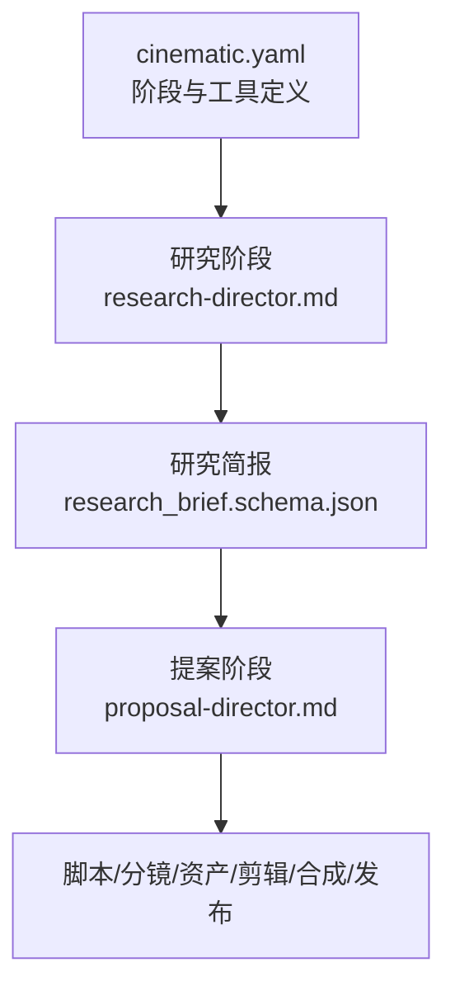
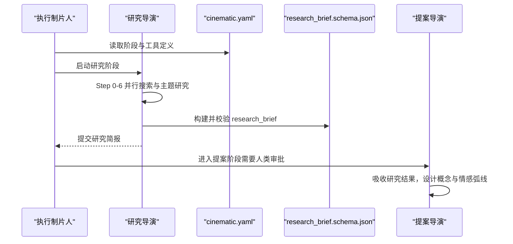
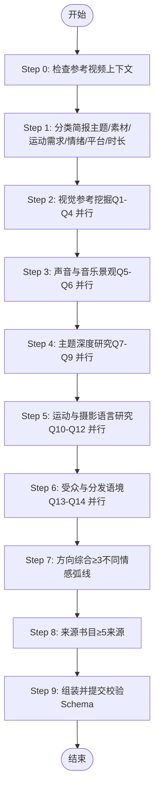
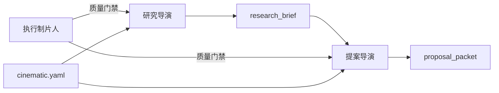

# 研究导演

<cite>
**本文引用的文件**
- [research-director.md](file://skills/pipelines/cinematic/research-director.md)
- [proposal-director.md](file://skills/pipelines/cinematic/proposal-director.md)
- [cinematic.yaml](file://pipeline_defs/cinematic.yaml)
- [research_brief.schema.json](file://schemas/artifacts/research_brief.schema.json)
- [executive-producer.md](file://skills/pipelines/cinematic/executive-producer.md)
- [README.md](file://README.md)
</cite>

## 目录
1. [简介](#简介)
2. [项目结构](#项目结构)
3. [核心组件](#核心组件)
4. [架构总览](#架构总览)
5. [详细组件分析](#详细组件分析)
6. [依赖关系分析](#依赖关系分析)
7. [性能与执行约束](#性能与执行约束)
8. [故障排查指南](#故障排查指南)
9. [结论](#结论)
10. [附录：检查清单与质量门禁](#附录：检查清单与质量门禁)

## 简介
本技术文档聚焦于OpenMontage电影化管道中的“研究导演”角色。研究导演在电影制作前期承担深度视觉与音频研究分析，负责为后续提案、脚本、分镜、资产与合成阶段提供高质量、可验证的创意基础。其核心职责包括：
- 视觉参考搜索与分析：定位真实电影/品牌片/短片等先例，提取构图、色彩、运动、质感等有效元素。
- 声音/音乐方向探索：明确音乐情绪、音效设计策略（氛围、纹理、打击乐、留白等），并判断对白/旁白是否必要。
- 情感基调确定：基于受众与平台语境，定义情感弧线（如紧张→揭示、惊奇→宏大、亲密→回报等）。
- 运动能力评估：诚实评估可用素材与生成能力，明确是否需要运动以及实现路径。

研究导演需识别至少3种不同的电影化方向，每种方向具备不同的情感弧线，并提供具体、相关、可追溯的研究产物，供提案导演转化为可审批的概念方案。

**章节来源**
- [research-director.md:1-18](file://skills/pipelines/cinematic/research-director.md#L1-L18)
- [research-director.md:55-65](file://skills/pipelines/cinematic/research-director.md#L55-L65)
- [research-director.md:66-110](file://skills/pipelines/cinematic/research-director.md#L66-L110)
- [research-director.md:128-155](file://skills/pipelines/cinematic/research-director.md#L128-L155)
- [research-director.md:157-181](file://skills/pipelines/cinematic/research-director.md#L157-L181)

## 项目结构
电影化管道通过配置文件声明阶段、技能、工具与质量门禁；研究阶段由“研究导演”技能驱动，产出结构化研究简报，作为提案阶段的输入。

**图表来源**
- [cinematic.yaml:60-78](file://pipeline_defs/cinematic.yaml#L60-L78)
- [research_director.md:183-190](file://skills/pipelines/cinematic/research-director.md#L183-L190)
- [proposal_director.md:80-107](file://skills/pipelines/cinematic/proposal-director.md#L80-L107)

**章节来源**
- [cinematic.yaml:1-11](file://pipeline_defs/cinematic.yaml#L1-L11)
- [cinematic.yaml:60-78](file://pipeline_defs/cinematic.yaml#L60-L78)

## 核心组件
- 研究导演技能：规定研究流程、搜索批次、方向综合、输出结构与质量要求。
- 研究简报Schema：强制结构化字段，确保视觉参考、数据点、受众洞察、角度候选与来源的可验证性。
- 电影化管道配置：将研究阶段纳入编排，定义评审焦点与成功标准。
- 提案导演技能：承接研究结果，构建概念选项、情感弧线、交付承诺与渲染引擎选择。
- 执行制片人跨阶段检查：对研究阶段进行质量门禁，确保视觉参考具体、声音方向实质、方向多样性达标。

**章节来源**
- [research_director.md:19-190](file://skills/pipelines/cinematic/research-director.md#L19-L190)
- [research_brief.schema.json:1-246](file://schemas/artifacts/research_brief.schema.json#L1-L246)
- [cinematic.yaml:60-78](file://pipeline_defs/cinematic.yaml#L60-L78)
- [proposal_director.md:80-116](file://skills/pipelines/cinematic/proposal-director.md#L80-L116)
- [executive-producer.md:78-86](file://skills/pipelines/cinematic/executive-producer.md#L78-L86)

## 架构总览
研究导演在电影化管道中的位置与交互如下：

**图表来源**
- [cinematic.yaml:60-78](file://pipeline_defs/cinematic.yaml#L60-L78)
- [research_director.md:19-190](file://skills/pipelines/cinematic/research-director.md#L19-L190)
- [proposal_director.md:80-116](file://skills/pipelines/cinematic/proposal-director.md#L80-L116)

## 详细组件分析

### 研究导演工作流
研究导演遵循九步流程，从参考视频上下文检查到最终提交，强调并行搜索、方向多样性和能力诚实评估。

**图表来源**
- [research_director.md:21-190](file://skills/pipelines/cinematic/research-director.md#L21-L190)

**章节来源**
- [research_director.md:21-190](file://skills/pipelines/cinematic/research-director.md#L21-L190)

### 视觉参考搜索与分析
- 目标：找到与情绪和主题匹配的真实电影先例，记录标题、URL、视觉有效性（构图、色彩、运动、质感）、情感有效性（节奏、揭示结构、张力弧线）以及与简报的相关性。
- 搜索批次：针对YouTube、专业教程/幕后、调色参考、奖项/电影节作品进行并行检索。
- 质量标准：每个参考必须包含具体URL与描述，避免泛化词汇；与用户简报强相关。

**章节来源**
- [research_director.md:66-90](file://skills/pipelines/cinematic/research-director.md#L66-L90)

### 声音与音乐方向探索
- 目标：理解该情绪的音频调色板，明确音乐情绪（能量与纹理）、音效设计方法（氛围、极简、工业、有机等），以及对白/旁白或纯音乐的倾向。
- 搜索批次：围绕“情绪+主题”的配乐与音效设计进行并行检索。
- 质量标准：不记录具体曲目，而是记录能量与纹理；明确是否以音乐驱动或对白驱动。

**章节来源**
- [research_director.md:92-110](file://skills/pipelines/cinematic/research-director.md#L92-L110)

### 情感基调与情感弧线
- 目标：基于受众与平台语境，定义清晰的情感弧线（例如紧张→揭示、惊奇→宏大、亲密→回报、紧迫→解决、神秘→行动、静默→爆发）。
- 方向多样性：至少一种方向使用不同情感弧线；至少一种强调纹理/亲密而非奇观；各方向基于不同视觉参考。
- 与提案联动：提案导演将研究结果转化为具体概念选项，并为每个概念明确情感弧线。

**章节来源**
- [research_director.md:157-177](file://skills/pipelines/cinematic/research-director.md#L157-L177)
- [proposal_director.md:140-167](file://skills/pipelines/cinematic/proposal-director.md#L140-L167)

### 运动能力评估
- 目标：诚实评估可用素材与生成能力，明确是否需要运动以及如何实现（视频生成、源素材、3D世界等）。
- 约束：若研究简报表明需要运动，则不可无声降级为静态动画；若能力不足，应如实呈现并让用户决策。
- 与提案联动：提案阶段锁定渲染引擎与交付承诺，确保运动承诺不被违背。

**章节来源**
- [research_director.md:128-143](file://skills/pipelines/cinematic/research-director.md#L128-L143)
- [proposal_director.md:91-107](file://skills/pipelines/cinematic/proposal-director.md#L91-L107)

### 研究产物与Schema
- 研究简报包含：主题、日期、现有内容格局、趋势、数据点、受众洞察、专家声音、发现的角度、视觉参考、来源书目与研究摘要。
- 关键字段：
  - landscape.existing_content：至少3项，含标题、URL、来源、角度、覆盖范围、缺失点、参与度信号。
  - data_points：至少3项，含主张、来源URL、可信度、意外程度、用途。
  - angles_discovered：至少3项，含名称、钩子、类型、为何现在、支撑依据。
  - visual_references：描述、URL、有效性说明。
  - sources：至少5项，含URL、标题、用途、可靠性。
- 提交前必须通过Schema校验。

**章节来源**
- [research_brief.schema.json:1-246](file://schemas/artifacts/research_brief.schema.json#L1-L246)
- [research_director.md:183-190](file://skills/pipelines/cinematic/research-director.md#L183-L190)

### 与提案导演的衔接
- 提案导演吸收研究结果，提取研究摘要、角度候选、视觉参考、音频方向、素材现实与运动承诺。
- 构建至少3个真正不同的电影化方向，每个方向包含情感钩子、情感弧线、交付承诺、视觉处理、渲染家族选择。
- 提出10-15秒样片协议（参考驱动生产），在全面制作前先验证情绪匹配。

**章节来源**
- [proposal_director.md:80-116](file://skills/pipelines/cinematic/proposal-director.md#L80-L116)
- [proposal_director.md:122-188](file://skills/pipelines/cinematic/proposal-director.md#L122-L188)
- [proposal_director.md:226-259](file://skills/pipelines/cinematic/proposal-director.md#L226-L259)

## 依赖关系分析
- 研究阶段依赖web_search工具，产出research_brief。
- 提案阶段依赖研究简报，产出proposal_packet与decision_log。
- 执行制片人跨阶段检查在研究后验证视觉参考具体性、声音方向实质性、方向多样性与运动承诺诚实性。
- 管道配置定义了阶段顺序、工具可用性、检查点与人类审批。

**图表来源**
- [cinematic.yaml:60-103](file://pipeline_defs/cinematic.yaml#L60-L103)
- [executive-producer.md:78-86](file://skills/pipelines/cinematic/executive-producer.md#L78-L86)

**章节来源**
- [cinematic.yaml:60-103](file://pipeline_defs/cinematic.yaml#L60-L103)
- [executive-producer.md:78-86](file://skills/pipelines/cinematic/executive-producer.md#L78-L86)

## 性能与执行约束
- 研究时长：3-5分钟，避免边际收益递减。
- 搜索次数：最少8次，最多20次，防止无限深挖。
- 成本：仅使用网络搜索，零付费工具。
- 失败保护：每阶段最多3次修订、最多3次退回、总预算与时限限制，避免死循环。

**章节来源**
- [research_director.md:192-200](file://skills/pipelines/cinematic/research-director.md#L192-L200)
- [executive-producer.md:174-182](file://skills/pipelines/cinematic/executive-producer.md#L174-L182)

## 故障排查指南
- 常见陷阱：
  - 仅搜索“电影化”一词导致泛化结果；应使用具体情绪、纹理与主题词。
  - 忽略素材现实：若无视频生成能力，应转向静态主导方案。
  - 通用情绪词无效：需用具体技法描述（如低光钨丝灯、浅景深、受某导演启发的片头序列）。
  - 跳过音频研究：电影化作品依赖声音，缺少音效/音乐方向是不完整的。
- 质量门禁触发：
  - 视觉参考不具体或不相关。
  - 声音/音乐方向不具实质性。
  - 未识别至少3个不同情感弧线的方向。
  - 运动承诺与实际能力不符。
- 系统级自检：
  - 预合成验证：阻止违反交付承诺的渲染（如运动导向却大量静态图）。
  - 后渲染自检：ffprobe校验、黑帧检测、音频静音/削波检查、字幕存在性、交付承诺一致性。

**章节来源**
- [research_director.md:201-207](file://skills/pipelines/cinematic/research-director.md#L201-L207)
- [README.md:656-662](file://README.md#L656-L662)

## 结论
研究导演是电影化管道的关键前置环节，通过系统化、并行化的视觉与音频研究，产出结构化、可验证的研究简报，为提案导演提供多方向、多情感弧线的创意基础。配合严格的Schema校验、执行制片人的质量门禁与管道配置，确保研究产物具备具体性、相关性、实质性，并在后续阶段被稳健地转化为可审批的电影化概念与制作计划。

## 附录：检查清单与质量门禁

### 研究阶段检查清单
- 参考视频上下文：是否存在VideoAnalysisBrief？是否提取风格、结构、差异化种子？
- 简报分类：主题、素材现实、运动需求、情绪提示、平台、时长是否明确？
- 视觉参考：是否完成Q1-Q4并行搜索？每条参考是否包含URL、视觉有效性、情感有效性、相关性？
- 声音与音乐：是否完成Q5-Q6并行搜索？是否记录音乐能量/纹理、音效设计方法、对白/旁白倾向？
- 主题深度：是否完成Q7-Q9并行搜索？是否获取叙事深度、材质参考、时效性？
- 运动与摄影：是否完成Q10-Q12并行搜索？是否明确镜头运动、剪辑节奏、结构模板？
- 受众与分发：是否完成Q13-Q14并行搜索？是否了解平台表现与社区情绪？
- 方向综合：是否识别≥3不同情感弧线？是否满足多样性检查（不同情绪、纹理/亲密优先、不同镜头方式、不同参考）？
- 来源书目：是否收集≥5来源？是否标注用途与可靠性？
- Schema校验：是否通过research_brief.schema.json校验？

**章节来源**
- [research_director.md:21-190](file://skills/pipelines/cinematic/research-director.md#L21-L190)
- [research_brief.schema.json:1-246](file://schemas/artifacts/research_brief.schema.json#L1-L246)

### 质量门禁标准（研究阶段）
- 评审焦点：
  - 视觉参考具体且与情绪相关。
  - 声音与音乐方向具有实质性，非泛化描述。
  - 运动承诺诚实反映可用能力。
  - 已识别至少3个真正不同的电影化方向。
- 成功标准：
  - 产出Schema有效的research_brief。
  - 执行至少8次网页搜索。
  - 视觉参考包含具体URL与描述。

**章节来源**
- [cinematic.yaml:60-78](file://pipeline_defs/cinematic.yaml#L60-L78)
- [executive-producer.md:78-86](file://skills/pipelines/cinematic/executive-producer.md#L78-L86)