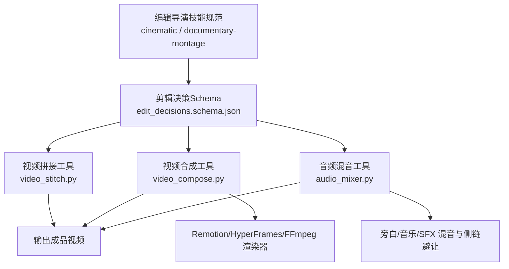
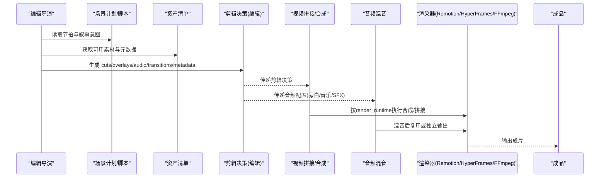
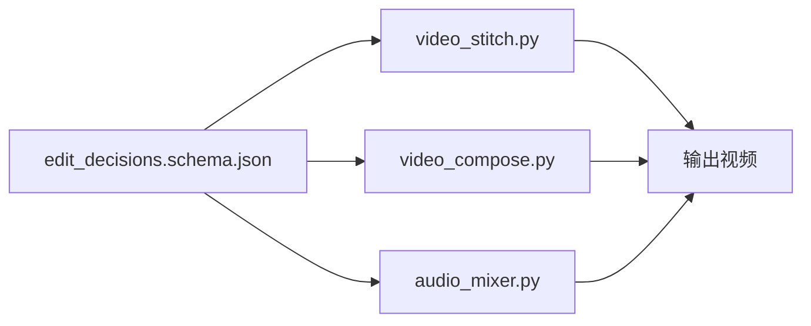

# 编辑导演

<cite>
**本文引用的文件**
- [skills/pipelines/cinematic/edit-director.md](file://skills/pipelines/cinematic/edit-director.md)
- [skills/pipelines/documentary-montage/edit-director.md](file://skills/pipelines/documentary-montage/edit-director.md)
- [schemas/artifacts/edit_decisions.schema.json](file://schemas/artifacts/edit_decisions.schema.json)
- [tools/video/video_stitch.py](file://tools/video/video_stitch.py)
- [tools/video/video_compose.py](file://tools/video/video_compose.py)
- [tools/audio/audio_mixer.py](file://tools/audio/audio_mixer.py)
- [lib/verify_scene_pacing.py](file://lib/verify_scene_pacing.py)
- [remotion-composer/src/CinematicRenderer.tsx](file://remotion-composer/src/CinematicRenderer.tsx)
- [skills/creative/cinematic.md](file://skills/creative/cinematic.md)
- [skills/creative/sound-design.md](file://skills/creative/sound-design.md)
</cite>

## 目录
1. [简介](#简介)
2. [项目结构](#项目结构)
3. [核心组件](#核心组件)
4. [架构总览](#架构总览)
5. [详细组件分析](#详细组件分析)
6. [依赖关系分析](#依赖关系分析)
7. [性能考量](#性能考量)
8. [故障排查指南](#故障排查指南)
9. [结论](#结论)
10. [附录](#附录)

## 简介
本技术文档面向OpenMontage电影化管道中的“编辑导演”角色，聚焦其在剪辑阶段的艺术与技术职责：情感节奏控制、时间线完整性保证、素材选择与剪辑、音频线索强化。文档同时给出避免过度剪辑强有力时刻的方法、通过音频线索强化故事节拍的技巧、标题卡片克制使用的策略，并提供时间线完整覆盖、无间隙剪辑、资产引用有效性验证等最佳实践，以及情感节奏评估方法与时间线质量检查标准。

## 项目结构
编辑导演在OpenMontage中由“技能规范 + 数据契约 + 工具链”共同实现：
- 技能规范定义剪辑原则、流程与质量门禁（电影化与纪录片蒙太奇两条路径）。
- 数据契约以JSON Schema约束剪辑决策（cuts、overlays、audio、transitions、metadata等）。
- 工具链负责将剪辑决策落地为可播放的媒体（拼接、转场、字幕、混音、渲染）。

图表来源
- [skills/pipelines/cinematic/edit-director.md:1-57](file://skills/pipelines/cinematic/edit-director.md#L1-L57)
- [skills/pipelines/documentary-montage/edit-director.md:41-352](file://skills/pipelines/documentary-montage/edit-director.md#L41-L352)
- [schemas/artifacts/edit_decisions.schema.json:1-238](file://schemas/artifacts/edit_decisions.schema.json#L1-L238)
- [tools/video/video_stitch.py:1-200](file://tools/video/video_stitch.py#L1-L200)
- [tools/video/video_compose.py:1-200](file://tools/video/video_compose.py#L1-L200)
- [tools/audio/audio_mixer.py:589-614](file://tools/audio/audio_mixer.py#L589-L614)

章节来源
- [skills/pipelines/cinematic/edit-director.md:1-57](file://skills/pipelines/cinematic/edit-director.md#L1-L57)
- [skills/pipelines/documentary-montage/edit-director.md:41-352](file://skills/pipelines/documentary-montage/edit-director.md#L41-L352)
- [schemas/artifacts/edit_decisions.schema.json:1-238](file://schemas/artifacts/edit_decisions.schema.json#L1-L238)

## 核心组件
- 剪辑决策数据结构：统一描述镜头（cuts）、叠加层（overlays）、音频配置（narration/music/sfx）、全局转场（transitions）、元数据（metadata）及运行时信息（render_runtime/renderer_family/composition_mode）。
- 视频拼接与合成：支持硬切、交叉淡入淡出、黑场过渡；自动规格统一；预览与空间布局能力。
- 音频混音：多轨混合、淡入淡出、侧链避让（ducking），确保旁白清晰度与音乐情绪配合。
- 标题卡渲染：Remotion组件提供标题卡动画、停留时长与退出动效，便于克制使用并服务于叙事节拍。
- 节奏校验：场景级时序对齐与溢出检测，保障旁白与视觉事件一致。

章节来源
- [schemas/artifacts/edit_decisions.schema.json:1-238](file://schemas/artifacts/edit_decisions.schema.json#L1-L238)
- [tools/video/video_stitch.py:1-200](file://tools/video/video_stitch.py#L1-L200)
- [tools/video/video_compose.py:1-200](file://tools/video/video_compose.py#L1-L200)
- [tools/audio/audio_mixer.py:589-614](file://tools/audio/audio_mixer.py#L589-L614)
- [remotion-composer/src/CinematicRenderer.tsx:162-215](file://remotion-composer/src/CinematicRenderer.tsx#L162-L215)
- [lib/verify_scene_pacing.py:1-135](file://lib/verify_scene_pacing.py#L1-L135)

## 架构总览
编辑导演工作流从“节拍图”到“有节奏的电影化时间线”，强调节奏与克制，而非堆砌特效。

图表来源
- [skills/pipelines/cinematic/edit-director.md:15-50](file://skills/pipelines/cinematic/edit-director.md#L15-L50)
- [skills/pipelines/documentary-montage/edit-director.md:59-151](file://skills/pipelines/documentary-montage/edit-director.md#L59-L151)
- [tools/video/video_compose.py:1-200](file://tools/video/video_compose.py#L1-L200)
- [tools/audio/audio_mixer.py:589-614](file://tools/audio/audio_mixer.py#L589-L614)

## 详细组件分析

### 情感节奏控制与“保护强有力时刻”
- 剪辑优先遵循情感强调、揭示时机、音乐转折与视觉对比，不以信息密度为唯一目标。
- 对承担叙事重量的“看、台词、手势”等强有力时刻要予以保护，避免被过多插入镜头淹没。
- 纪录片蒙太奇路径提供“节奏网格”（基于基调的持留时长表），英雄位给予最大持留，非英雄位取基准值，快速转场取最小值；总持留需满足目标时长±10%。

章节来源
- [skills/pipelines/cinematic/edit-director.md:17-34](file://skills/pipelines/cinematic/edit-director.md#L17-L34)
- [skills/pipelines/documentary-montage/edit-director.md:59-77](file://skills/pipelines/documentary-montage/edit-director.md#L59-L77)

### 时间线完整性与无间隙剪辑
- 每段素材应裁剪至其“节拍窗口”，优先选取最具表现力的子片段；在动作自然结束前切出，两端保留少量余量以便淡入淡出。
- 若素材不足以填满目标持留，优先降速（静态画面适用）、向下一段借时或替换候选，严禁以冻结帧收尾。
- 最终时间线必须从0到总时长连续覆盖，不得出现空隙；所有asset引用必须指向真实存在的资产ID或路径。

章节来源
- [skills/pipelines/documentary-montage/edit-director.md:98-120](file://skills/pipelines/documentary-montage/edit-director.md#L98-L120)
- [skills/pipelines/animation/executive-producer.md:312-327](file://skills/pipelines/animation/executive-producer.md#L312-L327)

### 素材选择与剪辑策略
- 按叙事节拍排列，不单纯依据分数或分辨率重排；仅在音乐下拍对齐、相邻镜头重复单调、结尾画面不够有力时允许微调，并记录原因。
- 每个cut需附带一句“reason”，无法写出理由的剪辑应重新审视。
- 限制转场词汇量（如硬切、溶解、黑场淡入淡出），避免炫技式转场破坏情绪。

章节来源
- [skills/pipelines/documentary-montage/edit-director.md:79-96](file://skills/pipelines/documentary-montage/edit-director.md#L79-L96)
- [skills/pipelines/documentary-montage/edit-director.md:153-171](file://skills/pipelines/documentary-montage/edit-director.md#L153-L171)
- [skills/pipelines/documentary-montage/edit-director.md:318-352](file://skills/pipelines/documentary-montage/edit-director.md#L318-L352)

### 音频线索强化与混音策略
- 用环境音、冲击音效、静音段落与音乐变化推动剪辑节奏；在作品情感中心安排一次约2秒的“完全静音”，让沉默成为力量。
- 音乐淡出置于最后3-5秒，使最终画面得以呼吸；长片至少设置一个silence_window。
- 混音时采用侧链避让（ducking），在旁白期间降低音乐音量，确保对白清晰；目标响度与峰值遵循专业规范。

章节来源
- [skills/pipelines/cinematic/edit-director.md:32-34](file://skills/pipelines/cinematic/edit-director.md#L32-L34)
- [skills/pipelines/documentary-montage/edit-director.md:122-151](file://skills/pipelines/documentary-montage/edit-director.md#L122-L151)
- [tools/audio/audio_mixer.py:589-614](file://tools/audio/audio_mixer.py#L589-L614)
- [skills/creative/sound-design.md:1-142](file://skills/creative/sound-design.md#L1-L142)

### 标题卡片时间的克制使用
- 标题卡片应稀疏且有意为之，不应替代剪辑清晰度；与节拍、音乐转折和视觉对比协同。
- Remotion标题卡组件提供可控的进入/退出动效与停留时长，便于精准控制呈现节奏。

章节来源
- [skills/pipelines/cinematic/edit-director.md:36-50](file://skills/pipelines/cinematic/edit-director.md#L36-L50)
- [remotion-composer/src/CinematicRenderer.tsx:162-215](file://remotion-composer/src/CinematicRenderer.tsx#L162-L215)

### 时间线质量检查标准（质量门禁）
- 总时长误差控制在±10%以内；英雄位持留最长；相邻镜头不重复主体与景别；转场类型不超过4种；存在音乐配置或明确无音乐；每一cut附reason；元数据总时长与cut时长之和一致。
- 交付承诺校验：在合成阶段验证剪辑是否违反既定承诺（如时长、内容范围等）。

章节来源
- [skills/pipelines/documentary-montage/edit-director.md:318-330](file://skills/pipelines/documentary-montage/edit-director.md#L318-L330)
- [tools/video/video_compose.py:1428-1455](file://tools/video/video_compose.py#L1428-L1455)

### 情感节奏评估方法
- 依据基调计算“持留表”，英雄位给最大持留，过渡位给最小持留；结合音乐下拍进行关键切换点定位。
- 平均镜头时长参考风格区间，避免连续相同时长造成单调；遵循“呼吸式节奏”（长-中-短-短-长-中）。

章节来源
- [skills/pipelines/documentary-montage/edit-director.md:59-77](file://skills/pipelines/documentary-montage/edit-director.md#L59-L77)
- [skills/creative/cinematic.md:55-87](file://skills/creative/cinematic.md#L55-L87)

### 时间线完整性与资产引用验证
- 拼接工具在操作前校验输入文件是否存在；当属性不一致时可选择自动规格统一或拒绝直切。
- 合成工具在渲染前解析asset_manifest，将cuts[].source映射为实际路径，并校验交付承诺与幻灯片风险。

章节来源
- [tools/video/video_stitch.py:749-774](file://tools/video/video_stitch.py#L749-L774)
- [tools/video/video_stitch.py:514-580](file://tools/video/video_stitch.py#L514-L580)
- [tools/video/video_compose.py:1-200](file://tools/video/video_compose.py#L1-L200)
- [tools/video/video_compose.py:1428-1455](file://tools/video/video_compose.py#L1428-L1455)

### 旁白与视觉对齐校验
- 使用场景级时序追踪工具，确保旁白提示与可见视觉事件在容差范围内对齐；防止最后一段长时间冻结或溢出场景边界。

章节来源
- [lib/verify_scene_pacing.py:1-135](file://lib/verify_scene_pacing.py#L1-L135)

## 依赖关系分析
编辑导演依赖三类核心契约与工具：
- 数据契约：edit_decisions.schema.json定义了剪辑决策的结构，贯穿后续拼接、合成与混音。
- 视频工具：video_stitch.py负责多片段拼接与转场；video_compose.py负责按render_runtime路由到Remotion/HyperFrames/FFmpeg进行合成与编码。
- 音频工具：audio_mixer.py实现多轨混合与侧链避让，确保旁白清晰度与音乐情绪配合。

图表来源
- [schemas/artifacts/edit_decisions.schema.json:1-238](file://schemas/artifacts/edit_decisions.schema.json#L1-L238)
- [tools/video/video_stitch.py:1-200](file://tools/video/video_stitch.py#L1-L200)
- [tools/video/video_compose.py:1-200](file://tools/video/video_compose.py#L1-L200)
- [tools/audio/audio_mixer.py:589-614](file://tools/audio/audio_mixer.py#L589-L614)

章节来源
- [schemas/artifacts/edit_decisions.schema.json:1-238](file://schemas/artifacts/edit_decisions.schema.json#L1-L238)
- [tools/video/video_stitch.py:1-200](file://tools/video/video_stitch.py#L1-L200)
- [tools/video/video_compose.py:1-200](file://tools/video/video_compose.py#L1-L200)
- [tools/audio/audio_mixer.py:589-614](file://tools/audio/audio_mixer.py#L589-L614)

## 性能考量
- 拼接前尽量保持素材规格一致，减少不必要的重编码；必要时启用auto_normalize统一格式。
- 转场类型与时长需谨慎：crossfade/fade需要音频流，缺失时需补齐静音轨道以避免失败。
- 混音时合理设置ducking参数（attack/release、阈值与衰减幅度），避免旁白期间音乐过强影响清晰度。
- 渲染时根据平台与目标选择合适profile与CRF，平衡画质与体积。

章节来源
- [tools/video/video_stitch.py:514-580](file://tools/video/video_stitch.py#L514-L580)
- [tools/audio/audio_mixer.py:589-614](file://tools/audio/audio_mixer.py#L589-L614)
- [tools/video/video_compose.py:1-200](file://tools/video/video_compose.py#L1-L200)

## 故障排查指南
- 时间线不完整或存在空隙：检查cuts序列是否覆盖0到总时长；确认每段hold时间与下一段衔接；核对元数据total_duration_seconds与cut时长之和。
- 资产引用无效：确保cuts[].source与asset_manifest中的asset_id一一对应；拼接前校验文件存在性。
- 音频不同步或旁白不清：检查narration segments与visual_start对齐；启用或调整ducking参数；测试手机扬声器回放。
- 转场失败：crossfade/fade需确保各clip具备音频流；若缺少则补齐静音轨道后再执行。
- 节奏失衡：复核基调对应的持留表与英雄位策略；避免连续相同镜头时长；检查音乐下拍对齐。

章节来源
- [skills/pipelines/documentary-montage/edit-director.md:318-352](file://skills/pipelines/documentary-montage/edit-director.md#L318-L352)
- [tools/video/video_stitch.py:749-774](file://tools/video/video_stitch.py#L749-L774)
- [tools/video/video_compose.py:1428-1455](file://tools/video/video_compose.py#L1428-L1455)
- [skills/creative/sound-design.md:104-142](file://skills/creative/sound-design.md#L104-L142)

## 结论
编辑导演在OpenMontage电影化管道中承担“情感节奏控制、时间线完整性保证、素材选择与剪辑、音频线索强化”的核心职责。通过严格的剪辑决策Schema、稳健的视频拼接与合成工具、专业的音频混音能力，以及标题卡的克制使用，可实现高质量、有节奏、有情感的成片。建议在每个阶段执行质量门禁与节奏校验，确保最终作品既符合艺术追求，又具备工程可靠性。

## 附录

### 剪辑决策数据结构要点（节选）
- cuts：id、source、in/out_seconds、speed、layer、transform、transition_in/out、backgroundColor、reason
- overlays：asset_id、start/end_seconds、position、animation、opacity
- audio：narration.segments、music.asset_id/volume/fade/ducking、sfx数组
- transitions：type、at_seconds、duration_seconds
- metadata：delivery_promise、slideshow_risk_score、total_duration_seconds等
- render_runtime/renderer_family/composition_mode：锁定于提案阶段，编辑不得擅自更改

章节来源
- [schemas/artifacts/edit_decisions.schema.json:1-238](file://schemas/artifacts/edit_decisions.schema.json#L1-L238)

### 电影化剪辑最佳实践清单
- 时间线完整覆盖：从0到总时长无缝衔接，无空隙
- 无间隙剪辑：每段hold与下一段衔接紧密，避免冻结帧
- 资产引用有效：所有source与asset_id对应真实文件
- 情感节奏优先：按情感强调与揭示时机剪辑，避免仅追求信息密度
- 保护强有力时刻：不过度覆盖英雄镜头
- 音频强化节拍：环境音、冲击、静音段落与音乐转折推动节奏
- 标题卡片克制：稀疏且有意图，不与叙事清晰度冲突
- 转场词汇受限：硬切为主，辅以溶解与黑场淡入淡出
- 质量门禁达标：时长误差±10%，英雄位持留最长，转场≤4种，每cut附reason

章节来源
- [skills/pipelines/cinematic/edit-director.md:17-50](file://skills/pipelines/cinematic/edit-director.md#L17-L50)
- [skills/pipelines/documentary-montage/edit-director.md:59-171](file://skills/pipelines/documentary-montage/edit-director.md#L59-L171)
- [skills/pipelines/documentary-montage/edit-director.md:318-352](file://skills/pipelines/documentary-montage/edit-director.md#L318-L352)