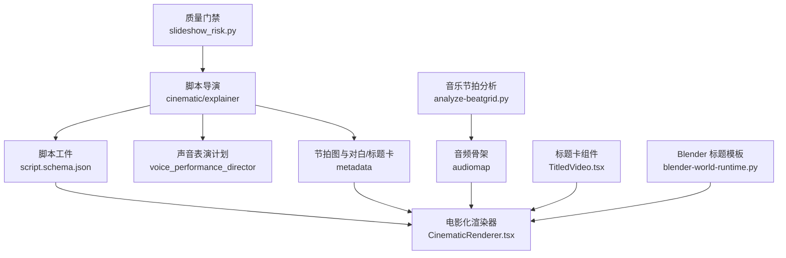
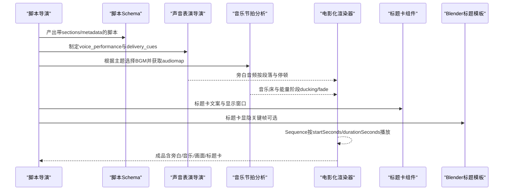
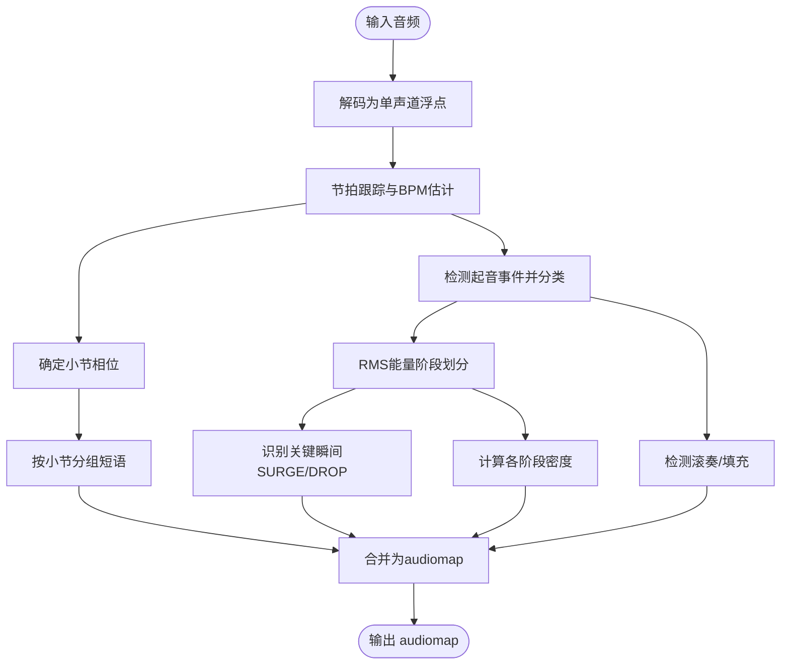
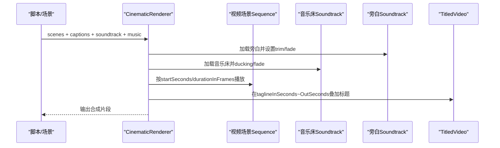
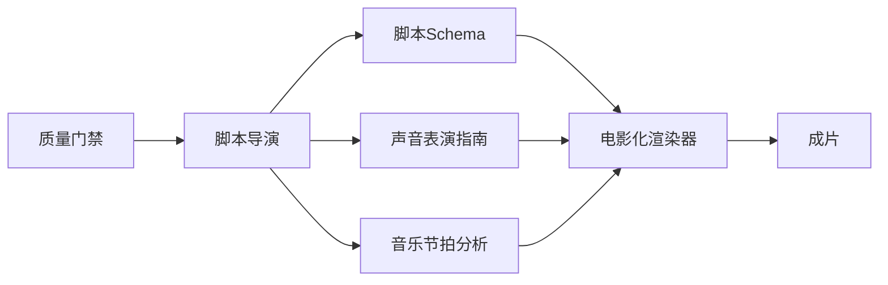

# 脚本导演

<cite>
**本文引用的文件**
- [skills/pipelines/cinematic/script-director.md](file://skills/pipelines/cinematic/script-director.md)
- [skills/pipelines/explainer/script-director.md](file://skills/pipelines/explainer/script-director.md)
- [schemas/artifacts/script.schema.json](file://schemas/artifacts/script.schema.json)
- [skills/meta/voice-performance-director.md](file://skills/meta/voice-performance-director.md)
- [skills/creative/storytelling.md](file://skills/creative/storytelling.md)
- [.agents/skills/music-to-video/scripts/analyze-beatgrid.py](file://.agents/skills/music-to-video/scripts/analyze-beatgrid.py)
- [lib/slideshow_risk.py](file://lib/slideshow_risk.py)
- [remotion-composer/src/CinematicRenderer.tsx](file://remotion-composer/src/CinematicRenderer.tsx)
- [remotion-composer/src/TitledVideo.tsx](file://remotion-composer/src/TitledVideo.tsx)
- [tools/graphics/templates/blender-world-runtime.py](file://tools/graphics/templates/blender-world-runtime.py)
</cite>

## 目录
1. [简介](#简介)
2. [项目结构](#项目结构)
3. [核心组件](#核心组件)
4. [架构总览](#架构总览)
5. [详细组件分析](#详细组件分析)
6. [依赖分析](#依赖分析)
7. [性能考虑](#性能考虑)
8. [故障排查指南](#故障排查指南)
9. [结论](#结论)
10. [附录](#附录)

## 简介
本技术文档聚焦 OpenMontage 电影化管道中的“脚本导演”角色，系统阐述其在电影级内容创作中的关键职责与实现路径。脚本导演负责：
- 编写电影级剧本与节拍图（hook、escalation、reveal、landing）
- 设计并控制叙事节奏（对白精简、标题卡片有目的使用、留白与停顿）
- 规划高潮与结尾着陆点，确保情感曲线清晰可执行
- 将节拍与音乐/视觉对齐，产出可被渲染器消费的脚本工件

同时提供最佳实践：语速控制（约 120 WPM 的沉思型节奏）、对白精简原则、标题卡片的克制使用；以及节拍图的创建方法与时长适配技巧。

## 项目结构
OpenMontage 中与脚本导演相关的知识、规范与实现分布在以下位置：
- 技能与流程说明：cinematic/explainer 脚本导演指南、叙事结构与节奏规则
- 数据契约：脚本 JSON Schema（sections、delivery_cues、metadata 等）
- 声音表演指导：voice_performance 与 delivery_cues 的落地规范
- 音乐节拍分析：beat-grid 工具生成 audiomap，为视觉编排提供时间骨架
- 渲染层：Remotion 电影化渲染器与标题卡组件，消费脚本与场景数据
- 质量门禁：slideshow_risk 对“电影化”声明的结构校验

图表来源
- [skills/pipelines/cinematic/script-director.md:1-90](file://skills/pipelines/cinematic/script-director.md#L1-L90)
- [schemas/artifacts/script.schema.json:1-105](file://schemas/artifacts/script.schema.json#L1-L105)
- [skills/meta/voice-performance-director.md:1-94](file://skills/meta/voice-performance-director.md#L1-L94)
- [.agents/skills/music-to-video/scripts/analyze-beatgrid.py:1-532](file://.agents/skills/music-to-video/scripts/analyze-beatgrid.py#L1-L532)
- [remotion-composer/src/CinematicRenderer.tsx:458-499](file://remotion-composer/src/CinematicRenderer.tsx#L458-L499)
- [remotion-composer/src/TitledVideo.tsx:82-195](file://remotion-composer/src/TitledVideo.tsx#L82-L195)
- [tools/graphics/templates/blender-world-runtime.py:349-374](file://tools/graphics/templates/blender-world-runtime.py#L349-L374)
- [lib/slideshow_risk.py:228-255](file://lib/slideshow_risk.py#L228-L255)

章节来源
- [skills/pipelines/cinematic/script-director.md:1-90](file://skills/pipelines/cinematic/script-director.md#L1-L90)
- [schemas/artifacts/script.schema.json:1-105](file://schemas/artifacts/script.schema.json#L1-L105)

## 核心组件
- 脚本导演（电影化）：构建节拍图、精选对白、标题卡文案与揭示结构，强调节奏而非信息密度
- 脚本导演（解释类）：从提案与研究简报出发，按戏剧弧线组织 Hook/Setup/Build/Climax/Landing，并给出 TTS 可执行的 delivery_cues
- 脚本工件 Schema：定义 sections、delivery_cues、enhancement_cues、metadata 等字段，约束时长、语速与增强提示
- 声音表演导演：统一 voice_performance 与 delivery_cues 的写法，保证 TTS 输出具有明确的情感曲线与停顿策略
- 音乐节拍分析：将音频解析为 BPM、节拍网格、能量阶段、事件与短语，形成 audiomap 作为视觉编排的时间骨架
- 电影化渲染器：按 scenes 序列播放视频/图像，叠加旁白音轨与音乐床，支持淡入淡出与裁剪
- 标题卡组件：在指定时间段内以编辑风格呈现标题/标语，配合渐变遮罩与动态下划线
- Blender 标题模板：通过曲线文本对象与关键帧控制标题卡的显隐与定位
- 质量门禁：检查“电影化”声明是否由镜头语言、运动与灯光支撑

章节来源
- [skills/pipelines/cinematic/script-director.md:1-90](file://skills/pipelines/cinematic/script-director.md#L1-L90)
- [skills/pipelines/explainer/script-director.md:1-269](file://skills/pipelines/explainer/script-director.md#L1-L269)
- [schemas/artifacts/script.schema.json:1-105](file://schemas/artifacts/script.schema.json#L1-L105)
- [skills/meta/voice-performance-director.md:1-94](file://skills/meta/voice-performance-director.md#L1-L94)
- [.agents/skills/music-to-video/scripts/analyze-beatgrid.py:1-532](file://.agents/skills/music-to-video/scripts/analyze-beatgrid.py#L1-L532)
- [remotion-composer/src/CinematicRenderer.tsx:458-499](file://remotion-composer/src/CinematicRenderer.tsx#L458-L499)
- [remotion-composer/src/TitledVideo.tsx:82-195](file://remotion-composer/src/TitledVideo.tsx#L82-L195)
- [tools/graphics/templates/blender-world-runtime.py:349-374](file://tools/graphics/templates/blender-world-runtime.py#L349-L374)
- [lib/slideshow_risk.py:228-255](file://lib/slideshow_risk.py#L228-L255)

## 架构总览
脚本导演处于上游创意与下游制作之间的枢纽：将叙事意图转化为结构化脚本与元数据，驱动 TTS、视觉资产与音乐编排，最终由渲染器合成成片。

图表来源
- [skills/pipelines/cinematic/script-director.md:1-90](file://skills/pipelines/cinematic/script-director.md#L1-L90)
- [schemas/artifacts/script.schema.json:1-105](file://schemas/artifacts/script.schema.json#L1-L105)
- [skills/meta/voice-performance-director.md:1-94](file://skills/meta/voice-performance-director.md#L1-L94)
- [.agents/skills/music-to-video/scripts/analyze-beatgrid.py:1-532](file://.agents/skills/music-to-video/scripts/analyze-beatgrid.py#L1-L532)
- [remotion-composer/src/CinematicRenderer.tsx:458-499](file://remotion-composer/src/CinematicRenderer.tsx#L458-L499)
- [remotion-composer/src/TitledVideo.tsx:82-195](file://remotion-composer/src/TitledVideo.tsx#L82-L195)
- [tools/graphics/templates/blender-world-runtime.py:349-374](file://tools/graphics/templates/blender-world-runtime.py#L349-L374)

## 详细组件分析

### 电影化脚本导演（节拍与节奏）
- 职责要点
  - 先构建节拍图：hook → escalation → reveal → landing（更长作品可加一个 mid-point turn）
  - 对白精简：优先挑选独立性强、情绪饱满、简洁有力的原声台词；若无可用对白，采用标题主导或旁白主导
  - 标题卡克制：短词、高对比、多留白、精准时机
  - 元数据记录：beat_map、dialogue_selects、title_card_copy、music_turns、silence_windows
  - 质量门禁：节拍升级清晰、对白与标题不重复解释、揭示明确、结尾着陆带来最终感受或行动
- 常见陷阱
  - 写成解释性长段落
  - 标题卡过多
  - 过早泄露高光时刻

章节来源
- [skills/pipelines/cinematic/script-director.md:1-90](file://skills/pipelines/cinematic/script-director.md#L1-L90)

### 解释类脚本导演（戏剧弧线与时长预算）
- 戏剧弧线：Hook(0-5s) → Setup(5-15s) → Build(15-Xs) → Climax(X-5s前) → Landing(最后5s)
- 时长与语速
  - 沉思型 ~120 WPM；对话型 ~150 WPM；活力型 ~180 WPM；技术型 ~130 WPM
  - 字数预算参考：30s≈65-75词；60s≈130-150词；90s≈195-225词；120s≈260-300词
- 交付提示（delivery_cues）
  - pace/energy/emphasis_words/pause_before_seconds/pause_after_seconds/provider_text
  - 每段至少两个具体提示，避免空泛“自然朗读”
- 增强提示（enhancement_cues）
  - overlay/diagram/stat_card/animation/code_snippet/broll，密度建议每 8-10 秒至少一个
- 事实核查与溯源
  - 所有事实主张需可追溯至 research_brief；不确定时检索验证并记录决策日志

章节来源
- [skills/pipelines/explainer/script-director.md:1-269](file://skills/pipelines/explainer/script-director.md#L1-L269)

### 声音表演导演（TTS 可执行的情感曲线）
- 顶层 voice_performance：performance_intent、pacing_profile、energy_curve、pause_policy、sample_section_id、provider_notes
- 段落级 delivery_cues：精确到 pace、energy、emphasis_words、pause、delivery_note、provider_text
- 供应商映射：OpenAI/Google/ElevenLabs 的差异与限制
- 样本门禁：首样来自最敏感段落，批准后再批量生成

章节来源
- [skills/meta/voice-performance-director.md:1-94](file://skills/meta/voice-performance-director.md#L1-L94)

### 音乐节拍分析与节拍图
- 输入音频 → BPM/节拍网格/强拍相位 → 事件分类（鼓组/特殊事件）→ 能量阶段（VOID/LOW/MEDIUM/HIGH）→ 关键瞬间（SURGE/DROP）→ 滚奏/填充 → 短语分组
- 输出 audiomap：beats_sec、downbeats_sec、energy_phases、key_moments、rolls、phrases、density 等
- 用途：为视觉编排提供客观时间骨架，指导切点、转场与标题卡时机

图表来源
- [.agents/skills/music-to-video/scripts/analyze-beatgrid.py:1-532](file://.agents/skills/music-to-video/scripts/analyze-beatgrid.py#L1-L532)

章节来源
- [.agents/skills/music-to-video/scripts/analyze-beatgrid.py:1-532](file://.agents/skills/music-to-video/scripts/analyze-beatgrid.py#L1-L532)

### 电影化渲染器与标题卡
- CinematicRenderer：分层播放（旁白音轨、音乐床、视频场景），Sequence 基于 startSeconds/durationInFrames 调度，支持淡入淡出与裁剪
- TitledVideo：在指定时间窗口内以编辑风格叠加标题/标语，包含渐变遮罩、阴影与动态下划线
- Blender 标题模板：通过曲线文本对象与关键帧控制标题卡显隐与定位

图表来源
- [remotion-composer/src/CinematicRenderer.tsx:458-499](file://remotion-composer/src/CinematicRenderer.tsx#L458-L499)
- [remotion-composer/src/TitledVideo.tsx:82-195](file://remotion-composer/src/TitledVideo.tsx#L82-L195)
- [tools/graphics/templates/blender-world-runtime.py:349-374](file://tools/graphics/templates/blender-world-runtime.py#L349-L374)

章节来源
- [remotion-composer/src/CinematicRenderer.tsx:458-499](file://remotion-composer/src/CinematicRenderer.tsx#L458-L499)
- [remotion-composer/src/TitledVideo.tsx:82-195](file://remotion-composer/src/TitledVideo.tsx#L82-L195)
- [tools/graphics/templates/blender-world-runtime.py:349-374](file://tools/graphics/templates/blender-world-runtime.py#L349-L374)

### 叙事结构与节奏最佳实践
- 钩子类型：反直觉、结果承诺、悬念、风险 stakes
- “但-因此”连接法：避免“然后”，用转折与因果推进
- 误解先行：先呈现常见误区再纠正，提升学习增益
- 引导式发现：问题→尝试→洞察→构建→推广
- 节奏规则：新视觉元素每 3-5 秒出现一次；概念密度控制在每 30-45 秒一个；关键洞察后留 1-3 秒静默；每 45-60 秒做一次调色板清洗
- 镜头意图：每个节拍附一行镜头意图，便于场景导演扩写

章节来源
- [skills/creative/storytelling.md:1-190](file://skills/creative/storytelling.md#L1-L190)

### 电影化质量门禁
- 若宣称“电影化”，需满足：英雄时刻、足够镜头运动、足够的灯光定义
- 不达标将被扣分并给出原因，促使回改

章节来源
- [lib/slideshow_risk.py:228-255](file://lib/slideshow_risk.py#L228-L255)

## 依赖分析
- 脚本导演依赖
  - 提案与研究简报（情感弧线、事实依据）
  - 声音表演指南（voice_performance 与 delivery_cues）
  - 音乐节拍分析（audiomap 提供时间骨架）
- 渲染依赖
  - Remotion Composition（CinematicRenderer/TitledVideo）
  - 可选 Blender 标题模板（用于特定标题卡效果）
- 质量门禁
  - slideshow_risk 对“电影化”声明进行结构校验

图表来源
- [skills/pipelines/cinematic/script-director.md:1-90](file://skills/pipelines/cinematic/script-director.md#L1-L90)
- [schemas/artifacts/script.schema.json:1-105](file://schemas/artifacts/script.schema.json#L1-L105)
- [skills/meta/voice-performance-director.md:1-94](file://skills/meta/voice-performance-director.md#L1-L94)
- [.agents/skills/music-to-video/scripts/analyze-beatgrid.py:1-532](file://.agents/skills/music-to-video/scripts/analyze-beatgrid.py#L1-L532)
- [remotion-composer/src/CinematicRenderer.tsx:458-499](file://remotion-composer/src/CinematicRenderer.tsx#L458-L499)
- [lib/slideshow_risk.py:228-255](file://lib/slideshow_risk.py#L228-L255)

章节来源
- [skills/pipelines/cinematic/script-director.md:1-90](file://skills/pipelines/cinematic/script-director.md#L1-L90)
- [schemas/artifacts/script.schema.json:1-105](file://schemas/artifacts/script.schema.json#L1-L105)
- [skills/meta/voice-performance-director.md:1-94](file://skills/meta/voice-performance-director.md#L1-L94)
- [.agents/skills/music-to-video/scripts/analyze-beatgrid.py:1-532](file://.agents/skills/music-to-video/scripts/analyze-beatgrid.py#L1-L532)
- [remotion-composer/src/CinematicRenderer.tsx:458-499](file://remotion-composer/src/CinematicRenderer.tsx#L458-L499)
- [lib/slideshow_risk.py:228-255](file://lib/slideshow_risk.py#L228-L255)

## 性能考虑
- 语速与时长匹配：按目标时长估算字数预算，避免 TTS 加速或超时
- 标题卡密度：短词+高对比+留白，减少阅读负担
- 音乐与旁白混音：音乐床 ducking 与淡入淡出，避免掩蔽旁白
- 视觉变化频率：每 3-5 秒引入新视觉元素，维持注意力
- 节拍对齐：利用 audiomap 的关键瞬间与能量阶段安排切点与标题卡

[本节为通用指导，无需特定文件引用]

## 故障排查指南
- 节拍图无效
  - 检查是否缺少 hero_moment、镜头运动与灯光定义（电影化质量门禁）
- 旁白不自然
  - 确认 voice_performance 与 delivery_cues 是否具体到 pace/energy/pause/provider_text
- 标题卡突兀
  - 检查 tagline 显示窗口与背景遮罩是否合理，必要时调整字体大小与颜色对比
- 音乐与画面不同步
  - 核对 audiomap 的 key_moments 与 energy_phases，调整 Sequence 起止与转场
- 事实错误
  - 回溯 research_brief 并进行二次检索，记录决策日志

章节来源
- [lib/slideshow_risk.py:228-255](file://lib/slideshow_risk.py#L228-L255)
- [skills/meta/voice-performance-director.md:1-94](file://skills/meta/voice-performance-director.md#L1-L94)
- [remotion-composer/src/TitledVideo.tsx:82-195](file://remotion-composer/src/TitledVideo.tsx#L82-L195)
- [.agents/skills/music-to-video/scripts/analyze-beatgrid.py:1-532](file://.agents/skills/music-to-video/scripts/analyze-beatgrid.py#L1-L532)

## 结论
脚本导演是电影化管道的创意中枢：以节拍图为骨架、以对白与标题卡为血肉、以声音表演与音乐节拍为脉搏，驱动渲染器产出具有情感张力与节奏感的电影级内容。遵循语速控制、对白精简、标题卡克制与节拍对齐的最佳实践，可显著提升成片的叙事质量与观众留存。

[本节为总结性内容，无需特定文件引用]

## 附录
- 节拍图创建方法
  - 先定 hook/escalation/reveal/landing，必要时加入 mid-point turn
  - 将 audiomap 的 key_moments 与 energy_phases 映射到节拍点
  - 用 silence_windows 标注关键洞察后的留白
- 时长适配技巧
  - 按 wpm 预算控制字数，超出则删减冗余
  - 标题卡仅承载必要信息，配合视觉变化
  - 音乐床与旁白音量平衡，避免掩蔽
- 对白精简原则
  - 只保留独立性强、情绪饱满、能推动叙事的句子
  - 避免与标题卡重复表达同一信息
- 标题卡片有目的的使用
  - 仅在揭示、强调或过渡时使用，保持短词与高对比
  - 与音乐重音或视觉切换同步

[本节为补充说明，无需特定文件引用]