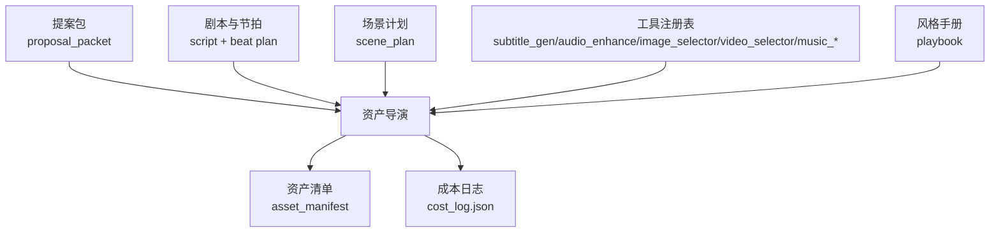
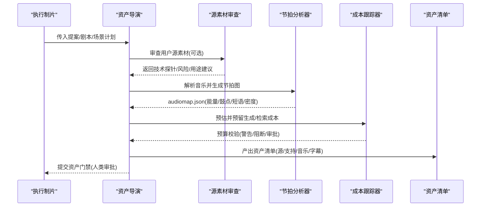
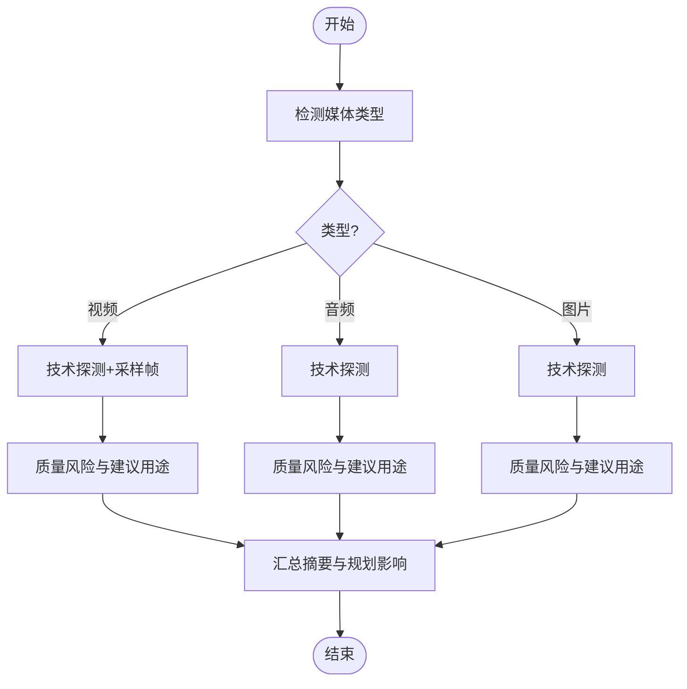
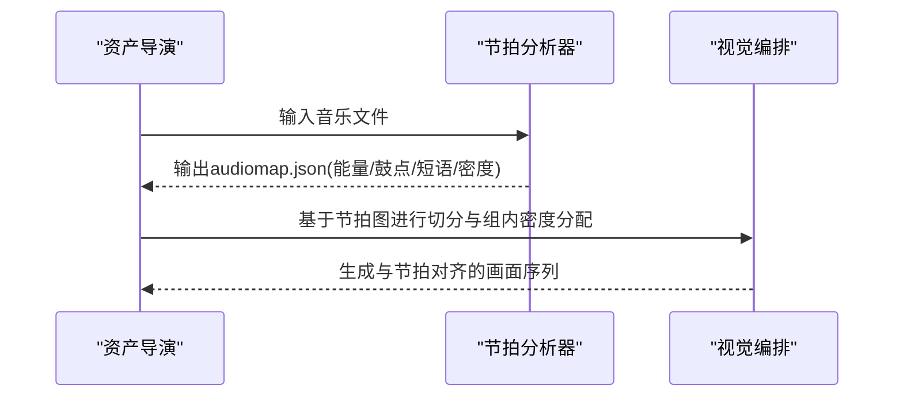
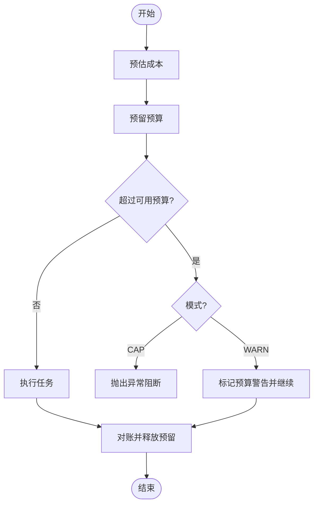
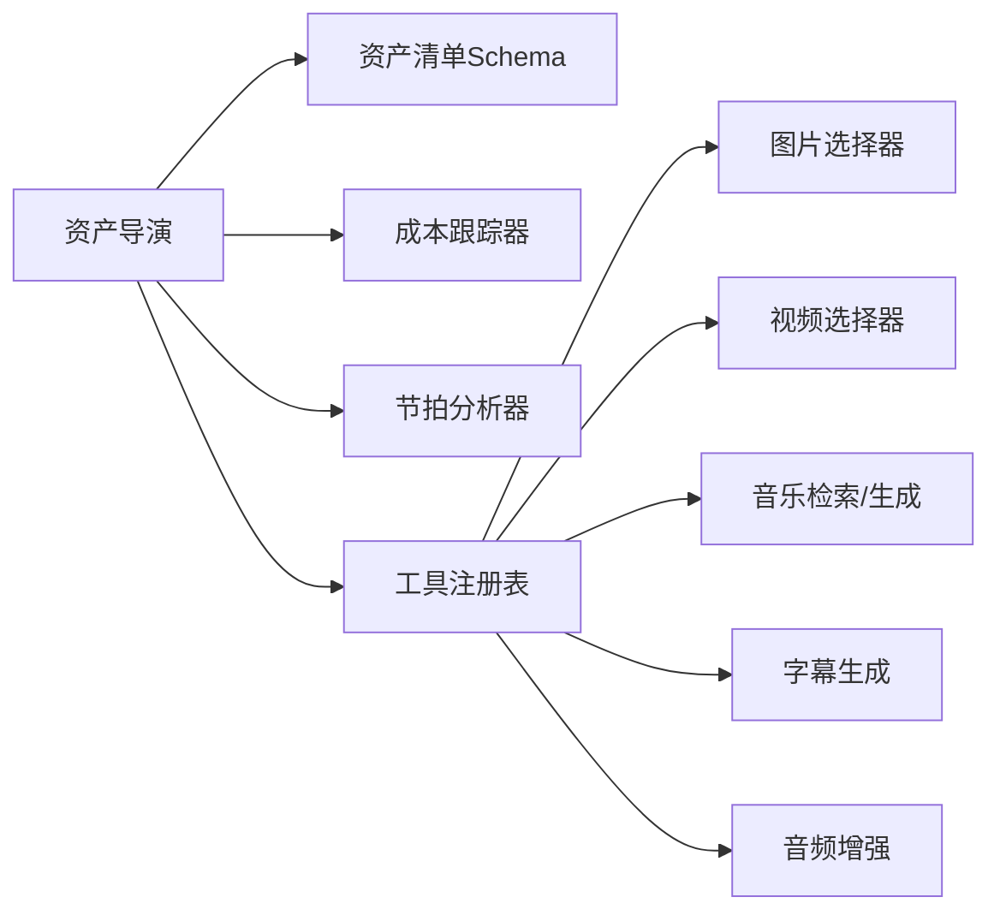

# 资产导演

<cite>
**本文引用的文件**
- [skills/pipelines/cinematic/asset-director.md](file://skills/pipelines/cinematic/asset-director.md)
- [skills/pipelines/cinematic/executive-producer.md](file://skills/pipelines/cinematic/executive-producer.md)
- [.agents/skills/music-to-video/SKILL.md](file://.agents/skills/music-to-video/SKILL.md)
- [.agents/skills/music-to-video/scripts/analyze-beatgrid.py](file://.agents/skills/music-to-video/scripts/analyze-beatgrid.py)
- [lib/source_media_review.py](file://lib/source_media_review.py)
- [tools/cost_tracker.py](file://tools/cost_tracker.py)
- [schemas/artifacts/asset_manifest.schema.json](file://schemas/artifacts/asset_manifest.schema.json)
- [tests/tools/test_cost_tracker_governance.py](file://tests/tools/test_cost_tracker_governance.py)
- [tests/lib/test_source_media_review_empty.py](file://tests/lib/test_source_media_review_empty.py)
</cite>

## 目录
1. [简介](#简介)
2. [项目结构](#项目结构)
3. [核心组件](#核心组件)
4. [架构总览](#架构总览)
5. [详细组件分析](#详细组件分析)
6. [依赖关系分析](#依赖关系分析)
7. [性能考量](#性能考量)
8. [故障排查指南](#故障排查指南)
9. [结论](#结论)
10. [附录](#附录)

## 简介
本技术文档聚焦OpenMontage电影化管道中的“资产导演”角色，系统阐述其在素材管理与质量控制中的职责与实现。重点覆盖：
- 音乐与环境音对齐、生成内容限制与优化、源素材质量保证、预算控制
- 确保音乐节拍图与脚本节拍图的同步
- 在需要运动时使用实际视频片段而非静态图像替代
- 资产管理质量标准（源剪辑标识与可访问性验证、支持资产与源质量匹配）
- 预算门禁机制与90%阈值警告系统

## 项目结构
资产导演位于电影化管道的ASSETS阶段，负责将前期策划（提案、剧本、场景计划）转化为可直接用于最终剪辑的可用媒体清单。其关键输入包括：
- 已通过的提案包（含是否要求运动的元数据）
- 剧本与节拍计划
- 场景计划（镜头意图、转场需求）
- 工具注册表（字幕生成、音频增强、图片/视频选择器、音乐检索/生成等）
- 风格手册（品牌与排版一致性）

图表来源
- [skills/pipelines/cinematic/asset-director.md:24-31](file://skills/pipelines/cinematic/asset-director.md#L24-L31)
- [schemas/artifacts/asset_manifest.schema.json:1-63](file://schemas/artifacts/asset_manifest.schema.json#L1-L63)
- [tools/cost_tracker.py:1-171](file://tools/cost_tracker.py#L1-L171)

章节来源
- [skills/pipelines/cinematic/asset-director.md:24-31](file://skills/pipelines/cinematic/asset-director.md#L24-L31)

## 核心组件
- 资产导演流程与质量门禁
  - 优先使用源素材（源选段、静帧、标题背景、已批准的音乐/环境音）
  - 仅在必要时生成支持性资产（过渡B-roll、概念插入、纹理/氛围卡、简单动态背景）
  - 若提案标记“需要运动”，必须提供真实视频片段，禁止以静帧替代
  - 生成前进行样本预览（昂贵类型先出样片确认），批量前需用户批准
  - 明确记录版权与意图元数据
  - 质量门禁：源与支持资产区分清晰；生成插入有限且目的明确；音频计划与节拍图一致；所有引用文件存在；需要运动时包含真实视频片段
- 源素材审查
  - 标准化检查用户提供的媒体文件（视频/音频/图片）
  - 通过探测与采样输出技术探针、代表性帧、质量风险与建议用途
  - 当无源素材时，产出合法的空文件清单，表示“完全生成式生产”
- 预算治理
  - 每项付费操作需预估算并预留预算
  - 超过可用预算时在WARN模式下打警告并在条目中持久化；CAP模式直接阻断
  - 单动作审批阈值与新工具首次付费需审批
  - 执行后对账，释放预留并记录实际花费
- 音乐节拍分析与对齐
  - 唯一节拍分析器生成确定性节拍图（audiomap.json），包含能量相位、鼓点分类、强/弱拍、短语层与密度预算
  - 视觉编排基于该节拍图进行切分与组内密度分配，保证音乐与画面节奏一致

章节来源
- [skills/pipelines/cinematic/asset-director.md:49-141](file://skills/pipelines/cinematic/asset-director.md#L49-L141)
- [lib/source_media_review.py:215-331](file://lib/source_media_review.py#L215-L331)
- [tools/cost_tracker.py:101-171](file://tools/cost_tracker.py#L101-L171)
- [.agents/skills/music-to-video/SKILL.md:16-42](file://.agents/skills/music-to-video/SKILL.md#L16-L42)

## 架构总览
资产导演作为电影化管道的“素材准备与质量把关”中心，串联上游策划与下游合成/渲染，并通过预算与节拍子系统保障质量与成本可控。

图表来源
- [skills/pipelines/cinematic/asset-director.md:24-31](file://skills/pipelines/cinematic/asset-director.md#L24-L31)
- [lib/source_media_review.py:215-331](file://lib/source_media_review.py#L215-L331)
- [.agents/skills/music-to-video/scripts/analyze-beatgrid.py:1-200](file://.agents/skills/music-to-video/scripts/analyze-beatgrid.py#L1-L200)
- [tools/cost_tracker.py:101-171](file://tools/cost_tracker.py#L101-L171)
- [schemas/artifacts/asset_manifest.schema.json:1-63](file://schemas/artifacts/asset_manifest.schema.json#L1-L63)

## 详细组件分析

### 资产导演流程与质量门禁
- 优先级策略
  - 首选源素材（源选段、静帧、标题背景、已批准音乐/环境音）
  - 仅在缺口处生成支持资产（过渡B-roll、概念插入、纹理/氛围卡、简单动态背景）
- 运动需求约束
  - 若提案标记“需要运动”，必须提供真实视频片段；静帧仅可作为参考或更大运动构图中的背景元素
  - 不得因某提供商失败而悄悄降级为静帧
- 样本预览与成本控制
  - 昂贵类型先出样片（图片/视频选择器、音乐检索/生成），确认情绪与能量匹配节拍计划后再批量
  - 明确告知使用的工具、提供商、模型/变体、生成模式及选择原因；失败后停止并询问再尝试其他路径
- 音频计划
  - 记录选定音乐、环境层、冲击/转场音效、字幕素材
- 元数据与版权
  - 记录source_selects、music_plan、ambience_plan、title_assets、generated_support_assets、rights_notes等
- 质量门禁要点
  - 源与支持资产清晰区分
  - 生成插入有限且目的明确
  - 音频计划与节拍图一致
  - 所有引用文件存在
  - 需要运动时，资产集包含真实视频片段

章节来源
- [skills/pipelines/cinematic/asset-director.md:49-141](file://skills/pipelines/cinematic/asset-director.md#L49-L141)
- [skills/pipelines/cinematic/executive-producer.md:125-136](file://skills/pipelines/cinematic/executive-producer.md#L125-L136)

### 源素材质量保证与可访问性验证
- 标准化审查
  - 按扩展名识别媒体类型（视频/音频/图片）
  - 视频：调用音频探测与帧采样，输出分辨率、码率、声道、时长、代表性帧、质量风险
  - 音频：探测时长、编码、采样率、声道、码率、文件大小
  - 图片：分辨率、格式、文件大小，低分辨率提示可能需要放大
- 可用性推断
  - 根据时长与转录结果推断可用于hero footage、b-roll、旁白源、环境音等
- 空源处理
  - 若无用户媒体，仍产出合法的source_media_review（files为空），表示完全生成式生产

图表来源
- [lib/source_media_review.py:29-38](file://lib/source_media_review.py#L29-L38)
- [lib/source_media_review.py:41-117](file://lib/source_media_review.py#L41-L117)
- [lib/source_media_review.py:120-187](file://lib/source_media_review.py#L120-L187)
- [lib/source_media_review.py:215-331](file://lib/source_media_review.py#L215-L331)

章节来源
- [lib/source_media_review.py:215-331](file://lib/source_media_review.py#L215-L331)
- [tests/lib/test_source_media_review_empty.py:1-29](file://tests/lib/test_source_media_review_empty.py#L1-L29)

### 音乐节拍分析与节拍同步
- 节拍分析器职责
  - 读取音乐文件，输出确定性audiomap.json：能量相位、鼓点分类、强/弱拍、短语层、密度预算
  - 节拍图是视觉编排的唯一时间基准，避免重复测量或主观判断
- 与脚本节拍同步
  - 资产导演阶段需确保音乐计划与脚本节拍图一致；在ASSETS门禁中由执行制片再次核对
  - 节拍驱动切分与组内密度分配，保证画面节奏与音乐能量/鼓点对齐
- 实践要点
  - 对于非节奏型音乐，依据短语与能量推进而非硬切到节拍网格
  - 在需要运动的场景中，用真实视频片段承载节拍驱动的镜头

图表来源
- [.agents/skills/music-to-video/SKILL.md:16-42](file://.agents/skills/music-to-video/SKILL.md#L16-L42)
- [.agents/skills/music-to-video/scripts/analyze-beatgrid.py:1-200](file://.agents/skills/music-to-video/scripts/analyze-beatgrid.py#L1-L200)
- [skills/pipelines/cinematic/executive-producer.md:125-136](file://skills/pipelines/cinematic/executive-producer.md#L125-L136)

章节来源
- [.agents/skills/music-to-video/SKILL.md:16-42](file://.agents/skills/music-to-video/SKILL.md#L16-L42)
- [.agents/skills/music-to-video/scripts/analyze-beatgrid.py:1-200](file://.agents/skills/music-to-video/scripts/analyze-beatgrid.py#L1-L200)
- [skills/pipelines/cinematic/executive-producer.md:125-136](file://skills/pipelines/cinematic/executive-producer.md#L125-L136)

### 预算门禁与90%阈值警告
- 预算治理规则
  - 每项付费操作需预估并预留预算
  - 预留时检查单动作审批阈值与新工具首次付费审批
  - 超过可用预算：
    - CAP模式：抛出异常阻断
    - WARN模式：标记预算警告并持久化到日志
  - 执行完成后对账，释放预留并记录实际花费
- 90%阈值警告
  - 执行制片在ASSETS门禁中明确要求“预算门禁：90%阈值警告”，用于提醒接近预算上限的风险
  - 成本跟踪器在WARN模式下会记录条目级预算警告信息，便于回看与审计

图表来源
- [tools/cost_tracker.py:101-171](file://tools/cost_tracker.py#L101-L171)
- [tests/tools/test_cost_tracker_governance.py:15-42](file://tests/tools/test_cost_tracker_governance.py#L15-L42)
- [skills/pipelines/cinematic/executive-producer.md:125-136](file://skills/pipelines/cinematic/executive-producer.md#L125-L136)

章节来源
- [tools/cost_tracker.py:101-171](file://tools/cost_tracker.py#L101-L171)
- [tests/tools/test_cost_tracker_governance.py:15-42](file://tests/tools/test_cost_tracker_governance.py#L15-L42)
- [skills/pipelines/cinematic/executive-producer.md:125-136](file://skills/pipelines/cinematic/executive-producer.md#L125-L136)

### 资产清单与元数据规范
- 资产清单结构
  - 版本、资产数组、总成本、元数据
  - 每个资产包含ID、类型、路径、来源工具、场景ID、提示词、种子、模型、成本、时长、分辨率、格式、质量评分、子类型、生成摘要、提供商、许可证、原始URL、语音表演契约等
- 用途
  - 追踪生成/采购来源、版权与许可、成本归集、质量评分与可追溯性
  - 支撑下游合成、发布与审计

章节来源
- [schemas/artifacts/asset_manifest.schema.json:1-63](file://schemas/artifacts/asset_manifest.schema.json#L1-L63)

## 依赖关系分析
- 资产导演依赖
  - 上游：提案包、剧本与节拍、场景计划
  - 工具：字幕生成、音频增强、图片/视频选择器、音乐检索/生成
  - 标准：资产清单Schema、成本跟踪器、节拍分析器
- 耦合与内聚
  - 资产导演高内聚于“素材准备与质量门禁”，通过Schema与工具接口降低耦合
  - 节拍分析器提供统一的时间基准，减少多工具间节拍不一致风险
  - 成本跟踪器集中管理预算与审批，避免分散的成本失控

图表来源
- [skills/pipelines/cinematic/asset-director.md:24-31](file://skills/pipelines/cinematic/asset-director.md#L24-L31)
- [schemas/artifacts/asset_manifest.schema.json:1-63](file://schemas/artifacts/asset_manifest.schema.json#L1-L63)
- [tools/cost_tracker.py:101-171](file://tools/cost_tracker.py#L101-L171)
- [.agents/skills/music-to-video/scripts/analyze-beatgrid.py:1-200](file://.agents/skills/music-to-video/scripts/analyze-beatgrid.py#L1-L200)

## 性能考量
- 节拍分析器使用稳定采样与频带能量曲线，避免昂贵的学习模型，提升可重复性与速度
- 资产生成前样本预览可减少批量浪费，提高整体效率
- 源素材审查并行探测与采样，快速定位质量风险，避免后期返工
- 成本跟踪器在WARN/CAP模式下提前拦截超支，防止资源浪费

[本节为通用指导，不直接分析具体文件]

## 故障排查指南
- 节拍不同步
  - 确认使用了唯一的节拍分析器，未重复测量
  - 检查audiomap.json是否被正确消费，视觉编排是否基于该节拍图
- 源素材不可用
  - 检查文件是否存在、扩展名是否被识别
  - 查看技术探针与质量风险，确认分辨率、时长、声道是否符合预期
- 预算超限
  - 检查当前模式（WARN/CAP/OBSERVE）、单动作阈值、新工具审批状态
  - 查看cost_log.json中的预算警告条目与消息
- 静帧替代视频
  - 若提案标记“需要运动”，必须提供真实视频片段；如出现静帧替代，需回退至样本预览与用户批准环节

章节来源
- [.agents/skills/music-to-video/SKILL.md:16-42](file://.agents/skills/music-to-video/SKILL.md#L16-L42)
- [lib/source_media_review.py:215-331](file://lib/source_media_review.py#L215-L331)
- [tools/cost_tracker.py:101-171](file://tools/cost_tracker.py#L101-L171)
- [tests/tools/test_cost_tracker_governance.py:15-42](file://tests/tools/test_cost_tracker_governance.py#L15-L42)

## 结论
资产导演在电影化管道中承担素材准备与质量把关的核心职责，通过严格的源素材审查、节拍对齐、生成内容限制与预算门禁，确保最终成片在创意、质量与成本之间取得平衡。配合执行制片的门禁检查与成本跟踪器的治理机制，能够有效避免常见陷阱（如静帧替代、音乐单一循环、版权缺失、超支等），保障高质量、可审计、可复现的生产流程。

## 附录
- 关键流程与检查点
  - 资产导演：优先源素材、必要生成、样本预览、音频计划、质量门禁
  - 执行制片：ASSETS门禁核对音乐/环境音对齐、生成插入限制、运动需求满足、预算90%阈值警告、源素材质量与可访问性
- 推荐实践
  - 始终使用唯一节拍分析器
  - 生成前样本预览并记录工具/模型/模式
  - 严格记录版权与意图元数据
  - 在WARN模式下保留预算警告以便审计

[本节为补充说明，不直接分析具体文件]