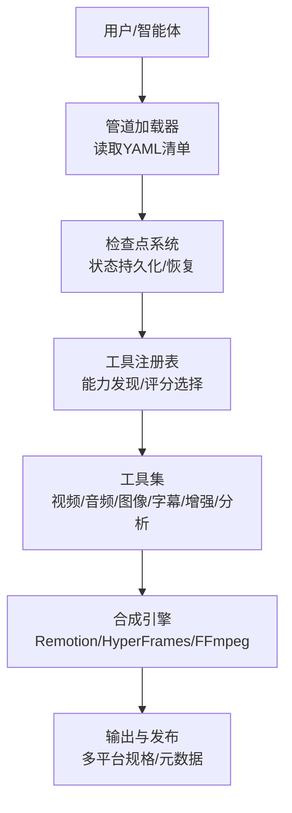
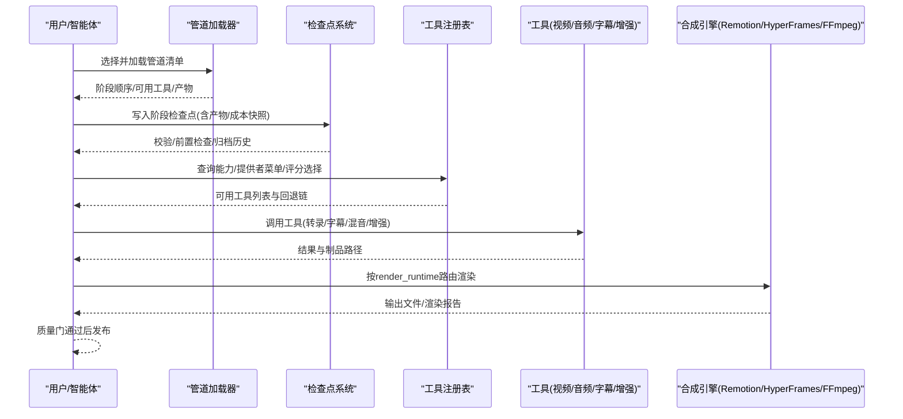
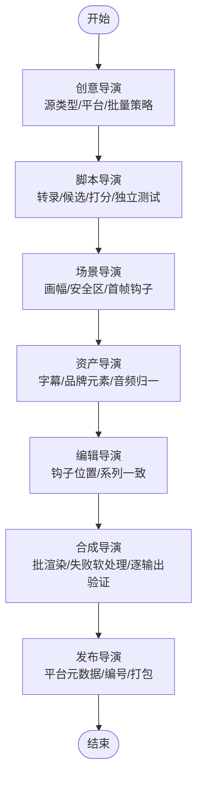
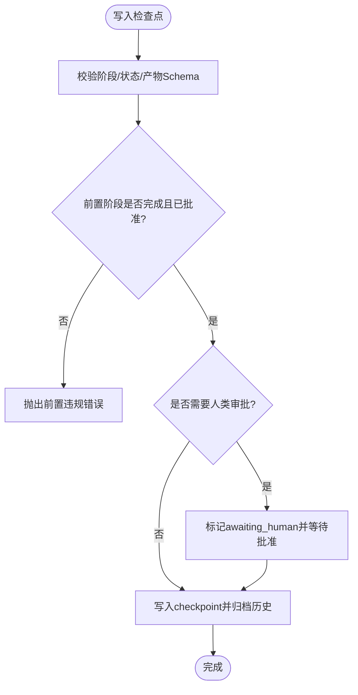
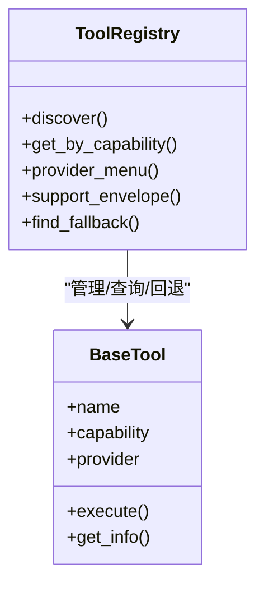
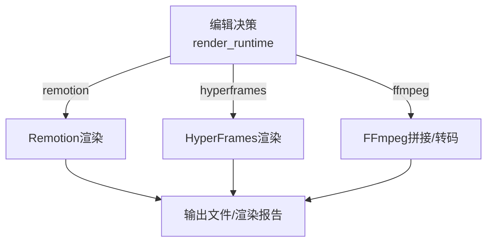

# 短视频工厂管道

<cite>
**本文引用的文件**
- [README.md](file://README.md)
- [PROJECT_CONTEXT.md](file://PROJECT_CONTEXT.md)
- [docs/ARCHITECTURE.md](file://docs/ARCHITECTURE.md)
- [pipeline_defs/clip-factory.yaml](file://pipeline_defs/clip-factory.yaml)
- [skills/INDEX.md](file://skills/INDEX.md)
- [skills/pipelines/clip-factory/executive-producer.md](file://skills/pipelines/clip-factory/executive-producer.md)
- [skills/pipelines/clip-factory/idea-director.md](file://skills/pipelines/clip-factory/idea-director.md)
- [skills/pipelines/clip-factory/script-director.md](file://skills/pipelines/clip-factory/script-director.md)
- [skills/pipelines/clip-factory/scene-director.md](file://skills/pipelines/clip-factory/scene-director.md)
- [skills/pipelines/clip-factory/compose-director.md](file://skills/pipelines/clip-factory/compose-director.md)
- [lib/pipeline_loader.py](file://lib/pipeline_loader.py)
- [lib/checkpoint.py](file://lib/checkpoint.py)
- [tools/tool_registry.py](file://tools/tool_registry.py)
</cite>

## 目录
1. [简介](#简介)
2. [项目结构](#项目结构)
3. [核心组件](#核心组件)
4. [架构总览](#架构总览)
5. [详细组件分析](#详细组件分析)
6. [依赖关系分析](#依赖关系分析)
7. [性能与规模化](#性能与规模化)
8. [故障排查指南](#故障排查指南)
9. [结论](#结论)
10. [附录：平台优化、SEO与传播策略](#附录平台优化seo与传播策略)

## 简介
本技术文档聚焦 OpenMontage 的“短视频工厂”管道，围绕创意自动生成、模板化制作、批量处理与快速发布的全流程自动化展开。系统以“指令驱动 + 智能体编排”为核心：AI 编码助手作为编排者，读取 YAML 管道清单与 Markdown 导演技能，调用 Python 工具完成素材生成、剪辑与合成，并通过检查点与质量门实现可恢复、可审计的生产流。短视频工厂特别强调从长视频源批量抽取短片段，按平台适配、统一风格与一致音频进行批渲染与发布，形成高吞吐的内容生产线。

## 项目结构
OpenMontage 将“能力（工具）—编排（管道清单）—知识（技能）”分层组织：
- 工具层：100+ 生产工具（视频生成、图像生成、TTS、音乐、混音、字幕、增强、分析等），通过工具注册表自动发现与选择。
- 编排层：YAML 管道清单定义阶段顺序、可用工具、产物与审批门；每个阶段由导演技能指导执行。
- 知识层：Layer 2（项目规范）与 Layer 3（外部技术知识）为智能体提供“怎么做”与“技术细节”。

图表来源
- [docs/ARCHITECTURE.md:10-27](file://docs/ARCHITECTURE.md#L10-L27)
- [lib/pipeline_loader.py:49-70](file://lib/pipeline_loader.py#L49-L70)
- [tools/tool_registry.py:118-134](file://tools/tool_registry.py#L118-L134)

章节来源
- [docs/ARCHITECTURE.md:31-76](file://docs/ARCHITECTURE.md#L31-L76)
- [PROJECT_CONTEXT.md:9-19](file://PROJECT_CONTEXT.md#L9-L19)

## 核心组件
- 管道清单与阶段：以 clip-factory 为例，包含 idea、script、scene_plan、assets、edit、compose、publish 七个阶段，每阶段声明所需/可选工具、产物、审查焦点与成功标准。
- 导演技能：每个阶段有对应的导演技能，指导智能体如何执行、如何自检、如何过门。
- 检查点与质量门：跨阶段前置校验、人类审批门、归档历史、决策日志合并，确保可恢复与可审计。
- 工具注册与选择：自动发现工具，按能力分组、可用性、提供者菜单与评分选择，支持回退链。
- 合成与渲染：根据 edit_decisions.render_runtime 路由到 Remotion、HyperFrames 或 FFmpeg，锁定运行时避免静默切换。

章节来源
- [pipeline_defs/clip-factory.yaml:45-207](file://pipeline_defs/clip-factory.yaml#L45-L207)
- [skills/INDEX.md:189-200](file://skills/INDEX.md#L189-L200)
- [lib/checkpoint.py:243-288](file://lib/checkpoint.py#L243-L288)
- [tools/tool_registry.py:198-230](file://tools/tool_registry.py#L198-L230)
- [docs/ARCHITECTURE.md:448-475](file://docs/ARCHITECTURE.md#L448-L475)

## 架构总览
OpenMontage 采用“智能体即编排器”的架构：无 Python 运行时编排器，所有控制面由 LLM 编码助手驱动，Python 仅提供工具与持久化。流水线遵循标准化阶段推进，并在关键节点设置人类审批门与质量门。

图表来源
- [docs/ARCHITECTURE.md:10-27](file://docs/ARCHITECTURE.md#L10-L27)
- [lib/checkpoint.py:422-564](file://lib/checkpoint.py#L422-L564)
- [tools/tool_registry.py:249-314](file://tools/tool_registry.py#L249-L314)
- [docs/ARCHITECTURE.md:448-475](file://docs/ARCHITECTURE.md#L448-L475)

章节来源
- [docs/ARCHITECTURE.md:80-99](file://docs/ARCHITECTURE.md#L80-L99)
- [PROJECT_CONTEXT.md:43-57](file://PROJECT_CONTEXT.md#L43-L57)

## 详细组件分析

### 短视频工厂（Clip Factory）管道
该管道从长视频源批量抽取短片段，面向多平台分发，强调钩子前置、系列一致性与批渲染健壮性。

- 阶段职责
  - 创意导演（Idea Director）：识别源类型、目标平台、批量策略与产出目标，明确渲染运行时约束（当前依赖 Remotion 的字幕燃烧）。
  - 脚本导演（Script Director）：全量转录、候选片段打分与筛选、独立片段测试、多样性覆盖。
  - 场景导演（Scene Director）：为每个片段规划画幅与构图安全区、首帧钩子与字幕区域、系列一致性。
  - 资产导演（Asset Director）：生成每片段的字幕与共享品牌元素，音频归一化。
  - 编辑导演（Edit Director）：制定每片段的剪辑决策，保证钩子在开头2-3秒内，保持系列一致性。
  - 合成导演（Compose Director）：多任务批渲染、失败软处理、逐输出验证（分辨率/画幅/时长/黑帧/字幕/音频）。
  - 发布导演（Publish Director）：按平台整理元数据、标题与描述、编号与发布时间线、导出包组织。

- 质量门与限制
  - 七道质量门（G1-G7）在阶段后检查，失败则退回修订或发送回上游。
  - 限制包括最大修订次数、最大回退次数、预算上限与总耗时上限。

图表来源
- [pipeline_defs/clip-factory.yaml:45-207](file://pipeline_defs/clip-factory.yaml#L45-L207)
- [skills/pipelines/clip-factory/executive-producer.md:46-117](file://skills/pipelines/clip-factory/executive-producer.md#L46-L117)
- [skills/pipelines/clip-factory/compose-director.md:24-64](file://skills/pipelines/clip-factory/compose-director.md#L24-L64)

章节来源
- [pipeline_defs/clip-factory.yaml:45-207](file://pipeline_defs/clip-factory.yaml#L45-L207)
- [skills/pipelines/clip-factory/executive-producer.md:1-137](file://skills/pipelines/clip-factory/executive-producer.md#L1-L137)
- [skills/pipelines/clip-factory/idea-director.md:1-114](file://skills/pipelines/clip-factory/idea-director.md#L1-L114)
- [skills/pipelines/clip-factory/script-director.md:1-111](file://skills/pipelines/clip-factory/script-director.md#L1-L111)
- [skills/pipelines/clip-factory/scene-director.md:1-86](file://skills/pipelines/clip-factory/scene-director.md#L1-L86)
- [skills/pipelines/clip-factory/compose-director.md:24-70](file://skills/pipelines/clip-factory/compose-director.md#L24-L70)

### 检查点与人类审批门
检查点系统负责阶段状态持久化、前置校验、人类审批门强制、历史归档与决策日志合并。任何阶段要进入“awaiting_human”或“completed”，必须满足前置阶段已完成且已获批准（若配置为需要人类审批）。

图表来源
- [lib/checkpoint.py:284-347](file://lib/checkpoint.py#L284-L347)
- [lib/checkpoint.py:422-564](file://lib/checkpoint.py#L422-L564)

章节来源
- [lib/checkpoint.py:243-288](file://lib/checkpoint.py#L243-L288)
- [lib/checkpoint.py:422-564](file://lib/checkpoint.py#L422-L564)

### 工具注册与提供者选择
工具注册表自动发现所有 BaseTool 子类，提供按能力/提供者/稳定性查询、可用性报告、提供者菜单与回退链解析。智能体在预检时展示能力菜单，选择最佳提供者并记录决策。

图表来源
- [tools/tool_registry.py:55-134](file://tools/tool_registry.py#L55-L134)
- [tools/tool_registry.py:198-230](file://tools/tool_registry.py#L198-L230)
- [tools/tool_registry.py:249-314](file://tools/tool_registry.py#L249-L314)

章节来源
- [tools/tool_registry.py:118-134](file://tools/tool_registry.py#L118-L134)
- [tools/tool_registry.py:198-230](file://tools/tool_registry.py#L198-L230)
- [tools/tool_registry.py:249-314](file://tools/tool_registry.py#L249-L314)

### 合成与渲染路由
合成阶段依据 edit_decisions.render_runtime 路由到不同引擎：Remotion（React/Remotion）、HyperFrames（HTML/CSS/GSAP）或 FFmpeg（纯拼接/转码）。运行时在提案阶段锁定，禁止静默切换。

图表来源
- [docs/ARCHITECTURE.md:448-475](file://docs/ARCHITECTURE.md#L448-L475)

章节来源
- [docs/ARCHITECTURE.md:448-475](file://docs/ARCHITECTURE.md#L448-L475)

## 依赖关系分析
- 管道清单依赖：阶段顺序、所需工具、产物与人类审批门由 YAML 清单声明，加载器负责校验与缓存。
- 检查点依赖：阶段推进需前置完成且已批准；产物需符合 Schema；风格剧本需有效。
- 工具依赖：工具通过注册表自动发现，按能力分组与可用性报告；提供者菜单用于预检与选择。
- 合成依赖：渲染引擎需在提案阶段锁定，运行时不可变。

图表来源
- [lib/pipeline_loader.py:49-70](file://lib/pipeline_loader.py#L49-L70)
- [lib/checkpoint.py:284-347](file://lib/checkpoint.py#L284-L347)
- [tools/tool_registry.py:118-134](file://tools/tool_registry.py#L118-L134)
- [docs/ARCHITECTURE.md:448-475](file://docs/ARCHITECTURE.md#L448-L475)

章节来源
- [lib/pipeline_loader.py:49-70](file://lib/pipeline_loader.py#L49-L70)
- [lib/checkpoint.py:284-347](file://lib/checkpoint.py#L284-L347)
- [tools/tool_registry.py:118-134](file://tools/tool_registry.py#L118-L134)
- [docs/ARCHITECTURE.md:448-475](file://docs/ARCHITECTURE.md#L448-L475)

## 性能与规模化
- 批量并行：合成阶段对每个输出视为独立作业，建议并行渲染以提升吞吐；失败不阻塞其他作业。
- 资源复用：共享音频混音、字幕样式、叠加素材与调色，减少重复计算。
- 失败软处理：单片段或单平台变体失败仅记录并继续，保障整体批次成功率。
- 预检与评分：工具选择通过7维评分（任务匹配、质量、控制、可靠性、成本、延迟、连续性）降低失败率与成本。
- 运行时锁定：避免静默切换渲染引擎导致的兼容性问题与重渲染开销。

章节来源
- [skills/pipelines/clip-factory/compose-director.md:24-64](file://skills/pipelines/clip-factory/compose-director.md#L24-L64)
- [docs/ARCHITECTURE.md:664-670](file://docs/ARCHITECTURE.md#L664-L670)

## 故障排查指南
- 阶段无法推进：检查前置阶段是否已完成且已批准；查看检查点历史与决策日志。
- 人类审批门被拒绝：确认已通过“awaiting_human”状态呈现产物摘要并获得批准后再写“completed”。
- 工具不可用：使用提供者菜单查看可用/不可用工具与安装提示；必要时启用回退链。
- 渲染失败：核对平台规格（分辨率/画幅/时长）、字幕与音频是否存在；查看渲染报告与 ffprobe 验证结果。
- 风格剧本无效：检查 style_playbook 名称与加载；无效会阻止检查点写入。

章节来源
- [lib/checkpoint.py:284-347](file://lib/checkpoint.py#L284-L347)
- [lib/checkpoint.py:422-564](file://lib/checkpoint.py#L422-L564)
- [tools/tool_registry.py:249-314](file://tools/tool_registry.py#L249-L314)

## 结论
OpenMontage 的短视频工厂管道通过“指令驱动 + 智能体编排 + 工具注册 + 检查点治理”的组合，实现了从创意到发布的端到端自动化。其高效模式体现在：创意自动生成（研究/提案/脚本）、模板化制作（风格剧本/平台规格/系列一致性）、批量处理（并行渲染/失败软处理/资源复用）与快速发布（平台元数据/编号/打包）。借助 AI 技术与多提供者选择，系统可在低成本下大规模生产高质量短视频内容。

## 附录：平台优化、SEO与传播策略
- 平台输出规格：内置 YouTube、TikTok、Instagram、LinkedIn、Cinematic 等多平台渲染配置，确保分辨率、画幅与时长合规。
- SEO 优化：发布阶段为每个片段准备平台特定的标题、描述与标签；利用章节包装与缩略图概念提升搜索与推荐命中。
- 传播效果分析：建议在发布后收集播放、完播、互动指标，结合片段钩子位置与字幕样式进行复盘，迭代下一批次的创意与剪辑策略。
- 社交媒体营销与品牌宣传：通过系列一致性（统一钩子区、字幕区、品牌水印/下三栏逻辑）强化品牌识别；利用热点话题与观点型片段提升传播力。
- 教育培训场景：使用动画解释器与屏幕演示管道制作教程与产品演示；结合字幕与图表组件提升信息密度与可读性。

章节来源
- [README.md:635-649](file://README.md#L635-L649)
- [pipeline_defs/clip-factory.yaml:188-207](file://pipeline_defs/clip-factory.yaml#L188-L207)
- [docs/ARCHITECTURE.md:429-445](file://docs/ARCHITECTURE.md#L429-L445)