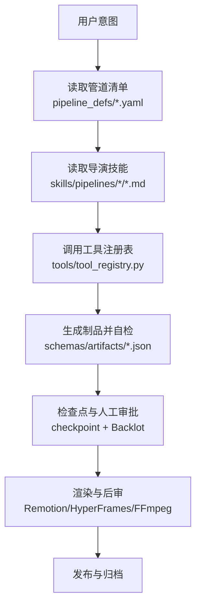
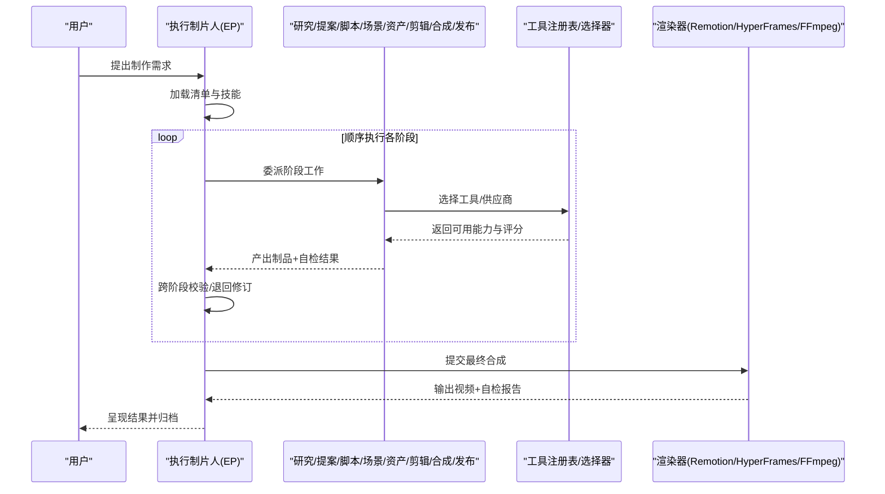
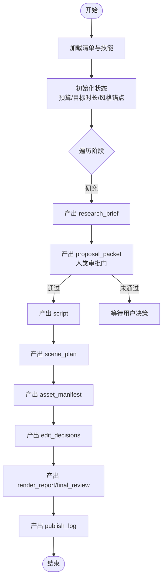
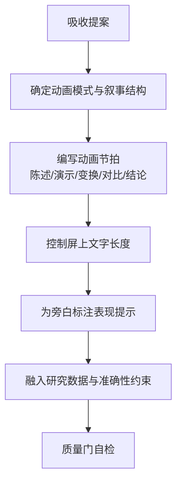
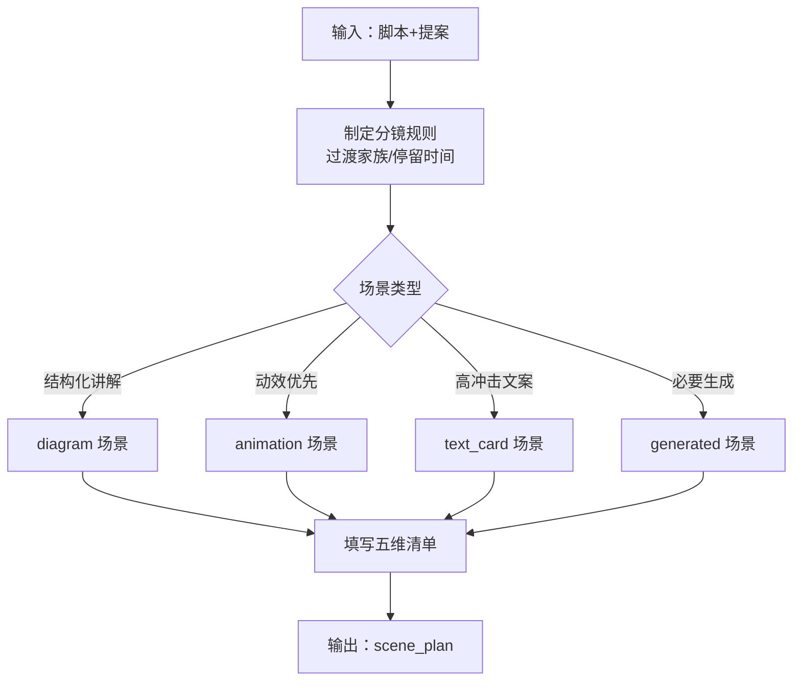
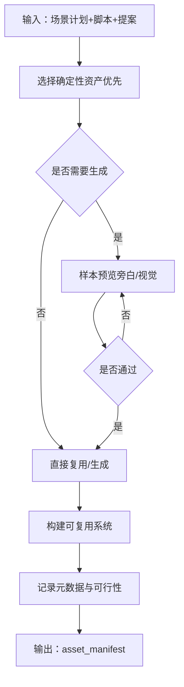
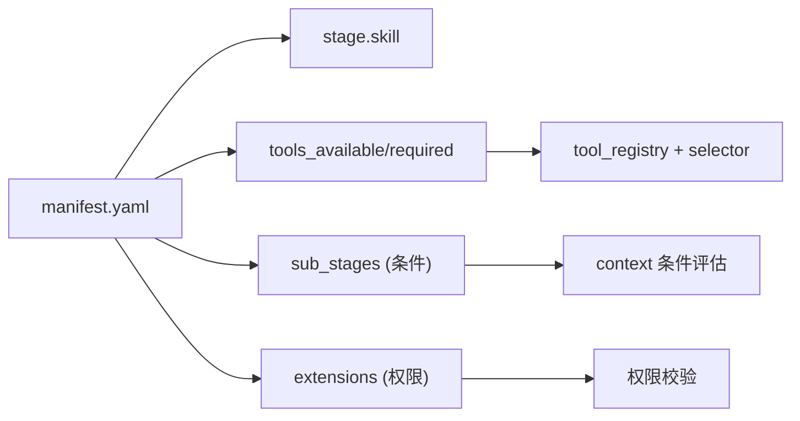

# 管道技能

<cite>
**本文引用的文件**
- [README.md](file://README.md)
- [PROJECT_CONTEXT.md](file://PROJECT_CONTEXT.md)
- [pipeline_loader.py](file://lib/pipeline_loader.py)
- [animation.yaml](file://pipeline_defs/animation.yaml)
- [cinematic.yaml](file://pipeline_defs/cinematic.yaml)
- [talking-head.yaml](file://pipeline_defs/talking-head.yaml)
- [character-animation.yaml](file://pipeline_defs/character-animation.yaml)
- [executive-producer.md](file://skills/pipelines/animation/executive-producer.md)
- [script-director.md](file://skills/pipelines/animation/script-director.md)
- [scene-director.md](file://skills/pipelines/animation/scene-director.md)
- [asset-director.md](file://skills/pipelines/animation/asset-director.md)
</cite>

## 目录
1. [简介](#简介)
2. [项目结构](#项目结构)
3. [核心组件](#核心组件)
4. [架构总览](#架构总览)
5. [详细组件分析](#详细组件分析)
6. [依赖关系分析](#依赖关系分析)
7. [性能与质量控制](#性能与质量控制)
8. [故障排查指南](#故障排查指南)
9. [结论](#结论)
10. [附录：定制与扩展指南](#附录定制与扩展指南)

## 简介
本技术文档聚焦 OpenMontage 的“管道技能”体系，系统化说明各类预定义管道的导演技能（执行制片人、脚本导演、场景导演、资产导演等）的职责与工作流；对比不同管道类型（动画、电影化、对话头、角色动画等）的特点与适用场景；解释执行引擎如何协调各导演技能完成复杂制作任务；并提供管道定制与扩展指南（新管道创建、阶段添加、工具集成），以及性能优化与质量控制策略。

## 项目结构
OpenMontage 采用“指令驱动（Agent-First）”的三层知识架构：
- 第一层：工具与管道清单（可执行能力与编排契约）
- 第二层：技能（如何使用这些能力的规范与质量要求）
- 第三层：外部技术知识包（供应商/运行时最佳实践）

**图示来源**
- [PROJECT_CONTEXT.md:9-19](file://PROJECT_CONTEXT.md#L9-L19)
- [PROJECT_CONTEXT.md:33-57](file://PROJECT_CONTEXT.md#L33-L57)
- [README.md:450-475](file://README.md#L450-L475)

**章节来源**
- [PROJECT_CONTEXT.md:9-19](file://PROJECT_CONTEXT.md#L9-L19)
- [PROJECT_CONTEXT.md:33-57](file://PROJECT_CONTEXT.md#L33-L57)
- [README.md:450-475](file://README.md#L450-L475)

## 核心组件
- 管道清单（YAML）：声明阶段、技能、工具、评审焦点、成功标准、人类审批门控、预算与时限等。
- 导演技能（Markdown）：为每个阶段提供“如何做”的详细步骤、约束与质量门。
- 执行制片人（EP）：串行编排各阶段，维护累计状态，跨阶段校验，必要时退回修订。
- 工具注册表与选择器：按任务适配、输出质量、控制力、可靠性、成本、延迟、连续性等维度评分选择。
- 制品与模式：brief、script、scene_plan、asset_manifest、edit_decisions、render_report、publish_log 等受 JSON Schema 约束。
- 渲染与后审：Remotion/HyperFrames/FFmpeg 组合，配合 ffprobe、帧采样、音频分析等自检。

**章节来源**
- [PROJECT_CONTEXT.md:43-57](file://PROJECT_CONTEXT.md#L43-L57)
- [README.md:652-686](file://README.md#L652-L686)

## 架构总览
OpenMontage 的执行流程由“清单 + 技能 + 工具”共同驱动，AI 代理作为编排者，Python 提供工具与持久化。关键路径如下：
- 读取清单 → 读取导演技能 → 调用工具 → 自检 → 检查点与审批 → 渲染 → 后审 → 发布。

**图示来源**
- [PROJECT_CONTEXT.md:9-19](file://PROJECT_CONTEXT.md#L9-L19)
- [README.md:408-444](file://README.md#L408-L444)

## 详细组件分析

### 执行制片人（Animation 管道）
职责与流程要点：
- 串行编排研究→提案→脚本→场景→资产→剪辑→合成→发布，维护累计状态（预算、时长、风格锚点、数学准确性备注等）。
- 在提案阶段设置人类审批门，未获批准不得继续。
- 跨阶段检查：文案字数与时长匹配、场景覆盖度、复用策略一致性、预算消耗预警、文本与图表清晰度、运动一致性与节奏等。
- 失败处理：最多每阶段修订 3 次，超限放行但记录警告；限制回退次数与总耗时。

**图示来源**
- [executive-producer.md:91-156](file://skills/pipelines/animation/executive-producer.md#L91-L156)
- [executive-producer.md:158-203](file://skills/pipelines/animation/executive-producer.md#L158-L203)
- [executive-producer.md:205-342](file://skills/pipelines/animation/executive-producer.md#L205-L342)
- [executive-producer.md:386-410](file://skills/pipelines/animation/executive-producer.md#L386-L410)

**章节来源**
- [executive-producer.md:22-87](file://skills/pipelines/animation/executive-producer.md#L22-L87)
- [executive-producer.md:91-156](file://skills/pipelines/animation/executive-producer.md#L91-L156)
- [executive-producer.md:158-203](file://skills/pipelines/animation/executive-producer.md#L158-L203)
- [executive-producer.md:205-342](file://skills/pipelines/animation/executive-producer.md#L205-L342)
- [executive-producer.md:386-410](file://skills/pipelines/animation/executive-producer.md#L386-L410)

### 脚本导演（Animation 管道）
职责与流程要点：
- 将已批准的提案转化为“动画节拍”，确保留白给运动、调度与停顿。
- 根据所选动画模式调整写作风格（Manim/Remotion/AI Video/Diagram Stills/Mixed）。
- 严格控制屏上文字长度，避免信息过载；为旁白标注语气、停顿与强调。
- 结合研究简报中的数据点与准确性约束，保证内容可信且可验证。

**图示来源**
- [script-director.md:17-49](file://skills/pipelines/animation/script-director.md#L17-L49)
- [script-director.md:60-93](file://skills/pipelines/animation/script-director.md#L60-L93)
- [script-director.md:94-127](file://skills/pipelines/animation/script-director.md#L94-L127)

**章节来源**
- [script-director.md:17-49](file://skills/pipelines/animation/script-director.md#L17-L49)
- [script-director.md:60-93](file://skills/pipelines/animation/script-director.md#L60-L93)
- [script-director.md:94-127](file://skills/pipelines/animation/script-director.md#L94-L127)

### 场景导演（Animation 管道）
职责与流程要点：
- 将脚本转为可行的分镜计划，明确“先出现什么、变化什么、保持多久、如何退出”。
- 限制过渡家族（cut/fade/slide/transform），保证视觉语言统一。
- 针对 image_animation（动漫/插画风格）给出镜头运动、粒子、光照、暗角等参数约定。
- 使用五维清单（主体、主体运动、场景、空间构图、摄影机）约束不同模式的规格粒度。

**图示来源**
- [scene-director.md:15-43](file://skills/pipelines/animation/scene-director.md#L15-L43)
- [scene-director.md:44-77](file://skills/pipelines/animation/scene-director.md#L44-L77)
- [scene-director.md:78-109](file://skills/pipelines/animation/scene-director.md#L78-L109)

**章节来源**
- [scene-director.md:15-43](file://skills/pipelines/animation/scene-director.md#L15-L43)
- [scene-director.md:44-77](file://skills/pipelines/animation/scene-director.md#L44-L77)
- [scene-director.md:78-109](file://skills/pipelines/animation/scene-director.md#L78-L109)

### 资产导演（Animation 管道）
职责与流程要点：
- 优先确定性资产（图表、代码片段、程序化数学动画），再考虑生成式素材。
- 对昂贵资产先做样本预览（旁白、视觉），获批后再批量生产。
- 对 image_animation 模式，采用多图交叉淡入（同视觉系统+相近种子）营造运动感。
- 建立可复用系统（字体样式、标签、母题、背景容器），并在元数据中记录工具路径与可用性。

**图示来源**
- [asset-director.md:7-27](file://skills/pipelines/animation/asset-director.md#L7-L27)
- [asset-director.md:37-63](file://skills/pipelines/animation/asset-director.md#L37-L63)
- [asset-director.md:64-99](file://skills/pipelines/animation/asset-director.md#L64-L99)
- [asset-director.md:99-135](file://skills/pipelines/animation/asset-director.md#L99-L135)

**章节来源**
- [asset-director.md:7-27](file://skills/pipelines/animation/asset-director.md#L7-L27)
- [asset-director.md:37-63](file://skills/pipelines/animation/asset-director.md#L37-L63)
- [asset-director.md:64-99](file://skills/pipelines/animation/asset-director.md#L64-L99)
- [asset-director.md:99-135](file://skills/pipelines/animation/asset-director.md#L99-L135)

### 管道类型对比与适用场景
- 动画（animation）：动效优先，适合图形动效、图解、数学可视化、风格化序列；强调复用策略与程序化资产。
- 电影化（cinematic）：情绪导向，适合预告片、品牌片、蒙太奇与短剧向剪辑；重视情感弧线、色彩与声音设计。
- 对话头（talking-head）：以真实人声/画面为主，适合演讲、访谈、课程；强调转录、字幕、自动跳切与增强。
- 角色动画（character-animation）：本地可复用卡通角色，适合 SVG/Canvas/GSAP/Remotion/HyperFrames 驱动的定帧动作；强调角色设定、绑定计划、姿态库与动作时间线。

**章节来源**
- [animation.yaml:1-44](file://pipeline_defs/animation.yaml#L1-L44)
- [cinematic.yaml:1-51](file://pipeline_defs/cinematic.yaml#L1-L51)
- [talking-head.yaml:1-28](file://pipeline_defs/talking-head.yaml#L1-L28)
- [character-animation.yaml:1-44](file://pipeline_defs/character-animation.yaml#L1-L44)

## 依赖关系分析
- 清单到技能的映射：每个阶段通过 skill 字段指向对应导演技能。
- 工具发现与选择：阶段声明 tools_available/required_tools，运行时通过注册表与选择器进行评分与路由。
- 子阶段条件执行：sample/preview 等子阶段可按上下文条件激活。
- 扩展权限控制：custom_scripts/custom_playbooks/custom_skills/custom_tools 需显式允许。

**图示来源**
- [pipeline_loader.py:98-162](file://lib/pipeline_loader.py#L98-L162)
- [pipeline_loader.py:165-182](file://lib/pipeline_loader.py#L165-L182)
- [pipeline_loader.py:201-241](file://lib/pipeline_loader.py#L201-L241)

**章节来源**
- [pipeline_loader.py:98-162](file://lib/pipeline_loader.py#L98-L162)
- [pipeline_loader.py:165-182](file://lib/pipeline_loader.py#L165-L182)
- [pipeline_loader.py:201-241](file://lib/pipeline_loader.py#L201-L241)

## 性能与质量控制
- 提供商评分选择：任务适配（30%）、输出质量（20%）、控制力（15%）、可靠性（15%）、成本效率（10%）、延迟（5%）、连续性（5%）。
- 质量门禁：
  - 人类审批门：提案、脚本、场景、资产、发布等关键节点必须经确认。
  - 预合成校验：违反交付承诺或幻灯片风险过高则阻止渲染。
  - 后审自检：ffprobe、帧采样、音频分析、交付承诺核验、字幕存在性。
- 预算治理：预估→预留→结算，支持观察/警告/硬封顶模式，单动作阈值审批与总预算上限。
- 性能建议：
  - 优先确定性资产与复用模板，减少高方差生成。
  - 长片段优先（如视频 10s > 5s），降低 API 调用与成本。
  - 严格遵循渲染器锁定（proposal 中选定，edit 中不可静默替换）。
  - 对 HyperFrames 渲染，必须先通过 lint/validate 再进入渲染。

**章节来源**
- [README.md:652-686](file://README.md#L652-L686)
- [animation.yaml:245-278](file://pipeline_defs/animation.yaml#L245-L278)
- [cinematic.yaml:229-267](file://pipeline_defs/cinematic.yaml#L229-L267)
- [talking-head.yaml:162-212](file://pipeline_defs/talking-head.yaml#L162-L212)
- [character-animation.yaml:251-281](file://pipeline_defs/character-animation.yaml#L251-L281)

## 故障排查指南
- 常见错误定位：
  - 资源缺失：检查 asset_manifest 中所有引用文件是否存在。
  - 渲染失败：确认 Remotion/HyperFrames 环境就绪，HyperFrames 已通过 lint/validate；图像复制到 remotion-composer/public/<project>/ 目录。
  - 时长漂移：核对 script 字数与 scene_plan 时长，检查 edit 时间线是否完整无间隙。
  - 音频问题：检查 audio_mixer 配置、旁白时长与画面时长对齐。
- 诊断手段：
  - 使用 ffprobe 检查容器、分辨率、编码与声道。
  - 抽取关键帧进行视觉自检，标记弱帧。
  - 审计 decision_log 追踪供应商选择与降级原因。
- 回退策略：
  - 若某供应商不可用，依据评分选择替代方案并记录。
  - 遇到超预算或超时，启用观察/警告/封顶模式，必要时缩减范围。

**章节来源**
- [executive-producer.md:158-203](file://skills/pipelines/animation/executive-producer.md#L158-L203)
- [executive-producer.md:329-342](file://skills/pipelines/animation/executive-producer.md#L329-L342)
- [README.md:652-686](file://README.md#L652-L686)

## 结论
OpenMontage 的管道技能体系以“清单 + 技能 + 工具”为核心，通过执行制片人的串行编排与跨阶段校验，确保从创意到成片的可控性与可追溯性。不同管道类型各有侧重：动画强调复用与程序化、电影化注重情绪与声音、对话头聚焦真实素材与后期增强、角色动画追求本地可复用的角色与动作系统。借助评分选择、质量门禁与预算治理，可在成本与质量之间取得平衡。

## 附录：定制与扩展指南
- 新增管道：
  - 在 pipeline_defs/ 下创建 YAML 清单，声明 stages、skills、tools、review_focus、success_criteria、human_approval_default 等。
  - 在 skills/pipelines/<your-pipeline>/ 下创建各阶段导演技能（idea/research/proposal/script/scene/asset/edit/compose/publish）。
  - 引用 meta 技能（reviewer、checkpoint-protocol、animation-runtime-selector 等）。
- 新增阶段：
  - 在清单中添加 stage，指定 skill、produces、tools_available/required、checkpoint_required、human_approval_default、review_focus、success_criteria。
  - 如需子阶段（如 sample/preview），在 sub_stages 中声明条件与工具集。
- 工具集成：
  - 继承 BaseTool，实现 execute() 并返回 ToolResult。
  - 放入对应能力包（video/audio/graphics/enhancement/analysis/avatar/subtitle）。
  - 推荐“选择器 + 具体提供者”模式，便于代理便捷调用。
  - 为复杂 I/O 增加 JSON Schema，并通过工具注册表自动发现。
- 运行与测试：
  - 使用清单加载器校验清单格式与阶段顺序。
  - 通过合同测试与 QA 脚本验证工具输出与端到端流程。

**章节来源**
- [PROJECT_CONTEXT.md:106-126](file://PROJECT_CONTEXT.md#L106-L126)
- [pipeline_loader.py:49-70](file://lib/pipeline_loader.py#L49-L70)
- [pipeline_loader.py:125-162](file://lib/pipeline_loader.py#L125-L162)
- [README.md:707-724](file://README.md#L707-L724)